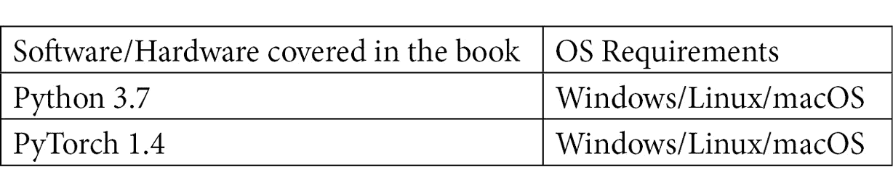

# 零、前言

在互联网时代，每天从社交媒体和其他平台产生越来越多的文本数据，能够理解这些数据是一项至关重要的技能。这本书将帮助你为**自然语言处理** ( **NLP** )任务建立深度学习模型，这将帮助你从文本中提取有价值的见解。

我们将从了解如何安装 PyTorch 和使用 CUDA 来加快处理速度开始。然后，您将通过实际例子探索 NLP 架构是如何工作的。后面的章节将指导你理解一些重要的原则，比如词嵌入、CBOW 和 PyTorch 中的标记化。然后，您将学习一些处理文本数据的技术，以及深度学习如何用于 NLP 任务。接下来，我们将演示如何实现深度学习和神经网络架构，以构建允许您分类和翻译文本并执行情感分析的模型。最后，您将学习如何构建高级 NLP 模型，如对话聊天机器人。

到本书结束时，您将了解如何通过 PyTorch 使用深度学习来解决不同的 NLP 问题，以及如何构建模型来解决这些问题。

# 这本书是给谁的

本 PyTorch 书面向 NLP 开发人员、机器学习和深度学习开发人员，或者致力于使用传统 NLP 方法和深度学习架构构建智能语言应用程序的任何人。如果你想在你的开发项目中采用现代的 NLP 技术和模型，那么这本书就是为你准备的。Python 编程的工作知识和 NLP 任务的基本工作知识是必须的。

# 这本书涵盖了什么

[*第 1 章*](B12365_01_Final_JC_ePub.xhtml#_idTextAnchor015) *，机器学习和深度学习的基础*，提供了机器学习和神经网络基础方面的概述。

[*第 2 章*](B12365_02_FInal_JC_ePub.xhtml#_idTextAnchor029) *，开始使用 PyTorch 1.x for NLP* ，向您展示如何下载、安装和启动 PyTorch。我们还将介绍该软件包的一些基本功能。

[*第 3 章*](B12365_03_Final_JC_ePub.xhtml#_idTextAnchor051) *，NLP 和文本嵌入*，向您展示如何为 NLP 创建文本嵌入，并在基本语言模型中使用它们。

[*第 4 章*](B12365_04_Final_JC_ePub.xhtml#_idTextAnchor070) *，文本预处理、词干化、词条化*，向您展示如何预处理文本数据，以用于 NLP 深度学习模型。

[*第五章*](B12365_05_Final_JC_ePub.xhtml#_idTextAnchor092) *，循环神经网络和情感分析*，贯穿循环神经网络的基础知识，并向您展示如何使用它们从零开始构建情感分析模型。

[*第 6 章*](B12365_06_Final_JC_ePub.xhtml#_idTextAnchor112) *，用于文本分类的卷积神经网络*，贯穿了卷积神经网络的基本原理，并向您展示了如何使用它们来构建一个用于文本分类的工作模型。

[*第 7 章*](B12365_07_Final_JC_ePub.xhtml#_idTextAnchor124) *，使用序列到序列神经网络的文本翻译*，介绍了用于深度学习的序列到序列模型的概念，并贯穿了如何使用它们来构建将文本翻译成另一种语言的模型。

[*第 8 章*](B12365_08_Final_JC_ePub.xhtml#_idTextAnchor139) *，使用基于注意力的神经网络构建聊天机器人*，涵盖了在序列到序列深度学习模型中使用的注意力概念，还向您展示了如何使用它们从头开始构建一个完全可用的聊天机器人。

[*第 9 章*](B12365_09_Final_JC_ePub.xhtml#_idTextAnchor156) *，前面的路*，涵盖了 NLP 深度学习中目前使用的一些最先进的模型，并展望了 NLP 领域未来面临的一些挑战和问题。

# 为了充分利用这本书

您需要在您的计算机上安装一个 Python 版本。所有代码示例都已使用 3.7 版进行了测试。对于本书的深度学习组件，您还需要一个 PyTorch 工作环境。所有深度学习模型都是用 1.4 版本构建的；但是，大部分代码应该可以在以后的版本中使用。



本书的代码中使用了几个 Python 库；但是，这些将在相关章节中介绍。

**如果你正在使用这本书的数字版本，我们建议你自己键入代码或者通过 GitHub 库访问代码(下一节提供链接)。这样做将帮助您避免任何与复制和粘贴代码相关的潜在错误。**

# 下载示例代码文件

你可以从你在[www.packt.com](http://packt.com)的账户下载本书的示例代码文件。如果你在别处购买了这本书，你可以访问 www.packtpub.com/support 并注册，文件会直接通过电子邮件发送给你。

您可以按照以下步骤下载代码文件:

1.  在[www.packt.com](http://packt.com)登录或注册。
2.  选择**支架**拉环。
3.  点击**代码下载**。
4.  在**搜索**框中输入图书名称，并按照屏幕指示进行操作。

下载文件后，请确保使用最新版本的解压缩或解压文件夹:

*   WinRAR/7-Zip for Windows
*   适用于 Mac 的 Zipeg/iZip/UnRarX
*   用于 Linux 的 7-Zip/PeaZip

这本书的代码包也托管在 GitHub 的 https://GitHub . com/packt publishing/Hands-On-Natural-Language-Processing-with-py torch-1 . x 上。如果代码有更新，它将在现有的 GitHub 库中更新。

我们也有来自我们丰富的书籍和视频目录的其他代码包，可以在[https://github.com/PacktPublishing/](https://github.com/PacktPublishing/)获得。看看他们！

# 下载彩色图像

我们还提供了一个 PDF 文件，其中有本书中使用的截图/图表的彩色图像。可以在这里下载:[https://static . packt-cdn . com/downloads/9781789802740 _ color images . pdf](https://static.packt-cdn.com/downloads/9781789802740_ColorImages.pdf)。

# 使用的约定

本书通篇使用了许多文本约定。

`Code in text`:表示文本中的码字、数据库表名、文件夹名、文件名、文件扩展名、路径名、伪 URL、用户输入和 Twitter 句柄。下面是一个例子:“将下载的`WebStorm-10*.dmg`磁盘镜像文件挂载为系统中的另一个磁盘。”

代码块设置如下:

```
import torch
```

当我们希望将您的注意力吸引到代码块的特定部分时，相关的行或项目以粗体显示:

```
word_1 = ‘cat'
word_2 = ‘dog'
word_3 = ‘bird'
```

任何命令行输入或输出都按如下方式编写:

```
$ mkdir flaskAPI
$ cd flaskAPI
```

**粗体**:表示新术语、重要单词或您在屏幕上看到的单词。例如，菜单或对话框中的单词出现在文本中，如下所示。下面是一个例子:“从**管理**面板中选择**系统信息**

提示或重要注意事项

像这样出现。

# 取得联系

我们随时欢迎读者的反馈。

`customercare@packtpub.com`。

**勘误表**:虽然我们已经尽力确保内容的准确性，但错误还是会发生。如果你在这本书里发现了一个错误，请告诉我们，我们将不胜感激。请访问[www.packtpub.com/support/errata](https://www.packtpub.com/support/errata)，选择您的图书，点击勘误表提交表格链接，输入详细信息。

`copyright@packt.com`带有链接的素材。

**如果你有兴趣成为一名作家**:如果有你擅长的主题，并且你有兴趣写书或投稿，请访问 authors.packtpub.com。

# 评论

请留下评论。一旦你阅读并使用了这本书，为什么不在你购买它的网站上留下评论呢？潜在的读者可以看到并使用您不带偏见的意见来做出购买决定，我们 Packt 可以了解您对我们产品的看法，我们的作者可以看到您对他们的书的反馈。谢谢大家！

更多关于 Packt 的信息，请访问[packt.com](http://packt.com)。