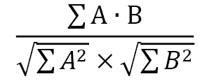
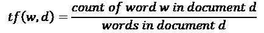
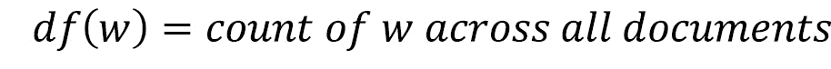
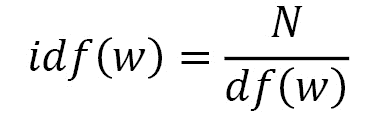
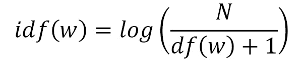
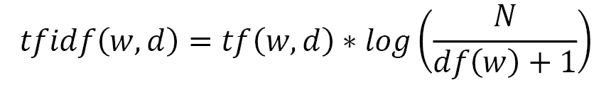

# *第三章*:自然语言处理和文本嵌入

深度学习中有很多不同的文本表示方式。虽然我们已经介绍了基本的**单词袋** ( **BoW** )表示，但不出所料，还有一种更复杂的表示文本数据的方式，称为嵌入。虽然弓形向量仅作为句子中单词的计数，但是嵌入有助于从数字上定义某些单词的实际含义。

在这一章中，我们将探索文本嵌入，并学习如何使用连续弓模型创建嵌入。然后我们将继续讨论 n-grams 以及如何在模型中使用它们。我们还将介绍标记、分块和标记化用于将 NLP 分解成不同组成部分的各种方法。最后，我们将看看 TF-IDF 语言模型，以及它们如何有助于我们的模型向不经常出现的单词加权。

本章将涵盖以下主题:

*   词嵌入
*   探索 CBOW
*   探索 n 元语法
*   标记化
*   词性标注和组块
*   TF-IDF

# 技术要求

手套矢量可以从[https://nlp.stanford.edu/projects/glove/](https://nlp.stanford.edu/projects/glove/)下载。建议使用`glove.6B.50d.txt`文件，因为它比其他文件小得多，处理起来也快得多。本章后面的部分将需要 NLTK。本章的所有代码可以在[https://github . com/packt publishing/Hands-On-Natural Language-Processing-with-py torch-1 . x](https://github.com/PacktPublishing/Hands-On-Natural-Language-Processing-with-PyTorch-1.x)找到。

# 自然语言处理的嵌入

单词没有自然的方式来表达它们的意思。在图像中，我们已经有了丰富的向量表示(包含图像中每个像素的值)，因此拥有一个类似的丰富的单词向量表示显然是有益的。当语言的部分以高维向量格式表示时，它们被称为**嵌入**。通过分析单词语料库，并通过确定哪些单词频繁出现在一起，我们可以为每个单词获得一个长度为 *n* 的向量，该向量更好地表示每个单词与所有其他单词的语义关系。我们之前看到，我们可以很容易地将单词表示为一个热点编码向量:


图 3.1–独热编码矢量

另一方面，嵌入是长度为 *n* (在下面的例子中， *n* = 3)的向量，可以取任何值:


图 3.2–n = 3 的向量

这些嵌入表示单词在 *n* 维空间中的向量(其中 *n* 是嵌入向量的长度)，在该空间中具有相似向量的单词被认为在含义上更相似。虽然这些嵌入可以是任何大小，但它们通常比 BoW 表示具有更低的维数。BOW 表示需要整个语料库长度的向量，当查看整个语言时，向量可能很快变得非常大。虽然嵌入具有足够高的维度来表示单个单词，但是它们通常不会比几百个维度大很多。此外，弓形向量通常非常稀疏，主要由零组成，而嵌入包含丰富的数据，并且每个维度都对单词的整体表示有贡献。较低的维度和它们不稀疏的事实使得在嵌入上执行深度学习比在 BOW 表示上执行更有效。

## 手套

我们可以下载一组预先计算的词嵌入来演示它们是如何工作的。为此，我们将使用**全局向量进行单词表示** ( **手套**)嵌入，可以从这里下载:[https://nlp.stanford.edu/projects/glove/](https://nlp.stanford.edu/projects/glove/)。这些嵌入在非常大的 NLP 数据语料库上计算，并在单词共现矩阵上训练。这是基于一个概念，即出现在一起的单词更有可能有相似的意思。例如，单词*孙*可能更频繁地与单词*热*一起出现，而不是与单词*冷*一起出现，因此更有可能的是，*孙*和*热*被认为更相似。

我们可以通过检查单个手套向量来验证这一点:

1.  我们首先创建一个简单的函数，从文本文件中加载我们的手套向量。这只是构建了一个字典，其中索引是语料库中的每个单词，值是嵌入向量:

    ```
    def loadGlove(path):     file = open(path,'r')     model = {}     for l in file:         line = l.split()         word = line[0]         value = np.array([float(val) for val in                           line[1:]])         model[word] = value     return model glove = loadGlove('glove.6B.50d.txt')
    ```

2.  This means we can access a single vector by just calling it from the dictionary:

    ```
    glove['python']
    ```

    这导致输出如下:

    

    图 3.3–矢量输出

    我们可以看到，这返回了单词 Python 的 50 维向量嵌入。我们现在将引入**余弦相似度**的概念来比较两个向量有多相似。如果在 n 维空间中向量之间的角度为 0 度，向量的相似度为 1。具有高余弦相似性的值可以被认为是相似的，即使它们不相等。这可以使用下面的公式来计算，其中 A 和 B 是被比较的两个嵌入向量:

    
3.  We can calculate this easily in Python using the `cosine_similarity()` function from `Sklearn`. We can see that `cat` and `dog` have similar vectors as they are both animals:

    ```
    cosine_similarity(glove['cat'].reshape(1, -1), glove['dog'].reshape(1, -1))
    ```

    这会产生以下输出:

    

    图 3.4–猫和狗的余弦相似性输出

4.  However, `cat` and `piano` are quite dissimilar as they are two seemingly unrelated items:

    ```
    cosine_similarity(glove['cat'].reshape(1, -1), glove['piano'].reshape(1, -1))
    ```

    这会产生以下输出:


图 3.5–猫和钢琴的余弦相似性输出

## 嵌入操作

因为嵌入是向量，我们可以对它们执行操作。例如，假设我们采用以下排序的嵌入，并计算如下:

*女王-女人+男人*

有了这个，我们就可以近似为*王*嵌入了。这实质上是将来自*女王*的*女人*向量分量替换为*男人*向量，以达到这种近似。我们可以用图形说明如下:


图 3.6–示例的图示

注意，在这个例子中，我们用二维图形来说明这一点。在我们嵌入的例子中，这发生在 50 维空间中。虽然这并不精确，但我们可以验证我们计算的向量确实与**国王**的手套向量相似:

```
predicted_king_embedding = glove['queen'] - glove['woman'] + glove['man']
cosine_similarity(predicted_king_embedding.reshape(1, -1), glove['king'].reshape(1, -1))
```

这会产生以下输出:


图 3.7–手套向量的输出

虽然手套嵌入是非常有用的预先计算的嵌入，但实际上我们有可能计算出自己的嵌入。当我们分析一个特别独特的语料库时，这可能是有用的。例如，Twitter 上使用的语言可能与 Wikipedia 上使用的语言不同，因此在一个平台上训练的嵌入可能对另一个平台没有用。我们现在将演示如何使用连续的单词包来计算我们自己的嵌入。

# 探索 CBOW

**连续** **词袋(CBOW)** 模型构成了 Word2Vec 的一部分——word 2 vec 是谷歌为了获得词的矢量表示而创建的模型。通过在非常大的语料库上运行这些模型，我们能够获得单词的详细表示，这些单词表示它们彼此之间的语义和上下文相似性。Word2Vec 模型由两个主要组件组成:

*   **CBOW** :这个模型试图在给定周围单词的情况下，预测文档中的目标单词。
*   **Skip-gram** :与 CBOW 相反；该模型试图在给定目标单词的情况下预测周围的单词。

由于这些模型执行相似的任务，我们现在只关注其中一个，特别是 CBOW。这个模型的目的是预测一个单词(**目标单词**)，给定它周围的其他单词(称为**上下文**单词)。考虑上下文单词的一种方式可以是简单到直接在句子中的目标单词之前使用单词来预测目标单词，而更复杂的模型可以在目标单词之前和之后使用几个单词。考虑下面的句子:

*PyTorch 是一个深度学习框架*

假设我们想要预测单词*深度*，给定上下文单词:

*PyTorch 是一个{target_word}学习框架*

我们可以从几个方面来看待这个问题:


图 3.8–上下文和表示表

对于我们的 CBOW 模型，我们将使用长度为 2 的窗口，这意味着对于我们模型的( *X，y* )输入/输出对，我们使用*(【n-2，n-1，n+1，n+2，n】)*，其中 *n* 是我们预测的目标词。

使用这些作为我们的模型输入，我们将训练一个包含嵌入层的模型。这个嵌入层在我们的语料库中自动形成单词的 n 维表示。然而，首先，该层用随机权重初始化。这些参数将使用我们的模型来学习，以便在我们的模型完成训练后，该嵌入层可以用于以嵌入的向量表示来编码我们的语料库。

## CBOW 架构

我们现在将设计模型的架构,以便了解我们的嵌入。这里，我们的模型接受四个单词的输入(两个在目标单词之前，两个在目标单词之后),并根据输出(目标单词)训练它。以下图示说明了这种情况可能会是什么样子:


图 3.9–CBOW 架构

我们的输入单词首先通过嵌入层，表示为大小为(n，l)的张量，其中 n 是我们嵌入的指定长度，l 是我们语料库中的单词数量。这是因为语料库中的每个单词都有自己独特的张量表示。

使用来自我们的四个上下文单词的组合(相加)嵌入，这然后被馈送到完全连接的层，以便对照我们的上下文单词的嵌入表示来学习我们的目标单词的最终分类。请注意，我们的预测/目标单词被编码为一个向量，这是我们语料库的长度。这是因为我们的模型有效地预测了语料库中每个词成为目标词的概率，最终的分类是概率最高的一个。然后，我们获得一个损耗，通过我们的网络反向传播，并更新完全连接层上的参数，以及嵌入本身。

这种方法有效的原因是因为我们学习的嵌入代表语义相似性。假设我们在以下方面训练我们的模型:

*X = ["是"，"一"，"学习"，"框架"]；y = "deep"*

我们的模型本质上学习的是我们的目标词的组合嵌入表示在语义上与我们的目标词相似。如果我们在足够大的单词语料库上重复这一过程，我们会发现我们的词嵌入开始类似于我们之前看到的手套嵌入，其中语义相似的单词在嵌入空间中彼此出现。

## 建筑 CBOW

我们现在将从头开始运行构建 CBOW 模型，从而演示如何学习我们的嵌入向量:

1.  我们首先定义一些文本并执行一些基本的文本清理，删除基本的标点符号并将其全部转换成小写:

    ```
    text = text.replace(',','').replace('.','').lower().                            split()
    ```

2.  我们首先定义我们的语料库及其长度:

    ```
    corpus = set(text) corpus_length = len(corpus)
    ```

3.  请注意，我们使用集合而不是列表，因为我们只关心文本中的唯一单词。然后我们建立我们的语料库索引和反向语料库索引。我们的语料库索引将允许我们获得给定单词本身的单词索引，这将在对我们的单词进行编码以进入我们的网络时非常有用。给定索引值，我们的反向语料库索引允许我们获得一个单词，该单词将用于将我们的预测转换回单词:

    ```
    word_dict = {} inverse_word_dict = {} for i, word in enumerate(corpus):     word_dict[word] = i     inverse_word_dict[i] = word
    ```

4.  Next, we encode our data. We loop through our corpus and for each target word, we capture the context words (the two words before and the two words after). We append this with the target word itself to our dataset. Note how we begin this process from the third word in our corpus (index = `2`) and stop it two steps before the end of the corpus. This is because the two words at the beginning won't have two words before them and, similarly, the two words at the end won't have two words after them:

    ```
    data = []
    for i in range(2, len(text) - 2):
        sentence = [text[i-2], text[i-1],
                    text[i+1], text[i+2]]
        target = text[i]
        data.append((sentence, target))

    print(data[3])
    ```

    这会产生以下输出:

    

    图 3.10–编码数据

5.  We then define the length of our embeddings. While this can technically be any number you wish, there are some tradeoffs to consider. While higher-dimensional embeddings can lead to a more detailed representation of the words, the feature space also becomes sparser, which means high-dimensional embeddings are only appropriate for large corpuses. Furthermore, larger embeddings mean more parameters to learn, so increasing the embedding size can increase training time significantly. We are only training on a very small dataset, so we have opted to use embeddings of size `20`:

    ```
    embedding_length = 20
    ```

    接下来，我们在 PyTorch 中定义我们的`CBOW`模型。我们定义了我们的嵌入层，这样它接受一个语料库长度的向量并输出一个嵌入。我们将我们的线性层定义为一个完全连通的层，它嵌入并输出一个`64`的向量。我们将最后一层定义为分类层，其长度与我们的文本语料库相同。

6.  我们通过获得并求和所有输入上下文单词的嵌入来定义我们的前向传递。然后，这通过具有 ReLU 激活功能的全连接层，并最终进入分类层，该分类层预测语料库中的哪个单词最对应于上下文单词的总计嵌入:

    ```
    class CBOW(torch.nn.Module):     def __init__(self, corpus_length, embedding_dim):         super(CBOW, self).__init__()                  self.embeddings = nn.Embedding(corpus_length,                             embedding_dim)         self.linear1 = nn.Linear(embedding_dim, 64)         self.linear2 = nn.Linear(64, corpus_length)                  self.activation_function1 = nn.ReLU()         self.activation_function2 = nn.LogSoftmax                                        (dim = -1)     def forward(self, inputs):         embeds = sum(self.embeddings(inputs)).view(1,-1)         out = self.linear1(embeds)         out = self.activation_function1(out)         out = self.linear2(out)         out = self.activation_function2(out)         return out
    ```

7.  我们还可以定义一个`get_word_embedding()`函数，它将允许我们在模型被训练后提取一个给定单词的嵌入:

    ```
    def get_word_emdedding(self, word): word = torch.LongTensor([word_dict[word]]) return self.embeddings(word).view(1,-1)
    ```

8.  现在，我们准备训练我们的模型。我们首先创建模型的一个实例，并定义损失函数和优化器:

    ```
    model = CBOW(corpus_length, embedding_length) loss_function = nn.NLLLoss() optimizer = torch.optim.SGD(model.parameters(), lr=0.01)
    ```

9.  We then create a helper function that takes our input context words, gets the word indexes for each of these, and transforms them into a tensor of length 4, which forms the input to our neural network:

    ```
    def make_sentence_vector(sentence, word_dict):
        idxs = [word_dict[w] for w in sentence]
        return torch.tensor(idxs, dtype=torch.long)
    print(make_sentence_vector(['stormy','nights','when','the'], word_dict))
    ```

    这会产生以下输出:

    

    图 3.11–张量值

10.  Now, we train our network. We loop through 100 epochs and for each pass, we loop through all our context words, that is, target word pairs. For each of these pairs, we load the context sentence using `make_sentence_vector()` and use our current model state to obtain predictions. We evaluate these predictions against our actual target in order to obtain our loss. We backpropagate to calculate the gradients and step through our optimizer to update the weights. Finally, we sum all our losses for the epoch and print this out. Here, we can see that our loss is decreasing, showing that our model is learning:

    ```
    for epoch in range(100):
        epoch_loss = 0
        for sentence, target in data:
            model.zero_grad()
            sentence_vector = make_sentence_vector                               (sentence, word_dict)  
            log_probs = model(sentence_vector)
            loss = loss_function(log_probs, torch.tensor(
            [word_dict[target]], dtype=torch.long))
            loss.backward()
            optimizer.step()
            epoch_loss += loss.data
        print('Epoch: '+str(epoch)+', Loss: ' + str(epoch_loss.item()))
    ```

    这导致以下输出:

    

    图 3.12–培训我们的网络

    既然我们的模型已经训练好了，我们就可以进行预测了。我们定义了几个函数来允许我们这样做。`get_predicted_result()`从预测数组中返回预测单词，而我们的`predict_sentence()`函数基于上下文单词进行预测。

11.  We split our sentences into individual words and transform them into an input vector. We then create our prediction array by feeding this into our model and get our final predicted word by using the `get_predicted_result()` function. We also print the two words before and after the predicted target word for context. We can run a couple of predictions to validate our model is working correctly:

    ```
    def get_predicted_result(input, inverse_word_dict):
        index = np.argmax(input)
        return inverse_word_dict[index]
    def predict_sentence(sentence):
        sentence_split = sentence.replace('.','').lower().                              split()
        sentence_vector = make_sentence_vector(sentence_                      split, word_dict)
        prediction_array = model(sentence_vector).data.                             numpy()
        print('Preceding Words: {}\n'.format(sentence_           split[:2]))
        print('Predicted Word: {}\n'.format(get_predicted_            result(prediction_array[0], inverse_            word_dict)))
        print('Following Words: {}\n'.format(sentence_           split[2:]))
    predict_sentence('to see leap and')
    ```

    这会产生以下输出:

    

    图 3.13–预测值

12.  Now that we have a trained model, we are able to use the `get_word_embedding()` function in order to return the 20 dimensions word embedding for any word in our corpus. If we needed our embeddings for another NLP task, we could actually extract the weights from the whole embedding layer and use this in our new model:

    ```
    print(model.get_word_emdedding('leap'))
    ```

    这会产生以下输出:


图 3.14-编辑模型后的张量值

这里，我们演示了如何训练一个 CBOW 模型来创建词嵌入。实际上，要为语料库创建可靠的嵌入，我们需要一个非常大的数据集来真正捕捉所有单词之间的语义关系。因此，对于您的模型，最好使用预先训练好的嵌入，例如 GLoVe，它已经在非常大的数据语料库上被训练过,但是在某些情况下，最好从头开始训练一组全新的嵌入；例如，当分析不类似于正常 NLP 的数据语料库时(例如，Twitter 数据，其中用户可能使用简短的缩写而不使用完整的句子)。

# 探索 n 元语法

在我们的 CBOW 模型中，我们成功地表明，单词的意思与其周围单词的上下文有关。不仅是我们的上下文单词影响着句子中单词的意思，也影响着这些单词的顺序。考虑下面的句子:

*猫坐在狗身上*

狗坐在猫身上

如果你把这两个句子转换成一个单词袋的表示，我们会发现它们是相同的。然而，通过阅读句子，我们知道它们有完全不同的意思(事实上，它们是完全相反的！).这清楚地表明，一个句子的意思不仅仅是它所包含的单词，而是它们出现的顺序。一种试图捕捉句子中单词顺序的简单方法是使用 n 元语法。

如果我们对我们的句子进行计数，但不是对单个单词进行计数，我们现在对出现在句子中的不同的两个单词配对进行计数，这就是所谓的使用**双字母组合**的:


图 3.15-二元图的表格表示

我们可以这样表示:

*猫坐在狗身上->【1，1，1，0，1，1】*

*狗坐在猫身上->【1，1，0，1，1，1】*

这些成对的单词试图捕捉单词在句子中出现的顺序，而不仅仅是它们的频率。我们的第一句话包含双字 *cat sat* ，而另一句话包含 *dog sat* 。这些二元模型显然有助于为我们的句子添加更多的上下文，而不仅仅是使用原始字数。

我们不局限于成对的词。我们还可以看看不同的单词三元组，称为**三元组**，或者实际上任何不同数量的单词。我们可以使用 n-gram 作为我们深度学习模型的输入，而不仅仅是一个单词，但在使用 n-gram 模型时，值得注意的是，你的特征空间可能会非常快地变得非常大，并可能使机器学习非常慢。如果一本字典包含英语中的所有单词，那么一本包含所有不同单词对的字典将会大几个数量级！

## N 元语言建模

n-grams 帮助我们做的一件事是理解自然语言是如何形成的。如果我们认为语言是由更小的词对(二元模型)而不是单个词来表示的，我们可以开始将语言建模为概率模型，其中一个词在句子中出现的概率取决于在它之前出现的词。

在 **unigram** 模型中，我们假设基于语料库或文档中单词的分布，所有单词都具有有限的出现概率。让我们看一个只有一句话的文档:

*我的名字是我的名字*

基于这个句子，我们可以生成单词的分布，其中每个单词基于其在文档中的频率具有给定的出现概率:


图 3.16-单图的表格表示

然后，我们可以从这个分布中随机抽取单词，以生成新的句子:

*名字叫名字我的我的*

但是正如我们所看到的，这句话没有任何意义，说明了使用 unigram 模型的问题。因为每个单词出现的概率独立于句子中的所有其他单词，所以没有考虑单词出现的顺序或上下文。这就是 n 元模型有用的地方。

我们现在将考虑使用**二元模型**语言模型。此计算采用某个单词出现的概率，给定出现在它前面的单词:


这意味着，给定前一个单词，单词出现的概率是单词 n 元语法出现的概率除以前一个单词出现的概率。假设我们试图预测下面句子中的下一个单词:

我最喜欢的语言是 _ _

除此之外，我们还得到了以下 n-gram 和单词概率:


图 3.17-概率的表格表示

有了这个，我们就可以计算 Python 出现的概率，假设前面的单词*是*出现的概率只有 20%，而*英语*出现的概率只有 10%。我们可以进一步扩展这个模型，使用三元模型或任何我们认为合适的词的 n 元模型表示。我们已经证明了 n-gram 语言建模可以用来将关于单词之间关系的进一步信息引入到我们的模型中，而不是天真地假设单词是独立分布的。

# 标记化

接下来，我们将学习 NLP 的标记化，这是一种为进入我们的模型而预处理文本的方法。标记化把我们的句子分成更小的部分。这可能包括将一个句子拆分成单个的单词，或者将整个文档拆分成单个的句子。这是 NLP 的一个基本预处理步骤，可以用 Python 相当简单地完成:

1.  We first take a basic sentence and split this up into individual words using the **word tokenizer** in NLTK:

    ```
    text = 'This is a single sentence.'
    tokens = word_tokenize(text)
    print(tokens)
    ```

    这会产生以下输出:

    

    图 3.18–拆分句子

2.  Note how a period (`.`) is considered a token as it is a part of natural language. Depending on what we want to do with the text, we may wish to keep or dispose of the punctuation:

    ```
    no_punctuation = [word.lower() for word in tokens if word.isalpha()]
    print(no_punctuation)
    ```

    这会产生以下输出:

    

    图 3.19–删除标点符号

3.  We can also tokenize documents into individual sentences using the **sentence** **tokenizer**:

    ```
    text = "This is the first sentence. This is the second sentence. A document contains many sentences."
    print(sent_tokenize(text))
    ```

    这会产生以下输出:

    

    图 3.20-将多个句子拆分成单个句子

4.  Alternatively, we can combine the two to split into individual sentences of words:

    ```
    print([word_tokenize(sentence) for sentence in sent_tokenize(text)])
    ```

    这会产生以下输出:

    

    图 3.21–将多个句子拆分成单词

5.  One other optional step in the process of tokenization, which is the removal of stopwords. Stopwords are very common words that do not contribute to the overall meaning of a sentence. These include words such as *a*, `I`, and `or`. We can print a complete list from NLTK using the following code:

    ```
    stop_words = stopwords.words('english')
    print(stop_words[:20])
    ```

    这会产生以下输出:

    

    图 3.22–显示停用词

6.  We can easily remove these stopwords from our words using basic list comprehension:

    ```
    text = 'This is a single sentence.'
    tokens = [token for token in word_tokenize(text) if token not in stop_words]
    print(tokens)
    ```

    这会产生以下输出:


图 3.23–删除停用词

虽然一些 NLP 任务(如预测句子中的下一个单词)需要停用词，但其他任务(如判断电影评论的情绪)不需要停用词，因为停用词对文档的整体意义没有太大贡献。在这些情况下，删除停用词可能更好，因为这些常用词的频率意味着它们会不必要地增加我们的特征空间，这将增加我们的模型训练所需的时间。

# 词性标注和组块

到目前为止，我们已经介绍了几种表示单词和句子的方法，包括单词袋、嵌入和 n 元语法。然而，这些表示无法捕捉任何给定句子的结构。在自然语言中，不同的单词在一个句子中可以有不同的功能。请考虑以下情况:

*大狗正在床上睡觉*

我们可以根据每个单词在句子中的功能来“标记”这篇文章的各个单词。因此，前一句变成如下:

*->大- >狗- >正- >睡觉- >趴- >床- >床*

*限定词- >形容词- >名词- >动词- >动词- >介词- >限定词- >名词*

这些**词性**包括但不限于以下:


图 3.24-词类

这些不同的词性可以用来更好地理解句子的结构。例如，在英语中，形容词经常位于名词之前。我们可以在模型中使用这些词类以及它们之间的关系。例如，如果我们预测句子中的下一个单词，而上下文单词是形容词，我们知道下一个单词是名词的概率很高。

## 标记

词性**标注**是将这些词性标签分配给句子中的各个单词的行为。幸运的是，NTLK 有一个内置的标记功能，所以我们不需要训练我们自己的分类器来做到这一点:

```
sentence = "The big dog is sleeping on the bed"
token = nltk.word_tokenize(sentence)
nltk.pos_tag(token)
```

这会产生以下输出:


图 3.25-词类分类

这里，我们简单地对文本进行标记，并调用函数来标记句子中的每个单词。这将为句子中的每个单词返回一个标签。我们可以通过调用代码上的`upenn_tagset()`来解码这个标签的含义。在这种情况下，我们可以看到“`VBG`”对应一个动词:

```
nltk.help.upenn_tagset("VBG")
```

这会产生以下输出:


图 3.26–VBG 的解释

使用预先训练好的词性标注器是有益的，因为它们不只是充当字典，查找句子中的单个单词；他们还利用单词在句子中的上下文来分配它的意思。考虑下面的句子:

他喝了水

我会给我们买些饮料

在这些句子中，单词*代表两种不同的词性。在第一句中，*饮料*是指动词；动词*喝酒的现在时。*第二句中，*饮料*指名词；单数的复数*饮料*。我们的预训练标记器能够确定这些单个单词的上下文，并执行准确的词性标记。*

## 分块

**组块**在我们最初的词性标注的基础上扩展了，旨在将我们的句子组织成小组块，其中每个组块代表一小部分词性。

我们可能希望将文本分割成**实体**，其中每个实体都是一个独立的对象或事物。例如，*红宝书*指的不是三个独立的实体，而是用三个字描述的单一实体。我们可以很容易地再次使用 NLTK 实现分块。我们必须首先使用正则表达式定义一个匹配的语法模式。问题中的模式寻找**名词短语** ( **NP** )，其中名词短语被定义为**限定词** ( **DT** )，后跟**可选形容词** ( **JJ** )，后跟**名词** ( **NN** ):

```
expression = ('NP: {<DT>?<JJ>*<NN>}')
```

使用`RegexpParser()`函数，我们可以匹配这个表达式的出现，并将它们标记为名词短语。然后我们可以打印结果树，显示标记的短语。在我们的例句中，我们可以看到*大狗*和*床*被标记为两个独立的名词短语。我们能够匹配任何我们认为合适的使用正则表达式定义的文本块:

```
tagged = nltk.pos_tag(token)
REchunkParser = nltk.RegexpParser(expression)
tree = REchunkParser.parse(tagged)
print(tree)
```

这会产生以下输出:


图 3.27-树形表示

# TF-IDF

**TF-IDF** 是我们可以学习的另一种更好地表示自然语言的技术。它通常用于文本挖掘和信息检索，以根据搜索项匹配文档，但也可以与嵌入结合使用，以更好地以嵌入形式表示句子。让我们来看看下面这个短语:

这是一只小长颈鹿

假设我们想要一个单独的嵌入来表示这个句子的意思。我们可以做的一件事就是简单地平均这个句子中五个单词的嵌入量:


图 3.28-词嵌入

然而，这种方法对句子中的所有单词赋予了相同的权重。你认为所有的单词对句子意思的贡献是一样的吗？**这个**和**一个**在英语中是很常见的单词，但是**长颈鹿**却很少见。因此，我们可能希望给更少的单词分配更多的权重。这种方法被称为**术语频率-逆文档频率** ( **TD-IDF** )。我们现在将演示如何为我们的文档计算 TF-IDF 权重。

## 计算 TF-IDF

顾名思义，TF-IDF 由两个独立的部分组成:词频和逆文档频。术语频率是特定于文档的度量，对给定单词在被分析的文档中的频率进行计数:



注意，我们用文档中的总字数来划分这个度量，因为较长的文档更有可能包含任何给定的单词。如果一个单词在文档中出现多次，它将获得更高的术语频率。然而，这与我们希望 TF-IDF 权重所做的正好相反，因为我们希望对文档中出现的罕见单词给予更高的权重。这就是 IDF 发挥作用的地方。

文档频率测量正在分析单词的整个文档语料库中的文档数量，逆文档频率计算总文档与文档频率的比率:



如果我们有一个包含 100 个文档的语料库，并且我们的单词在其中出现了五次，那么我们将得到一个 20 的反向文档频率。这意味着在所有文档中出现频率较低的单词具有较高的权重。现在，考虑 100，000 个文档的语料库。如果一个单词只出现一次，则其 IDF 为 100，000，而出现两次的单词的 IDF 为 50，000。这些非常大且易变的 IDF 对于我们的计算来说并不理想，所以我们必须首先用日志将它们归一化。请注意，如果我们为语料库中没有出现的单词计算 TF-IDF，我们如何在计算中添加 1 以防止被 0 除:



这使得我们的最终 TF-IDF 方程如下所示:



我们现在可以演示如何用 Python 实现这一点，并将 TF-IDF 权重应用到我们的嵌入中。

## 实施 TF-IDF

这里，我们将使用来自 NLTK 数据集的 Emma 语料库在数据集上实现 TF-IDF。这个数据集由简·奥斯汀的书 *Emma* 中的句子组成，我们希望为这些句子中的每一个计算一个嵌入式向量表示:

1.  我们首先导入数据集，循环遍历每个句子，删除所有标点符号和非字母数字字符(如星号)。我们选择在我们的数据集中保留停用词，以展示 TF-IDF 如何处理这些词，因为这些词出现在许多文档中，因此具有非常低的 IDF。我们在语料库中创建了一个已解析句子的列表和一组不同的单词:

    ```
    emma = nltk.corpus.gutenberg.sents('austen-emma.txt') emma_sentences = [] emma_word_set = [] for sentence in emma:     emma_sentences.append([word.lower() for word in          sentence if word.isalpha()])     for word in sentence:         if word.isalpha():             emma_word_set.append(word.lower()) emma_word_set = set(emma_word_set)
    ```

2.  Next, we create a function that will return our Term Frequencies for a given word in a given document. We take the length of the document to give us the number of words and count the occurrences of this word in the document before returning the ratio. Here, we can see that the word `ago` appears in the sentence once and that the sentence is 41 words long, giving us a Term Frequency of 0.024:

    ```
    def TermFreq(document, word):
        doc_length = len(document)
        occurances = len([w for w in document if w == word])
        return occurances / doc_length
    TermFreq(emma_sentences[5], 'ago')
    ```

    这会产生以下输出:

    

    图 3.29–TF-IDF 得分

3.  接下来，我们计算我们的文档频率。为了有效地做到这一点，我们首先需要预先计算一个文档频率字典。这将遍历所有数据，并计算语料库中每个单词出现的文档数量。我们对此进行预先计算，这样我们就不必在每次希望计算给定单词的文档频率时都执行这个循环:

    ```
    def build_DF_dict():     output = {}     for word in emma_word_set:         output[word] = 0         for doc in emma_sentences:             if word in doc:                 output[word] += 1     return output          df_dict = build_DF_dict() df_dict['ago']
    ```

4.  这里，我们可以看到单词`ago`在我们的文档中出现了 32 次。使用这个字典，我们可以非常容易地通过用文档总数除以我们的文档频率并取这个值的对数来计算我们的逆文档频率。请注意，当单词没有出现在语料库中时，我们如何给文档频率加 1 以避免被零除的错误:

    ```
    def InverseDocumentFrequency(word):     N = len(emma_sentences)     try:         df = df_dict[word] + 1     except:         df = 1     return np.log(N/df) InverseDocumentFrequency('ago')
    ```

5.  Finally, we simply combine the Term Frequency and Inverse Document Frequency to get the TF-IDF weighting for each word/document pair:

    ```
    def TFIDF(doc, word):
        tf = TF(doc, word)
        idf = InverseDocumentFrequency(word)
        return tf*idf
    print('ago - ' + str(TFIDF(emma_sentences[5],'ago')))
    print('indistinct - ' + str(TFIDF(emma_sentences[5],'indistinct')))
    ```

    这会产生以下输出:


图 3.30–前和模糊的 TF-IDF 分数

在这里，我们可以看到，虽然单词`ago`和`indistinct`在给定文档中只出现一次，但是`indistinct`在整个语料库中出现的频率较低，这意味着它获得了更高的 TF-IDF 权重。

## 计算 TF-IDF 加权嵌入

接下来，我们可以展示如何将这些 TF-IDF 权重应用于嵌入:

1.  我们首先加载预先计算的手套嵌入，以提供语料库中单词的初始嵌入表示:

    ```
    def loadGlove(path):     file = open(path,'r')     model = {}     for l in file:         line = l.split()         word = line[0]         value = np.array([float(val) for val in                           line[1:]])         model[word] = value     return model glove = loadGlove('glove.6B.50d.txt')
    ```

2.  We then calculate an unweighted mean average of all the individual embeddings in our document to get a vector representation of the sentence as a whole. We simply loop through all the words in our document, extract the embedding from the GLoVe dictionary, and calculate the average over all these vectors:

    ```
    embeddings = []
    for word in emma_sentences[5]:
        embeddings.append(glove[word])
    mean_embedding = np.mean(embeddings, axis = 0).reshape      (1, -1)
    print(mean_embedding)
    ```

    这会产生以下输出:

    

    图 3.31–平均嵌入

3.  We repeat this process to calculate our TF-IDF weighted document vector, but this time, we multiply our vectors by their TF-IDF weighting before we average them:

    ```
    embeddings = []
    for word in emma_sentences[5]:
        tfidf = TFIDF(emma_sentences[5], word)
        embeddings.append(glove[word]* tfidf) 

    tfidf_weighted_embedding = np.mean(embeddings, axis =                               0).reshape(1, -1)
    print(tfidf_weighted_embedding)
    ```

    这会产生以下输出:

    

    图 3.32–TF-IDF 嵌入

4.  We can then compare the TF-IDF weighted embedding with our average embedding to see how similar they are. We can do this using cosine similarity, as follows:

    ```
    cosine_similarity(mean_embedding, tfidf_weighted_embedding)
    ```

    这会产生以下输出:


图 3.33–TF-IDF 和平均嵌入之间的余弦相似性

在这里，我们可以看到我们两个不同的表示非常相似。因此，虽然使用 TF-IDF 可能不会显著改变我们对给定句子或文档的表示，但它可能会对感兴趣的单词进行权衡，从而提供更有用的表示。

# 摘要

在这一章中，我们深入探讨了词嵌入及其应用。我们已经展示了如何使用连续的单词袋模型来训练它们，以及如何结合 n 元语言建模来更好地理解句子中单词之间的关系。然后，我们研究了如何将文档分割成单独的标记以便于处理，以及如何使用标记和组块来识别词性。最后，我们展示了如何使用 TF-IDF 权重来更好地表示嵌入形式的文档。

在下一章，我们将看到如何使用 NLP 进行文本预处理、词干提取和词汇化。