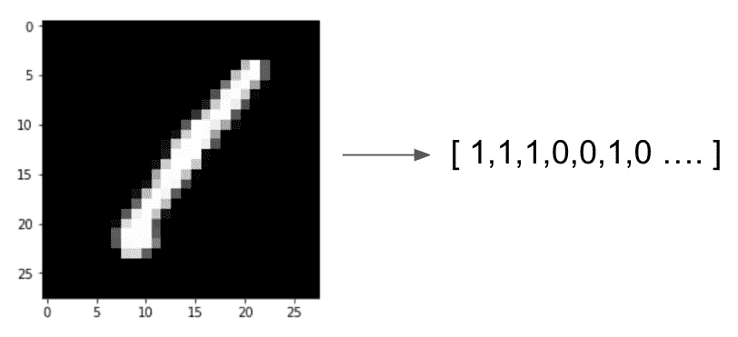

<title>B12365_06_Final_JC_ePub</title>

# *第六章*:用于文本分类的卷积神经网络

在前一章中，我们展示了如何使用 RNNs 为文本提供情感分类。然而，rnn 不是唯一可用于 NLP 分类任务的神经网络架构。**卷积神经网络**(**CNN**)是另一种这样的架构。

rnn 依赖于顺序建模，维护一个隐藏状态，然后一个字一个字地顺序遍历文本，在每次迭代中更新状态。CNN 不依赖于语言的顺序元素，而是通过单独感知句子中的每个单词并学习它与句子中周围单词的关系，来尝试从文本中学习。

尽管由于这里提到的原因，CNN 更常用于分类图像，但它们在分类文本时也很有效。虽然我们确实将文本视为一个序列，但我们也知道句子中单个单词的含义取决于它们的上下文以及它们旁边出现的单词。尽管 CNN 和 rnn 以不同的方式从文本中学习，但它们都显示出在文本分类中的有效性，并且在任何给定的情况下使用哪一种取决于任务的性质。

在这一章中，我们将探索 CNN 背后的基本理论，并从头开始构建一个用于文本分类的 CNN。我们将讨论以下主题:

*   探索 CNN
*   构建用于文本分类的 CNN

我们开始吧！

# 技术要求

本章的所有代码可以在[https://github . com/packt publishing/Hands-On-Natural Language-Processing-with-py torch-1 . x](https://github.com/PacktPublishing/Hands-On-Natural-Language-Processing-with-PyTorch-1.x)找到。

# 探索 CNN

CNN 的基础来自计算机视觉领域，但是在概念上也可以扩展到 NLP。人类大脑处理和理解图像的方式不是基于逐个像素，而是作为图像的整体地图以及图像的每个部分如何与其他部分相关联。

CNN 的一个很好的类比是人类大脑是如何处理一幅图片和一个句子的。考虑一下句子，*这是一个关于猫的句子*。当你读那个句子时，你先读第一个词，然后是第二个词，依此类推。现在，考虑一张猫的照片。通过查看第一个像素，然后是第二个像素来吸收图片中的信息是愚蠢的。相反，当我们看着某样东西时，我们立刻感知到整个图像，而不是作为一个序列。

例如，如果我们获取一幅图像的黑白表示(在这种情况下，数字 1)，我们可以将其转换为矢量表示，其中每个像素的颜色用 0 或 1 表示:



图 6.1–图像的矢量表示

然而，如果我们从机器学习的角度来考虑这个问题，并将这个向量视为我们模型的特征，那么任何单个像素是黑色或白色的事实是否会使图片更有可能或更不可能是给定的数字？右上角的白色像素是否会使图片更有可能是 4 或 7？想象一下，如果我们试图检测更复杂的东西，比如一张照片是一只狗还是一只猫。屏幕中间的一个棕色像素会让照片更有可能是猫还是狗？直观上，我们看到单个像素值在图像分类时并没有太大意义。然而，我们感兴趣的是像素之间的关系。

在我们用数字表示的例子中，我们知道一条长的垂直线很可能是 1，而任何带有闭合环的照片更可能是 0、6、8 或 9。通过识别和学习我们图像中的模式，而不是只看单个像素，我们可以更好地理解和识别这些图像。这正是 CNN 的目标。

## 卷旋

CNN 背后的基本概念是卷积。一个**卷积**本质上是一个应用于矩阵的滑动窗口函数，目的是从周围的像素中捕捉信息。在下图中，我们可以看到卷积的一个实例:


图 6.2–卷积的作用

在左边，我们有正在处理的图像，而在顶部，我们有我们希望应用的卷积内核。对于我们图像中的每一个 3x3 的块，我们将它乘以我们的内核，得到底部的卷积矩阵。然后，我们对卷积矩阵求和(或求平均值),以获得初始图像中 3×3 块的单个输出值。请注意，在我们的 5x5 初始图像中，有九个可能的 3x3 块可以覆盖在上面。当我们对初始图像中的每个 3×3 块应用这个卷积过程时，我们得到的是最终处理的 3×3 卷积。

在大型图像中(或者在 NLP 的情况下，在复杂的句子中)，我们还需要实现池层。在前面的示例中，对 5x5 图像应用 3x3 卷积会产生 3x3 输出。然而，如果我们对 100x100 像素的图像应用 3×3 卷积，这只会将输出降低到 98×98。这并没有将图像的维度降低到足以有效地执行深度学习(因为我们必须学习每个卷积层的 98x98 个参数)。因此，我们应用池层来进一步降低层的维度。

汇集层将一个函数(通常是最大值函数)应用于卷积层的输出，以降低其维数。这个函数应用于一个滑动窗口，类似于我们的卷积是如何执行的，除了现在我们的卷积不重叠。假设我们的卷积层有一个 4x4 的输出，我们对输出应用一个 2x2 的最大池函数。这意味着对于我们层中的每个较小的 2x2 网格，我们应用一个 max 函数，并保留结果输出。我们可以在下图中看到这一点:


图 6.3–池层

这些池层已被证明可以有效地降低我们的数据的维度，同时仍然保留来自卷积层的许多重要信息。

卷积和池层的这种组合本质上是 CNN 从图像中学习的方式。我们可以看到，通过应用许多这些卷积过程(也称为**卷积层**，我们能够捕捉任何给定像素与其相邻像素之间关系的信息。在 CNN 中，我们要学习的参数是卷积核本身的值。这意味着我们的模型有效地学习它应该如何在图像上卷积，以便能够提取进行分类所需的必要信息。

在这种情况下使用卷积有两个主要的优势。首先，我们能够将一系列低级特征组合成高级特征；也就是说，我们的初始图像上的一个 3x3 小块被合成为一个单一值。这有效地充当了一种特征减少的形式，并且允许我们仅从我们的图像中提取相关信息。使用卷积的另一个优点是它使我们的模型位置不变。在我们的数字检测器例子中，我们不关心数字是出现在图像的右边还是左边；我们只想能够探测到它。由于我们的卷积将检测图像中的特定模式(即边缘)，这使得我们的模型位置不变，因为相同的特征理论上将被卷积拾取，而不管它们出现在图像中的什么位置。

虽然这些原则有助于理解图像数据中卷积的工作原理，但它们也可以应用于 NLP 数据。我们将在下一节中讨论这一点。

## 自然语言处理的卷积

正如我们在本书中多次看到的，我们可以将单个单词用数字表示为向量，将整个句子和文档表示为向量的序列。当我们把句子表示为一系列向量时，我们可以把它表示为一个矩阵。如果我们有一个给定句子的矩阵表示，我们会立即注意到这类似于我们在图像卷积中卷积的图像。因此，我们可以用类似于图像的方式将卷积应用于 NLP，前提是我们可以将文本表示为矩阵。

让我们首先考虑使用这种方法的基础。当我们之前看 n 元语法时，我们看到一个单词在句子中的上下文取决于它前面的单词和后面的单词。因此，如果我们能够以一种允许我们捕捉一个单词与其周围单词的关系的方式来卷积一个句子，我们就可以在理论上检测语言中的模式，并使用它来更好地对我们的句子进行分类。

同样值得注意的是，我们的卷积方法与我们在图像上的卷积略有不同。在我们的图像矩阵中，我们希望捕捉单个像素相对于其周围像素的上下文，而在一个句子中，我们希望捕捉整个单词向量相对于其周围其他向量的上下文。因此，在 NLP 中，我们希望对整个单词向量执行卷积，而不是在单词向量内执行卷积。这就是下图所示的。

我们首先将我们的句子表示为单独的单词向量:


图 6.4-词向量

然后我们在矩阵上应用(2 x *n* )卷积(其中 *n* 是我们的字向量的长度；在这种情况下， *n* = 5)。我们可以使用一个(2 x *n* )滤波器对四个不同的时间进行卷积，从而减少到四个输出。你会注意到这类似于一个二元模型，在一个五个单词的句子中有四个可能的二元模型:


图 6.5-将词向量卷积成二元模型

类似地，我们可以对任意数量的 n 元文法这样做；例如， *n* =3:


图 6.6-将单词向量卷积成 n 元语法

像这样的卷积模型的一个好处是，我们可以卷积的 n 元文法的数量没有限制。我们还能够同时卷积多个不同的 n 元文法。因此，为了捕获二元模型和三元模型，我们可以像这样设置我们的模型:


图 6.7-将单词向量卷积成二元模型和三元模型

尽管用于 NLP 的 CNN 具有前面章节中描述的优点，但是它们也有缺点。

在图像的 CNN 中，一个给定的像素可能与其周围的像素相关的假设是合理的。当应用于 NLP 时，虽然这个假设是部分正确的，但是单词可以是语义相关的，即使它们彼此不直接接近。句首的单词可能属于句尾的单词。

虽然我们的 RNN 模型可能能够通过长期记忆依赖来检测这种关系，但我们的 CNN 可能会很难，因为 CNN 只捕捉目标单词周围单词的上下文。

也就是说，用于 NLP 的 CNN 已经被证明在一些任务中表现非常好，即使我们的语言假设不一定成立。可以说，使用 CNN 进行 NLP 的主要优势是速度和效率。卷积可以很容易地在 GPU 上实现，允许快速并行计算和训练。

捕捉单词之间关系的方式也更有效。在真正的 n-gram 模型中，该模型必须学习每个 n-gram 的单独表示，而在我们的 CNN 模型中，我们只学习卷积核，它将自动提取给定单词向量之间的关系。

现在我们已经定义了我们的 CNN 将如何从我们的数据中学习，我们可以开始从头编码一个模型。

# 构建用于文本分类的 CNN

现在我们知道了 CNN 的基本知识，我们可以开始从零开始构建一个。在前一章中，我们建立了一个情感预测模型，其中情感是一个二元分类器；`1`表示正极，`0`表示负极。然而，在这个例子中，我们将致力于为**多类文本分类**构建一个 CNN。在多类问题中，一个特定的例子只能归为几类中的一类。如果一个例子可以被分成许多不同的类，那么这就是多标签分类。由于我们的模型是多类的，这意味着我们的模型将旨在预测我们的输入句子被分类到几个类中的哪一个。虽然这个问题比我们的二元分类任务困难得多(因为我们的句子现在可以属于许多类别中的一个，而不是两个类别中的一个)，但我们将表明 CNN 可以在这项任务中提供良好的性能。我们将首先从定义数据开始。

## 定义多类分类数据集

在前一章中，我们看了一组评论，并学习了基于评论是正面还是负面的二元分类。对于这项任务，我们将查看来自https://trec.nist.gov/data/qa.html([TREC](https://trec.nist.gov/data/qa.html))数据集的数据，这是一个用于评估模型文本分类任务性能的常用数据集。该数据集由一系列问题组成，每个问题都属于六个广泛的语义类别之一，我们的训练模型将学习对这些类别进行分类。这六个类别如下:


图 6.8-TREC 数据集中的语义类别

这意味着与我们之前的分类类别不同，我们的模型输出是在`0`和`1`之间的单个预测，我们的多类别预测模型现在为六个可能类别中的每一个返回一个概率。我们假设所做的预测是针对具有最高预测的类的:


图 6.9–预测值

通过这种方式，我们的模型现在将能够在几个类上执行分类任务，并且我们不再局限于我们之前看到的 0 或 1 二进制分类。具有多个类的模型可能会在预测方面受到影响，因为需要区分更多不同的类。

在二元分类模型中，假设我们有一个平衡的数据集，如果只是执行随机猜测，我们会期望我们的模型具有 50%的准确性，而具有五个不同类的多类模型只会具有 20%的基准准确性。这意味着，仅仅因为一个多类模型的准确率远低于 100%，这并不意味着该模型本身在进行预测方面存在先天不足。当涉及到从数百个不同的类进行预测的训练模型时，尤其如此。在这些情况下，只有 50%准确性的模型将被认为表现非常好。

既然我们已经定义了多类分类问题，我们需要加载数据来训练模型。

## 创建迭代器以加载数据

在前一章的 LSTM 模型中，我们简单地使用了一个包含所有数据的 T2 文件来训练我们的模型。然后，我们手动将这些数据转换成输入张量，并一个接一个地输入到我们的网络中，以便对其进行训练。虽然这种方法完全可以接受，但它不是最有效的方法。

在我们的 CNN 模型中，我们将从我们的数据中创建数据迭代器。这些迭代器对象允许我们轻松地从输入数据中生成小批量数据，从而允许我们使用小批量来训练我们的模型，而不是将输入数据一个接一个地输入到网络中。这意味着我们的网络中的梯度是跨整批数据计算的，参数调整发生在每批数据之后，而不是在每一行数据通过网络之后。

对于我们的数据，我们将从 TorchText 包中获取数据集。这样做的好处是，不仅包含大量用于模型训练的数据集，还允许我们使用内置函数轻松地对句子进行标记和矢量化。

请遵循以下步骤:

1.  我们首先从 TorchText:

    ```
    from torchtext import data from torchtext import datasets
    ```

    导入数据和数据集函数
2.  Next, we create a field and label field we can use with the `TorchText` package. These define the initial processing steps our model will use to process our data:

    ```
    questions = data.Field(tokenize = ‘spacy’, batch_first = True)
    labels = data.LabelField(dtype = torch.float)
    ```

    这里，我们将 tokenize 设置为等于 `spacy`，以便设置我们的输入句子将如何被标记。`TorchText`然后使用`spacy`包自动标记输入的句子。`spacy`由一个英语语言的索引组成，所以任何单词都会自动转换成相关的记号。您可能需要安装`spacy`才能使其工作。这可以通过在命令行中键入以下命令来完成:

    ```
    pip3 install spacy
    python3 -m spacy download en
    ```

    这将安装`spacy`并下载英语单词索引。

3.  We also define the data type for our labels as floats, which will allow us to calculate our losses and gradients. After defining our fields, we can use these to split our input data. Using the `TREC` dataset from `TorchText`, we pass this our questions and labels fields in order to process the dataset accordingly. We then call the `split` function in order to automatically divide our dataset into a training set and a validation set:

    ```
    train_data, _ = datasets.TREC.splits(questions, labels)
    train_data, valid_data = train_data.split()
    ```

    注意，通常情况下，我们可以通过调用训练数据来查看 Python 中的数据集:

    ```
    train_data
    ```

然而，在这里，我们处理的是一个`TorchText`数据集对象，而不是一个加载到 pandas 中的数据集，正如我们可能已经习惯看到的那样。这意味着前面代码的输出如下:


图 6.10–torch text 对象的输出

我们可以查看该数据集对象中的单个数据;我们只需要调用`.examples`参数。每个示例都有一个文本和一个标签参数，我们可以像这样检查文本:

```
train_data.examples[0].text
```

这将返回以下输出:


图 6.11-数据集对象中的数据

标签代码运行如下:

```
train_data.examples[0].label
```

这为我们提供了以下输出:


图 6.12–数据集对象的标签

因此，我们可以看到我们的输入数据由一个标记化的句子组成，我们的标签由我们想要分类的类别组成。我们还可以检查训练集和验证集的大小，如下所示:

```
print(len(train_data))
print(len(valid_data))
```

这会产生以下输出:


图 6.13–训练集和验证集的大小

这表明我们的培训与验证比率大约为 70%到 30%。值得注意的是我们的输入句子是如何被标记的，即标点符号被视为它们自己的标记。

现在我们知道我们的神经网络不会将原始文本作为输入，我们必须找到一些方法将它转换为某种形式的嵌入表示。虽然我们可以训练自己的嵌入层，但我们可以使用我们在第 3 章 *中讨论的预计算的`glove`向量来转换我们的数据，执行文本嵌入*。这也有一个额外的好处，使我们的模型训练速度更快，因为我们不需要手动从头开始训练我们的嵌入层:

```
questions.build_vocab(train_data,
                 vectors = “glove.6B.200d”, 
                 unk_init = torch.Tensor.normal_)
labels.build_vocab(train_data)
```

这里我们可以看到，通过使用`build_vocab`函数，将我们的问题和标签作为我们的训练数据传递，可以构建一个由 200 维手套向量组成的词汇。注意 TorchText 包会自动下载并获取 GLoVe 向量，所以在这个实例中不需要手动安装 GLoVe。我们还定义了我们希望如何处理我们词汇表中的未知值(也就是说，如果模型被传递了一个不在预训练词汇表中的令牌，那么模型会做什么)。在这种情况下，我们选择将它们视为一个具有未指定值的正常张量，尽管我们稍后会更新这一点。

现在，通过调用以下命令，我们可以看到我们的词汇表由一系列预训练的 200 维手套向量组成:

```
questions.vocab.vectors
```

这会产生以下输出:


图 6.14–张量内容

接下来，我们创建数据迭代器。我们为训练和验证数据创建单独的迭代器。我们首先指定一个设备，以便我们能够使用支持 CUDA 的 GPU(如果有的话)更快地训练我们的模型。在迭代器中，我们还指定了迭代器返回的批次大小，在本例中是`64`。您可能希望对您的模型使用不同的批量大小来试验,因为这可能会影响训练速度以及模型收敛到其全局最优的速度:

```
device = torch.device(‘cuda’ if torch.cuda.is_available() else                       ‘cpu’)
train_iterator, valid_iterator = data.BucketIterator.splits(
    (train_data, valid_data), 
    batch_size = 64, 
    device = device)
```

## 构建 CNN 模型

现在我们已经加载了数据，我们准备创建模型。为此，我们将采用以下步骤:

1.  我们希望建立我们 CNN 的结构。像往常一样，我们首先将模型定义为一个从`nn.Module` :

    ```
    class CNN(nn.Module):     def __init__(self, vocab_size, embedding_dim,     n_filters, filter_sizes, output_dim, dropout,     pad_idx):                  super().__init__()
    ```

    继承的类
2.  Our model is initialized with several inputs, all of which will be covered shortly. Next, we individually define the layers within our network, starting with our embedding layer:

    ```
    self.embedding = nn.Embedding(vocab_size, embedding_dim, padding_idx = pad_idx)
    ```

    嵌入层将由我们词汇表中每个可能的单词的嵌入组成，因此该层的大小是我们词汇表的长度和嵌入向量的长度。我们使用 200 维的手套向量，所以在这个例子中长度将是`200`。我们还必须传递填充索引，这是我们的嵌入层的索引，用于让嵌入填充我们的句子，以便它们都是相同的长度。我们将在稍后初始化模型时手动定义这种嵌入。

3.  接下来，我们定义网络中实际的卷积层:

    ```
    self.convs = nn.ModuleList([ nn.Conv2d(in_channels = 1,       out_channels = n_filters,       kernel_size = (fs, embedding_dim))       		for fs in filter_sizes            ])
    ```

4.  我们首先使用`nn.ModuleList`来定义一系列卷积层。`ModuleList`将模块列表作为输入，当您希望定义多个单独的层时使用。因为我们希望在我们的输入数据上训练几个不同大小的不同卷积层，我们可以使用`ModuleList`来这样做。理论上，我们可以这样分别定义每一层:

    ```
    self.conv_2 = nn.Conv2d(in_channels = 1,       out_channels = n_filters,       kernel_size = (2, embedding_dim))  self.conv_3 = nn.Conv2d(in_channels = 1,       out_channels = n_filters,       kernel_size = (3, embedding_dim)) 
    ```

这里的滤镜尺寸分别是`2`和`3`。然而，在单个函数中这样做更有效。此外，如果我们向函数传递不同的过滤器大小，我们的层将自动生成，而不是每次添加新层时都必须手动定义每个层。

我们还将`out_channels`值定义为我们希望训练的滤波器数量；`kernel_size`将包含我们嵌入的长度。因此，我们可以向函数`ModuleList`传递我们希望训练的滤波器的长度和数量，它将自动生成卷积层。该卷积层如何寻找一组给定变量的示例如下:


图 6.15–寻找变量的卷积层

我们可以看到我们的`ModuleList`函数适应了我们希望训练的过滤器的数量和大小。接下来，在我们的 CNN 初始化中，我们定义剩余的层，即线性层，它将对我们的数据进行分类，以及丢弃层，它将规范我们的网络:

```
self.fc = nn.Linear(len(filter_sizes) * n_filters, output_dim)
self.dropout = nn.Dropout(dropout)
```

请注意，在过去，我们的线性层的大小总是为`1`，因为我们只需要一个输出节点来执行二元分类。由于我们现在正在处理多类分类问题，我们希望对每个潜在的类进行预测，因此我们的输出维度现在是可变的，而不仅仅是`1`。当我们初始化我们的网络时，我们将设置输出维度为`6`，因为我们预测我们的句子来自六个类别中的哪一个。

接下来，和我们所有的神经网络一样，我们必须定义我们的`forward`通道:

```
def forward(self, text):
emb = self.embedding(text).unsqueeze(1)
conved = [F.relu(c(emb)).squeeze(3) for c in self.convs]
pooled = [F.max_pool1d(c, c.shape[2]).squeeze(2) 
          for c in conved]
concat = self.dropout(torch.cat(pooled, dim = 1))
return self.fc(concat)
```

这里，我们首先通过嵌入层传递输入文本，以获得句子中所有单词的嵌入。接下来，对于我们将嵌入的语句传递到的每个先前定义的卷积层，我们应用一个`relu`激活函数并压缩结果，删除结果输出的第四维。这对于我们定义的所有卷积层重复进行，因此`conved`包含在我们所有卷积层的输出列表中。

对于这些输出中的每一个，我们应用池函数来降低卷积层输出的维度，如前所述。然后，我们将池层的所有输出连接在一起，并在将其传递给最终的全连接层之前应用一个 dropout 函数，这将进行我们的类预测。在完全定义了我们的 CNN 类之后，我们创建了模型的一个实例。我们定义超参数，并使用它们创建 CNN 类的一个实例:

```
input_dimensions = len(questions.vocab)
output_dimensions = 6
embedding_dimensions = 200
pad_index = questions.vocab.stoi[questions.pad_token]
number_of_filters = 100
filter_sizes = [2,3,4]
dropout_pc = 0.5
model = CNN(input_dimensions, embedding_dimensions, number_of_filters, filter_sizes, output_dimensions, dropout_pc, pad_index)
```

我们的输入维度将永远是我们的词汇长度，而我们的输出维度将是我们希望预测的类的数量。这里，我们从六个不同的类进行预测，所以我们的输出向量的长度为`6`。我们的嵌入维度是我们的手套向量的长度(在这种情况下，`200`)。填充索引可以从我们的词汇表中手动获取。

接下来的三个超参数可以手动调整，因此您可能希望尝试选择不同的值，看看这会如何影响网络的最终输出。我们传递一个过滤器大小的列表，这样我们的模型将使用大小为`2`、`3`和`4`的卷积来训练卷积层。我们将针对每种过滤器尺寸训练 100 个过滤器，因此总共将有 300 个过滤器。我们还为我们的网络定义了 50%的退出百分比，以确保它足够规范。如果模型似乎倾向于过拟合或欠拟合，可以提高/降低该值。一般的经验法则是，如果模型拟合不足，就降低辍学率；如果模型拟合过度，就提高辍学率。

在初始化我们的模型之后，我们需要将权重加载到我们的嵌入层中。这很容易做到，如下所示:

```
glove_embeddings = questions.vocab.vectors
model.embedding.weight.data.copy_(glove_embeddings)
```

这会产生以下输出:


图 6.16–降低压差后的张量输出

接下来，我们需要定义当我们的模型考虑嵌入层中不包含的未知标记时，我们的模型如何处理实例，以及我们的模型将如何对我们的输入句子应用填充。幸运的是，考虑这两种情况的最简单方法是使用全零向量。我们确保这些零值张量与我们的嵌入向量长度相同(在本例中为`200`):

```
unknown_index = questions.vocab.stoi[questions.unk_token]
model.embedding.weight.data[unknown_index] = torch.zeros(embedding_dimensions)
model.embedding.weight.data[pad_index] = torch.zeros(embedding_dimensions)
```

最后，我们定义我们的优化器和标准(损失)函数。请注意我们如何选择使用交叉熵损失而不是二进制交叉熵，因为我们的分类任务不再是二进制的。我们还使用`.to(device)`使用我们指定的设备来训练我们的模型。这意味着我们的培训将在支持 CUDA 的 GPU 上进行(如果有的话):

```
optimizer = torch.optim.Adam(model.parameters())
criterion = nn.CrossEntropyLoss().to(device)
model = model.to(device)
```

现在我们的模型结构已经完全定义好了，我们准备开始训练这个模型。

## 训练 CNN

在定义我们的培训流程之前，我们需要计算一个性能指标来说明我们的模型的性能(希望如此！)随着时间的推移而增加。在我们的二元分类任务中，准确度是我们用来衡量性能的一个简单指标。对于我们的多分类任务，我们将再次使用精度，但是计算它的过程稍微复杂一些，因为我们现在必须计算出我们的模型预测了六个类中的哪一个，以及六个类中的哪一个是正确的。

首先，我们定义一个叫做`multi_accuracy`的函数来计算这个:

```
def multi_accuracy(preds, y):
    pred = torch.max(preds,1).indices
    correct = (pred == y).float()
    acc = correct.sum() / len(correct)
    return acc
```

在这里，对于我们的预测，我们的模型使用`torch.max`函数返回每个预测的最高值。对于这些预测中的每一个，如果这个预测的索引与我们的标签的索引相同，则它被视为正确的预测。然后，我们统计所有这些正确的预测，并将它们除以预测总数，以获得多类准确性的度量。我们可以在训练循环中使用这个函数来测量每个时期的精确度。

接下来，我们定义我们的训练函数。我们最初将历元的损失和准确度设置为`0`，并且我们调用`model.train()`来允许在我们训练模型时更新我们模型中的参数:

```
def train(model, iterator, optimizer, criterion):

    epoch_loss = 0
    epoch_acc = 0

    model.train()
```

接下来，我们遍历迭代器中的每一批数据，并执行训练步骤。我们首先将梯度归零，以防止从上一批次开始计算累积梯度。然后，我们使用模型的当前状态从当前批次的句子中进行预测，然后与我们的标签进行比较，以计算损失。使用我们在上一节中定义的准确度函数，我们可以计算该给定批次的准确度。然后，我们反向传播我们的损失，通过梯度下降更新我们的权重，并逐步通过我们的优化器:

```
for batch in iterator:

optimizer.zero_grad()

preds = model(batch.text).squeeze(1)
loss = criterion(preds, batch.label.long())

acc = multi_accuracy(preds, batch.label)

loss.backward()

optimizer.step()
```

最后，我们将这一批的损失和精度加到整个时期的总损失和精度中。在我们循环通过时段内的所有批次后，我们计算该时段的总损失和准确度，并将其返回:

```
epoch_loss += loss.item()
epoch_acc += acc.item()

total_epoch_loss = epoch_loss / len(iterator)
total_epoch_accuracy = epoch_acc / len(iterator)

return total_epoch_loss, total_epoch_accuracy
```

类似地，我们可以定义一个名为`eval`的函数，在我们的验证数据上调用它来计算我们的模型在一组数据上的训练模型性能，而我们的模型还没有在这些数据上进行训练。虽然该函数与我们之前定义的训练函数几乎相同，但我们必须添加两个关键部分:

```
model.eval()

with torch.no_grad():
```

这两个步骤将我们的模型设置为评估模式，忽略任何 dropout 函数，并确保不计算和更新梯度。这是因为我们希望在评估性能时冻结模型中的权重，并确保我们的模型不是使用我们的验证数据来训练的，因为我们希望这些数据与我们用来训练模型的数据分开。

现在，我们只需要在一个循环中调用我们的 train 和 evaluate 函数以及我们的数据迭代器来训练模型。我们首先定义我们希望我们的模型训练的时期的数量。我们还定义了我们的模型到目前为止实现的最低验证损失。这是因为我们只希望保留具有最低验证损失的训练模型(即，性能最好的模型)。这意味着，如果我们的模型为许多时期训练，并开始过度拟合，只有这些模型中表现最好的将被保留，这意味着选择大量时期的后果较少。

首先，我们将最低验证损失初始化为无穷大:

```
epochs = 10
lowest_validation_loss = float(‘inf’)
```

接下来，我们定义我们的训练循环，一次一个纪元地步进。我们记录下训练的开始和结束时间，这样我们就可以计算出每一步需要多长时间。然后，我们简单地使用训练数据迭代器在模型上调用我们的训练函数来计算训练损失和准确性，并在这样做的同时更新我们的模型。然后，我们使用验证迭代器上的评估函数重复这个过程，计算验证数据的损失和准确性，而不更新我们的模型:

```
for epoch in range(epochs):
    start_time = time.time()

    train_loss, train_acc = train(model, train_iterator,                            optimizer, criterion)
    valid_loss, valid_acc = evaluate(model, valid_iterator,                            criterion)

    end_time = time.time()
```

在此之后，我们确定在当前时期之后，我们的模型是否优于我们迄今为止表现最好的模型:

```
if valid_loss < lowest_validation_loss:
    lowest_validation_loss = valid_loss
    torch.save(model.state_dict(), ‘cnn_model.pt’)
```

如果该时期之后的损失低于迄今为止的最低验证损失，则我们将验证损失设置为新的最低验证损失，并保存我们当前的模型权重。

最后，我们简单地在每个时期后打印结果。如果一切正常，我们应该看到我们的训练损失在每个时期后下降，我们的验证损失有望随之下降:

```
print(f’Epoch: {epoch+1:02} | Epoch Time: {int(end_time -       start_time)}s’)
print(f’\tTrain Loss: {train_loss:.3f} | Train Acc: {train_      acc*100:.2f}%’)
print(f’\t Val. Loss: {valid_loss:.3f} |  Val. Acc: {valid_      acc*100:.2f}%’)
```

这会产生以下输出:


图 6.17–测试模型

谢天谢地，我们看到似乎确实如此。在每个时期之后，训练和验证损失都下降，并且准确度上升，这表明我们的模型确实在学习！经过多次训练后，我们可以采用我们的最佳模型，并用它来进行预测。

## 使用训练好的 CNN 进行预测

幸运的是，使用我们训练有素的模型进行预测是一项相对简单的任务。我们首先使用`load_state_dict`函数加载我们的最佳模型:

```
model.load_state_dict(torch.load(‘cnn_model.pt’))
```

我们的模型结构已经定义好了，所以我们只需从之前保存的文件中加载权重。如果工作正常，您将看到以下输出:


图 6.18–预测输出

接下来，我们定义一个函数，它将一个句子作为输入，对其进行预处理，将其传递给我们的模型，并返回一个预测:

```
def predict_class(model, sentence, min_len = 5):

    tokenized = [tok.text for tok in nlp.tokenizer(sentence)]
    if len(tokenized) < min_len:
        tokenized += [‘<pad>’] * (min_len - len(tokenized))
    indexed = [questions.vocab.stoi[t] for t in tokenized]
    tensor = torch.LongTensor(indexed).to(device)
    tensor = tensor.unsqueeze(0)
```

我们首先将输入句子传递给我们的记号赋予器，以获得记号列表。然后，如果这个句子的长度低于最小句子长度，我们就给它添加填充。然后，在最终创建一个由这些索引的向量组成的张量之前，我们使用我们的词汇表来获得所有这些单独标记的索引。如果 GPU 可用，我们将其传递给 GPU，然后取消对输出的排队，因为我们的模型需要三维张量输入，而不是单个向量。

接下来，我们进行预测:

```
model.eval()
prediction = torch.max(model(tensor),1).indices.item()
pred_index = labels.vocab.itos[prediction]
    return pred_index
```

我们首先将模型设置为评估模式(正如我们在评估步骤中所做的那样)，这样就不会计算模型的梯度，也不会调整权重。然后，我们将我们的句子张量传递到我们的模型中，并获得一个长度为`6`的预测向量，由六个类别中每一个的单独预测组成。然后，我们获取最大预测值的索引，并在标签索引中使用它来返回预测类的名称。

为了进行预测，我们简单地对任何给定的句子调用`predict_class`函数。让我们使用下面的代码:

```
pred_class = predict_class(model, “How many roads must a man                            walk down?”)
print(‘Predicted class is: ‘ + str(pred_class))
```

这将返回以下预测:


图 6.19-预测值

这个预测是正确的！我们输入的问题包含`How many`，暗示这个问题的答案是数值。这也正是我们的模型所预测的！您可以继续在您希望测试的任何其他问题上验证该模型，希望有类似的正面结果。祝贺你——你现在已经成功训练了一个多类 CNN，它可以定义任何给定问题的类别。

# 总结

在这一章中，我们展示了如何使用 CNN 从 NLP 数据中学习，以及如何使用 PyTorch 从头开始训练。虽然深度学习方法与 RNNs 中使用的方法非常不同，但在概念上，CNN 以算法的方式使用 n 元语言模型背后的动机，以便从其相邻单词的上下文中提取关于句子中单词的隐含信息。现在我们已经掌握了 RNNs 和 CNN，我们可以开始扩展这些技术，以构建更高级的模型。

在下一章中，我们将学习如何建立模型，利用卷积和递归神经网络的元素，并在序列中使用它们来执行更高级的功能，如文本翻译。这些被称为序列到序列网络。