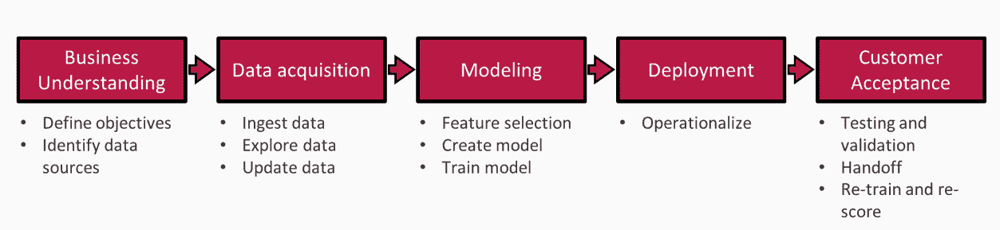
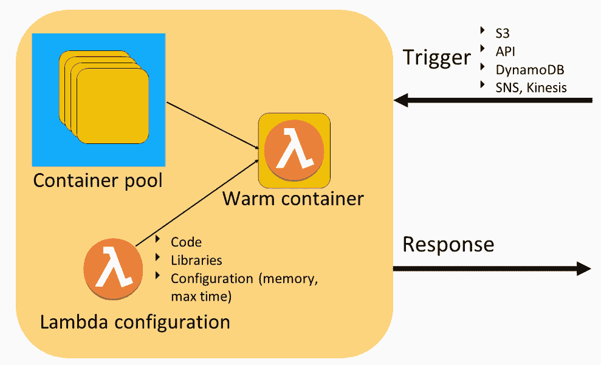
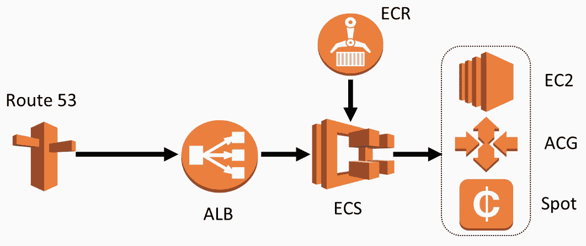
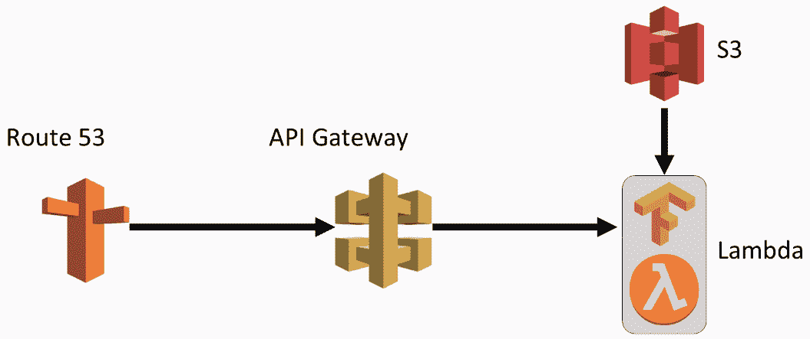

<title>Beginning with Serverless Computing and AWS Lambda</title>  

# 从无服务器计算和 AWS Lambda 开始

这本书将鼓励你在 AWS Lambda 中使用自己定制的模型，并使用简化的无服务器计算方法。稍后，您将实现示例项目，这些项目表示使用 AWS Lambda 来服务 TensorFlow 模型。

在本章中，我们将讨论无服务器深度学习，您将探索无服务器为什么如此受欢迎，以及使用无服务器部署应用程序的优势。此外，您还将了解数据科学过程，以及无服务器如何实现一种简单方便的方式来部署深度学习应用程序。您还将简要了解我们将在接下来的章节中制作的示例项目。

您还将了解 AWS 实现的工作方式，包括部署深度学习应用程序的传统和无服务器方式。

特别是，我们将涵盖以下主题:

*   什么是无服务器计算？
*   为什么要无服务器深度学习？
*   AWS 函数
*   示例项目

<title>What is serverless computing?</title>  

# 什么是无服务器计算？

无服务器计算是一种由云提供商管理代码执行的架构，这意味着开发人员在部署代码时不必担心管理、供应和维护服务器。

让我们讨论应用程序部署的可能方式:

*   **内部部署**让您控制包括硬件在内的整个基础设施。换句话说，这意味着应用程序运行在我们的机器上，您可以物理地访问它。
*   然后，您拥有**基础设施即服务** ( **IaaS** )，这意味着您无法物理访问服务器，但您可以控制其中发生的一切。
*   接下来，你有**平台即服务** ( **PaaS** )，你不控制操作系统或运行时，但你可以控制我们的代码和容器。
*   最后，你有**功能即服务** ( **FaaS** )这是一个无服务器模型，你唯一能控制的就是代码本身。它可以让我们在不同的应用程序上工作。

<title>Why serverless deep learning?</title>  

# 为什么要无服务器深度学习？

让我们理解为什么无服务器基础设施对于在数据科学过程中部署深度学习模型极其有用。

通常的数据科学流程如下:

*   业务理解:您需要理解业务需求，包括定义目标和可能的数据源。
*   数据获取:你需要研究你计划使用的数据，探索它，并试图找到相关性和差距。
*   建模:首先选择最有希望的特性，建立模型，并训练它。
*   部署:您需要操作模型并部署它。
*   客户接受:您可以向客户提供结果并接收反馈。

下图显示了上述各点:

根据从客户那里收到的反馈，您可以更新模型并更改部署方式。部署和客户接受阶段本质上是迭代的。这意味着你必须尽早从用户那里得到反馈。为了实现这一点，我们的部署基础设施必须同时简单和可扩展，这可以在用于部署深度学习模型的无服务器基础设施的帮助下完成。

你需要意识到，我们的深度学习基础设施必须与我们现有的基础设施相集成。

<title>Where serverless deep learning works and where it doesn't work?</title>  

# 无服务器深度学习在哪里行得通，在哪里行不通？

无服务器深度学习部署非常可扩展、简单且启动成本低廉。它的缺点是时间限制、CPU 限制和内存限制。

<title>Where serverless deep learning works?</title>  

# 无服务器深度学习在哪里工作？

在下一节中，您将首先重申无服务器深度学习部署的优势:

*   这对你的项目非常有用。如果你训练你的模型，并想向世界展示它，无服务器深度学习将允许你这样做，而无需复杂的部署和任何前期成本。AWS 还提供每月免费使用。这意味着 AWS Lambda 中的许多调用将完全免费。例如，在我们将在以下章节中讨论的图像识别项目中，运行次数大约为 100，000 次。
*   无服务器深度学习非常适合希望尽早测试其业务假设的早期初创公司。简单性和可伸缩性允许小型团队在没有 AWS 专业知识的情况下开始工作。AWS Lambda 允许您以简单的方式计算每个客户的成本，并了解每个用户的启动成本。
*   如果你已经有一个现有的基础设施，并希望优化你的成本，无服务器深度学习是非常方便的。无服务器架构将比集群架构更简单、更便宜，也更容易维护。重要的是，它降低了成本，因为您不需要保留未使用的服务器。
*   无服务器深度学习对于负载极高的情况非常有用。例如，很多公司在第一分钟有 100 万个请求，而下一分钟没有请求的情况下努力维护系统。集群要么太大，要么需要一定的时间来扩展。另一方面，无服务器具有无与伦比的可扩展性，允许系统在高负载下工作而不滚动。

<title>Where serverless deep learning doesn't work?</title>  

# 无服务器深度学习不起作用的地方？

深度学习在以下情况下不起作用:

*   如果您的系统的主要功能之一是提供一个非常复杂的模型的实时响应；例如，如果它是用户和系统之间交互的一部分，那么无服务器架构可能对您来说还不够。AWS Lambda 具有冷启动延迟以及将模型卸载和加载到存储器中的延迟。它确实运行得很快，但可能需要几秒钟以上的时间。速度高度依赖于模型的大小和复杂性，所以这是你必须事先测试的。
*   如果你的模型利用了大量数据，无服务器深度学习可能会失败。AWS Lambda 有一定的限制，例如 3g 运行空间和 5g 硬盘空间，这意味着您要么必须在内存使用方面优化代码，要么使用集群。
*   如果您的模型对 CPU 能力或内核数量有要求，那么它可能无法在 Lambda 上启动。没有特定的限制可以预测您的模型是否能够在 AWS Lambda 上启动，所以这是您需要测试的东西。
*   一个极其复杂的模型可能无法在无服务器的基础设施上很好地工作。所谓复杂，我们指的是大于 1 或 2 千兆字节。从 S3 下载需要更多的时间，而且 Lambda 可能没有足够的内存来加载它。

上面提到的这些使用案例向我们展示了无服务器学习的前景，它将帮助我们决定是否使用它。最后，在很多情况下，没有确定的答案，继续在无服务器上测试你的模型是有意义的。

现在我们将把 Lambda 函数作为无服务器模型来讨论。

<title>Lambda function – AWS implementation of FaaS</title>  

# Lambda 函数–FaaS 的 AWS 实现

在本节中，我们将讨论 FaaS 的 AWS 实现的工作方式。Lambda 函数是 FaaS 的 AWS 实现。AWS 服务保留 Lambda 配置，基本上是服务中的代码、库和参数。一旦收到触发，它就从池中取出容器，并将配置放入容器中。然后，它使用来自事件触发器的数据运行容器内的代码。一旦容器产生结果，服务就在响应中返回它。

下图展示了 Lambda 函数的工作方式:

Lambda 可以自动扩展到 10，000 个并发执行。此外，Lambda 定价是一种按使用付费的服务，所以你只需为你使用的每一轮 Lambda 付费，当它不运行时你不必付费。

Lambda 配置包括以下内容:

*   **代码**:这是你想要在函数内运行的东西。代码需要有一个函数的显式声明，这是服务运行所需要的。
*   库:这些使我们能够运行更复杂的过程。您需要将它们和代码放在同一个包中。
*   **配置**:这些是指示 Lambda 如何工作的各种参数。

主要参数如下:

*   关系内存和超时
*   运行时(例如，Python 或 node)
*   触发器，我们将在下一节描述
*   IAM 角色，它提供对其他间隔服务的 Lambda 访问
*   环境参数，它允许我们定制代码的输入参数

<title>Lambda triggers</title>  

# λ触发器

有多种 AWS 服务可以作为 AWS Lambda 的触发器，它们是:

*   **DynamoDB** :这使我们能够在数据库的每个新条目上启动 Lambda 函数
*   **亚马逊 S3** :这有助于 Lambda 函数启动桶中的文件
*   **CloudWatch** :这使我们能够根据阴影运行 Lambda 函数(例如，每分钟、每天或仅在每周四中午)
*   **Lex** :这从看看通常的数据科学过程看起来像什么开始
*   **Kinesis、SQS 和 SNS** :这些使我们能够在事件流中的每个对象上启动 Lambda 函数

有许多不同的触发器，这意味着您可以将 Lambda 与许多不同的服务绑定。

<title>Why deep learning on AWS Lambda?</title>  

# 为什么要在 AWS Lambda 上进行深度学习？

在这里，您将看到 AWS Lambda 的优势:

*   在 AWS Lambda 上编码非常容易。您只需要包代码和库，而不需要 Docker 容器。它使您能够尽早开始并部署相同的代码，您可以在本地运行这些代码。因此，这是早期项目的完美选择。
*   AWS Lambda 具有极强的可扩展性，更重要的是，您不必管理可扩展性或为其编写单独的逻辑，因为您的数据科学应用程序将能够轻松处理大量任务或与多个用户合作。
*   AWS Lambda 定价方便。你只需要为你实际使用的东西付费，而且价格本身也很实惠。例如，对于图像识别模型，运行 20，000 到 30，000 次的成本将是 1 美元。

在下一节中，您将了解使用 Lamda 的传统架构和无服务器架构之间的区别。

<title>Traditional versus Serverless architecture using Lambda</title>  

# 使用 Lambda 的传统与无服务器架构

让我们看看传统架构和无服务器架构的区别。下图表示通过传统架构的深度学习 API:

在上面的传统架构中，您不仅必须处理集群本身，还必须处理所有 API 请求的平衡。此外，您必须用代码和库来管理 Docker 容器，并找到一种使用容器注册中心来部署它的方法。

您需要对 AWS 有广泛的了解才能理解这个架构。虽然这并不十分困难，但它可能是一个真正的问题。你需要记住，深度学习的 AWS 架构将有静态成本。

让我们讨论上述应用程序的无服务器实现。下图展示了使用 Lambda 进行深度学习的架构:

在上图中，您可以看到它看起来比传统架构简单得多。你不需要管理节点平衡的可伸缩性或者容器——你只需要放入你的被覆盖的库，Lambda 会管理其他的一切。此外，你可以用它制作许多不同的原型，你只需要为调用付费。这使得 Lambda 成为向用户提供深度学习模型的完美方式。在下一节中，将向您简要介绍您将在本书中开发的项目。

<title>Sample projects</title>  

# 示例项目

在这一节中，你将涵盖在本书过程中开发的项目。您将创建三个项目:

*   深度学习 API
*   深度学习批处理
*   无服务器深度学习工作流

<title>Deep learning API</title>  

# 深度学习 API

深度学习 API 项目提供了一个很好的实践体验，因为您可以立即从浏览器中看到结果。你将从用于图像识别的深度学习 API 开始。图像识别是深度学习显示出令人难以置信的结果的任务之一，这是使用任何其他方法都不可能实现的。你将会使用一个当代的、公开的、预先培训过的、免费的初始模型。该项目还将向您展示采用开源模型并在其上创建 API 接口是多么容易。

<title>Deep learning batch processing</title>  

# 深度学习批处理

在深度学习批处理项目中，您将仔细了解现在很多公司是如何运行深度学习应用程序的。在这个项目中，您将为图像识别构建深度学习批处理。它将向我们展示 Lambda 可伸缩性有多高，使我们能够同时处理数千个预测丢弃。

<title>Serverless deep learning workflow</title>  

# 无服务器深度学习工作流

在无服务器深度学习工作流项目中，您将强调无服务器基础架构上的深度学习模型的模式。你会做一个图像识别的无服务器深度学习工作流。这个项目将向您展示如何使用 AWS step 函数来使用当代的部署技术。您还将学习如何在部署、错误处理和多步骤过程中对模型进行 A/B 测试。这个项目将帮助您了解无服务器部署的可能应用，以及如何将这些知识应用到您的个人项目或公司中。

<title>Summary</title>  

# 摘要

在本章中，向您介绍了无服务器功能、AWS 实现和服务。您查看了 Lambda 函数，它是 FaaS 的 AWS 实现。您还了解了 FaaS 的 AWS 实现的工作原理。后来，您理解了为什么无服务器基础架构对于部署深度学习模型极其有用，以及您在部署过程中可能面临的挑战。您还比较了部署深度学习应用程序的传统方式和无服务器方式。你研究了无服务器深度学习可行和不可行的可能场景。最后，您涵盖了将在本书的课程中学习的各种示例项目。

在下一章，你将学习如何使用 AWS Lambda 及其部署。