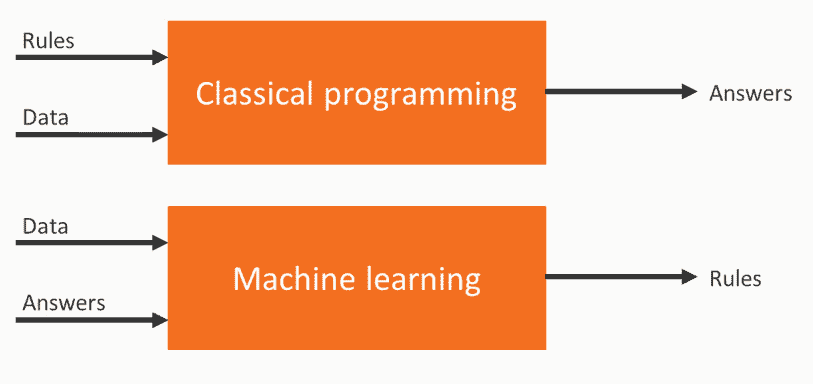
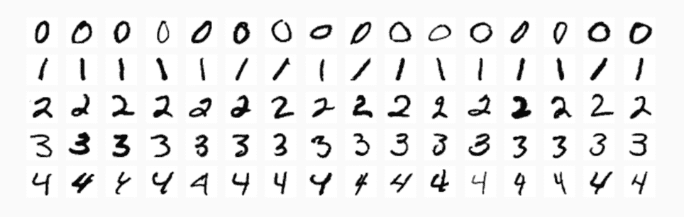
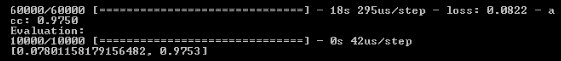
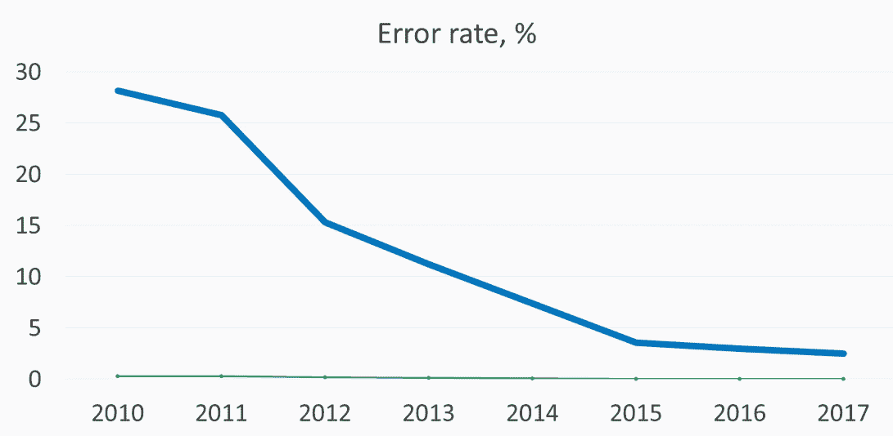
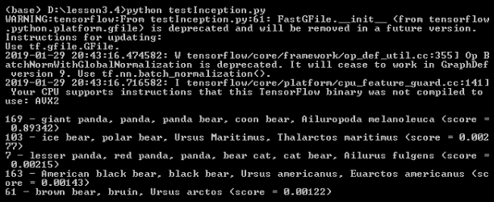

<title>Deploying TensorFlow Models</title>  

# 部署张量流模型

在本章中，我们将讨论张量流框架。最初。我们将从描述构建算法的各种方法有何不同开始。我们还将涵盖深度学习以及如何训练神经网络，但更重要的是，您将学习如何在应用程序中使用预训练的神经网络，以及在哪里可以找到它们。

我们将讨论以下主题:

*   构建算法的方法
*   为什么是神经网络？
*   预训练张量流模型的存储库
*   图像字幕的一个例子

<title>Technical Requirements</title>  

# 技术要求

*   AWS 订阅
*   Python 3.6
*   AWS CLI
*   无服务器框架
*   你可以在[https://github . com/packt publishing/Hands-On-server less-Deep-Learning-with-tensor flow-and-AWS-Lambda](https://github.com/PacktPublishing/Hands-On-Serverless-Deep-Learning-with-TensorFlow-and-AWS-Lambda)找到所有代码

<title>Approaches for building algorithms</title>  

# 构建算法的方法

构建算法的各种方法有:

*   首先，有非常透明和可预测的确定性算法，但为复杂的任务建立一个定制的算法可能非常困难，这种算法将在所有情况下工作。
*   接下来，是机器学习技术，我们根据从数据中获得的特征来训练模型。我们不需要大量的数据来以可靠的方式训练模型，但我们需要为训练验证和测试制定一个单独的流程。
*   最后，还有深度学习方法，我们训练自己的神经网络。这样做的主要优点是，我们可以使用没有预定义特征的原始数据。缺点是训练需要大量的数据和大量的计算资源。

机器学习方法与经典方法有很大不同。经典方法使用规则和数据作为输入，答案作为输出。在机器学习方法中，我们使用数据和答案作为输入，生成规则作为输出，如下所示:



让我们来看看为什么神经网络近年来变得如此流行。

<title>Why neural networks?</title>  

# 为什么是神经网络？

神经网络近年来变得流行的原因如下:

*   与过去的价格相比，现在计算资源已经变得便宜得多。随着公共云的引入，大规模使用这些资源变得极其容易和经济实惠。
*   机器学习方法需要大量数据，目前，有大量公共和私人数据可用于训练。
*   先进的算法被允许制造和训练更复杂的神经网络。

让我们讨论一下为什么我们实际上不需要训练神经网络来成功地使用它们。

<title>Pre-trained networks</title>  

# 预训练网络

虽然训练神经网络可能需要强大的处理能力和大量数据，但部署它们可以使用简单的 CPU 来完成。这样，我们可以说，部署深度学习模型接近于在您的代码中使用外部库。第二，有一个庞大的社区的人和公司开放他们预先训练的神经网络，这意味着你可以免费使用它们。

在两种情况下，使用预训练的神经网络会非常方便:

*   第一种情况是你的任务已经解决了。例如，如果你想用 *X* 分类进行图像字幕，那么你可以使用已经存在的神经网络。
*   第二种情况是当你的任务与已经完成的任务有相当大的不同，但是很接近。然后，您可以使用预先训练的模型来生成特征，您可以在以后使用确定性或简单的机器学习模型。

大多数预训练模型使用 TensorFlow，因此它是当前最流行的深度学习框架。它有一个非常大的社区，很多人分享他们训练的模型。大多数在生产环境中使用神经网络的公司都在使用 TensorFlow 框架。因此，我们将通过下一节中的一个示例来学习 TensorFlow 在预训练模型中的使用。

<title>Simple TensorFlow example</title>  

# 简单张量流示例

展示深度学习力量的一个很好的用例是 **MNIST** (简称**改进的国家标准与技术研究所**)数据集。它由带有手写数字的黑白图片组成，如下图所示:



每张图片都根据图片上的数字进行标记。在这种情况下，任务是根据图像预测标签。使用确定性方法很难实现这种任务；正如你在上图中看到的，同一个数字有很多不同的写法。所以不能用单一的模板进行预测。

<title>Training for MNIST</title>  

# 为 MNIST 进行培训

在这一部分，我们将讨论 MNIST 的模特培训:

1.  首先，我们从导入`tensorflow`库开始。对于这个例子，我们将使用 Keras 深度学习框架，这使得为神经网络设置层变得容易。简单来说，Keras 充当了 TensorFlow 上面的包装器，所以一切还是基于 TensorFlow。
2.  接下来，我们需要加载数据并以二进制格式呈现它，因为原始图像像素值是 0 和 255。我们还将数据集分为训练集和测试集。这将允许我们测量神经网络的性能。机器学习方法的一个良好实践是在训练数据集上训练模型，并在测试数据集上测量最终得分。它使我们能够确保模型看不到训练后将被测量的数据点。我们将看到如下解释:

```
import tensorflow as tf

mnist = tf.keras.datasets.mnist

(x_train, y_train),(x_test, y_test) = mnist.load_data()
x_train, x_test = x_train / 255.0, x_test / 255.0
```

3.  现在，我们需要为我们的神经网络建立层。基本上，每一层都由许多神经元和一个激活函数组成。在这种情况下，第一层试图从原始数据中获取更多有用的数据。第二层尝试使用该数据来分配图像是 10 个数字之一的概率。
4.  作为模型的一部分，您需要为训练过程选择三个参数:
    *   首先是`loss`函数，网络将使用它来优化其性能。训练过程基本上包括降低`loss`函数的值，并试图找到神经网络的权重，因此`loss`函数将是最小的。
    *   接下来是`optimizer`，它处理神经网络如何迭代到最优解，以及它如何在每次迭代后改变权重。
    *   最后，`metrics`允许我们测量数据集上的神经网络性能。例如，`accuracy`允许我们了解数据集的哪一部分被正确分类。该指标不直接参与训练过程，主要让我们了解网络性能是否有所提高。我们可以从下面的代码中理解前面的解释:

```
model = tf.keras.models.Sequential([
  tf.keras.layers.Flatten(),
  tf.keras.layers.Dense(512, activation=tf.nn.relu),
  tf.keras.layers.Dense(10, activation=tf.nn.softmax)
])
model.compile(optimizer='adam',
              loss='sparse_categorical_crossentropy',
              metrics=['accuracy'])
```

5.  一旦一切都设置好了，我们就可以在数据集的训练部分运行训练了。这可能需要几分钟，具体取决于您的计算机配置。之后，我们可以评估模型性能和测试集。我们的模型将产生大约 97%的准确率/测试集，这非常令人印象深刻，正如所演示的，它甚至可以通过简单的神经网络来实现，如下面的代码所示:

```
model.fit(x_train, y_train, epochs=2)
print('Evaluation:')
print(model.evaluate(x_test, y_test))
```

6.  最后，一旦神经网络被训练，我们可以保存它，以便我们可以在以后使用它。如您所见，这是一个非常简单的过程。模型文件将包含模型架构、层的关键组成、层的权重和训练配置以及优化器状态，这允许我们在已经训练的模型上继续训练:

```
model.save('MNISTmodel.h5')
modelImported = tf.keras.models.load_model('MNISTmodel.h5')
print('Evaluation by imported model:')
print(modelImported.evaluate(x_test, y_test))
```

让我们讨论一下可用的文件。只有一个 Python 文件，即我们将要运行的`testMNIST.py`文件。在这个文件中，我们可以看到我们已经讨论过的部分，包括数据转换、模型安装、模型训练、模型评估、模型导出和模型导入。

现在，让我们在命令行中运行`testMNIST.py`文件来查看结果。通过运行代码，我们可以看到训练的过程，这发生在各个时期。这种神经网络不需要 GPU 来训练，我们甚至可以在 CPU 上取得非常好的结果:

```
python testMNIST.py
```

正如您在下面的截图中看到的，我们仅用两个时期就达到了 97%的准确率，并且能够成功地导出和导入模型。我们可以看到导出的重新训练模型，现在可以用在不同的代码中:



。在下一节中，我们将讨论预训练张量流模型的存储库。

<title>Repositories for pre-trained TensorFlow models</title>  

# 预训练张量流模型的存储库

预训练的模型在进出口方面相当熟练。简而言之，声明部署包括导入经过训练的模型，并将输入数据转换为神经网络可接受的格式。在部署过程中，您需要记住一些事情:

*   该模型可能非常大，例如，数百兆字节，这使得部署更加困难。
*   我们需要保存模型的版本，并跟踪它们的性能。如果您自己训练模型，您可能需要根据传入数据的变化或找到更好的体系结构来更新模型。
*   一些模型需要额外的文件将预测的数字或值转换成有意义的信息。

<title>TensorFlow repository</title>  

# 张量流知识库

TensorFlow 有五个主要存储库，其中包含许多精选的模型。它们已经比较成熟，很容易在 TensorFlow 框架中使用。

更多关于使用 TensorFlow 训练的最受欢迎的模型的信息，请访问这个网站:【https://github.com/tensorflow/models。

存储库的不同示例如下:

*   图像到文本模型，它允许描述图像上发生的事情
*   图像字幕，对图像进行分类
*   深度语音，允许语音被识别
*   文本摘要，允许您对文本文章进行摘要
*   Vid2depth，它基于视频流生成深度图

<title>TensorFlow Hub</title>  

# 张量流集线器

有 TensorFlow Hub 托管平台，它是专门为神经网络设计的。TensorFlow Hub 有很多很棒的模型，可以免费使用，主要由 Google 训练。它们很好，质量一流。TensorFlow Hub 的优点是在添加模型之前会对其进行检查，缺点是提交参赛作品的门槛很高。

不同型号的 TensorFlow Hub 可点击以下链接查看:【https://tfhub.dev/。

<title>GitHub</title>  

# 开源代码库

GitHub 被认为是最大的开源代码库。那里发布了无数的模型，但是由于没有入口过滤器，在生产中使用这些模型时需要更加小心。GitHub 的优点是进入门槛低，缺点是可能很难找到相关的模型，用户需要在部署前检查模型是如何工作的。

在下一节中，我们将通过一个例子来了解图像字幕。

<title>Image captioning example</title>  

# 图像字幕示例

图像字幕是一项任务，我们需要识别图像上的对象。虽然这听起来很简单，但它被认为是计算机视觉中最困难的问题之一，因为几乎不可能为每种类型的对象制作单独的检测器。测试图像字幕算法的主要方法是在 ImageNet 数据集上运行它。ImageNet 数据集由超过 20，000 个标签的 1，400 万幅图像组成。它于 2010 年推出。每年都有不同模型的比赛，由于复杂神经网络的引入，近年来准确性有了显著提高。

有许多具有不同架构的不同型号可以成功地与 ImageNet 配合使用。我们会看到这些年来误差显著减少。下图显示了 ImageNet 数据集中 winner 模型的错误率的变化。



我们现在将讨论 Inception v3，稍后我们将在代码示例中使用它。

<title>Inception v3</title>  

# 盗梦空间 v3

Inception v3 由 Google 推出，实现了 3.46%的错误率。您将会看到，Inception v3 要复杂得多。训练这个模型也需要更多的资源，但是这里的好处是我们不用训练它就可以使用。

我们将研究在我们的代码中开始使用 Inception v3 需要什么。该模型由`classify_image_graph_def.pb`中的层和权重值组成。

我们还有一个标签列表，模型可以在`imagenet_2012_challenge_label_map_proto.pbtxt`文件中预测它，还有一个文档允许将神经网络的结果映射到`imagenet_synset_to_human_label_map` `.txt`文件中的标签。

这里有一个熊猫形象的例子。首先，我们接收得分的 id。最高分意味着模型对具有该标签的图像具有高置信度。将 id 映射到标签名称后，我们可以看到模型正确地检测到了 Panda。下面的截图解释了这一点:


<title>TensorFlow code for Inception v3</title>  

# Inception v3 的张量流代码

现在，让我们看看任何 Inception v3 模型的代码将会是什么样子:

1.  首先，我们需要建立一个 TensorFlow 会话。会话是评估张量的环境。
2.  我们需要从文件中读取并设置我们的神经网络。
3.  接下来，我们需要请求神经网络可读格式的图像。
4.  我们将需要运行一个 power 模型并接收行预测列表，并将这些预测转换为实际的标签值，如以下代码所示:

```
SESSION = tf.InteractiveSession()
softmax_tensor = tf.get_default_graph().get_tensor_by_name('softmax:0')

predictions = SESSION.run(softmax_tensor,{'DecodeJpeg/contents:0': image_data})

node_loolup.id_to_string(predictions)
```

<title>Running the code</title>  

# 运行代码

让我们看看可用的文件，`inputimage.png`和`testinception.py`，我们将运行它们。在这个例子中，我们将使用熊猫图像(`inputimage.png`)。

1.  如下面的代码所示，有一个`NodeLookup`类，它将帮助我们将响应从模型转换为标签名称:

```
class NodeLookup(object):
    """Converts integer node ID's to human readable labels."""
```

2.  以下代码显示了我们如何读取图像:

```
image = 'inputimage.png'
image_data = tf.gfile.FastGFile(image, 'rb').read()
```

3.  然后，这是告诉我们如何导入预训练模型的代码:

```
with tf.gfile.FastGFile('classify_image_graph_def.pb', 'rb') as f:
  graph_def = tf.GraphDef()
  graph_def.ParseFromString(f.read())
  tf.import_graph_def(graph_def, name='')
```

4.  在这里，我们交换模型:

```
SESSION = tf.InteractiveSession()
softmax_tensor = tf.get_default_graph().get_tensor_by_name('softmax:0')

predictions = SESSION.run(softmax_tensor,{'DecodeJpeg/contents:0': image_data})
```

5.  最后，我们转换模型的结果:

```
predictions = np.squeeze(predictions)
node_lookup = NodeLookup(label_lookup_path='imagenet_2012_challenge_label_map_proto.pbtxt',
  uid_lookup_path='imagenet_synset_to_human_label_map.txt')

top_k = predictions.argsort()[-5:][::-1]
strResult = '%s (score = %.5f)' % (node_lookup.id_to_string(top_k[0]), predictions[top_k[0]])
print()
for node_id in top_k:
    human_string = node_lookup.id_to_string(node_id)
    score = predictions[node_id]
    print('%s - %s (score = %.5f)' % (node_id, human_string, score))
```

6.  现在，我们可以运行代码并查看响应。从下面的输出可以看出，该模型成功地在图像上检测到了一只熊猫。由于不涉及培训，代码运行速度会很快。您可以在不同的图像上尝试这些代码，感受一下这种模式的可能性:



<title>Summary</title>  

# 摘要

在这一章中，我们研究了构建算法的不同方法。我们讨论了如何为预训练的 TensorFlow 模型训练 tensor flow 模型和存储库。我们还使用 Inception v3 TensorFlow 示例学习了图像字幕。

在下一章中，我们将学习如何使用 TensorFlow AWS Lambda，其中我们将学习更多有关使用 TensorFlow 模型和 AWS Lambda 的信息。