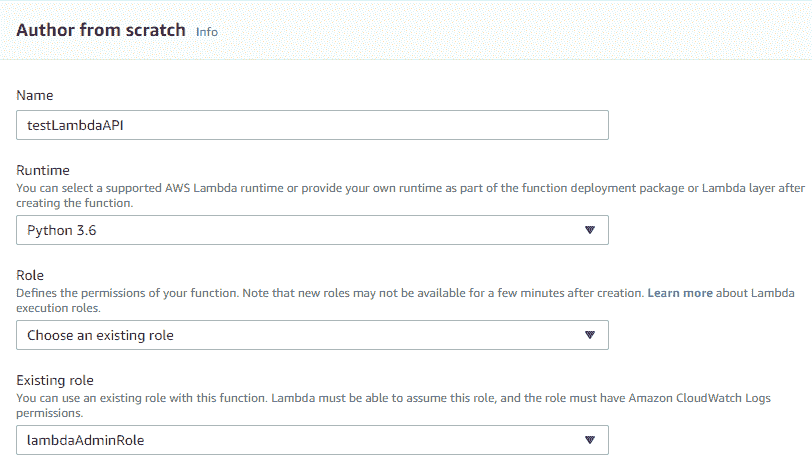
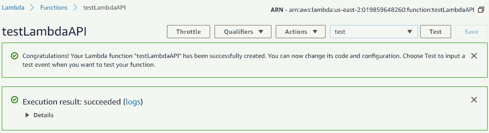
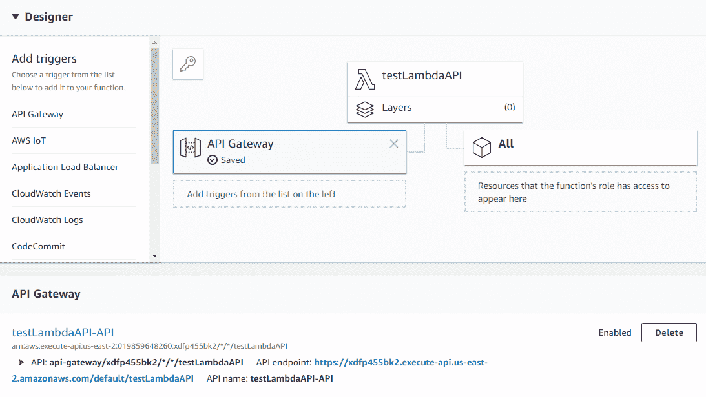
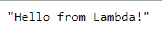
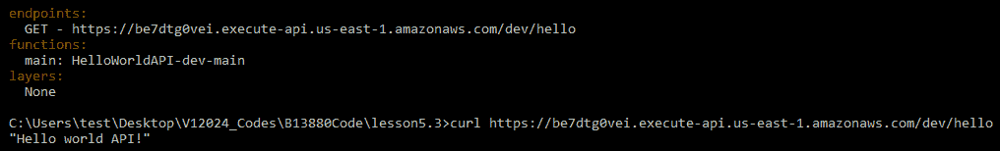
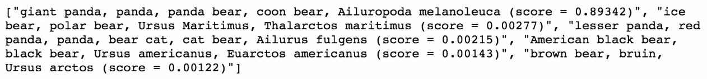

# 五、创建深度学习 API

在前一章中，我们学习了如何在 AWS Lambda 上使用 TensorFlow。本章简要介绍了 RESTful API 以及 AWS API 网关。我们将学习如何使用无服务器框架创建 API 网关。

在本章中，我们将讨论以下主题:

*   API 服务
*   AWS API 网关
*   创建深度学习 API 项目


# 技术要求

本章中的技术要求如下:

*   AWS 订阅
*   Python 3.6
*   AWS CLI
*   无服务器框架
*   您可以在以下位置找到所有代码:[https://github . com/packt publishing/Hands-On-server less-Deep-Learning-with-tensor flow-and-AWS-Lambda](https://github.com/PacktPublishing/Hands-On-Serverless-Deep-Learning-with-TensorFlow-and-AWS-Lambda)


# RESTful API

近年来，RESTful API 变得非常流行，宏服务作为应用程序内不同服务之间通信的通用方式越来越受欢迎，例如，我们可以在单个应用程序中为不同的编程语言和不同的托管平台一起使用 RESTful API 服务。

RESTful API 是一个允许您在不同应用程序之间进行通信的接口，它可以用于很多目的。RESTful API 使您能够轻松集成不同的服务。它还允许您在应用程序的前端和后端之间建立简单的连接，并允许其他开发人员使用您的服务。在这种情况下，深度学习 API 允许您轻松地将深度学习模型集成到您的应用程序中，或者为其他开发人员提供使用您的模型的方法。现在让我们更详细地看看 API 网关服务。


# AWS API 网关

API 网关是一个双重服务，允许您创建、发布、监控和保护 API。我们不仅可以将 API 网关连接到 business Lambda，还可以连接到 AWS EC2 实例、**弹性集群** ( **ECS** )，甚至可以连接到**弹性豆茎** ( **EBS** )。它有一个现收现付的系统，这使得它作为一个启动服务非常方便。让我们看看 API 网关的具体特性。


# 特征

以下是 API 网关的一些功能:

*   **易于扩展**:API 服务负责扩展，这意味着我们不必担心这是否是处理峰值负载的好方法，以及它是否会过度供应资源。
*   **流量管理**:API 网关有办法控制流量。流量管理的主要用例是在我们希望后端负载更加均匀时进行节流。这不是 AWS Lambda 的问题，因为它几乎可以无限扩展。
*   **授权**:这允许你控制用户对 API 的访问。这意味着我们要么保持 API 私有，要么将其商业化。这个特性对于您的应用程序是必不可少的。
*   **监控**:这个特性使我们能够获得用户级别的使用统计数据。如果我们想根据用户的使用来限制用户，或者如果我们需要对我们的 API 进行故障排除，这是很重要的。
*   **缓存**:这允许你通过缓存一些响应来减少发送到后端的请求数量。如果您的应用程序必须处理大量的重复请求，那么交换机将会显著减少后端的使用量。
*   **版本控制**:这允许你管理 API 的多个版本，这对应用程序的生产非常重要。

现在，让我们看看 API 的定价。


# 定价

API Gateway 的主要优势之一是它的按需付费特性。这项服务的定价为每百万次请求 3.5 美元，每 1 GB 数据传输费用约为 0.09 美元。其他可选费用可能适用于所选择的服务。因此，我们需要确保它有助于降低后端的成本。我们看到的 API 网关的成本对于我们的项目来说是非常实惠的。对于初学者来说，AWS API 网关是免费层的一部分，每月可以免费获得 100 万次请求。请注意，免费层仅面向新用户。


# 创建 API 网关

现在我们已经了解了 API 网关的成本和特性，我们将使用 AWS 控制台创建 API 网关。但是在我们开始之前，我们需要创建并定位 AWS Lambda(在第 4 章、*中创建，在 AWS Lambda 上使用 tensor flow*)，然后我们将学习如何在 AWS API 网关和 AWS Lambda 之间创建连接。


# 创建 AWS Lambda 实例

我们将创建 AWS Lambda 实例，并使用 AWS 控制台连接到网关。让我们从创建 AWS Lambda 实例开始，并选择我们在上一章中创建的管理角色，如下面的屏幕截图所示:



让我们测试该函数，并检查它是否是使用屏幕右上角的 test 选项创建的，如下面的屏幕截图所示:



现在，让我们通过单击“添加触发器”下左侧的 API 网关选项来添加 API 网关触发器。现在，在 Configure triggers 选项卡下，选择 Create a new API 并选择一个开放 API 端点。现在，在附加设置**、**下，只需检查 API 名称，然后单击 Add 创建 API 并保存它。这将为您提供如下屏幕截图所示的页面，该页面包含一个到 API 的链接，以便在您的浏览器上进行测试:



如您所见，它产生了类似于演示代码的结果，如下面的屏幕截图所示:



现在我们已经准备好 AWS Lambda 和 API 网关，我们将使用无服务器框架创建连接。


使用无服务器框架创建 API 网关

在创建 API 之前，让我们看看我们的项目文件:主 Python 文件(`index.py`)和无服务器配置文件(`serverless.yml`)。让我们看看 Python 文件，如以下代码所示:


# 从前面的代码块中，您可以看到这个文件将返回一个 JSON 响应，而不是 API 请求的字符串。为此，我们需要将 JSON 格式中的`status code`改为`200`，将`body`改为`transform`。

在服务器配置文件中，我们将添加一个`events`并添加一个 API 端点名称:

```py
import json
def handler(event, context):
print('Log event', event)
return{
'status code': 200;
'body': json.dump('Hello world API!')
}
```

部署无服务器框架

现在，让我们使用以下命令来部署服务:

```py
functions:
  main:
    handler: index.handler
    events:
      - http: GET hello
```


# 成功完成部署后，它将返回 API 网关的 URL。现在使用`curl`命令和 URL 测试我们在命令行上获得的 URL:



```py
serverless deploy
```

我们还可以在浏览器中运行 URL，并测试部署以找到所需的输出。

创建第一个 API 项目

现在让我们从创建深度学习 API 项目的例子开始。在我们开始项目之前，让我们看一下我们的文件:主 Python 文件和服务配置文件，以及一些库文件和初始模型。


# 在这个项目中，我们将添加一个`events`部分和端点名称。在 Python 文件中，我们将返回一个对请求的 JSON 响应。此外，我们将让 Lambda 接受请求中的图像链接，然后将其应用于一个模块。我们将部署服务器，并在命令行和浏览器中测试文件，正如我们在上一节中检查的那样。

当前的配置文件结合了前一节中的更改，非常相似。另一个需要改变的部分是在 Python 文件中，我们在其中添加了读取 URL 参数。如您所见，如果没有 URL，我们将使用之前拍摄的图像。但是，如果我们有 URL 路径，我们可以从 URL 下载图像。

现在让我们使用`serverless deploy`命令来部署服务，这将为您提供 API 网关的 URL。让我们在浏览器中使用`curl`命令测试这个 URL，您会发现与我们在上一节中看到的相同的响应:



我们还可以通过下载映像来测试部署。为了测试这一点，我们只需将图像的 URL 作为参数添加到 API 网关 URL 中。


We can also test the deployment by downloading the image. To test this, we only have to add the URL of the image as a parameter to the API Gateway URL.

摘要

在本章中，我们学习了 API 网关服务和 RESTful API。我们看到了 AWS 网关对于我们的应用程序来说是如何经济高效的。然后我们看了如何使用 AWS 控制台创建 AWS API 网关和 AWS Lambda。我们还使用无服务器框架创建了 AWS Lambda 和 AWS API 网关之间的连接。最后，我们使用 API 网关创建了深度学习 API 项目。


# 在下一章中，我们将通过连接和显而易见的 Lambda 创建交叉管道。小比尔很好奇我们将在哪里学习如何创建深度学习管道。

In this chapter, we learned about the API Gateway services and the RESTful API. We saw how the AWS Gateway is cost effective for our application. Then we looked at how to create the AWS API Gateway and AWS Lambda using the AWS console. We also created a connection between AWS Lambda and the AWS API Gateway using the serverless framework. Finally, we created the deep learning API project using the API Gateway.

In the next chapter, we will be creating crossing pipelines by connected and obvious Lambda little bills is curious where we will learn how to make a deep learning pipeline.