# 六、创建深度学习管道

在上一章中，我们学习了使用 AWS 控制台创建 API 网关服务，以及无服务器框架。在本章中，我们将学习使用 AWS 控制台以及无服务器框架创建 SQS 连接。

在本章中，我们将讨论以下主题:

*   信息排队
*   AWS 简单查询服务简介
*   使用 AWS 控制台和无服务器框架创建 AWS SQS
*   样本项目——深度学习管道


# 技术要求

本章中的技术要求如下:

*   AWS 订阅
*   Python 3.6
*   AWS CLI
*   无服务器框架
*   你可以在[https://github . com/packt publishing/Hands-On-server less-Deep-Learning-with-tensor flow-and-AWS-Lambda](https://github.com/PacktPublishing/Hands-On-Serverless-Deep-Learning-with-TensorFlow-and-AWS-Lambda)找到所有代码


# 信息排队

消息队列是不同服务之间交互的一种重要的附加方法。虽然 RESTful API 有超时限制，但是消息队列没有这种缺点。因此，它有助于处理长时间运行的流程或延迟的消息。此外，它允许后端上更均匀的负载。它没有使用 AWS Lambda 的关键特性，因为 Lambda 很容易扩展，但是在处理集群时非常有用。最后，消息队列允许重试逻辑，这意味着失败的任务可以被多次发回。现在让我们更深入地了解一下 AWS SQS 公司。


# SQS 自动气象站简介

基本上，这是一个允许发送、接收和存储消息的 AWS 服务。它可以连接到任何处理后端。它有一个现收现付的系统，这使得它作为一个起点非常方便。


# AWS API 网关功能

AWS API 的不同特性如下:

*   它是高度可伸缩的，并且您不需要管理队列中的任何其他伸缩。
*   该服务处理读者对队列的访问，因此您不必实现它。
*   SQS 有一个可定制的重试机制，增加了避免错误的概率，从而提高了整体速度。
*   SQS 提供了非常简单的 API，几乎可以在任何编程语言中使用。
*   最后，它提供了加密，这对于提高服务的安全性很有用。


# AWS SQS 定价

SQS 的主要优势之一是按用户付费系统，这非常简单。定价为每 100 万次请求 50 美分，每月前 100 万次请求是免费的。这使得它非常适合早期项目。


# 使用 AWS 控制台创建 AWS SQS 连接

在本节中，我们将首先创建一个 AWS Lambda，然后在将 SQS 连接到 AWS Lambda 之前创建简单的查询服务。


# 创建 AWS Lambda 实例

以下是创建 AWS Lambda 实例的步骤:

1.  首先，在名称下添加名称，选择运行时为 Python 3.6，设置角色为选择现有角色，然后从现有角色中选择`lambda1`，点击创建函数，如下图所示:

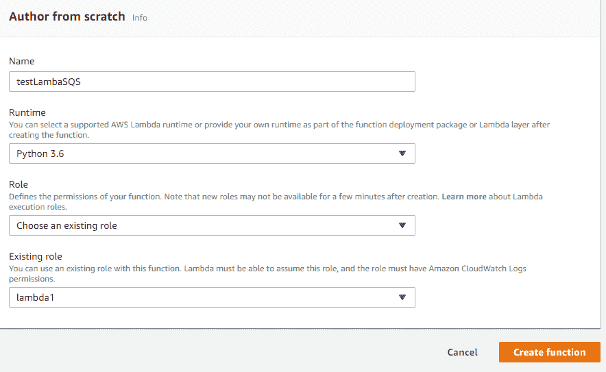

2.  Lambda 函数已创建，如下面的屏幕截图所示:

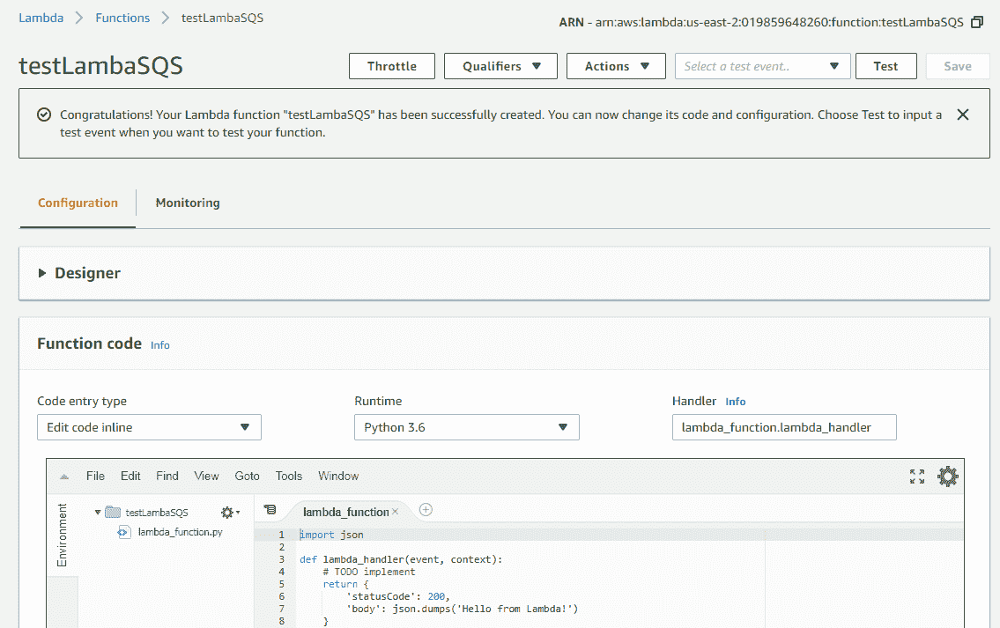

3.  接下来，切换到 SQS，通过选择 Create New Queue 创建一个 SQS 队列:

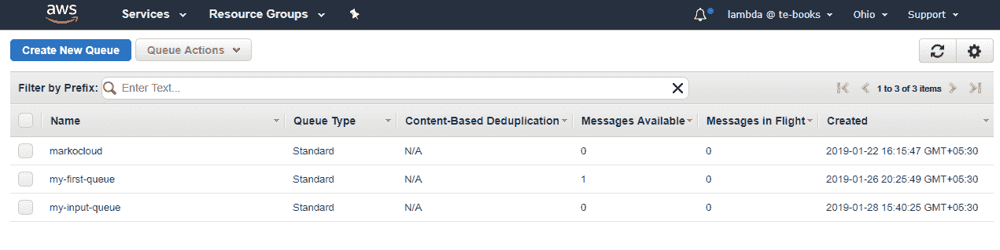

4.  在创建一个名为 testLambda 的队列后，我们得到了 SQS ARN，如下图所示:

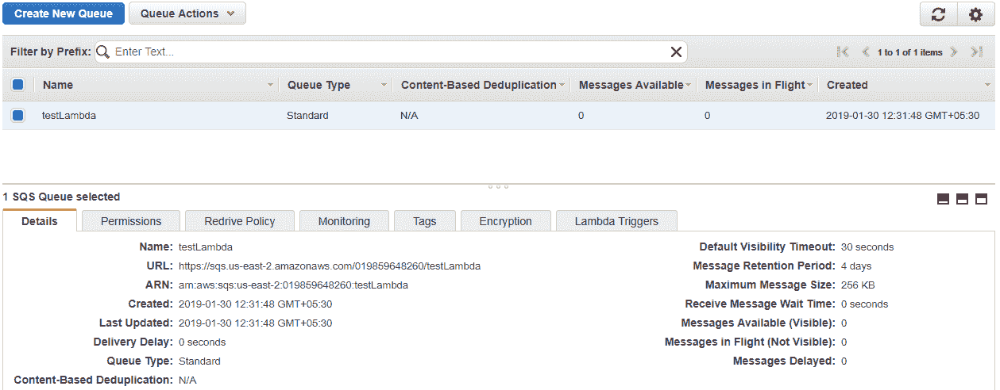

5.从左侧的设计器选项卡中，选择 SQS 作为触发器:

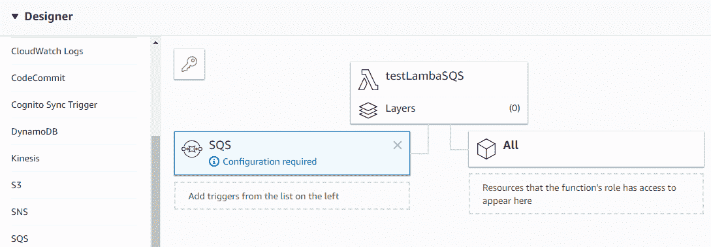

6.  我们将通过从队列操作下拉列表中选择发送消息来向队列发送一些消息:

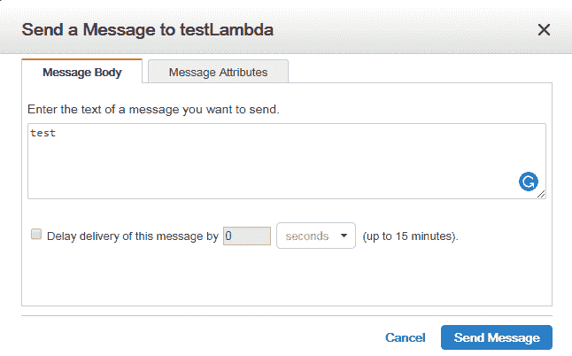

7.  如您所见，我们只有一条可用的消息，这意味着它们都被 Lambda 使用了，如下图所示:

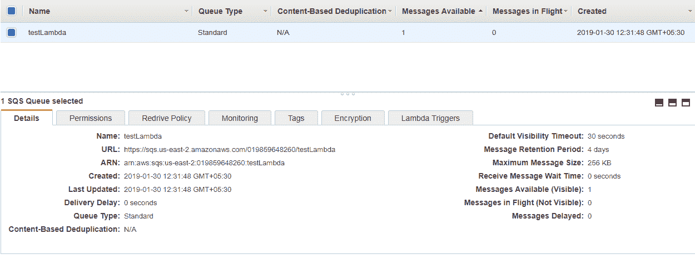

8.通过单击“Monitoring ”,我们将获得如下所示的详细概述:

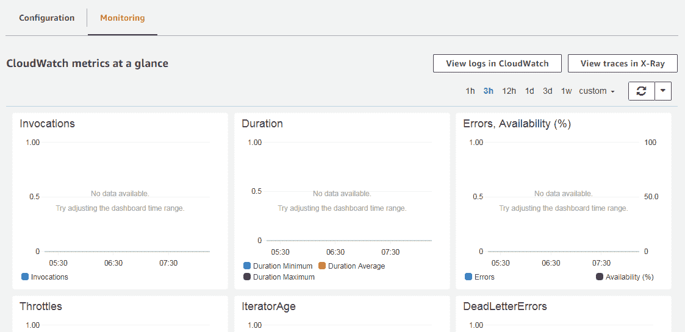

9.  我们还可以通过单击 CloudWatch 中的 View logs 来查看日志详细信息，如前面的屏幕截图所示。每个开始和结束都意味着对每个消息的调用。

下一节涉及使用无服务器框架创建 AWS Lambda 的 AWS SQS 连接。


# 使用无服务器框架创建 AWS SQS 连接

为了创建 SQS 连接，我们有主 Python 文件和无服务器配置文件。配置文件会有点复杂。我们需要在参考资料部分定义 SQS，编辑成 Lambda 的事件源，然后使 Lambda 能够从 SQS 读取。


# Python 文件

Python 文件的主要区别在于，我们将写入另一个 SQS 查询，而不是返回字符串，如下所示:


# 密码

在开始编写代码之前，我们首先需要部署无服务器框架，然后我们需要使用命令行界面检查它是否运行。我们将使用`index.py`文件和`serverless.yml`配置文件运行代码。


# 无服务器. yml

在`serverless.yml`文件中，我们可以看到我们在前面章节中讨论的所有部分，特别是我们定义访问查询的角色的部分，我们将从那里读取消息，我们的 Lambda 将向那里写入消息。下面的代码给出了解释:

```py
Effect: "Allow"
Action:
    "sqs:ReceiveMessage"
    "sqs:DeleteMessage"
    "sqs:GetQueueAttributes"
Resource:
    arn:aws:sqs:#{AWS::Region}:#{AWS::AccountId}:ReadSQS
```

我们还必须定义其中一个查询将作为事件源，如下所示:

```py
events:
    sqs:
      arn:
        Fn::GetAtt:
          ReadSQS
          Arn
```

最后，我们定义查询，可以在资源部分执行，如代码所示:

```py
resources:
  Resources: 
    WriteSQS: 
      Type: AWS::SQS::Queue
      Properties:
        QueueName: "WriteSQS"
    ReadSQS: 
     Type: AWS::SQS::Queue
     Properties:
        QueueName: "ReadSQS"
```

此外，我们将需要使用插件`serverless-pseudo-parameters`，我们将安装它:

```py
plugins:
  - serverless-pseudo-parameters
```

我们需要从`deployment`包中移除包含前面插件的包，如下所示:

```py
package:
  exclude:
    - node_modules/**
```

接下来是使用这个插件来访问我们使用的地区的 ID 和我们的帐户 ID，如下所示:

```py
Resource:
  - arn:aws:sqs:#{AWS::Region}:#{AWS::AccountId}:ReadSQS
Effect: "Allow"
Action:
  - "sqs:SendMessage"
  - "sqs:GetQueueUrl"
Resource:
  - arn:aws:sqs:#{AWS::Region}:#{AWS::AccountId}:WriteSQS
```

没有这个插件，你也可以访问帐号 ID 和地区 ID，也可以手动查找。


# 索引. py

`index.py`文件非常简单。我们只是阅读收到的信息，然后把它们写成 SQS。下面显示了`index.py`的代码:

```py
import boto3

def handler(event,context):
    for message in event['Records']:
        client = boto3.client('sqs')
        sqsAddress = client.get_queue_url(QueueName='WriteSQS')
        response = client.send_message(QueueUrl=sqsAddress['QueueUrl'],
                                        MessageBody=message['body'])
    return
```

我们将在命令行中看到前面的`index.py`和`serverless.yml`文件:

首先，我们需要安装插件，`serverless-pseudo-parameters`:

```py
npm install serverless-pseudo-parameters
```

输出如下所示:

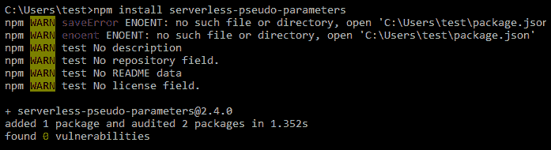

接下来，我们将使用以下命令部署 Lambda:

```py
serverless deploy
```

如您所见，插件用实际的基本区域和帐户替换了区域，如下图所示:

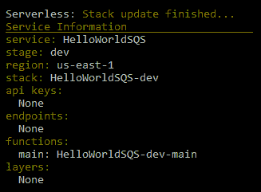

要通过队列发送消息，首先我们需要使用以下命令找到队列 URL:

```py
aws sqs get-queue-url --queue-name ReadSQS
```

使用队列 URL，我们可以发送消息。我们看到该命令在这里成功执行:

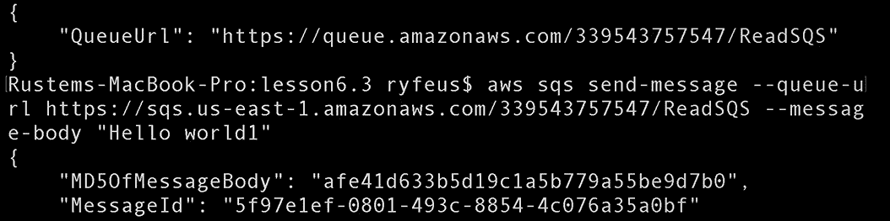

现在我们可以从 SQS 队列中读到同样的信息。基本上，这里我们可以检查 Lambda 是否收到了我们发送的消息，也就是`Hello world1`，并发送它来编写 SQL。我们看到 Lambda 成功运行，并且我们可以在下面的屏幕截图中看到结果消息`Hello world1`:

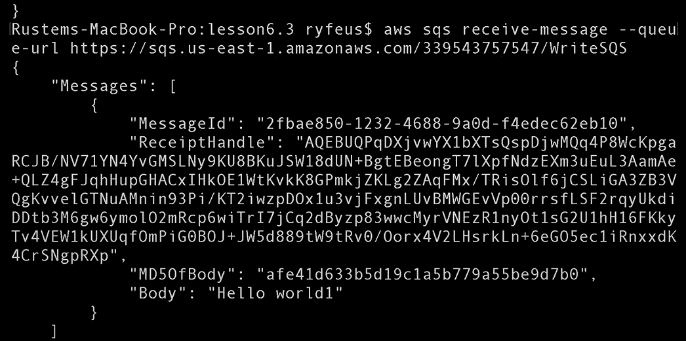


# 示例项目–深度学习管道

在项目文件中，我们有主 Python 文件、无服务器配置文件、库文件和一个初始模块。配置文件将与我们在上一章中使用的文件相同。我们将查看 Python 文件。我们的 Python 文件的主要区别在于，我们将向另一个 SQS 查询发送一条消息，而不是返回字符串。此外，我们将让 Lambda 接受消息中图像的链接，然后应用 module 来构造它。部署将类似于上一节中的部署。

我们将跳过模型的部署，因为我们之前已经讨论过了。


# 密码

首先，我们需要部署无服务器框架，然后我们可以使用命令行界面检查它是否运行。我们有`index.py`文件和`serverless.yml`配置文件。我们还有 TensorFlow 的库和无服务器框架的预装插件。


# 配置文件- serverless.yml

我们可以看到当前的配置文件取自前面的章节。

我们有一个存放模型的桶，如下面的代码片段所示:

```py
Effect: "Allow"
Action:
  - "s3:ListBucket"
Resource:
  - arn:aws:s3:::serverlessdeeplearning
Effect: "Allow"
Action:
  - "s3:GetObject"
Resource:
  - arn:aws:s3:::serverlessdeeplearning/*
```

Lambda 和资源有一个事件源，如下面的代码片段所示:

```py
- sqs:
    arn:
      Fn::GetAtt:
        - DLReadSQS
        - Arn
```


# 索引. py

在`index.py`文件中，脚本看起来与前一节中的一样。添加了一个额外的部分，从消息中读取 URL，并将结果写入另一个队列。以下是`index.py`的代码片段:

```py
import boto3
import numpy as np
import tensorflow as tf
import os.path
import re
from urllib.request import urlretrieve
import json
SESSION = None
strBucket = 'serverlessdeeplearning'
def handler(event, context):
    global strBucket
    global SESSION
    if not os.path.exists('/tmp/imagenet/'):
       os.makedirs('/tmp/imagenet/')
       ...
```

下面的屏幕截图显示了我们检索图像并在其上运行模型的部分，因此，我们将模型的结果写入另一个队列，如下所示:

```py
if ('Records' in event):
    for message in event['Records']:
        urlretrieve(message['body'].strip('\''), strFile)
        vecResult = run_inference_on_image(strFile)
        client = boto3.client('sqs')
        sqsAddress = client.get_queue_url(QueueName='DLWriteSQS')
        response = client.send_message(QueueUrl=sqsAddress['QueueUrl'],
                                       MessageBody=vecResult[0])
 else:
        downloadFromS3(strBucket,'imagenet/inputimage.png',strFile)
        strResult = run_inference_on_image(strFile)
```

现在让我们部署服务，如下所示:


我们将把带有 URL 的消息发送到第一个队列。这可以通过命令行界面完成:

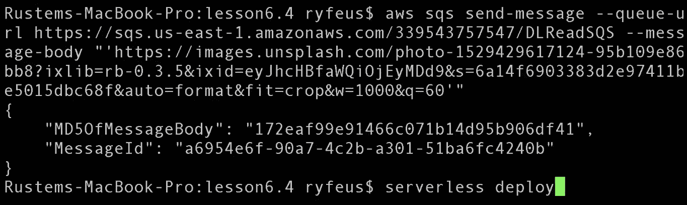

我们可以从另一个队列中读取发送的消息，如下所示:

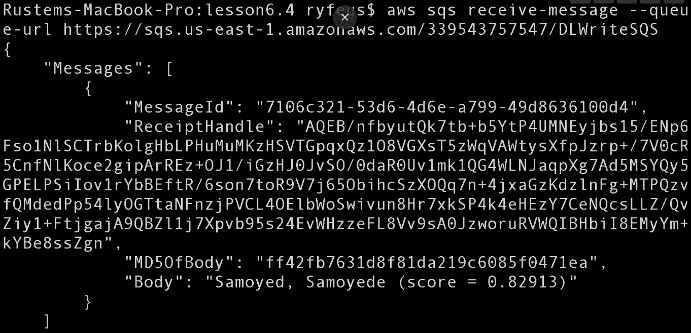


# 摘要

在这一章中，我们介绍了 AWS SQS，包括它的功能和定价。我们还使用 AWS 控制台和无服务器框架创建了 AWS SQS 连接。

我们了解了`serverless.yml`配置文件和`index.py`文件的部署。本章以一个示例项目结束，这是一个深度学习管道。

在下一章中，我们将学习通过连接 AWS Lambda 实例和 AWS 函数来创建交叉工作流，在这里我们将学习如何创建深度学习工作流。