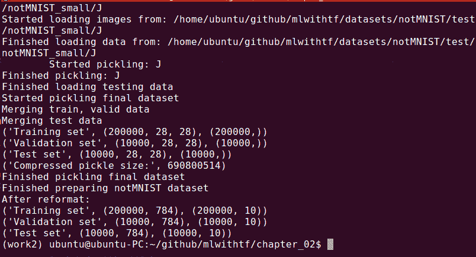
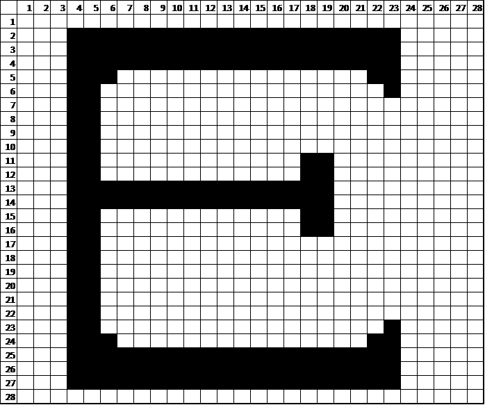
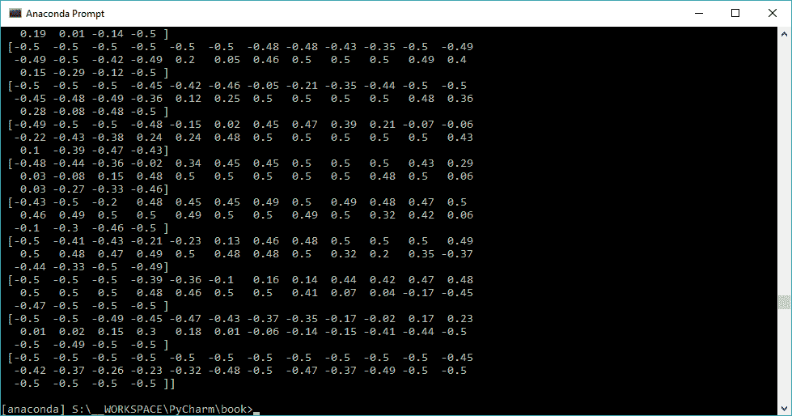
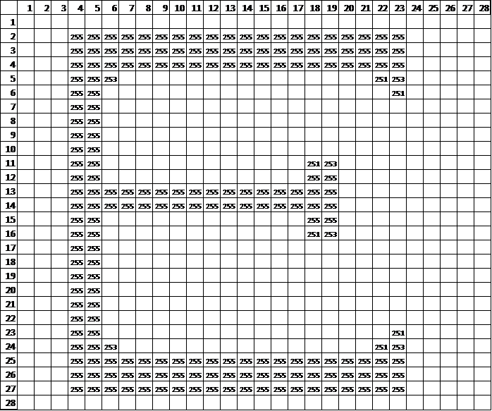
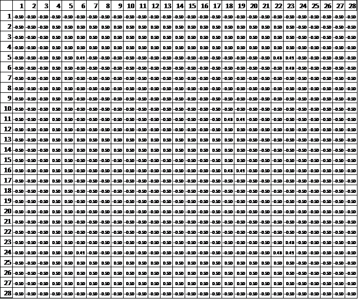
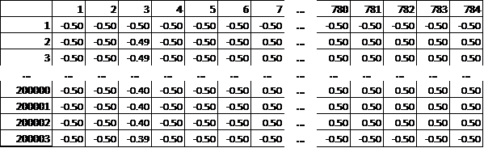
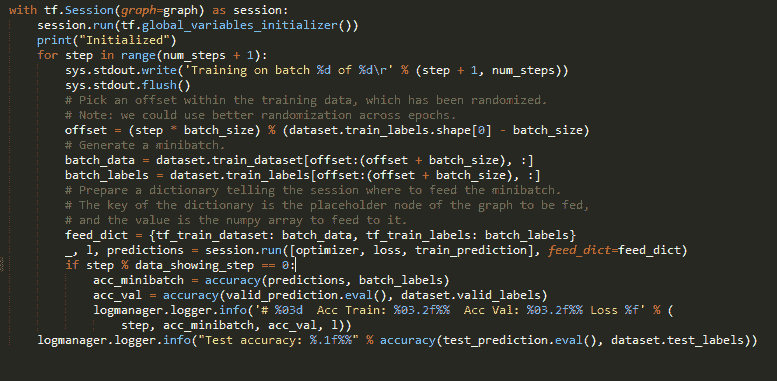
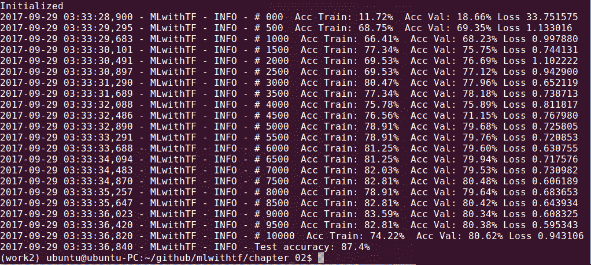
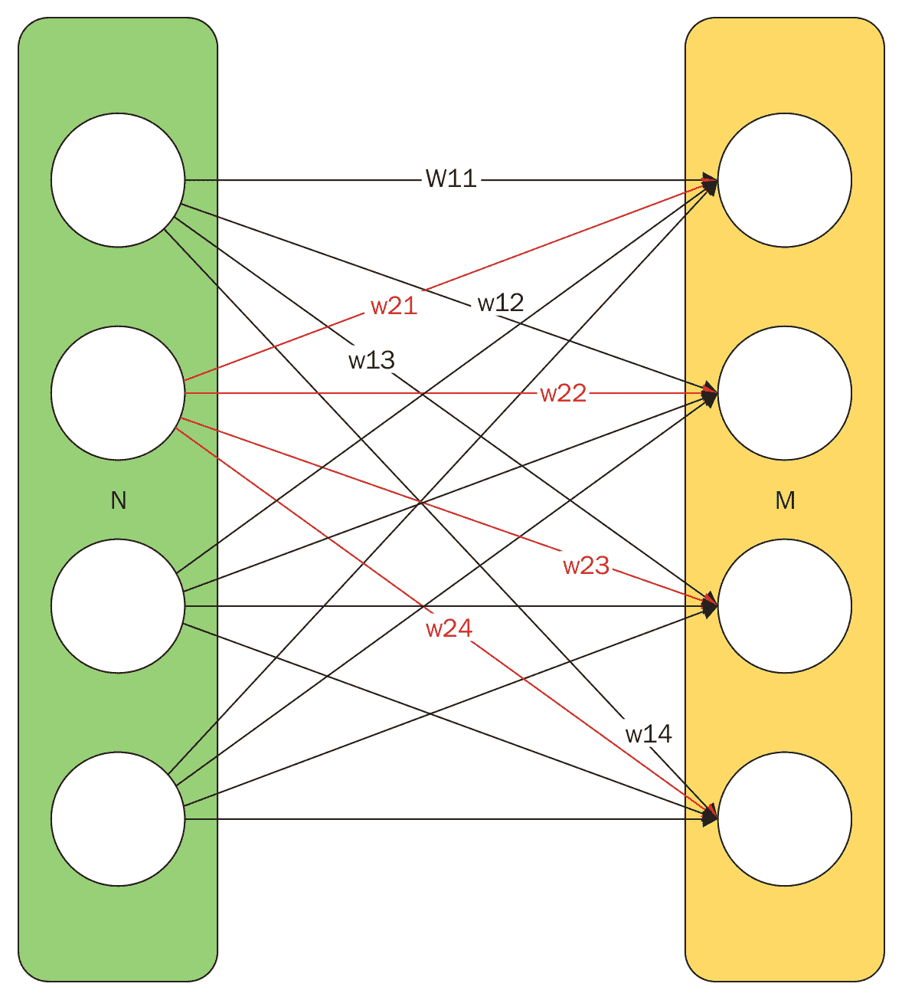

# 你的第一个分类器

现在安装了 TensorFlow，我们需要踢踢轮胎。我们将通过编写我们的第一个分类器，然后从头到尾对其进行训练和测试来实现这一点！

我们的第一个分类器是手写识别器。最常见的训练数据集之一是 **MNIST** 手写数字数据集。我们将使用一个类似的名为`notMNIST`的数据集，它以英文字母表的前十个字母为特征。


# 关键部分

大多数机器学习分类器有三个关键部分，如下所示:

*   培训渠道
*   神经网络设置和训练输出
*   使用管道

训练管道获取数据，对其进行分级、清洗、均质化，并将其置于神经网络可接受的格式中。如果训练管道最初花费了你 80%到 85%的努力，不要感到惊讶——这是大多数机器学习工作的现实。一般来说，训练数据越真实，花在训练管道上的时间就越多。在企业环境中，培训管道可能是一项持续的工作，会不断得到增强。随着数据集变得越来越大，尤其如此。

第二部分，神经网络的建立和训练，对于常规问题可以很快，对于较难的问题可以是研究级的努力。您可能会发现自己一遍又一遍地对网络设置进行微小的更改，直到最终达到所需的分类器精度。训练是计算开销最大的部分，所以在评估每个增量修改的结果之前需要时间。

一旦初始设置完成，网络被训练到足够精确的水平，我们就可以一遍又一遍地使用它。在[第 10 章](f1a5c9c4-6076-487f-abd1-b5a6e800890f.xhtml)、*上线并做大*中，我们将探索更高级的主题，如持续学习，其中甚至用法也可以反馈到分类器的进一步训练中。


# 获取培训数据

机器学习需要训练数据——往往是大量的训练数据。机器学习的一个伟大之处是标准训练数据集的可用性。这些通常用于对节点模型和配置进行基准测试，并提供一个一致的标准来衡量以前进展的性能。许多数据集也用于年度全球竞赛。

本章使用了机器学习研究员雅罗斯拉夫·布拉托夫(Yaroslav Bulatov)好心提供的训练数据。


# 下载训练数据

您应该从以下链接下载培训数据开始:

*   [http://yaroslavvb.com/upload/notMNIST/notMNIST_small.tar.gz](http://yaroslavvb.com/upload/notMNIST/notMNIST_small.tar.gz)
*   [http://yaroslavvb.com/upload/notMNIST/notMNIST_large.tar.gz](http://yaroslavvb.com/upload/notMNIST/notMNIST_large.tar.gz)

我们将以编程方式下载它，但是我们应该从手动下载开始，以便查看归档的数据和结构。当我们编写管道时，这将是很重要的，因为我们需要理解结构，这样我们才能操作数据。

这个小布景非常适合偷看。您可以通过以下命令行来完成此操作，或者只使用浏览器下载文件，并使用解压缩程序来解压缩文件(我建议您熟悉命令行，因为所有这些都需要自动化):

```
cd ~/workdir
wget http://yaroslavvb.com/upload/notMNIST/notMNIST_small.tar.gz
tar xvf notMNIST_small.tar.gz
```

前面的命令行将显示一个名为`notMNIST_small`的容器文件夹，下面有十个子文件夹，每个文件夹对应字母表`a`到`j`中的一个字母。在每个字母文件夹下，有成千上万个 28x28 像素的字母图像。此外，需要注意的一件有趣的事情是每个字母图像的文件名，(`QnJhbmRpbmcgSXJvbi50dGY=`)，暗示一个不包含使用信息的随机字符串。


# 理解类

我们正在编写的分类器试图将未知图像分配给一个类别。类别可以是以下类型:

*   猫对狗
*   两个对七个
*   肿瘤与正常
*   微笑对皱眉

在我们的案例中，我们考虑在总共 10 节课中把每个字母作为一节课。训练集将显示 10 个子文件夹，每个子文件夹下有数千幅图像。子文件夹的名称很重要，因为它是每个图像的标签。管道将使用这些细节为 TensorFlow 准备数据。


# 自动化培训数据设置

理想情况下，我们希望整个过程自动化。这样，我们可以轻松地在我们使用的任何计算机上端到端地运行该过程，而不必携带辅助资产。这在以后会很重要，因为我们经常在一台计算机(我们的开发机器)上开发，而在另一台机器(我们的生产服务器)上部署。

我已经写了这一章的代码，以及所有其他章节的代码；在[https://github.com/mlwithtf/MLwithTF](https://github.com/mlwithtf/MLwithTF)有售。我们的方法是在理解的同时一起重写。一些简单的部分，比如这个，可以跳过。我建议分叉存储库并为您的项目克隆一个本地副本:

```
cd ~/workdir
git clone https://github.com/mlwithtf/MLwithTF
cd chapter_02
```

此特定部分的代码可从以下位置获得—[https://github . com/mlwithtf/mlwithtf/blob/master/chapter _ 02/download . py .](https://github.com/mlwithtf/mlwithtf/blob/master/chapter_02/download.py)

准备数据集是训练过程的重要部分。在我们深入研究代码之前，我们将运行`download.py`来自动下载和准备数据集:

```
python download.py
```

结果将如下所示:

****

现在，我们来看看`download.py`中使用的几个函数。您可以在该文件中找到代码:

[https://github . com/mlwithtf/mlwithtf/blob/master/data _ utils . py](https://github.com/mlwithtf/mlwithtf/blob/master/data_utils.py)

下面的`downloadFile`函数将自动下载文件，并根据预期的文件大小进行验证:

```
 from __future__ import print_function 
 import os 
 from six.moves.urllib.request import urlretrieve 
 import datetime 
 def downloadFile(fileURL, expected_size): 
    timeStampedDir=datetime.datetime.now()
     .strftime("%Y.%m.%d_%I.%M.%S") 
    os.makedirs(timeStampedDir) 
    fileNameLocal = timeStampedDir + "/" +     
    fileURL.split('/')[-1] 
    print ('Attempting to download ' + fileURL) 
    print ('File will be stored in ' + fileNameLocal) 
    filename, _ = urlretrieve(fileURL, fileNameLocal) 
    statinfo = os.stat(filename) 
    if statinfo.st_size == expected_size: 
        print('Found and verified', filename) 
    else: 
        raise Exception('Could not get ' + filename) 
    return filename 
```

该函数可以按如下方式调用:

```
 tst_set = 
 downloadFile('http://yaroslavvb.com/upload/notMNIST/notMNIST_small
 .tar.gz', 8458043) 
```

提取内容的代码如下(注意需要额外的导入):

```
 import os, sys, tarfile 
 from os.path import basename 

 def extractFile(filename): 
    timeStampedDir=datetime.datetime.now()
     .strftime("%Y.%m.%d_%I.%M.%S") 
    tar = tarfile.open(filename) 
    sys.stdout.flush() 
    tar.extractall(timeStampedDir) 
    tar.close() 
    return timeStampedDir + "/" + os.listdir(timeStampedDir)[0] 
```

我们依次调用`download`和提取方法如下:

```
 tst_src='http://yaroslavvb.com/upload/notMNIST/notMNIST_small.tar.
 gz' 
 tst_set = downloadFile(tst_src, 8458043) 
 print ('Test set stored in: ' + tst_set) 
 tst_files = extractFile(tst_set) 
 print ('Test file set stored in: ' + tst_files) 
```


# 附加设置

下一部分将关注图像处理和操作。这需要一些你可能没有的额外的库。此时，只安装科学计算中所需的所有典型包可能是有意义的，可以按如下方式完成:

```
sudo apt-get install python-numpy python-scipy python-matplotlib 
ipython ipython-notebook python-pandas python-sympy python-nose
```

此外，安装图像处理库、一些外部矩阵数学库和底层要求，可按如下方式完成:

```
sudo pip install ndimage
sudo apt-get install libatlas3-base-dev gcc gfortran g++
```


# 将图像转换为矩阵

很多机器学习只是对矩阵的操作。接下来我们将开始这个过程，把我们的图像转换成一系列的矩阵——本质上，一个和我们拥有的图像一样宽的 3D 矩阵。

我们将在本章和整本书中执行的几乎所有矩阵运算都使用 NumPy——Python 领域中最流行的科学计算包。NumPy 在[http://www.numpy.org/](http://www.numpy.org/)有售。您应该在运行下一系列操作之前安装它。

以下代码打开图像并创建数据矩阵(注意现在需要三个额外的导入):

```
 import numpy as np 
 from IPython.display import display, Image 
 from scipy import ndimage 

 image_size = 28  # Pixel width and height. 
 pixel_depth = 255.0  # Number of levels per pixel. 
 def loadClass(folder): 
  image_files = os.listdir(folder) 
  dataset = np.ndarray(shape=(len(image_files), 
  image_size, 
   image_size), dtype=np.float32) 
  image_index = 0 
  print(folder) 
  for image in os.listdir(folder): 
    image_file = os.path.join(folder, image) 
    try: 
      image_data =  
     (ndimage.imread(image_file).astype(float) -  
                    pixel_depth / 2) / pixel_depth 
      if image_data.shape != (image_size, image_size): 
        raise Exception('Unexpected image shape: %s' % 
     str(image_data.shape)) 
      dataset[image_index, :, :] = image_data 
      image_index += 1 
     except IOError as e: l
      print('Could not read:', image_file, ':', e, '-   
      it\'s ok, 
       skipping.') 
     return dataset[0:image_index, :, :] 
```

我们有从上一节提取的文件。现在，我们可以简单地对所有提取的图像运行此过程，如下所示:

```
 classFolders = [os.path.join(tst_files, d) for d in 
 os.listdir(tst_files) if os.path.isdir(os.path.join(tst_files, 
 d))] 
 print (classFolders) 
 for cf in classFolders: 
    print ("\n\nExaming class folder " + cf) 
    dataset=loadClass(cf) 
    print (dataset.shape) 
```

该过程实质上是将字母加载到一个矩阵中，如下所示:



然而，对矩阵的一瞥揭示了更多微妙之处。继续在堆栈上打印任意一层(例如，`np.set_printoptions(precision=2); print (dataset[47]`)来看看。你会发现一个矩阵不是位的，而是浮点数的:



图像首先被加载到值为 0 到 255 的矩阵中:



这些被缩小到-0.5 到 0.5 之间的数字，我们稍后将重新讨论原因。我们最终会得到一堆像这样的图像:



这些都是灰度图像，所以我们只处理一层。我们将在以后的章节中处理彩色图像；在这些情况下，每张照片将有一个高度为 3 的矩阵和一个单独的红色、绿色和蓝色矩阵。


# 逻辑停止点

下载我们的培训文件花了很长时间。即使提取所有的图像也需要一段时间。为了避免重复所有这些，我们将尝试一次性完成所有工作，然后创建 **pickle 文件**——Python 数据结构的存档。

下面的过程贯穿我们的训练和测试集中的每个类，并为每个类创建一个单独的`pickle`文件。在以后的运行中，我们将从这里开始:

```
 def makePickle(imgSrcPath): 
    data_folders = [os.path.join(tst_files, d) for d in 
     os.listdir(tst_files) if os.path.isdir(os.path.join(tst_files, 
     d))] 
    dataset_names = [] 
    for folder in data_folders: 
        set_filename = folder + '.pickle' 
        dataset_names.append(set_filename) 
        print('Pickling %s.' % set_filename) 
        dataset = loadClass(folder) 
        try: 
            with open(set_filename, 'wb') as f: 
                pickle.dump(dataset, f, pickle.HIGHEST_PROTOCOL) 
        except Exception as e: 
            print('Unable to save data to', set_filename, ':', e) 
    return dataset_names 
```

`Pickle`文件本质上是持久的和可重构的字典转储。


# 机器学习公文包

我们刚刚用预处理过的图像创建了漂亮、干净的`pickle`文件来训练和测试我们的分类器。然而，我们最终得到了 20 个`pickle`文件。这有两个问题。首先，我们有太多的文件需要跟踪。其次，我们只完成了管道的一部分，我们已经处理了图像集，但还没有准备 TensorFlow 可消费文件。

现在我们需要创建三个主要的集合——训练集、验证集和测试集。训练集将用于推动我们的分类器，而验证集将用于衡量每次迭代的进展。测试集将在训练结束前保密，训练结束时，它将用于测试我们对模型的训练情况。

完成所有这些工作的代码很长，所以我们将让您查看 Git 存储库。请密切注意以下三个功能:

```
 def randomize(dataset, labels): 
    permutation = np.random.permutation(labels.shape[0]) 
    shuffled_dataset = dataset[permutation, :, :] 
    shuffled_labels = labels[permutation] 
    return shuffled_dataset, shuffled_labels  

 def make_arrays(nb_rows, img_size): 
    if nb_rows: 
        dataset = np.ndarray((nb_rows, img_size, img_size),   
 dtype=np.float32) 
        labels = np.ndarray(nb_rows, dtype=np.int32) 
    else: 
        dataset, labels = None, None 
    return dataset, labels 

 def merge_datasets(pickle_files, train_size, valid_size=0): 
  num_classes = len(pickle_files) 
  valid_dataset, valid_labels = make_arrays(valid_size,  
  image_size) 
  train_dataset, train_labels = make_arrays(train_size,  
  image_size) 
  vsize_per_class = valid_size // num_classes 
  tsize_per_class = train_size // num_classes 

  start_v, start_t = 0, 0 
  end_v, end_t = vsize_per_class, tsize_per_class 
  end_l = vsize_per_class+tsize_per_class 
  for label, pickle_file in enumerate(pickle_files): 
    try: 
      with open(pickle_file, 'rb') as f: 
        letter_set = pickle.load(f) 
        np.random.shuffle(letter_set) 
        if valid_dataset is not None: 
          valid_letter = letter_set[:vsize_per_class, :, :] 
          valid_dataset[start_v:end_v, :, :] = valid_letter 
          valid_labels[start_v:end_v] = label 
          start_v += vsize_per_class 
          end_v += vsize_per_class 

        train_letter = letter_set[vsize_per_class:end_l, :, :] 
        train_dataset[start_t:end_t, :, :] = train_letter 
        train_labels[start_t:end_t] = label 
        start_t += tsize_per_class 
        end_t += tsize_per_class 
    except Exception as e: 
      print('Unable to process data from', pickle_file, ':', e) 
      raise 

  return valid_dataset, valid_labels, train_dataset, train_labels 
```

这三个完成了我们的管道方法。但是，我们仍然需要使用管道。为此，我们将首先定义我们的培训、验证和测试规模。您可以更改它，但是您应该保持它小于可用的最大大小，当然:

```
     train_size = 200000 
     valid_size = 10000 
     test_size = 10000 
```

然后，这些大小将用于构建合并的(即，组合我们所有的类)数据集。我们将传入一系列`pickle`文件来获取我们的数据，并获取一个标签向量和一个图像矩阵堆栈。最后，我们将重组数据集，如下所示:

```
 valid_dataset, valid_labels, train_dataset, train_labels = 
  merge_datasets( 
   picklenamesTrn, train_size, valid_size) 
 _, _, test_dataset, test_labels = merge_datasets(picklenamesTst, 
  test_size) 
 train_dataset, train_labels = randomize(train_dataset, 
  train_labels) 
 test_dataset, test_labels = randomize(test_dataset, test_labels) 
 valid_dataset, valid_labels = randomize(valid_dataset, 
  valid_labels) 
```

我们可以看到新合并的数据集，如下所示:

```
 print('Training:', train_dataset.shape, train_labels.shape) 
 print('Validation:', valid_dataset.shape, valid_labels.shape) 
 print('Testing:', test_dataset.shape, test_labels.shape) 
```

咻！这是很多我们不想在未来重复的工作。幸运的是，我们不必这样做，因为我们将把三个新数据集重新放入一个巨大的文件中。展望未来，所有的学习都将跳过前面的步骤，直接从巨型`pickle`开始:

```
 pickle_file = 'notMNIST.pickle' 

 try: 
   f = open(pickle_file, 'wb') 
   save = { 
      'datTrn': train_dataset, 
    'labTrn': train_labels, 
    'datVal': valid_dataset, 
    'labVal': valid_labels, 
    'datTst': test_dataset, 
    'labTst': test_labels, 
     } 
   pickle.dump(save, f, pickle.HIGHEST_PROTOCOL) 
   f.close() 
 except Exception as e: 
   print('Unable to save data to', pickle_file, ':', e) 
   raise 

 statinfo = os.stat(pickle_file) 
 print('Compressed pickle size:', statinfo.st_size) 
```

将矩阵输入 TensorFlow 的理想方式实际上是作为一维数组；因此，我们将把 28x28 矩阵重新格式化成 784 位小数的字符串。为此，我们将使用以下`reformat`方法:

```
 def reformat(dataset, labels): 
   dataset = dataset.reshape((-1, image_size * 
    image_size)).astype(np.float32) 
   labels = (np.arange(num_labels) == 
    labels[:,None]).astype(np.float32) 
   return dataset, labels 
```

我们的图像现在看起来像这样，训练集、验证集和测试集中的每个图像都有一行:



最后，为了打开并处理`pickle`文件的内容，我们将简单地读取前面选择的变量名，并像 hashmap 一样挑选数据:

```
 with open(pickle_file, 'rb') as f: 
   pkl = pickle.load(f) 
   train_dataset, train_labels = reformat(pkl['datTrn'], 
    pkl['labTrn']) 
   valid_dataset, valid_labels = reformat(pkl['datVal'], 
    pkl['labVal']) 
   test_dataset, test_labels = reformat(pkl['datTst'], 
    pkl['labTst']) 
```


# 训练日

现在，我们到了有趣的部分——神经网络。训练此模型的完整代码可从以下链接获得:[https://github . com/mlwithtf/mlwithtf/blob/master/chapter _ 02/training . py](https://github.com/mlwithtf/mlwithtf/blob/master/chapter_02/training.py)

为了训练模型，我们将再导入几个模块:

```
 import sys, os
 import tensorflow as tf
 import numpy as np
 sys.path.append(os.path.realpath('..'))
 import data_utils
 import logmanager 
```

然后，我们将为培训过程定义几个参数:

```
 batch_size = 128
 num_steps = 10000
 learning_rate = 0.3
 data_showing_step = 500
```

之后，我们将使用`data_utils`包加载在上一节中下载的数据集:

```
 dataset, image_size, num_of_classes, num_of_channels =  
 data_utils.prepare_not_mnist_dataset(root_dir="..")
 dataset = data_utils.reformat(dataset, image_size, num_of_channels,   
 num_of_classes)
 print('Training set', dataset.train_dataset.shape,  
 dataset.train_labels.shape)
 print('Validation set', dataset.valid_dataset.shape,  
 dataset.valid_labels.shape)
 print('Test set', dataset.test_dataset.shape,  
 dataset.test_labels.shape)
```

我们将从全连接网络开始。现在，只要相信网络设置(我们稍后将进入设置理论)。我们将把神经网络表示为一个图，在下面的代码中称为`graph`:

```
 graph = tf.Graph()
 with graph.as_default():
 # Input data. For the training data, we use a placeholder that will  
 be fed
 # at run time with a training minibatch.
 tf_train_dataset = tf.placeholder(tf.float32,
 shape=(batch_size, image_size * image_size * num_of_channels))
 tf_train_labels = tf.placeholder(tf.float32, shape=(batch_size,  
 num_of_classes))
 tf_valid_dataset = tf.constant(dataset.valid_dataset)
 tf_test_dataset = tf.constant(dataset.test_dataset)
 # Variables.
 weights = {
 'fc1': tf.Variable(tf.truncated_normal([image_size * image_size *  
 num_of_channels, num_of_classes])),
 'fc2': tf.Variable(tf.truncated_normal([num_of_classes,  
 num_of_classes]))
 }
 biases = {
 'fc1': tf.Variable(tf.zeros([num_of_classes])),
 'fc2': tf.Variable(tf.zeros([num_of_classes]))
 }
 # Training computation.
 logits = nn_model(tf_train_dataset, weights, biases)
 loss = tf.reduce_mean(
 tf.nn.softmax_cross_entropy_with_logits(logits=logits,  
 labels=tf_train_labels))
 # Optimizer.
 optimizer =  
 tf.train.GradientDescentOptimizer(learning_rate).minimize(loss)
 # Predictions for the training, validation, and test data.
 train_prediction = tf.nn.softmax(logits)
 valid_prediction = tf.nn.softmax(nn_model(tf_valid_dataset,  
 weights, biases))
 test_prediction = tf.nn.softmax(nn_model(tf_test_dataset, weights,  
 biases))
 The most important line here is the nn_model where the neural  
 network is defined:
 def nn_model(data, weights, biases):
 layer_fc1 = tf.matmul(data, weights['fc1']) + biases['fc1']
 relu_layer = tf.nn.relu(layer_fc1)
 return tf.matmul(relu_layer, weights['fc2']) + biases['fc2']
```

用于训练模型的`loss`函数也是该过程中的一个重要因素:

```
 loss = tf.reduce_mean(
 tf.nn.softmax_cross_entropy_with_logits(logits=logits,  
 labels=tf_train_labels))
 # Optimizer.
 optimizer =  
 tf.train.GradientDescentOptimizer(learning_rate).minimize(loss)
```

这是正在使用的优化器(随机梯度下降)以及`learning_rate (0.3)`和我们试图最小化的函数(带交叉熵的 softmax)。

真正的行动，也是最耗时的部分，在于下一个也是最后一个环节——训练循环:



我们可以在`chapter_02`目录中使用以下命令来运行这个训练过程:

```
python training.py
```

运行该过程会产生以下输出:



我们正在运行数百个周期，每 500 个周期打印一次指示性结果。当然，您可以修改这些设置。重要的是理解这个循环:

*   我们将多次循环这个过程。
*   每次，我们将创建一个迷你批的照片，这是一个完整的图像集的雕琢。
*   每一步运行 TensorFlow 会话，并产生一个损失和一组预测。每一步还对验证集进行预测。
*   在迭代周期结束时，我们将对我们的测试集进行最终预测，这是一个迄今为止的秘密。
*   对于所做的每一个预测，我们将以预测准确性的形式来观察我们的进展。

我们之前没有讨论过`accuracy`方法。该方法简单地将预测标签与已知标签进行比较，以计算百分比分数:

```
 def accuracy(predictions, labels): 
  return (100.0 * np.sum(np.argmax(predictions, 1) == 
   np.argmax(labels, 1)) 
          / predictions.shape[0])
```

仅仅运行前面的分类器将产生 85%的一般范围内的准确度。这是非凡的，因为我们才刚刚开始！我们可以继续做更多的调整。


# 保存模型以供持续使用

要保存 TensorFlow 会话中的变量以备将来使用，可以使用`Saver()`函数，如下所示:

```
 saver = tf.train.Saver() 
```

稍后，您可以通过恢复以下检查点来检索模型的状态并避免繁琐的重新训练:

```
 ckpt = tf.train.get_checkpoint_state(FLAGS.checkpoint_dir) 
 if ckpt and ckpt.model_checkpoint_path: 
 saver.restore(sess, ckpt.model_checkpoint_path) 
```


# 为什么要隐藏测试集？

请注意，我们直到最后一步才使用测试集。为什么不呢？这是一个非常重要的细节，以确保测试保持良好。当我们迭代训练集并以这种或那种方式轻推我们的分类器时，我们有时可以*将分类器*包裹在图像或过度训练周围。当您学习训练集而不是学习每个类中的特性时，就会发生这种情况。

当我们过度训练时，我们在训练集的迭代回合中的准确性看起来很有希望，但那都是虚假的希望。拥有一个前所未见的测试集应该将现实引入到这个过程中。训练集上的高精度后面跟着测试集上的差结果表明过度拟合。

这就是为什么我们保留了一个单独的测试集。它有助于表明我们的分类器的真正准确性。这也是为什么你不应该打乱你的数据集或者把数据集和测试集混在一起。


# 使用分类器

我们将用`notMNIST_small.tar.gz`来演示分类器的用法，它将成为测试集。对于分类器的持续使用，您可以获取自己的图像，并通过类似的管道运行它们以进行测试，而不是训练。

您可以自己创建一些 28x28 的图像，并将它们放入测试集中进行评估。你会惊喜的！

野外使用的实际问题是野外图像的异质性。您可能需要查找图像、裁剪图像、缩小图像或执行十几种其他变换。这些都属于我们前面讨论过的使用管道。

覆盖较大图像的另一种技术，例如在页面大小的图像上找到一个字母，是在大图像上滑动一个小窗口，并通过分类器输入图像的每个子部分。

我们将在以后的章节中把我们的模型投入生产，但是，作为一个预览，一个常见的设置是将训练好的模型移动到云上的服务器中。该系统的外观可能是一个智能手机应用程序，它可以拍摄照片，并在幕后将照片发送出去进行分类。在这种情况下，我们将使用 web 服务包装整个程序，以接受输入的分类请求，并以编程方式响应它们。有几十种流行的设置，我们将在第 9 章、*巡航控制-自动化*中探讨其中几种。


# 深入网络

请注意我们是如何达到 86%的准确率的。对于两个小时的工作来说，这是一个很好的结果，但我们可以做得更好。未来的潜力很大程度上在于改变神经网络。我们之前的应用程序使用了**全连接**设置，其中一层上的每个节点都连接到前一层上的每个节点，如下所示:



在接下来的章节中，你会学到更复杂的网络设置，这种设置很快，但并不理想。最大的问题是大量的参数，这会导致模型在训练数据上过度拟合。


# 学到的技能

您应该已经在本章中学到了这些技能:

*   准备培训和测试数据
*   创建可由 TensorFlow 使用的训练集
*   建立基本神经网络图
*   训练张量流分类器
*   验证分类器
*   真实世界数据的管道


# 摘要

高超的进步！我们刚刚建立了一个手写分类器，这在十年前是世界一流的。此外，我们围绕该流程构建了一个完整的流程，以实现培训设置和执行的完全自动化。这意味着我们的程序几乎可以移植到任何服务器上，并且几乎可以继续运行。