# TensorFlow 工具箱

大多数机器学习平台都面向学术或工业领域的科学家和从业者。因此，虽然它们非常强大，但往往粗糙，用户体验功能很少。

相当多的精力花在了查看模型的各个阶段，以及查看和汇总跨模型和运行的性能上。即使是查看神经网络也要付出比预期多得多的努力。

虽然这在神经网络简单且只有几层深度时是可以接受的，但今天的网络要深得多。2015 年，微软利用 152 层的深度网络赢得了年度 **ImageNet** 竞赛。可视化这样的网络可能是困难的，偷看重量和偏见可能是压倒性的。

从业者开始使用自制的可视化工具和引导工具来分析他们的网络和运行性能。TensorFlow 改变了这一点，在发布整体平台的同时直接发布了 TensorBoard。TensorBoard 开箱即用，无需额外安装或设置。

用户只需要根据他们希望捕获的内容来检测他们的代码。它的特点是绘制事件、学习率和随时间的损失；直方图，用于权重和偏差；和图像。图形浏览器允许对神经网络进行交互式审查。

在本章中，我们将重点关注以下几个方面:

*   我们将使用四个常见的模型和数据集作为示例，从馈送 TensorBoard 所需的仪器开始，强调所需的更改。
*   然后，我们将回顾获取的数据以及解释这些数据的方法。
*   最后，我们将回顾图形浏览器显示的常见图形。这将有助于你可视化常见的神经网络设置，这将在后面的章节和项目中介绍。这也是对常见网络的直观介绍。


# 快速预览

即使没有安装 TensorFlow，您也可以使用 TensorBoard 的参考实现。您可以从这里开始:

[https://www.tensorflow.org/tensorboard/index.html#graphs.](https://www.tensorflow.org/tensorboard/index.html#graphs)

您可以跟随此处的代码:

[https://github . com/tensor flow/tensor flow/blob/master/tensor flow/model
s/image/cifar 10/cifar 10 _ train . py .](https://github.com/tensorflow/models/blob/master/tutorials/image/cifar10/cifar10_train.py)

该示例使用了 **CIFAR-10** 图像集。CIFAR-10 数据集由 Alex Krizhevsky、Vinod Nair 和 Geoffrey Hinton 编译的 10 类 60，000 幅图像组成。该数据集已经成为机器学习工作的几个标准学习工具和基准之一。

让我们从图形浏览器开始。我们可以立即看到一个卷积网络正在使用。这并不奇怪，因为我们在这里尝试对图像进行分类:

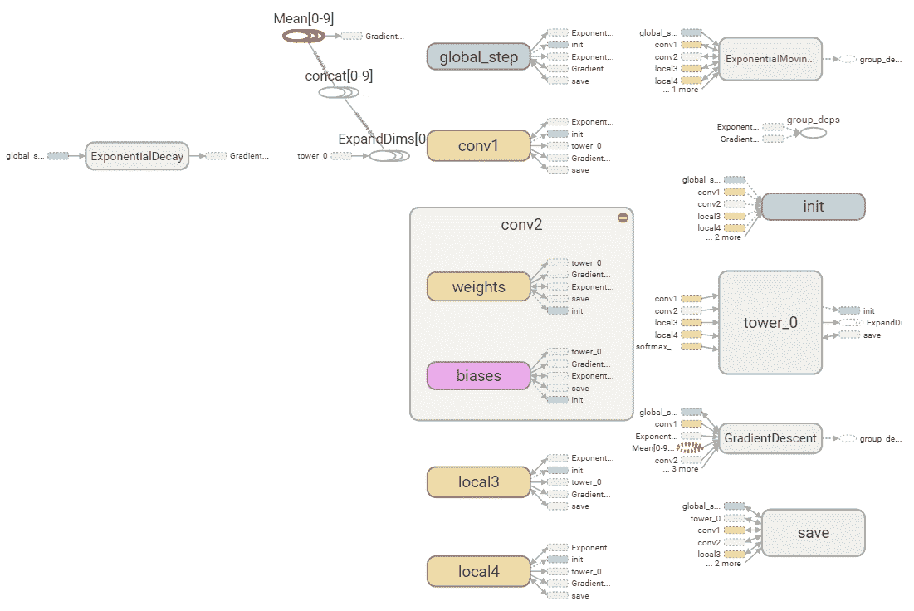

这只是图表的一种可能的视图。您也可以尝试图形浏览器。它允许深入研究单个组件。

快速预览的下一站是事件选项卡。该选项卡显示一段时间内的标量数据。不同的统计数据被分组到右侧的各个选项卡中。下面的屏幕截图显示了一些流行的标量统计数据，如网络多个部分的丢失、学习率、交叉熵和稀疏度:

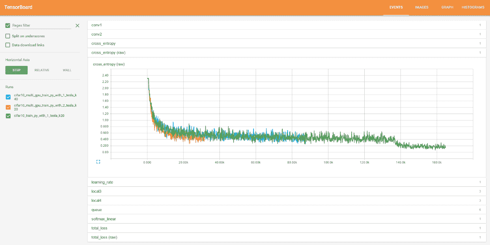

直方图选项卡是一个近亲，因为它显示一段时间内的张量数据。尽管名为 TensorFlow v0.7，但它实际上并不显示直方图。相反，它使用百分位数显示张量数据的摘要。

下图显示了摘要视图。就像事件选项卡一样，数据被分组到右侧的选项卡中。不同的运行可以切换开和关，运行可以显示重叠，允许有趣的比较。

它有三个运行，我们可以在左侧看到，我们将只看`softmax`函数和相关参数。

现在，不要太担心这些意味着什么，我们只是看看我们可以为自己的分类器实现什么:

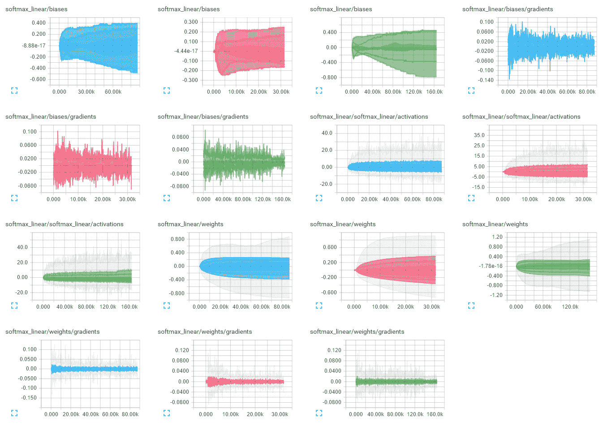

然而，摘要视图并没有很好地利用直方图选项卡。相反，我们将放大一张图来观察发生了什么。如下图所示:

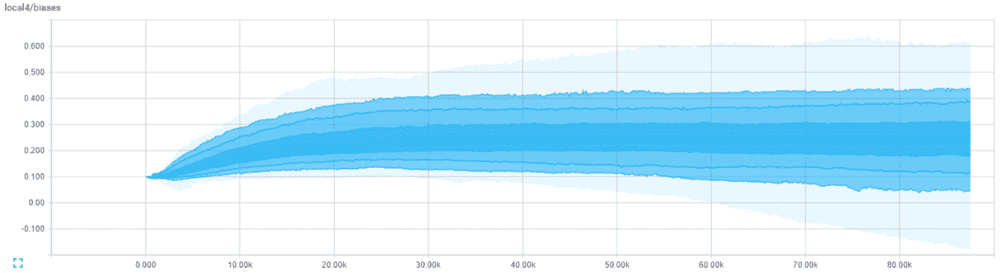

请注意，每个直方图显示了一个由九条线组成的时间序列。顶部是最大值，中间是中间值，底部是最小值。中间值正上方和正下方的三条线分别是 1 标准差、1 标准差、标准差标志。

显然，这确实代表了多峰分布，因为它不是直方图。然而，它确实提供了一个快速的要点，否则这些数据将堆积如山。

需要注意的几件事是如何通过运行收集和分离数据，如何收集不同的数据流，如何放大视图，以及如何放大每个图表。

图形已经够多了，让我们直接进入代码，这样我们就可以自己运行了！


# 安装张量板

TensorFlow 预装了 TensorBoard，所以已经安装了。它作为本地提供的 web 应用程序运行，可通过浏览器在`http://0.0.0.0:6006`访问。方便的是，不需要服务器端代码或配置。

根据路径的位置，您可以直接运行它，如下所示:

```
tensorboard --logdir=/tmp/tensorlogs
```

如果路径不正确，您可能需要相应地为应用程序添加前缀，如以下命令行所示:

```
tf_install_dir/ tensorflow/tensorboard --
logdir=/tmp/tensorlogs
```

在 Linux 上，您可以在后台运行它，并让它继续运行，如下所示:

```
nohup tensorboard --logdir=/tmp/tensorlogs &
```

不过，应该对目录结构进行一些思考。仪表板左侧的运行列表由`logdir`位置的子目录驱动。下图显示了两次运行- `MNIST_Run1`和`MNIST_Run2`。有一个有组织的`runs`文件夹将允许并排绘制连续的运行以查看差异:

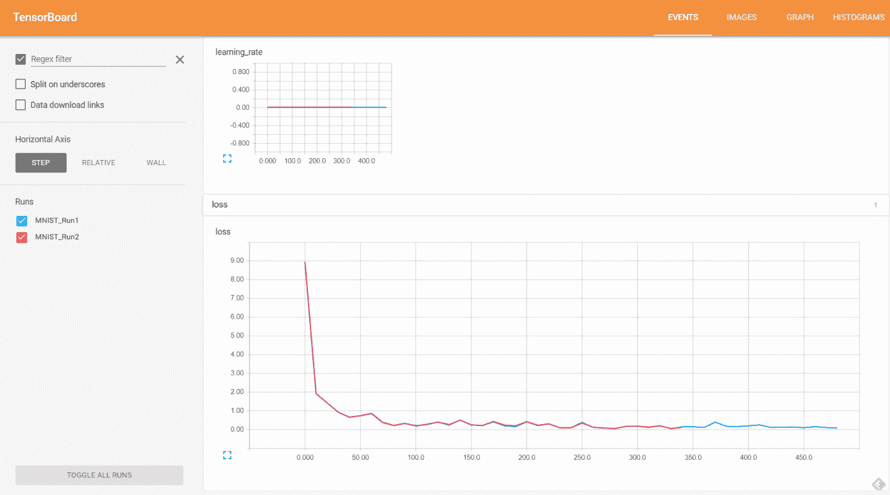

初始化`writer`时，将日志的目录作为第一个参数传入，如下:

```
   writer = tf.summary.FileWriter("/tmp/tensorlogs",   
   sess.graph) 
```

考虑保存一个基本位置，并为每次运行追加特定于运行的子目录。这将有助于组织产出，而无需花费更多的心思。我们稍后会详细讨论这一点。


# 在我们的代码中加入钩子

开始使用 TensorBoard 的最佳方式是采用现有的工作示例，并使用 TensorBoard 所需的代码对它们进行测试。我们将为几个常见的培训脚本这样做。


# 手写数字

让我们从图像机器学习的典型 Hello World 开始——MNIST 手写数字分类练习。

正在使用的 MNIST 数据库有 60，000 幅图像用于训练，另有 10，000 幅图像用于测试。它最初由 Chris Burges 和 Corinna Cortes 收集，并由 Yann LeCun 增强。你可以在 Yann LeCun 的网站(【http://yann.lecun.com/exdb/mnist/】T21)上找到更多关于数据集的信息。

TensorFlow 方便地附带了一个测试脚本，使用 MSNIST 手写演示了一个卷积神经网络，可从[https://github . com/tensor flow/models/blob/master/tutorials/image/mnist/convolutionary . py](https://github.com/tensorflow/models/blob/master/tutorials/image/mnist/convolutional.py)获得。

让我们修改这个脚本以允许 TensorBoard 的使用。如果你想提前看到，下载一份黄金拷贝或者看看 deltas 我们所有的改动都可以在这本书的 GitHub 知识库中找到([https://github.com/mlwithtf/mlwithtf](https://github.com/mlwithtf/mlwithtf))。

目前，我们建议跟随并逐步进行更改，以理解该过程。

在`main`类的早期，我们将定义`convn_weights`、`convn_biases`和其他参数的持有者。紧接着，我们将编写以下代码来将它们添加到`histogram`:

```
    tf.summary.histogram('conv1_weights', conv1_weights) 
    tf.summary.histogram('conv1_biases', conv1_biases) 
    tf.summary.histogram('conv2_weights', conv2_weights) 
    tf.summary.histogram('conv2_biases', conv2_biases) 
    tf.summary.histogram('fc1_weights', fc1_weights) 
    tf.summary.histogram('fc1_biases', fc1_biases) 
    tf.summary.histogram('fc2_weights', fc2_weights) 
    tf.summary.histogram('fc2_biases', fc2_biases) 
```

前面几行捕获了直方图选项卡的值。请注意，捕获的值形成了直方图选项卡上的子部分，如下面的屏幕截图所示:

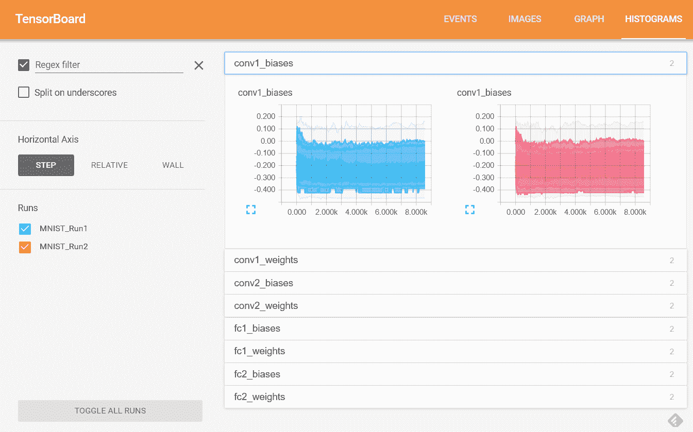

接下来，我们来记录一些`loss`数字。我们从下面的代码开始:

```
    loss += 5e-4 * regularizers 
```

我们将在前一行之后添加`loss`数字的`scalar`摘要:

```
    tf.summary.scalar("loss", loss) 
```

类似地，我们将从计算`learning_rate`的标准代码开始:

```
     learning_rate = tf.train.exponential_decay( 
        0.01,  # Base learning rate. 
        batch * BATCH_SIZE,  # Current index into the    
        dataset. 
        train_size,  # Decay step. 
        0.95,  # Decay rate. 
        staircase=True) 
```

我们将为`learning_rate`图添加一个`scalar`摘要，如下所示:

```
    tf.summary.scalar("learning_rate", learning_rate) 
```

前面这两行帮助我们在 EVENTS 选项卡中获取这些重要的标量指标:

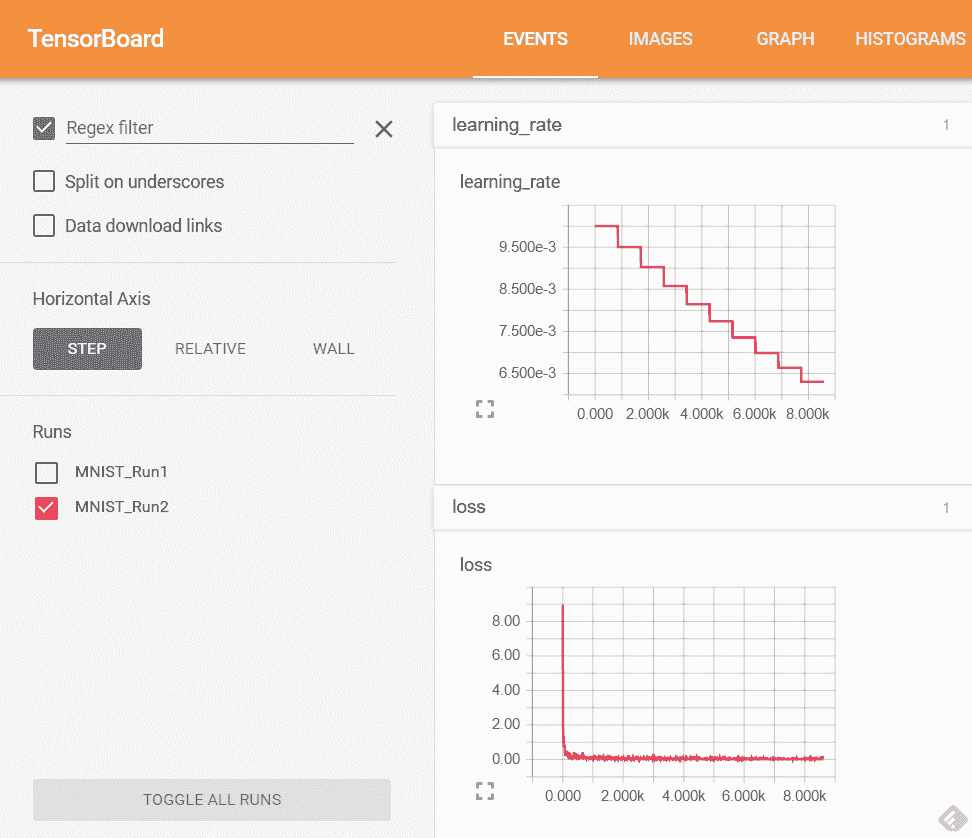

最后，让我们指示我们的脚本保存图形设置。让我们找到创建`session`的脚本部分:

```
    # Create a local session to run the training. 
    start_time = time.time() 
    with tf.Session() as sess: 
```

在定义了`sess`句柄后，我们将捕获如下图形:

```
    writer = tf.summary.FileWriter("/tmp/tensorlogs",  
    sess.graph) 
    merged = tf.summary.merge_all() 
```

运行会话时，我们需要添加我们的`merged`对象。我们最初有以下代码:

```
    l, lr, predictions = sess.run([loss, learning_rate,  
    train_prediction], feed_dict=feed_dict) 
```

我们将在运行会话时添加我们的`merged`对象:

```
    # Run the graph and fetch some of the nodes.       
    sum_string, l, lr, predictions = sess.run([merged,  
    loss,  
    learning_rate, train_prediction],  
    feed_dict=feed_dict) 
```

最后，我们将需要在指定的步骤编写摘要，就像我们通常定期输出验证集准确性一样。因此，我们在计算完`sum_string`后增加了一行:

```
    writer.add_summary(sum_string, step) 
```

仅此而已！我们刚刚获得了我们的损失率和学习率、神经网络的关键中间参数以及图表的结构。我们已经检查了事件和直方图选项卡，现在让我们看看图表选项卡:

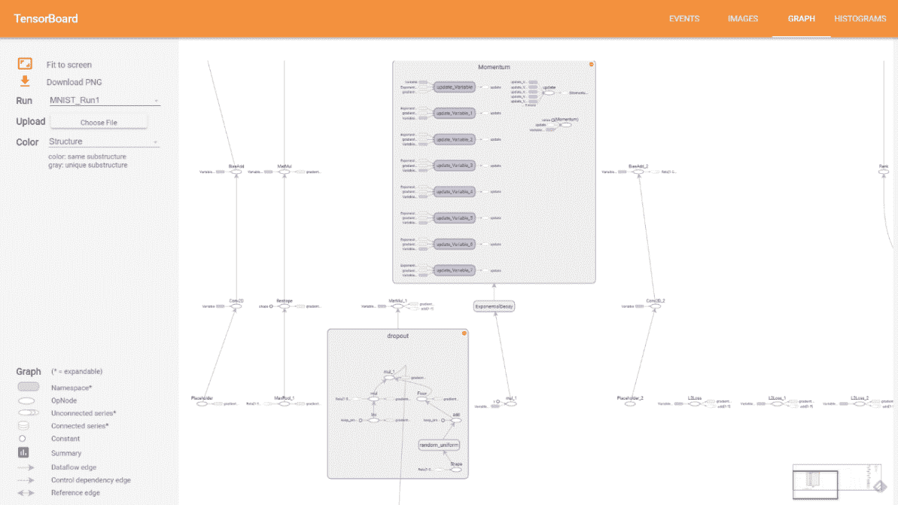

# AlexNet

任何参与图像深度学习的人都应该熟悉 AlexNet。Alex Krizhevsky、Ilya Sutskever 和 Geoffrey E. Hinton 撰写的具有里程碑意义的论文*使用深度卷积神经网络进行 ImageNet 分类*中介绍了该网络。论文可以在 http://www.cs.toronto.edu/~fritz/absps/imagenet.pdf 查看。

这种网络架构在年度 ImageNet 竞赛中获得了创纪录的准确性。他们的论文中描述了该架构，如下图所示。我们将在后面的章节中使用这种网络架构，但现在，让我们使用 TensorBoard 浏览网络:

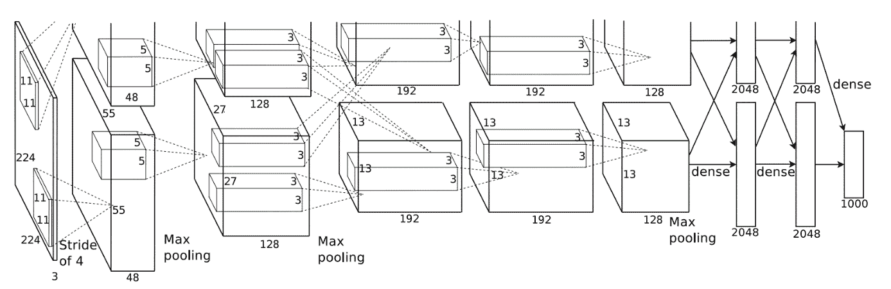

我们不会逐行回顾现有 AlexNet 代码的变化，但读者可以通过注意 Google 提供的原始模型代码和我们在本书代码库中包含的修订代码之间的差异，轻松看到变化。

Google 的原始 AlexNet TensorFlow 实现可从以下网址获得:

[https://github . com/tensor flow/models/blob/master/tutorials/image/Alex net/Alex net _ benchmark . py .](https://github.com/tensorflow/models/blob/master/tutorials/image/alexnet/alexnet_benchmark.py)

使用 TensorBoard 仪器的修订版 AlexNet TensorFlow 实现可在以下位置找到:

[https://github . com/mlwithtf/mlwithtf/blob/master/chapter _ 03/Alex net _ benchmark . py .](https://github.com/mlwithtf/mlwithtf/blob/master/chapter_03/alexnet_benchmark.py)

引入的更改与我们的 MNIST 示例非常相似。

首先，找到这段代码的位置:

```
    sess = tf.Session(config=config) 
    sess.run(init) 
```

然后，用以下代码替换它:

```
    sess = tf.Session(config=config) 
    writer = tf.summary.FileWriter("/tmp/alexnet_logs",  
    sess.graph) 
    sess.run(init) 
```

最后，您可以运行 Python 文件`alexnet_benchmark.py`和 TensorBoard 命令来可视化图形:

```
python alexnet_benchmark.py
tensorboard --logdir /tmp/alexnet_logs
```

我们在这一部分的重点只是图表。下图显示了图形浏览器的一部分。我们深入研究了第 3 层(共 5 层)的卷积，我们正在研究这一层的权重和偏差。

单击图上的权重节点很有趣，因为我们可以看到形状等细节:`{"shape":{"dim":[{"size":3},{"size":3},{"size":192},{"size":384}]}}`。我们可以将这些细节与原始论文和之前引用的图表进行匹配！我们还可以在代码中追溯网络设置的细节:

```
    with tf.name_scope('conv3') as scope: 
      kernel = tf.Variable(tf.truncated_normal([3, 3, 192, 384], 
                               dtype=tf.float32, 
                               stddev=1e-1), name='weights') 
      conv = tf.nn.conv2d(pool2, kernel, [1, 1, 1, 1], 
       padding='SAME') 
      biases = tf.Variable(tf.constant(0.0, shape=[384], 
       dtype=tf.float32), 
                         trainable=True, name='biases') 
      bias = tf.nn.bias_add(conv, biases) 
      conv3 = tf.nn.relu(bias, name=scope) 
      parameters += [kernel, biases] 
```

图形浏览器中的细节和代码是等效的，但是使用 TensorBoard 可以非常容易地可视化数据流。折叠重复的部分和展开感兴趣的部分也很容易:

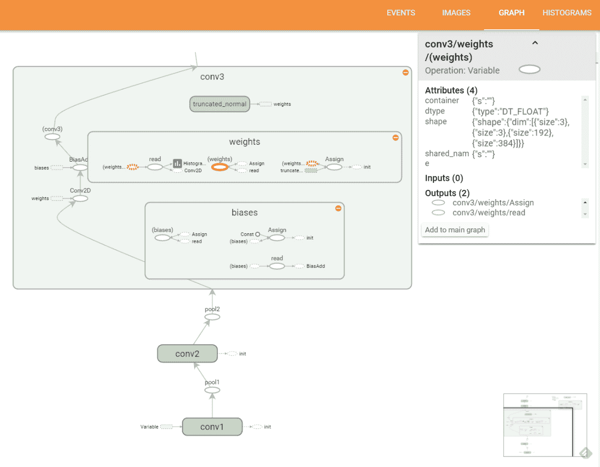

图表是这一部分最有趣的部分，但是当然，您也可以运行我们修改过的脚本并查看训练表现，以及我们正在捕获的大量其他数据。您甚至可以捕获额外的数据。试试看！


# 自动化运行

当试图训练一个分类器时，我们经常会遇到多个变量，而我们不知道这些变量的一个好的设置。查看类似问题的解决方案所使用的值是一个很好的起点。然而，我们经常会遇到一系列需要测试的可能值。让事情变得更复杂的是，我们经常有几个这样的参数，导致我们可能需要测试许多组合。

对于这种情况，我们建议将感兴趣的参数作为可以传递给培训师的值。然后，`wrapper`脚本可以传入参数的各种组合，以及唯一的输出日志子目录，该子目录可能标有描述性名称。

这将允许对多次测试的结果和中间值进行简单的比较。下图显示了一起绘制的四次运行的损失。我们很容易看到表现不佳和表现过度的配对:

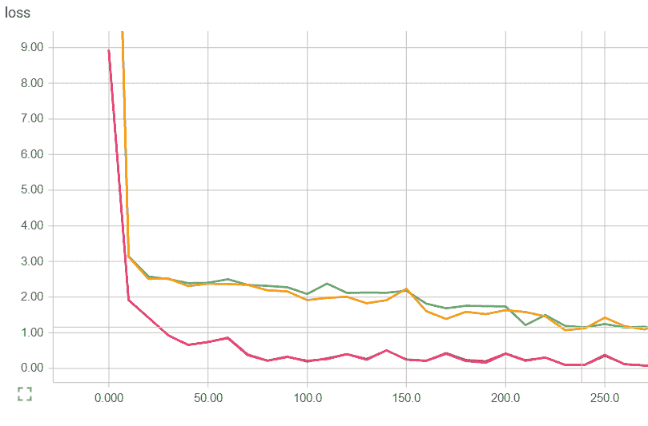

# 摘要

在这一章中，我们讨论了 TensorBoard 的主要领域——事件、直方图和视图。我们修改了流行的模型，以查看 TensorBoard 可以启动和运行之前所需的确切变化。这应该已经证明了入门 TensorBoard 所需的相当少的努力。

最后，我们通过查看各种流行型号的网络设计来关注它们。我们通过使用 TensorBoard 钩子检测代码，并使用 TensorBoard Graph Explorer 深入研究网络设置来实现这一点。

读者现在应该能够更有效地使用 TensorBoard，评估训练表现，计划跑步和修改训练脚本。

接下来，我们将进入卷积网络。我们将使用我们以前工作的一部分，这样我们就可以立即投入工作。但是，我们将重点关注更高级的神经网络设置，以实现更高的精度。对训练准确性的关注反映了大多数从业者努力的焦点，因此是我们面对挑战的时候了。