# 五、序列到序列模型

到目前为止，我们的大部分工作都与图像有关。使用图像是有帮助的，因为在如何快速简洁地取得进展方面，结果几乎是不可思议的。然而，机器学习的世界更广阔，接下来的几章将涵盖这些其他方面。我们将从序列到序列模型开始。结果同样不可思议，尽管设置有点复杂，训练数据集也大得多。

在本章中，我们将重点关注以下几个方面:

*   了解序列间模型的工作原理
*   了解输入序列间模型所需的设置
*   使用序列到序列模型编写英语到法语的翻译器


# 快速预览

是的，你没看错...我们将写一个英语到法语的翻译。机器学习之前的世界可能已经用一系列解析器和规则来处理如何将单词和短语翻译给其他人，但我们的方法将更加优雅、通用和快速。我们只是用例子，很多例子，来训练我们的翻译。

这里的游戏将是找到一个有足够多的英语句子翻译成法语的数据集(实际上，它在任何语言中都可以工作)。翻译的文章和新闻文章将不会有所帮助，因为我们不一定能够将特定的句子从一种语言并排放到另一种语言中。因此，我们需要更有创造性。幸运的是，像联合国这样的组织经常需要这样做——他们需要逐行翻译，以满足其不同支持者的需求。对我们来说多方便啊！

关于统计机器翻译的*研讨会*在 2010 年举行了一次会议，发布了一个很好的打包训练集，可以使用。全部细节可在 http://www.statmt.org/wmt10/的[获得。](http://www.statmt.org/wmt10/)

我们将仅使用法语的特定文件，如下所示:

*   [http://www.statmt.org/wmt10/training-giga-fren.tar](http://www.statmt.org/wmt10/training-giga-fren.tar)
*   [http://www.statmt.org/wmt15/dev-v2.tgz](http://www.statmt.org/wmt15/dev-v2.tgz)

以下是源数据在英文一侧的外观摘录:

*   食品，欧洲通胀下滑的地方
*   食品价格飙升是欧元区通胀加速背后的主导力量
*   总部位于卢森堡的欧盟统计局报告称，欧元区 13 国 11 月份的物价涨幅高于预期，10 月份的年通胀率为 2.6%，11 月份为 3.1%
*   彭博说，官方预测只有 3%
*   与美国、英国和加拿大中央银行相反，欧洲中央银行没有降低利率，认为利率下降加上原材料价格上涨和失业率下降将引发通货膨胀螺旋
*   欧洲央行希望将通货膨胀率控制在 2%以下，或者接近 2%
*   根据一位分析家的说法，欧洲央行已经陷入了一个第 22 条军规，它需要降低通货膨胀率，以避免在游戏后期采取行动压低通货膨胀率

这是法语的对等词:

*   欧洲的通货膨胀，营养不良
*   欧元区的通货膨胀率上升，主要是由于食品价格的快速上涨
*   11 月，在欧元区 13 个成员国中，一个非常重要的预测是，10 月份的通货膨胀率为 2.6%，10 月份的通货膨胀率为 3.1%，这是欧洲共同体统计局在卢森堡发布的数据
*   《官方公报》第三版，彭博
*   美洲中央银行、英国中央银行和加拿大中央银行、欧洲中央银行由于利息减少而受到直接限制，随着初级商品价格的上涨和通货膨胀的加剧，出现了螺旋式的通货膨胀
*   巴西中央银行保持通货膨胀率的稳定，但两者之间的差距很大
*   一位分析家说，这是一个“第 22 条军规”，即“它阻止了”通货膨胀，而不是干预经济增长

如果可能的话，最好做一个快速的完整性检查，以确保文件实际上是对齐的。我们可以在两个文件的第 7 行看到`Catch 22`短语，这给了我们安慰。

当然，7 行对于统计方法来说是远远不够的。只有通过大量的数据，我们才能实现一个优雅的、通用的解决方案。我们将为训练集获得的大量数据将由 20 千兆字节的文本组成，逐行翻译，非常类似于前面的摘录。

正如我们对图像所做的那样，我们将使用子集进行训练、验证和测试。我们还将定义一个损失函数，并尝试最小化该损失。让我们从数据开始吧。


# 从消防水管里喝水

正如你之前所做的，你应该从 https://github.com/mlwithtf/MLwithTF/那里获得代码。

我们将关注包含以下三个文件的`chapter_05`子文件夹:

*   `data_utils.py`
*   `translate.py`
*   `seq2seq_model.py`

第一个文件处理我们的数据，所以让我们从它开始。`prepare_wmt_dataset`函数处理这个问题。这与我们过去获取图像数据集的方式非常相似，只是现在我们获取的是两个数据子集:

*   `giga-fren.release2.fr.gz`
*   `giga-fren.release2.en.gz`

当然，这是我们要重点关注的两种语言。我们即将构建的翻译器的美妙之处在于这种方法是完全通用的，所以我们可以轻松地创建一个翻译器，比如说，德语或西班牙语的翻译器。

以下截图是代码的特定子集:

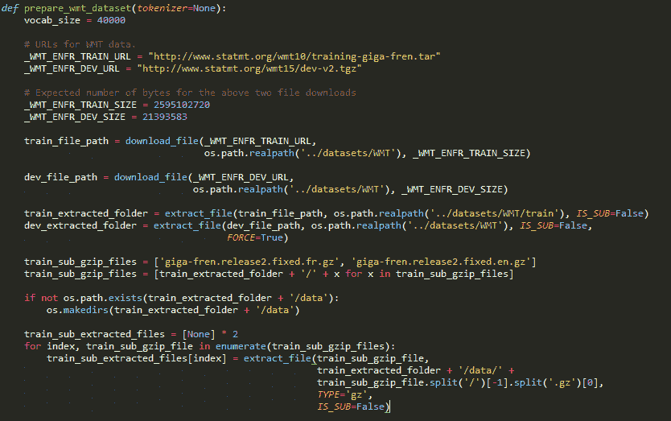

接下来，我们将逐行浏览前面的两个感兴趣的文件，并做两件事——创建词汇表和标记单个单词。这些都是通过`create_vocabulary`和`data_to_token_ids`函数完成的，我们稍后会讲到。现在，让我们观察如何在我们的大规模训练集以及小型开发集`newstest2013.fr`和`dev/newstest2013.en`上创建词汇表和标记化:

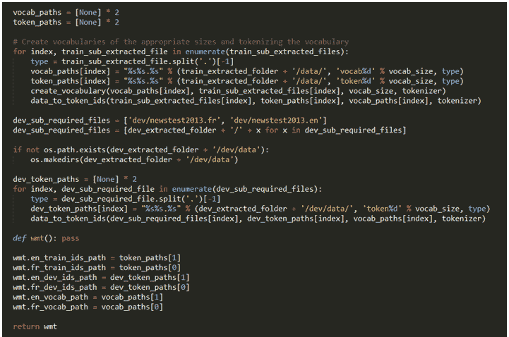

我们之前使用下面的`create_vocabulary`函数创建了一个词汇表。我们将从一个空的词汇图`vocab = {}`开始，遍历数据文件的每一行，并使用一个基本的记号化器为每一行创建一个单词桶。(警告:不要与下面的 ID 函数中更重要的标记混淆。)

如果我们遇到一个词汇中已经存在的单词，我们将按如下方式递增它:

```
    vocab[word] += 1 
```

否则，我们将初始化该单词的计数，如下所示:

```
    vocab[word] += 1 
```

我们将继续这样做，直到我们的训练数据集上的行用完为止。接下来，我们将使用`sorted(vocab`、`key=vocab.get`和`reverse=True)`按频率顺序对我们的词汇进行排序。

这一点很重要，因为我们不会保留每一个单词，我们将只保留最常用的单词，其中 k 是我们定义的词汇量(我们已将其定义为 40，000，但您可以选择不同的值，并查看结果如何受到影响):

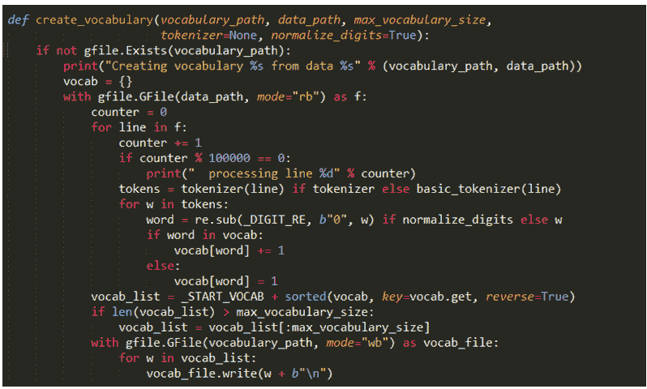

虽然使用句子和词汇是直观的，但在这一点上需要更加抽象——我们将暂时把我们所学的每个词汇翻译成一个简单的整数。我们将使用`sequence_to_token_ids`函数逐行执行此操作:

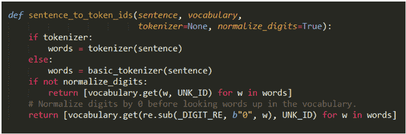

我们将使用`data_to_token_ids`函数将这种方法应用于整个数据文件，该函数读取我们的训练文件，逐行迭代，并运行`sequence_to_token_ids`函数，然后该函数使用我们的词汇表将每个句子中的单个单词翻译成整数:

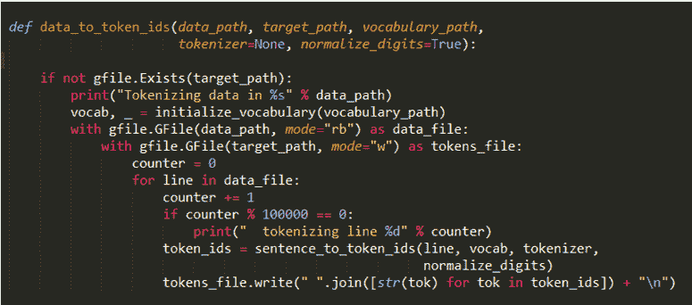

这给我们留下了什么？两个只有数字的数据集。我们刚刚暂时将英语到法语的问题转化为一个数字到数字的问题，有两个由数字映射到词汇的句子序列。

如果我们从`["Brooklyn", "has", "lovely", "homes"]`开始并生成一个`{"Brooklyn": 1, "has": 3, "lovely": 8, "homes": 17"}`词汇，我们将以`[1, 3, 8, 17]`结束。

输出是什么样的？以下是典型的文件下载:

```
    ubuntu@ubuntu-PC:~/github/mlwithtf/chapter_05$: python translate.py
    Attempting to download http://www.statmt.org/wmt10/training-giga-  
    fren.tar
    File output path:   
    /home/ubuntu/github/mlwithtf/datasets/WMT/training-giga-fren.tar
    Expected size: 2595102720
    File already downloaded completely!
    Attempting to download http://www.statmt.org/wmt15/dev-v2.tgz
    File output path: /home/ubuntu/github/mlwithtf/datasets/WMT/dev- 
    v2.tgz
    Expected size: 21393583
    File already downloaded completely!
    /home/ubuntu/github/mlwithtf/datasets/WMT/training-giga-fren.tar 
    already extracted to  
    /home/ubuntu/github/mlwithtf/datasets/WMT/train
    Started extracting /home/ubuntu/github/mlwithtf/datasets/WMT/dev- 
    v2.tgz to /home/ubuntu/github/mlwithtf/datasets/WMT
    Finished extracting /home/ubuntu/github/mlwithtf/datasets/WMT/dev-  
    v2.tgz to /home/ubuntu/github/mlwithtf/datasets/WMT
    Started extracting  
    /home/ubuntu/github/mlwithtf/datasets/WMT/train/giga- 
    fren.release2.fixed.fr.gz to  
    /home/ubuntu/github/mlwithtf/datasets/WMT/train/data/giga- 
    fren.release2.fixed.fr
    Finished extracting  
    /home/ubuntu/github/mlwithtf/datasets/WMT/train/giga-
    fren.release2.fixed.fr.gz to 
    /home/ubuntu/github/mlwithtf/datasets/WMT/train/data/giga-  
    fren.release2.fixed.fr
    Started extracting  
    /home/ubuntu/github/mlwithtf/datasets/WMT/train/giga-
    fren.release2.fixed.en.gz to 
    /home/ubuntu/github/mlwithtf/datasets/WMT/train/data/giga- 
    fren.release2.fixed.en
    Finished extracting  
    /home/ubuntu/github/mlwithtf/datasets/WMT/train/giga-
    fren.release2.fixed.en.gz to 
    /home/ubuntu/github/mlwithtf/datasets/WMT/train/data/giga- 
    fren.release2.fixed.en
    Creating vocabulary  
    /home/ubuntu/github/mlwithtf/datasets/WMT/train/data/vocab40000.fr 
    from 
    data /home/ubuntu/github/mlwithtf/datasets/WMT/train/data/giga- 
    fren.release2.fixed.fr
      processing line 100000
      processing line 200000
      processing line 300000
     ...
      processing line 22300000
      processing line 22400000
      processing line 22500000
     Tokenizing data in 
     /home/ubuntu/github/mlwithtf/datasets/WMT/train/data/giga-
     fren.release2.fr
      tokenizing line 100000
      tokenizing line 200000
      tokenizing line 300000
     ...
      tokenizing line 22400000
      tokenizing line 22500000
     Creating vocabulary 
     /home/ubuntu/github/mlwithtf/datasets/WMT/train/data/vocab
     40000.en from data 
     /home/ubuntu/github/mlwithtf/datasets/WMT/train/data/giga-
     fren.release2.en
      processing line 100000
      processing line 200000
      ...
```

我不会重复数据集处理的英语部分，因为它完全相同。我们将逐行读取这个巨大的文件，创建一个词汇表，并逐行对这两个语言文件中的单词进行标记。


# 训练日

我们努力的关键是培训，这在我们之前遇到的第二个文件中显示出来— `translate.py`。当然，我们之前讨论的`prepare_wmt_dataset`函数是起点，因为它创建了我们的两个数据集，并将它们标记成清晰的数字。

培训按如下方式开始:

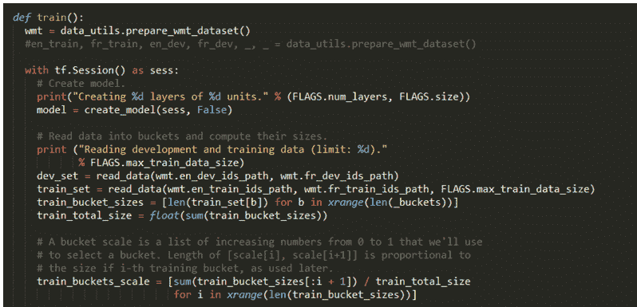

准备好数据后，我们将像往常一样创建一个 TensorFlow 会话，并构建我们的模型。我们稍后将讨论模型；现在，让我们看看我们的准备和训练循环。

稍后我们将定义一个开发集和一个训练集，但现在，我们将定义一个范围从 0 到 1 的浮点分数。这里没什么复杂的；真正的工作来自下面的训练循环。这与我们在前几章所做的非常不同，所以需要密切关注。

我们的主要训练循环是寻求最小化我们的错误。有两个关键陈述。这是第一个:

```
    encoder_inputs, decoder_inputs, target_weights = 
     model.get_batch(train_set, bucket_id)
```

并且，第二个关键点如下:

```
    _, step_loss, _ = model.step(sess, encoder_inputs, decoder_inputs, 
     target_weights, bucket_id, False)
```

`get_batch`函数主要用于将两个序列转换成批量主向量和相关权重。然后在建模步骤中使用这些，返回我们的损失。

我们不处理损失，我们将使用`perplexity`，它是`e`的损失的幂:

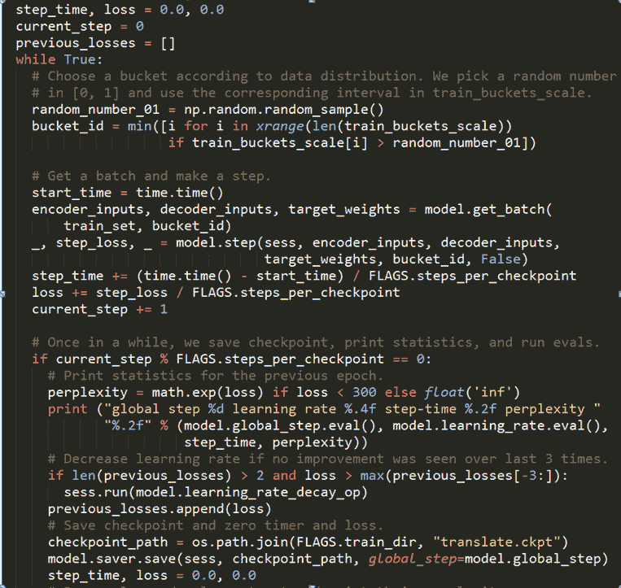

在每一个 *X* 步骤中，我们将使用`previous_losses.append(loss)`保存我们的进度，这很重要，因为我们将当前批次的损失与之前的损失进行比较。当损失开始上升时，我们将使用以下方法来降低我们的学习率:

`sess.run(model.learning_rate_decay_op)`，并评估我们的`dev_set`的损失，就像我们在前面章节中使用我们的验证集一样:

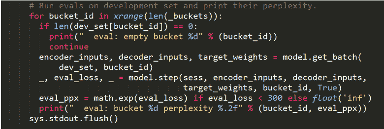

运行它时，我们将得到以下输出:

```
    put_count=2530 evicted_count=2000 eviction_rate=0.790514 and 
     unsatisfied allocation rate=0
    global step 200 learning rate 0.5000 step-time 0.94 perplexity 
     1625.06
      eval: bucket 0 perplexity 700.69
      eval: bucket 1 perplexity 433.03
      eval: bucket 2 perplexity 401.39
      eval: bucket 3 perplexity 312.34
    global step 400 learning rate 0.5000 step-time 0.91 perplexity   
     384.01
      eval: bucket 0 perplexity 124.89
      eval: bucket 1 perplexity 176.36
      eval: bucket 2 perplexity 207.67
      eval: bucket 3 perplexity 239.19
    global step 600 learning rate 0.5000 step-time 0.87 perplexity   
     266.71
      eval: bucket 0 perplexity 75.80
      eval: bucket 1 perplexity 135.31
      eval: bucket 2 perplexity 167.71
      eval: bucket 3 perplexity 188.42
    global step 800 learning rate 0.5000 step-time 0.92 perplexity  
     235.76
      eval: bucket 0 perplexity 107.33
      eval: bucket 1 perplexity 159.91
      eval: bucket 2 perplexity 177.93
      eval: bucket 3 perplexity 263.84  
```

我们将看到每 200 步的输出。这是我们正在使用的十几个设置之一，我们在文件的顶部定义了这些设置:

```
 tf.app.flags.DEFINE_float("learning_rate"", 0.5, ""Learning  
                             rate."") 
 tf.app.flags.DEFINE_float("learning_rate_decay_factor"", 0.99, 
                          "Learning rate decays by this much."") 
 tf.app.flags.DEFINE_float("max_gradient_norm"", 5.0, 
                          "Clip gradients to this norm."") 
 tf.app.flags.DEFINE_integer("batch_size"", 64, 
                            "Batch size to use during training."") 
 tf.app.flags.DEFINE_integer("en_vocab_size"", 40000, ""Size ...."") 
 tf.app.flags.DEFINE_integer("fr_vocab_size"", 40000, ""Size  
                              of...."") 
 tf.app.flags.DEFINE_integer("size"", 1024, ""Size of each  
                              model..."") 
 tf.app.flags.DEFINE_integer("num_layers"", 3, ""#layers in the 
                model."")tf.app.flags.DEFINE_string("train_dir"", 
  os.path.realpath(''../../datasets/WMT''), ""Training directory."") 
 tf.app.flags.DEFINE_integer("max_train_data_size"", 0, 
                            "Limit size of training data "") 
 tf.app.flags.DEFINE_integer("steps_per_checkpoint"", 200, 
                            "Training steps to do per 
                             checkpoint."")
```

在构造模型对象时，我们将使用这些设置中的大部分。也就是说，拼图的最后一块是模型本身，所以让我们来看看。我们将返回到项目中三个文件的第三个也是最后一个文件— `seq2seq_model.py`。

还记得在创建 TensorFlow 会话后，我们如何在培训过程开始时创建模型吗？我们定义的大多数参数用于初始化以下模型:

```
    model = seq2seq_model.Seq2SeqModel( 
      FLAGS.en_vocab_size, FLAGS.fr_vocab_size, _buckets, 
      FLAGS.size, FLAGS.num_layers, FLAGS.max_gradient_norm, 
       FLAGS.batch_size, 
      FLAGS.learning_rate, FLAGS.learning_rate_decay_factor, 
      forward_only=forward_only) 
```

然而，初始化是在`seq2seq_model.py`内部完成的，所以让我们跳到那里。

你会发现这个模型非常庞大，这就是为什么我们不会一行一行的解释，而是一个一个的解释。

第一部分是模型的初始化，由下面两个图演示:

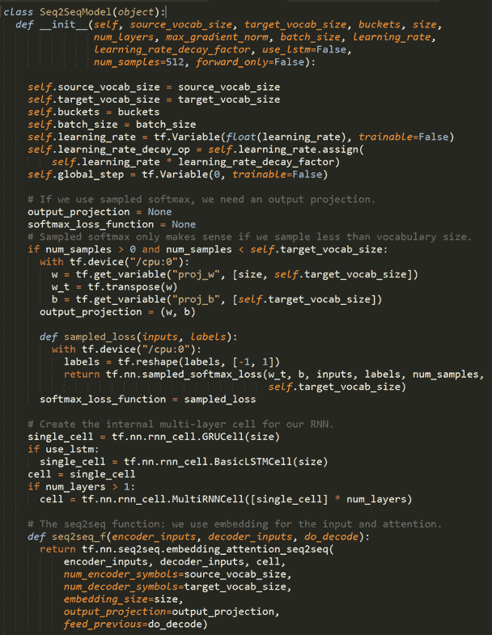

该模型从初始化开始，初始化需要的参数。我们将跳过这些参数的设置，因为我们已经熟悉了它们——我们在训练之前自己初始化了这些参数，只需将这些值传递到模型构造语句中，最后通过`self.xyz`赋值将它们传递到内部变量中。

回想一下我们是如何传入每个模型层的大小(size=1024)和层数(3)的。这些在我们构建权重和偏差时非常重要(`proj_w`和`proj_b`)。权重是*A×B*，其中 *A* 是层大小， *B* 是目标语言的词汇量。偏差只是根据目标词汇的大小传递的。

最后，来自我们的`output_project`元组`output_projection = (w, b)`的权重和偏差，并使用转置的权重和偏差形成我们的`softmax_loss_function`，我们将反复使用它来衡量性能:

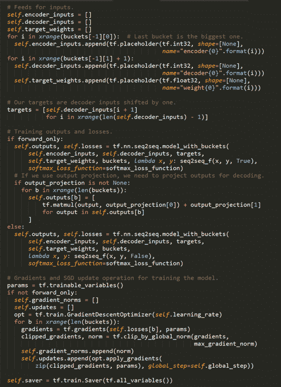

下一部分是阶跃函数，如下图所示。前半部分只是错误检查，所以我们跳过它。最有趣的是使用随机梯度下降构建输出馈送:

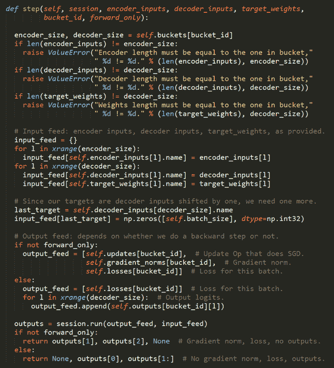

模型的最后一部分是`get_batch`函数，如下图所示。我们将用行内注释来解释各个部分:

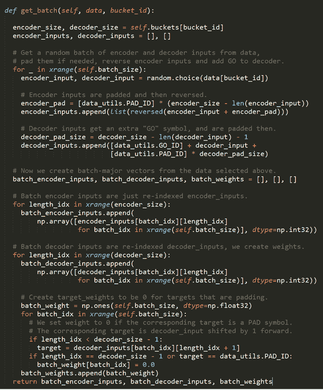

当我们运行这个时，我们可以得到一个完美的训练运行，如下所示:

```
global step 200 learning rate 0.5000 step-time 0.94 perplexity 
  1625.06
   eval: bucket 0 perplexity 700.69
   eval: bucket 1 perplexity 433.03
   eval: bucket 2 perplexity 401.39
   eval: bucket 3 perplexity 312.34
   ...
```

或者，在损失持续增加后，我们可以找到降低学习率的步骤。不管怎样，我们将继续在我们的*开发*设备上测试，直到我们的精确度提高。


# 摘要

在这一章中，我们介绍了序列到序列网络，并使用一系列已知的逐句翻译作为训练集编写了一个语言翻译器。我们被介绍给 RNNs 作为我们工作的基础，当我们使用 20 GB 的训练数据集进行训练时，我们很可能跨越了大数据的门槛。

接下来，我们将跳到表格数据，并对经济和金融数据进行预测。我们将使用我们之前工作的一部分，以便我们可以立即投入运行，也就是我们到目前为止编写的下载和准备训练数据的初始管道工作。然而，我们将重点关注一个时间序列问题，因此它将与我们迄今为止所做的图像和文本工作大不相同。