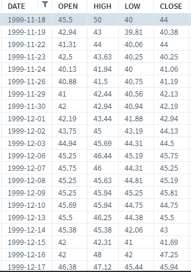
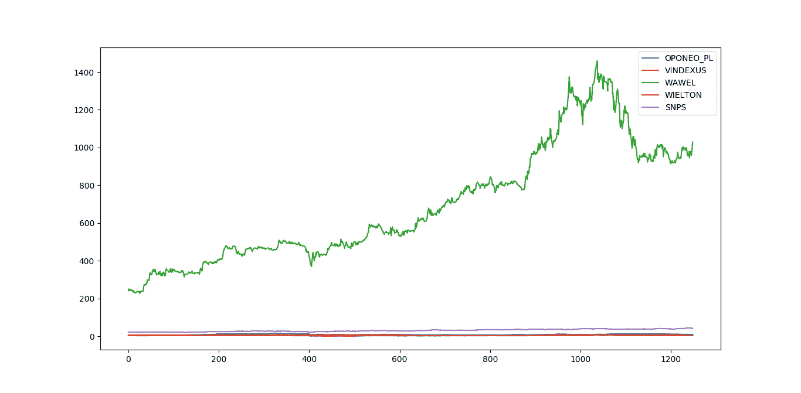
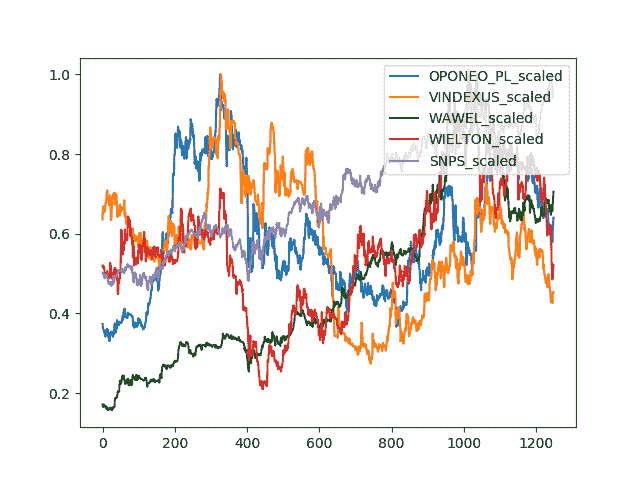
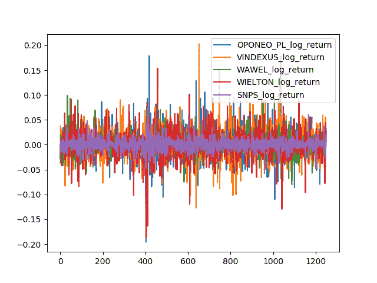

<title>Making Money with Machine Learning</title> 

# 用机器学习赚钱

到目前为止，我们主要将 TensorFlow 用于图像处理，在较小程度上用于文本序列处理。在这一章中，我们将处理一种特定类型的表格数据:时间序列数据。

时间序列数据来自许多领域，通常具有一个共性，即唯一不断变化的字段是时间或序列字段。它常见于各种领域，但在经济、金融、卫生、医学、环境工程和控制工程中尤其常见。我们将在这一章中深入讨论例子，但是要记住的关键是顺序很重要。不像在前面的章节中，我们可以自由地改变数据，时间序列数据不能这样改变而不失去意义。增加的复杂性可能是数据本身的可用性；如果我们有直到当前时间的可用数据，但没有进一步的历史数据要捕获，那么无论收集多少数据都不可能产生更多的数据—您会受到基于时间的可用性的限制。

幸运的是，我们将进入一个拥有大量数据的领域:金融世界。我们将探索对冲基金和其他成熟投资者可能对时间序列数据做的一些事情。

在本章中，我们将讨论以下主题:

*   什么是时间序列数据及其特殊性质
*   投资公司在量化和 ML 驱动的投资努力中可能使用的投入类型和方法
*   金融时间序列数据及其获取方式；我们还将获得一些实时财务数据
*   改进的卷积神经网络在金融中的应用

<title>Inputs and approaches</title> 

# 投入和方法

投资公司的内部自营交易团队使用各种方式进行投资、交易和赚钱。相对不受监管的对冲基金使用更广泛、更有趣、更复杂的投资手段。有些投资是直觉驱动的，或者是大量思考驱动的。其他的主要是过滤器驱动的，算法驱动的，或者信号驱动的。这两种方法都很好，但是我们当然会关注后一类。

在定量方法中，有许多技术；其中一些如下:

*   基于估价
*   基于异常和信号
*   基于外部信号
*   基于过滤和分割的群组分析

其中一些方法将使用传统的机器学习技术，如 K-最近邻、朴素贝叶斯和支持向量机。尤其是队列分析，几乎完全适合 KNN 式的方法。

另一种流行的技术是情绪分析和基于人群情绪的信号。我们在上一章讨论了这一点，我们测量了文本情感，并将文本段落分为基本类别:积极的、消极的、快乐的、愤怒的，等等。想象一下，如果我们获取更多的数据，并过滤掉除了涉及特定股票的数据之外的所有数据，我们就能够得到股票的价格。现在，想象我们有一个这样的文本来源，它是广泛的(可能是全球性的)、高容量的、高速度的——实际上，没有必要想象，因为所有这些都是在过去十年中出现的。Twitter 通过一个 API 提供他们的消防水带，脸书和许多其他社交媒体平台也是如此。事实上，一些对冲基金消耗了 Twitter 和脸书的全部数据，并试图挖掘公众对股票、市场部门、大宗商品等的情绪。然而，这是一种外部 NLP 驱动的基于信号的投资策略，从业者使用它来预测时间序列的方向性和/或强度。

在本章中，我们将使用时间序列本身的内部度量来预测时间序列的未来条目。预测未来的实际进入实际上是一项非常困难的任务，事实证明，并不完全必要。通常，一个方向的观点就足够了。结合运动强度对方向的看法更好。

对于许多类型的投资来说，即使是观点也不能给你完全的保证，平均来说，正确多于错误就足够了。想象一下，每掷一枚硬币赌一便士——如果你有 51%的概率是正确的，并且你有能力玩这个游戏数千次，这可能就足以盈利，因为你会得到比你失去的更多。

这对于基于机器学习的努力来说是一个好兆头，在这些努力中，我们可能对我们的答案没有 100%的信心，但在统计上可能有很好的预测能力。净净我们希望领先，因为即使是一个轻微的腿可以乘以数以千计的周期，以产生可观的利润。

<title>Getting the data</title> 

# 获取数据

让我们从抓取一些数据开始。出于本章的目的，我们将使用 Quandl 的数据，这是技术娴熟的独立投资者长期以来最喜欢的数据。Quandl 通过多种机制提供许多股票的数据。一种简单的机制是通过 URL API。比如说，要获得谷歌股票的数据，我们可以点击[https://www.quandl.com/api/v3/datasets/WIKI/GOOG/data.json](https://www.quandl.com/api/v3/datasets/WIKI/GOOG/data.json)。同样，我们可以用其他指数代码替换`GOOG`来抓取其他股票的数据。

这很容易通过 Python 实现自动化；我们将使用以下代码来实现这一点:

```
import requests 

API_KEY = '<your_api_key>' 

start_date = '2010-01-01' 
end_date = '2015-01-01' 
order = 'asc' 
column_index = 4 

stock_exchange = 'WIKI' 
index = 'GOOG' 

data_specs = 'start_date={}&end_date={}&order={}&column_index={}&api_key={}' 
   .format(start_date, end_date, order, column_index, API_KEY) 
base_url = "https://www.quandl.com/api/v3/datasets/{}/{}/data.json?" + data_specs 
stock_data = requests.get(base_url.format(stock_exchange, index)).json()
```

因此，在这里，在`stock_data`变量中，你将把来自 WIKI/GOOG 的股票数据变量放入`stock_data`变量，从日期`2010-01-01`和`2015-01-01`之间的格式化 URL 下载。`column_index = 4`变量告诉服务器只从历史记录中获取收盘值。

请注意，您可以在您的 GitHub 存储库中找到这一章的代码—([https://GitHub . com/saifrahmed/MLwithTF/tree/master/book _ code/chapter _ 07](https://github.com/saifrahmed/MLwithTF/tree/master/book_code/chapter_07))。

那么，这些收盘值是多少呢？嗯，股票价格每天都在波动。它们以某个值开盘，在一天内达到某个高值和某个低值，在一天结束时，它们以某个值收盘。下图显示了股票价格每天的变化情况:



所以，股票开盘后，你可以投资它们，购买股票。一天结束时，你会有盈利或亏损，这取决于所买股票的收盘价。投资者使用不同的技术来预测哪些股票在某一天有上涨的潜力，并根据他们的分析来投资股票。

<title>Approaching the problem</title> 

# 处理这个问题

在这一章中，我们将根据其他时区市场的涨跌(例如，它们的收盘时间早于我们要投资的股票)来确定股票价格是上涨还是下跌。我们将分析欧洲市场的数据，这些市场在美国股市收盘前 3 到 4 个小时收盘。通过 Quandl，我们将获得以下欧洲市场的数据:

*   `WSE/OPONEO_PL`
*   `WSE/VINDEXUS`
*   `WSE/WAWEL`
*   `WSE/WIELTON`

我们将预测以下美国市场的收盘涨跌:维基/SNPS。

我们将下载所有的市场数据，查看下载的市场收盘价图表，并修改数据，以便可以在我们的网络上进行训练。然后，我们将看到我们的网络如何根据我们的假设运行。

本章中使用的代码和分析技术受到了谷歌的云数据实验室笔记本的启发，该笔记本位于[https://github . com/Google Datalab/notebooks/blob/master/samples/tensor flow/Machine % 20 learning % 20 with % 20 financial % 20 data . ipynbhere](https://github.com/googledatalab/notebooks/blob/master/samples/TensorFlow/Machine%20Learning%20with%20Financial%20Data.ipynb)。

步骤如下:

1.  下载所需数据并进行修改。
2.  查看原始数据和修改的数据。
3.  从修改后的数据中提取要素。
4.  准备培训并测试网络。
5.  建立网络。
6.  培训。
7.  测试。

<title>Downloading and modifying data</title> 

# 下载和修改数据

这里，我们将从`codes`变量中提到的来源下载数据，并将它们放入`closings`数据框中。我们将存储原始数据、`scaled`数据和`log_return`:

```
codes = ["WSE/OPONEO_PL", "WSE/VINDEXUS", "WSE/WAWEL", "WSE/WIELTON", "WIKI/SNPS"] 
closings = pd.DataFrame() 
for code in codes: 
    code_splits = code.split("/") 
    stock_exchange = code_splits[0] 
    index = code_splits[1] 
    stock_data = requests.get(base_url.format(stock_exchange,  
    index)).json() 
    dataset_data = stock_data['dataset_data'] 
    data = np.array(dataset_data['data']) 
    closings[index] = pd.Series(data[:, 1].astype(float)) 
    closings[index + "_scaled"] = closings[index] / 
     max(closings[index]) 
    closings[index + "_log_return"] = np.log(closings[index] / closings[index].shift()) 
closings = closings.fillna(method='ffill')  # Fill the gaps in data 
```

我们对数据进行了缩放，使股票价值保持在`0`和`1`之间；与其他股票价值相比，这有助于最小化。这将有助于我们看到股票相对于其他市场的趋势，并使其在视觉上更容易分析。

对数回报帮助我们得到与前一天相比市场涨跌的图表。

现在让我们看看我们的数据是什么样子的。

<title>Viewing the data</title> 

# 查看数据

以下代码片段将绘制我们下载并处理的数据:

```
def show_plot(key="", show=True): 
    fig = plt.figure() 
    fig.set_figwidth(20) 
    fig.set_figheight(15) 
    for code in codes: 
        index = code.split("/")[1] 
        if key and len(key) > 0: 
            label = "{}_{}".format(index, key) 
        else: 
            label = index 
        _ = plt.plot(closings[label], label=label) 

    _ = plt.legend(loc='upper right') 
    if show: 
        plt.show() 

show = True 
show_plot("", show=show) 
show_plot("scaled", show=show) 
show_plot("log_return", show=show) 
```

原始市场数据到收盘值。正如你在这里看到的， **WAWEL** 的价值比其他市场大几个数量级:



WAWEL 的收盘价直观地反映了其他市值数据的趋势。我们将缩放这些数据，以便更好地查看。看一下下面的截图:



换算后的市值有助于我们更好地观察趋势。现在，让我们看看`log_return`是什么样子:



日志返回市场的收盘价

<title>Extracting features</title> 

# 提取特征

现在，我们将提取所需的特征来训练和测试数据:

```
feature_columns = ['SNPS_log_return_positive', 'SNPS_log_return_negative'] 
for i in range(len(codes)): 
    index = codes[i].split("/")[1] 
    feature_columns.extend([ 
        '{}_log_return_1'.format(index), 
        '{}_log_return_2'.format(index), 
        '{}_log_return_3'.format(index) 
    ]) 
features_and_labels = pd.DataFrame(columns=feature_columns) 
closings['SNPS_log_return_positive'] = 0 
closings.ix[closings['SNPS_log_return'] >= 0, 'SNPS_log_return_positive'] = 1 
closings['SNPS_log_return_negative'] = 0 
closings.ix[closings['SNPS_log_return'] < 0, 'SNPS_log_return_negative'] = 1 
for i in range(7, len(closings)): 
    feed_dict = {'SNPS_log_return_positive': closings['SNPS_log_return_positive'].ix[i], 
        'SNPS_log_return_negative': closings['SNPS_log_return_negative'].ix[i]} 
    for j in range(len(codes)): 
        index = codes[j].split("/")[1] 
        k = 1 if j == len(codes) - 1 else 0 
        feed_dict.update({'{}_log_return_1'.format(index): closings['{}_log_return'.format(index)].ix[i - k], 
                '{}_log_return_2'.format(index): closings['{}_log_return'.format(index)].ix[i - 1 - k], 
                '{}_log_return_3'.format(index): closings['{}_log_return'.format(index)].ix[i - 2 - k]}) 
    features_and_labels = features_and_labels.append(feed_dict, ignore_index=True) 
```

我们将所有的特征和标签存储在`features_and_label`变量中。`SNPS_log_return_positive`和`SNPS_log_return_negative`键分别存储 SNPS 日志返回为正和负的点。如果为真，它们是`1`，如果为假，它们是`0`。这两个密钥将作为网络的标签。

其他键用于存储其他市场过去 3 天的值(以及 SNPS 前 3 天的值，因为我们无法获得该市场今天的值)。

<title>Preparing for training and testing</title> 

# 准备培训和测试

现在我们将我们的特征分成`train`和`test`子集。我们不会对我们的数据进行随机化，因为在金融市场的时间序列中，数据每天都以有规律的方式出现，我们必须如实地遵循它。如果你为未来的数据训练，你不能预测过去的行为，因为那是没有用的。我们总是对股票市场的未来行为感兴趣:

```
features = features_and_labels[features_and_labels.columns[2:]] 
labels = features_and_labels[features_and_labels.columns[:2]] 
train_size = int(len(features_and_labels) * train_test_split) 
test_size = len(features_and_labels) - train_size 
train_features = features[:train_size] 
train_labels = labels[:train_size] 
test_features = features[train_size:] 
test_labels = labels[train_size:]
```

<title>Building the network</title> 

# 构建网络

训练我们的时间序列的网络模型如下所示:

```
sess = tf.Session() 
num_predictors = len(train_features.columns) 
num_classes = len(train_labels.columns) 
feature_data = tf.placeholder("float", [None, num_predictors]) 
actual_classes = tf.placeholder("float", [None, 2]) 
weights1 = tf.Variable(tf.truncated_normal([len(codes) * 3, 50], stddev=0.0001)) 
biases1 = tf.Variable(tf.ones([50])) 
weights2 = tf.Variable(tf.truncated_normal([50, 25], stddev=0.0001)) 
biases2 = tf.Variable(tf.ones([25])) 
weights3 = tf.Variable(tf.truncated_normal([25, 2], stddev=0.0001)) 
biases3 = tf.Variable(tf.ones([2])) 
hidden_layer_1 = tf.nn.relu(tf.matmul(feature_data, weights1) + biases1) 
hidden_layer_2 = tf.nn.relu(tf.matmul(hidden_layer_1, weights2) + biases2) 
model = tf.nn.softmax(tf.matmul(hidden_layer_2, weights3) + biases3) 
cost = -tf.reduce_sum(actual_classes * tf.log(model)) 
train_op1 = tf.train.AdamOptimizer(learning_rate=0.0001).minimize(cost) 
init = tf.initialize_all_variables() 
sess.run(init) 
correct_prediction = tf.equal(tf.argmax(model, 1), tf.argmax(actual_classes, 1)) 
accuracy = tf.reduce_mean(tf.cast(correct_prediction, "float")) 
```

这只是一个简单的网络，有两个隐藏层。

<title>Training</title> 

# 培养

现在，让我们来训练我们的网络:

```
for i in range(1, 30001): 
    sess.run(train_op1, feed_dict={feature_data: train_features.values, 
            actual_classes: train_labels.values.reshape(len(train_labels.values), 2)}) 
    if i % 5000 == 0: 
        print(i, sess.run(accuracy, feed_dict={feature_data: train_features.values, 
                actual_classes: train_labels.values.reshape(len(train_labels.values), 2)})) 
```

<title>Testing</title> 

# 测试

我们的网络测试如下:

```
feed_dict = { 
    feature_data: test_features.values, 
    actual_classes: test_labels.values.reshape(len(test_labels.values), 2) 
} 
tf_confusion_metrics(model, actual_classes, sess, feed_dict) 
```

<title>Taking it further</title> 

# 更进一步

假设你刚刚训练了一个漂亮的分类器，显示出对市场的预测能力，你应该开始交易吗？就像我们迄今为止所做的其他机器学习项目一样，您需要在独立的测试集上进行测试。过去，我们经常将数据分为以下三组:

*   训练集
*   开发集，也称为验证集
*   测试集

我们可以做一些类似于我们目前的工作，但金融市场给了我们一个额外的资源——持续的数据流！

我们可以使用我们之前拉取的相同数据源，并继续拉取更多的数据；本质上，我们有一个不断扩大的，看不见的数据集！当然，其中一些取决于我们使用数据的频率—如果我们对日常数据进行操作，将需要一段时间才能完成。对每小时或每分钟的数据进行操作使这变得更容易，因为我们将很快拥有更多数据。基于报价量的分笔成交点数据操作通常会更好。

由于真实的钱可能会受到威胁，大多数人通常会进行纸上交易——本质上，几乎实时运行系统，但实际上不花钱，而是跟踪系统在实时运行时的运行情况。如果这行得通，那么下一步将是现场交易，也就是用真钱交易(通常是少量测试系统)。

<title>Practical considerations for the individual</title> 

# 对个人的实际考虑

假设你训练了一个漂亮的分类器，并且在盲测或现场测试中显示了好的结果，现在你应该开始交易了吗？虽然这是可能的，但并不容易。以下是一些原因:

*   **历史分析与流数据**:这种历史数据通常是干净的和近乎完美的，但是流数据没有这样的好处。您将需要代码来评估数据流并丢弃潜在的不可靠数据。
*   **买卖价差**:这是新手脸上最大的惊喜。市场上实际上有两种价格:可以购买的价格和可以出售的价格。你不会以你看到的典型市场价格同时买入和卖出(这只是两者的最后一个交汇点，称为最后价格)。买入一个持有，马上卖出，就是因为这个缺口亏钱，所以净-净，你已经亏本了。
*   **交易成本**:交易成本可能低至 1 美元/笔，但这仍然是一个障碍，需要在策略盈利之前克服。
*   **税**:这一点经常被遗忘，但可能是因为税表示的是净收益，这通常是件好事。
*   退出能力:仅仅因为理论上你可以卖出，并不意味着实际上有市场可以出售你的股份，即使有，也可能不是你的全部股份。你猜怎么着？然而还需要更多的编码。这一次，看看出价，这些价格的成交量，以及这本书的深度。
*   **成交量和流动性**:信号告诉你买入，并不代表市场上有足够的成交量可以买入；你可能只看到书的顶部，下面实际上只有很少的体积。需要更多的编码！
*   与交易 API 的集成:调用库很容易，但是涉及到钱的时候就不那么容易了。你需要交易协议、API 协议等等。然而，成千上万的个人已经这样做了，对于那些寻求 API 来买卖股票的人来说，交互式经纪人是最受欢迎的经纪人。方便的是，他们也有一个 API 来提供市场数据。

<title>Skills learned</title> 

# 学到的技能

在本章中，您应该已经学会了以下技能:

*   了解时间序列数据
*   为时序数据建立管道
*   集成原始数据
*   创建训练集和测试集
*   实际问题

<title>Summary</title> 

# 摘要

对金融数据的机器学习与我们使用的许多其他数据没有什么不同，事实上，我们使用了一个网络，就像我们对其他数据集所做的那样。我们可以使用其他选项，但一般方法保持不变。尤其是在交易货币时，我们会发现相对于代码的实际机器学习部分，周围的代码变得比以往任何时候都大。

在下一章中，我们将看到如何将机器学习用于医学目的。