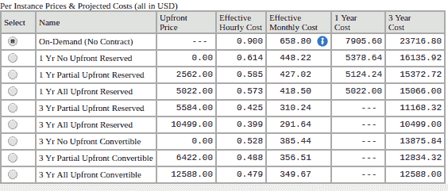
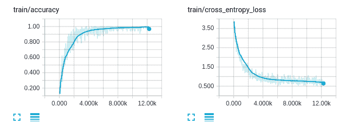
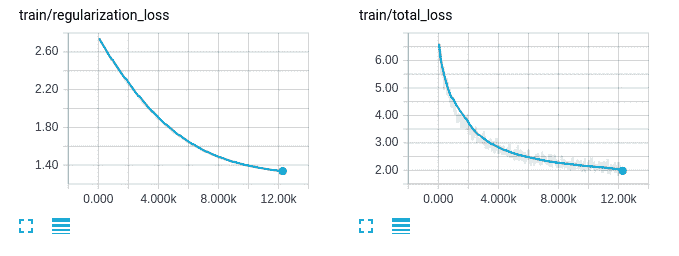
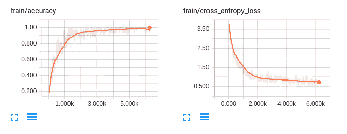
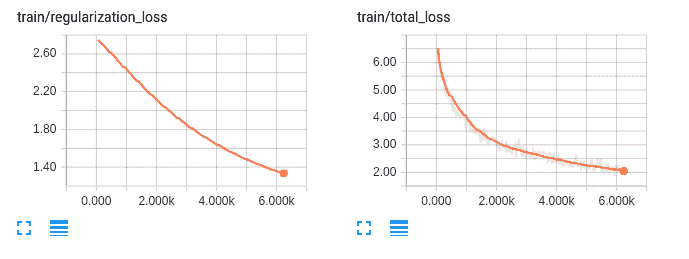
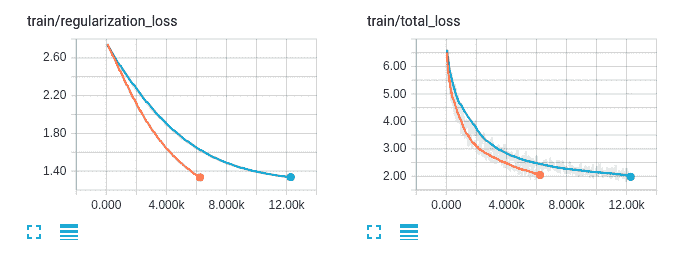

# 活下去，做大

在这一章中，我们将了解更多关于**亚马逊网络服务** ( **AWS** )以及如何创建深度神经网络来解决视频动作识别问题。我们将向您展示如何使用多个 GPU 进行更快的训练。在本章的最后，我们将向您简要介绍 Amazon Mechanical Turk 服务，它允许我们收集标签并纠正模型的结果。


# 快速浏览亚马逊网络服务

亚马逊网络服务 ( **AWS** )是最流行的云平台之一，由 Amazon.com 制造。它提供许多服务，包括云计算、存储、数据库服务、内容交付和其他功能。在本节中，我们将只关注 Amazon EC2 上的虚拟服务器服务。Amazon EC2 允许我们创建多个服务器来支持我们的模型甚至训练程序。说到为终端用户服务车型，可以阅读[第九章](b38dd75a-b632-4e7b-b581-202500f4e001.xhtml)、*巡航控制-自动化*，了解 TensorFlow 服务。在培训中，Amazon EC2 有许多我们可以使用的实例类型。我们可以使用他们的 CPU 服务器来运行我们的网络机器人，从互联网上收集数据。有几种实例类型具有多个 NVIDIA GPUs。

Amazon EC2 提供了广泛的实例类型选择，以适应不同的用例。实例类型分为五类，如下所示:

*   通用
*   计算优化
*   内存优化
*   存储优化
*   加速计算实例

前四个类别最适合运行后端服务器。加速计算实例具有多个 NVIDIA GPUs，可用于为模型提供服务，并利用高端 GPU 训练新模型。有三种类型的实例-P2、G2 和 F1。


# P2 实例

P2 实例包含高性能 NVIDIA K80 GPUs，每个 GPU 具有 2，496 个 CUDA 内核和 12 GB 的 GPU 内存。P2 有三种模式，如下表所述:

| **型号** | **图形处理器** | **vCPU** | **内存(GB)** | **GPU 内存(GB)** |
| p2.xlarge | 一 | 四 | 61 | 12 |
| p 2.8x 大 | 8 | 32 | 488 | 96 |
| p 2.16 大号 | 16 | 64 | 732 | 192 |

这些 GPU 内存大的模型最适合训练模型。有了更多的 GPU 内存，我们可以训练更大批量的模型和具有大量参数的神经网络。


# G2 实例

G2 实例包含高性能 NVIDIA GPUs，每个 GPU 具有 1，536 个 CUDA 核心和 4gb GPU 内存。G2 有两种型号，如下表所示:

| **型号** | **图形处理器** | **vCPU** | **内存(GB)** | **固态硬盘存储(GB)** |
| g 2.2x 大 | 一 | 8 | 15 | 1 x 60 |
| g 2.8 x 大号 | 四 | 32 | 60 | 2 x 120 |

这些机型只有 4 GB 的 GPU 内存，所以在训练上受到限制。然而，4 GB 的 GPU 内存通常足以为最终用户提供模型服务。最重要的因素之一是 G2 实例比 P2 实例便宜得多，这允许我们在一个负载均衡器下部署多个服务器以实现高可伸缩性。


# F1 实例

F1 实例支持**现场可编程门阵列**(**FPGA**)。F1 有两种型号，如下表所述:

| **型号** | **图形处理器** | **vCPU** | **内存(GB)** | **固态硬盘存储(GB)** |
| 1.2 倍大 | 一 | 8 | 122 | 470 |
| 1.16 倍大 | 8 | 64 | 976 | 4 x 940 |

具有高内存和计算能力的 FPGAs 在深度学习领域非常有前景。但是 TensorFlow 和其他流行的深度学习库都不支持 FPGAs。因此，在下一节中，我们将只讨论 P2 和 G2 实例的价格。


# 定价

让我们在[https://aws.amazon.com/emr/pricing/](https://aws.amazon.com/emr/pricing/)探索这些实例的定价。

Amazon EC2 为实例提供了三种定价选项——按需实例、预约实例和现场实例:

*   按需实例使您能够无中断地运行服务器。如果您只想在几天或几周内使用该实例，那么它是合适的。
*   保留实例使您可以选择将实例保留一年或三年，与按需实例相比有很大的折扣。如果您想运行服务器进行生产，它是合适的。
*   Spot 实例为您提供了投标服务器的选项。您可以选择您愿意支付的每小时最高价格。这可以为你节省很多钱。但是，如果有人出价比你高，这些实例可以随时终止。如果您的系统可以处理中断，或者如果您只想探索服务，那么它是合适的。

亚马逊提供了一个网站来计算每月的账单。你可以在 http://calculator.s3.amazonaws.com/index.html 看到它。

您可以单击“添加新行”按钮并选择实例类型。

在下图中，我们选择了一个 p2.xlarge 服务器。在撰写本文时，一个月的价格是 658.80 美元:


现在，单击“账单选项”栏。您将看到 p2.xlarge 服务器的保留实例的价格:



还有许多其他的实例类型。我们建议您看看其他类型的服务器，选择最适合您需求的服务器。

在下一节中，我们将创建一个新模型，它可以使用 TensorFlow 执行视频动作识别。我们还将使用多个 GPU 来利用培训性能。


# 应用程序概述

人体动作识别是计算机视觉和机器学习中一个非常有趣的问题。解决这个问题有两种流行的方法，即**静止图像动作识别**和**视频动作识别**。在静态图像动作识别中，我们可以微调来自 ImageNet 的预训练模型，并基于静态图像对动作进行分类。有关更多信息，您可以查看前面的章节。在这一章中，我们将创建一个可以从视频中识别人类动作的模型。在本章的最后，我们将向您展示如何使用多个 GPU 来加快训练过程。


# 数据集

我们可以在培训过程中使用许多可用的数据集，如下所示:

*   ucf 101([http://crcv.ucf.edu/data/UCF101.php](http://crcv.ucf.edu/data/UCF101.php))是一个现实动作视频的动作识别数据集，有 101 个动作类别。101 个动作类别总共有 13，320 个视频，这使得该数据集成为许多研究论文的绝佳选择。
*   activity net([http://activity-net.org/](http://activity-net.org/))是一个用于人类活动理解的大规模数据集。有 200 个类别超过 648 小时的视频。每个类别大约有 100 个视频。
*   sports-1M([http://cs.stanford.edu/people/karpathy/deepvideo/](http://cs.stanford.edu/people/karpathy/deepvideo/))是另一个用于体育识别的大规模数据集。总共有 1133158 个视频，标注了 487 个运动标签。

在本章中，我们将使用 UCF101 来执行训练过程。我们还建议您尝试将本章中讨论的技术应用于大规模数据集，以充分利用多 GPU 训练。


# 准备数据集和输入管道

UCF101 数据集包含 101 个动作类别，如篮球投篮、弹吉他和冲浪。我们可以从 http://crcv.ucf.edu/data/UCF101.php 下载数据集。

在网站上，您需要下载名为`UCF101.rar`的文件中的 UCF101 数据集，以及名为`UCF101TrainTestSplits-RecognitionTask.zip`的文件中用于动作识别的训练/测试拆分。在进入下一部分之前，您需要提取数据集，在下一部分中，我们将在训练之前对视频执行预处理技术。


# 预处理用于训练的视频

UCF101 包含 13，320 个视频剪辑，帧速率和分辨率分别为 25 FPS 和 320 x 240。所有视频剪辑都以 AVI 格式存储，因此在 TensorFlow 中使用不方便。因此，在本节中，我们将把所有视频中的视频帧提取到 JPEG 文件中。我们将仅以 4 FPS 的固定帧速率提取视频帧，以便我们可以减少网络的输入大小。

在我们开始实现代码之前，我们需要安装来自[https://mikeboers.github.io/PyAV/installation.html](https://mikeboers.github.io/PyAV/installation.html)的 av 库。

首先，在`root`文件夹中创建一个名为`scripts`的 Python 包。然后，在`scripts/convert_ucf101.py`创建一个新的 Python 文件。在新创建的文件中，添加第一个代码来导入和定义一些参数，如下所示:

```
 import av 
 import os 
 import random 
 import tensorflow as tf 
 from tqdm import tqdm 

 FLAGS = tf.app.flags.FLAGS 
 tf.app.flags.DEFINE_string( 
    'dataset_dir', '/mnt/DATA02/Dataset/UCF101', 
    'The folder that contains the extracted content of UCF101.rar' 
 ) 

 tf.app.flags.DEFINE_string( 
    'train_test_list_dir',   
 '/mnt/DATA02/Dataset/UCF101/ucfTrainTestlist', 
    'The folder that contains the extracted content of  
 UCF101TrainTestSplits-RecognitionTask.zip' 
 ) 

 tf.app.flags.DEFINE_string( 
    'target_dir', '/home/ubuntu/datasets/ucf101', 
    'The location where all the images will be stored' 
 ) 

 tf.app.flags.DEFINE_integer( 
    'fps', 4, 
    'Framerate to export' 
 ) 

 def ensure_folder_exists(folder_path): 
    if not os.path.exists(folder_path): 
        os.mkdir(folder_path) 

    return folder_path 
```

在前面的代码中，`dataset_dir`和`train_test_list_dir`分别是包含`UCF101.rar`和`UCF101TrainTestSplits-RecognitionTask.zip`的提取内容的文件夹的位置。`target_dir`是存储所有训练图像的文件夹。`ensure_folder_exists`是一个`utility`函数，如果文件夹不存在，它会创建一个文件夹。

接下来，让我们定义 Python 代码的`main`函数:

```
 def main(_): 
    if not FLAGS.dataset_dir: 
        raise ValueError("You must supply the dataset directory with  
 --dataset_dir") 

    ensure_folder_exists(FLAGS.target_dir) 
    convert_data(["trainlist01.txt", "trainlist02.txt",  
 "trainlist03.txt"], training=True) 
    convert_data(["testlist01.txt", "testlist02.txt",  
 "testlist03.txt"], training=False) 

 if __name__ == "__main__": 
    tf.app.run() 
```

在`main`函数中，我们创建了`target_dir`文件夹，并调用了我们稍后将创建的`convert_data`函数。`convert_data`函数获取数据集中的训练/测试文本文件列表和一个名为 training 的布尔值，该布尔值指示文本文件是否用于训练过程。

以下是其中一个文本文件中的一些行:

```
ApplyEyeMakeup/v_ApplyEyeMakeup_g08_c01.avi 1
ApplyEyeMakeup/v_ApplyEyeMakeup_g08_c02.avi 1
ApplyEyeMakeup/v_ApplyEyeMakeup_g08_c03.avi 1
```

文本文件的每一行包含`video`文件的路径和正确的标签。在这种情况下，我们有三个来自`ApplyEyeMakeup`类别的视频路径，这是数据集中的第一个类别。

这里的主要思想是，我们读取文本文件的每一行，提取 JPEG 格式的视频帧，并用相应的标签保存提取的文件的位置，以便进一步训练。下面是`convert_data`函数的代码:

```
 def convert_data(list_files, training=False): 
    lines = [] 
    for txt in list_files: 
        lines += [line.strip() for line in  
 open(os.path.join(FLAGS.train_test_list_dir, txt))] 

    output_name = "train" if training else "test" 

    random.shuffle(lines) 

    target_dir = ensure_folder_exists(os.path.join(FLAGS.target_dir,  
 output_name)) 
    class_index_file = os.path.join(FLAGS.train_test_list_dir,  
 "classInd.txt") 
    class_index = {line.split(" ")[1].strip(): int(line.split(" ") 
 [0]) - 1 for line in open(class_index_file)} 

    with open(os.path.join(FLAGS.target_dir, output_name + ".txt"),  
 "w") as f: 
        for line in tqdm(lines): 
            if training: 
                filename, _ = line.strip().split(" ") 
            else: 
                filename = line.strip() 
            class_folder, video_name = filename.split("/") 

            label = class_index[class_folder] 
            video_name = video_name.replace(".avi", "") 
            target_class_folder =  
 ensure_folder_exists(os.path.join(target_dir, class_folder)) 
            target_folder =  
 ensure_folder_exists(os.path.join(target_class_folder, video_name)) 

            container = av.open(os.path.join(FLAGS.dataset_dir,  
            filename)) 
            frame_to_skip = int(25.0 / FLAGS.fps) 
            last_frame = -1 
            frame_index = 0 
            for frame in container.decode(video=0): 
                if last_frame < 0 or frame.index > last_frame +  
                frame_to_skip: 
                    last_frame = frame.index 
                    image = frame.to_image() 
                    target_file = os.path.join(target_folder,  
                   "%04d.jpg" % frame_index) 
                    image.save(target_file) 
                    frame_index += 1 
            f.write("{} {} {}\n".format("%s/%s" % (class_folder,  
           video_name), label, frame_index)) 

    if training: 
        with open(os.path.join(FLAGS.target_dir, "label.txt"), "w")  
        as f: 
            for class_name in sorted(class_index,  
            key=class_index.get): 
                f.write("%s\n" % class_name) 
```

前面的代码很简单。我们从文本文件加载视频路径，并使用`av`库打开 AVI 文件。然后，我们用`FLAGS.fps`来控制每秒需要提取多少帧。您可以使用以下命令运行`scripts/convert_ucf101.py`文件:

```
python scripts/convert_ucf101.py
```

整个过程需要大约 30 分钟来转换所有的视频剪辑。最后，`target_dir`文件夹将包含以下文件:

```
label.txt  test  test.txt  train  train.txt
```

在`train.txt`文件中，这些行将如下所示:

```
Punch/v_Punch_g25_c03 70 43
Haircut/v_Haircut_g20_c01 33 36
BrushingTeeth/v_BrushingTeeth_g25_c02 19 33
Nunchucks/v_Nunchucks_g03_c04 55 36
BoxingSpeedBag/v_BoxingSpeedBag_g16_c04 17 21
```

这种格式可以理解为:

```
<Folder location of the video> <Label> <Number of frames in the folder>  
```

有一点你必须记住，那就是`train.txt`和`test.txt`中的标签是从 0 到 100 的。然而，UCF101 中的标签从 1 到 101。这是因为 TensorFlow 中的`sparse_softmax_cross_entropy`函数需要类标签从 0 开始。


# 具有 RandomShuffleQueue 的输入管道

如果你读过[第九章](b38dd75a-b632-4e7b-b581-202500f4e001.xhtml)、*巡航控制-自动化*，你就会知道我们可以在 TensorFlow 中使用 TextLineReader 简单的逐行读取文本文件，在 TensorFlow 中直接使用 line 读取图像。然而，事情变得更加复杂，因为数据只包含文件夹位置和标签。此外，我们只想要一个文件夹中的框架子集。例如，如果帧数是 30，我们只需要 10 帧来训练，我们将从 0 到 20 随机选择 10 帧。所以本章我们会用另一种机制对纯 Python 中的视频帧进行采样，并将选择的帧路径放入`RandomShuffleQueue`进行训练。我们还使用`tf.train.batch_join`利用多个预处理线程进行训练。

首先，在`root`文件夹中创建一个名为`utils.py`的新 Python 文件，并添加以下代码:

```
def lines_from_file(filename, repeat=False): 
    with open(filename) as handle: 
        while True: 
            try: 
                line = next(handle) 
                yield line.strip() 
            except StopIteration as e: 
                if repeat: 
                    handle.seek(0) 
                else: 
                    raise 

if __name__ == "__main__": 
    data_reader = lines_from_file("/home/ubuntu/datasets/ucf101/train.txt", repeat=True) 

    for i in range(15): 
        print(next(data_reader)) 
```

在这段代码中，我们创建了一个名为`lines_from_file`的`generator`函数来逐行读取文本文件。我们还添加了一个`repeat`参数，以便`generator`函数可以在到达文件末尾时从头开始读取文本。

我们添加了一个主要部分，因此您可以尝试运行它来查看`generator`是如何工作的:

```
python utils.py 
```

现在，在`root`文件夹中创建一个名为`datasets.py`的新 Python 文件，并添加以下代码:

```
 import tensorflow as tf 
 import cv2 
 import os 
 import random 

 from tensorflow.python.ops import data_flow_ops 
 from utils import lines_from_file 

 def sample_videos(data_reader, root_folder, num_samples,  
 num_frames): 
    image_paths = list() 
    labels = list() 
    while True: 
        if len(labels) >= num_samples: 
            break 
        line = next(data_reader) 
        video_folder, label, max_frames = line.strip().split(" ") 
        max_frames = int(max_frames) 
        label = int(label) 
        if max_frames > num_frames: 
            start_index = random.randint(0, max_frames - num_frames) 
            frame_paths = list() 
            for index in range(start_index, start_index +  
 num_frames): 
                frame_path = os.path.join(root_folder, video_folder,  
 "%04d.jpg" % index) 
                frame_paths.append(frame_path) 
            image_paths.append(frame_paths) 
            labels.append(label) 
    return image_paths, labels 

 if __name__ == "__main__": 
    num_frames = 5 
    root_folder = "/home/ubuntu/datasets/ucf101/train/" 
    data_reader =  
 lines_from_file("/home/ubuntu/datasets/ucf101/train.txt",  
 repeat=True) 
 image_paths, labels = sample_videos(data_reader,  
 root_folder=root_folder, 
 num_samples=3,  
 num_frames=num_frames) 
    print("image_paths", image_paths) 
    print("labels", labels) 
```

`sample_videos`功能很好理解。它将从`lines_from_file`函数接收`generator`对象，并使用`next`函数获取所需的样本。你可以看到我们使用了一个`random.randint`方法来随机化起始帧位置。

您可以使用以下命令运行主要部分来查看`sample_videos`如何工作:

```
python datasets.py
```

至此，我们已经将数据集文本文件读入了`image_paths`和`labels`变量，它们是 Python 列表。在后面的训练例程中，我们将使用 TensorFlow 中的内置`RandomShuffleQueue`将`image_paths`和`labels`排入该队列。

现在，我们需要创建一个将在训练例程中使用的方法，以从`RandomShuffleQueue`获取数据，在多个线程中执行预处理，并将数据发送到`batch_join`函数，以创建用于训练的小批量。

在`dataset.py`文件中，添加以下代码:

```
 def input_pipeline(input_queue, batch_size=32, num_threads=8,  
 image_size=112): 
    frames_and_labels = [] 
    for _ in range(num_threads): 
        frame_paths, label = input_queue.dequeue() 
        frames = [] 
        for filename in tf.unstack(frame_paths): 
            file_contents = tf.read_file(filename) 
            image = tf.image.decode_jpeg(file_contents) 
            image = _aspect_preserving_resize(image, image_size) 
            image = tf.image.resize_image_with_crop_or_pad(image,  
            image_size, image_size) 
            image = tf.image.per_image_standardization(image) 
            image.set_shape((image_size, image_size, 3)) 
            frames.append(image) 
        frames_and_labels.append([frames, label]) 

    frames_batch, labels_batch = tf.train.batch_join( 
        frames_and_labels, batch_size=batch_size, 
        capacity=4 * num_threads * batch_size, 
    ) 
    return frames_batch, labels_batch 
```

在这段代码中，我们准备了一个名为`frames_and_labels`的数组，并使用一个带有`num_threads`迭代的 for 循环。这是向预处理过程添加多线程支持的一种非常方便的方式。在每个线程中，我们将从`input_queue`调用方法`dequeue`来获得一个`frame_paths`和`label`。从上一节的`sample_video`函数中，我们知道`frame_paths`是所选视频帧的列表。因此，我们使用另一个 for 循环来遍历每一帧。在每一帧中，我们读取、调整大小并执行图像标准化。这部分类似于[第 9 章](b38dd75a-b632-4e7b-b581-202500f4e001.xhtml)、*巡航控制-自动化*中的代码。在输入管道的末尾，我们添加了带有`batch_size`参数的`frames_and_labels`。返回的`frames_batch`和`labels_batch`将用于后面的训练程序。

最后，您应该添加下面的代码，它包含了`_aspect_preserving_resize`函数:

```
 def _smallest_size_at_least(height, width, smallest_side): 
    smallest_side = tf.convert_to_tensor(smallest_side,  
 dtype=tf.int32) 

    height = tf.to_float(height) 
    width = tf.to_float(width) 
    smallest_side = tf.to_float(smallest_side) 

    scale = tf.cond(tf.greater(height, width), 
                    lambda: smallest_side / width, 
                    lambda: smallest_side / height) 
    new_height = tf.to_int32(height * scale) 
    new_width = tf.to_int32(width * scale) 
    return new_height, new_width 

 def _aspect_preserving_resize(image, smallest_side): 
    smallest_side = tf.convert_to_tensor(smallest_side,  
 dtype=tf.int32) 
    shape = tf.shape(image) 
    height = shape[0] 
    width = shape[1] 
    new_height, new_width = _smallest_size_at_least(height, width,  
 smallest_side) 
    image = tf.expand_dims(image, 0) 
    resized_image = tf.image.resize_bilinear(image, [new_height,  
 new_width], align_corners=False) 
    resized_image = tf.squeeze(resized_image) 
    resized_image.set_shape([None, None, 3]) 
    return resized_image 
```

该代码与您在[第 9 章](b38dd75a-b632-4e7b-b581-202500f4e001.xhtml)、*巡航控制-自动化*中使用的代码相同。

在下一节中，我们将创建深度神经网络架构，我们将使用它来执行 101 个类别的视频动作识别。


# 神经网络体系结构

在这一章中，我们将创建一个神经网络，它将接受 10 个视频帧的输入，并输出 101 个动作类别的概率。我们将基于 TensorFlow 中的 conv3d 操作创建一个神经网络。这个网络的灵感来自于 D. Tran 等人的工作，用 3D 卷积网络学习时空特征。然而，我们已经简化了模型，以便在一章中更容易解释。我们还使用了一些 Tran 等人没有提到的技术，比如批量归一化和丢弃。

现在，创建一个名为`nets.py`的新 Python 文件，并添加以下代码:

```
 import tensorflow as tf 
 from utils import print_variables, print_layers 
 from tensorflow.contrib.layers.python.layers.layers import  
 batch_norm 
 def inference(input_data, is_training=False): 
    conv1 = _conv3d(input_data, 3, 3, 3, 64, 1, 1, 1, "conv1") 
    pool1 = _max_pool3d(conv1, 1, 2, 2, 1, 2, 2, "pool1") 

    conv2 = _conv3d(pool1, 3, 3, 3, 128, 1, 1, 1, "conv2") 
    pool2 = _max_pool3d(conv2, 2, 2, 2, 2, 2, 2, "pool2") 

    conv3a = _conv3d(pool2, 3, 3, 3, 256, 1, 1, 1, "conv3a") 
    conv3b = _conv3d(conv3a, 3, 3, 3, 256, 1, 1, 1, "conv3b") 
    pool3 = _max_pool3d(conv3b, 2, 2, 2, 2, 2, 2, "pool3") 

    conv4a = _conv3d(pool3, 3, 3, 3, 512, 1, 1, 1, "conv4a") 
    conv4b = _conv3d(conv4a, 3, 3, 3, 512, 1, 1, 1, "conv4b") 
    pool4 = _max_pool3d(conv4b, 2, 2, 2, 2, 2, 2, "pool4") 

    conv5a = _conv3d(pool4, 3, 3, 3, 512, 1, 1, 1, "conv5a") 
    conv5b = _conv3d(conv5a, 3, 3, 3, 512, 1, 1, 1, "conv5b") 
    pool5 = _max_pool3d(conv5b, 2, 2, 2, 2, 2, 2, "pool5") 

    fc6 = _fully_connected(pool5, 4096, name="fc6") 
    fc7 = _fully_connected(fc6, 4096, name="fc7") 
    if is_training: 
        fc7 = tf.nn.dropout(fc7, keep_prob=0.5) 
    fc8 = _fully_connected(fc7, 101, name='fc8', relu=False) 

    endpoints = dict() 
    endpoints["conv1"] = conv1 
    endpoints["pool1"] = pool1 
    endpoints["conv2"] = conv2 
    endpoints["pool2"] = pool2 
    endpoints["conv3a"] = conv3a 
    endpoints["conv3b"] = conv3b 
    endpoints["pool3"] = pool3 
    endpoints["conv4a"] = conv4a 
    endpoints["conv4b"] = conv4b 
    endpoints["pool4"] = pool4 
    endpoints["conv5a"] = conv5a 
    endpoints["conv5b"] = conv5b 
    endpoints["pool5"] = pool5 
    endpoints["fc6"] = fc6 
    endpoints["fc7"] = fc7 
    endpoints["fc8"] = fc8 

    return fc8, endpoints 

 if __name__ == "__main__": 
    inputs = tf.placeholder(tf.float32, [None, 10, 112, 112, 3],  
 name="inputs") 
    outputs, endpoints = inference(inputs) 

    print_variables(tf.global_variables()) 
    print_variables([inputs, outputs]) 
    print_layers(endpoints) 
```

在`inference`功能中，我们用`call _conv3d`、`_max_pool3d`和`_fully_connected`来创建网络。对于前几章中的图像，它与 CNN 网络没有太大的不同。在函数的最后，我们还创建了一个名为`endpoints`的字典，它将在主节中用来可视化网络架构。

接下来，让我们添加`_conv3d`和`_max_pool3d`函数的代码:

```
 def _conv3d(input_data, k_d, k_h, k_w, c_o, s_d, s_h, s_w, name,  
 relu=True, padding="SAME"): 
    c_i = input_data.get_shape()[-1].value 
    convolve = lambda i, k: tf.nn.conv3d(i, k, [1, s_d, s_h, s_w,  
 1], padding=padding) 
    with tf.variable_scope(name) as scope: 
        weights = tf.get_variable(name="weights",  
 shape=[k_d, k_h, k_w, c_i, c_o], 
 regularizer = tf.contrib.layers.l2_regularizer(scale=0.0001), 

 initializer=tf.truncated_normal_initializer(stddev=1e-1,  
 dtype=tf.float32)) 
        conv = convolve(input_data, weights) 
        biases = tf.get_variable(name="biases",  
 shape=[c_o], dtype=tf.float32, 
 initializer = tf.constant_initializer(value=0.0)) 
        output = tf.nn.bias_add(conv, biases) 
        if relu: 
            output = tf.nn.relu(output, name=scope.name) 
        return batch_norm(output) 

 def _max_pool3d(input_data, k_d, k_h, k_w, s_d, s_h, s_w, name,  
 padding="SAME"): 
    return tf.nn.max_pool3d(input_data,  
 ksize=[1, k_d, k_h, k_w, 1], 
 strides=[1, s_d, s_h, s_w, 1], padding=padding, name=name) 
```

这段代码类似于前面的章节。但是，对于图像，我们使用内置的`tf.nn.conv3d`和`tf.nn.max_pool3d`函数，而不是`tf.nn.conv2d`和`tf.nn.max_pool3d`。因此，我们需要添加`k_d`和`s_d`参数来给出关于过滤器深度的信息。此外，我们将需要从零开始训练这个网络，没有任何预先训练的模型。因此，我们需要使用`batch_norm`函数为每一层添加批量标准化。

让我们添加完全连接层的代码:

```
 def _fully_connected(input_data, num_output, name, relu=True): 
    with tf.variable_scope(name) as scope: 
        input_shape = input_data.get_shape() 
        if input_shape.ndims == 5: 
            dim = 1 
            for d in input_shape[1:].as_list(): 
                dim *= d 
            feed_in = tf.reshape(input_data, [-1, dim]) 
        else: 
            feed_in, dim = (input_data, input_shape[-1].value) 
        weights = tf.get_variable(name="weights",  
 shape=[dim, num_output],  
 regularizer = tf.contrib.layers.l2_regularizer(scale=0.0001),                                   
 initializer=tf.truncated_normal_initializer(stddev=1e-1,  
 dtype=tf.float32)) 
        biases = tf.get_variable(name="biases", 
 shape=[num_output], dtype=tf.float32, 

 initializer=tf.constant_initializer(value=0.0)) 
        op = tf.nn.relu_layer if relu else tf.nn.xw_plus_b 
        output = op(feed_in, weights, biases, name=scope.name) 
        return batch_norm(output) 
```

这个函数和我们在图像中使用的有点不同。首先，我们检查`input_shape.ndims`是否等于 5 而不是 4。其次，我们将批量标准化添加到输出中。

最后，让我们打开`utils.py`文件并添加以下`utility`函数:

```
 from prettytable import PrettyTable 
 def print_variables(variables): 
    table = PrettyTable(["Variable Name", "Shape"]) 
    for var in variables: 
        table.add_row([var.name, var.get_shape()]) 
    print(table) 
    print("") 

 def print_layers(layers): 
    table = PrettyTable(["Layer Name", "Shape"]) 
    for var in layers.values(): 
        table.add_row([var.name, var.get_shape()]) 
    print(table) 
    print("") 
```

现在我们可以运行`nets.py`来更好地理解网络架构:

```
    python nets.py
```

在控制台结果的第一部分，您将看到如下表格:

```
    +------------------------------------+---------------------+
    |           Variable Name            |        Shape        |
    +------------------------------------+---------------------+
    |          conv1/weights:0           |   (3, 3, 3, 3, 64)  |
    |           conv1/biases:0           |        (64,)        |
    |       conv1/BatchNorm/beta:0       |        (64,)        |
    |   conv1/BatchNorm/moving_mean:0    |        (64,)        |
    | conv1/BatchNorm/moving_variance:0  |        (64,)        |
    |               ...                  |         ...         |
    |           fc8/weights:0            |     (4096, 101)     |
    |            fc8/biases:0            |        (101,)       |
    |        fc8/BatchNorm/beta:0        |        (101,)       |
    |    fc8/BatchNorm/moving_mean:0     |        (101,)       |
    |  fc8/BatchNorm/moving_variance:0   |        (101,)       |
    +------------------------------------+---------------------+ 
```

这些都是网络中`variables`的形状。正如你所看到的，三个带有文本`BatchNorm`的`variables`被添加到每一层。这些`variables`增加了网络需要学习的总参数。然而，由于我们将从零开始训练，所以在没有批量标准化的情况下训练网络将更加困难。批量规范化还提高了网络对不可见数据进行规范化的能力。

在控制台的第二个表中，您将看到下表:

```
    +---------------------------------+----------------------+
    |          Variable Name          |        Shape         |
    +---------------------------------+----------------------+
    |             inputs:0            | (?, 10, 112, 112, 3) |
    | fc8/BatchNorm/batchnorm/add_1:0 |       (?, 101)       |
    +---------------------------------+----------------------+
```

这些是网络输入和输出的形状。如您所见，输入包含 10 个大小为(112，112，3)的视频帧，输出包含 101 个元素的向量。

在最后一个表中，您将看到各图层的输出形状如何通过网络发生变化:

```
    +------------------------------------+-----------------------+
    |             Layer Name             |         Shape         |
    +------------------------------------+-----------------------+
    |  fc6/BatchNorm/batchnorm/add_1:0   |       (?, 4096)       |
    |  fc7/BatchNorm/batchnorm/add_1:0   |       (?, 4096)       |
    |  fc8/BatchNorm/batchnorm/add_1:0   |        (?, 101)       |
    |               ...                  |         ...           |
    | conv1/BatchNorm/batchnorm/add_1:0  | (?, 10, 112, 112, 64) |
    | conv2/BatchNorm/batchnorm/add_1:0  |  (?, 10, 56, 56, 128) |
    +------------------------------------+-----------------------+
```

在上表中，我们可以看到`conv1`层的输出与输入具有相同的大小，而`conv2`层的输出由于 max pooling 的影响而发生了变化。

现在，让我们创建一个名为`models.py`的新 Python 文件，并添加以下代码:

```
 import tensorflow as tf 

 def compute_loss(logits, labels): 
    labels = tf.squeeze(tf.cast(labels, tf.int32)) 

    cross_entropy =  
 tf.nn.sparse_softmax_cross_entropy_with_logits(logits=logits,  
 labels=labels) 
    cross_entropy_loss= tf.reduce_mean(cross_entropy) 
    reg_loss =  
 tf.reduce_mean(tf.get_collection(tf.GraphKeys.REGULARIZATION_LOSSES 
 )) 

    return cross_entropy_loss + reg_loss, cross_entropy_loss,  
 reg_loss 

 def compute_accuracy(logits, labels): 
    labels = tf.squeeze(tf.cast(labels, tf.int32)) 
    batch_predictions = tf.cast(tf.argmax(logits, 1), tf.int32) 
    predicted_correctly = tf.equal(batch_predictions, labels) 
    accuracy = tf.reduce_mean(tf.cast(predicted_correctly,  
    tf.float32)) 
    return accuracy 

 def get_learning_rate(global_step, initial_value, decay_steps,  
 decay_rate): 
    learning_rate = tf.train.exponential_decay(initial_value,  
    global_step, decay_steps, decay_rate, staircase=True) 
    return learning_rate 

 def train(total_loss, learning_rate, global_step): 
    optimizer = tf.train.AdamOptimizer(learning_rate) 
    train_op = optimizer.minimize(total_loss, global_step) 
    return train_op 
```

这些函数创建计算`loss`、`accuracy`、`learning rate`的操作，并执行训练过程。这个和上一章一样，就不解释这些功能了。

现在，我们拥有了训练网络识别视频动作所需的所有功能。在下一节中，我们将在单个 GPU 上开始训练例程，并在 TensorBoard 上可视化结果。


# 使用单个 GPU 的训练例程

在脚本包中，创建一个名为`train.py`的新 Python 文件。我们将首先定义一些参数，如下所示:

```
 import tensorflow as tf 
 import os 
 import sys 
 from datetime import datetime 
 from tensorflow.python.ops import data_flow_ops 

 import nets 
 import models 
 from utils import lines_from_file 
 from datasets import sample_videos, input_pipeline 

 # Dataset 
 num_frames = 16 
 train_folder = "/home/ubuntu/datasets/ucf101/train/" 
 train_txt = "/home/ubuntu/datasets/ucf101/train.txt" 

 # Learning rate 
 initial_learning_rate = 0.001 
 decay_steps = 1000 
 decay_rate = 0.7 

 # Training 
 image_size = 112 
 batch_size = 24 
 num_epochs = 20 
 epoch_size = 28747 

 train_enqueue_steps = 100 
 min_queue_size = 1000 

 save_steps = 200  # Number of steps to perform saving checkpoints 
 test_steps = 20  # Number of times to test for test accuracy 
 start_test_step = 50 

 max_checkpoints_to_keep = 2 
 save_dir = "/home/ubuntu/checkpoints/ucf101" 
```

这些参数是不言自明的。现在，我们将为培训定义一些操作:

```
 train_data_reader = lines_from_file(train_txt, repeat=True) 

 image_paths_placeholder = tf.placeholder(tf.string, shape=(None,  
 num_frames), name='image_paths') 
 labels_placeholder = tf.placeholder(tf.int64, shape=(None,),  
 name='labels') 

 train_input_queue =  
 data_flow_ops.RandomShuffleQueue(capacity=10000, 

 min_after_dequeue=batch_size, 
 dtypes= [tf.string, tf.int64], 
 shapes= [(num_frames,), ()]) 

 train_enqueue_op =  
 train_input_queue.enqueue_many([image_paths_placeholder,  
 labels_placeholder]) 

 frames_batch, labels_batch = input_pipeline(train_input_queue,   
 batch_size=batch_size, image_size=image_size) 

 with tf.variable_scope("models") as scope: 
    logits, _ = nets.inference(frames_batch, is_training=True) 

 total_loss, cross_entropy_loss, reg_loss =  
 models.compute_loss(logits, labels_batch) 
 train_accuracy = models.compute_accuracy(logits, labels_batch) 

 global_step = tf.Variable(0, trainable=False) 
 learning_rate = models.get_learning_rate(global_step,  
 initial_learning_rate, decay_steps, decay_rate) 
 train_op = models.train(total_loss, learning_rate, global_step) 
```

在这段代码中，我们从文本文件中获得一个`generator`对象。然后，我们为`image_paths`和`labels`创建两个占位符，它们将被排队到`RandomShuffleQueue`。我们在`datasets.py`中创建的`input_pipeline`函数将接收`RandomShuffleQueue`并返回一批`frames`和标签。最后，我们创建运算来计算损失、准确性和训练运算。

我们还想记录训练过程，并在 TensorBoard 中可视化。因此，我们将创建一些摘要:

```
 tf.summary.scalar("learning_rate", learning_rate) 
 tf.summary.scalar("train/accuracy", train_accuracy) 
 tf.summary.scalar("train/total_loss", total_loss) 
 tf.summary.scalar("train/cross_entropy_loss", cross_entropy_loss) 
 tf.summary.scalar("train/regularization_loss", reg_loss) 

 summary_op = tf.summary.merge_all() 

 saver = tf.train.Saver(max_to_keep=max_checkpoints_to_keep) 
 time_stamp = datetime.now().strftime("single_%Y-%m-%d_%H-%M-%S") 
 checkpoints_dir = os.path.join(save_dir, time_stamp) 
 summary_dir = os.path.join(checkpoints_dir, "summaries") 

 train_writer = tf.summary.FileWriter(summary_dir, flush_secs=10) 

 if not os.path.exists(save_dir): 
    os.mkdir(save_dir) 
 if not os.path.exists(checkpoints_dir): 
    os.mkdir(checkpoints_dir) 
 if not os.path.exists(summary_dir): 
    os.mkdir(summary_dir) 
```

`saver`和`train_writer`分别负责保存检查点和总结。现在，让我们通过创建`session`并执行训练循环来完成训练过程:

```
 config = tf.ConfigProto() 
 config.gpu_options.allow_growth = True 

 with tf.Session(config=config) as sess: 
    coords = tf.train.Coordinator() 
    threads = tf.train.start_queue_runners(sess=sess, coord=coords) 

    sess.run(tf.global_variables_initializer()) 

    num_batches = int(epoch_size / batch_size) 

    for i_epoch in range(num_epochs): 
        for i_batch in range(num_batches): 
            # Prefetch some data into queue 
            if i_batch % train_enqueue_steps == 0: 
                num_samples = batch_size * (train_enqueue_steps + 1) 

                image_paths, labels =  
 sample_videos(train_data_reader, root_folder=train_folder, 

 num_samples=num_samples, num_frames=num_frames) 
                print("\nEpoch {} Batch {} Enqueue {}  
 videos".format(i_epoch, i_batch, num_samples)) 

                sess.run(train_enqueue_op, feed_dict={ 
                    image_paths_placeholder: image_paths, 
                    labels_placeholder: labels 
                }) 

            if (i_batch + 1) >= start_test_step and (i_batch + 1) %  
 test_steps == 0: 
                _, lr_val, loss_val, ce_loss_val, reg_loss_val,  
 summary_val, global_step_val, train_acc_val = sess.run([ 
                    train_op, learning_rate, total_loss,  
 cross_entropy_loss, reg_loss, 
                    summary_op, global_step, train_accuracy 
                ]) 
                train_writer.add_summary(summary_val, 
 global_step=global_step_val) 

                print("\nEpochs {}, Batch {} Step {}: Learning Rate  
 {} Loss {} CE Loss {} Reg Loss {} Train Accuracy {}".format( 
                    i_epoch, i_batch, global_step_val, lr_val,  
 loss_val, ce_loss_val, reg_loss_val, train_acc_val 
                )) 
            else: 
                _ = sess.run(train_op) 
                sys.stdout.write(".") 
                sys.stdout.flush() 

          if (i_batch + 1) > 0 and (i_batch + 1) % save_steps ==  0: 
                saved_file = saver.save(sess, 

 os.path.join(checkpoints_dir, 'model.ckpt'), 
                                        global_step=global_step) 
                print("Save steps: Save to file %s " % saved_file) 

    coords.request_stop() 
    coords.join(threads) 
```

这段代码非常简单。我们将使用`sample_videos`函数来获取图像路径和标签的列表。然后，我们将调用`train_enqueue_op`操作将这些图像路径和标签添加到`RandomShuffleQueue`。之后，可以使用`train_op`运行训练过程，而不用`feed_dict`机构。

现在，我们可以通过调用`root`文件夹中的以下命令来运行训练过程:

```
export PYTHONPATH=.
python scripts/train.py
```

如果您的 GPU 内存对于 32 的批处理大小来说不够大，您可能会看到`OUT_OF_MEMORY`错误。在培训过程中，我们用`gpu_options.allow_growth`创建了一个会话，因此您可以尝试更改`batch_size`来有效地使用您的 GPU 内存。

训练过程需要几个小时才能收敛。我们将看看 TensorBoard 上的训练过程。

在您选择保存检查点的目录中，运行以下命令:

```
tensorboard --logdir .
```

现在，打开您的网络浏览器并导航至`http://localhost:6006`:



一个 GPU 的正则化损失和总损失如下:



正如您在这些图像中所看到的，训练准确性需要大约 10，000 步才能达到训练数据的 100%准确性。这 10，000 步在我们的机器上花了 6 个小时。这可能与您的配置不同。

训练损耗在减少，训练时间长了可能会减少。但训练精度在一万步后几乎不变。

现在，让我们进入本章最有趣的部分。我们将使用多个 GPU 进行训练，看看这有什么帮助。


# 多个 GPU 的训练例程

在我们的实验中，我们将使用我们的定制机器，而不是亚马逊 EC2。但是，您可以在任何带有 GPU 的服务器上实现相同的结果。在本节中，我们将使用两个 Titan X GPUs，每个 GPU 上的批处理大小为 32。这样，我们可以一步计算多达 64 个视频，而不是在单个 GPU 配置中计算 32 个视频。

现在，让我们在`scripts`包中创建一个名为`train_multi.py`的新 Python 文件。在该文件中，添加以下代码来定义一些参数:

```
 import tensorflow as tf 
 import os 
 import sys 
 from datetime import datetime 
 from tensorflow.python.ops import data_flow_ops 

 import nets 
 import models 
 from utils import lines_from_file 
 from datasets import sample_videos, input_pipeline 

 # Dataset 
 num_frames = 10 
 train_folder = "/home/aiteam/quan/datasets/ucf101/train/" 
 train_txt = "/home/aiteam/quan/datasets/ucf101/train.txt" 

 # Learning rate 
 initial_learning_rate = 0.001 
 decay_steps = 1000 
 decay_rate = 0.7 

 # Training 
 num_gpu = 2 

 image_size = 112 
 batch_size = 32 * num_gpu 
 num_epochs = 20 
 epoch_size = 28747 

 train_enqueue_steps = 50 

 save_steps = 200  # Number of steps to perform saving checkpoints 
 test_steps = 20  # Number of times to test for test accuracy 
 start_test_step = 50 

 max_checkpoints_to_keep = 2 
 save_dir = "/home/aiteam/quan/checkpoints/ucf101" 
```

除了`batch_size`之外，这些参数与之前的`train.py`文件中的参数相同。在这个实验中，我们将使用数据并行策略来训练多个 GPU。因此，我们将使用批次大小 64，而不是批次大小 32。然后，我们将把这一批分成两部分；每个都将由 GPU 处理。之后，我们将结合来自两个 GPU 的梯度来更新网络的权重和偏差。

接下来，我们将使用与之前相同的操作，如下所示:

```
 train_data_reader = lines_from_file(train_txt, repeat=True) 

 image_paths_placeholder = tf.placeholder(tf.string, shape=(None,  
 num_frames), name='image_paths') 
 labels_placeholder = tf.placeholder(tf.int64, shape=(None,),  
 name='labels') 

 train_input_queue =  
 data_flow_ops.RandomShuffleQueue(capacity=10000, 

 min_after_dequeue=batch_size, 
 dtypes= [tf.string, tf.int64], 
 shapes= [(num_frames,), ()]) 

 train_enqueue_op =  
 train_input_queue.enqueue_many([image_paths_placeholder,  
 labels_placeholder]) 

 frames_batch, labels_batch = input_pipeline(train_input_queue,  
 batch_size=batch_size, image_size=image_size) 

 global_step = tf.Variable(0, trainable=False) 
 learning_rate = models.get_learning_rate(global_step,  
 initial_learning_rate, decay_steps, decay_rate) 
 ``` 
 Now, instead of creating a training operation with `models.train`,  
 we will create a optimizer and compute gradients in each GPU. 
 ``` 
 optimizer = tf.train.AdamOptimizer(learning_rate=learning_rate) 

 total_gradients = [] 

 frames_batch_split = tf.split(frames_batch, num_gpu) 
 labels_batch_split = tf.split(labels_batch, num_gpu) 
 for i in range(num_gpu): 
    with tf.device('/gpu:%d' % i): 
        with tf.variable_scope(tf.get_variable_scope(), reuse=(i >  
 0)): 
            logits_split, _ = nets.inference(frames_batch_split[i],  
 is_training=True) 
            labels_split = labels_batch_split[i] 
            total_loss, cross_entropy_loss, reg_loss =  
 models.compute_loss(logits_split, labels_split) 
            grads = optimizer.compute_gradients(total_loss) 
            total_gradients.append(grads) 
            tf.get_variable_scope().reuse_variables() 

 with tf.device('/cpu:0'): 
    gradients = models.average_gradients(total_gradients) 
    train_op = optimizer.apply_gradients(gradients, global_step) 

    train_accuracy = models.compute_accuracy(logits_split,   
 labels_split) 
```

梯度将在每个 GPU 上计算，并添加到名为`total_gradients`的列表中。最终的梯度将使用`average_gradients`在 CPU 上计算，我们将很快创建。然后，将通过在优化器上调用`apply_gradients`来创建训练操作。

现在，让我们将以下函数添加到`root`文件夹中的`models.py`文件中，以计算`average_gradient`:

```
 def average_gradients(gradients): 
    average_grads = [] 
    for grad_and_vars in zip(*gradients): 
        grads = [] 
        for g, _ in grad_and_vars: 
            grads.append(tf.expand_dims(g, 0)) 

        grad = tf.concat(grads, 0) 
        grad = tf.reduce_mean(grad, 0) 

        v = grad_and_vars[0][1] 
        grad_and_var = (grad, v) 
        average_grads.append(grad_and_var) 
    return average_grads 
```

现在，回到`train_multi.py`文件，我们将创建`saver`和`summaries`操作来保存`checkpoints`和`summaries`，就像之前一样:

```
 tf.summary.scalar("learning_rate", learning_rate) 
 tf.summary.scalar("train/accuracy", train_accuracy) 
 tf.summary.scalar("train/total_loss", total_loss) 
 tf.summary.scalar("train/cross_entropy_loss", cross_entropy_loss) 
 tf.summary.scalar("train/regularization_loss", reg_loss) 

 summary_op = tf.summary.merge_all() 

 saver = tf.train.Saver(max_to_keep=max_checkpoints_to_keep) 
 time_stamp = datetime.now().strftime("multi_%Y-%m-%d_%H-%M-%S") 
 checkpoints_dir = os.path.join(save_dir, time_stamp) 
 summary_dir = os.path.join(checkpoints_dir, "summaries") 

 train_writer = tf.summary.FileWriter(summary_dir, flush_secs=10) 

 if not os.path.exists(save_dir): 
    os.mkdir(save_dir) 
 if not os.path.exists(checkpoints_dir): 
    os.mkdir(checkpoints_dir) 
 if not os.path.exists(summary_dir): 
    os.mkdir(summary_dir) 
```

最后，让我们添加训练循环来训练网络:

```
 config = tf.ConfigProto(allow_soft_placement=True) 
 config.gpu_options.allow_growth = True 

 sess = tf.Session(config=config) 
 coords = tf.train.Coordinator() 
 threads = tf.train.start_queue_runners(sess=sess, coord=coords) 

 sess.run(tf.global_variables_initializer()) 

 num_batches = int(epoch_size / batch_size) 

 for i_epoch in range(num_epochs): 
    for i_batch in range(num_batches): 
        # Prefetch some data into queue 
        if i_batch % train_enqueue_steps == 0: 
            num_samples = batch_size * (train_enqueue_steps + 1) 
            image_paths, labels = sample_videos(train_data_reader,  
 root_folder=train_folder, 

 num_samples=num_samples, num_frames=num_frames) 
            print("\nEpoch {} Batch {} Enqueue {} 
 videos".format(i_epoch, i_batch, num_samples)) 

            sess.run(train_enqueue_op, feed_dict={ 
                image_paths_placeholder: image_paths, 
                labels_placeholder: labels 
            }) 

        if (i_batch + 1) >= start_test_step and (i_batch + 1) %  
 test_steps == 0: 
            _, lr_val, loss_val, ce_loss_val, reg_loss_val, 
 summary_val, global_step_val, train_acc_val = sess.run([ 
                train_op, learning_rate, total_loss, 
 cross_entropy_loss, reg_loss, 
                summary_op, global_step, train_accuracy 
            ]) 
            train_writer.add_summary(summary_val,  
 global_step=global_step_val) 

            print("\nEpochs {}, Batch {} Step {}: Learning Rate {} 
 Loss {} CE Loss {} Reg Loss {} Train Accuracy {}".format( 
                i_epoch, i_batch, global_step_val, lr_val, loss_val, 
 ce_loss_val, reg_loss_val, train_acc_val 
            )) 
        else: 
            _ = sess.run([train_op]) 
            sys.stdout.write(".") 
            sys.stdout.flush() 

        if (i_batch + 1) > 0 and (i_batch + 1) % save_steps == 0: 
            saved_file = saver.save(sess, 
                                    os.path.join(checkpoints_dir,  
 'model.ckpt'), 
                                    global_step=global_step) 
            print("Save steps: Save to file %s " % saved_file) 

 coords.request_stop() 
 coords.join(threads) 
```

训练循环与之前的相似，除了我们在会话配置中添加了`allow_soft_placement=True`选项。如有必要，该选项将允许 TensorFlow 改变`variables`的位置。

现在，我们可以像以前一样运行训练脚本:

```
python scripts/train_multi.py
```

经过几个小时的训练后，我们可以看看 TensorBoard 来比较结果:



图 04——多 GPU 训练过程的张量板上的图

正如你所看到的，在我们的计算机上，在大约四个小时内完成大约 6000 步后，在多个 GPU 上的训练达到了 100%的准确率。这几乎减少了一半的训练时间。

现在，让我们来看看这两种培训策略是如何比较的:



图 05——并列比较单个和多个 GPU 时在 TensorBoard 上的绘图

橙色线是多 GPU 结果，蓝色线是单 GPU 结果。我们可以看到，多 GPU 设置可以比单 GPU 更快地获得更好的结果。差别不是很大。但是，我们可以通过越来越多的 GPU 来实现更快的训练。在 Amazon EC2 的 P1 实例上，甚至有 8 个和 16 个 GPU。然而，如果我们在 ActivityNet 或 Sports 1M 等大规模数据集上进行训练，在多个 GPU 上进行训练的好处会更好，因为单个 GPU 需要很长时间才能收敛。

在下一节中，我们将快速浏览一下亚马逊的另一项服务 Mechanical Turk。


# 土耳其机器人概述

Mechanical Turk 是一项允许我们创建和管理在线人类智能任务的服务，这些任务将由人类工人完成。有许多任务人类可以比计算机做得更好。因此，我们可以利用这项服务来支持我们的机器学习系统。

你可以在 https://www.mturk.com 参观这个系统。以下是该服务的网站:


这里有几个任务示例，您可以使用它们来支持您的机器学习系统:

*   **数据集标记**:你通常有很多未标记的数据，你可以使用 Mechanical Turk 来帮助你为你的机器学习工作流建立一个一致的地面真相。
*   **生成数据集**:可以让工人建立大量的训练数据。例如，我们可以要求工作人员为自然语言系统创建文本翻译或聊天句子。你可以要求他们对评论的观点进行注释。

除了标记之外，Mechanical Turk 还可以清理杂乱的数据集，为训练、数据分类和元数据标记做好准备。你甚至可以使用这个服务让他们来判断你的系统输出。


# 摘要

我们看了一下 Amazon EC2 服务，看看我们可以使用多少种服务器类型。然后，我们创建了一个神经网络，在单个 GPU 上执行人类视频动作识别。之后，我们应用数据并行策略来加速训练过程。最后，我们快速浏览了一下土耳其机器人服务。我们希望您可以利用这些服务，将您的机器学习系统提升到一个更高的水平。