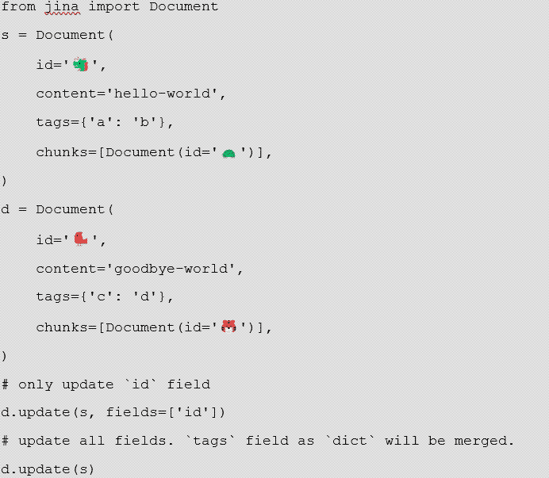

# 四、学习Jina的基础知识

在前一章中，我们学习了神经搜索，现在我们可以开始考虑如何使用它，以及实现我们自己的搜索引擎需要采取的步骤。然而，正如我们在前面章节中看到的，为了实现端到端的搜索解决方案，需要花费时间和精力来收集所有需要的资源。这就是Jina可以提供帮助的地方，因为它会处理许多必要的任务，让您专注于实现的设计。

在本章中，你将了解Jina的核心概念:**文档**、**文档**、**执行者**、**流程**。您将详细了解它们，理解它们的整体设计以及它们之间的联系。

我们将讨论以下主要话题:

*   探索Jina
*   文档
*   文档阵列
*   实现者
*   流动

学完这一章，你将对Jina的习语、它们是什么以及如何使用它们有一个扎实的理解。稍后，您将使用这些知识为任何类型的模态构建自己的搜索引擎。

# 技术要求

本章有以下技术要求:

*   最低内存为 4 GB 的笔记本电脑，最好是 8 GB
*   Python 3.7、3.8 或 3.9 安装在类似 Unix 的操作系统上，如 macOS 或 Ubuntu

# 探索Jina

**Jina**是一个框架，帮助你使用最先进的模型在云上构建深度学习搜索系统。Jina是一种基础设施，让你只关注你感兴趣的领域。这样，你就不需要参与构建搜索引擎的每一个环节。这涉及到从预处理数据到根据需要启动微服务的方方面面。神经搜索的另一个好处是你可以搜索任何类型的数据。以下是一些如何使用不同数据类型进行搜索的示例:

*   图像间搜索
*   文本到图像搜索
*   问答搜索
*   音频搜索

构建自己的搜索引擎可能非常耗时，因此Jina的核心目标之一是减少从头构建搜索引擎所需的时间。Jina是以分层的方式设计的，让您只关注您需要的特定部分，让基础架构的其余部分在后台处理。因此，举例来说，你可以直接使用预先训练好的**机器学习** ( **ML** )模型，而不是自己构建。

由于我们生活在云计算时代，利用分散工作所能提供的能力是有意义的，因此将您的解决方案设计为分布在云上是有用的，并且诸如**分片**、**异步**和**休息**等功能被完全集成并开箱即用。

正如我们已经说过的，Jina帮助你减少构建搜索引擎所需的时间和精力的另一种方法是使用最新的最先进的 ML 模型。您可以通过以下两种方式来利用这一点:

*   使用Jina的即插即用模型
*   当您有专门的用例时，或者如果Jina中心仍然没有可用的模型时，从头开始开发您自己的模型

有了这些选项，您可以在拥有一个预定义的模型或实现您自己的模型(如果您的需求没有得到满足)之间进行选择。

可以想象，所有这些都意味着有很多组件在后台工作。您了解的越多，您对应用程序的控制能力就越强，但是首先，您需要了解Jina的基本组件，我们将在以下几节中讨论这些组件:

*   文档
*   文档阵列
*   实现者
*   流

# 单据

在Jina，**文档**是你可以使用的最基本的数据类型。它们是您想要使用的数据，可用于索引和/或查询。它们可以用您需要的任何数据类型来制作，比如文本、gif、PDF 文件、3D 网格等等。

我们将使用文档进行索引和查询，但是由于文档可以是任何类型和大小，很可能我们需要在使用前对它们进行划分。

打个比方，把文档想象成一块巧克力。巧克力有几种类型:白巧克力、黑巧克力、牛奶巧克力等等。同样，文档可以有多种类型，如音频、文本、视频、3D 网格等等。还有，如果我们有一大块巧克力，我们可能会在吃之前把它分成小块。相应地，如果我们有一个大文档，我们应该在索引之前把它分成更小的部分。

Python 代码中的文档是这样的:

```
from jina import Document

document = Document()
```

如您所见，创建一个文档所需要的就是从Jina导入它，然后像创建 Python 中的任何其他对象一样创建它。这是一个非常基本的例子，但在现实生活中，你会有更复杂的情况，所以我们将需要添加一些属性，我们接下来会看到。

## 文档属性

每个文档可以有属于四个主要类别的不同属性:

*   **内容**:此是指您的文档的实际内容。例如，文本或其嵌入的向量。
*   **Meta** :这是关于文档本身的信息。例如，它的 ID 和它是否有任何标签。
*   **递归**:这个告诉我们文档是怎么划分的。例如，它的匹配或者它是否被分成任何块。
*   **相关性**:这是指文档的相关性，比如它的得分。

这些类别由下表中列出的各种属性组成:

| **类别** | **属性** |
| 内容属性 | `.buffer`、`.blob`、`.text`、`.uri`、`.content`、`.embedding` |
| 元属性 | `.id`、`.parent_id`、`.weight`、。`mime_type`、`.content_type`、`.tags`、`.modality` |
| 递归属性 | `.chunks`、`.matches`、`.granularity`、`.adjacency` |
| 相关性属性 | `.score`，`.evaluations` |

表 4.1-文件类别及其属性

稍后我们将更详细地了解这些属性是什么，但是首先，让我们看看如何设置它们。

### 设置和取消设置属性

*表 4.1* 中的属性是我们可以在文档中使用的可能属性。假设我们希望我们的文档有文本`hello world`。我们可以通过如下设置的`text`属性来实现:

```
from jina import Document

document = Document()

document.text = 'hello world'
```

如果我们想取消它，我们可以这样做:

```
document.pop('text')
```

在许多实际情况下，我们需要处理多个属性，也有可能一次取消设置其中的几个属性:

```
document.pop('text', 'id', 'mime_type')
```

### 从标签访问嵌套属性

在Jina，每个文档都包含标签，这些标签拥有一个类似地图的结构，可以映射任意值:

```
from jina import Document

document = Document(tags={'dimensions': {'height': 5.0, 'weight': 10.0}})

document.tags['dimensions'] # {'weight': 10.0, 'height': 5.0}
```

如果您想要访问嵌套字段，您可以通过使用带有符号`__`交错的属性名称来实现。例如，如果您想要访问`weight`标签，您应该执行以下操作:

```
from jina import Document

document = Document(tags={'dimensions': {'height': 5.0, 'weight': 10.0}})

Document.tags__dimensions__weight #10
```

### 构建文档

要构造一个文档，您需要用属性填充它，所以让我们来看看它们。

### 内容属性

每个文档需要包含一些关于自身的信息，从原始的二进制内容到文本信息。我们可以在下表中看到文档可能包含的详细信息:

| **属性** | **描述** |
| `doc.buffer` | 文档的原始二进制内容 |
| `doc.blob` | 图像/音频/视频文档的数组 |
| `doc.text` | 文档的文本信息 |
| `doc.uri` | 文档 URI 可以是本地文件路径、以 http 或 https 开头的远程 URL 或者数据 URI 方案 |
| `doc.content` | 这可以是前面的任何属性(缓冲区、blob、文本、uri) |
| `doc.embedding` | 文档的嵌入数组 |

表 4.2 -内容属性

有两种方法可以将*内容*类型分配给文档。如果您确切地知道它是什么类型，您可以使用`text`、`blob`、`buffer`或`uri`属性显式地分配它。如果你不知道类型，你可以使用`.content`，它会根据最可能的类型自动给你的文档分配一个类型。请看这个，例如:

```
from jina import Document

import numpy as np

document1 = Document(content='hello world')

document2 = Document(content=b'\f1')

document3 = Document(content=np.array([1, 2, 3]))

document4 = Document(content=

'https://static.jina.ai/logo/core/notext/light/logo.png')
```

在本例中，以下情况适用:

*   `document1`会有一个`text`的字段。
*   `document2`会有一个`buffer`的字段。
*   `document3`会有一个`blob`的字段。
*   `document4`将有一个`uri`字段。

内容将自动分配给`text`、`buffer`、`blob`或`uri`字段中的任意一个。`id`和`mime_type`属性在没有明确设置时自动生成。这意味着您可以明确指定文档的 ID 和类型(`mime_type`)，否则它将自动生成。

### 文档内容的排他性

在Jina，每个文件只能包含一种内容:`text`、`buffer`、`blob`或`uri`。首先设置`text`，然后设置`uri`将清除`text`域。

在下图中，您可以看到内容可以有不同的类型，以及每个文档只能有一种类型的事实。


图 4.1-文档中可能的内容类型

让我们看看如何在代码中设置文档的属性:

```
doc = Document(text='hello world')

doc.uri = 'https://jina.ai/' #text field is cleared, doc 

#has uri field now

assert not doc.text  # True

doc = Document(content='https://jina.ai')

assert doc.uri == 'https://jina.ai'  # True

assert not doc.text  # True

doc.text = 'hello world' #uri field is cleared, doc has 

#text field now

assert doc.content == 'hello world'  # True

assert not doc.uri  # True
```

您可以看到如何在文档中设置每种类型的属性，但是如果您为单个文档分配不同的值，那么只有最后一个属性是有效的。

### 文档内容的转换

既然你已经看到了Jina不同的可能属性，你可能会想，有时候把一种类型的`doc.content`转换成另一种会很有用。例如，如果您有一个文档及其路径(`uri`)，但是您需要它是文本格式的，那么您可以使用这些预置的转换函数之一来轻松地切换内容类型:

```
doc.convert_buffer_to_blob()

doc.convert_blob_to_buffer()

doc.convert_uri_to_buffer()

doc.convert_buffer_to_uri()

doc.convert_text_to_uri()

doc.convert_uri_to_text()

doc.convert_image_buffer_to_blob()

doc.convert_image_blob_to_uri()

doc.convert_image_uri_to_blob()

doc.convert_image_datauri_to_blob()
```

如您所见，所有这些方法都将帮助您将数据从一种类型转换为另一种类型，但是所有这些类型都需要转换为向量嵌入。让我们看看嵌入到底是什么，以及为什么我们在神经搜索中使用它们。

### 设置嵌入属性

一个嵌入是一个文档的高维表示，它是神经搜索中的一个关键元素。嵌入是以向量格式表示数据。这就是为什么神经搜索可以用于任何类型的数据，而不管其类型(图像、音频、文本等等)。数据将被转换成向量(嵌入)，而这些向量将被用于神经搜索。因此，类型并不重要，因为神经搜索最终只能处理向量。

因为我们使用的是 vectors，所以使用已经建立的对嵌入有广泛支持的库是很有用的，比如 NumPy，所以你可以，比如，将任何 NumPy `ndarray`指定为文档的嵌入，然后使用这些库提供的灵活性:

```
import numpy as np

from jina import Document

d1 = Document(embedding=np.array([1, 2, 3]))

d2 = Document(embedding=np.array([[1, 2, 3], [4, 5, 6]]))
```

### 元属性

除了内容属性，您还可以拥有元属性:

| **属性** | **描述** |
| `doc.tags` | 用于存储文档的元信息 |
| `doc.id` | 表示唯一文档 ID 的 hexdigest |
| `doc.parent_id` | 表示文档父 ID 的 hexdigest |
| `doc.weight` | 文件的重量 |
| `doc.mime_type` | 文档的 mime 类型 |
| `doc.content_type` | 文档的内容类型 |
| `doc.modality` | 文档形式的标识符，如图像、文本等 |

表 4.3–元属性

要创建您的文档，您可以在它的构造函数中分配多个属性，如下所示:

```
from jina import Document

document = Document(uri='https://jina.ai',

             mime_type='text/plain',

             granularity=1,

             adjacency=3,

             tags={'foo': 'bar'})
```

### 从字典或 JSON 字符串构造文档

还有从 Python 字典或 JSON 字符串直接构造文档的选项。如果您已经以这些格式存储了文档信息，您可以使用以下示例方便地创建文档:

```
from jina import Document

import json

doc = {'id': 'hello123', 'content': 'world'}

doc1 = Document(d)

doc = json.dumps({'id': 'hello123', 'content': 'world'})

doc2 = Document(d)
```

#### 解析无法识别的字段

如果字典 JSON 字符串中的字段未被识别，它们将被自动放入`document.tags`字段。如下例所示，`foo`不是已定义的属性(*表 4.3* )，所以会自动解析到`tags`字段:

```
from jina import Document

doc1 = Document({'id': 'hello123', 'foo': 'bar'})
```

您可以使用`field_resolver`将外部字段名称映射到文档属性:

```
from jina import Document

doc1 = Document({'id': 'hello123', 'foo': 'bar'}, 

field_resolver={'foo': 'content'})
```

#### 从其他文档构造一个文档

如果您想让复制一份文件，以下是几种方法:

*   **浅拷贝**:将文档对象分配给另一个文档对象将进行浅拷贝:

    ```
    from jina import Document doc = Document(content='hello, world!') doc1 = doc assert id(doc) == id(doc1)  # True
    ```

*   `copy=True` :

    ```
    doc1 = Document(doc, copy=True) assert id(doc) == id(doc1)  # False
    ```

*   **部分复制**:您可以根据另一个源文档部分更新一个文档；



您可以使用前面三种方法中的任何一种来复印文件。

从 JSON、CSV、ndarray 等文件类型构造文档

通过`jina.types.document.generators`模块，您可以从常见的文件类型(如`JSON`、`CSV`、`ndarray`和文本文件)构建文档。

以下函数将创建一个文档生成器，其中每个`Document`对象对应于原始格式的一行/一行:

| **导入方法** | **描述** |
| `from_ndjson()` | 这个函数从基于行的 JSON 文件生成一个文档。每行都是一个文档对象。 |
| `from_csv()` | 这个函数从一个. csv 文件生成一个文档。每行都是一个文档对象。 |
| `from_files()` | 这个函数从 glob 文件中产生一个文档。每个文件都是一个文档对象。 |
| `from_ndarray()` | 这个函数从一个数组中产生一个文档。每一行(取决于轴)是一个文档对象。 |
| `from_lines()` | 这个函数从 JSON 和 CSV 的行中产生一个文档。 |

表 4.4–构建文档的 Python 方法

使用生成器有时会占用较少的内存，因为它不会一次性加载/构建所有的文档对象。

现在，您已经了解了什么是文档以及如何创建文档。您可以通过用单独的内容填充它来创建它，或者如果您已经有一个 JSON 文件的话，通过从该文件复制来创建它。

# 文档阵列

Jina中另一个强大的概念是`insert`、`delete`、`construct`、`traverse`和`sort`。文档阵列是执行者的一等公民，充当其输入和输出。我们将在下一节讨论执行者，但是现在，把他们想象成Jina处理文档的方式。

## 构建文档库

您可以像 Python 列表一样构造、删除、插入、排序和遍历`DocumentArray`。您可以用不同的方式来创建它们:

```
from jina import DocumentArray, Document

documentarray = DocumentArray([Document(), Document()])

from jina import DocumentArray, Document

documentarray = DocumentArray((Document() for _ in range(10))

from jina import DocumentArray, Document

documentarray1 = DocumentArray((Document() for _ in range(10)))

documentarray2 = DocumentArray(da)
```

与普通文档一样，DocumentArray 也支持如下不同的方法:

| **类别** | **属性** |
| 类似 Python 列表的界面 | `__getitem__`、`__setitem__`、 `__delitem__`、`__len__`、`insert`、`append`、`reverse`、`extend`、`__iadd__`、 `__add__`、`__iter__`、`clear`、`sort, shuffle`、`sample` |
| 坚持 | `save`，`load` |
| 神经搜索操作 | `match`，`visualize` |
| 高级吸气器 | `get_attributes`、 `get_attributes_with_docs`、 `traverse_flat`、`traverse` |

表 4.5-文档阵列属性

### 通过 save()/load()实现持久性

当然，有些情况下你会想要保存你的文档数组的元素以供进一步处理，你可以通过两种方式保存文档数组中的所有元素:

*   JSON 行格式
*   二进制格式

要将其保存为 JSON 行格式，您可以执行以下操作:

```
from jina import DocumentArray, Document

documentarray = DocumentArray([Document(), Document()])

documentarray.save('data.json')

documentarray1 = DocumentArray.load('data.json')
```

要以二进制格式存储它，这样速度更快，生成的文件更小，您可以执行以下操作:

```
from jina import DocumentArray, Document

documentarray = DocumentArray([Document(), Document()])

documentarray.save('data.bin', file_format='binary')

documentarray1 = DocumentArray.load('data.bin', file_format='binary')
```

### 基本操作

与任何其他对象一样，您可以在 DocumentArray 上执行基本操作。这包括以下内容:

*   访问元素
*   排序元素
*   过滤元件

下面我们来详细了解一下这些。

#### 访问元素

您可以通过索引、ID 或切片索引访问 DocumentArray 中的文档，如下所示:

```
from jina import DocumentArray, Document

documentarray = DocumentArray([Document(id='hello'), 

Document(id='world'), Document(id='goodbye')])

documentarray[0]

# <jina.types.document.Document id=hello at 5699749904>

documentarray['world']

# <jina.types.document.Document id=world at 5736614992>

documentarray[1:2]

# <jina.types.arrays.document.DocumentArray length=1 at 

# 5705863632>
```

根据您的用例场景，可以随意使用这些选项的任何变体。

#### 排序元素

因为`DocumentArray`是`MutableSequence`的子类，所以可以使用内置的 Python 函数`sort`对 DocumentArray 中的元素进行排序。例如，如果您想要就地排序元素(不制作副本)，并以降序方式使用`tags[id]`值，您可以执行以下操作:

```
from jina import DocumentArray, Document

documentarray = DocumentArray(

    [

        Document(tags={'id': 1}),

        Document(tags={'id': 2}),

        Document(tags={'id': 3})

    ]

)

documentarray.sort(key=lambda d: d.tags['id'], 

reverse=True)

print(documentarray)
```

前面的代码将打印以下内容:

```
<jina.types.arrays.document.DocumentArray length=3 at 5701440528>

{'id': '6a79982a-b6b0-11eb-8a66-1e008a366d49', 'tags': {'id': 3.0}},
{'id': '6a799744-b6b0-11eb-8a66-1e008a366d49', 'tags': {'id': 2.0}},
{'id': '6a799190-b6b0-11eb-8a66-1e008a366d49', 'tags': {'id': 1.0}}
```

#### 过滤元件

您可以使用 Python 的内置`filter`函数来过滤`DocumentArray`对象中的元素:

```
from jina import DocumentArray, Document

documentarray = DocumentArray([Document() for _ in range(6)])

for j in range(6):

    documentarray[j].scores['metric'] = j

for d in filter(lambda d: d.scores['metric'].value > 2, documentarray):

    print(d)
```

这将打印以下内容:

```
{'id': 'b5fa4871-cdf1-11eb-be5d-e86a64801cb1', 'scores': {'values': {'metric': {'value': 3.0}}}}
{'id': 'b5fa4872-cdf1-11eb-be5d-e86a64801cb1', 'scores': {'values': {'metric': {'value': 4.0}}}}
{'id': 'b5fa4873-cdf1-11eb-be5d-e86a64801cb1', 'scores': {'values': {'metric': {'value': 5.0}}}}
```

您还可以从过滤结果中构建一个`DocumentArray`对象，如下所示:

```
from jina import DocumentArray, Document

documentarray = DocumentArray([Document(weight=j) for j in range(6)])

documentarray2 = DocumentArray(d for d in documentarray if d.weight > 2)

print(documentarray2)
```

这将打印以下结果:

```
DocumentArray has 3 items:
{'id': '3bd0d298-b6da-11eb-b431-1e008a366d49', 'weight': 3.0},
{'id': '3bd0d324-b6da-11eb-b431-1e008a366d49', 'weight': 4.0},
{'id': '3bd0d392-b6da-11eb-b431-1e008a366d49', 'weight': 5.0}
```

至此，您已经学习了如何创建将多个文档存储为一个列表的文档和文档数组。但是你能用这些做什么呢？你如何处理它们用于神经搜索？这就是执行者介入的地方。让我们在下面的部分中讨论它们。

# 遗嘱执行人

**执行者**代表Jina流程中的处理组件。它对文档或文档数组执行单一任务。你可以把遗嘱执行人看作是Jina的逻辑部分。执行者是在文档上执行各种任务的人。例如，您可以使用一个执行器来从 PDF 文件中提取文本，或者为您的文档编码音频。他们在Jina处理所有的算法任务。

由于执行器是Jina的主要部分之一，并且它们是执行所有算法任务的部分，以一种方式使它们可以很容易地与其他人共享，以便其他人可以重用你的工作，这对你来说将是非常有用的。类似地，您可以在自己的代码中使用别人预先构建的执行器。这实际上是可能的，因为遗嘱执行人很容易在一个市场上找到，这个市场在Jina被称为https://hub.jina.ai/Jina中心。在那里，您可以在解决不同任务的各种执行器之间进行浏览，并且您可以选择对您有用的执行器并在您的代码中使用它。当然，您需要执行的任务的执行程序可能还没有在Jina中心构建，在这种情况下，您需要创建自己的执行程序。你可以在Jina枢纽轻松做到这一点。让我们深入探讨一下如何做到这一点。

## 创建遗嘱执行人

要创建一个执行程序，最好使用Jina中心，它会生成一个向导来引导你完成这个过程。要开始此过程，请打开控制台并编写以下命令:

```
jina hub new
```

这将触发一个向导，引导您创建执行程序，并询问您有关它的一些细节:


图 4.3–通过 CLI 创建执行者

完成向导后，您的执行人就准备好了。现在，让我们更详细地了解遗嘱执行人。

执行者通过用`@requests`修饰的函数就地处理文档。我们将这个装饰器添加到执行器中我们想要的任何函数中。创建遗嘱执行人时，应牢记三个原则:

*   它应该是`jina.Executor`类的子类。
*   它必须是一个国家`shared`的功能包。它可以包含任意数量的具有任意名称的函数。
*   由`@requests`修饰的函数将根据它们的`on= endpoint`被调用。在下面的例子中，我们将看到这些端点的不同情况。

下面是 Python 中一个非常基本的执行器，可以帮助您更好地理解最后一个概念:

```
from jina import Executor, requests

class MyExecutor(Executor):

    @requests

    def foo(self, **kwargs):

        print(kwargs)
```

您的执行程序的名称可以是您希望的任何名称，但是重要的是要记住每个新的执行程序都应该是`jina.Executor`的子类。

#### 构造器

如果您的执行程序不包含初始状态，则不需要实现构造函数(`__init__`)，但是如果您的执行程序有`__init__`，则需要在签名中携带`**kwargs`并将`super().__init__(**kwargs)`调用到主体中:

```
from jina import Executor

class MyExecutor(Executor):

    def __init__(self, foo: str, bar: int, **kwargs):

        super().__init__(**kwargs)

        self.bar = bar

        self.foo = foo
```

#### 方法装饰者

`@requests`装饰器定义了函数何时被调用。它有`on=`关键字，用于定义端点。我们还没谈到心流。我们将在下一节中这样做，但是现在，把 Flow 想象成一个管理器。无论何时需要调用我们的执行程序，T2 装饰器都会向 Flow 发送信息。这是为了通知 Flow 函数何时被调用以及在哪个端点被调用。

您可以像这样使用装饰器:

```
from jina import Executor, Flow, Document, requests

class MyExecutor(Executor):

    @requests(on='/index')

    def foo(self, **kwargs):

        print(f'foo is called: {kwargs}')

    @requests(on='/random_work')

    def bar(self, **kwargs):

        print(f'bar is called: {kwargs}')

f = Flow().add(uses=MyExecutor)

with f:

    f.post(on='/index', inputs=Document(text='index'))

    f.post(on='/random_work', 

    inputs=Document(text='random_work'))

    f.post(on='/blah', inputs=Document(text='blah')) 
```

在本例中，我们有三个端点:

*   `on='/index'`:该端点将触发`MyExecutor.foo`方法。
*   `on='/random_work'`:这个端点将触发`MyExecutor.bar`方法。
*   `on='/blah':`该端点不会触发任何方法，因为没有函数绑定到`MyExecutor.blah`。

#### 遗嘱执行人绑定

既然我们已经看到了如何创建执行器，并了解了`@requests`装饰器，您可能想知道什么类型的绑定可以与`@requests`一起使用。

#### 默认绑定

用 plain `@requests`修饰的类方法是所有端点的默认处理程序。这意味着它是找不到的端点的后备处理程序。让我们看一个例子:

```
from jina import Executor, requests

class MyExecutor(Executor):

    @requests

    def foo(self, **kwargs):

        print(kwargs)

    @requests(on='/index')

    def bar(self, **kwargs):

        print(kwargs)
```

在本例中，定义了两个函数:

*   `foo`
*   `bar`

这里，`foo`函数成为默认方法，因为它没有`on=`关键字。如果我们现在使用一个未知的端点，比如`f.post(on='/blah', ...)`，它将调用`MyExecutor.foo`，因为没有`on='/blah'`端点。

#### 多重绑定

要绑定一个有多个端点的方法，可以使用`@requests(on=['/foo', '/bar'])`。这允许 `f.post(on='/foo', ...)`或`f.post(on='/bar', ...)`调用该功能。

#### 没有绑定

没有`@requests`绑定的类在 a 流中不起作用。请求将简单地通过而不做任何处理。

现在你知道了什么是执行器，以及为什么与其他开发人员分享它们是有用的。您还学习了在哪里可以找到已经发布的遗嘱执行人，以及如何发布您自己的遗嘱执行人。现在让我们来看看如何将目前为止您所学的概念整合在一起。

# 流量

现在你知道了什么是文件和执行者，以及如何与他们一起工作，我们可以开始谈论**流程**，Jina最重要的概念之一。

把心流想象成Jina的一个经理；它负责将在您的应用程序上运行的所有任务，并将使用文档作为其输入和输出。

## 创建流程

在Jina创建一个流非常容易，就像 Python 中的其他对象一样。例如，这是创建空流的方式:

```
from jina import Flow

f = Flow()
```

为了使用一个流，最好总是将它作为一个上下文管理器打开，就像在 Python 中打开一个文件一样，使用`with`函数:

```
from jina import Flow

f = Flow()

with f:     

f.block()
```

注意

Flow 遵循一种懒惰的构造模式:除非使用`with`函数打开它，否则它不会真正运行。

## 向流程添加执行者

要将元素添加到您的流程中，您需要做的就是使用`.add()`方法。你可以添加任意多的元素。

`.add()`方法用于将执行器添加到流对象中。每个`.add()`实例增加一个新的执行器，这些执行器可以作为本地线程、本地进程、远程进程运行，在 Docker 容器内部，甚至在远程 Docker 容器内部。您可以根据需要添加任意数量，如下所示:

```
from jina import Flow

flow = Flow().add().add()
```

### 通过使用定义执行人

您可以使用`uses`参数来指定您正在使用的执行器。`uses`参数接受多种值类型，包括类名、Docker 图像和(内联)YAML。因此，您可以通过以下方式添加一个执行人:

```
from jina import Flow, Executor

class MyExecutor(Executor):

    ...

f = Flow().add(uses=MyExecutor)
```

### 可视化流程

如果你想可视化你的流程，你可以使用`.plot()`功能。这将创建一个带有可视化流程的`.svg`文件。为此，在流程末尾添加`.plot()`函数，并使用`.svg`文件的预期标题:

```
from jina import Flow

f = Flow().add().plot('f.svg')
```

前面的代码片段将生成下图以及相应的流程:


图 4.4–流程示例

注意

在 Jupyter Lab/Notebook 中，Flow 对象是自动渲染的，不需要调用`.plot()`。

您也可以使用 CRUD 方法(索引、搜索、更新、删除)，这只是 post with `on='/index', on='/search'`的甜言蜜语的语法形式。这些在下面的列表中列出:

*   `index = partialmethod(post, '/index')`
*   `search = partialmethod(post, '/search')`
*   `update = partialmethod(post, '/update')`
*   `delete = partialmethod(post, '/delete')`

因此，综合前面的概念，一个最小的工作示例需要创建一个从基本 Executor 类扩展的 Executor，并且可以与您的流一起使用:

```
from jina import Flow, Document, Executor, requests  

class MyExecutor(Executor):      

@requests(on='/bar')

 def foo(self, docs, **kwargs):

    print(docs) 

f = Flow().add(name='myexec1', uses=MyExecutor) 

with f:     

f.post(on='/bar', inputs=Document(), on_done=print)
```

就是这样！你现在有了一个最小的工作示例，并且已经了解了Jina的基本知识。我们将在接下来的章节中看到更高级的用法，但是如果你已经学习了文档、文档数组、执行器和流程的概念，你就可以开始了。

# 总结

本章介绍了Jina中的主要概念:文档、文档阵列、流程和执行者。现在，您应该对这些概念有了一个大致的了解，它们为什么重要，以及它们之间的关系。

除了理解为什么文档、文档数组、流程和执行者在构建搜索引擎时很重要的理论之外，您还应该能够创建一个简单的文档并分配其相应的属性。当你完成了这一章，你也应该能够创建你自己的执行程序和旋转一个基本的流程。

你将在下一章使用所有这些知识，在那里你将学习如何将这些概念整合在一起。