# 第四章。高级 Word2vec

在[第三章](ch03.html "Chapter 3. Word2vec – Learning Word Embeddings")、*Word2vec——学习词嵌入*中，我们向大家介绍了 Word2vec，学习词嵌入的基础知识，以及两种常见的 Word 2 vec 算法:skip-gram 和 CBOW。在本章中，我们将讨论与 Word2vec 相关的几个主题，重点是这两个算法和扩展。

首先，我们将探索原始的 skip-gram 算法是如何实现的，以及它如何与我们在第 3 章、*Word 2 vec–学习词嵌入*中使用的更现代的变体进行比较。我们将研究 skip-gram 和 CBOW 之间的差异，并观察这两种方法随时间的损失行为。我们还将利用我们的观察和现有的文献来讨论哪种方法效果更好。

我们将讨论对现有 Word2vec 方法的几个扩展，以提高性能。这些扩展包括使用更有效的采样技术来对负样本进行采样，以及在学习过程中忽略无信息的单词，等等。您还将学习一种新的词嵌入学习技术，称为**全局向量** ( **GloVe** )和GloVe 相对于 skip-gram 和 CBOW 的具体优势。

最后，您将学习如何使用 Word2vec 解决一个现实世界的问题:文档分类。我们将通过一个从词嵌入中获取文档嵌入的简单技巧来了解这一点。

# 原 skip-gram 算法

到目前为止，本书中讨论的 skip-gram 算法实际上是对 Mikolov 等人在 2013 年发表的原始论文中提出的原始 skip-gram 算法的改进。在本文中，该算法没有使用中间隐藏层来学习表示。相比之下，原始算法使用了两个不同的嵌入或投影层(图 4.1 中的输入和输出嵌入)，并定义了一个源自嵌入本身的成本函数:


图 4.1:没有隐藏层的原始跳格算法

原始负抽样损失定义如下:

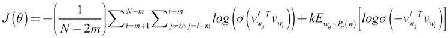

这里， *v* 是输入嵌入层，*v’*是输出词嵌入层，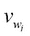对应于输入嵌入层中单词*w[I]的嵌入向量，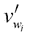对应于输出嵌入层中单词*w[I]的单词向量。**

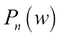

就是噪声分布，我们从中抽取噪声样本(比如可以简单到从词汇中统一抽取——*{ w**[I]**，w* *[j] }* ，就像我们在[第三章](ch03.html "Chapter 3. Word2vec – Learning Word Embeddings")，*Word 2 vec——学习词嵌入*)。最后， *E* 表示从 k-负样本中获得的损失的期望(平均值)。如你所见，除了词嵌入本身，这个等式中没有权重和偏差。

## 实现原 skip-gram 算法

实现原始的 skip-gram 算法不像我们已经实现的版本那样简单。这是因为损失函数需要使用TensorFlow函数手工制作，因为没有内置的函数来计算损失，这与其他算法不同。

首先，让我们为以下内容定义占位符:

*   **输入数据**:这是一个占位符，包含一批`[batch_size]`形状的目标词
*   **输出数据**:这是一个占位符，包含该批目标词对应的上下文词，大小为`[batch_size, 1]`

    ```
    train_dataset = tf.placeholder(tf.int32, shape=[batch_size]) train_labels = tf.placeholder(tf.int64, shape=[batch_size, 1])
    ```

定义了输入和输出占位符后，我们可以使用 TensorFlow 内置的`candidate_sampler`对负样本进行采样，如以下代码所示:

```
negative_samples, _, _ = tf.nn.log_uniform_candidate_sampler(
                                      train_labels, num_true=1,
                                      num_sampled=num_sampled,
                                      unique=True,
                                      range_max=vocabulary_size)
```

在这里，我们对否定词进行统一采样，对不同的词没有任何特殊的偏好。`train_labels`是真样本，TensorFlow 可以避免产生负样本。然后我们有了`num_true`的数量，它表示给定数据点的真实类的数量，也就是 1。接下来是我们想要的一批数据的负样本数(`num_sampled`)。`unique`定义阴性样本是否应该是唯一的。最后，`range`定义了一个单词的最大 id，这样采样器就不会产生任何无效的单词 ID。

我们摆脱了最大权重和偏见。然后，我们引入两个嵌入层，一个用于输入数据，另一个用于输出数据。需要两个嵌入层，因为如果我们只有一个嵌入层，成本函数将不起作用，正如在[第 3 章](ch03.html "Chapter 3. Word2vec – Learning Word Embeddings")、*Word 2 vec–学习词嵌入*中所讨论的。

让我们嵌入对输入数据、输出数据和负样本的查找:

```
in_embed = tf.nn.embedding_lookup(in_embeddings, train_dataset)
out_embed = tf.nn.embedding_lookup(out_embeddings, tf.reshape(
                                      train_labels,[-1]))
negative_embed = tf.nn.embedding_lookup(out_embeddings,
                                           negative_samples)
```

接下来，我们将定义损失函数，它是代码中最重要的部分。这段代码实现了我们前面讨论过的损失函数。然而，正如我们在损失函数中所定义的，我们不会一次计算文档中所有单词的损失。这是因为文档可能太大而无法完全放入内存。因此，我们在单个时间步计算小批量数据的损失。完整代码可在位于`ch4`文件夹中的`ch4_word2vec_improvements.ipynb`练习册中找到:

```
# Computing the loss for the positive sample
loss = tf.reduce_mean(
    tf.log(
        tf.nn.sigmoid(
            tf.reduce_sum(
                tf.diag([1.0 for _ in range(batch_size)])*
                tf.matmul(out_embed,tf.transpose(in_embed)),
            axis=0)
        )
    )
)

# Computing loss for the negative samples
loss += tf.reduce_mean(
    tf.reduce_sum(
        tf.log(tf.nn.sigmoid(
            -tf.matmul(negative_embed,tf.transpose(in_embed)))),
        axis=0
    )
)
```

### 注意

Tensorflow 通过从完整的 softmax 权重和偏差中定义一个更小的权重和偏差子集来实现`sampled_softmax_loss`,这些权重和偏差只需要处理当前的一批数据。此后，TensorFlow 会以类似于标准 softmax 交叉熵计算的方式计算损失。然而，我们不能直接翻译这种方法来计算原始跳格损失，因为没有 softmax 权重和偏差。

## 比较原始跳转图和改进的跳转图

我们应该有一个很好的理由来使用一个隐藏层，而不是原来的 skip-gram 算法不使用隐藏层。因此，我们将在*图 4.2* 中观察原始 skip-gram 算法和包含隐藏层的 skip-gram 算法的损失函数行为:

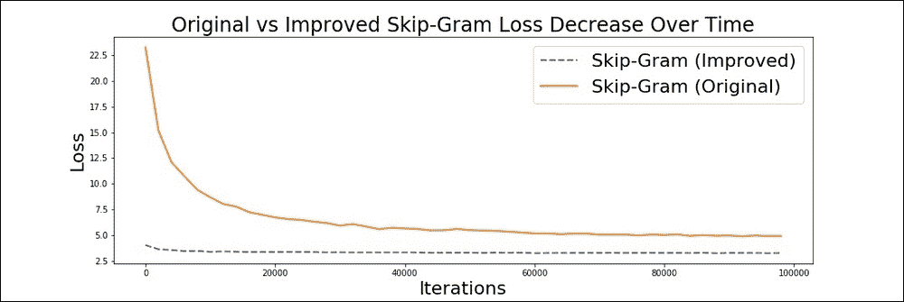

图 4.2:原始跳格算法与改进的跳格算法

我们可以清楚地看到，有一个隐藏层会比没有隐藏层带来更好的性能。这也表明更深 Word2vec 模型往往性能更好。


# 比较跳跃图和 CBOW

在查看性能差异和调查原因之前，让我们提醒自己 skip-gram 和 CBOW 方法之间的根本区别。

如下图所示，给定一个上下文和一个目标单词，skip-gram 只观察单个输入/输出元组中的目标单词和上下文的单个单词。然而，CBOW 在单个样本中观察目标单词和上下文中的所有单词。例如，如果我们假设短语*狗对着邮差*吠叫，skip-gram 会在单个时间步长看到一个输入输出元组，如 *["狗"，" at"]* ，而 CBOW 会看到一个输入输出元组 *["狗"，"吠叫"，"邮差"，" at"]* 。因此，在给定的一批数据中，CBOW 比 skip-gram 接收到更多关于给定单词上下文的信息。接下来让我们看看这种差异如何影响这两种算法的性能。

如上图所示，与 skip-gram 算法相比，CBOW 模型在给定时间可以访问更多的信息(输入),从而使 CBOW 在特定条件下表现更好。

## 性能对比

现在，让我们绘制 skip-gram 和 CBOW 在时间上的损失，我们在前面的[第 3 章](ch03.html "Chapter 3. Word2vec – Learning Word Embeddings")、*Word 2 vec–学习词嵌入*中训练了模型(参见*图 4.4* ):

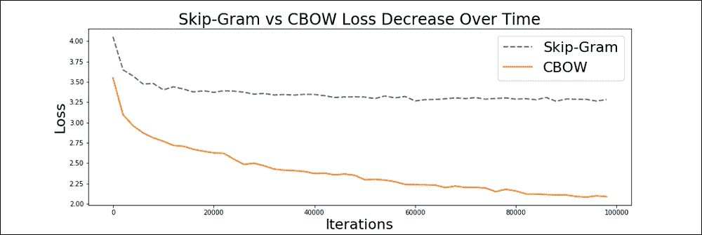

图 4.5:损失减少:skip-gram 对比 CBOW

我们讨论过，与 skip-gram 算法相比，对于给定的输入-输出元组，CBOW 可以访问关于给定目标词的上下文的更多信息。我们可以看到，与 skip-gram 模型相比，CBOW 显示了损耗的快速下降。然而，损失本身并不能充分衡量绩效，因为损失会因过度适应训练数据而迅速减少。虽然有一些基准测试任务用于评估词嵌入的质量(例如，单词类比任务)，但是我们将使用一种更简单的检查方法。让我们直观地检查一下学习到的嵌入，以确保 skip-gram 和 CBOW 在它们之间显示出显著的语义差异。为此，我们使用一种流行的可视化技术，称为**t-分布式随机邻居嵌入** ( **t-SNE** )。

### 注

应当注意，损失的减少不是评估词嵌入系统的性能的非常令人信服的度量，因为我们用来测量损失的采样 softmax 严重低估了完整的 softmax 损失。词嵌入的表现通常根据单词类比任务来评估。一个典型的单词类比任务可能会这样问:

意识到没有意识到就像印象深刻到 ______________。

所以，一个好的嵌入设置应该用*不起眼的*来回答这个问题。这可以通过`embedding(impressive) - [embedding(aware) - embedding(unaware)]`给出的简单算术运算来计算。如果得到的向量有单词`unimpressive`的嵌入作为它的最近邻，那么你就获得了正确的答案。

有几个词语类比测试数据集可用，例如下面的:

*   **谷歌类比数据集**:[http://download.tensorflow.org/data/questions-words.txt](http://download.tensorflow.org/data/questions-words.txt)
*   **更大的类比测试集(蝙蝠)**:[http://vsm.blackbird.pw/bats](http://vsm.blackbird.pw/bats)

在*图 4.6* 中，我们可以看到 CBOW 比 skip-gram 更倾向于将单词聚集在一起，在 skip-gram 中，单词似乎稀疏地分布在整个空间中。因此，我们可以说，与 skip-gram 相比，CBOW 在视觉上更具吸引力，在这个特定的示例中:

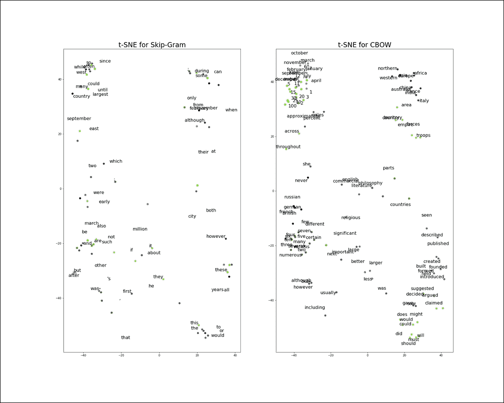

图 4.6:使用 skip-gram 和 CBOW 获得的单词向量的 t-SNE 可视化

### 注意

我们将使用 scikit-learn 提供的 t-SNE 算法来计算低维表示，然后通过 Matplotlib 将其可视化。然而，TensorFlow 通过其可视化框架 TensorBoard 提供了一个更加方便的嵌入可视化选项。你可以在位于`appendix`文件夹的`tensorboard_word_embeddings.ipynb`中找到这个练习。

### 提示

**t-SNE——一次简短的旅行**

t-SNE 是一种可视化技术，可以在较低的二维空间中可视化高维数据(例如，图像和词嵌入)。我们不会深入研究该技术背后的所有复杂数学，而只会在更直观的层面上理解算法是如何工作的。

让我们首先定义符号。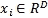表示一个 *D* 维数据点，而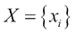是输入空间。例如，这可以是一个词嵌入向量，类似于我们在[第 3 章](ch03.html "Chapter 3. Word2vec – Learning Word Embeddings")、*Word 2 vec–学习词嵌入*中所涉及的向量，而 *D* 是嵌入大小。接下来，我们假设一个假想的二维空间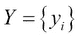，其中*y[I]表示与*x[I]数据点对应的二维向量； *X* 和 *Y* 一一对应。我们将 *Y* 称为地图空间，*Y[I]称为地图点。***

现在让我们定义一个条件概率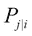，它定义了*x[I]数据点选择*x[j]作为其邻居的概率。*P**[j | I]*当点 *x [ j ]* 远离 *x [ i ]* 时需要为低，反之亦然。对的直观选择是以*x[I]数据点为中心的高斯分布，方差为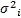。对于具有密集邻域的数据点，方差较低，而对于具有稀疏邻域的数据点，方差较高。具体地，条件概率的公式由下式给出:***

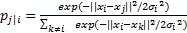

### 提示

同样，我们可以为空间中的图点*Y[I]定义一个类似的条件概率 *Y* ，。*

现在，为了获得高维空间 *X* 、和的良好低维表示 *Y* 应该演示类似的行为。也就是说，如果两个数据点在 *X* 空间中相似，那么它们在 *Y* 空间中也应该相似，反之亦然。因此，获得数据的良好二维表示的问题归结为最小化所有的和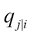之间的不匹配。

这个问题可以正式表述为最小化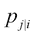和之间的 Kullback-Leibler 散度


由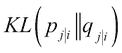表示。因此，我们问题的成本函数是:

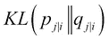

同样，通过利用随机梯度下降来最小化这个 *C* 成本，我们可以找到与 *X* 紧密匹配的最优表示 *Y* 。

直观上，这个过程可以被认为是所有数据点对之间连接的弹簧集合达到的平衡。是弹簧在*x[I]和*x[j]数据点之间的刚度。因此，当*x[I]和*x[j]相似时，它们会在不相似时保持彼此靠近和远离。因此，特定数据点的 *C* 作为作用在该数据点上的合力，并根据该合力使其吸引或排斥所有其他数据点。****

## skip-gram 和 CBOW 谁是赢家？

谈到性能，skip-gram 和 CBOW 之间没有明确的赢家。例如，论文*单词和短语的分布式表示及其组合性*， *Mikolov 等人*， *2013* 提出 skip-gram 在语义任务中工作得更好，而 CBOW 在句法任务中工作得更好。然而，skip-gram 在大多数任务中表现得比 CBOW 更好，这与我们的发现相矛盾。

各种经验证据表明，与 CBOW 相比，skip-gram 在大型数据集上工作得很好，这在单词和短语及其组合性的*分布式表示中得到支持*、*米科洛夫等人*、 *2013* 和 *GloVe:单词表示的全局向量*、 *Pennington 等人*、 *2014* ，它们通常使用数十亿个单词的语料库。然而，我们的任务涉及几十万字，这是比较小的。出于这个原因，CBOW 的表现可能会更好。

现在让我解释一下为什么我认为是这样。考虑下面两句话:

*   *天气不错*
*   这是辉煌的一天

对于 CBOW，输入-输出元组如下所示:

*[[它，是，尼斯，天]，一]*

*[[它，是，辉煌，天]，一]*

skip-gram 的输入输出元组如下所示:

*【它，一个】，【是，一个】，【尼斯，一个】，【日，一个】*

*【它，一】，【是，一】，【辉煌，一】，【天，一】*

我们希望我们的模型理解 *nice* 和 *brilliant* 是稍微不同的东西(也就是说，brilliant 意味着比 nice 更好)。这种意义上有细微差别的词叫做*细微差别*。我们可以看到，对于 CBOW 来说，它很有可能将*辉煌*和*美好*视为同一事物，因为它们的语义被周围的词( *It* 、*是*和 *day* )平均化，因为这些词也是输入的一部分。相比之下，对于 skip-gram，单词 *nice* 和 *brilliant* 与 *It* 、 *is* 和 *day* 分开出现，这使得 skip-gram 比 CBOW 更注意单词之间的细微差异(例如 *brilliant* 和 *nice* )。

但是，请注意，我们的模型中有数百万个参数。要训练这样的模型，需要大量的数据。CBOW 以某种方式规避了这个问题，它试图不专注于学习单词之间的细微差异，而是对给定上下文中的所有单词进行平均(例如，平均语义为*这是美好的一天*或*这是美好的一天*)。然而，skip-gram 将学习更细致的表示，因为在 CBOW 中没有平均效应。为了学习细致的表达，skip-gram 需要更多的数据。但是一旦提供了更多的数据，skip-gram 很可能会胜过 CBOW 算法。

此外，注意，CBOW 模型的单个输入大约等于 skip-gram 模型的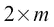个输入，其中 *m* 是上下文窗口大小。这是因为 skip-gram 的单个输入只包含一个单词，而 CBOW 的单个输入有多个单词。因此，为了进行更公平的比较，如果我们对 *L* 步运行 CBOW，我们应该对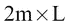步运行 skip-gram 算法。

到目前为止，您已经了解了 skip-gram 最初是如何实现的——它有两个嵌入层(一个用于查找输入单词，另一个用于查找输出单词)。我们讨论了在[第 3 章](ch03.html "Chapter 3. Word2vec – Learning Word Embeddings")、*Word 2 vec–学习词嵌入*中讨论的跳格算法实际上是对原始跳格算法的改进。我们看到改进的 skip-gram 实际上优于原始算法。然后，我们比较了 skip-gram 和 CBOW 的性能，发现在我们的示例中，CBOW 的性能更好。最后，我们讨论了 CBOW 性能优于 skip-gram 的一些原因。


# 词嵌入算法的扩展

Mikolov 等人在 2013 年发表的原始论文讨论了几种可以进一步提高词嵌入学习算法性能的扩展。尽管最初引入它们是为了用于 skip-gram，但是它们也可以扩展到 CBOW。此外，正如我们已经看到的，在我们的例子中，CBOW 优于 skip-gram 算法，我们将使用 CBOW 来理解所有的扩展。

## 使用一元分布进行负采样

已经发现，当通过从某些分布而不是从均匀分布进行采样时，负采样的性能结果更好。一种这样的分布是单字母分布**。一个单词的单字概率由下面的等式给出:**

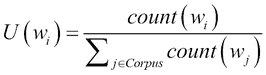

这里，*count*(*w[I]*)是 *w [i]* 在文档中出现的次数。对于某个常数 *Z* 来说，当一元分布被扭曲为时，它已经显示出比均匀分布或标准一元分布提供更好的性能。

让我们用一个例子来更好地理解单字分布。考虑下面的句子:

鲍勃是个足球迷。他是学校足球队的成员。

这里，单词 *football* 的单字概率如下:

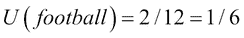

可以看出，常见单词的单字概率会更高。这些常用词往往是很没信息的词，比如*的*、*的一个*、*的就是*。因此，在成本优化期间，这种频繁的词将被更多地负采样，导致更多信息的词被更少地负采样。因此，这在优化期间在常用词和罕见词之间创建了一个平衡，从而带来更好的性能。

## 实现基于单字的负采样

在这里，我们将看到如何使用 TensorFlow 来实现基于单字的负采样:

```
unigrams = [0 for _ in range(vocabulary_size)]
for word,w_count in count:
    w_idx = dictionary[word]
    unigrams[w_idx] = w_count*1.0/token_count
    word_count_dictionary[w_idx] = w_count
```

这里，`count`是元组列表，其中每个元组由`(word ID, frequency)`组成。该算法计算每个单词的单字概率，并将其作为按单词索引排序的列表返回。(这是 TensorFlow 规定的 unigrams 的特定格式)。这可以在`ch4`文件夹中的`ch4_word2vec_improvements.ipynb`中作为练习使用。

接下来，我们计算到嵌入查找，就像我们通常对 CBOW 所做的那样:

```
train_dataset = tf.placeholder(tf.int32, shape=[batch_size,
    window_size*2])
train_labels = tf.placeholder(tf.int32, shape=[batch_size, 1])
valid_dataset = tf.constant(valid_examples, dtype=tf.int32)

# Variables.
# embedding, vector for each word in the vocabulary
embeddings = tf.Variable(tf.random_uniform([vocabulary_size,
    embedding_size], -1.0, 1.0, dtype=tf.float32))
softmax_weights =
    tf.Variable(tf.truncated_normal([vocabulary_size,
    embedding_size],
    stddev=1.0 / math.sqrt(embedding_size), dtype=tf.float32))
softmax_biases =
    tf.Variable(tf.zeros([vocabulary_size], dtype=tf.float32))

stacked_embedings = None

for i in range(2*window_size):
    embedding_i = tf.nn.embedding_lookup(embeddings,
    train_dataset[:,i])
    x_size,y_size = embedding_i.get_shape().as_list()
    if stacked_embedings is None:
        stacked_embedings =
            tf.reshape(embedding_i,[x_size,y_size,1])
    else:
        stacked_embedings =
            tf.concat(axis=2,values=[stacked_embedings,
            tf.reshape(embedding_i,[x_size,y_size,1])])
mean_embeddings = tf.reduce_mean(stacked_embedings,2,keepdims=False)
```

接下来，我们将基于一元分布抽取负样本。为此，我们将使用 TensorFlow 内置函数`tf.nn.fixed_unigram_candidate_sampler`:

```
candidate_sampler = tf.nn.fixed_unigram_candidate_sampler(
    true_classes = tf.cast(train_labels, dtype=tf.int64),
    num_true = 1, num_sampled = num_sampled, unique = True,
    range_max = vocabulary_size, distortion=0.75,
    num_reserved_ids=0, unigrams=unigrams, name='unigram_sampler')

loss = tf.reduce_mean(
    tf.nn.sampled_softmax_loss(weights=softmax_weights,
    biases=softmax_biases, inputs=mean_embeddings,
    labels=train_labels, num_sampled=num_sampled,
    num_classes=vocabulary_size, sampled_values=candidate_sampler))
```

```
 sampling. Generally, the following steps take place:
```

1.  定义变量、占位符和超参数。
2.  对于每一批数据，发生以下情况:

    1.  通过查找上下文窗口的每个索引的嵌入并对它们求平均来计算平均输入嵌入矩阵
    2.  通过负采样来计算损失，根据一元分布进行采样
    3.  使用随机梯度下降

    优化神经网络】

从前面的代码片段中提取的以下一行代码在此算法中起着最重要的作用，它根据扭曲的 unigram 分布生成负样本:

```
candidate_sampler = tf.nn.fixed_unigram_candidate_sampler(
    true_classes = tf.cast(train_labels,dtype=tf.int64),
    num_true = 1, num_sampled = num_sampled, unique = True,
    range_max = vocabulary_size, distortion=0.75,
    num_reserved_ids=0, unigrams=unigrams, name='unigram_sampler')
```

```
t as 10,000:
```

```
subsampled_data = []
for w_i in data:
    p_w_i = 1 - np.sqrt(1e5/word_count_dictionary[w_i])

    if np.random.random() < p_w_i:
        drop_count += 1
        drop_examples.append(reverse_dictionary[w_i])
    else:
        subsampled_data.append(w_i)
```

## 比较 CBOW 及其扩展

在*图 4.6* 中，我们将看到 CBOW、基于单字的负采样 CBOW—**CBOW(单字)**—以及基于单字的负采样和子采样 CBOW—**CBOW(单字+子采样)**的不同损失减少:

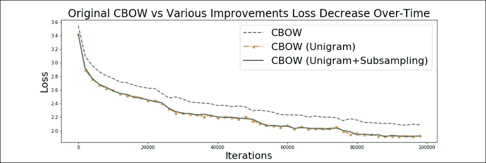

图 4.6:原始 CBOW 和两个扩展 CBOW 的损失行为

有趣的是，我们看到与仅使用基于单 gram 的负采样相比，使用单 gram 和子采样改进可以得到相似的整体外观损失值。然而，这不应该被误解为子采样在学习问题上缺乏优势。这种特殊行为的原因可以理解如下。与二次抽样一样，我们去掉了许多没有信息的单词，因此文本的质量提高了(就信息质量而言)。这反过来又增加了学习问题的难度。在之前的问题设置中，单词向量有机会在优化过程中利用大量无信息的单词，而在新的问题设置中，这样的机会很少。这导致较高的损失，但语义上健全的词向量。


# 扩展 skip-gram 和 CBOW 的最新算法

我们已经看到，Word2vec 技术在捕捉单词的语义方面非常强大。然而，它们也不是没有局限性。例如，他们没有注意上下文单词和目标单词之间的距离。但是，如果上下文单词离目标单词更远，它对目标单词的影响应该更小。因此，我们将讨论分别关注上下文中不同位置的技术。Word2vec 的另一个限制是，在计算单词向量时，它只关注给定单词周围非常小的窗口。然而，实际上，应该考虑单词在整个语料库中共现的方式来计算好的单词向量。因此，我们将研究一种技术，它不仅查看单词的上下文，还查看单词的全局共现信息。

## skip-gram 算法的局限性

之前讨论的 skip-gram 算法及其所有变体忽略了给定上下文中上下文单词的定位。换句话说，skip-gram 不利用上下文单词在上下文中的确切位置，而是平等地对待给定上下文中的所有单词。例如，让我们考虑一个句子:

狗对着邮递员吠叫。

让我们考虑一个大小为 2 的窗口和目标词，*叫了起来。那么单词*吠叫*的上下文将是*的*、*的狗*、*的*和*的*。同样，我们将组成四个数据点*("汪汪"，" the")* ，*("汪汪"，"狗")*，*("汪汪"，" at")* ，*("汪汪"，" the")* ，其中元组的第一个元素是输入单词，第二个是输出单词。如果我们考虑这个集合中的两个数据点，*(“汪汪”、“the”)*和*(“汪汪”、“狗”)*，那么原始的 skip-gram 算法将在优化期间平等地对待这两个元组。换句话说，skip-gram 忽略了上下文单词在上下文中的实际位置。然而，从语言学的角度来看，显然元组*("汪汪"，"狗")*比*("汪汪"，" the")* 承载了更多的信息。本质上，结构化跳过程序算法试图解决这一限制。让我们在下一节看看这是如何解决的。*

## *结构化跳格算法*

*结构化跳格算法使用图 4.7 中*所示的架构来解决前一节讨论的原始跳格算法的局限性:**

*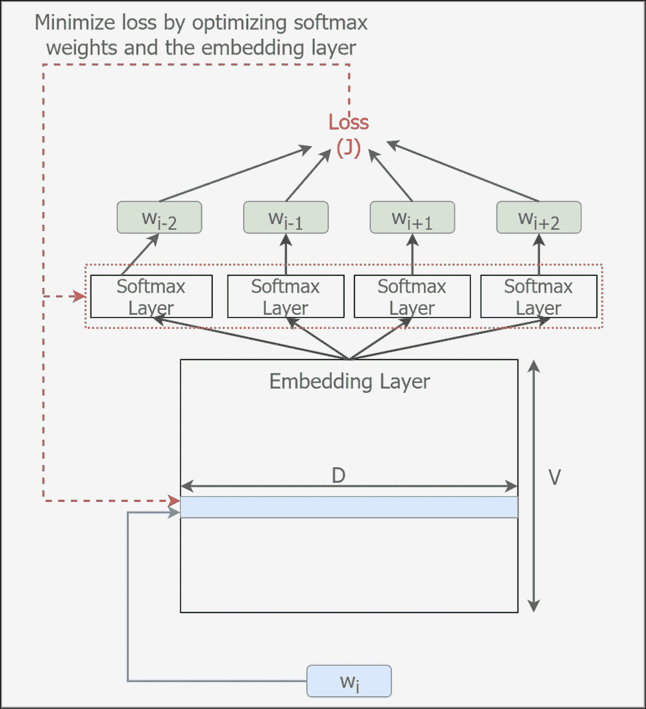

图 4.7。结构化跳格模型* 

*如此处所示，结构化跳过程序在优化过程中保留了上下文单词的结构或定位。然而，它提出了更高的内存需求，因为参数的数量线性地依赖于窗口大小。更准确地说，对于窗口大小 *m* (即，在一侧)，如果原始跳格模型在 softmax 层中具有 *P* 参数，则结构化跳格算法将具有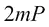参数，因为我们对于上下文窗口中的每个位置都具有一组 *P* 参数。*

## *损失函数*

*跳格模型的原始负采样 softmax 损耗如下所示:*

*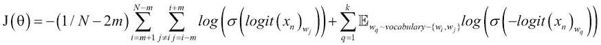*

*对于结构化跳过程序，我们使用以下损失:*

*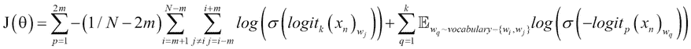*

*这里，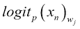是使用与*w[j]位置的索引相对应的第*p*th*组 softmax 权重和 softmax 偏差来计算的。*

*这是如下面的代码所示实现的，该代码位于`ch4`文件夹的`ch4_word2vec_extended.ipynb`中。如我们所见，我们现在有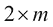 softmax 权重和偏差，并且对应于每个上下文位置的嵌入向量通过它们对应的 softmax 权重和偏差传播。*

*首先，我们将定义输入和输出占位符:*

```
*train_dataset = tf.placeholder(tf.int32, shape=[batch_size])
train_labels = [tf.placeholder(tf.int32, shape=[batch_size, 1]) for _ in range(2*window_size)]*
```

*然后，我们将定义计算损失所需的计算，从训练输入和标签开始:*

```
*# Variables.
embeddings = tf.Variable(
    tf.random_uniform([vocabulary_size, embedding_size],
    -1.0, 1.0))
softmax_weights = [tf.Variable(
    tf.truncated_normal([vocabulary_size, embedding_size],
    stddev=0.5 / math.sqrt(embedding_size))) for _ in range(2*window_size)]
softmax_biases =
    [tf.Variable(tf.random_uniform([vocabulary_size],0.0,0.01)) for _ in range(2*window_size)]

# Model.
# Look up embeddings for inputs.
embed = tf.nn.embedding_lookup(embeddings, train_dataset)
# Compute the softmax loss, using a sample of 
# the negative labels each time.
loss = tf.reduce_sum(
    [
        tf.reduce_mean(tf.nn.sampled_softmax_loss(
            weights=softmax_weights[wi],
            biases=softmax_biases[wi], inputs=embed,
            labels=train_labels[wi], num_sampled=num_sampled,
            num_classes=vocabulary_size))
        for wi in range(window_size*2)
    ]
)*
```

*结构化跳格图解决了标准跳格图算法的一个重要限制，即在学习过程中注意上下文单词的位置。这是通过为上下文的每个位置引入单独的一组 softmax 权重和偏差来实现的。这导致了性能的提高，但是由于参数数量的增加，这需要很高的存储空间。接下来，我们将看到 CBOW 模型的类似扩展。*

## *连续窗口模式*

*连续窗口模型以类似于结构化跳格算法的方式扩展了 CBOW 算法。在最初的 CBOW 算法中，在通过 softmax 层传播之前，对为所有上下文单词找到的嵌入进行平均。然而，在连续窗口模型中，不是对嵌入进行平均，而是将它们连接起来，从而产生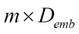长的嵌入向量，其中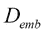是 CBOW 算法的原始嵌入大小。*图 4.8* 说明了连续窗口模型:*

*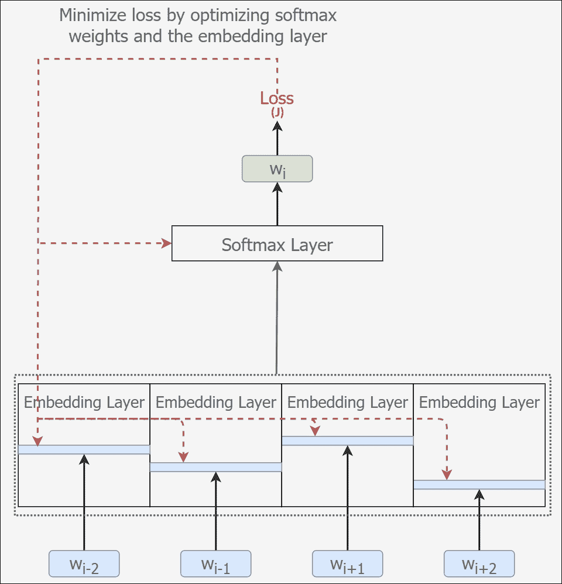

图 4.8:连续窗口模型* 

*在本节中，我们讨论了 skip-gram 和 CBOW 的两个扩展算法。这两种变体本质上利用了单词在上下文中的位置，而不是平等地对待给定上下文中的所有单词。接下来，我们将讨论一种新引入的词嵌入学习算法，称为 GloVe。我们将看到 GloVe 克服了 skip-gram 和 CBOW 的某些限制。*

*

# 手套-全局向量表示

学习单词向量的方法分为两类:基于全局矩阵分解的方法或基于局部上下文窗口的方法。**潜在语义分析** ( **LSA** ) 是基于全局矩阵分解的方法的一个例子，skip-gram 和 CBOW 是基于局部上下文窗口的方法。LSA 被用作一种文档分析技术，它将文档中的单词映射到称为**概念**的东西，这是文档中出现的常见单词模式。基于全局矩阵分解的方法有效地利用了语料库的全局统计数据(例如，单词在全局范围内的共现)，但是在单词类比任务中表现不佳。另一方面，基于上下文窗口的方法在单词类比任务中表现良好，但是没有利用语料库的全局统计，留下了改进的空间。GloVe 试图获得两个世界的最佳结果——一种有效利用全局语料库统计数据的方法，同时以类似于 skip-gram 或 CBOW 的基于上下文窗口的方式优化学习模型。

## 理解手套

在查看 GloVe 的实现细节之前，让我们花时间了解 GloVe 背后的基本思想。为此，让我们考虑一个例子:

1.  考虑单词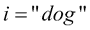和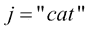
2.  定义一个任意的探测字 *k*
3.  将定义为单词 *i* 和 *k* 彼此靠近出现的概率，将定义为单词 *j* 和 *k* 一起出现的概率

现在让我们来看看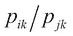实体对于 *k* 的不同值如何表现。

对于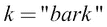，与 *i* 一起出现的可能性很大，因此会高。但是， *k* 不会经常与 *j* 一起出现，导致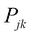低。因此，我们得到下面的表达式:

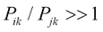

接下来，对于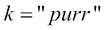，不太可能出现在 *i* 附近，因此会有低；但是，由于 *k* 与 *j* 高度相关，因此的值会很高。这导致了以下情况:

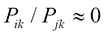

现在，对于像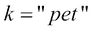这样的词，它与 *i* 和 *j* 都有很强的关系，或者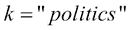，其中 *i* 和 *j* 都有最小的相关性，我们得到这样:

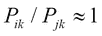

可见，通过测量两个相互接近的词出现的频率来计算的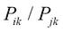实体，是一种很好的测量词与词之间关系的手段。因此，它成为学习单词向量的一个很好的候选。因此，定义损失函数的良好起点如下所示:

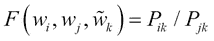

这里， *F* 是一些函数。从这一点出发，原始文件经过精心推导，得出如下损失函数:

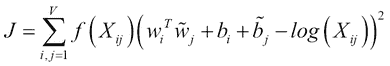

这里的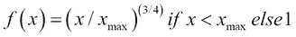、是 *j* 这个词在 *i* 这个词的上下文中出现的频率。另外，*w[I]和*b*I*分别表示从输入嵌入中获得的单词 *i* 的词嵌入和偏差嵌入。并且，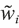和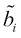分别表示从输出嵌入中获得的字 *j* 的字嵌入和偏置嵌入。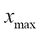是我们设定的一个超参数。除了初始化时的随机化之外，这两种嵌入的行为类似。在评估阶段，这两个嵌入被加在一起，导致性能的提高。

## 实施手套

在这一小节中，我们将讨论实施 GloVe 的步骤。完整的代码可以在位于`ch4`文件夹中的`ch4_glove.ipynb`练习文件中找到。

首先，我们将定义输入和输出:

```
train_dataset = tf.placeholder(tf.int32, shape=[batch_size],name='train_dataset')
train_labels = tf.placeholder(tf.int32, shape=[batch_size],name='train_labels')
```

接下来，我们将定义嵌入层。我们有两个不同的嵌入层，一个用来查找输入单词，另一个用来查找输出单词。此外，我们将定义一个*偏差*嵌入，就像我们对 softmax 层的偏差一样:

```
in_embeddings = tf.Variable(
    tf.random_uniform([vocabulary_size, embedding_size],
    -1.0, 1.0), name='embeddings')
in_bias_embeddings = tf.Variable(
    tf.random_uniform([vocabulary_size],0.0,0.01,
    dtype=tf.float32), name='embeddings_bias')

out_embeddings = tf.Variable(
    tf.random_uniform([vocabulary_size, embedding_size],
    -1.0, 1.0), name='embeddings')
out_bias_embeddings = tf.Variable(
    tf.random_uniform([vocabulary_size],0.0,0.01,
    dtype=tf.float32), name='embeddings_bias')
```

现在，我们将查找给定输入和输出(标签)的对应嵌入:

```
embed_in = tf.nn.embedding_lookup(in_embeddings, train_dataset)
embed_out = tf.nn.embedding_lookup(out_embeddings, train_labels)
embed_bias_in = tf.nn.embedding_lookup(in_bias_embeddings, train_dataset)
embed_bias_out = tf.nn.embedding_lookup(out_bias_embeddings, train_labels)
```

此外，我们将在成本函数中为*f(X**ij**)*(`weights_x`)和 ( `x_ij`)定义占位符:

```
weights_x = tf.placeholder(tf.float32, shape=[batch_size], name='weights_x')
x_ij = tf.placeholder(tf.float32, shape=[batch_size], name='x_ij')
```

最后，我们将使用前面定义的实体定义完整损失函数，如下所示:

```
loss = tf.reduce_mean(
    weights_x * (tf.reduce_sum(embed_in*embed_out,axis=1) +
    embed_bias_in + embed_bias_out - tf.log(epsilon+x_ij))**2)
```

在这一节，我们看了 GloVe，另一个词嵌入学习技术。GloVe 相对于之前描述的 Word2vec 技术的主要优势在于，它关注语料库的全局和局部统计来学习嵌入。由于 GloVe 能够捕获关于单词的全局信息，它们往往会提供更好的性能，尤其是当语料库规模增加时。另一个优点是，与 Word2vec 技术不同，GloVe 不近似成本函数(例如，Word2vec 使用负采样)，而是计算真实成本。这导致损耗的更好和更容易的优化。


# 用 Word2vec 进行文档分类

尽管 Word2vec 给出了一种非常优雅的方式来学习单词的数字表示，正如我们在定量(损失值)和定性(t-SNE 嵌入)中看到的那样，学习单词表示本身不足以令人信服地实现单词向量在现实世界应用中的威力。词嵌入在许多任务中被用作单词的特征表示，例如图像字幕生成和机器翻译。然而，这些任务涉及组合不同的学习模型(如**卷积神经网络**(**CNN**)和**长短期记忆** ( **LSTM** )模型或两个 LSTM 模型)。这些将在后面的章节中讨论。为了理解词嵌入在现实世界中的用法，让我们坚持一个更简单的任务——文档分类。

文档分类是自然语言处理中最受欢迎的任务之一。文档分类对于处理大量数据(如新闻网站、出版商和大学的数据)的人来说非常有用。因此，有趣的是看到学习单词向量如何通过嵌入整个文档而不是单词来适应真实世界的任务，例如文档分类。

该练习可在`ch4`文件夹(`ch4_document_embedding.ipynb`)中找到。

## 数据集

对于这个任务，我们将使用一组已经组织好的文本文件。这些是英国广播公司的新闻报道。该集合中的每个文档都属于以下类别之一:*商业*、*娱乐*、*政治*、*体育*或*科技*。我们使用每个类别的 250 个文档。我们的词汇量将达到 25，000。此外，出于可视化的目的，每个文档将由一个`<type of document>-<id>`标签表示。例如，*娱乐*部分的第 50 个文档将表示为`entertainment-50`。应该注意的是，与现实应用中正在分析的大型文本语料库相比，这是一个非常小的数据集。然而，这个小例子足以说明词嵌入的威力。

以下是来自实际数据的几个简短片段:

> 商业
> 
> 日本勉强躲过衰退
> 
> 数据显示，在截至 9 月份的三个月里，日本经济徘徊在技术性衰退的边缘。
> 
> 修正后的数据显示仅增长 0.1%，与上一季度类似规模的收缩。按年度计算，数据显示年增长率仅为 0.2%，...
> 
> 技术
> 
> 英国网民引领电视下载量
> 
> 研究显示，英国电视观众引领了从网上非法下载美剧的潮流。
> 
> 据报道，新一集《绝望的主妇》和《六尺之下》在美国播出几小时后就出现在网络上。网络追踪公司 Envisional 称，18%的下载者来自英国，电视节目的下载量在去年增长了 150%....

## 使用词嵌入对文档进行分类

问题主要是看词嵌入方法如 skip-gram 或 CBOW 是否可以扩展到分类/聚类文档。在这个例子中，我们将使用 CBOW 算法，因为它已经被证明对于较小的数据集比 skip-gram 执行得更好。

我们将采取以下方法:

1.  从所有的文本文件中提取数据，并像我们已经做的那样学习词嵌入。
2.  从已经训练的文档中提取随机的一组文档。
3.  扩展所学习的嵌入以嵌入这些选择的文档。更具体地说，我们将通过属于文档中找到的所有单词的嵌入的平均值来表示文档。
4.  使用 t-SNE 可视化技术来可视化所发现的文档嵌入，以查看词嵌入是否可用于文档聚类或分类。
5.  最后，可以使用诸如 K-means 之类的聚类算法来为每个文档分配标签。我们将在讨论实现的同时简要讨论 K-means 是什么。

## 实施——学习词嵌入

首先，我们将为训练数据、训练标签、有效数据(用于监控词嵌入)和测试数据(用于计算测试文档的平均嵌入)定义几个占位符:

```
# Input data.
train_dataset = tf.placeholder(tf.int32,
    shape=[batch_size, 2*window_size])
train_labels = tf.placeholder(tf.int32, shape=[batch_size, 1])
valid_dataset = tf.constant(valid_examples, dtype=tf.int32)

test_labels = tf.placeholder(tf.int32,
    shape=[batch_size], name='test_dataset')
```

接下来，我们将为词汇表和 softmax 权重和偏差定义嵌入变量(用于计算测试文档的平均嵌入):

```
# Variables.
# embedding, vector for each word in the vocabulary
embeddings = tf.Variable(tf.random_uniform([vocabulary_size,
    embedding_size], -1.0, 1.0, dtype=tf.float32))
softmax_weights = tf.Variable(
    tf.truncated_normal([vocabulary_size, embedding_size],
    stddev=1.0 / math.sqrt(embedding_size), dtype=tf.float32))
softmax_biases = tf.Variable(
    tf.zeros([vocabulary_size], dtype=tf.float32))
```

然后，我们像以前一样定义采样负 softmax 损失函数:

```
loss = tf.reduce_mean(
    tf.nn.sampled_softmax_loss(weights=softmax_weights,
    biases=softmax_biases, inputs=mean_embeddings,
    labels=train_labels, num_sampled=num_sampled,
    num_classes=vocabulary_size))
```

## 实现–从词嵌入到文档嵌入

为了从词嵌入中获得良好的文档嵌入，我们将把文档中找到的所有单词的平均嵌入作为文档嵌入。然而，我们将分批处理数据。因此，我们将使用以下内容来实现这一点。

对于每个文档，请执行以下操作:

1.  创建一个数据集，其中每个数据点都是属于文档的一个单词
2.  对于从数据集中采样的小批量，通过对小批量中所有单词的嵌入向量求平均来返回平均嵌入向量
3.  分批遍历测试文档，通过对小批量均值嵌入进行平均来获得文档嵌入

我们将得到平均批次嵌入如下:

```
mean_batch_embedding = tf.reduce_mean(tf.nn.embedding_lookup(embeddings, test_labels), axis=0)
mean_embeddings = tf.reduce_mean(stacked_embeddings, 2, keepdims=False)
```

```
tech-42 document:
```

> ```
> sport-50 document:
> ```
> 
> > 运动-50
> > 
> > 国际田联等待希腊组合的回应
> > 
> > 科斯塔斯·肯特里斯和卡特琳娜·塔努尚未对国际田径联合会(IAAF)的兴奋剂指控做出回应。
> > 
> > 这对希腊夫妇在错过特拉维夫、芝加哥和雅典的一系列常规药检后被起诉。他们的截止日期是 12 月 16 日午夜，一位国际田联发言人说:“我们确信他们正在回复。”如果他们没有回应或他们的解释被拒绝，他们将被暂时禁止参加比赛。他们将面临希腊联邦的听证会，...
> 
> 对于为什么`sport-50`被聚集在远离其他体育相关文章的地方，我们可以有所了解。我们再仔细看看另一份接近 *sport-50* 的文件，是，`entertainment-115`:
> 
> > 娱乐-115
> > 
> > 说唱歌手史努比·道格起诉“强奸”
> > 
> > 美国说唱歌手史努比·多格被一名化妆师起诉，要求赔偿 2500 万美元(1300 万英镑)，该化妆师声称他和他的随从两年前对她下药并强奸了她。
> > 
> > 这名妇女说，她在 2003 年录制了 ABC 网络上的吉米·基梅尔直播电视节目后遭到了侵犯。这位说唱歌手的发言人表示，这些指控是“不真实的”，该女子“滥用法律体系作为获取经济利益的手段”。美国广播公司表示，这些指控“没有法律依据”。这位明星还没有被警方起诉。
> 
> 因此，这一领域的文件似乎与各种犯罪或非法指控有关，而不是关于体育或娱乐。这导致这些文档远离其他典型的体育或娱乐相关文档而聚集在一起。

## 实施–使用 K-means 对文档进行聚类/分类

到目前为止，我们已经能够直观地检查文档群。然而，这个是不够的，因为如果我们有 1000 多个文档要进行聚类/分类，我们将不得不目测检查 1000 次。因此，我们需要更多自动化的方法来实现这一点。

我们可以使用 K-means 对这些文档进行聚类。K-means 是一种简单但功能强大的技术，用于根据数据的相似性将数据分组(聚类)，以便相似的数据将在同一组中，而不同的数据将在不同的组中。K-means 的工作方式如下:

1.  定义 *K* ，要形成的簇的数量。我们将它设置为 5，因为我们已经知道有五个类别。
2.  形成 K 个随机质心，它们是群集的中心。
3.  然后，我们将每个数据点分配到最近的聚类质心。
4.  将所有数据点分配给某个聚类后，我们将重新计算聚类质心(即数据点的平均值)。
5.  我们将以这种方式继续，直到质心移动变得小于某个阈值。

我们将使用 scikit-learn 库来获得 K-means 算法。在代码中，如下所示:

```
kmeans = KMeans(n_clusters=5, random_state=43643, max_iter=10000,
                   n_init=100, algorithm='elkan')
```

最重要的超参数是`n_clusters`，它是我们想要形成的簇的数目。您可以试验其他超参数，看看它们对性能有什么样的影响。关于可能的超参数的解释可在[http://sci kit-learn . org/stable/modules/generated/sk learn . cluster . k means . html](http://scikit-learn.org/stable/modules/generated/sklearn.cluster.KMeans.html)上找到。

然后我们可以将我们用来训练的文档(或任何其他文档)分类成类。我们将获得以下内容:

| 

标签

 | 

文档

 |
| --- | --- |
| `0` | `'entertainment-207', 'entertainment-14', 'entertainment-232', 'entertainment-49', 'entertainment-191', 'entertainment-243', 'entertainment-240'` |
| `1` | `'sport-145', 'sport-228', 'sport-141', 'sport-249'` |
| `2` | `'sport-4', 'sport-43', 'entertainment-54', 'politics-214', 'politics-12', 'politics-165', 'sport-42', 'politics-203', 'politics-87', 'sport-33', 'politics-81', 'politics-247', 'entertainment-245', 'entertainment-22', 'tech-102', 'sport-50', 'politics-33', 'politics-28'` |
| `3` | `'business-220', 'business-208', 'business-51', 'business-30', 'business-130', 'business-190', 'business-34', 'business-206'` |
| `4` | `'business-185', 'business-238', 'tech-105', 'tech-99', 'tech-239', 'tech-227', 'tech-31', 'tech-131', 'tech-118', 'politics-10', 'tech-150', 'tech-165'` |

它并不完美，但它很好地将属于不同类别的文档分类到不同的标签中。我们可以看到，娱乐相关文档有`0`标签，体育相关文档有`1`标签，商务相关文档有`3`标签，等等。

在本节中，您学习了我们如何扩展词嵌入来分类/聚类文档。首先，你学习了词嵌入，就像我们通常做的那样。然后，我们通过对文档中找到的所有单词的词嵌入进行平均来创建文档嵌入。后来，我们使用这些文档嵌入对一些 BBC 新闻文章进行聚类/分类，这些文章分为以下几类:娱乐、科技、政治、商业和体育。在对文档进行聚类之后，我们看到文档被合理地聚类，使得属于一个类别的文档被彼此靠近地聚类。然而，有一些异常的文档。但是在分析了这些文件的文本内容之后，我们发现在这些文件以这种特殊方式表现的背后有一些合理的原因。


# 总结

在本章中，我们研究了 skip-gram 算法和 CBOW 算法之间的性能差异。为了进行比较，我们使用了一种流行的二维可视化技术，t-SNE，我们也向您简要介绍了这种技术，触及了该方法背后的基本直觉和数学。

接下来，我们向您介绍了 Word2vec 算法的几个扩展，这些扩展提高了它们的性能，随后介绍了几个基于 skip-gram 和 CBOW 算法的新算法。结构化 skip-gram 通过在优化过程中保留上下文单词的位置来扩展 skip-gram 算法，允许算法根据输入-输出之间的距离来处理输入-输出。相同的扩展可以应用于 CBOW 算法，这导致了连续窗口算法。

然后我们讨论了手套——另一种词嵌入学习技术。GloVe 将当前的 Word2vec 算法向前推进了一步，将全局统计数据融入到优化中，从而提高了性能。最后，我们讨论了使用词嵌入的一个实际应用—文档聚类/分类。我们展示了词嵌入是非常强大的，它允许我们将相关的文档很好地聚集在一起。

在下一章中，我们将继续讨论一个不同的深度网络家族，它在利用数据中存在的空间信息方面更加强大，称为**卷积神经网络**(**CNN**)。确切地说，我们将看到如何使用 CNN 来开发句子的空间结构，以将它们分成不同的类别。*