# 五、基于卷积神经网络的句子分类

在本章中，我们将讨论一种被称为**卷积神经网络**(**CNN**)的神经网络。CNN 与完全连接的神经网络有很大不同，并且已经在许多任务中实现了最先进的性能。这些任务包括图像分类、对象检测、语音识别，当然还有句子分类。CNN 的主要优势之一是，与全连接层相比，CNN 中的卷积层具有更少的参数。这允许我们构建更深层次的模型，而不用担心内存溢出。此外，更深的模型通常会带来更好的性能。

我们将通过讨论 CNN 中的不同组成部分，向您详细介绍什么是 CNN，以及是什么使 CNN 不同于它们完全连接的对等物。然后，我们将讨论 CNN 中使用的各种操作，如卷积和池操作，以及与这些操作相关的某些超参数，如滤波器大小、填充和步长。我们还将研究实际操作背后的一些数学知识。在对 CNN 有了很好的理解之后，我们将看看用 TensorFlow 实现 CNN 的实际方面。首先，我们将实现一个 CNN 来分类对象，然后使用一个 CNN 进行句子分类。

# 引入卷积神经网络

在这一部分，你将了解到关于 CNN 的。具体来说，您将首先了解 CNN 中存在的各种操作，如卷积层、池层和全连接层。接下来，我们将简要了解所有这些是如何连接起来形成端到端模型的。然后我们将深入这些操作的细节，从数学上定义它们，并了解这些操作涉及的各种超参数如何改变它们产生的输出。

## CNN 基础

现在，让我们在不深究太多技术细节的情况下探索 CNN 背后的基本思想。如前一段所述，CNN 是层的堆叠，例如卷积层、汇集层和全连接层。我们将逐一讨论，以了解他们在 CNN 中的角色。

最初，输入连接到一组卷积层。这些卷积层在输入上滑动一片权重(有时称为卷积窗口或滤波器),并通过卷积运算产生输出。与完全连接的神经网络不同，卷积层使用少量的权重，这些权重被组织为仅覆盖每层中的一小部分输入，并且这些权重在某些维度上共享(例如，图像的宽度和高度维度)。此外，通过沿着期望的维度滑动这一小组权重，CNN 使用卷积运算来共享来自输出的权重。我们最终从这个卷积运算中得到的结果如图 5.1 所示。如果卷积滤波器中存在的模式存在于一个图像片中，则卷积将输出该位置的高值；否则，它将输出一个低值。此外，通过卷积完整的图像，我们得到一个矩阵，表明在给定的位置是否存在一个模式。最后，我们将得到一个矩阵作为卷积输出:

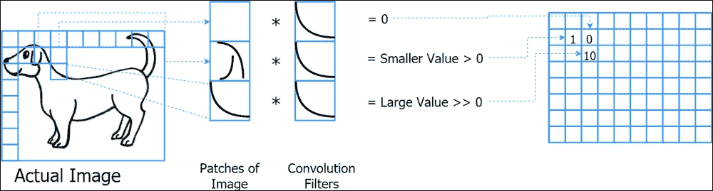

图 5.1:卷积运算对图像的影响

此外，这些卷积层可选地与汇集/子采样层交错，这降低了输入的维度。在降低维度的同时，我们使 CNN 的平移不变，并迫使 CNN 用更少的信息进行学习，从而导致模型的更好的泛化和正则化。通过将输入分成几个小块并将每个小块转换成单个元素来降低维数。例如，这种变换包括挑选面片的最大元素或平均面片中的所有值。我们将在*图 5.2* 中说明池如何使 CNN 的转换不变:

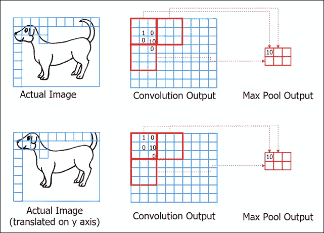

图 5.2:池操作如何帮助数据转换不变

这里，我们有的原始图像和在 *y* 轴上稍微平移的图像。我们有两幅图像的卷积输出，您可以看到值 **10** 出现在卷积输出中稍有不同的位置。但是，使用 max pooling(取每个厚方块的最大值)，我们最终可以得到相同的输出。我们将在后面详细讨论这些操作。

最后，输出被馈送到一组完全连接的层，然后这些层将输出转发到最终的分类/回归层(例如，句子/图像分类)。完全连接的层包含 CNN 的总权重的很大一部分，因为卷积层具有少量的权重。然而，已经发现，具有全连接层的 CNN 比没有全连接层的 CNN 性能更好。这可能是因为卷积图层由于尺寸较小而获取了更多的局部化要素，而完全连接的图层则提供了一幅全局图，说明如何将这些局部化要素连接在一起以生成所需的最终输出。*图 5.3* 显示了用于图像分类的典型 CNN:

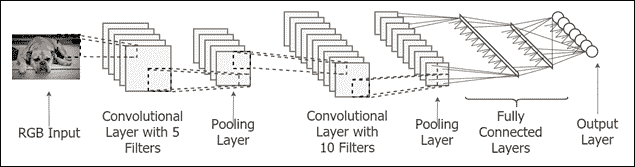

图 5.3:典型的 CNN 架构

从图中可以明显看出,通过设计，CNN 在学习过程中保留了输入的空间结构。换句话说，对于二维输入，CNN 的大部分层都是二维的，而我们只有靠近输出层的全连接层。保留空间结构允许 CNN 利用输入的有价值的空间信息，并利用较少的参数了解输入。空间信息的价值在*图 5.4* 中说明:

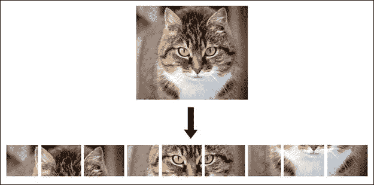

图 5.4:将图像展开成一维向量会丢失一些重要的空间信息

正如你所看到的，当一只猫的二维图像被展开为一维向量时，耳朵不再靠近眼睛，鼻子也远离眼睛。这意味着我们在展开过程中破坏了一些有用的空间信息。

## 卷积神经网络的威力

CNN 是一个非常通用的模型家族，并且在许多类型的任务中表现出卓越的性能。这种多功能性归功于 CNN 同时执行特征提取和学习的能力，从而导致更高的效率和泛化能力。让我们讨论几个 CNN 效用的例子。

在 2016 年的 **ImageNet 大规模视觉识别挑战赛** ( **ILSVRC** )中，涉及图像分类、检测对象以及在图像中定位对象，CNN 被用于实现难以置信的测试准确性。例如，对于图像分类任务，它对 1，000 个不同对象类别的测试精度约为 98%，这意味着 CNN 能够正确识别大约 980 个不同的对象。

CNN 也被用于图像分割。图像分割包括将图像分割成不同的区域。例如，在包含建筑物、道路、车辆和乘客的城市景观图像中，将道路从建筑物中分离出来是一项分割任务。此外，CNN 已经取得了令人难以置信的进步，证明了它们在句子分类、文本生成和机器翻译等 NLP 任务中的性能。


# 了解卷积神经网络

现在让我们浏览一下 CNN 的技术细节。首先，我们将讨论卷积运算，并介绍一些术语，如滤波器大小、步幅和填充。简而言之，**滤波器大小**指的是卷积运算的窗口大小，**步距**指的是卷积窗口两次移动之间的距离，**填充**指的是处理输入边界的方式。我们还将讨论一种称为反卷积或转置卷积的运算。然后我们将讨论联营业务的细节。最后，我们将讨论如何连接完全连接的层和由卷积和汇集层产生的二维输出，以及如何使用输出进行分类或回归。

## 卷积运算

在本节中，我们将详细讨论卷积运算。首先我们将讨论没有步幅和填充的卷积运算，接下来我们将描述具有步幅的卷积运算，然后我们将讨论具有填充的卷积运算。最后，我们将讨论一种叫做转置卷积的东西。对于本章中的所有运算，我们考虑从 1 开始的索引，而不是从 0 开始。

### 标准卷积运算

卷积操作是细胞神经网络的核心部分。对于尺寸为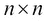的输入和的权重补丁(也称为*滤波器*),其中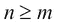，卷积运算在输入上滑动权重补丁。让我们用 *X* 表示输入，用 *W* 表示权块，用 *H* 表示输出。同样，在每个位置；输出计算如下:

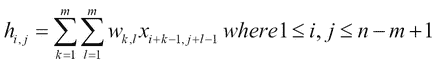

这里， *x* *[i，j]* ， *w* *[i，j]* 和 *h* *i，j* 表示 *(i，j)* *^(th) 位置处的值 *X* ， *W* 和*H*如等式所示，虽然输入大小为，但这种情况下的输出将为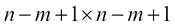。另外， *m* 也称为滤波器尺寸。让我们通过可视化来看一下(参见*图 5.5* ):***

### 注意

卷积运算产生的输出(图 5.5*顶部的矩形*)有时被称为**特征图**。

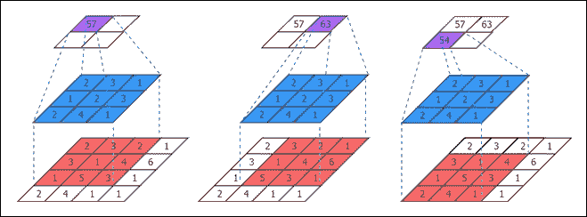

图 5.5:滤波器大小(m) = 3 跨距= 1 且无填充的卷积运算

### 昂首阔步

在前面的例子中，我们将过滤器移动了一步。然而，这不是强制性的；在卷积输入时，我们可以采取大的步骤或大步。因此，一步的大小被称为步幅。让我们修改前面的等式，以包括 *s* *[i]* 和 *s* *[j]* 步幅:

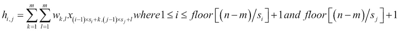

在这种情况下，随着*s*I 和*s*j 的尺寸增大，输出会变小。比较*图 5.5* ( *stride = 1* )和*图 5.6* ( *stride = 2* )说明了不同步幅的效果:

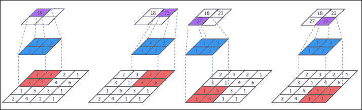

图 5.6:滤波器大小(m) = 2 跨距= 2 且无填充的卷积运算

### 注

如您所见，使用 stride 进行卷积有助于减少输入的维度，类似于池层。因此，有时使用具有步长的卷积来代替 CNN 中的汇集，因为它降低了计算复杂度。

### 用填料进行卷积

每个卷积导致的不可避免的输出大小减小(没有步长)是不希望的特性。这极大地限制了网络中的层数。此外，众所周知，较深的网络比浅的网络性能更好。这不应该与 stride 实现的维数减少混淆，因为这是一个设计选择，如果必要，我们可以决定将 stride 设为 1。因此，使用填充来规避这个问题。这是通过在输入的边界填充零来实现的，以便输出大小和输入大小相等。让我们假设步幅为 1:

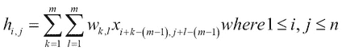

这里:

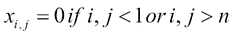

*图 5.7* 描述了填充的结果:

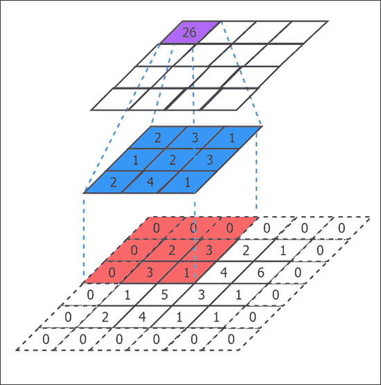

图 5.7:滤波器大小(m=3)、步距(s=1)和零填充的卷积运算

### 转置卷积

虽然卷积运算在数学上看起来很复杂，但它可以简化为矩阵乘法。出于这个原因，我们可以定义卷积运算的转置或**反卷积**，因为它有时被称为。然而，我们将使用术语**转置卷积**，因为它听起来更自然。此外，去卷积指的是不同的数学概念。转置卷积运算在细胞神经网络中起着重要的作用，用于反向传播过程中梯度的反向累积。我们来看一个例子。

对于大小为的输入和权重补丁或滤波器，其中，卷积运算在输入上滑动权重补丁。让我们用 *X* 表示输入，用 *W* 表示权值，用 *H* 表示输出。输出 *h* 可以计算为如下矩阵乘法。

为了清楚起见，我们假设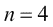和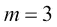，从左到右、从上到下展开输入 *X* ，结果如下:

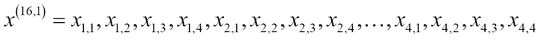

让我们从 *W* 定义一个新矩阵 *A* :

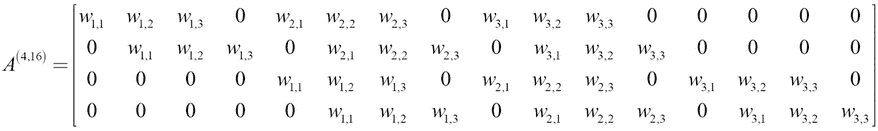

然后，如果我们执行下面的矩阵乘法，我们得到 *H* :

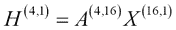

现在，通过将输出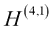整形为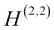，我们获得卷积输出。现在让我们将这个结果投射回 *n* 和 *m* :

通过解开到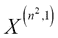的输入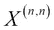，并通过从 *w* 创建一个矩阵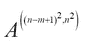，正如我们之前展示的，我们获得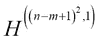，然后它将被整形为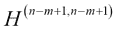。

接下来，为了获得转置卷积，我们简单地转置 *A* 并得到如下结果:

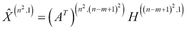

这里，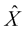是转置卷积的结果输出。

我们在这里结束关于卷积运算的讨论。我们讨论了卷积运算、步长卷积运算、填充卷积运算以及如何计算转置卷积。接下来，我们将更详细地讨论池操作。

## 汇集操作

池操作，有时被称为子采样操作，被引入 CNN 主要是为了减小中间输出的大小，以及使 CNN 的转换不变。这优于没有填充的卷积导致的自然降维，因为我们可以决定在哪里使用池层减少输出的大小，而不是每次都强制执行。在没有填充的情况下强迫维度减少将严格限制我们在 CNN 模型中可以拥有的层数。

我们在下面几节中用数学方法定义了池化操作。更准确地说，我们将讨论两种类型的池:最大池和平均池。然而，首先，我们将定义符号。对于大小为的输入和大小为的核(类似于卷积层的过滤器)，其中，卷积操作在输入上滑动权重补丁。让我们用 *x* 表示输入，用 *w* 表示权值，用 *h* 表示输出。

### 最大池

最大池操作在输入的定义的内核中挑选最大元素来产生输出。最大汇集操作移位是输入上的窗口(图 5.8 中*的中间方块)，每次取最大值。在数学上，我们将联营等式定义如下:*

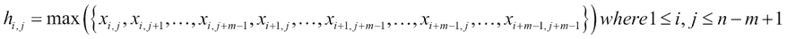

*图 5.8* 显示了该操作:

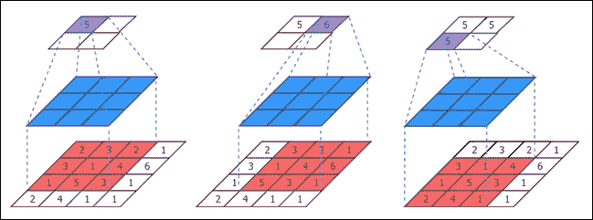

图 5.8:过滤器大小为 3、步幅为 1 且无填充的最大池操作

### 最大合并步幅

最大池与步幅的类似于卷积与步幅。下面是等式:

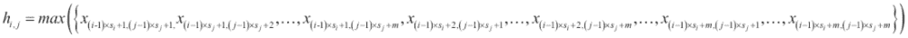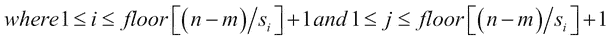

*图 5.9* 显示了结果:

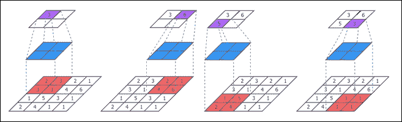

图 5.9:大小为(n=4)的输入的最大池操作，过滤器大小为(m=2)，步幅为(s=2)并且没有填充

### 平均分摊

平均池的工作方式类似于最大池，除了不是只取最大值，而是取内核中所有输入的平均值。考虑以下等式:

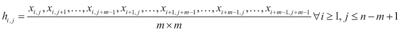

平均汇集操作如图*图 5.10* 所示:

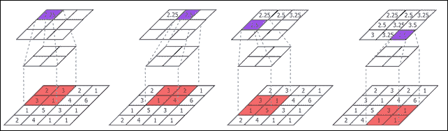

图 5.10:大小为(n=4)的输入的平均池操作，过滤器大小为(m=2)，步长为(s=1)且没有填充

## 完全连接的层

全连接图层是从输入到输出的一组全连接权重。这些完全连接的权重能够学习全局信息，因为它们从每个输入连接到每个输出。此外，拥有这种完全连接的层允许我们将完全连接的层之前的卷积层学习到的特征进行全局组合，以产生有意义的输出。

让我们定义最后一个卷积或池层的输出大小为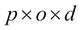，其中 *p* 是输入的高度， *o* 是输入的宽度， *d* 是输入的深度。例如，想象一个 RGB 图像，它具有固定的高度、固定的宽度和深度 3(每个 RGB 分量一个深度通道)。

然后，对于紧接在最后一个卷积或池层之后找到的初始全连接层，权重矩阵将是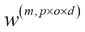，其中层输出的*高度×宽度×深度*是由该最后一层产生的输出单元的数量， *m* 是全连接层中隐藏单元的数量。然后，在推断(或预测)期间，我们将最后一个卷积/池层的输出整形为大小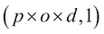，并执行以下矩阵乘法以获得 *h* :

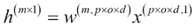

生成的完全连接的层将表现为完全连接的神经网络，其中有几个完全连接的层和一个输出层。对于分类问题，输出图层可以是 softmax 分类图层；对于回归问题，输出图层可以是线性图层。

## 把所有东西放在一起

现在我们将讨论卷积层、池层和全连接层是如何组成一个完整的 CNN 的。

如图*图 5.11* 所示，卷积、池化和完全连接层共同形成一个端到端的学习模型，该模型采用原始数据，这些数据可以是高维的(例如，RGB 图像)，并产生有意义的输出(例如，对象的类)。首先，卷积层学习图像的空间特征。较低的卷积层学习低级特征，例如图像中存在的不同方向的边缘，而较高的层学习更高级的特征，例如图像中存在的形状(例如，圆形和三角形)或对象的较大部分(例如，狗的脸、狗的尾巴和汽车的前部)。中间的池层使这些学习到的特性稍微具有平移不变性。这意味着，在新图像中，即使该特征与特征在学习图像中出现的位置相比出现了一点偏移，CNN 仍将识别该特征。最后，完全连接的层结合 CNN 学习的高级特征来产生全局表示，最终输出层将使用该全局表示来确定对象所属的类:

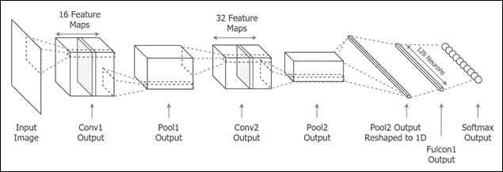

图 5.11:将卷积层、池层和全连接层组合成一个 CNN


# 练习–CNN MNIST 图片分类

这将是我们第一个使用 CNN 进行真实世界机器学习任务的例子。我们将使用 CNN 对图像进行分类。不从 NLP 任务开始的原因是，将 CNN 应用于 NLP 任务(例如，句子分类)不是很简单。使用 CNN 完成这样的任务有几个技巧。然而，最初，CNN 被设计成处理图像数据。因此，让我们从那里开始，然后找到我们的方法，看看 CNN 如何应用于 NLP 任务。

## 关于数据

在本练习中，我们将使用计算机视觉社区中众所周知的数据集:MNIST 数据集。MNIST 数据集是从 0 到 9 的手写数字的标记图像的数据库。数据集包含三个不同的子数据集:训练集、验证集和测试集。我们将在训练集上进行训练，并在未知的测试数据集上评估我们模型的性能。我们将使用验证数据集来提高模型的性能，并将其用作模型的监控机制。我们稍后将讨论细节。这是图像分类中最简单的任务之一，可以用一个简单的 CNN 很好地解决。我们将看到，我们可以达到大约 98%的测试精度，而不需要任何特殊的调整或技巧。

## 实现 CNN

在这一小节中，我们将看看 CNN tensor flow 实现中的一些重要代码片段。完整的代码可以在`ch5`文件夹的`image_classification_mnist.ipynb`中找到。首先，我们将为输入(图像)和输出(标签)定义 TensorFlow 占位符。然后，我们将定义一个全局步长，它将用于衰减学习率:

```
# Inputs and Outputs Placeholders
tf_inputs = tf.placeholder(shape=[batch_size, image_size, image_size, n_channels],dtype=tf.float32,name='tf_mnist_images')
tf_labels = tf.placeholder(shape=[batch_size, n_classes],dtype=tf.float32,name='tf_mnist_labels')

# Global step for decaying the learning rate
global_step = tf.Variable(0,trainable=False)
```

接下来，我们将定义 TensorFlow 变量，它们是卷积权重和偏差以及全连接权重。我们将在一个名为`layer_hyperparameters`的 Python 字典中定义每个卷积层的过滤器大小、步幅和填充，每个池层的内核大小、步幅和填充，以及每个全连接层的输出单元数量:

```
# Initializing the variables
layer_weights = {}
layer_biases = {}
for layer_id in cnn_layer_ids:
    if 'pool' not in layer_id:
        layer_weights[layer_id] = 
tf.Variable(initial_value=tf.random_normal(shape=layer_hyperparameters[layer_id]['weight_shape'],
stddev=0.02,dtype=tf.float32),name=layer_id+'_weights')
layer_biases[layer_id] = tf.Variable(initial_value=tf.random_normal(shape=[layer_hyperparameters[layer_id]['weight_shape'][-1]], stddev=0.01,dtype=tf.float32), name=layer_id+'_bias')
```

我们还将定义 logit 计算。**逻辑值**是应用 softmax 激活前输出层的值。为了计算这个，我们将遍历每一层。

对于每个卷积层，我们将使用以下公式对输入进行卷积:

```
h = tf.nn.conv2d(h,layer_weights[layer_id],layer_hyperparameters[layer_id]['stride'],
layer_hyperparameters[layer_id]['padding']) + layer_biases[layer_id]
```

这里，`tf.nn.conv2d`的输入`h`在第一次卷积中被替换为`tf_inputs`。记得我们在[第二章](ch02.html "Chapter 2. Understanding TensorFlow")、*理解 TensorFlow*中详细讨论了我们反馈给`tf.nn.conv2d`的每个参数。但是，我们将简要回顾一下`tf.nn.conv2d`的论点。另外，`tf.nn.conv2d(input, filter, strides, padding)`按顺序接受以下参数值:

*   `input`:这是卷积的输入，形状为`[batch size, input height, input width, input depth]`
*   `filter`:这是我们对输入进行卷积的卷积滤波器，其形状为`[filter height, filter width, input depth, output depth]`
*   `strides`:表示输入的每个维度上的步幅，形状为`[batch stride, height stride, width stride, depth stride]`
*   `padding`:表示填充的类型(可以是`'SAME'`或`'VALID'`

我们还应用如下的非线性激活:

```
h = tf.nn.relu(h)
```

然后，对于每个池层，我们使用以下内容对输入进行二次抽样:

```
h = tf.nn.max_pool(h, layer_hyperparameters[layer_id]['kernel_shape'],layer_hyperparameters[layer_id]['stride'],
layer_hyperparameters[layer_id]['padding'])
```

`tf.nn.max_pool(input, ksize, strides, padding)`函数按顺序接受以下参数:

*   `input`:这是子样本的输入，形状为`[batch size, input height, input width, input depth]`
*   `ksize`:这是最大池操作`[batch kernel size, height kernel size, width kernel size, depth kernel size]`的每个维度上的内核大小
*   `strides`:这是输入的每个维度上的步幅`[batch stride, height stride, width stride, depth stride]`
*   `padding`:可以是`'SAME'`或`'VALID'`

接下来，对于第一个完全连接的层，我们对输出进行整形:

```
h = tf.reshape(h,[batch_size,-1])
```

然后，我们将执行权重乘法和偏置加法，随后是非线性激活:

```
h = tf.matmul(h,layer_weights[layer_id]) + layer_biases[layer_id]
h = tf.nn.relu(h)
```

现在，我们可以计算逻辑:

```
h = tf.matmul(h,layer_weights[layer_id]) + layer_biases[layer_id]
```

我们将把`h`的最后一个值(最后一层的输出)分配给`tf_logits`,如下所示:

```
tf_logits = h
```

接下来，我们将定义 softmax 交叉熵损失，这是监督分类任务的常用损失函数:

```
tf_loss = tf.nn.softmax_cross_entropy_with_logits_v2(logits=tf_logits,labels=tf_labels)
```

我们还需要定义一个学习率，每当验证精度在预定义的历元数内没有增加时，我们将学习率降低一个因子`0.5`(一个历元是对整个数据集的一次遍历)。这被称为**学习率衰减**:

```
tf_learning_rate = tf.train.exponential_decay(learning_rate=0.001,global_step=global_step,decay_rate=0.5,decay_steps=1,staircase=True)
```

接下来，我们将使用称为`RMSPropOptimizer`的优化器来定义损失最小化，该优化器已被发现比传统的**随机梯度下降** ( **SGD** )性能更好，尤其是在计算视觉中:

```
tf_loss_minimize = tf.train.RMSPropOptimizer(learning_rate=tf_learning_rate, momentum=0.9).minimize(tf_loss)
```

最后，为了通过将预测标签与实际标签进行比较来计算预测的准确性，我们将定义以下预测计算函数:

```
tf_predictions = tf.nn.softmax(tf_logits)
```

您刚刚学习完我们用来创建第一个 CNN 的函数。您学习了使用函数来实现 CNN 结构以及定义损耗，最小化损耗，并获得对未知数据的预测。我们使用了一个简单的 CNN 来看看它是否可以学习对手写图像进行分类。同样，我们能够用一个相当简单的 CNN 达到 98%以上的准确率。接下来我们将分析 CNN 的一些结果。我们将看到为什么 CNN 不能正确识别一些图像。

## 分析 CNN 产生的预测

这里我们可以随机从测试集中挑选一些正确和错误分类的样本来评估 CNN 的学习能力(见*图 5.12* )。我们可以看到，对于正确分类的实例，CNN 对输出非常有信心，这可以被视为学习算法的一个良好属性。然而，当我们评估错误分类的示例时，我们可以看到它们实际上很难，甚至一个人也可能弄错其中的一些(例如，第二行中左起第三幅图像)。对于不正确的样本，CNN 通常不像对于正确的样本那样有信心，这也是一个好的特性。此外，即使最高置信度的答案对于错误分类的答案是错误的，正确的标签通常也不会被完全忽略，而是在预测值方面得到一些认可:

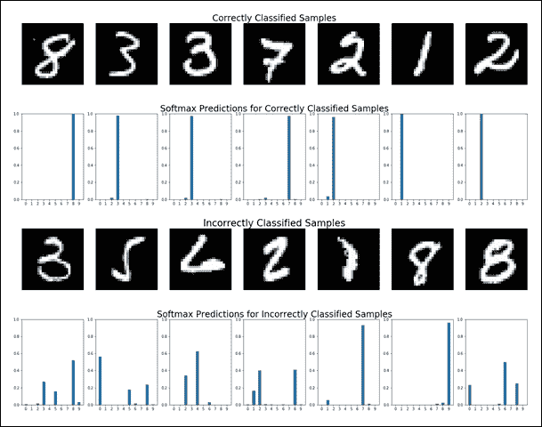

图 5.12: MNIST 正确分类和错误分类的实例


# 使用 CNN 进行句子分类

尽管细胞神经网络主要用于计算机视觉任务，但没有什么能阻止它们在自然语言处理应用中的使用。CNN 被有效使用的一个应用是句子分类。

在句子分类中，一个给定的句子应该被分类到一个类中。我们将使用一个问题数据库，其中每个问题都标有问题的内容。例如，问题“谁是亚伯拉罕·林肯？”将是一个问题，其标签将是*人*。为此，我们将使用 http://cogcomp.org/Data/QA/QC/[的句子分类数据集；在这里你会发现 1000 个训练句子和它们各自的标签，以及 500 个测试句子。](http://cogcomp.org/Data/QA/QC/)

我们将使用 Yoon Kim 在论文中介绍的 CNN 网络，*用于句子分类的卷积神经网络*，来理解 CNN 对于 NLP 任务的价值。然而，使用 CNN 进行句子分类与我们讨论的 MNIST 的例子有些不同，因为操作(例如，卷积和合并)现在发生在一维而不是二维。此外，正如我们将很快看到的，汇集操作也将与正常的汇集操作有某些不同。您可以在`ch5`文件夹中的`cnn_sentence_classification.ipynb`文件中找到这个练习的代码。

## CNN 结构

现在我们将讨论用于句子分类的 CNN 的技术细节。首先，我们将讨论如何将数据或句子转换成 CNN 可以轻松处理的首选格式。接下来，我们将讨论卷积和池运算如何适用于句子分类，最后，我们将讨论所有这些成分是如何连接的。

### 数据转换

让我们假设一个句的 *p* 字。首先我们会用一些特殊的词来填充句子(如果句子长度是< *n* )来设置句子长度为 *n* 个词，其中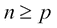。接下来，我们将通过大小为 *k* 的向量来表示句子中的每个单词，其中该向量可以是 one-hot-encoded 表示，也可以是使用 skip-gram、CBOW 或 GloVe 学习的 Word2vec 单词向量。那么一批大小为 *b* 的句子可以用一个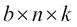矩阵来表示。

让我们看一个例子。我们来考虑以下三句话:

*   鲍勃和玛丽是朋友。
*   鲍勃踢足球。
*   玛丽喜欢在唱诗班唱歌。

在这个例子中，第三句话的字数最多，所以我们设置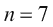，这是第三句话的字数。接下来，让我们看看每个单词的一位热编码表示。在这种情况下，有 13 个不同的单词。因此，我们得到这个:

鲍勃:1，0，0，0，0，0，0，0，0，0，0，0，0

*和:0，1，0，0，0，0，0，0，0，0，0，0*

玛丽:0，0，1，0，0，0，0，0，0，0，0，0，0

同样，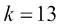出于同样的原因。有了这个表示，我们可以把三个句子表示成一个大小为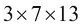的三维矩阵，如图*图 5.13* 所示:

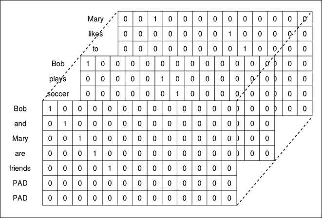

图 5.13:句子矩阵

### 卷积运算

如果忽略批量大小，也就是说如果我们假设我们一次只处理一个单句，我们的数据就是一个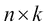矩阵，其中 *n* 是填充后每句话的字数， *k* 是单个单词向量的维数。在我们的例子中，这将是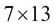。

现在我们将定义卷积权重矩阵的大小为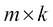，其中 *m* 是一维卷积运算的滤波器大小。通过将大小为的输入 *x* 与大小为的权重矩阵 *W* 进行卷积，我们将产生大小为的输出 *h* ，如下所示:


这里， *w [i，j]是 *W* 的第 *(i，j)*个元素，我们将用零填充 *x* ，这样 *h* 的大小就是。此外，我们将更简单地定义此操作，如下所示:*


这里， *** 定义了卷积运算(带填充)，我们将添加一个额外的标量偏移 *b* 。*图 5.14* 说明了该操作:


图 5.14:句子分类的卷积运算

然后，为了学习一组丰富的特性，我们有不同卷积滤波器大小的平行层。每个卷积层输出一个大小为的隐藏向量，我们将连接这些输出以形成下一个大小为的层的输入，其中 *q* 是我们将使用的并行层数。 *q* 越大，模型性能越好。

卷积的价值可以通过以下方式来理解。思考电影分级学习问题(有两个类，正面或负面)，我们有以下句子:

*   我喜欢这部电影，还不错
*   *我不喜欢这部电影，不好*

现在想象一个大小为 5 的卷积窗。让我们根据卷积窗的移动来对单词进行分类。

句子*我喜欢这部电影，不太坏*给出:

*【我，喜欢，电影，’，’】*

*【喜欢，那个，电影，‘，‘，不是】*

*【那个，电影，‘，’，不也是】*

*【电影，‘，‘，不算太差】*

句子*我不喜欢这部电影，不好的*给出如下:

*【我，做了，不，喜欢了】*

*【有，没有，喜欢，电影】*

*【不是，喜欢，电影，’，’】*

*【喜欢，那个，电影，‘，’，坏】*

对于第一句，如下所示的窗口表示评级为正面:

*【我，喜欢，电影，’，’】*

*【电影，‘，‘，不算太差】*

但是，对于第二句话，如下所示的窗口传达了评级中的负面信息:

*【做了，不喜欢，电影】*

由于保留了空间性，我们能够看到有助于分级的模式。例如，如果您使用像*单词袋*这样的技术来计算丢失空间信息的句子表示，句子表示将高度相似。卷积运算在保持句子的空间信息方面起着重要的作用。

由于不同的层具有不同的过滤器尺寸，网络学习用不同尺寸的短语提取评级，导致性能的提高。

## 一段时间内的汇集

汇集操作旨在对之前讨论的并行卷积层产生的输出进行二次采样。这是通过以下方式实现的。

假设最后一层 *h* 的输出大小为。随时间的汇集层将产生大小为输出的输出*h’*。精确的计算如下:


这里，和 *h* *(i)* 是由卷积层产生的输出，是属于该层的一组权重。简而言之，随时间汇集操作通过连接每个卷积图层的最大元素来创建向量。我们将在*图 5.15* 中说明该操作:


图 5.15:句子分类的随时间汇集操作

通过组合这些操作，我们最终得到了*图 5.16* 所示的架构:


5.16:句子分类 CNN 架构

## 实现–使用 CNN 进行句子分类

首先，我们将定义输入和输出。输入将是一批句子，其中的单词由一位热编码的单词向量表示——词嵌入将比一位热编码的表示提供更好的性能；然而，为了简单起见，我们将使用一个热编码的表示:

```
sent_inputs = tf.placeholder(shape=[batch_size,sent_length,vocabulary_size],dtype=tf.float32,name='sentence_inputs')
sent_labels = tf.placeholder(shape=[batch_size,num_classes],dtype=tf.float32,name='sentence_labels')
```

这里，我们将定义三个不同的一维卷积层，它们具有三种不同的滤波器尺寸`3`、`5`和`7`(在`filter_sizes`中以列表形式提供)以及它们各自的偏差:

```
w1 = tf.Variable(tf.truncated_normal([filter_sizes[0],vocabulary_size,1],stddev=0.02,dtype=tf.float32),name='weights_1')
b1 = tf.Variable(tf.random_uniform([1],0,0.01,dtype=tf.float32),name='bias_1')

w2 = tf.Variable(tf.truncated_normal([filter_sizes[1],vocabulary_size,1],stddev=0.02,dtype=tf.float32),name='weights_2')
b2 = tf.Variable(tf.random_uniform([1],0,0.01,dtype=tf.float32),name='bias_2')

w3 = tf.Variable(tf.truncated_normal([filter_sizes[2],vocabulary_size,1],stddev=0.02,dtype=tf.float32),name='weights_3')
b3 = tf.Variable(tf.random_uniform([1],0,0.01,dtype=tf.float32),name='bias_3')
```

现在，我们将计算三个输出，每个输出都属于一个卷积层，正如我们刚刚定义的那样。这可以用 TensorFlow 中提供的`tf.nn.conv1d`函数很容易地计算出来。我们使用步长`1`和零填充来确保输出与输入具有相同的大小:

```
h1_1 = tf.nn.relu(tf.nn.conv1d(sent_inputs,w1,stride=1,padding='SAME') + b1)
h1_2 = tf.nn.relu(tf.nn.conv1d(sent_inputs,w2,stride=1,padding='SAME') + b2)
h1_3 = tf.nn.relu(tf.nn.conv1d(sent_inputs,w3,stride=1,padding='SAME') + b3)
```

为了随时间计算 max pooling，我们需要在 TensorFlow 中编写基本函数来完成这项工作，因为 TensorFlow 没有为我们完成这项工作的原生函数。然而，编写这些函数是相当容易的。

首先，我们将计算每个卷积层产生的每个隐藏输出的最大值。这导致每个层只有一个标量:

```
h2_1 = tf.reduce_max(h1_1,axis=1)
h2_2 = tf.reduce_max(h1_2,axis=1)
h2_3 = tf.reduce_max(h1_3,axis=1)
```

然后，我们将连接轴`1`(宽度)上产生的输出，以产生大小为的输出:

```
h2 = tf.concat([h2_1,h2_2,h2_3],axis=1)
```

接下来，我们将定义完全连接的层，这些层将完全连接到由随时间池化层产生的输出。在这种情况下，只有一个完全连接的层，这也将是我们的输出层:

```
w_fc1 = tf.Variable(tf.truncated_normal([len(filter_sizes),num_classes],stddev=0.5,dtype=tf.float32),name='weights_fulcon_1')
b_fc1 = tf.Variable(tf.random_uniform([num_classes],0,0.01,dtype=tf.float32),name='bias_fulcon_1')
```

此处定义的函数将产生用于计算网络损耗的逻辑值:

```
logits = tf.matmul(h2,w_fc1) + b_fc1
```

这里，通过将 softmax 激活应用于逻辑，我们将获得预测:

```
predictions = tf.argmax(tf.nn.softmax(logits),axis=1)
```

此外，我们将定义`loss`函数，它是交叉熵损失:

```
loss = tf.reduce_mean(tf.nn.softmax_cross_entropy_with_logits_v2(labels=sent_labels,logits=logits))
```

为了优化网络，我们将使用名为`MomentumOptimizer`的 TensorFlow 内置优化器:

```
optimizer = tf.train.MomentumOptimizer(learning_rate=0.01,momentum=0.9).minimize(loss)
```

运行这些前面定义的操作来优化 CNN 并评估练习中给出的测试数据，在这个句子分类任务中给我们提供了接近 90%的测试准确度(500 个测试句子)。

这里我们结束关于使用 CNN 进行句子分类的讨论。我们首先讨论了如何将一维卷积运算与一种称为*随时间池化*的特殊池化运算相结合，来实现基于 CNN 架构的句子分类器。最后，我们讨论了如何使用 TensorFlow 来实现这样的 CNN，并看到它实际上在句子分类中表现良好。

知道我们刚刚解决的问题如何在现实世界中有用是很有用的。假设你手里有一大份关于罗马历史的文件，你想在不阅读整份文件的情况下了解朱利叶斯·凯撒。在这种情况下，我们刚刚实现的句子分类器可以作为一个方便的工具，用来总结只对应于一个人的句子，所以你不必阅读整个文档。

句子分类也可以用于许多其他任务；这种方法的一个常见用途是将电影评论分为正面或负面，这对自动计算电影评级很有用。句子分类的另一个重要应用可以在医学领域看到，它是从包含大量文本的大型文档中提取临床上有用的句子。


# 总结

在这一章中，我们讨论了 CNN 及其各种应用。首先，我们详细解释了什么是 CNN，以及它们在机器学习任务中表现出色的能力。接下来，我们将 CNN 分解成几个部分，比如卷积层和池层，并详细讨论了这些操作符是如何工作的。此外，我们讨论了与这些操作符相关的几个超参数，如过滤器大小、步幅和填充。然后，为了说明 CNN 的功能，我们通过一个简单的例子将手写数字图像分类到相应的图像。我们也做了一点分析，看看为什么 CNN 不能正确识别一些图像。最后，我们开始讨论 CNN 如何应用于 NLP 任务。具体地说，我们讨论了一种可以用来对句子进行分类的改变的 CNN 结构。然后，我们实现了这个特定的 CNN 架构，并在一个实际的句子分类任务上对其进行了测试。

在下一章中，我们将继续讨论用于许多 NLP 任务的最流行的神经网络类型之一— **循环神经网络** ( **RNNs** )。