<title>Chapter 6. Recurrent Neural Networks</title>   

# 第六章。递归神经网络

**递归神经网络** ( **RNNs** ) 是一种特殊的神经网络家族，旨在处理序列数据(即时间序列数据)，如文本序列(例如，可变长度句子或文档)或股票市场价格。rnn 维护一个状态变量，该变量捕获序列数据中存在的各种模式；因此，他们能够对顺序数据进行建模。例如，传统的前馈神经网络不具有这种能力，除非数据用捕获序列中存在的重要模式的特征表示来表示。然而，提出这样的要素制图表达极其困难。前馈模型模拟顺序数据的另一种替代方法是为时间/序列中的每个位置设置单独的一组参数。以便分配给某一位置的参数集了解在该位置出现的模式。这将大大增加模型的内存需求。

然而，与像前馈网络那样对每个位置有单独的一组参数不同，rnn 随着时间的推移共享相同的一组参数。随时间共享参数是 RNNs 的重要部分，事实上是学习时间模式的主要使能因素之一。然后，对于我们在序列中观察到的每个输入，状态变量随时间更新。给定序列的先前观察值，这些随时间共享的参数与状态向量结合，能够预测序列的下一个值。此外，由于我们一次处理一个序列的单个元素(例如，一次处理文档中的一个单词)，RNNs 可以处理任意长度的数据，而无需用特殊的标记填充数据。

在这一章中，我们将深入研究 RNNs 的细节。首先，我们将从一个简单的前馈模型开始讨论如何形成 RNN。之后，我们将讨论 RNN 的基本功能。我们还将深入研究基本方程，如 RNNs 的输出计算和参数更新规则，并讨论 RNNs 应用的几种变体:一对一、一对多和多对多 RNNs。我们将浏览一个使用 RNNs 基于训练数据集合生成新文本的例子，还将讨论 RNNs 的一些局限性。在计算和评估生成的文本后，我们将讨论 RNNs 的更好的扩展，称为 RNN-CF，与传统的 RNNs 相比，它能记住更长的时间。

# 了解递归神经网络

在这一节中，我们将从简单的介绍开始讨论什么是 RNN，然后继续讨论更深入的技术细节。我们之前提到过，RNNs 维护一个状态变量，随着 RNN 看到更多的数据，该变量会随着时间的推移而演变，因此可以对顺序数据进行建模。特别地，该状态变量通过一组循环连接随时间更新。循环连接的存在是 RNN 和前馈网络之间的主要结构差异。这种反复出现的联系可以理解为 RNN 在过去学到的一系列记忆之间的联系，连接到 RNN 的当前状态变量。换句话说，循环连接相对于 RNN 具有的过去记忆更新当前状态变量，使得 RNN 能够基于当前输入以及先前输入进行预测。

在接下来的部分，我们将讨论以下内容。首先，我们将讨论如何从将前馈网络表示为计算图开始。然后，我们将通过一个例子来了解为什么前馈网络可能在顺序任务中失败。然后，我们将调整前馈图以模拟顺序数据，这将为我们提供 RNN 的基本计算图。我们还将讨论 RNN 的技术细节(例如，更新规则)。最后，我们将讨论如何训练 RNN 模型的细节。

## 前馈神经网络的问题

为了理解前馈神经网络的局限性以及 rnn 如何解决它们，让我们想象一个数据序列:

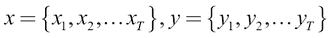

接下来，让我们假设，在现实世界中， *x* 和 *y* 按照以下关系链接:

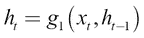

这里，*g[1]T10、*g[2]是一些函数。这意味着对于属于输出 *x* 和 *y* 的模型的某些状态，当前输出*y*t*t*取决于当前状态*h*T21【t*。同样，*h[t]是用当前输入*x[t]和先前状态*h[t-1]计算的。状态对模型在历史中观察到的关于先前输入的信息进行编码。****

现在，让我们想象一个简单的前馈神经网络，我们用下面的公式来表示:

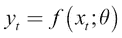

这里，*y[t]是某个输入*x[t]的预测输出。**

如果我们使用前馈神经网络来解决这个任务，该网络将不得不通过将作为输入来一次产生一个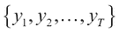。现在，让我们考虑我们在这个时间序列问题的解决方案中所面临的问题。

前馈神经网络在时间 *t* 的预测输出*y[t]T5 只取决于当前输入 *x [t]* 。换句话说，它不知道导致 *x [t]* (即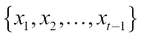)的输入。由于这个原因，前馈神经网络将在任务中失败，其中当前输出不仅取决于当前输入，还取决于先前的输入。我们通过一个例子来理解这一点。*

假设我们需要训练一个神经网络来填充缺失的单词。我们有下面的短语，我们想预测下一个单词:

詹姆斯有一只猫，它喜欢喝酒。

如果我们一次处理一个单词，并使用前馈神经网络，我们将只有输入*饮料*，这根本不足以理解短语，甚至不足以理解上下文(单词*饮料*可以出现在许多不同的上下文中)。有人可能会说，我们可以通过一次性处理完整的句子来获得良好的结果。即使这是真的，这种方法也有局限性，例如对于非常长的句子，它很快就变得不切实际。

## 用递归神经网络建模

另一方面，我们可以使用 RNN 来解决这个问题。我们将从现有的数据开始:

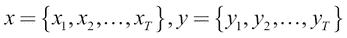

假设我们有以下关系:

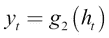

现在，让我们用一个以θ为参数的函数逼近器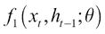来代替*g[1]，该函数逼近器将当前输入*x[t]和系统的前一状态*h[t-1]作为输入，并产生当前状态*h[t]。然后我们将*g[2]替换为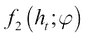，取系统当前状态*h[t]产生*y[t]。这为我们提供了以下信息:*******

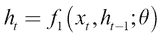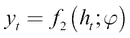

我们可以把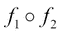看作是生成 *x* 和 *y* 的真实模型的近似。为了更清楚地理解这一点，现在让我们将等式展开如下:

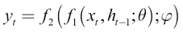

例如，我们可以将*y[4]表示如下:*

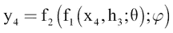

同样，通过展开，我们得到以下结果(为清楚起见，省略θ和φ):

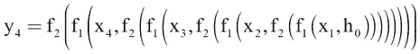

这可以用图表来说明，如图*图 6.1* 所示:

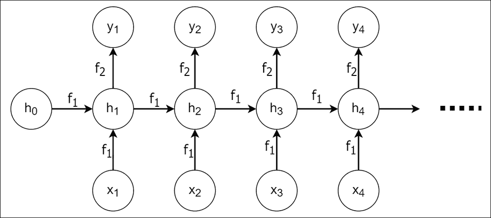

图 6.1:*x[t]与*y[t]的关系展开**

对于任何给定的时间步长 *t* ，我们可以概括出该图，如图*图 6.2* 所示:

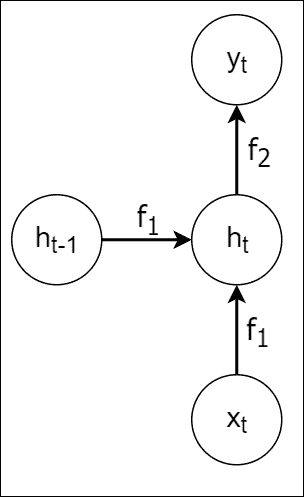

图 6.2:RNN 结构的单步计算

不过要明白的是 *h [t-1]* 其实就是 *h [t]* 在收到 *x [t]* 之前的样子。换句话说， *h [t-1]* 是前一个时间步的 *h [t]* 。因此，我们可以用一个递归连接来表示 *h [t]* 的计算，如图*图 6.3* 所示:

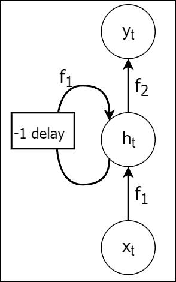

图 6.3:具有循环连接的 RNN 的单步计算

像在*图 6.3* 中那样总结一系列映射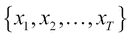到的方程的能力允许我们根据 *x [ t ]* 、 *h [ t-1 ]* 和 *h [ t ]* 写出任何*yt。这是 RNN 背后的关键思想。*

## 递归神经网络的技术描述

现在让我们更仔细地看看 RNN 是由什么构成的，并定义在 RNN 中进行计算的数学方程。让我们从我们作为从*x[t]学习*y[t]的函数逼近器导出的两个函数开始:**

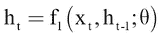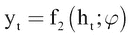

正如我们已经看到的，神经网络是由一组权重和偏差以及一些非线性的激活函数组成的。因此，我们可以将前面的关系写成如下所示:

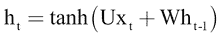

这里， *tanh* 是 tanh 激活函数， *U* 是大小为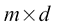的权重矩阵，其中 *m* 是隐藏单元的数量， *d* 是输入的维数。另外， *W* 是一个大小为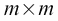的权重矩阵，它创建了从*h[t-1]到*h[t]的循环链接。*y[t]的关系由以下等式给出:***

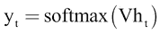

这里， *V* 是大小为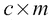的权重矩阵， *c* 是输出的维数(可以是输出类的数量)。在*图 6.4* 中，我们展示了这些重量如何形成 RNN:

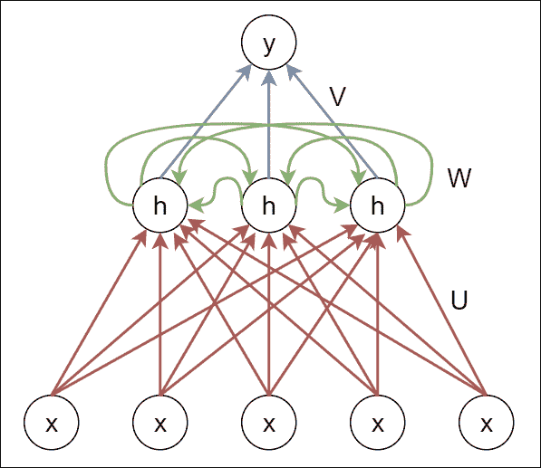

图 6.4:RNN 的结构

到目前为止，我们已经看到了如何用计算节点图来表示 RNN，边表示计算。此外，我们还研究了 RNN 背后的实际数学。现在，我们来看看如何优化(或训练)RNN 的权重，以便从序列数据中学习。

<title>Backpropagation Through Time</title>   

# 穿越时间的反向传播

为了训练 RNNs，使用了一种特殊形式的反向传播，称为**穿越时间的反向传播** ( **BPTT** )。然而，为了理解 BPTT，我们首先需要了解**反向传播** ( **BP** )是如何工作的。然后我们将讨论为什么 BP 不能直接应用于 RNNs，而是 BP 如何适应 RNNs，从而产生 BPTT。最后，我们将讨论 BPTT 存在的两个主要问题。

## 反向传播如何工作

反向传播是用于训练前馈神经网络的技术。在反向传播中，您需要执行以下操作:

1.  计算给定输入的预测
2.  通过与输入的实际标签进行比较，计算预测的误差 *E* (例如，均方误差和交叉熵损失)
3.  通过对所有*w[ij]沿梯度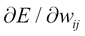的相反方向迈出一小步，更新前馈网络的权重，以最小化步骤 2 中计算的损失，其中*w[ij]T21 是第 *j ^第层 *i ^第层*层的权重***

为了更清楚地理解，考虑图 6.5 中*所示的前馈网络。这个有两个单权重，*w*1*和*w*2，计算两个输出， *h* 和 *y* ，如下图所示。为简单起见，我们假设模型中没有非线性:

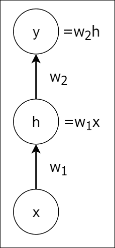

图 6.5:前馈网络的计算

我们可以使用链式法则计算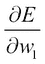如下:

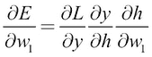

这简化为以下内容:

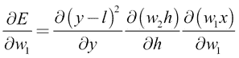

这里， *l* 是数据点 *x* 的正确标签。此外，我们假设均方误差为损失函数。这里一切都定义好了，计算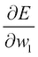也挺直接的。

## 为什么我们不能将 BP 直接用于 RNNs

现在，让我们试试图 6.6 中的 RNN。现在我们有了一个额外的循环权重*w[3]。为了使我们试图强调的问题更加清楚，我们省略了输入和输出的时间成分:*

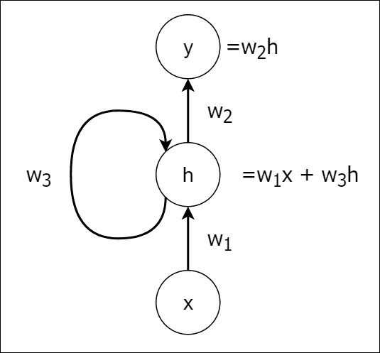

图 6.6:RNN 的计算

让我们看看如果我们应用链式法则来计算会发生什么:

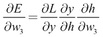

这变成了以下内容:

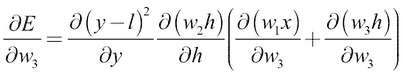

这里的术语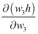产生了问题，因为它是一个递归术语。你最终会得到无限多的导数项，因为 *h* 是递归的(也就是说，计算 *h* 包括 *h* 本身)，而 *h* 不是一个常数，并且依赖于*w[3]。这是通过随时间展开输入序列 *x* 来解决的，为每个输入创建 RNN 副本*x[t]并分别计算每个副本的导数，并通过对梯度求和将它们滚回以计算权重更新。我们接下来将讨论细节。**

## 通过时间反向传播-训练 rnn

计算 RNNs 反向传播的技巧是不考虑单个输入，而是考虑整个输入序列。然后，如果我们在时间步骤 4 计算，我们将得到以下结果:

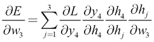

这意味着我们需要计算所有时间步长的梯度之和，直到第四个时间步长。换句话说，我们将首先展开序列，以便我们可以为每个时间步长 *j* 计算和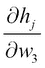。这通过创建 RNN 的四个副本来完成。所以，要计算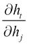，我们需要 *t-j+1* 份 RNN。然后，我们将这些副本汇总到一个 RNN，通过对所有先前时间步骤的梯度求和来获得梯度，并用梯度更新 RNN 。但是，随着时间步长的增加，这种方法的成本会变得很高。为了更高的计算效率，我们可以使用时间截断反向传播来优化递归模型，这是 BPTT 的一种近似。

## 截断 BPTT–有效训练 rnn

在 TBPTT 中，我们仅计算固定数量的 *T* 时间步长的梯度(与在 BPTT 中计算序列的最开始相比)。更具体地说，在计算时，对于时间步长 *t* ，我们只计算到 *t-T* 的导数(也就是说，我们不计算到最开始的导数):

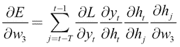

这比标准 BPTT 的计算效率要高得多。在标准 BPTT 中，对于每个时间步 *t* ，我们计算导数，直到序列的最开始。但是随着序列长度变得越来越大，这在计算上变得不可行(例如，逐字处理文本文档)。然而，在截断 BPTT 中，我们只计算向后固定步数的导数，可以想象，计算成本不会随着序列变大而改变。

## BPTT 的局限性——消失和爆炸渐变

拥有一种方法来计算递归权重的梯度，并拥有一种计算高效的近似，例如 TBPTT，并不能使我们毫无困难地训练 rnn。计算中可能会出现其他问题。

为了了解原因，让我们展开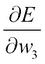中的一个术语，如下所示:

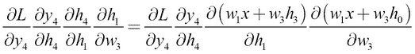

因为我们知道反向传播的问题是由循环连接引起的，所以让我们忽略 *w [1] x* 项，考虑以下情况:

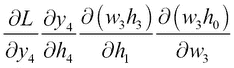

通过简单地展开 *h3* 并进行简单的算术运算，我们可以证明这一点:

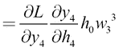

我们看到，对于仅仅四个时间步长，我们有一个术语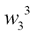。所以在第 *n* 个时间步，它会变成，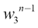。假设我们在 *n=100* 时间步长将*w[3]初始化为非常小(比如 0.00001)，则梯度将无限小(比例为 0.1500)。此外，由于计算机在表示数字时精度有限，因此这种更新将被忽略(即算术下溢)。这就是所谓的**消失渐变**。求解消失梯度不是很简单。没有简单的方法来重新调整梯度，以便它们能够随时间正确传播。在某种程度上解决消失梯度问题的少数技术是使用仔细的权重初始化(例如，Xavier 初始化)或使用基于动量的优化方法(即，除了当前梯度更新之外，我们添加一个附加项，它是所有过去梯度的累积，称为**速度项**。然而，解决这个问题的更原则性的方法已经被引入，比如对标准 RNN 的不同结构修改，正如我们将在[第 7 章](ch07.html "Chapter 7. Long Short-Term Memory Networks")、*长短期记忆网络*中看到的。*

另一方面，假设我们将*w[3]初始化得很大(比如 1000.00)。然后在 *n=100* 时间步，梯度将是巨大的(比例为 10 ^(300) )。这会导致数值不稳定，在 Python 中你会得到像`Inf`或`NaN`这样的值(也就是说，不是一个数字)。这被称为**爆炸梯度**。*

由于问题损失面的复杂性，梯度爆炸也可能发生。由于输入的维数以及模型中存在的大量参数(权重),复杂的非凸损失表面在深度神经网络中非常常见。*图 6.7* 展示了 RNN 的损失面，并强调了曲率非常高的墙壁的存在。如果优化方法接触到这样的墙，那么梯度将爆炸或过冲，如图中的实线所示。这可能导致非常差的损耗最小化或数值不稳定，或者两者都有。在这种情况下，避免梯度爆炸的一个简单解决方案是当梯度大于某个阈值时，将梯度修剪到一个合理的小值。图中的虚线显示了当我们在某个小值处剪切梯度时会发生什么。(关于训练递归神经网络的难度*的论文*、*帕斯卡努*、*米科洛夫*、*本吉奥*、*机器学习国际会议(2013): 1310-1318* 。)

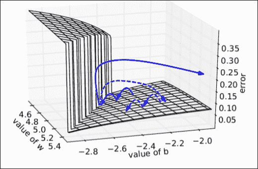

图 6.7:梯度爆炸现象来源:该图来自 Pascanu、Mikolov 和 Bengio 关于训练递归神经网络的难度的论文

接下来，我们将讨论使用 RNNs 解决应用的各种方法。这些应用包括句子分类、图像字幕和机器翻译。我们将把 rnn 分成几个不同的类别，例如一对一、一对多、多对一和多对多。

<title>Applications of RNNs</title>   

# 无线神经网络的应用

到目前为止，我们所谈论的是一对一映射的 RNN，其中当前输出取决于当前输入以及先前观察到的输入历史。这意味着先前观察到的输入序列和当前输入存在一个输出。然而，在现实世界中，可能存在这样的情况，其中对于一个输入序列只有一个输出，对于单个输入有一个输出序列，对于一个输入序列有一个输出序列，其中序列大小是不同的。在本节中，我们将看看一些这样的应用。

## 一对一 RNNs

在一对一 RNNs 中，当前输入取决于之前观察到的输入(参见*图 6.8* )。这种 rnn 适用于每个输入都有一个输出，但输出取决于当前输入和导致当前输入的输入的历史的问题。这种任务的一个例子是股票市场预测，我们为当前输入输出一个值，这个输出也依赖于先前输入的行为。另一个例子是场景分类，其中图像中的每个像素都被标记(例如，诸如汽车、道路和人的标签)。有时候*x[t+1]在某些问题上可以和*y[t]相同。例如，在文本生成问题中，先前预测的单词成为预测下一个单词的输入。下图描述了一对一的 RNN:**

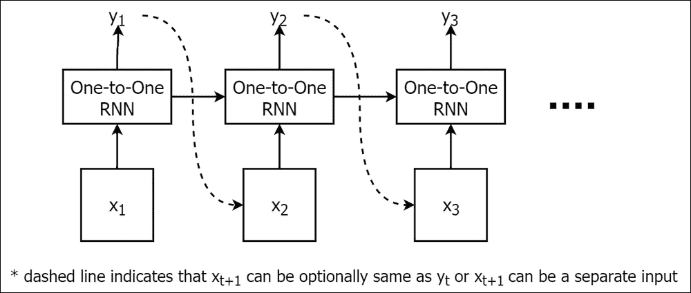

图 6.8:具有时间依赖性的一对一 RNNs

## 一对多 rnn

一对多 RNN 将接受单个输入并输出一个序列(参见*图 6.9* )。这里，我们假设输入是相互独立的。也就是说，我们不需要关于先前输入的信息来做出关于当前输入的预测。然而，循环连接是必需的，因为尽管我们处理单个输入，但输出是依赖于先前输出值的一系列值。使用这种 RNN 的一个示例任务是图像字幕任务。例如，对于给定的输入图像，文本标题可以由五个或十个单词组成。换句话说，RNN 将继续预测单词，直到它输出一个描述图像的有意义的短语。下图描绘了一对多 RNN:

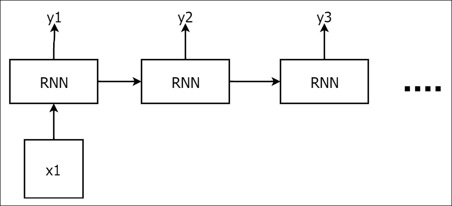

图 6.9。一对多 RNN

## 多对一 RNNs

多对一 RNNs 将任意长度的输入作为一个输入，并为输入序列产生一个输出(见*图 6.10* )。句子分类就是这样一个任务，它可以从多对一 RNN 中受益。一个句子是一个任意长度的单词序列，它被作为网络的输入，用于产生一个输出，将该句子分类到一组预定义的类别之一。句子分类的一些具体例子如下:

*   将电影评论分类为正面或负面陈述(即，情感分析)
*   根据句子描述的内容对句子进行分类(例如，人、物体和位置)

多对一 RNNs 的另一个应用是通过一次只处理一小块图像并在整个图像上移动窗口来分类大规模图像

下图描述了一个多对一的 RNN:


图 6.10:多对一的 RNN

## 多对多 rnn

多对多 rnn 通常从任意长度的输入产生任意长度的输出(见*图 6.11* )。换句话说，输入和输出不必长度相同。这在机器翻译中特别有用，我们将一个句子从一种语言翻译成另一种语言。可以想象，某种语言中的一个句子并不总是与另一种语言中的句子一致。另一个这样的例子是聊天机器人，聊天机器人读取一个单词序列(即用户请求)并输出一个单词序列(即答案)。下图描述了多对多 RNN:


图 6.11:多对多 RNN

我们可以将前馈网络和 rnn 的不同类型的应用总结如下:

| 

算法

 | 

描述

 | 

应用程序

 |
| --- | --- | --- |
| 一对一 RNNs | 它们接受一个输入，给出一个输出。当前输入取决于先前观察到的输入。 | 股票市场预测、场景分类和文本生成 |
| 一对多 rnn | 这些方法接受单个输入，并给出由任意数量的元素组成的输出 | 图像字幕 |
| 多对一 RNNs | 它们接受一系列输入并给出一个输出。 | 句子分类(将单个单词视为单个输入) |
| 多对多 rnn | 这些函数将任意长度的序列作为输入，并输出任意长度的序列。 | 机器翻译，聊天机器人 |

<title>Generating text with RNNs</title>   

# 使用 RNNs 生成文本

现在让我们来看第一个使用 RNN 完成有趣任务的例子。在本练习中，我们将使用 RNN 来生成一个童话故事！这是一个一对一的 RNN 问题。我们将在童话集上训练一个单层 RNN，并要求 RNN 生成一个新故事。对于这个任务，我们将使用一个包含 20 个不同故事的小型文本语料库(我们将在后面增加)。这个例子也强调了 RNNs 的一个重要局限性:缺乏持久的长期记忆。该练习可在`ch6`文件夹的`rnn_language_bigram.ipynb`中找到。

## 定义超参数

首先，我们将定义 RNN 所需的几个超参数，如下所示:

*   一个时间步长中要执行的展开次数。这是输入展开的步数，如 TBPTT 方法中所述(在*截断 BPTT–有效训练 RNNs*部分的 *T* )。这个数字越高，RNN 的记忆时间越长。但是，由于渐变的消失，对于非常高的`num_unroll`值(例如，高于 50)，该值的效果会消失。注意，增加`num_unroll`也会增加程序的内存需求。
*   训练数据、认证数据和测试数据的批量。更大的批量通常会带来更好的结果，因为在每个优化步骤中我们会看到更多的数据，但是就像`num_unroll`一样，这会导致更高的内存需求。
*   输入、输出和隐藏层的维度。增加隐藏层的维数通常会带来更好的性能。但是，请注意，增加隐藏层的大小会导致所有三组权重(即， *U* 、 *W* 和 *V* )也增加，从而导致高计算量。

首先，我们将定义展开、批次和测试批次大小:

```
num_unroll = 50
batch_size = 64
test_batch_size = 1
```

接下来，我们将定义隐藏层中的单元数量(我们将使用单个隐藏层 RNN)，然后是输入和输出大小:

```
hidden = 64
in_size,out_size = vocabulary_size,vocabulary_size
```

## 随着时间推移展开截断 BPTT 的输入

正如我们前面看到的，随着时间的推移展开输入是 RNN 优化过程(TBPTT)的一个重要部分。所以，这是我们的下一步:定义输入如何随时间展开。

让我们考虑一个例子来理解展开是如何完成的:

鲍勃和玛丽去买了些花。

让我们假设我们在字符的粒度级别处理数据。此外，考虑一批数据，展开的步骤数(`num_unroll`)为 5。

首先，我们将把句子分解成字符:

*'B '，' o '，' B '，' '，' a '，' n '，' d '，' '，' M '，' a '，' r '，' y '，' '，' w '，' e '，' n '，' t '，' '，' t '，' o '，' '，' B '，' u '，' y '，' '，' s '，' o '，' M '，' e '，' '，' f '，' l '，' o '，' w '，' e '，' r '，' s'*

如果我们展开前三批输入和输出，看起来会像这样:

| 

投入

 | 

输出

 |
| --- | --- |
| *'B '，' o '，' B '，' '，' a'* | *'o '，' '，' b '，' a '，' n'* |
| *'n '，' d '，' '，' M '，' a'* | *‘d’，‘M’，‘a’，‘r’* |
| *'r '，' y '，' '，' w '，' e'* | *'y '，' '，' w '，' e '，' n'* |

通过这样做，RNN 一次看到一个相对较长的数据序列，不像一次处理一个字符。因此，它可以保留更长时间的序列记忆:

```
train_dataset, train_labels = [],[]
for ui in range(num_unroll):
    train_dataset.append(tf.placeholder(tf.float32,
        shape=[batch_size,in_size],name='train_dataset_%d'%ui))
    train_labels.append(tf.placeholder(tf.float32,
        shape=[batch_size,out_size],name='train_labels_%d'%ui))
```

## 定义验证数据集

我们将定义一个验证数据集来测量 RNN 的性能。我们不使用验证集中的数据进行训练。我们只观察验证数据给出的预测，作为 RNN 性能的指示:

```
valid_dataset = tf.placeholder(tf.float32,
    shape=[1,in_size],name='valid_dataset')
valid_labels = tf.placeholder(tf.float32,
    shape=[1,out_size],name='valid_labels')
```

我们通过使用较长的故事并从故事的最后提取一部分来收集验证集。你可以理解代码中的细节，因为代码被细致地记录下来。

## 定义权重和偏差

这里我们将定义RNN 的几个权重和偏置参数:

*   `W_xh`:输入和隐藏层之间的权重
*   `W_hh`:隐含层递归连接的权重
*   `W_hy`:隐藏层和输出之间的权重

```
W_xh = tf.Variable(tf.truncated_normal(
                   [in_size,hidden],stddev=0.02,
                   dtype=tf.float32),name='W_xh')
W_hh = tf.Variable(tf.truncated_normal([hidden,hidden],
                   stddev=0.02,
                   dtype=tf.float32),name='W_hh')
W_hy = tf.Variable(tf.truncated_normal(
                   [hidden,out_size],stddev=0.02,
                   dtype=tf.float32),name='W_hy')
```

## 定义状态持久变量

这里我们将定义区别 RNNs 和前馈神经网络的最重要的实体之一:RNN 的状态。状态变量代表 RNNs 的记忆。此外，这些被建模为不可追踪的张量流变量。

我们将首先定义变量(训练数据:`prev_train_h`和验证数据:`prev_valid_h`)来保持用于计算当前隐藏状态的隐藏层的先前状态。我们将定义两个状态变量。一个状态变量在训练期间维护 RNN 的状态，另一个在验证期间维护 RNN 的状态:

```
prev_train_h = tf.Variable(tf.zeros([batch_size,hidden],
               dtype=tf.float32),name='train_h',trainable=False)
               name='prev_h1',trainable=False)
prev_valid_h = tf.Variable(tf.zeros([1,hidden],dtype=tf.float32),
               name='valid_h',trainable=False)
```

## 用展开的输入计算隐藏状态和输出

接下来，我们将定义每个展开输入的隐藏层计算、非标准化分数和预测。为了计算每个隐藏层的输出，我们维护代表每个展开元素的`num_unroll`隐藏状态输出(即代码中的`outputs`)。然后计算所有`num_unroll`步骤的非标准化预测(也称为 logits 或 scores)和 softmax 预测:

```
# Appending the calculated output of RNN for each step in
# the num_unroll steps
outputs = list()

# This will be iteratively used within num_unroll steps of calculation
output_h = prev_train_h

# Calculating the output of the RNN for num_unroll steps
# (as required by the truncated BPTT)
for ui in range(num_unroll):   
        output_h = tf.nn.tanh(
            tf.matmul(tf.concat([train_dataset[ui],output_h],1),
                      tf.concat([W_xh,W_hh],0)) 
        )    
        outputs.append(output_h)
```

然后我们将计算非标准化预测(`y_scores`)和标准化预测(`y_predictions`)如下:

```
# Get the scores and predictions for all the RNN outputs
# we produced for num_unroll steps
y_scores = [tf.matmul(outputs[ui],W_hy) for ui in range(num_unroll)]
y_predictions = [tf.nn.softmax(y_scores[ui]) for ui in range(num_unroll)]
```

## 计算损失

在计算了预测之后，我们将如下计算`rnn_loss`。损失是预测和实际输出之间的交叉熵损失。注意，我们用`tf.control_dependencies(...)`操作将 RNN ( `output_h`)的最后输出保存到`prev_train_h`变量中。以便在下一次迭代中，我们可以从先前保存的 RNN 输出作为初始状态开始:

```
# Here we make sure that before calculating the loss,
# the state variable
# is updated with the last RNN output state we obtained
with tf.control_dependencies([tf.assign(prev_train_h,output_h)]):
    # We calculate the softmax cross entropy for all the predictions
    # we obtained in all num_unroll steps at once.
    rnn_loss = tf.reduce_mean(
               tf.nn.softmax_cross_entropy_with_logits_v2(
               logits=tf.concat(y_scores,0),
               labels=tf.concat(train_labels,0)
    ))
```

## 在一段新文本的开头重置状态

我们还需要定义隐藏状态重置操作。在测试时产生一个新的文本块之前，尤其需要使用 reset。否则，RNN 将继续根据先前生成的文本生成文本，从而导致高度相关的输出。这很糟糕，因为它最终会导致 RNN 一遍又一遍地输出同一个单词。在训练期间重置状态是否实际有益仍然是有争议的。然而，我们为此定义了张量流运算:

```
# Reset the hidden states
reset_train_h_op = tf.assign(prev_train_h,tf.zeros(
                             [batch_size,hidden],
                             dtype=tf.float32))
reset_valid_h_op = tf.assign(prev_valid_h,tf.zeros(
                             [1,hidden],dtype=tf.float32))
```

## 计算验证输出

这里，类似于的训练状态、损失和预测计算，我们定义一个状态、损失和预测进行验证:

```
# Compute the next valid state (only for 1 step)
next_valid_state = tf.nn.tanh(tf.matmul(valid_dataset,W_xh) +
                                tf.matmul(prev_valid_h,W_hh))

# Calculate the prediction using the state output of the RNN
# But before that, assign the latest state output of the RNN
# to the state variable of the validation phase
# So you need to make sure you execute valid_predictions operation
# To update the validation state
with tf.control_dependencies([tf.assign(prev_valid_h,next_valid_state)]):
    valid_scores = tf.matmul(next_valid_state,W_hy)
    valid_predictions = tf.nn.softmax(valid_scores)
```

## 计算梯度和优化

由于我们已经定义了 RNN 的损失，我们将使用随机梯度方法来计算梯度并应用它们。为此，我们使用 TBPTT。在这种方法中，我们将随时间展开 RNN(类似于我们如何随时间展开输入)并计算梯度，然后回滚计算的梯度以更新 RNN 的权重。此外，我们将使用`AdamOptimizer`，这是一种基于动量的优化方法，其收敛速度远远优于标准的随机梯度下降法。而且，在使用 Adam 时一定要使用较小的学习率(比如 0.001 到 0.0001 之间)。我们还将使用渐变剪辑来防止任何潜在的渐变爆炸:

```
rnn_optimizer = tf.train.AdamOptimizer(learning_rate=0.001)

gradients, v = zip(*rnn_optimizer.compute_gradients(rnn_loss))
gradients, _ = tf.clip_by_global_norm(gradients, 5.0)
rnn_optimizer = rnn_optimizer.apply_gradients(zip(gradients, v))
```

## 输出新生成的文本块

现在我们将看到我们如何使用训练好的模型来输出新文本。这里，我们将预测一个单词，并使用该单词作为下一个输入，并预测另一个单词，并以这种方式继续几个时间步长:

```
# Maintain the previous state of hidden nodes in testing phase
prev_test_h = tf.Variable(tf.zeros([test_batch_size,hidden],
                          dtype=tf.float32),name='test_h')

# Test dataset
test_dataset = tf.placeholder(tf.float32, shape=[test_batch_size,
                              in_size],name='test_dataset')

# Calculating hidden output for test data
next_test_state = tf.nn.tanh(tf.matmul(test_dataset,W_xh) +
                             tf.matmul(prev_test_h,W_hh)
                  )

# Making sure that the test hidden state is updated 
# every time we make a prediction
with tf.control_dependencies([tf.assign(prev_test_h,next_test_state)]):
    test_prediction = tf.nn.softmax(tf.matmul(next_test_state,W_hy))

# Note that we are using small imputations when resetting
# the test state
# As this helps to add more variation to the generated text
reset_test_h_op = tf.assign(prev_test_h,tf.truncated_normal(
                            [test_batch_size,hidden],stddev=0.01,
                            dtype=tf.float32))
```

<title>Evaluating text results output from the RNN</title>   

# 评估从 RNN 输出的文本结果

这里我们将显示一段使用 RNN 生成的文本。我们将展示不使用输入展开和使用输入展开时的结果。

在没有展开输入的情况下，我们在 10 个时期后得到以下结果:

```
    he the the the the the the the the the the the the the the the the the the the the the the the the the the the the the the the the the the the the the the the the the the the the the the the the the the the the the the the the the the the the the the
    o the the the the the the the the the the the the the the the the the the the the the the the the the the the the the the the the the the the the the the the the the the the the the the the the the the the the the the the the the the the the the the t
```

通过展开输入，我们在 10 个时期后得到以下结果:

```
... god grant that our sister may be here, and then we shall be free.  when the maiden,who was standing behind the door watching, heard that wish,
she came forth, and on this all the ravens were restored to their
human form again.  and they embraced and kissed each other,
and went joyfully home whome, and wanted to eat and drink, and
looked for their little plates and glasses.  then said one after
the other, who has eaten something from my plate.  who has drunk
out of my little glass.  it was a human mouth.  and when the
seventh came to the bottom of the glass, the ring rolled against
his mouth.  then he looked at it, and saw that it was a ring
belonging to his father and mother, and said, god grant that our
sister may be here, and then we shall be free. ...
```

从这些结果中我们可以注意到的第一件事是，与一次处理一个输入相比，它实际上有助于随着时间的推移展开输入。然而，即使展开输入，也有一些语法错误和罕见的拼写错误。(这是可以接受的，因为我们一次处理两个字符。)

另一个值得注意的观察是，我们的 RNN 试图通过组合以前看过的不同故事来产生一个新的故事。你可以看到，它首先谈到了乌鸦，然后通过谈论盘子和有人从盘子里吃东西，它将故事转移到类似于*金发姑娘和三只熊*的地方。接下来这个故事引出了一个戒指。

这意味着 RNN 学会了把故事结合起来，想出一个新的故事。然而，我们可以通过引入更好的学习模型(例如，LSTM)和更好的搜索技术(例如，波束搜索)来进一步改善这些结果，我们将在后面的章节中看到。

### 注意

由于语言的复杂性和 RNNs 较小的表示能力，在整个学习过程中，您不太可能得到像这里显示的文本一样好看的输出。因此，我们精选了一些生成的文本来表达我们的观点。

请注意，这是一个精心挑选的生成样本，如果你注意，随着时间的推移，你会看到 RNN 试图一遍又一遍地重复相同的文本块，如果你一直预测多次迭代。你已经可以看到这个已经出现在前面的句子中，第一句和最后一句是一样的。我们很快就会看到，随着数据集大小的增加，这个问题变得更加突出。这是由于由*消失梯度问题*引起的 rnn 的有限存储能力，我们希望减少这种影响。所以我们很快会谈到 RNNs 的一种变体，称为 **RNNs，具有上下文特征** ( **RNN-CF** )，它减少了这种影响。

<title>Perplexity – measuring the quality of the text result</title>   

# 困惑——衡量文本结果的质量

仅仅产生文本是不够的；我们还需要一种方法来衡量产生的文本的质量。一种方法是测量在给定输入的情况下，*如何惊讶*或*如何困惑*RNN 如何看到输出。也就是说，如果输入*x[I]及其相应输出*y[I]的交叉熵损失是，那么困惑度将如下:**


利用这一点，我们可以用以下公式计算大小为 *N* 的训练数据集的平均困惑度:


在*图 6.12* 中，我们展示了随着时间的推移，培训和验证困惑的行为。我们可以看到，训练困惑随着时间稳步下降，其中验证困惑显著波动。这是意料之中的，因为我们在验证困惑中本质上评估的是我们的 RNN 基于我们对训练数据的学习来预测一个看不见的文本的能力。由于语言可能很难建模，这是一项非常困难的任务，这些波动是自然的:


图 6.12:训练和有效困惑图

改善结果的一种方法是给 RNN 添加更多的隐藏层，因为通常更深的模型会提供更好的结果。我们在`ch6`文件夹的`rnn_language_bigram_multilayer.ipynb`中实现了一个三层 RNN。我们把这个留给读者去探索。

现在我们来看一个问题，是否有更好的 RNNs 变体可以更好地工作？例如，是否有 RNNs 的变体可以更有效地解决消失梯度的问题？让我们在下一节讨论一种叫做 RNN-CF 的变体。

<title>Recurrent Neural Networks with Context Features – RNNs with longer memory</title>   

# 具有上下文特征的递归神经网络——具有更长记忆的递归神经网络

之前，我们讨论了训练简单 RNN 的两个重要挑战:爆炸渐变和消失渐变。我们还知道，我们可以通过一个简单的技巧(如梯度裁剪)来防止梯度爆炸，从而实现更稳定的训练。然而，解决渐变消失需要更多的努力，因为没有简单的缩放/裁剪机制来解决渐变消失，就像我们对渐变爆炸所做的那样。因此，我们需要修改 RNN 本身的结构，明确赋予它在数据序列中记忆更长模式的能力。论文中提出的 RNN-CF*在递归神经网络中学习更长的记忆*，*托马斯·米科洛夫等人*，*国际学习表征会议(2015)* 就是对标准 RNN 的一种修改，帮助 RNN 更长时间地记忆数据序列中的模式。

RNN-CF 通过引入新的状态和一组新的前向和循环连接，提供了减少消失梯度的改进。换句话说，与只有一个状态向量的标准 RNN 相比，RNN CF 将有两个状态向量。的想法是，一个状态向量变化缓慢，保留较长的记忆，而另一个状态向量可以快速变化，作为短期记忆。

## RNN CF 的技术说明

在这里，我们修改了传统的 RNN，增加了几个参数来帮助更长时间地保持记忆。除了标准 RNN 模型中存在的传统状态向量之外，这些修改包括引入新的状态向量。因此，还引入了几组前向和递归权重。在抽象的层面上，图 6.13 比较了 RNN-CF 及其改型与简单的 RNN:


图 6.13:并排比较 RNN 和 RNN CF

从上图中我们可以看出，与传统的 RNN 相比，RNN CF 增加了一些重量。现在让我们仔细看看这些层和权重的作用。

首先，输入由两个隐藏层接收，类似于 RNNs 中的传统隐藏层。我们已经看到，仅仅使用这个隐藏层并不能有效地保持长期记忆。但是，我们可以通过强制递归矩阵接近单位矩阵并消除非线性来强制隐藏层保留更长时间的记忆。当递归矩阵接近恒等式时，没有非线性，发生在 *h* 上的任何变化应该总是来自输入的变化。换句话说，之前的状态对改变当前状态的影响会小一些。这导致状态改变比使用密集权重矩阵和非线性更慢。因此，这种状态有助于记忆保持更长时间。支持递归矩阵接近 1 的另一个原因是，当权重接近 1 时，出现在推导中的诸如*w*n-1 的项将不会消失或爆炸。然而，如果我们仅使用这一点而不使用具有非线性的隐藏层，梯度将永远不会减小。在这里，通过减小梯度，我们指的是这样一个事实，即由旧的输入产生的梯度应该比最近的输入具有较小的影响。然后，我们将需要通过时间传播梯度到输入的开始。这个很贵。因此，为了两全其美，我们保留了这两个层:可以快速变化的标准 RNN 状态层( *h [t]* )，以及变化较慢的上下文特征层( *s [t]* )。这个新层被称为**上下文层**，是一个有助于保持长期记忆的新层。RNN-CF 的更新规则如下。请注意，您不会看到*s[t-1]被乘以一个单位矩阵，因为:*


下表总结了与 RNN-CF 相关的符号:

| 

注释

 | 

描述

 |
| --- | --- |
| *x[t]* | 电流输入 |
| *h[t]* | 当前状态向量 |
| *y[t]* | 输出电流 |
| *s*t | 当前上下文特征向量 |
| *答* | *x[t]和*h[t]之间的权重矩阵** |
| *B* | *x[t]和*s*t*之间的权重矩阵 |
| *R* | *h[t]的循环连接* |
| *α* | 控制*s*t-1 对*s*t*t*的贡献的常数 |
| *P* | 连接*h[t]和*s*t*的砝码 |
| *U* | *h[t]和*y[t]之间的权重矩阵** |
| *V* | *s*t 和*y[t]之间的权重矩阵* |

## 实施 RNN-CF

我们已经讨论了 RNN-CF 如何包含一个额外的状态向量，以及它如何帮助防止渐变消失。这里我们将讨论 RNN 的实现，除了常规 RNN 实现中的`hidden` ( *h [t]* )、`W_xh`(表中的 *A* )、`W_hh`(表中的 *R* )、`W_hy`(表中的 *U* )之外，我们现在还需要另外三组权重；也就是说，我们将定义`B`、`P`和`V`。此外，我们将定义一个新变量来包含*s[t]t*(`hidden_context`)(除了 *h [t]* )

### 定义 RNN-CF 超参数

首先，我们将定义超参数，包括之前定义的超参数和新的超参数。一个新的超参数定义了上下文特征层中神经元的数量， *s [t]* ，其中`alpha`表示等式中的 *α* 。

```
hidden_context = 64
alpha = 0.9
```

### 定义输入和输出占位符

正如我们对标准 RNN 所做的那样，我们首先定义占位符来包含训练输入和输出、验证输入和输出以及测试输入:

```
# Train dataset
# We use unrolling over time
train_dataset, train_labels = [],[]
for ui in range(num_unroll):
    train_dataset.append(tf.placeholder(tf.float32,
                         shape=[batch_size,in_size],
                         name='train_dataset_%d'%ui))
    train_labels.append(tf.placeholder(tf.float32,
                        shape=[batch_size,out_size],
                        name='train_labels_%d'%ui))

# Validation dataset
valid_dataset = tf.placeholder(tf.float32,
                               shape=[1,in_size],name='valid_dataset')
valid_labels = tf.placeholder(tf.float32,
                              shape=[1,out_size],name='valid_labels')

# Test dataset
test_dataset = tf.placeholder(tf.float32,
                              shape=[test_batch_size,in_size],
                              name='save_test_dataset')
```

### 定义 RNN 的权重-CF

这里我们定义了计算 RNN 所需的权重。如我们在符号表中看到的，需要六组权重( *A* 、 *B* 、 *R* 、 *P* 、 *U* 和 *V* )。请记住，在传统的 RNN 实施中，我们只有三组砝码:

```
# Weights between inputs and h
A = tf.Variable(tf.truncated_normal([in_size,hidden],
                stddev=0.02,dtype=tf.float32),name='W_xh')
B = tf.Variable(tf.truncated_normal([in_size,hidden_context],
                stddev=0.02,dtype=tf.float32),name='W_xs')

# Weights between h and h
R = tf.Variable(tf.truncated_normal([hidden,hidden],
                stddev=0.02,dtype=tf.float32),name='W_hh')
P = tf.Variable(tf.truncated_normal([hidden_context,hidden],
                stddev=0.02,dtype=tf.float32),name='W_ss')

# Weights between h and y
U = tf.Variable(tf.truncated_normal([hidden,out_size],
                stddev=0.02,dtype=tf.float32),name='W_hy')
V = tf.Variable(tf.truncated_normal([hidden_context,
                                    out_size],stddev=0.02,
                                    dtype=tf.float32),
                                    name='W_sy')

# State variables for training data
prev_train_h = tf.Variable(tf.zeros([batch_size,hidden],
                           dtype=tf.float32),
                           name='train_h',trainable=False)
prev_train_s = tf.Variable(tf.zeros([batch_size,hidden_context],
                           dtype=tf.float32),name='train_s',
                           trainable=False)

# State variables for validation data
prev_valid_h = tf.Variable(tf.zeros([1,hidden],dtype=tf.float32),
                           name='valid_h',trainable=False)
prev_valid_s = tf.Variable(tf.zeros([1,hidden_context],
                           dtype=tf.float32),
                           name='valid_s',trainable=False)

# State variables for test data
prev_test_h = tf.Variable(tf.zeros([test_batch_size,hidden],
                          dtype=tf.float32),
                          name='test_h')
prev_test_s = tf.Variable(tf.zeros([test_batch_size,hidden_context],
                          dtype=tf.float32),name='test_s')
```

### 用于维护隐藏和上下文状态的变量和操作

这里我们定义了 RNN 的状态变量。除了传统 RNN 中的*h[t]T5 】,我们还需要一个单独的上下文特征状态，即*s*t*。总共，我们将有六个状态变量。这里，三个状态变量用于在训练、验证和测试期间维护状态向量*h[t]，另外三个状态变量用于在训练、验证和测试期间维护状态向量*s*t*:

```
# State variables for training data
prev_train_h = tf.Variable(tf.zeros([batch_size,hidden],dtype=tf.float32),
                           name='train_h',trainable=False)
prev_train_s = tf.Variable(tf.zeros([batch_size,hidden_context],
                           dtype=tf.float32),name='train_s',trainable=False)

# State variables for validation data
prev_valid_h = tf.Variable(tf.zeros([1,hidden],dtype=tf.float32),
                           name='valid_h',trainable=False)
prev_valid_s = tf.Variable(tf.zeros([1,hidden_context],dtype=tf.float32),
                           name='valid_s',trainable=False)

# State variables for test data
prev_test_h = tf.Variable(tf.zeros([test_batch_size,hidden],dtype=tf.float32),
                                   name='test_h')
prev_test_s = tf.Variable(tf.zeros([test_batch_size,hidden_context],
                                   dtype=tf.float32),name='test_s')
```

接下来，我们定义重置状态所需的重置操作:

```
reset_prev_train_h_op = tf.assign(prev_train_h,tf.zeros([batch_size,
                        hidden], dtype=tf.float32))
reset_prev_train_s_op = tf.assign(prev_train_s,tf.zeros([batch_size,
                        hidden_context],dtype=tf.float32))

reset_valid_h_op = tf.assign(prev_valid_h,tf.zeros([1,hidden],
                   dtype=tf.float32))
reset_valid_s_op = tf.assign(prev_valid_s,tf.zeros([1,hidden_context],
                   dtype=tf.float32))

# Impute the testing states with noise
reset_test_h_op = tf.assign(prev_test_h,tf.truncated_normal(
                            [test_batch_size,hidden],
                            stddev=0.01,
                            dtype=tf.float32))
reset_test_s_op = tf.assign(prev_test_s,tf.truncated_normal(
                            [test_batch_size,hidden_context],
                            stddev=0.01,dtype=tf.float32))
```

### 计算输出

```
y values belonging to each unrolled time step, and then calculate the mean loss of all these entries, comparing it to the true labels:
```

```
# Train score (unnormalized) values and predictions (normalized)
y_scores, y_predictions = [],[]

# These will be iteratively used within num_unroll
# steps of calculation
next_h_state = prev_train_h
next_s_state = prev_train_s

# Appending the calculated state outputs of RNN for
# each step in the num_unroll steps
next_h_states_unrolled, next_s_states_unrolled = [],[]

# Calculating the output of the RNN for num_unroll steps
# (as required by the truncated BPTT)
for ui in range(num_unroll):
    next_h_state = tf.nn.tanh(
        tf.matmul(tf.concat([train_dataset[ui],prev_train_h,
                  prev_train_s],1),
                  tf.concat([A,R,P],0))
    )
    next_s_state = (1-alpha)*tf.matmul(train_dataset[ui],B) + 
                   alpha * next_s_state
    next_h_states_unrolled.append(next_h_state)
    next_s_states_unrolled.append(next_s_state)

# Get the scores and predictions for all the RNN outputs 
# we produced for num_unroll steps
y_scores = [tf.matmul(next_h_states_unrolled[ui],U) + 
            tf.matmul(next_s_states_unrolled[ui],V)
             for ui in range(num_unroll)]
y_predictions = [tf.nn.softmax(y_scores[ui]) for ui in range(num_unroll)]
```

### 计算损失

这里我们定义了 RNN-CF 的损耗计算。该操作与我们为标准 RNN 定义的操作相同，如下所示:

```
# Here we make sure that before calculating the loss, 
# the state variables are
# updated with the last RNN output state we obtained
with tf.control_dependencies([tf.assign(prev_train_s, next_s_state),
                              tf.assign(prev_train_h,next_h_state)]):
    rnn_loss = tf.reduce_mean(
               tf.nn.softmax_cross_entropy_with_logits_v2(
               logits=tf.concat(y_scores,0),
               labels=tf.concat(train_labels,0)
    ))
```

### 计算验证输出

类似于在训练时计算输出，我们也计算验证输入的输出。然而，我们不像对训练数据那样展开输入，因为在预测期间不需要展开，而仅在训练时需要展开:

```
# Validation data related inference logic
# (very similar to the training inference logic)

# Compute the next valid state (only for 1 step)
next_valid_s_state = (1-alpha) * tf.matmul(valid_dataset,B) + 
                     alpha * prev_valid_s
next_valid_h_state = tf.nn.tanh(tf.matmul(valid_dataset,A)  +
                                tf.matmul(prev_valid_s, P) +
                                tf.matmul(prev_valid_h,R))

# Calculate the prediction using the state output of the RNN
# But before that, assign the latest state output of the RNN
# to the state variable of the validation phase
# So you need to make sure you execute rnn_valid_loss operation
# To update the validation state
with tf.control_dependencies([tf.assign(prev_valid_s,
                             next_valid_s_state),
                             tf.assign(prev_valid_h,next_valid_h_state)]):
    valid_scores = tf.matmul(prev_valid_h, U) + tf.matmul(
                                                prev_valid_s, V)
    valid_predictions = tf.nn.softmax(valid_scores)
```

### 计算测试输出

我们现在还可以定义生成新测试数据的输出计算:

```
# Test data realted inference logic

# Calculating hidden output for test data
next_test_s = (1-alpha)*tf.matmul(test_dataset,B)+ alpha*prev_test_s

next_test_h = tf.nn.tanh(
    tf.matmul(test_dataset,A) + tf.matmul(prev_test_s,P) + 
    tf.matmul(prev_test_h, R)
                         )

# Making sure that the test hidden state is updated 
# every time we make a prediction
with tf.control_dependencies([tf.assign(prev_test_s,next_test_s),
                              tf.assign(prev_test_h,next_test_h)]):
    test_prediction = tf.nn.softmax(
        tf.matmul(prev_test_h,U) + tf.matmul(prev_test_s,V)
    )
```

### 计算梯度并优化

这里，我们使用一个优化器来最小化损耗，这与我们对传统 RNN 的做法相同:

```
rnn_optimizer = tf.train.AdamOptimizer(learning_rate=.001)

gradients, v = zip(*rnn_optimizer.compute_gradients(rnn_loss))
gradients, _ = tf.clip_by_global_norm(gradients, 5.0)
rnn_optimizer = rnn_optimizer.apply_gradients(zip(gradients, v))
```

## 用 RNN 生成的文本-CF

在这里，我们将从定性和定量两方面比较 RNN 和 RNN-CF 生成的文本。我们将首先比较使用 20 个训练文档获得的结果。之后，我们将把训练文档的数量提高到 100 个，看看 RNN 和 RNN-CF 是否能够整合大量数据，从而输出质量更好的文本。

首先，我们将使用 RNN CF 仅使用 20 个文档生成文本:

```
the king's daughter, who had
no more excuses left to make.  they cut the could not off, and her his first rays of life in the garden,
and was amazed to see with the showed to the grown mighted and the seart the answer to star's brothers, and seeking the golden apple, we flew over the tree to the seadow where her
heard that he could not have
discome.

emptied him by him.  she himself 'well i ston the fire struck it was and said the youth, farm of them into the showed to shudder, but here and said the fire himself 'if i could but the youth, and thought that is that shudder.'
'then, said he said 'i will by you are you, you.' then the king, who you are your
wedding-mantle.  you are you are you
bird in wretch me.  ah.  what man caller streep them if i will bed.  the youth
begged for a hearing, and said 'if you will below in you to be your
wedding-mantle.' 'what.' said he,  'i shall said 'if i hall by you are you
bidden it i could not have
```

就文本质量而言，与标准的 RNN 相比，我们看不出有什么不同。我们应该思考为什么 RNN-CF 的性能不如标准的 RNNs。在他们的论文*在循环神经网络中学习更长的记忆*、 *Mikolov 和其他人*中，提到了以下内容:

> “当标准隐藏单元的数量足以捕捉短期模式时，学习自循环权重似乎不再重要。”

因此，如果隐藏单元的数量足够大，RNN-CF 与标准的 RNNs 相比没有明显的优势。这可能是我们观察到这一现象的原因。我们使用了 64 个隐藏神经元和一个相对较小的语料库，这足以代表一个故事，达到了 rnn 能够达到的水平。

因此，让我们看看增加数据量是否真的有助于 RNN-CF 更好地执行。对于我们的例子，在训练了大约 50 个时期之后，我们将把文档的数量增加到 100 个文档。

以下是标准 RNN 的输出:

```
they were their dearest and she she told him to stop crying to the king's son they were their dearest and she she told him to stop crying to the king's son they were their dearest and she she told him to stop crying to the king's son they were their dearest and she she told him to stop crying to the king's son they were their dearest and she she told him to stop
```

我们可以看到，与使用较少数据时的表现相比，rnn 变得更差。拥有大量数据和不足的模型容量会对标准 rnn 产生不利影响，导致它们输出质量差的文本。

以下是 RNN CF 的输出。您可以看到，就变化而言，RNN CF 比标准 RNN 做得好得多:

```
then they could be the world.  not was now from the first for a set out of his pocket, what is the world.  then they were all they were forest, and the never yet not
rething, and took the
children in themselver to peard, and then the first her.  then the was in the first, and that he was to the first, and that he was to the
kitchen, and said, and had took the
children in the mountain, and they were hansel of the fire, gretel of they were all the fire, goggle-eyes and all in the moster.  when she had took the
changeling the little elves, and now ran into them, and she bridge away with the witch form,
and their father's daughter was that had neep himselver in the horse, and now they lived them himselver to them, and they were am the marriage was all they were and all of the marriage was anger of the forest, and the manikin was laughing, who had said they had not know, and took the
children in themselver to themselver and they lived them himselver to them
```

因此，似乎当数据丰富时，RNN-CF 实际上优于标准的 RNNs。我们还将绘制这两个模型随时间推移的训练和验证难题。正如你所看到的，在训练困惑方面，RNN CF 和标准 RNN 并没有表现出显著的差异。最后，在验证困惑图(见*图 6.14* )中，我们可以看到，与标准 RNN 相比，RNN-CF 的波动更小。

我们可以得出的一个重要结论是，当我们有少量数据时，标准的 RNN 可能是*过度拟合*数据。也就是说，RNN 人很可能是照原样记住了数据，而不是试图去学习数据中更普遍的模式。当 RNN 被大量的数据淹没，并且训练的时间更长(比如大约 50 个纪元)时，这种弱点就变得更加突出。产生的文本质量下降，并且验证困惑有较大的波动。然而，RNN-CF 在处理少量和大量数据时表现出了一定程度的一致性:


图 6.14:RNN 和 RNN 的火车和有效的困惑

<title>Summary</title>   

# 总结

在这一章中，我们研究了 RNNs，它不同于传统的前馈神经网络，在解决时态任务方面更强大。此外，RNNs 可以表现为许多不同的形式:一对一(文本生成)、多对一(顺序图像分类)、一对多(图像字幕)和多对多(机器翻译)。

具体来说，我们讨论了如何从前馈神经网络类型结构中获得 RNN。我们假设了一个输入和输出序列，并设计了一个可以表示输入和输出序列的计算图。这个计算图产生了一系列函数的副本，我们将这些副本应用于序列中的每个单独的输入输出元组。然后，通过将这个模型推广到序列中任何给定的单个时间步长 *t* ，我们能够得到 RNN 的基本计算图。我们讨论了用于计算隐藏状态和输出的精确方程和更新规则。

接下来，我们讨论了如何使用 BPTT 用数据训练 rnn。我们研究了如何用标准的反向传播到达 BPTT，以及为什么我们不能对 rnn 使用标准的反向传播。我们还讨论了 BPTT 出现的两个重要的实际问题——消失梯度和爆炸梯度——以及如何在表面水平上解决这些问题。

然后，我们继续研究 RNNs 的实际应用。我们讨论了四种主要的 rnn。一对一架构用于文本生成、场景分类和视频帧标记等任务。多对一架构用于情感分析，我们逐字处理句子/短语(与我们在前一章看到的一次性处理完整句子相比)。一对多架构在图像字幕任务中很常见，在这种情况下，我们将单个图像映射到描述该图像的任意长的句子短语。多对多架构被用于机器翻译任务。

接下来，我们看了 RNNs 的一个有趣的应用:文本生成。我们用童话集来训练 RNN。特别是，我们将故事中的文本分解为二元模型(一个二元模型包含两个角色)。我们通过给定从一个故事中选择的一组二元模型作为输入，以及下面的二元模型(来自输入)作为输出，来训练 RNN。然后通过最大化正确预测下一个二元模型的准确度来优化 RNN。按照这个程序，我们要求 RNN 生成一个不同的故事，我们对生成的结果进行了两个重要的观察:

*   事实上，随着时间的推移展开输入有助于保持更长时间的记忆
*   即使展开，RNNs 也只能存储有限数量的长期记忆

因此，我们研究了一种 RNN 变种，它有能力捕捉更长的记忆。这被称为 RNN-CF。RNN-CF 有两个不同的层:隐藏层(即，简单 RNNs 中的常规隐藏层)和上下文层(用于保持长期记忆)。我们发现，当用于小数据集时，额外的上下文图层并没有太大帮助，因为我们在 RNN 中有一个相当复杂的隐藏图层，但是当使用更多数据时，它会产生稍微好一点的结果。

在下一章，我们将讨论一个更强大的 RNN 模型，称为**长短期记忆** ( **LSTM** )网络，它进一步减少了消失梯度的不利影响，从而产生更好的结果。