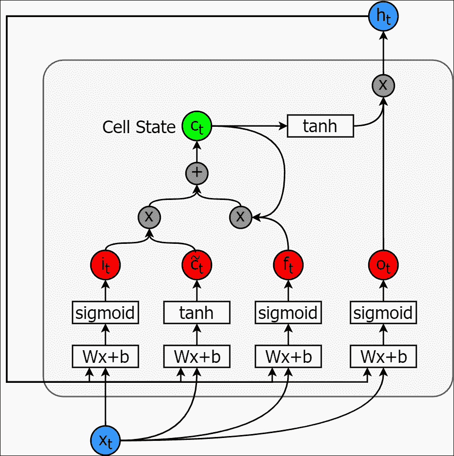
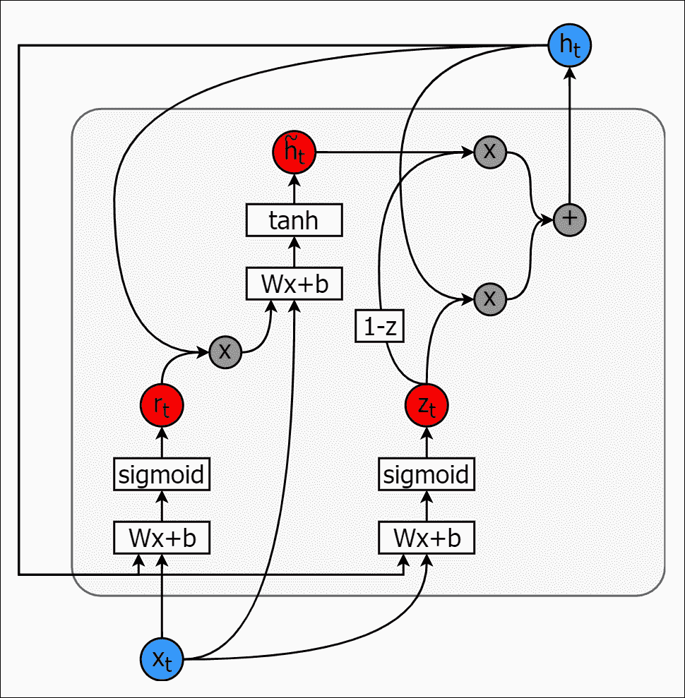
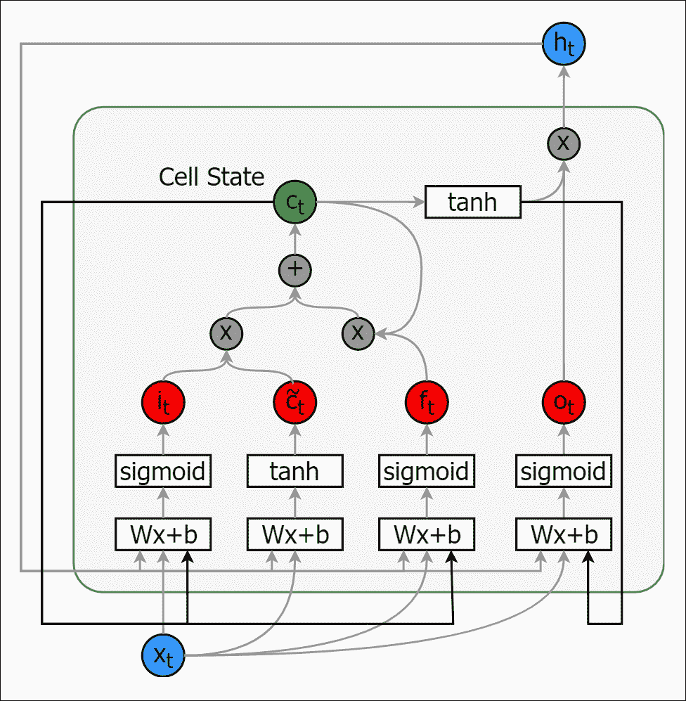
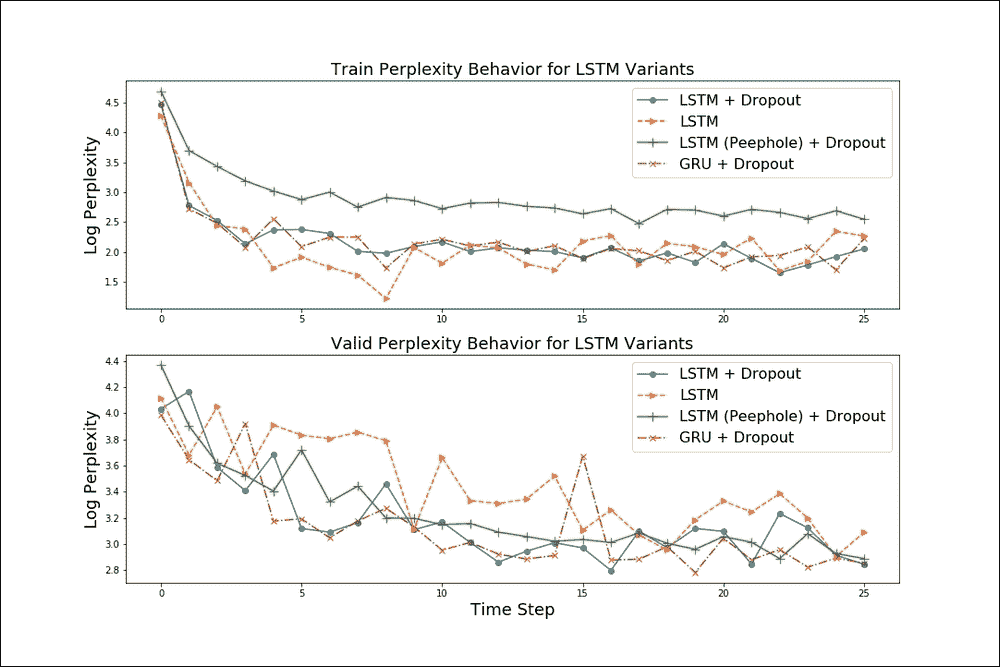
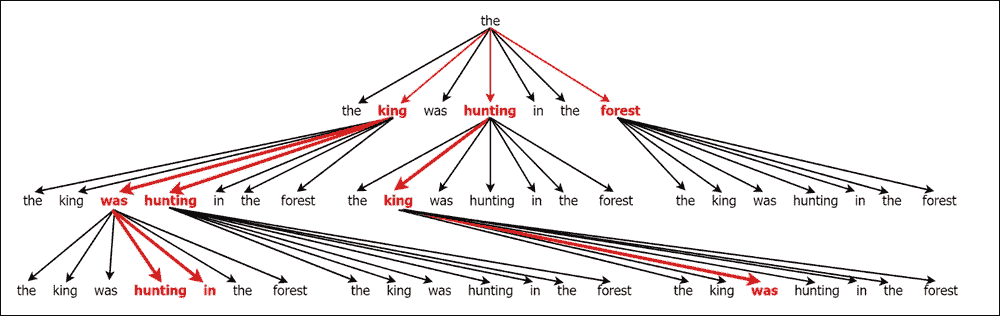
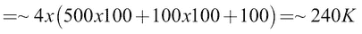
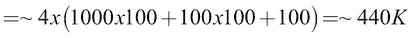
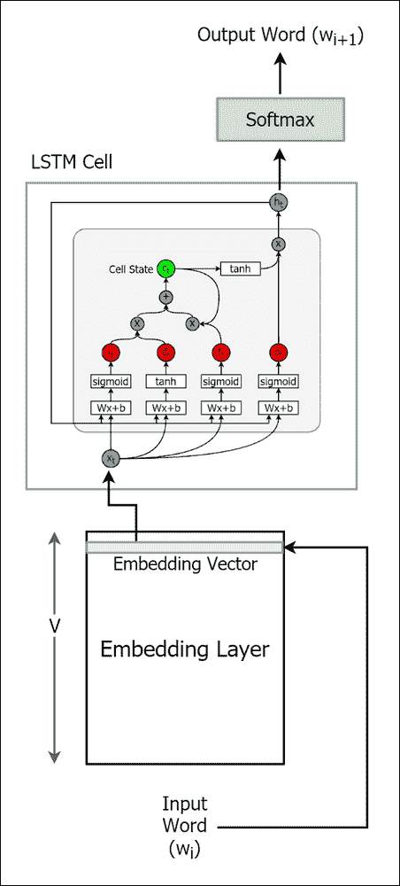
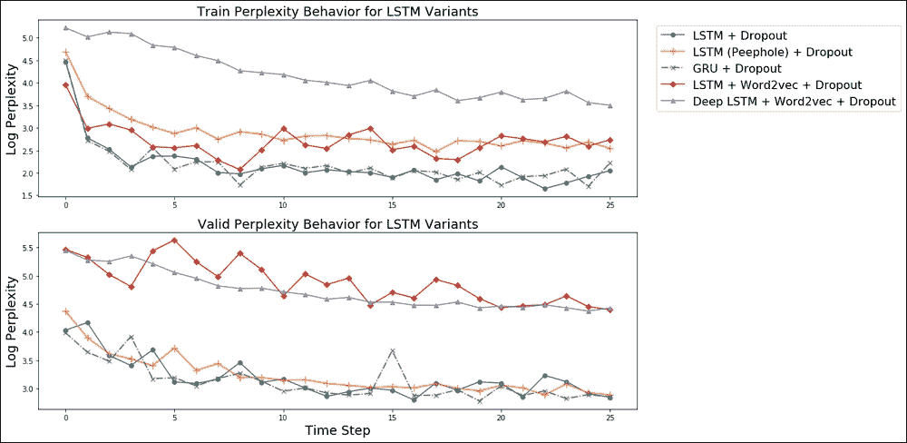

# 八、LSTM 的应用——生成文本

既然我们对 LSTMs 的底层机制有了很好的理解，比如它们如何解决消失梯度和更新规则的问题，我们可以看看如何在 NLP 任务中使用它们。LSTMs 主要用于文本生成和图像标题生成等任务。例如，语言建模对于文本摘要任务或为产品生成吸引人的文本广告非常有用，其中图像标题生成或图像注释对于图像检索非常有用，并且用户可能需要检索表示某种概念(例如，猫)的图像。

我们将在本章介绍的应用是使用 LSTM 生成新文本。在这个任务中，我们将下载格林兄弟的一些民间故事的翻译。我们将使用这些故事来训练 LSTM，并在最后要求它输出一个全新的故事。我们将通过将文本分解成字符级二元模型(n-grams，其中 *n=2* )来处理文本，并从唯一的二元模型中生成一个词汇表。我们也将探索实现先前描述的技术的方法，如贪婪采样或预测波束搜索。之后，我们将看到如何实现标准 lstm 之外的时间序列模型，例如带有窥视孔和 gru 的 lstm。

接下来，我们将看到如何学习生成具有更好的输入表示的文本，而不仅仅是字符级的二元模型，比如单个单词。请注意，与字符级二元模型相比，使用一次性编码的单词特征是非常低效的，因为词汇会随着单词快速增长。因此，处理这个问题的一个好方法是首先学习词嵌入(或使用预训练的嵌入),并将其用作 LSTM 的输入。使用词嵌入可以让我们避免维数灾难。在一个有趣的现实世界问题中，词汇表的大小可以在 10，000 到 1，000，000 之间。然而，不管词汇量有多大，词嵌入都有固定的维度。

# 我们的数据

首先，我们将讨论我们将用于文本生成的数据和用于清理数据的各种预处理步骤。

## 关于数据集

首先，我们将理解数据集看起来像什么，以便当我们看到生成的文本时，我们可以评估它是否有意义，给定训练数据。我们将从 https://www.cs.cmu.edu/~spok/grimmtmp/网站[下载前 100 本书。这些是格林兄弟翻译的一套书(从德语到英语)。这与](https://www.cs.cmu.edu/~spok/grimmtmp/)[第 6 章](ch06.html "Chapter 6. Recurrent Neural Networks")、*循环神经网络*中用于演示 RNNs 性能的文本相同。

最初，我们将使用自动脚本从网站下载前 100 本书，如下所示:

```
url = 'https://www.cs.cmu.edu/~spok/grimmtmp/'

# Create a directory if needed
dir_name = 'stories'
if not os.path.exists(dir_name):
    os.mkdir(dir_name)

def maybe_download(filename):
  """Download a file if not present"""
  print('Downloading file: ', dir_name+ os.sep+filename)

  if not os.path.exists(dir_name+os.sep+filename):
    filename, _ = urlretrieve(url + filename,
                              dir_name+os.sep+filename)
  else:
    print('File ',filename, ' already exists.')

  return filename

num_files = 100
filenames = [format(i, '03d')+'.txt' for i in range(1,101)]

for fn in filenames:
    maybe_download(fn)
```

```
然后她说，我最亲爱的本杰明，你的父亲已经为你和你的十一个兄弟做了这些棺材，因为如果我带一个小女孩来到这个世界，你们都要被杀死并埋在里面。她说这话的时候哭了，儿子安慰她说:不要哭，亲爱的妈妈，我们会救自己，然后离开这里。但是她说:"和你的十一个兄弟一起到森林里去，让一个人一直坐在能找到的最高的树上，看着城堡里的塔。"如果我生了一个小儿子，我会竖起一面白旗，然后你可以冒险回来。但是如果我生了一个女儿，我会升起一面红旗，然后尽快离开，愿上帝保佑你。
```

```
小红帽不知道他是一个多么邪恶的家伙，而且一点也不怕他。
```

“你好，小红帽，”他说。

“谢谢你，狼。”

“小红帽，这么早去哪儿？”

“去我奶奶家。”

“你围裙里有什么？”

“蛋糕和酒。昨天是烘烤的日子，所以可怜的生病的祖母是有好东西，让她更强大。”

"小红帽，你奶奶住在哪里？"

“在树林的更远处有四分之一英里。她的房子坐落在三棵大橡树下，坚果树就在下面。“你一定知道，”小红帽回答。

狼心想，多么温柔的小动物啊。多么丰满的一口啊，她会比那个老女人更好吃。

## 预处理数据

就预处理的而言，我们最初将使所有文本小写，并将文本分解成字符 n-grams，其中 *n=2* 。考虑下面的句子:

*国王在森林里打猎。*

这将分解为一系列 n 元语法，如下所示:

*【th】、【e】、【ki】、【ng】、【w】、*、*、…】*

我们将使用字符级二元模型，因为与使用单个单词相比，它大大减少了词汇表的大小。此外，我们将用一个特殊的标记(即 *UNK* )替换语料库中出现少于 10 次的所有二元模型，将该二元模型表示为未知。这有助于我们进一步减少词汇量。


# 实现 LSTM

这里我们将讨论 LSTM 实现的细节。尽管 TensorFlow 中的子库已经实现了现成的 LSTMs，但我们将从头实现一个。这将是非常有价值的，因为在现实世界中，可能会出现无法直接使用这些现成组件的情况。该代码可在练习的`ch8`文件夹中的`lstm_for_text_generation.ipynb`练习中找到。然而，我们还将包括一个练习，展示如何使用现有的 TensorFlow RNN API，该 API 将在位于同一文件夹的`lstm_word2vec_rnn_api.ipynb,`中提供。这里我们将讨论`lstm_for_text_generation.ipynb`文件中可用的代码。

首先，我们将讨论用于 LSTM 的超参数及其影响。此后，我们将讨论实现 LSTM 所需的参数(权重和偏差)。然后，我们将讨论如何使用这些参数来编写发生在 LSTM 中的操作。接下来，我们将了解如何按顺序向 LSTM 提供数据。接下来，我们将讨论如何使用梯度裁剪来实现参数的优化。最后，我们将研究如何使用学习到的模型来输出预测，这些预测本质上是二元模型，最终将形成一个有意义的故事。

## 定义超参数

首先，我们将定义 LSTM 所需的一些超参数:

```
# Number of neurons in the hidden state variables
num_nodes = 128

# Number of data points in a batch we process
batch_size = 64

# Number of time steps we unroll for during optimization
num_unrollings = 50

dropout = 0.2 # We use dropout
```

下面的列表描述了每个超参数:

*   `num_nodes`:此表示处于细胞记忆状态的神经元数量。当数据丰富时，增加单元存储器的复杂度会给你更好的性能；然而，与此同时，它降低了计算速度。
*   `batch_size`:这是单步处理的数据量。增加批处理的大小可以获得更好的性能，但会带来更高的内存需求。
*   `num_unrollings`:这是截断 BPTT 中使用的时间步数。`num_unrollings`步长越高，性能越好，但会增加内存需求和计算时间。
*   `dropout`:最后，我们将使用`dropout`(即一种正则化技术)来减少模型的过度拟合，并产生更好的结果；`dropout`在将输入/输出/状态变量传递给它们的后续操作之前，随机丢弃它们的信息。这会在学习过程中产生冗余特征，从而提高性能。

## 定义参数

现在我们将为 LSTM 的实际参数定义 TensorFlow 变量。

首先，我们将定义输入门参数:

*   `ix`:这些是连接输入和输入门的砝码
*   `im`:这些是连接隐藏状态和输入门的权重
*   `ib`: This is the bias

    这里我们将定义参数:

    ```
    # Input gate (it) - How much memory to write to cell state
    # Connects the current input to the input gate
    ix = tf.Variable(tf.truncated_normal([vocabulary_size, num_nodes], stddev=0.02))
    # Connects the previous hidden state to the input gate
    im = tf.Variable(tf.truncated_normal([num_nodes, num_nodes], stddev=0.02))
    # Bias of the input gate
    ib = tf.Variable(tf.random_uniform([1, num_nodes],-0.02, 0.02))
    ```

    类似地，我们将为遗忘门、候选值(用于存储单元计算)和输出门定义这样的权重。

    遗忘门的定义如下:

    ```
    # Forget gate (ft) - How much memory to discard from cell state
    # Connects the current input to the forget gate
    fx = tf.Variable(tf.truncated_normal([vocabulary_size, num_nodes], stddev=0.02))
    # Connects the previous hidden state to the forget gate
    fm = tf.Variable(tf.truncated_normal([num_nodes, num_nodes], stddev=0.02))
    # Bias of the forget gate
    fb = tf.Variable(tf.random_uniform([1, num_nodes],-0.02, 0.02))
    ```

    候选值(用于计算单元状态)定义如下:

    ```
    # Candidate value (c~t) - Used to compute the current cell state
    # Connects the current input to the candidate
    cx = tf.Variable(tf.truncated_normal([vocabulary_size, num_nodes], stddev=0.02))
    # Connects the previous hidden state to the candidate
    cm = tf.Variable(tf.truncated_normal([num_nodes, num_nodes], stddev=0.02))
    # Bias of the candidate
    cb = tf.Variable(tf.random_uniform([1, num_nodes],-0.02,0.02))
    ```

    输出门定义如下:

    ```
    # Output gate - How much memory to output from the cell state
    # Connects the current input to the output gate
    ox = tf.Variable(tf.truncated_normal([vocabulary_size, num_nodes], stddev=0.02))
    # Connects the previous hidden state to the output gate
    om = tf.Variable(tf.truncated_normal([num_nodes, num_nodes], stddev=0.02))
    # Bias of the output gate
    ob = tf.Variable(tf.random_uniform([1, num_nodes],-0.02,0.02))
    ```

    接下来，我们将为状态和输出定义变量。这些是 TensorFlow 变量，代表 LSTM 单元的内部单元状态和外部隐藏状态。当定义 LSTM 计算操作时，我们使用`tf.control_dependencies`(...)功能。

    ```
    # Variables saving state across unrollings.
    # Hidden state
    saved_output = tf.Variable(tf.zeros([batch_size, num_nodes]), trainable=False, name='train_hidden')
    # Cell state
    saved_state = tf.Variable(tf.zeros([batch_size, num_nodes]), trainable=False, name='train_cell')
    # Same variables for validation phase
    saved_valid_output = tf.Variable(tf.zeros([1, num_nodes]),trainable=False, name='valid_hidden')
    saved_valid_state = tf.Variable(tf.zeros([1, num_nodes]),trainable=False, name='valid_cell')
    ```

    最后，我们将定义一个 softmax 层来获得实际的预测结果:

    ```
    # Softmax Classifier weights and biases.
    w = tf.Variable(tf.truncated_normal([num_nodes, vocabulary_size], stddev=0.02))
    b = tf.Variable(tf.random_uniform([vocabulary_size],-0.02,0.02))
    ```

    ### 注意

    请注意，我们使用的正态分布具有零均值和小标准差。这很好，因为我们的模型是一个简单的单 LSTM 细胞。然而，当网络变得更深时(即，多个 LSTM 单元堆叠在彼此之上)，需要更仔细的初始化技术。一种这样的初始化技术被称为 **Xavier 初始化**，由 Glorot 和 Bengio 在他们的论文*理解训练深度前馈神经网络的困难*、*第 13 届人工智能和统计国际会议论文集*、 *2010* 中提出。这在 TensorFlow 中作为变量初始化器提供，如下图:[https://www . tensor flow . org/API _ docs/python/TF/contrib/layers/Xavier _ initializer](https://www.tensorflow.org/api_docs/python/tf/contrib/layers/xavier_initializer)。

## 定义 LSTM 单元及其操作

有了权重和定义的偏差，我们现在可以定义 LSTM 单元内的操作。这些操作包括以下内容:

*   计算输入和遗忘门产生的输出
*   计算内部单元状态
*   计算输出门产生的输出
*   计算外部隐藏状态

以下是我们的 LSTM 单元的实现:

```
def lstm_cell(i, o, state):

    input_gate = tf.sigmoid(tf.matmul(i, ix) +
                            tf.matmul(o, im) + ib)
    forget_gate = tf.sigmoid(tf.matmul(i, fx) +
                             tf.matmul(o, fm) + fb)
    update = tf.matmul(i, cx) + tf.matmul(o, cm) + cb
    state = forget_gate * state + input_gate * tf.tanh(update)
    output_gate = tf.sigmoid(tf.matmul(i, ox) +
                             tf.matmul(o, om) + ob)
    return output_gate * tf.tanh(state), state
```

## 定义输入和标签

现在我们将定义训练输入(展开)和标签。训练输入是具有`num_unrolling`批数据(顺序)的列表，其中每批数据的大小为`[batch_size, vocabulary_size]`:

```
train_inputs, train_labels = [],[]

for ui in range(num_unrollings):
    train_inputs.append(tf.placeholder(tf.float32,
                               shape=[batch_size,vocabulary_size],
                               name='train_inputs_%d'%ui))
    train_labels.append(tf.placeholder(tf.float32,
                               shape=[batch_size,vocabulary_size],
                               name = 'train_labels_%d'%ui))
```

我们还为验证输入和输出定义了占位符，这些占位符将用于计算验证困惑。请注意，我们没有对验证相关的计算使用展开。

```
# Validation data placeholders
valid_inputs = tf.placeholder(tf.float32, shape=[1,vocabulary_size],
               name='valid_inputs')
valid_labels = tf.placeholder(tf.float32, shape=[1,vocabulary_size],
               name = 'valid_labels')
```

## 定义处理顺序数据所需的顺序计算

这里我们将以递归方式计算训练输入单次展开产生的输出。我们还将使用`dropout`(参考 *Dropout:一种防止神经网络过度拟合的简单方法*、 *Srivastava* 、 *Nitish* 、*和其他*、*Journal of Machine Learning Research 15(2014):1929-1958*)，因为这提供了略好的性能。最后，我们计算为训练数据计算的所有隐藏输出值的 logit 值:

```
# Keeps the calculated state outputs in all the unrollings
# Used to calculate loss
outputs = list()

# These two python variables are iteratively updated
# at each step of unrolling
output = saved_output
state = saved_state

# Compute the hidden state (output) and cell state (state)
# recursively for all the steps in unrolling
for i in train_inputs:
    output, state = lstm_cell(i, output, state)
    output = tf.nn.dropout(output,keep_prob=1.0-dropout)
    # Append each computed output value
    outputs.append(output)

# calculate the score values
logits = tf.matmul(tf.concat(axis=0, values=outputs), w) + b
```

接下来，在计算损耗之前，我们必须确保输出和外部隐藏状态被更新为我们之前计算的最新值。这是通过添加一个`tf.control_dependencies`条件并将 logit 和损失计算保持在该条件内来实现的:

```
with tf.control_dependencies([saved_output.assign(output),
                            saved_state.assign(state)]):
    # Classifier.
    loss = tf.reduce_mean(
      tf.nn.softmax_cross_entropy_with_logits_v2(
        logits=logits, labels=tf.concat(axis=0,
                                        values=train_labels)))
```

我们还定义了验证数据的正向传播逻辑。请注意，我们不在验证期间使用辍学，而仅在培训期间使用:

```
# Validation phase related inference logic

# Compute the LSTM cell output for validation data
valid_output, valid_state = lstm_cell(
    valid_inputs, saved_valid_output, saved_valid_state)

# Compute the logits
valid_logits = tf.nn.xw_plus_b(valid_output, w, b)
```

## 定义优化器

这里我们将定义优化过程。我们将使用最先进的优化器，称为 **Adam** ，这是迄今为止最好的基于随机梯度的优化器之一。在这里的代码中，`gstep`是一个变量，用于随时间衰减学习率。我们将在下一节讨论细节。此外，我们将使用渐变剪辑来避免爆炸式渐变:

```
# Decays learning rate everytime the gstep increases
tf_learning_rate = tf.train.exponential_decay(0.001,gstep,
                   decay_steps=1, decay_rate=0.5)
# Adam Optimizer. And gradient clipping.
optimizer = tf.train.AdamOptimizer(tf_learning_rate)
gradients, v = zip(*optimizer.compute_gradients(loss))
gradients, _ = tf.clip_by_global_norm(gradients, 5.0)
optimizer = optimizer.apply_gradients(
    zip(gradients, v))
```

## 学习率随时间衰减

如前所述，我使用的是衰减的学习速率，而不是恒定的学习速率。随着时间的推移降低学习速率是深度学习中用于实现更好性能和减少过拟合的常用技术。这里的关键思想是，如果验证困惑在预定数量的时期内没有减少，则逐步降低学习速率(例如，降低 0.5 倍)。让我们更详细地看看这到底是如何实现的:

首先我们定义`gstep`和一个增加`gstep`的操作，称为`inc_gstep`，如下所示:

```
# learning rate decay
gstep = tf.Variable(0,trainable=False,name='global_step')
# Running this operation will cause the value of gstep
# to increase, while in turn reducing the learning rate
inc_gstep = tf.assign(gstep, gstep+1)
```

有了这个定义，我们可以编写一些简单的逻辑来调用`inc_gstep`操作，只要验证损失没有减少，如下所示:

```
# Learning rate decay related
# If valid perplexity does not decrease
# continuously for this many epochs
# decrease the learning rate
decay_threshold = 5
# Keep counting perplexity increases
decay_count = 0
min_perplexity = 1e10

# Learning rate decay logic
def decay_learning_rate(session, v_perplexity):
  global decay_threshold, decay_count, min_perplexity  
  # Decay learning rate
  if v_perplexity < min_perplexity:
    decay_count = 0
    min_perplexity= v_perplexity
  else:
    decay_count += 1

  if decay_count >= decay_threshold:
    print('\t Reducing learning rate')
    decay_count = 0
    session.run(inc_gstep)
```

在这里，每当我们经历一个新的最小验证困惑时，我们就更新`min_perplexity`。还有，`v_perplexity`是当前的验证困惑。

## 做预测

现在我们可以进行预测，只需将 softmax 激活应用到我们之前计算的 logits。我们还为验证逻辑定义了预测操作:

```
train_prediction = tf.nn.softmax(logits)
# Make sure that the state variables are updated
# before moving on to the next iteration of generation
with tf.control_dependencies([saved_valid_output.assign(valid_output),
                            saved_valid_state.assign(valid_state)]):
    valid_prediction = tf.nn.softmax(valid_logits)
```

## 计算困惑(损失)

我们在[第七章](ch07.html "Chapter 7. Long Short-Term Memory Networks")、*长短期记忆网络*中定义了什么是困惑。回顾一下，困惑是对给定当前 n-gram 的情况下，LSTM 看到下一个 n-gram 时*有多惊讶的度量。因此，较高的困惑意味着较差的性能，而较低的困惑意味着较好的性能:*

```
train_perplexity_without_exp = tf.reduce_sum(
    tf.concat(train_labels,0)*-tf.log(tf.concat(
        train_prediction,0)+1e-10))/(num_unrollings*batch_size)
```

```
# Compute validation perplexity
valid_perplexity_without_exp = tf.reduce_sum(valid_labels*-tf.log(valid_prediction+1e-10))
```

## 复位状态

我们使用状态重置，因为我们正在处理多个文档。因此，在开始处理新文档时，我们将隐藏状态重置为零。然而，重置状态在实践中是否有帮助还不是很清楚。一方面，当开始阅读一个新的故事时，在每个文档的开头将 LSTM 细胞的内存重置为零听起来很直观。另一方面，这会使状态变量偏向零。我们鼓励您尝试在有和没有状态重置的情况下运行该算法，看看哪种方法执行得好。

```
# Reset train state
reset_train_state = tf.group(tf.assign(saved_state, 
                             tf.zeros([batch_size, num_nodes])),
                             tf.assign(saved_output, tf.zeros(
                             [batch_size, num_nodes])))

# Reset valid state
reset_valid_state = tf.group(tf.assign(saved_valid_state,
                             tf.zeros([1, num_nodes])),
                             tf.assign(saved_valid_output,
                             tf.zeros([1, num_nodes])))
```

## 贪婪采样打破单峰性

这是一个非常简单的技术，我们可以从 LSTM 发现的 n 个最佳候选中随机抽取下一个预测。此外，我们将给出选择一个候选项的概率与该候选项成为下一个二元模型的可能性成比例:

```
def sample(distribution):

  best_inds = np.argsort(distribution)[-3:]
  best_probs = distribution[best_inds]/
  np.sum(distribution[best_inds])
  best_idx = np.random.choice(best_inds,p=best_probs)
  return best_idx
```

## 生成新文本

最后，我们将定义生成新文本所需的占位符、变量和操作。这些定义类似于我们对训练数据所做的。首先，我们将为状态和输出定义一个输入占位符和变量。接下来，我们将定义状态重置操作。最后，我们将为要生成的新文本定义 LSTM 单元计算和预测:

```
# Text generation: batch 1, no unrolling.
test_input = tf.placeholder(tf.float32, shape=[1, vocabulary_size], name = 'test_input')

# Same variables for testing phase
saved_test_output = tf.Variable(tf.zeros([1,
                                num_nodes]),
                                trainable=False, name='test_hidden')
saved_test_state = tf.Variable(tf.zeros([1,
                               num_nodes]),
                               trainable=False, name='test_cell')

# Compute the LSTM cell output for testing data
test_output, test_state = lstm_cell(
test_input, saved_test_output, saved_test_state)

# Make sure that the state variables are updated
# before moving on to the next iteration of generation
with tf.control_dependencies([saved_test_output.assign(test_output),
                            saved_test_state.assign(test_state)]):
    test_prediction = tf.nn.softmax(tf.nn.xw_plus_b(test_output, 
                                    w, b))

# Reset test state
reset_test_state = tf.group(
    saved_test_output.assign(tf.random_normal([1,
                             num_nodes],stddev=0.05)),
    saved_test_state.assign(tf.random_normal([1,
                            num_nodes],stddev=0.05)))
```

## 示例生成的文本

让我们来看看 LSTM 经过 50 步学习后产生的一些数据:

```
they saw that the birds were at her bread, and threw behind him a comb which
made a great ridge with a thousand times thousands of spikes.  that was a
collier.  
the nixie was at church, and thousands of spikes, they were flowers, however, and had hewn through the glass, the children had formed a
hill of mirrors, and was so slippery that it was impossible for the
nixie to cross it.  then she thought, i will go home quickly and
fetch my axe, and cut the hill of glass in half.  long before she
returned, however, and had hewn through the glass, the children saw her from afar,
and he sat down close to it,
and was so slippery that it was impossible for the
nixie to cross it.
```

如您所见，该文本看起来比我们看到的从 RNNs 生成的文本好得多。在我们的训练语料库中确实存在一个关于水谢妮的故事。然而，我们的 LSTM 不仅仅输出那个文本，它还通过引入新的东西为故事增添了更多的色彩，比如谈论一座教堂和鲜花，这些在原文中是找不到的。接下来，我们将研究从标准 lstm 生成的文本与其他模型(如带有窥视孔和 gru 的 lstm)相比如何。


# 比较 lstm 与具有窥视孔连接和 gru 的 lstm

现在我们将在文本生成任务中比较 lstm 与带有窥视孔和 gru 的 lstm。这将有助于我们比较不同模型(带窥视孔和 gru 的 LSTMs)在困惑和生成文本质量方面的表现。这可作为位于`ch8`文件夹中的`lstm_extensions.ipynb`中的练习。

## 标准 LSTM

首先，我们将重申标准 LSTM 的组成部分。我们不会重复标准 LSTMs 的代码,因为它与我们之前讨论的相同。最后，我们将看到一些由 LSTM 生成的文本。

### 回顾

在这里，我们将重温一个标准的 LSTM 是什么样子的。正如我们已经提到的，LSTM 包括以下内容:

*   **输入门**:决定有多少电流输入写入单元状态
*   **遗忘门**:决定将多少先前单元状态写入当前单元状态
*   **输出门**:决定有多少单元状态的信息暴露输出到外部隐藏状态

在*图 8.1* 中，我们将说明这些门、输入、单元状态和外部隐藏状态是如何连接的:



图 8.1:一个 LSTM 细胞

### 示例生成的文本

这里，我们将展示标准 LSTM 在我们的数据集上经过单步训练和 25 步训练后产生的文本。

步骤 1 中生成的文本:

```
emy that then the to they the the to and and and then there the to the to the withe there the the to, and ther, and ther tthe the the the withe the the the the wid the th to e the there to, and the the the the the wid the the the to, the and to the was and and was the when hind the whey the the to and was the whe wous thout hit the to hhe was they his up the was was the wou was and and wout the the ous to hhe the was and was they hind and and then the the the wit to the wther thae wid the and the the wit the ther, the there the to the wthe wit the the the the wit up the they og a and the whey the the ous th the wthe the ars to and the whey it a and whe was they the ound the was whe was and and to ther then the and ther the wthe art the the and and the the the to and when the the wie to the wthe wit up the whe wou wout hit hit the the the to the whe was aou was to t the out and the and hit the the the with then the wie the to then the the to, the to a t to the the wit up he the wit there
```

在步骤 25 产生的文本:

```
there, said the father for a while, and her trouble she was to carry the mountain.  then they were all the child, and they were once and only sighed, but they said, i am as
old now as the way and drew the child, and he began and wife looked at last and said, i have the child, fath-turn, and
hencefore they were to himself, and then they trembled, hand all three days with him.  when the king of the golden changeling, and his wife looked at last and only one lord, and then he was laughing, wished himself, and then he said
nothing and only sighed.  then they had said, all the changeling
laugh, and he said, who was still done, the bridegroom, and he went away to him, but he did not trouble to the changeling away, and then they were over this, he was all to the wife, and she said,
has the wedding did gretel give her them, and said, hans in a place.
in her trouble shell into the father.  i am you.
the king had said, how he was to sweep.  then the spot on hand but the could give you doing there,
```

我们可以看到，在第 25 步，与第 1 步相比，文本的质量有了显著的提高。此外，这段文字看起来比我们在第六章、*循环神经网络*示例中看到的文字好得多，当时使用了 100 个故事来训练模型。

## 门控循环单位

在这里，我们将首先简要描述 GRU 是由什么组成的，然后是实现 GRU 单元的代码。最后，我们看一些由 GRU 细胞产生的代码。

### 回顾

为了复习，让我们简单了解一下什么是 GRU。GRU 是 LSTM 操作的优雅简化。GRU 对 LSTM 进行了两种不同的改进(见*图 8.2* ):

*   它将内部单元状态和外部隐藏状态连接成单一状态
*   然后它将输入门和遗忘门合并成一个更新门

    图 8.2:一个 GRU 单元

### 代码

这里我们将定义一个 GRU 细胞:

```
def gru_cell(i, o):
    """Create a GRU cell."""
    reset_gate = tf.sigmoid(tf.matmul(i, rx) + tf.matmul(o, rh)
                            + rb)
    h_tilde = tf.tanh(tf.matmul(i,hx) + tf.matmul(
        reset_gate * o, hh) + hb)
    z = tf.sigmoid(tf.matmul(i,zx) + tf.matmul(o, zh) + zb)
    h = (1-z)*o + z*h_tilde

    return h
```

然后我们将调用这个方法，就像我们在前面的例子中所做的那样:

```
for i in train_inputs:
    output = gru_cell(i, output)
    output = tf.nn.dropout(output,keep_prob=1.0-dropout)
    outputs.append(output)
```

### 示例生成的文本

在这里，我们将展示由 GRU 在我们的数据集上经过单步训练和 25 步训练后产生的文本。

步骤 1 中生成的文本:

```
     hing ther that ther her to the was shen andmother to to her the cake, and the caked the woked that the wer hou shen her the the the that her her, and to ther to ther her that the wer the wer ther the wong are whe was the was so the the caked her the wong an the woked the wolf the soought and was the was he grandmred the wolf sas shen that ther to hout her the the cap the wolf so the wong the soor ind the wolf the when that, her the the wolf to and the wolf sher the the cap the cap.  the wolf so ther the was her her, the the the wong and whe her the was her he grout the ther, and the cap., and the caked the the ther the were cap and the would the the wolf the was the whe wher cad-the cake the was her her, he when the ther, the wolf so the that, and the wolf so and her the the the cap.  the the wong to the wolf, andmother the cap. the so to ther ther, the woked he was the was the when the caked her cad-ing and the cake, and
```

步骤 25 中产生的文本:

```
you will be sack, and the king's son, the king continued, and he was about to them all, and that she was strange carry them to somether, and who was there, but when the shole before the king, and the king's daughter was into such into the six can dish of this wine before the said, the king continued, and said to the king, when he was into the castle to so the king.
then the king was stranged the king.
then she said, and said that he saw what the sack, but the king, and the king content up the king.
the king had the other, and said, it is not down to the king was in the blower to be took them.  then the king sack, the king, and the other, there, and
said to the other, there, and the king, who had been away, the six content the six conved the king's strong one, they were not down the king.
then she said to her, and saw the six content until there, and the king content until the six convered the
```

我们可以看到，就文本质量而言，与标准 LSTMs 相比，gru 并没有表现出显著的质量改进。然而，GRUs 的输出似乎比 LSTMs 在文本中有更多的重复(例如，单词 *king* )。这可能是由于模型的简化(即，与标准 LSTM 中的两个状态相比，只有一个状态)导致的长期记忆的损害。

## 带窥视孔的 LSTMs

这里我们将讨论带窥视孔的 LSTM，以及它们与标准 LSTM 的不同之处。接下来我们将讨论它们的实现，然后是带有窥视孔的 LSTM 模型生成的文本。

### 回顾

现在，让我们简单地看一下带有窥视孔的 LSTMs。窥视孔本质上是门(输入、遗忘和输出)直接看到细胞状态的一种方式，而不是等待外部隐藏状态(参见*图 8.3* ):



图 8.3:带窥视孔的 LSTM

### 代码

注意我们保持 peep 连接对角线。我们发现，对于这项语言建模任务，非对角窥视孔连接(由 Gers 和 Schmidhuber 在他们的论文*Recurrent Networks that Time and Count*、*神经网络*、 *2000* 中提出)对性能的损害大于帮助。因此，我们采用了使用对角窥视孔连接的不同变体，如 Sak、Senior 和 Beaufays 在他们的论文*用于大规模声学建模的长短期记忆循环神经网络架构*、*国际语音通信协会年会会议录*、*inter spech*、 *2014: 338-342* 中所使用的。

以下是代码实现:

```
def lstm_with_peephole_cell(i, o, state):

    input_gate = tf.sigmoid(tf.matmul(i, ix) + state*ic +
                            tf.matmul(o, im) + ib)
    forget_gate = tf.sigmoid(tf.matmul(i, fx) + state*fc +
                             tf.matmul(o, fm) + fb)
    update = tf.matmul(i, cx) + tf.matmul(o, cm) + cb
    state = forget_gate * state + input_gate * tf.tanh(update)
    output_gate = tf.sigmoid(tf.matmul(i, ox) + state*oc +
                             tf.matmul(o, om) + ob)

    return output_gate * tf.tanh(state), state
```

然后我们将为每批输入调用此方法，以跨越所有时间步长(即`num_unrollings`时间步长)，如以下代码所示:

```
for i in train_inputs:
    output, state = lstm_with_peephole_cell(i, output, state)
    output = tf.nn.dropout(output,keep_prob=1.0-dropout)
    outputs.append(output)
```

### 示例生成的文本

这里我们展示了标准 LSTM 在我们的数据集上经过单步训练和 25 步训练后产生的文本。

以下是在步骤 1 中生成的文本:

```
our oned he the the hed the the the he here hed he he e e and her and the ther her the then hed and her and her her the hed her and the the he he ther the hhe the he ther the whed hed her he hthe and the the the ther the to e and the the the ane and and her and the hed ant and the and ane hed and ther and and he e the th the hhe ther the the and the the the the the the hed and ther hhe wher the her he he and he hthe the the the he the then the he he e and the the the and and the the the ther to he hhe wher ant the her and the hed the he he the and ther and he the and and the ant he he e the and ther he e and ther here th the whed
```

以下是在步骤 25 中生成的文本:

```
will, it was there, and it was me, and i trod on the stress and there is a stone and the went and said, klink, and that the princess and they said, i will not stare
it, the wedding and that the was of little the sun came in the sun came out, and then the wolf is took a little coat and i were at little hand and beaning therein and said, klink, and broke out of the shoes he had the wolf of the were to patches a little put into the were, and they said, she was to pay the bear said, "ah, that they come to the well and there is a stone and the wolf were of the light, and that the two old were of glass there is a little that his
well as well and wherever a stone
and they were the went to the well, and the went the sun came in the seater hand, and they said, klink, and broke in his sead, and i were my good one
the wedding and said, that the two of slapped to said to said, "ah, that his store once the worl's said, klink, but the went out of a patched on his store, and the wedding and said, that
```

与 lstm 或 GRUs 产生的文本相比，lstm 产生的具有窥视孔的文本在语法上显得很差。现在让我们看看每种方法在困惑度量方面是如何定量比较的。

## 随着时间的推移，培训和验证令人困惑

在*图 8.4* 中，我们将绘制 lstm、带窥视孔的 lstm 和 gru 随时间的困惑行为。首先，我们可以看到，没有退出会显著降低培训的难度。然而，我们不应该得出这样的结论:辍学会对表现产生负面影响，因为这种有吸引力的表现是由于过度拟合的训练数据造成的。从验证困惑图中可以明显看出这一点。虽然 LSTM 的训练困惑似乎与使用辍学的模型有竞争力，但验证困惑比这些模型高得多。这向我们展示了辍学事实上在语言生成任务中帮助了我们。

此外，从所有使用辍学的方法，我们可以看到，LSTM 和 GRUs 提供了最好的表现。一个令人惊讶的发现是，带有窥视孔的 LSTMs 产生最差的训练困惑和稍差的验证困惑。这意味着窥视孔连接对解决我们的问题没有增加任何价值，而是通过向模型引入更多参数而使优化变得困难。根据这个分析，从现在开始我们将使用 LSTMs。我们将 GRUs 实验作为读者的一个练习:



图 8.4:训练数据随时间的困惑变化(LSTMs、LSTM(窥视孔)和 GRUs)

### 注意

目前的文献表明，在 LSTMs 和 gru 中，没有明确的赢家，很多都取决于任务(参见论文*门控循环神经网络对序列建模的实证评估*， *Chung 等人*， *NIPS 2014 深度学习研讨会*，*2014 年 12 月*)。


# 改进 lst ms–波束搜索

正如我们前面看到的，生成的文本可以改进。现在让我们看看我们在[第七章](ch07.html "Chapter 7. Long Short-Term Memory Networks")、*长短期记忆网络*中讨论的光束搜索是否有助于提高的性能。在波束搜索中，我们将向前看多个步骤(称为**波束**)并获得具有为每个波束单独计算的最高联合概率的波束(即二元模型序列)。通过将波束中每个预测二元模型的预测概率相乘来计算联合概率。请注意，这是一个贪婪的搜索，这意味着随着树的增长，我们将在树的每个深度迭代计算最佳候选。应当注意，这种搜索不会产生全局最佳的波束。

## 实现波束搜索

要实现光束搜索，我们只需改变文本生成技术。培训和验证操作保持不变。然而，代码将比我们前面看到的文本生成操作流程更复杂。该代码可用于`ch8`文件夹中`lstm_for_text_generation.ipynb`练习文件的末尾。

首先，我们将定义光束长度(即我们展望未来的步数)和`beam_neighbors`(即我们在每个时间步比较的候选数):

```
beam_length = 5 
beam_neighbors = 5
```

我们将定义`beam_neighbor`个占位符，以在每个时间步保持最佳候选:

```
sample_beam_inputs = [tf.placeholder(tf.float32, shape=[1, vocabulary_size]) for _ in range(beam_neighbors)]
```

接下来，我们将定义两个占位符来保存最佳贪婪找到的全局波束索引和本地维护的最佳候选波束索引，我们将使用它们来继续我们对下一阶段预测的预测:

```
best_beam_index = tf.placeholder(shape=None, dtype=tf.int32)
best_neighbor_beam_indices = tf.placeholder(shape=[beam_neighbors], dtype=tf.int32)
```

然后，我们将为每个候选波束定义状态和输出变量，就像我们先前为单个预测所做的那样:

```
saved_sample_beam_output = [tf.Variable(tf.zeros([1, num_nodes])) for _ in range(beam_neighbors)]
saved_sample_beam_state = [tf.Variable(tf.zeros([1, num_nodes])) for _ in range(beam_neighbors)]
```

我们还将定义状态复位操作:

```
reset_sample_beam_state = tf.group(
    *[saved_sample_beam_output[vi].assign(tf.zeros([1, num_nodes])) for vi in range(beam_neighbors)],
    *[saved_sample_beam_state[vi].assign(tf.zeros([1, num_nodes])) for vi in range(beam_neighbors)]
)
```

此外，我们将需要每个波束的单元输出和预测计算:

```
# We calculate lstm_cell state and output for each beam
sample_beam_outputs, sample_beam_states = [],[]
for vi in range(beam_neighbors):
    tmp_output, tmp_state = lstm_cell(
        sample_beam_inputs[vi], saved_sample_beam_output[vi],
        saved_sample_beam_state[vi]
    )
    sample_beam_outputs.append(tmp_output)
    sample_beam_states.append(tmp_state)

# For a given set of beams, outputs a list of prediction vectors of size beam_neighbors
# each beam having the predictions for full vocabulary
sample_beam_predictions = []
for vi in range(beam_neighbors):
    with tf.control_dependencies([saved_sample_beam_output[vi].assign(sample_beam_outputs[vi]),
                                saved_sample_beam_state[vi].assign(sample_beam_states[vi])]):
        sample_beam_predictions.append(tf.nn.softmax(tf.nn.xw_plus_b(sample_beam_outputs[vi], w, b)))
```

接下来，我们将定义一组新的操作，用于使用在每个步骤中找到的最佳波束候选索引来更新每个波束的状态和输出变量。这对于每一步都很重要，因为最佳波束候选不会在给定深度从每棵树均匀地分叉。*图 8.5* 显示了一个例子。我们将用粗体和箭头表示最佳波束候选:



图 8.5:波束搜索说明了在每一步更新波束状态的要求

正如这里所看到的，候选并不是均匀采样的，在给定深度的子树(从同一点开始的一组箭头)中总是有一个候选。例如，在深度 2 处，没有从*狩猎* *→* *国王*路径中产生的，因此我们为该路径计算的状态更新不再有用。因此，我们为该路径维护的状态必须替换为我们为*king**→**was*路径维护的状态更新，因为现在有两条路径共享父路径*king**→**was*。我们将使用以下代码对状态进行替换:

```
stacked_beam_outputs = tf.stack(saved_sample_beam_output)
stacked_beam_states = tf.stack(saved_sample_beam_state)

update_sample_beam_state = tf.group(
    *[saved_sample_beam_output[vi].assign(tf.gather_nd(stacked_beam_outputs,[best_neighbor_beam_indices[vi]])) for vi in range(beam_neighbors)],
    *[saved_sample_beam_state[vi].assign(tf.gather_nd(stacked_beam_states,[best_neighbor_beam_indices[vi]])) for vi in range(beam_neighbors)]
)
```

## 波束搜索生成的示例

让我们看看我们的 LSTM 在光束搜索方面表现如何。它看起来比以前更好:

```
and they sailed to him and said,
          oh, queen.  where heavens, she went to her, and thumbling where the whole kingdom likewis, and that she had given him as that he had to eat, and they gave him the money, hans took his head that he had been the churchyar, and they gave him the money, hans took his head that he had been the world, and, however do that, he have begging his that he was
placed where they were brought in the mouse's horn again.  where have, you come?  then thumbling where the world, and when they came to them, and that he was soon came back, and then the will make that they hardled the world, and, however do that heard him, they have gone out through the room, and said the king's son was again and said,
          ah, father, i have been in a dream, for his horse again, answered the door.  when they saw
each other that they had been.  then they saw they had been.
```

与 LSTM 编写的文本相比，这个文本似乎有更多的变化，同时保持了文本的语法一致性。所以，事实上，与一次预测一个单词相比，波束搜索有助于产生高质量的预测。此外，我们看到 LSTM 有趣地将故事中的不同元素结合起来，以产生有趣的概念(例如，老鼠的角，将大拇指和另一个故事中的汉斯结合在一起)。但是，仍然有单词放在一起没有多大意义的情况。让我们看看如何进一步提高我们的 LSTM。


# 改进 lst ms–用单词而不是 n 元语法生成文本

在这里，我们将讨论改进 LSTMs 的方法。首先，我们将讨论如果我们使用一个热编码的单词特征，模型参数的数量是如何增长的。这促使我们使用低维的单词向量，而不是一次性编码的向量。最后，我们将讨论如何在代码中使用单词向量来生成比使用二元模型更高质量的文本。该部分的代码可在`ch8`文件夹的`lstm_word2vec.ipynb`中找到。

## 维度的诅咒

阻止我们使用单词而不是 n-grams 作为 LSTM 输入的一个主要限制是，这将极大地增加我们模型中的参数数量。我们通过一个例子来理解这一点。假设我们有一个大小为 *500* 的输入和一个大小为 *100* 的单元状态。这将产生总共大约 *240K* 个参数(不包括 softmax 层)，如下所示:



现在让我们将输入的大小增加到 *1000* 。现在，参数总数大约为 *440K* ，如下所示:



如您所见，输入维度增加了 500 个单位，参数数量增加了 200，000 个。这不仅增加了计算复杂度，而且由于大量的参数而增加了过拟合的风险。因此，我们需要限制输入维度的方法。

## Word2vec 来救援

如您所知不仅 Word2vec 能够给出比一键编码更低维的单词特征表示，而且它还能给出语义上合理的特征。要理解这一点，我们来考虑三个词:*猫*、*狗*、*火山*。如果我们只对这些单词进行一次性编码，并计算它们之间的欧几里德距离，则结果如下:

*距离(猫，火山)=距离(猫，狗)*

然而，如果我们学习词嵌入，它将如下:

*距离(猫，火山)>距离(猫，狗)*

我们希望我们的特征代表后者，相似的事物比不相似的事物具有更小的距离。因此，该模型将能够生成质量更好的文本。

## 用 Word2vec 生成文本

这里，我们的 LSTM 比标准的 LSTM 稍微复杂一些，因为我们在输入和 LSTM 中间插入了一个嵌入层。*图 8.6* 描绘了 LSTM-Word2vec 的整体架构。这可以在位于`ch8`文件夹中的`lstm_word2vec.ipynb`文件中作为练习使用。



图 8.6:使用词向量的语言模型 LSTM 的结构

我们将首先使用**连续单词袋** ( **CBOW** )模型学习单词向量。以下是我们的 Word2vec 模型了解到的一些最佳关系:

```
Nearest to which: what
Nearest to not: bitterly, easily, praying, unseen
Nearest to do: did
Nearest to day: evening, sunday
Nearest to two: many, kinsmen
Nearest to will: may, shall, 'll
Nearest to pick-axe: ladder
Nearest to stir: bestir, milk
```

现在，我们可以将嵌入——代替一个热编码向量——提供给 LSTM。为此，我们合并了`tf.nn.embedding_lookup`功能，如下所示:

```
for ui in range(num_unrollings):
    train_inputs.append(tf.placeholder(tf.int32, shape=[batch_size],name='train_inputs_%d'%ui))
    train_inputs_embeds.append(tf.nn.embedding_lookup(embeddings,train_inputs[ui]))
```

### 注意

对于更通用的语言建模任务，我们可以使用已经可用的预训练单词向量。从拥有数十亿单词的文本语料库中学习得到的单词向量可以免费下载和使用。这里我们将列出几个这样的存储库，它们是容易获得的词向量:

*   **word 2 vec**:[https://code.google.com/archive/p/word2vec/](https://code.google.com/archive/p/word2vec/)
*   **预训练手套字** **d 向量**:【https://nlp.stanford.edu/projects/glove/】T4
*   **fast text wor****d vectors**:[https://github . com/face book research/fast text/blob/master/pre trained-vectors . MD](https://github.com/facebookresearch/fastText/blob/master/pretrained-vectors.md)

然而，由于我们使用的词汇非常有限，我们将学习自己的单词向量。如果我们试图将这些巨大的词向量库用于几千个词的词汇表，这将是一个计算开销。此外，由于我们输出的是故事，某些独特的单词(例如，精灵和水-谢妮)可能在学习过程中并没有用到。

代码的其余部分将类似地用于我们前面讨论的 LSTM 单元计算、损失、优化和预测。但是，请记住，我们的输入大小不再是词汇大小，而是嵌入大小。

## 使用 LSTM-Word2vec 和波束搜索生成的示例

下面的文本是由 LSTM-Word2vec 生成的(在应用了一个简单的预处理步骤，包括删除多余的空格之后)。现在文本看起来很现实:

```
i am in a great castle. the king's son. the king 's son. "you are mine  with the dragon , and  a glass mountain and she gave it to you. "the king's son. "i  have not". "no," said the  king's son , and  a great lake, and in its little dish, which was much larger than do you want to have  not. the king. if i had a great lake, but it was not long before it. then the king's son. the king's son, however, drank only the milk.  then the king 's son said, "you are not". then the wedding was celebrated, and when she got to the king's son. "you are mine, and a glass mountain and the king 's son, however. they gave him to see her heart, and went away, and the old king's son, who was sitting by the town, and when they went to the king's boy. she was in its little head against it as long as it had strength to do so, until at last it was standing in the kitchen and heard the crown, which are so big. when she got into a carriage, and slept in the whole night, and the wedding was celebrated, and when she got to the glass mountain they thrust the princess remained, the child says, come out.  when she got into a great lake, but the king's son, and there was a great lake before the paddock came to a glass mountain, and there were full of happiness. when the bride, she got to sleep in a great castle, and as soon as it was going to be put to her house, but the wedding was celebrated, and when she got to the old woman, and a glass of wine. when it was evening, she began to cry in the whole night, and the wedding was celebrated, and after this the king's boy. and when she had washed up, and when the bride, who came to her, but when it was evening, when the king 's son. the king 's son. the king 's son. "i will follow it. then the king". if i had a great lake, and a glass mountain, and there were full dress, i have not. "thereupon the king's son as the paddock had to put in it. she felt a great lake, so she is mine. then the king 's son's son".    
```

您可以看到，没有重复的文本，正如我们在标准 RNNs 中看到的那样，在大多数情况下，文本看起来语法正确，并且很少有拼写错误。

到目前为止，我们已经分析了标准 lstm、带窥视孔的 lstm、GRUs、带波束搜索的 lstm 和使用 Word2vec 的带波束搜索的 lstm 生成的文本。现在，我们将再次看到这些方法如何在数量上相互比较。

## 时间的困惑

在图 8.7 的*中，我们将绘制到目前为止我们看到的所有方法的困惑行为:lstm、带窥视孔的 lstm、GRUs 和使用 Word2vec 特性的 lstm。为了使比较有趣，我们还将比较我们能想到的最好的模型之一:使用词向量和 dropout 的三层深度 LSTM。我们可以从使用 dropout 的方法(即减少过拟合的方法)中看到，具有 Word2vec 特性的 LSTMs 显示出有希望的结果。我并不是说仅基于数值，而考虑到问题的难度，带有 Word2vec 的 LSTMs 就能提供良好的性能。在 Word2vec 设置中，我们用于学习的原子单位是单词，不像其他模型使用二元模型。由于词汇的巨大规模，与二元模型级别的语言生成相比，单词级别的语言生成可能具有挑战性。因此，在单词级别实现与基于二元模型的训练困惑度相当的训练困惑度可以被认为是良好的性能。从验证复杂度来看，我们可以看到基于单词向量的方法表现出更高的验证复杂度。这是可以理解的，因为由于词汇量大，这项任务更具挑战性。我想提请你们注意的另一个有趣的观察是，比较单层 LSTM 和深层 lstm。你可以看到深度 LSTM 随着时间的推移表现出低得多且稳定的验证困惑，这让我们相信深度模型通常交付得更好。注意，我们不报告使用波束搜索的结果，因为波束搜索仅影响预测，而对训练困惑度没有影响:*



图 8.7:训练数据的困惑度随时间的变化(LSTMs，LSTM(窥视孔)和 GRUs，以及 LSTMs + Word2vec)


# 使用 TensorFlow RNN API

我们现在将检查如何使用 TensorFlow RNN API 来简化代码。TensorFlow RNN API 包含各种与 RNN 相关的函数，帮助我们更快、更轻松地实现 RNNs。现在，我们将了解如何使用 TensorFlow RNN API 实现我们在前面章节中讨论的相同示例。然而，为了让事情变得令人兴奋，我们将实现一个我们在比较中谈到的具有三层的深度 LSTM 网络。关于这一点的完整代码可以在`Ch8`文件夹的`lstm_word2vec_rnn_api.ipynb`文件中找到。

首先，我们将定义占位符来保存输入、标签和相应的输入嵌入向量。我们忽略与计算相关的验证数据，因为我们已经讨论过它们:

```
# Training Input data.
train_inputs, train_labels = [],[]
train_labels_ohe = []
# Defining unrolled training inputs
for ui in range(num_unrollings):
    train_inputs.append(tf.placeholder(tf.int32,
        shape=[batch_size],name='train_inputs_%d'%ui))
    train_labels.append(tf.placeholder(tf.int32,
        shape=[batch_size], name = 'train_labels_%d'%ui))
    train_labels_ohe.append(tf.one_hot(train_labels[ui],
        vocabulary_size))

# Defining embedding lookup operations for all the unrolled
# trianing inputs
train_inputs_embeds = []
for ui in range(num_unrollings):
    # We use expand_dims to add an additional axis
    # As this is needed later for LSTM cell computation
    train_inputs_embeds.append(tf.expand_dims(
                               tf.nn.embedding_lookup(
                               embeddings,train_inputs[ui]),0))
```

此后，我们将从 RNN API 的 LSTM 单元中定义一个 LSTM 单元列表:

```
# num_nodes here is a sequence of hidden layer sizes
cells = [tf.nn.rnn_cell.LSTMCell(n) for n in num_nodes]
```

我们还将为所有 LSTM 单元定义`DropoutWrapper`，它对 LSTM 单元的输入/状态/输出执行丢失操作:

```
# We now define a dropout wrapper for each LSTM cell
dropout_cells = [
    rnn.DropoutWrapper(
        cell=lstm, input_keep_prob=1.0,
        output_keep_prob=1.0-dropout, state_keep_prob=1.0,
        variational_recurrent=True, 
        input_size=tf.TensorShape([embeddings_size]),
        dtype=tf.float32
    ) for lstm in cells
]
```

为此函数提供的参数如下:

*   这是我们在计算中使用的 RNN 单元的类型
*   `input_keep_prob`:这是执行 dropout 时保持激活的输入单位数量(在 0 和 1 之间)
*   `output_keep_prob`:这是在执行 dropout 时保持激活的输出单位数量
*   `state_keep_prob`:这是执行丢弃时保持激活的单元状态的单位数量
*   `variational_recurrent`:这个是 Gal 和 Ghahramani 在*一个回归神经网络中辍学的理论基础应用*、*数据高效机器学习研讨会*、 *ICML (2016)* 中介绍的 RNNs 的一种特殊类型辍学。

然后我们将定义一个称为`initial_state`(初始化为零)的张量，它将包含 LSTM 的迭代更新状态(隐藏状态和单元状态):

```
# Initial state of the LSTM memory.
initial_state = stacked_dropout_cell.zero_state(batch_size, dtype=tf.float32)
```

定义了 LSTM 单元格列表后，我们现在可以定义一个`MultiRNNCell`对象来封装 LSTM 单元格列表，如下所示:

```
# We first define a MultiRNNCell Object that uses the 
# Dropout wrapper (for training)
stacked_dropout_cell = tf.nn.rnn_cell.MultiRNNCell(dropout_cells)
# Here we define a MultiRNNCell that does not use dropout
# Validation and Testing
stacked_cell = tf.nn.rnn_cell.MultiRNNCell(cells)
```

接下来，我们将使用`tf.nn.dynamic_rnn`函数计算 LSTM 电池的输出，如下所示:

```
# Defining the LSTM cell computations (training)
train_outputs, initial_state = tf.nn.dynamic_rnn(
    stacked_dropout_cell, tf.concat(train_inputs_embeds,axis=0), 
    time_major=True, initial_state=initial_state
)
```

对于这个函数，我们将提供几个参数，如下所示:

*   `cell`:这是将用于计算输出的顺序模型的类型。在我们的例子中，这将是我们之前定义的 LSTM 细胞。
*   `inputs`:这些是 LSTM 细胞的输入。输入需要具有`[num_unrollings, batch_size, embeddings_size]`的形状。因此，我们有这个张量中所有时间步的所有批次的数据。我们将这类数据称为*时间主数据*，因为时间轴是第*0^(th)轴。*
*   `time_major`:我们说我们的输入是*时间主*。
*   `initial_state`:LSTM 需要一个初始状态来开始。

随着 LSTM 的最终隐藏状态和单元状态的计算，我们现在将定义逻辑(从 softmax 层为每个单词获得的非标准化分数)和预测(softmax 层为每个单词的标准化分数):

```
# Reshape the final outputs to [num_unrollings*batch_size, num_nodes]
final_output = tf.reshape(train_outputs,[-1,num_nodes[-1]])

# Computing logits
logits = tf.matmul(final_output, w) + b
# Computing predictions
train_prediction = tf.nn.softmax(logits)
```

然后，我们将使我们的逻辑和标签的时间主要。这对于我们将要使用的损失函数是必要的:

```
# Reshape logits to time-major fashion [num_unrollings, batch_size, vocabulary_size]
time_major_train_logits = tf.reshape(logits,[num_unrollings,batch_size,-1])

# We create train labels in a time major fashion [num_unrollings, batch_size, vocabulary_size]
# so that this could be used with the loss function
time_major_train_labels = tf.reshape(tf.concat(train_labels,axis=0),[num_unrollings,batch_size])
```

现在，我们将开始定义从 LSTM 和 softmax 层计算的输出与实际标签之间的损耗。为此，我们将使用`tf.contrib.seq2seq.sequence_loss`函数。该函数广泛用于机器翻译任务，以计算模型输出翻译和实际翻译之间的差异，实际翻译是单词序列。因此，同样的概念可以延伸到我们的问题，因为我们本质上是输出一个单词序列:

```
# We use the sequence-to-sequence loss function to define the loss
# We calculate the average across the batches
# But get the sum across the sequence length
loss = tf.contrib.seq2seq.sequence_loss(
    logits = tf.transpose(time_major_train_logits,[1,0,2]),
    targets = tf.transpose(time_major_train_labels),
    weights= tf.ones([batch_size, num_unrollings], dtype=tf.float32),
    average_across_timesteps=False,
    average_across_batch=True
)

loss = tf.reduce_sum(loss)
```

让我们看看我们提供给这个`loss`函数的参数:

*   `logits`:这些是我们之前计算的预测的非标准化分数。但是，该函数接受按以下形状排序的逻辑:`[batch_size, num_unrollings, vocabulary_size]`。为此，我们使用了`tf.transpose`函数。
*   `targets`:这些是输入批次或序列的实际标签。这些需要在`[batch_size, num_unrollings]`形状。
*   `weights`:这些是我们给予时间轴和批处理轴上每个位置的权重。我们不按位置区分输入，所以我们将所有位置都设置为 1。
*   `average_across_timesteps`:我们不在时间步长上平均损失。我们需要跨时间步长的总和，所以我们将它设置为`False`。
*   `average_across_batch`:我们需要对批次的损耗进行平均，因此我们将此设置为`True`。

接下来，我们将定义优化器，就像我们之前做的那样:

```
# Used for decaying learning rate
gstep = tf.Variable(0, trainable=False)

# Running this operation will cause the value of gstep
# to increase, while in turn reducing the learning rate
inc_gstep = tf.assign(gstep, gstep+1)

# Adam Optimizer. And gradient clipping.
tf_learning_rate = tf.train.exponential_decay(0.001,gstep,decay_steps=1, decay_rate=0.5)

print('Defining optimizer')
optimizer = tf.train.AdamOptimizer(tf_learning_rate)
gradients, v = zip(*optimizer.compute_gradients(loss))
gradients, _ = tf.clip_by_global_norm(gradients, 5.0)
optimizer = optimizer.apply_gradients(
    zip(gradients, v))

inc_gstep = tf.assign(gstep, gstep+1)
```

定义了所有函数后，现在可以运行练习文件中所示的代码了。


# 摘要

在这一章中，我们研究了 LSTM 算法的实现和其他各个重要方面，以提高 LSTMs 的标准性能。作为练习，我们用格林兄弟的故事来训练我们的 LSTM，并让 LSTM 输出一个新鲜的故事。我们讨论了如何使用从练习中提取的代码示例实现 LSTM。

接下来，我们就如何使用窥视孔和 gru 实现 LSTMs 进行了技术讨论。然后，我们对标准 LSTM 及其变体进行了性能比较。我们看到，与带有窥视孔和 gru 的 lstm 相比，lstm 的性能最好。我们惊奇地发现窥视孔实际上损害了性能，而不是有助于我们的语言建模任务。

然后，我们讨论了提高 LSTM 生成的输出质量的各种可能的改进。第一个改进是波束搜索。我们研究了波束搜索的实现，并介绍了如何一步一步地实现它。然后我们看了如何使用词嵌入来教我们的 LSTM 输出更好的文本。

总之，LSTMs 是非常强大的机器学习模型，可以捕捉长期和短期的依赖关系。此外，与一次预测一个短语相比，波束搜索实际上有助于产生看起来更真实的文本短语。此外，我们看到，使用单词向量作为输入，而不是使用一键编码的特征表示，我们获得了最佳性能。

在下一章中，我们将研究另一个有趣的任务，涉及前馈网络和 LSTMs:生成图像标题。