# 第九章。LSTM 的应用——图像字幕生成

在前一章中，我们看到了如何使用 LSTMs 生成文本。在这一章中，我们将使用 LSTM 来解决一个更复杂的任务:为给定的图片生成合适的标题。从解决这个问题涉及多个子任务的意义上来说，这个任务更加复杂，例如训练/使用 CNN 来生成图像的编码向量，学习词嵌入，以及训练 LSTM 来生成字幕。因此，这不像文本生成任务那样简单，在文本生成任务中，我们只是按顺序输入和输出文本。

自动图像字幕或图像注释具有广泛的应用。其中最突出的应用是搜索引擎中的图像检索。自动图像字幕可用于根据用户的请求检索属于某个概念(例如，一只猫)的所有图像。另一个应用可以是在社交媒体中，当用户上传图像时，图像会自动添加字幕，以便用户可以修改生成的字幕或按原样发布。

为了生成图像的标题，我们将使用一个流行的数据集来完成图像标题任务，称为**微软通用对象上下文** ( **MS-COCO** ) 。我们将首先处理来自数据集(MS-COCO)的图像，以通过预训练的**卷积神经网络** ( **CNN** ) 获得图像的编码，该网络已经擅长对图像进行分类。CNN 将采用固定大小的图像作为输入，并输出图像所属的类别(例如，猫、狗、公共汽车和树)。使用这种 CNN，我们可以获得描述图像的压缩编码矢量。

然后，我们将处理图像的标题，以学习在标题中找到的单词的词嵌入。我们也可以使用预先训练的单词向量来完成这项任务。最后，在获得图像和文字编码后，我们将把它们输入 LSTM，并在图像和它们各自的标题上训练它。然后，我们将要求为一组不可见的图像(即验证集)生成标题。

我们将使用预先训练的 CNN 来生成图像编码。然后我们将首先从头实现我们自己的词嵌入学习算法和 LSTMs。最后，我们将了解如何使用预训练的单词向量以及 TensorFlow RNN API 中可用的 LSTM 模块来实现这一点。使用预训练的单词向量和 RNN API 可以显著减少我们必须做的编码量。

# 了解数据

让我们先了解一下我们直接和间接处理的数据。我们将依赖两个数据集:

*   ILSVRC ImageNet 数据集([http://image-net.org/download](http://image-net.org/download))
*   MS-COCO 数据集([http://cocodataset.org/#download](http://cocodataset.org/#download))

我们不会直接使用第一个数据集，但这对字幕学习是必不可少的。该数据集包含图像及其各自的类别标签(例如，猫、狗和汽车)。我们将使用已经在这个数据集上训练过的 CNN，所以我们不必从头开始下载并在这个数据集上训练。接下来，我们将使用 MS-COCO 数据集，其中包含图像及其各自的标题。我们将通过使用 CNN 将图像映射到固定大小的特征向量来直接从该数据集学习，然后使用 LSTM 将该向量映射到相应的字幕(我们将在后面详细讨论该过程)。

## ILSVRC ImageNet 数据集

ImageNet 是一个图像数据集，包含一大组图像(大约一百万张)和它们各自的标签。这些图像属于 1000 个不同的类别。这个数据集非常有表现力，几乎包含了我们想要为其生成标题的图像中的所有对象。因此，我认为 ImageNet 是一个很好的训练数据集，以便获得生成字幕所需的图像编码。我们说我们间接使用这个数据集，因为我们将使用在这个数据集上训练的预训练 CNN。因此，我们不会自己下载，也不会在这个数据集上训练 CNN。*图 9.1* 显示了 ImageNet 数据集中的一些可用类:

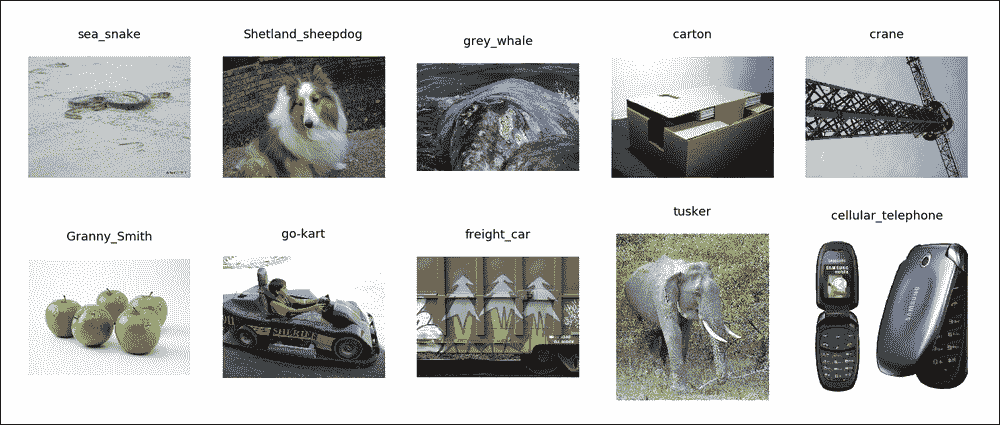

图 9.1:ImageNet 数据集的一个小样本

## MS-COCO 数据集

现在我们将把转移到我们将实际使用的数据集上，这个数据集被称为 **MS-COCO** (是**Microsoft-Common Objects in COntext**的缩写)。我们将使用 2014 年的数据集。如前所述，该数据集由图像及其各自的描述组成。数据集非常大(例如，训练数据集由大约 120，000 个样本组成，大小超过 15 GB)。数据集每年都会更新，然后会举行一场比赛来表彰达到最高水平的团队。当目标是实现最先进的性能时，使用完整的数据集非常重要。然而，在我们的例子中，我们想要学习一个合理的模型，它能够建议图像中的一般内容。因此，我们将使用一个较小的数据集(约 40，000 张图片和约 200，000K 个标题)来训练我们的模型。*图 9.2* 包括一些可用的样本:

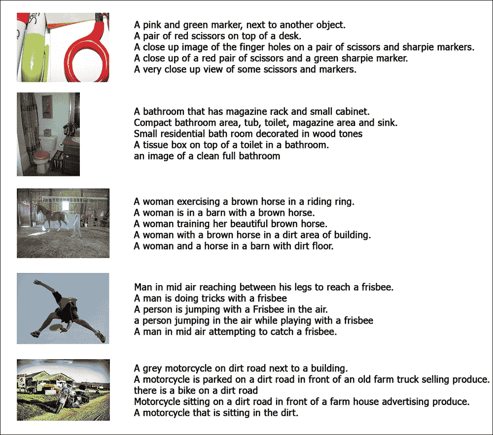

图 9.2:MS-COCO 数据集的一个小样本

为了学习和测试我们的端到端图像字幕生成模型，我们将使用官方 MS-COCO 数据集网站上提供的 2014 年验证数据集。该数据集包含大约 41，000 张图像和大约 200，000 个标题。我们将使用 1，000 个样本的初始集作为验证集，其余的作为训练集。

### 注意

在实践中，您应该使用单独的数据集进行测试和验证。然而，由于我们使用的数据有限，为了最大限度地学习，我们考虑使用相同的数据集进行测试和验证。

在*图 9.3* 中，我们可以看到在验证集中发现的一些图像。这些是从验证集中精选的一些例子，代表了各种不同的对象和场景。我们将使用这些来目视检查结果，因为目视检查验证集中的所有 1，000 个样本是不可行的:

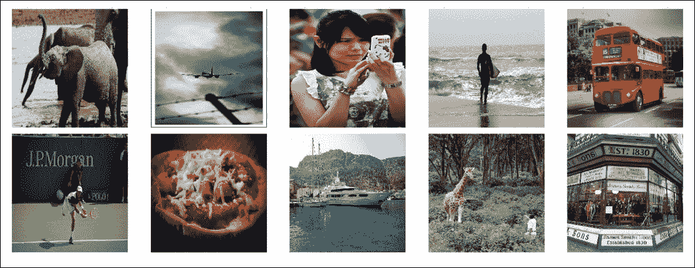

图 9.3:一个看不见的图像，我们用它来测试我们算法的图像标题生成能力


# 图像字幕生成的机器学习管道

在这里，我们将从一个非常高的层次来看图像字幕生成管道，然后一点一点地讨论它，直到我们有了完整的模型。图像字幕生成框架由三个主要组件和一个可选组件组成:

*   CNN 为图像生成编码矢量
*   学习单词向量的嵌入层
*   (可选)适配层，可以将给定的嵌入维度转换为任意维度(细节将在后面讨论)
*   LSTM，获取图像的编码矢量，并输出相应的字幕

首先，让我们看看 CNN 生成图像的编码向量。我们可以通过首先在大型分类数据集(如 ImageNet)上训练 CNN，并使用该知识生成图像的压缩矢量化表示来实现这一点。

有人可能会问，为什么不把图像原样输入到 LSTM 呢？让我们回到上一章所做的简单计算:

> "输入层中 500 个单位的增加导致 200，000 个参数的增加."

我们这里处理的图像在 224 × 224 × 3 ~ 15 万左右。这应该可以让您了解这会导致 LSTM 的参数数量增加。因此，找到一个压缩的表示是至关重要的。LSTMs 不适合直接处理原始图像数据的另一个原因是，与使用 CNN 来处理图像数据相比，它不是非常直接。

### 注意

存在 lstm 的卷积变体，称为卷积 lstm。卷积 LSTMs 能够通过使用卷积运算来处理图像输入，而不是完全连接的层。这种网络大量用于时空问题(例如，天气数据或视频预测)，这些问题具有数据的空间和时间维度。你可以在*视觉识别与描述的长期递归卷积网络*、*杰夫·多纳休*、*等*、*IEEE 计算机视觉与模式识别会议论文集(2015)* 中阅读更多关于卷积 LSTMs 的内容。

虽然训练程序完全不同，但我们在这个训练过程中的目标与我们学习词嵌入后所达到的目标相似。对于词嵌入，我们希望相似的单词具有相似的向量(即高相似度)，不同的单词具有不同的向量(即低相似度)。换句话说，如果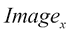表示为图像 *x* 获得的编码向量，那么我们应该得到:

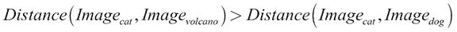

接下来，我们将学习通过从 MS-COCO 数据集中的所有标题中提取所有单词而创建的文本语料库的词嵌入。同样，学习词嵌入有助于我们降低 LSTM 输入的维数，也有助于我们产生更有意义的特征作为 LSTM 的输入。然而，这也服务于管道中的另一个关键目的。

当我们使用 LSTM 生成文本时，我们要么使用单词的一键编码表示，要么使用词嵌入/向量。因此，LSTM 的输入总是固定大小的。如果输入大小是动态的，我们就不能用标准的 LSTMs 来处理它。然而，我们不必担心这一点，因为我们只处理文本。

然而，在这种情况下，我们同时处理图像和文本，我们需要确保编码的图像向量和对应于该图像标题的每个单词的表示都具有相同的维度。此外，使用单词向量，我们可以为所有单词创建任意固定长度的特征表示。因此，我们使用单词向量来匹配图像编码向量长度。

最后，我们将为每个图像创建一个数据序列，其中序列的第一个元素是图像的矢量化表示，随后是图像标题中每个单词的单词向量，顺序如下。然后，我们将使用这个数据序列来训练 LSTM，就像我们之前所做的那样。

这种方法类似于 *Show，Attend and Tell:带视觉注意的神经图像字幕生成*、*徐等*、*第 32 届国际机器学习会议论文集(2015)* 中的方法。该过程如图 9.4 中的*所示:*

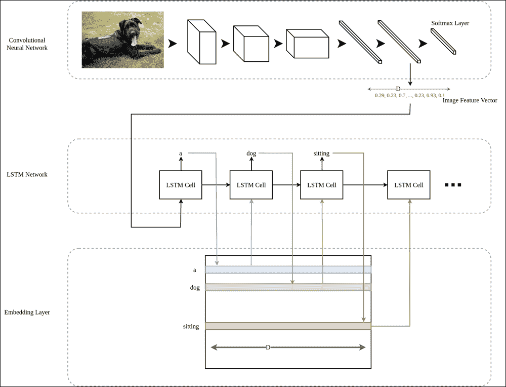

图 9.4:用于生成图像标题任务训练的机器学习管道


# 用细胞神经网络提取图像特征

有了对整个管道的高级理解，我们现在将详细讨论如何使用 CNN 提取图像的特征向量。为了获得好的特征向量，我们首先需要用图像及其相应的类别来训练 CNN，或者使用互联网上免费提供的经过预训练的 CNN。如果我们从头开始训练 CNN，我们将*重新发明轮子*，因为有预先训练好的模型可以免费下载。我们还需要记住如果 CNN 需要能够描述许多对象，它需要在对应于各种对象的一组类上进行训练。这就是为什么在大型数据集(如 ImageNet)上训练的模型(例如，与在只有 10 个不同类的小型数据集上训练相比)很重要。正如我们前面看到的，ImageNet 包含 1000 个对象类别。这对我们试图解决的任务来说绰绰有余。

但是，请记住，ImageNet 包含大约 100 万张图像。还有，既然有 1000 节课，我们就不能用一个结构简单的小 CNN(比如层数很少的 CNN)来学好。我们需要更强大和更深入的 CNN，但由于 CNN 的复杂性和数据集本身的复杂性，在 GPU 上训练这样一个网络可能需要几天(甚至几周)。例如，VGG(一个著名的 CNN，在 ImageNet 上产生了非常好的分类准确性)可能需要 2-3 周的时间来训练。

因此，我们需要更聪明的方法来解决这个问题。幸运的是，像 VGG 这样的 CNN 很容易下载，所以我们可以使用它们，不需要任何额外的培训。这些被称为**预训练模型**。使用预训练模型可以让我们节省几周的计算时间。这很容易，因为我们所需要的只是学习到的 CNN 的权重和实际结构来重建网络，并立即使用它进行推理。

在这个练习中，我们将使用 VGG CNN(在[http://www.cs.toronto.edu/~frossard/post/vgg16/](http://www.cs.toronto.edu/~frossard/post/vgg16/)有售)。VGG 建筑在 2014 年 ImageNet 竞赛中获得第二名。VGG 有几种变体:13 层的深层网络(VGG-13)，16 层的深层网络(VGG-16)，和 19 层的深层网络(VGG-19)。我们将使用 16 层深的 VGG-16。图 9.5 显示了 VGG-16 网络:

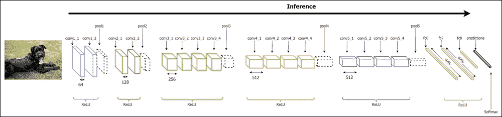

图 9.5:16 层 VGG 架构


# 实现–使用 VGG 加载砝码并进行推理-

[sard/post/vgg16/](http://sard/post/vgg16/) 提供权重作为 NumPy 数组的字典。对应于 VGG-16 的 16 层，有 16 个权值和 16 个偏差值。它们保存在以下注册表项下:

```
conv1_1_W, conv1_1_b, conv1_2_W, conv1_2_b, conv2_1_W, conv2_1_b…
```

首先，从网站下载文件，放在`ch9/image_caption_data`文件夹中。现在我们将讨论实现，从加载下载的 CNN 到用我们将使用的预训练 CNN 进行预测。首先，我们将讨论如何创建必要的TensorFlow变量并用下载的权重加载它们。接下来，我们将定义一个输入读取管道来读取图像作为 CNN 的输入，以及几个预处理步骤。然后，我们将为 CNN 定义推理操作，以获得对输入的预测。然后，我们将定义计算来获得类别，以及 CNN 认为最适合给定输入的类别预测。为图像生成标题不需要最后一个操作；然而，确保我们已经正确配置了预训练的 CNN 是很重要的。

## 构建和更新变量

我们首先将包含 CNN 权重的 NumPy 数组字典加载到内存中，如下所示:

```
weight_file = os.path.join('image_caption_data', 'vgg16_weights.npz')
weights = np.load(weight_file)
```

然后，我们将创建TensorFlow变量，并为它们分配实际权重。此外，这可能会占用相当多的内存。因此，为了避免崩溃，我们将特别要求 TensorFlow 将它保存在 CPU 上，而不是 GPU 上。我们将在这里概述构建和加载具有正确权重的 TensorFlow 变量的代码。我们将首先在一个 Python 列表`TF_SCOPES`中定义所有的字典键(表示 CNN 的不同层 id)。然后，我们将迭代通过每个层 ID，同时使用相应的权重矩阵和偏置向量作为初始值，到根据相应层 ID 命名的特定TensorFlow变量:

```
def build_vgg_variables(npz_weights):
    '''
    Build the required tensorflow variables to 
    populate the VGG-16 model
    and populate them with actual weights
    :param npz_weights: loaded weights as a dictionary
    :return:
    '''

    params = []
    print("Building VGG Variables (Tensorflow)...")

    with tf.variable_scope('CNN'):
        # Iterate through each convolution and fully connected layer
        # and create TensorFlow variables using variable scoping
        for si,scope in enumerate(TF_SCOPES):
            with tf.variable_scope(scope) as sc:
                weight_key, bias_key = TF_SCOPES[si]+'_W',
                                       TF_SCOPES[si]+'_b'

                with tf.device('/cpu:0'):
                    weights = tf.get_variable(TF_WEIGHTS_STR,
                              initializer= npz_weights[weight_key])
                    bias = tf.get_variable(TF_BIAS_STR,
                           initializer = npz_weights[bias_key])

                    params.extend([weights,bias])

    return params
```

## 预处理输入

接下来，我们将定义一个输入管道来将图像输入到 VGG-16。为了使预测正确，VGG-16 对输入图像有以下要求:

*   输入的大小应该是`[224,224,3]`
*   输入应该具有零均值(但不是单位方差)

下面的代码创建了一个管道，它直接从一组给定的文件名中读取，应用前面的转换，并创建一批这样的转换图像。该程序在练习文件的`preprocess_inputs_with_tfqueue`功能中定义。

首先，我们将定义一个文件名队列。它保存了我们应该读取的文件名(即图像的文件名):

```
        # FIFO Queue of file names
        # creates a FIFO queue until the reader needs them
        filename_queue = tf.train.string_input_producer(filenames,
                         capacity=10, shuffle=False)
```

接下来，我们将定义一个读取器，它将文件名队列作为输入，并输出一个缓冲区，该缓冲区保存通过读取队列在任何给定时间生成的文件名而获得的图像:

```
        # Reader which takes a filename queue and read()
        # which outputs data one by one
        reader = tf.WholeFileReader()
        _, image_buffer = reader.read(filename_queue,
                          name='image_read_op')

        # Read the raw image data and return as uint8
        dec_image = tf.image.decode_jpeg(contents=
                    image_buffer,channels=3,name='decode_jpg')
        # Convert uint8 data to float32
        float_image = tf.image.convert_image_dtype(dec_image,
                      dtype=tf.float32,name= 'float_image')
```

接下来我们将进行前面提到的预处理:

```
        # Resize image to 224x224x3
        resized_image = tf.image.resize_images(float_image,[224,224])*255.0

        # For VGG, images are only zero-meaned 
        # (not standardized to unit variance)
        std_image = resized_image - tf.reduce_mean(resized_image,axis=[0,1], keepdims=True)
```

在定义预处理管道后，我们将要求 TensorFlow 一次生成一批预处理图像，而不进行混排:

```
        image_batch = tf.train.batch([std_image],
                      batch_size = batch_size, capacity = 10,
                      allow_smaller_final_batch=False,
                      name='image_batch')
```

## 推断 VGG-16

到目前为止，我们已经创建了我们的 CNN，我们已经定义了一个读取图像的管道，并通过读取保存在磁盘上的图像文件来创建一个批处理。现在我们想用从管道中读取的图像来推断 CNN。**推断**是指传递一个输入(即图像)并获得预测(即图像属于某类的概率)作为输出。为此，我们将从第一层开始迭代，直到到达 softmax 层。该过程在练习文件中的函数`inference_cnn`中定义。

在每一层，我们将得到如下的权重和偏差:

```
def inference_cnn(tf_inputs, device):

    with tf.variable_scope('CNN'):
        for si, scope in enumerate(TF_SCOPES):
            with tf.variable_scope(scope,reuse=True) as sc:
                weight, bias = tf.get_variable(TF_WEIGHTS_STR),
                               tf.get_variable(TF_BIAS_STR)
```

然后，对于第一卷积层，我们计算输出:

```
h = tf.nn.relu(tf.nn.conv2d(tf_inputs,weight,strides=[1,1,1,1],
               padding='SAME')+bias)
```

对于剩余的卷积层，我们计算输出，其中输入是前一层的输出:

```
h = tf.nn.relu(tf.nn.conv2d(h, weight, strides=[1, 1, 1, 1],
               padding='SAME') + bias)
```

对于池层，输出计算如下:

```
h = tf.nn.max_pool(h,[1,2,2,1],[1,2,2,1],padding='SAME')
```

然后，对于在最后一个卷积池层之后立即找到的第一个完全连接的层，我们将如下定义层输出。我们需要将来自`[batch_size, height, width, channels]`的最后一个卷积/池层的输入整形为`[batch_size, height*width*channels]`大小，因为这是一个完全连接的层:

```
h_shape = h.get_shape().as_list()
h = tf.reshape(h,[h_shape[0], h_shape[1] * h_shape[2] * h_shape[3]])
h = tf.nn.relu(tf.matmul(h, weight) + bias)
```

对于除最后一层之外的下一组完全连接的层，我们得到如下输出:

```
h = tf.nn.relu(tf.matmul(h, weight) + bias)
```

最后，对于最后一个完全连接的层，我们不应用任何类型的激活。这将是我们将输入 LSTM 的图像特征表示。这将是一个 1000 维的向量:

```
out = tf.matmul(h,weight) + bias
```

## 提取图像的矢量化表示

我们从 CNN 中提取的最重要的信息是图像特征表示。作为图像表示，我们将在应用 softmax 之前获得最后一层的网络输出。因此，对应于单个图像的向量的长度为 1000:

```
tf_train_logit_prediction = inference_cnn(train_image_batch, device)
tf_test_logit_prediction = inference_cnn(test_image_batch, device)
```

## 用 VGG-16 预测类别概率

接下来，我们将定义获取图像特征表示所需的操作，以及实际的 softmax 预测，以确保我们的模型实际上是正确的。我们将为训练数据和测试数据定义这些:

```
tf_train_softmax_prediction = tf.nn.softmax(tf_train_logit_prediction)
tf_test_softmax_prediction = tf.nn.softmax(tf_test_logit_prediction)
```

现在让我们运行这些操作，看看它们是否正常工作(参见*图 9.6* ):

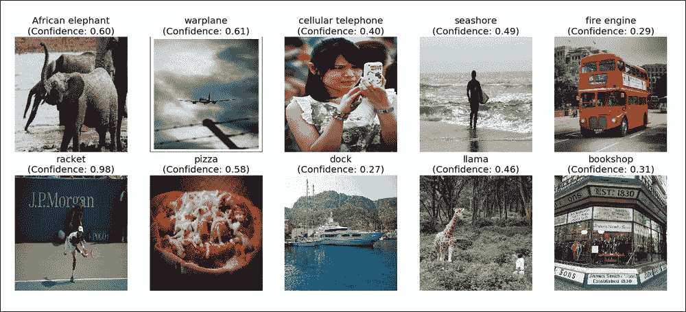

图 9.6:使用 VGG 对我们的测试图像进行分类预测

看来我们的 CNN 知道自己在做什么。当然也有分类错误的样本(比如长颈鹿被识别为羊驼)，但是大部分时候是正确的。

### 注意

当运行前面定义的操作来获得特征向量和预测时，要注意`batch_size`变量。增加这个值会使代码运行得更快。然而，如果没有足够大的 RAM 内存(> 8 GB)，也可能导致系统崩溃。如果您没有高端机器，建议您将此值保持在 10 以下。


# 学习词嵌入

接下来我们将讨论我们如何学习字幕中单词的词嵌入。首先，我们将对标题进行预处理，以减少词汇量:

```
def preprocess_caption(capt):
    capt = capt.replace('-',' ')
    capt = capt.replace(',','')
    capt = capt.replace('.','')
    capt = capt.replace('"','')
    capt = capt.replace('!','')
    capt = capt.replace(':','')
    capt = capt.replace('/','')
    capt = capt.replace('?','')
    capt = capt.replace(';','')
    capt = capt.replace('\' ',' ')
    capt = capt.replace('\n',' ') 

    return capt.lower()
```

例如，考虑下面的句子:

客厅兼餐厅有两张桌子、沙发和多把椅子。

这将转化为以下内容:

*客厅兼餐厅有两张桌子、两张沙发和多把椅子*

然后我们将使用**连续词袋** ( **CBOW** )模型来学习词嵌入，就像我们在[第 3 章](ch03.html "Chapter 3. Word2vec – Learning Word Embeddings")、*Word 2 vec——学习词嵌入*中所做的那样。在学习词嵌入时，我们必须记住的一个关键条件是，嵌入的维度应该与为图像获得的特征表示的维度相匹配，因为标准 LSTMs 不能处理动态大小的输入。

如果我们要使用预训练的词嵌入，嵌入的维度很可能不同于图像特征表示的大小。在这种情况下，我们可以使用适配层(类似于神经网络的层)来将单词向量维度匹配到图像特征表示维度。稍后，我们将看到一个这样的练习。

现在让我们来看看跑完 100，000 步后学到的一些词嵌入:

```
Nearest to suitcase: woman
Nearest to girls: smart, racket
Nearest to barrier: obstacle
Nearest to casings: exterior
Nearest to normal: lady
Nearest to developed: natural
Nearest to shoreline: peninsula
Nearest to eating: table
Nearest to hoodie: bonnet
Nearest to prepped: plate, timetable
Nearest to regular: signs
Nearest to tie: pants, button
```


# 准备输入 LSTMs 的字幕

现在，在提供单词向量和图像特征向量之前，我们需要对字幕数据执行一些预处理步骤。

在预处理之前，让我们看一些关于字幕的基本统计数据。一个标题平均大约有十个单词，标准偏差大约为两个单词。这一信息对于我们删减不必要的长标题很重要。

首先，根据前面的统计数据，让我们将允许的最大标题长度设置为 12。

接下来我们介绍两个新的单词token，SOS 和 EOS。 **SOS** 表示一个句子的**开始，而 **EOS** 表示一个句子**的**结束。这些有助于 LSTM 识别句子的开头和结尾。**

接下来，我们将为长度小于 12 的标题添加 EOS 标记，使其长度为 12。

因此，考虑下面的标题:

*一名男子手持球拍站在网球场上*

这将如下所示:

*SOS 一名男子手持球拍站在网球场上*

考虑这个标题:

*一只猫坐在桌子上*

它将变成如下:

*SOS 一只猫坐在桌子上 EOS EOS EOS EOS EOS*

但是，请考虑下面的标题:

*一个光线充足、装饰精美的客厅，透过走廊可以看到一扇玻璃前门*

这将变成如下内容:

一个光线充足、装饰良好的客厅展示了一个 EOS

注意，即使被截断后，图像的上下文仍然大部分被保留。

使所有的标题长度相同是很重要的，这样我们就可以处理一批图像和标题，而不是一个接一个地处理它们。


# 为 LSTMs 生成数据

这里我们将定义如何提取一批数据来训练 LSTM。每当我们处理新的一批数据时，第一个输入应该是图像特征向量，标签应该是`SOS`。我们将定义一批数据，其中，如果`first_sample`布尔值为`True,`，则从图像特征向量中提取输入，如果`first_sample`为`False`，则从词嵌入中提取输入。此外，在生成一批数据后，我们将光标移动一位，这样，下次生成一批数据时，我们将获得序列中的下一项。这样，我们可以展开 LSTM 的数据批次序列，其中该序列的第一批次是图像特征向量，随后是对应于该批次图像的字幕的词嵌入。

```
# Fill each of the batch indices
for b in range(self._batch_size):

    cap_id = cap_ids[b] # Current caption id
    # Current image feature vector
    cap_image_vec = self._image_data[self._fname_caption_tuples[
                                     cap_id][0]]
    # Current caption
    cap_text = self._fname_caption_tuples[cap_id][1]

    # If the cursor exceeds the length of the caption, reset
    if self._cursor[b]+1>=self._cap_length:
        self._cursor[b] = 0

    # If we're processing a fresh set of cap IDs
    # The first sample should be the image feature vector
    if first_sample:
        batch_data[b] = cap_image_vec
        batch_labels[b] = np.zeros((vocabulary_size),
                          dtype=np.float32)
        batch_labels[b,cap_text[0]] = 1.0
    # If we're continuing from an already processed batch
    # Keep producing the current word as the input and 
    # the next word as the output
    else:
        batch_data[b] = self._word_embeddings[
                        cap_text[self._cursor[b]],:]
        batch_labels[b] = np.zeros((vocabulary_size),
                          dtype=np.float32)
        batch_labels[b,cap_text[self._cursor[b]+1]] = 1.0

        # Increment the cursor
        self._cursor[b] = (self._cursor[b]+1)%self._cap_length
```

对于`batch_size=1`和`num_unrollings=5`，我们将数据生成过程可视化，如下图所示。为了有一个更大的批量，你可以对`batch_size`数量的这种序列并行执行。

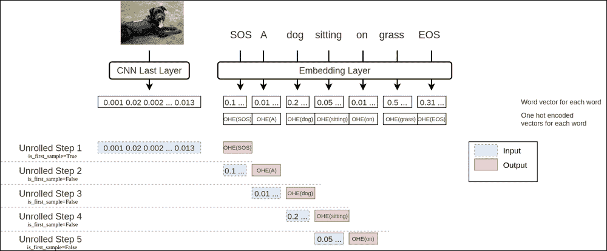

图 9.7:数据生成的可视化


# 定义 LSTM

既然我们已经定义了数据生成器来输出一批数据，从一批图像特征向量开始，然后是各个图像的逐字标题，我们将定义 LSTM 单元。LSTM 的定义和训练程序与我们在前一章观察到的相似。

我们将首先定义 LSTM 池的参数。用于输入门、遗忘门、输出门以及用于计算候选值的两组权重和偏差:

```
# Input gate (i_t) - How much memory to write to cell state
# Connects the current input to the input gate
ix = tf.Variable(tf.truncated_normal([embedding_size, num_nodes], stddev=0.01))
# Connects the previous hidden state to the input gate
im = tf.Variable(tf.truncated_normal([num_nodes, num_nodes], stddev=0.01))
# Bias of the input gate
ib = tf.Variable(tf.random_uniform([1, num_nodes],0.0, 0.01))

# Forget gate (f_t) - How much memory to discard from cell state
# Connects the current input to the forget gate
fx = tf.Variable(tf.truncated_normal([embedding_size, num_nodes], stddev=0.01))
# Connects the previous hidden state to the forget gate
fm = tf.Variable(tf.truncated_normal([num_nodes, num_nodes], stddev=0.01))
# Bias of the forget gate
fb = tf.Variable(tf.random_uniform([1, num_nodes],0.0, 0.01))

# Candidate value (c~_t) - Used to compute the current cell state
# Connects the current input to the candidate
cx = tf.Variable(tf.truncated_normal([embedding_size, num_nodes], stddev=0.01))
# Connects the previous hidden state to the candidate
cm = tf.Variable(tf.truncated_normal([num_nodes, num_nodes], stddev=0.01))
# Bias of the candidate
cb = tf.Variable(tf.random_uniform([1, num_nodes],0.0,0.01))

# Output gate - How much memory to output from the cell state
# Connects the current input to the output gate
ox = tf.Variable(tf.truncated_normal([embedding_size, num_nodes], stddev=0.01))
# Connects the previous hidden state to the output gate
om = tf.Variable(tf.truncated_normal([num_nodes, num_nodes], stddev=0.01))
# Bias of the output gate
ob = tf.Variable(tf.random_uniform([1, num_nodes],0.0,0.01))
```

然后，我们将定义 softmax 权重:

```
# Softmax Classifier weights and biases.
w = tf.Variable(tf.truncated_normal([num_nodes, vocabulary_size], stddev=0.01))
b = tf.Variable(tf.random_uniform([vocabulary_size],0.0,0.01))
```

我们现在将定义状态和输出变量，以维护训练和验证数据的 LSTM 的状态和输出:

```
# Variables saving state across unrollings.
# Hidden state
saved_output = tf.Variable(tf.zeros([batch_size, num_nodes]), trainable=False, name='test_cell')
# Cell state
saved_state = tf.Variable(tf.zeros([batch_size, num_nodes]), trainable=False, name='train_cell')

# Hidden and cell state variables for test data
saved_test_output = tf.Variable(tf.zeros([batch_size, num_nodes]),trainable=False, name='test_hidden')
saved_test_state = tf.Variable(tf.zeros([batch_size, num_nodes]),trainable=False, name='test_cell')
```

接下来我们将定义 LSTM 单元计算:

```
def lstm_cell(i, o, state):
    input_gate = tf.sigmoid(tf.matmul(i, ix) + tf.matmul(o, im) +
                           ib)
    forget_gate = tf.sigmoid(tf.matmul(i, fx) + tf.matmul(o, fm) +
                            fb)
    update = tf.matmul(i, cx) + tf.matmul(o, cm) + cb
    state = forget_gate * state + input_gate * tf.tanh(update)
    output_gate = tf.sigmoid(tf.matmul(i, ox) + tf.matmul(o, om) +
                            ob)
    return output_gate * tf.tanh(state), state
```

然后，我们将在每个训练步骤迭代计算`num_unrollings`步骤的 LSTM 单元的状态和输出:

```
# These two python variables are iteratively updated
# at each step of unrolling
output = saved_output
state = saved_state

# Compute the hidden state (output) and cell state (state)
# recursively for all the steps in unrolling
for i in train_inputs:
    output, state = lstm_cell(i, output, state)
    # Append each computed output value
    outputs.append(output)

# Calculate the score values
logits = tf.matmul(tf.concat(axis=0, values=outputs), w) + b

# Predictions.
train_prediction = tf.nn.softmax(logits)
```

然后，在将自动 LSTM 的输出和状态保存到我们之前定义的变量后，我们将通过在展开的轴上求和并在批处理轴上取平均值来计算损耗:

```
# State saving across unrollings.
with tf.control_dependencies([saved_output.assign(output),
                            saved_state.assign(state)]):
    # When define the loss we need to sum accross all time steps
    # But average across the batch axis
    loss = 0
    split_logits = tf.split(logits,num_or_size_splits=num_unrollings)

    for lgt,lbl in zip(split_logits, train_labels):
        loss += tf.reduce_mean(
            tf.nn.softmax_cross_entropy_with_logits_v2(logits=lgt,
            labels=lbl)
        )
```

最后，我们将定义一个优化器来针对损失优化 LSTM 和 softmax 层的权重:

```
optimizer = tf.train.AdamOptimizer(learning_rate)
gradients, v = zip(*optimizer.compute_gradients(loss))
gradients, _ = tf.clip_by_global_norm(gradients, 5.0)
optimizer = optimizer.apply_gradients(
    zip(gradients, v))
```

生成了图像特征向量，准备好了要馈送给 LSTM 的数据，并定义了学习 LSTM 定义所需的计算，我们现在将讨论可用于评估为验证数据集生成的标题的评估指标。


# 定量评估结果

有许多不同的技术来评估所生成字幕的质量和相关性。我们将简要讨论几个可以用来评估字幕的度量标准。我们将讨论四个指标:BLEU、ROGUE、METEOR 和 CIDEr。所有这些测量都有一个关键目标，即测量生成文本的充分性(生成文本的含义)和流畅性(文本的语法正确性)。为了计算所有这些度量，我们将使用一个候选句子和一个参考句子，其中候选句子是由我们的算法预测的句子/短语，而参考句子是我们想要与之比较的真实句子/短语。

## 蓝色

**双语评测替补** ( **BLEU** )是由帕皮尼等人在 *BLEU:一种自动评测机器翻译的方法*，*计算语言学协会(ACL)第 40 届**年会论文集*，*费城*，*2002 年 7 月(311-318* 中提出的。它以独立于位置的方式测量参考短语和候选短语之间的 n 元语法相似性。这意味着来自候选的给定 n-gram 出现在参考句子中的任何地方，并且被认为是匹配的。BLEU 根据精度计算 n-gram 相似度。BLEU 有几种变体(BLEU-1、BLEU-2、BLEU-3 等等)，表示 n-gram 中 *n* 的值。

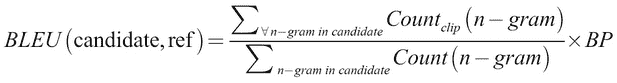

这里， *Count(n-gram)* 是候选句子中给定 n-gram 的总出现次数。*Count[clip]**(n-gram)*是计算给定 n-gram 的 *Count(n-gram)* 并通过最大值裁剪该值的度量。n 元语法的最大值计算为该 n 元语法在参考句子中出现的次数。例如，考虑这两个句子:

候选人:the the the the the the the the

参考:**猫坐在**和**垫子上**

***Count("the") = 7***

***数* *夹**(“the”)= 2***

**请注意，实体，**

**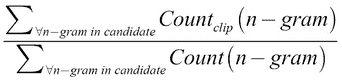**

**，是精度的一种形式。实际上，它被称为修正的 n-gram 精度。当存在多个参考时，BLEU 被认为是最大值:**

****

**然而，对于较小的候选短语，修改的 n 元语法精度往往更高，因为该实体被除以候选短语中的 n 元语法的数量。这意味着该度量将使模型倾向于产生更短的短语。为了避免这种情况，一个惩罚项， *BP* 被添加到前面的项中，它也惩罚短的候选短语。BLEU 具有几个限制，例如 BLEU 在计算分数时忽略同义词，并且不考虑回忆，回忆也是测量准确度的重要度量。此外，对于某些语言来说，BLEU 似乎不是一个好的选择。然而，这是一个简单的度量，已经发现在大多数情况下与人类的判断有很好的相关性。我们将在下一章更详细地讨论 BLEU。**

## **胭脂**

****(**ROUGE**)是林金耀在*ROUGE:A Package for Automatic Evaluation of Summaries*，*Proceedings on the Workshop on Text summary brands Out(2004)*中提出的面向回忆的摘要评价替补，可以被识别为 BLEU 的一种变体，并使用回忆作为基本的性能度量。流氓指标如下所示:****

****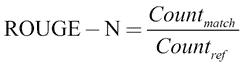****

****这里，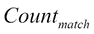是来自引用中存在的候选的 n 元文法的数量，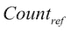是引用中存在的总 n 元文法。如果存在多个引用，则 *ROUGE-N* 计算如下:****

****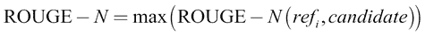****

****这里， *ref* *i* 是可用引用池中的单个引用。ROGUE measure 有许多变体，它们对标准 ROGUE metric 进行了各种改进。ROGUE-L 基于在候选句子和参考句子对之间找到的最长公共子序列来计算分数。注意，在这种情况下，最长公共子序列不需要连续。接下来，ROGUE-W 基于最长的公共子序列计算分数，该分数由子序列中存在的碎片数量来惩罚。ROGUE 也受到限制，例如在计算分数时不考虑精确度。****

## ****流星****

******由迈克尔登科夫斯基和阿隆·拉维在*METEOR Universal:Language Specific Translation Evaluation for Any Target Language*、*Proceedings of the first Workshop on Statistical Machine Translation(2014):376-380*中提出的具有显式排序的翻译评估度量** ( **METEOR** )，是一种更高级的评估度量，对候选句子和参考句子进行对齐。《流星》不同于《蓝色》和《胭脂》，因为《流星》考虑到了文字的位置。当计算候选句子和参考句子之间的相似性时，以下情况被视为匹配:****

*   ******精确**:候选单词与参考句子中的单词精确匹配****
*   ******词干**:词干单词(例如，单词 walk 的 walk)匹配参考句子中的单词****
*   ******同义词**:候选句子中的单词是参考句子中单词的同义词****

****为了计算流星分数，参考句子和候选句子之间的匹配可以在表格的帮助下如图 9.8 所示。然后，基于候选句子和参考句子中存在的匹配数量来计算精度( *P* )和召回( *R* )值。最后，使用 *P* 和 *R* 的调和平均值来计算流星分数:****

****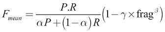****

****这里，α、β和γ是可调参数，并且 *frag* 惩罚分段匹配，以便优选在匹配中具有较少间隙的候选句子，并且紧密遵循参考句子的单词顺序。 *frag* 通过查看最终单图映射中的交叉数来计算(*图 9.8* ):****

****

图 9.8:两个字符串不同的可能排列**** ****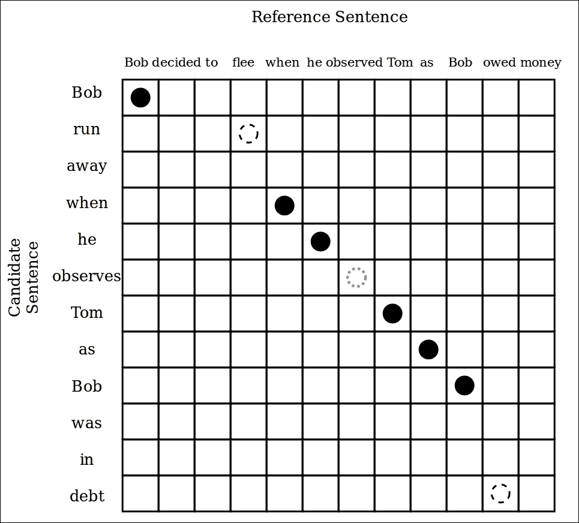

图 9.9:流星词匹配表**** 

****你可以看到，我们用圆圈和椭圆表示候选句子和参考句子之间的匹配。例如，我们用实心黑色圆圈表示精确匹配，用虚线空心圆圈表示同义词，用虚线圆圈表示词干匹配。****

****METEOR 在计算上更复杂，但经常被发现比 BLEU 更与人的判断相关，这表明 METEOR 是比 BLEU 更好的评估度量。****

## ****苹果酒****

******基于共识的图像描述评估** ( **CIDEr** )，由 *Ramakrishna Vedantam 等人*在*CIDEr:Consensus-based Image Description Evaluation*、 *IEEE 计算机视觉与模式识别会议(CVPR)* 、 *2015* 中提出，是评估候选句子对给定的一组参考语句的一致性的另一种度量。CIDEr 被定义为用来衡量候选句子的语法性、显著性和准确性(即精确度和召回率)。****

****首先，CIDEr 通过 TF-IDF 对候选句子和参考句子中发现的每个 n-gram 进行加权，以便更常见的 n-gram(例如，如果以单词为例， *a* 和 *the* )将具有更小的权重，而罕见单词将具有更高的权重。最后，通过在候选句子和参考句子中找到的 TF-IDF 加权 n 元文法形成的向量之间的余弦相似度来计算 CIDEr:****

****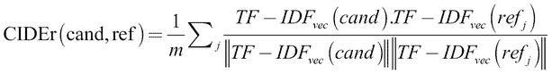****

****这里， *cand* 是候选句， *ref* 是参考句的集合，*ref[j]是 *ref* 的*j^(th)句， *m* 是给定候选句的参考句数。最重要的是，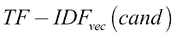是为候选句子中的所有 n 元语法计算的 TF-IDF 值，并形成一个向量。同为参考句的向量，*ref[I]。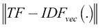表示矢量的大小。*******

****总的来说，应该注意的是，没有一个明显的赢家能够在自然语言处理中的所有不同任务中表现良好。这些指标在很大程度上取决于任务，应该根据任务仔细选择。****

## ****我们模型的 BLEU-4 随时间的变化****

****在*图 9.10* 中，我们报告了我们实验中 BLEU-4 值的演变。我们可以看到，分数随着时间的推移而上升，接近 0.3。请注意，MS-COCO 数据集的当前技术水平(在撰写本文时)约为 0.369 ( *自下而上和自上而下关注图像字幕和视觉问题回答*、 *Anderson 等人*、 *2017* )，这是通过更复杂的模型以及采用更高级的正则化获得的。此外，MS-COCO 的实际完整训练集几乎是我们使用的训练集的三倍。因此，具有有限训练数据、单个 LSTM 单元和没有特殊正则化的 0.3 的 BLEU-4 分数是相当好的结果:****

****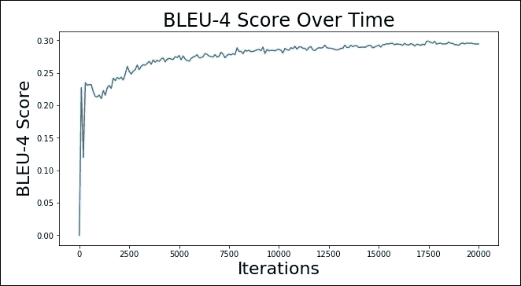

图 9.10:一段时间内图像标题生成示例的 BLEU-4**** ****

# 为测试图像生成的字幕

让我们看看为测试图像生成了什么样的标题。

经过 100 步，我们的模型唯一学到的就是标题以一个`SOS`记号开始，后面还有一些单词和一堆`EOS`记号(见*图 9.11* ):

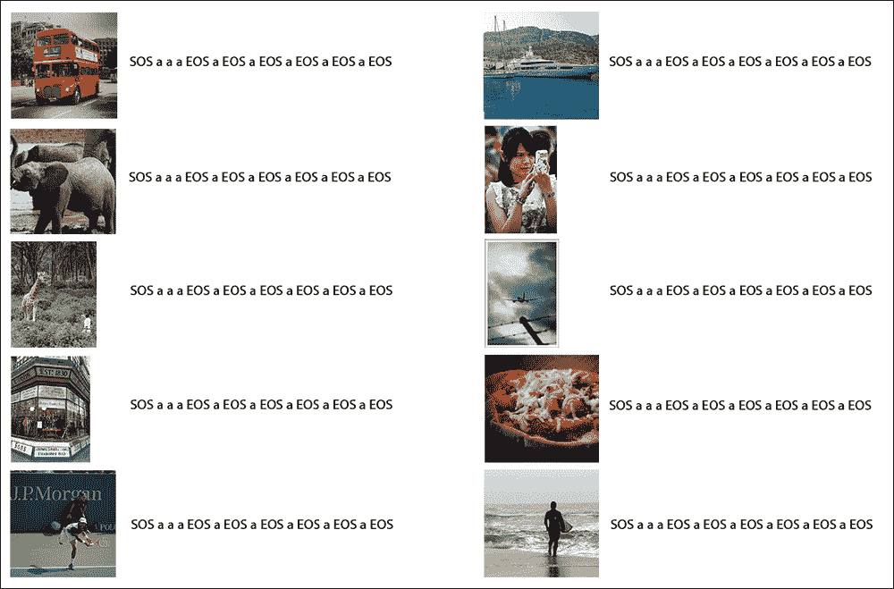

图 9.11:100 步后生成的标题

经过 1000 步后，我们的模型知道生成稍微有点语义的短语，并正确识别一些图像中的对象(例如，一个拿着网球拍的男人，如图*图 9.12* )。然而，文字似乎很短，含糊不清，此外，几个图像描述不正确:


图 9.12:1000 步后生成的标题

经过 2000 步之后，我们的模型已经能够很好地生成由适当语法组成的表达性短语(见*图 9.13* )。图像不是像我们之前在步骤 1，000 中看到的那样用小而模糊的短语来描述的:


图 9.13:2000 步后生成的标题

经过 5000 步后，我们的模型现在可以正确识别大多数图像(参见*图 9.14* )。此外，它可以生成非常相关和语法正确的短语，解释图像中正在发生的事情。但是，注意，它并不完美。例如，我们的算法得到的第四幅图像是完全错误的。图像实际上是一座建筑，而我们的算法知道它是城市的东西，但无法区分建筑，误认为是时钟。第八个图像也被错误地识别。该图像描绘了天空中的一架飞机，但算法将其误认为一个正在放风筝的人:

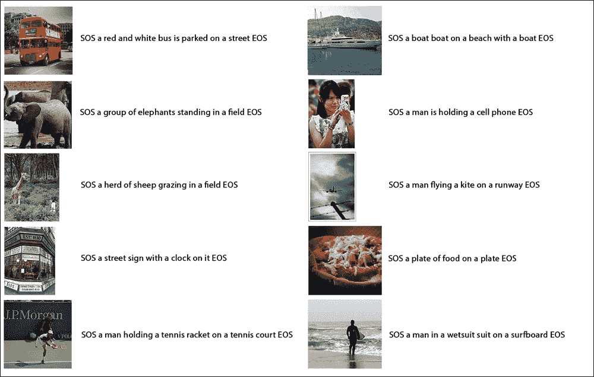

图 9.14:5000 步后生成的标题

经过 10000 步，我们的算法已经相当擅长描述图像了。它正确地描述了大部分的图像，但是仍然得到了第九个错误的图像。图像显示的是一个披萨，算法似乎认为这是一个三明治(见*图 9.15* )。另一个观察结果是，第七个图像实际上是一个拿着手机的女人，但算法似乎认为这是一个男人。然而，我们可以看到在该图像的背景中有人，因此该算法可能会将前景中的人误认为背景中的人。从这一点出发，该算法生成图像中发生的不同变化，因为每个图像都有多个用于训练的标题:

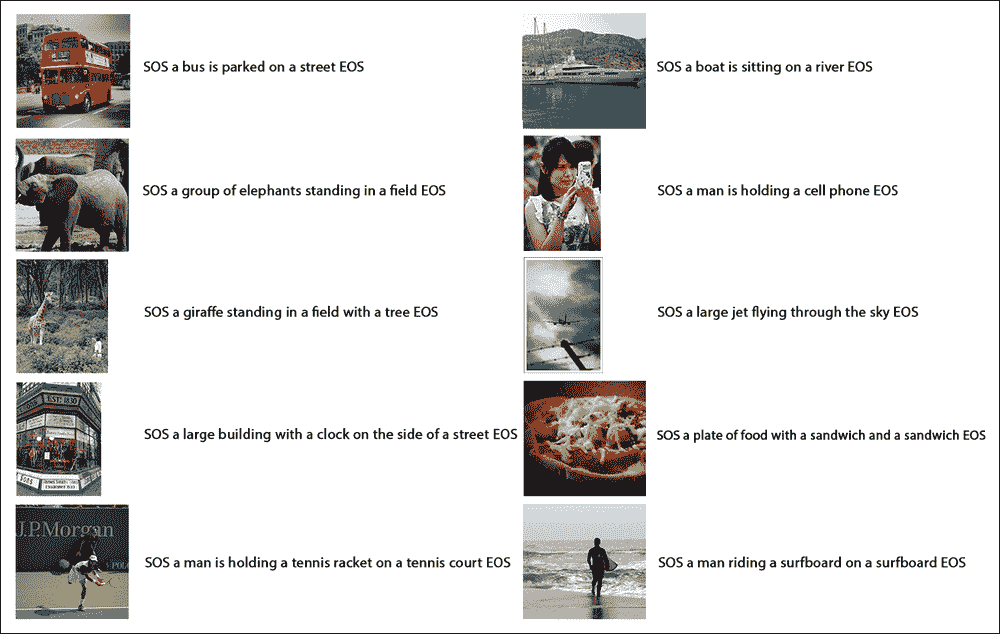

图 9.15:10，000 步后生成的标题

请记住，这些是仅使用大约三分之一的完整可用训练数据获得的结果。此外，我们使用一个简单的单细胞 LSTM。我们鼓励您尝试通过使用全套训练数据来最大化性能，并使用具有更好正则化(丢失)的多层 LSTMs(或 gru)。


# 使用 TensorFlow RNN API 和预训练的手套字向量

到目前为止，我们已经从零开始实现了所有的东西，以便理解这样一个系统的底层机制。在这里，我们将讨论如何使用TensorFlow RNN API 以及预训练的手套字向量，以减少算法的代码量和学习量。这将作为一个练习出现在`ch9`文件夹中的`lstm_image_caption_pretrained_wordvecs_rnn_api.ipynb`笔记本中。

我们将首先讨论如何下载单词向量，然后讨论如何仅从下载的文件中加载相关的单词向量，因为预训练的手套向量的词汇量大约为 400，000 个单词，而我们的只有 18，000 个单词。接下来，我们将对字幕进行一些基本的拼写纠正，因为似乎有很多拼写错误。然后我们将讨论如何使用 RNN API 中的`tf.nn.rnn_cell.LSTMCell`模块来处理清理后的数据。

## 加载手套字向量

首先，在[https://nlp.stanford.edu/projects/glove/](https://nlp.stanford.edu/projects/glove/)下载手套嵌入文件，并将其放在`ch9`文件夹中。接下来，我们将定义一个 NumPy 数组来保存从 GloVe 加载的相关单词向量:

```
pret_embeddings = np.empty(shape=(vocabulary_size,50),
                          dtype=np.float32)
```

然后我们将打开包含下载的手套单词向量的 ZIP 文件并逐行阅读。ZIP 文件包含几种不同的手套变体，具有不同的嵌入尺寸(例如 50，100)。我们将使用 ZIP 文件中的`glove.6B.50d.txt`文件，因为这是最小的文件，对于我们试图解决的问题来说已经足够了。文件中的每一行都将采用以下格式(每一行中的每个值都用空格分隔):

```
dog 0.11008 -0.38781 -0.57615 -0.27714 0.70521 ...
```

在下面的代码中，我们展示了如何从文件中提取相关的词嵌入。首先，我们将打开 ZIP 文件并读取我们识别的文本文件(`glove.6B.50d.txt`):

```
with zipfile.ZipFile('glove.6B.zip') as glovezip:
    with glovezip.open('glove.6B.50d.txt') as glovefile:
```

接下来我们将枚举文本文件中的每一行，并读取`line`对应的单词(即该行的第一个元素)，还读取该单词对应的`word`向量:

```
for li, line in enumerate(glovefile):
    # Decode the line to get rid of any
    # unparsable symbols
    line_tokens = line.decode('utf-8').split(' ')

    # Get the word
    word = line_tokens[0]

    # Get the vector
    vector = [float(v) for v in line_tokens[1:]]
```

然后，如果在我们的数据集中找到这个单词，我们将把这个向量保存在我们之前定义的保存单词向量的 NumPy 数组中。我们将在由我们的`dictionary`变量给出的行中保存一个给定的向量，该变量保存单词到唯一 ID 的映射。同时，除了给定的单词，我们还会对单词末尾加一个撇号和`s`产生的单词进行处理(例如*猫* *→* *猫的*)。我们用对应于原始单词的`word`向量(例如*猫*)初始化这两种变体，因为手套文件不包含表示拥有的单词(例如*猫的*)。我们还会将标题中与手套中的某个单词匹配的所有单词保存到`words_in_glove`列表中。这将用于下一步:

```
if word in dictionary.keys():
    words_in_glove.append(word)
    pret_embeddings[dictionary[word],:] = vector
    words_found += 1
    found_word_ids.append(dictionary[word])

    word_with_s = word + '\'s'
    if word_with_s in dictionary.keys():
        pret_embeddings[dictionary[word_with_s],:] = 
            vector
        words_found += 1
        found_word_ids.append(dictionary[word_with_s])
```

## 清洗数据

现在我们不得不处理一个我们在从头开始学习单词向量时忽略的问题。MS-COCO 数据集中存在许多拼写错误(在标题中)。因此，为了最大限度地利用预先训练的单词向量，我们需要纠正这些拼写错误，以确保这些单词将被分配正确的单词向量。为了纠正拼写，我们使用以下程序。

首先，我们将计算在 GloVe 文件中没有找到的单词的 id(可能是由于拼写错误):

```
notfound_word_ids = list(set(list(range(0,vocabulary_size))) -
                        set(found_word_ids))
```

然后，如果在标题中发现了这些单词中的任何一个，我们将使用下面的逻辑来纠正这些单词的拼写。

首先，使用字符串匹配计算不正确单词(用`cw`表示)和`words_in_glove`列表中所有单词(每个单词用`gw`标识)之间的相似度:

```
# for each word not found in pretrained embeddings # we find most similar spellings
                    for gw in words_in_glove:
                        cor, found_sim = correct_spellings.correct_wrong_word(cw,gw,cap)
```

如果这个相似度大于`0.9`(启发式选择)，我们将用下面的逻辑替换不正确的单词。我们不得不手动更正一些单词，因为有些单词有多个高度相似的单词(例如， *stting* 与 *setting* 和*siting*都相似):

```
def correct_wrong_word(cw,gw,cap):

    '''
    Spelling correction logic
    This is a very simple logic that replaces
    words with incorrect spelling with the word that highest
    similarity. Some words are manually corrected as the words
    found to be most similar semantically did not match.
    '''

    correct_word = None
    found_similar_word = False
    sim = string_similarity(gw,cw)
    if sim>0.9:
        if cw != 'stting' and cw != 'sittign' and \cw != 'smilling' and \
            cw!='skiies' and cw!='childi' and cw!='sittion' and \
            cw!='peacefuly' and cw!='stainding' and \
            cw != 'staning' and cw!='lating' and cw!='sking' and \
            cw!='trolly' and cw!='umping' and cw!='earing' and \
            cw !='baters' and cw !='talkes' and cw !='trowing' and \
            cw !='convered' and cw !='onsie' and cw !='slying':
            print(gw,' ',cw,' ',sim,' (',cap,')')
            correct_word = gw
            found_similar_word = True
        elif cw == 'stting' or cw == 'sittign' or cw == 'sittion':
            correct_word = 'sitting'
            found_similar_word = True
        elif cw == 'smilling':
            correct_word = 'smiling'
            found_similar_word = True
        elif cw == 'skiies':
            correct_word = 'skis'
            found_similar_word = True
        elif cw == 'childi':
            correct_word = 'child'
            found_similar_word = True
        .
        .
        .
        elif cw == 'onsie':
            correct_word = cw
            found_similar_word = True
        elif cw =='slying':
            correct_word = 'flying'
            found_similar_word = True
        else:
            raise NotImplementedError

    else:
        correct_word = cw
        found_similar_word = False
return correct_word, found_similar_word
```

虽然不是所有的拼写错误都会被前面的代码捕获，但是大部分都会被捕获。同样，这对于我们的练习也是足够的。

## 通过 TensorFlow RNN API 使用预训练嵌入

在我们预处理了字幕数据之后，我们将继续学习如何使用 RNN API 进行预训练的手套嵌入。我们将首先讨论如何使手套向量(50)的嵌入大小与图像特征向量(1，000)的大小相匹配。此后，我们将探索如何使用 TensorFlow RNN API 的现成 LSTM 模块从数据中学习。最后，我们将学习如何将不同形式的数据(图像和文本)输入到模型中，因为图像和文本必须进行不同的处理。我们现在将逐步讨论细节。我们在图 9.16 中将完整学习模型描述为一个图表:

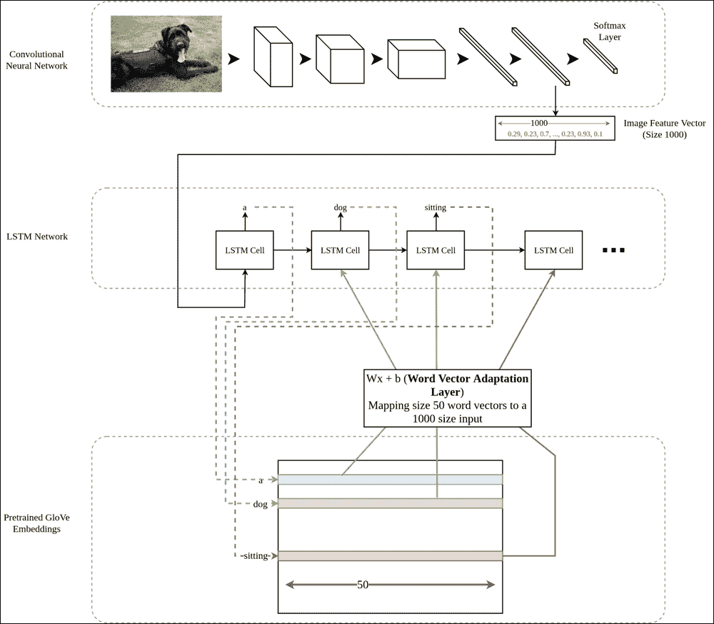

图 9.16:使用 TensorFlow RNN API 预训练手套嵌入

### 定义预训练嵌入层和适配层

我们将首先定义一个 TensorFlow 变量来包含预训练的嵌入。我们将把这个作为一个可训练变量，因为我们只对一些单词进行了粗略的初始化(也就是说，我们对单词的`'s`扩展使用了相同的单词向量)。所以单词向量会随着训练的继续而提高:

```
embeddings = tf.get_variable(
        'glove_embeddings',shape=[vocabulary_size, 50],
        initializer=tf.constant_initializer(pret_embeddings,
        dtype=tf.float32)
)
```

然后，我们将定义适应层的权重和偏差。适配层接受一个`[batch_size, 50]`大小的输入，这是一批手套字向量，我们将将其转换为一批`[batch_size, 1000]`大小的向量。这将作为一个线性层，使手套字向量适应正确的输入大小(以匹配图像特征向量的大小):

```
with tf.variable_scope('embeddings'):
    # We need to match the size of the input to the LSTM to
    # be same as input_size always
    # For that we use a dense layer that will take the input
    # of size 50 and produce inputs of size 1000 (input size)
    embedding_dense = tf.get_variable('embedding_dense',
                      shape=[50,1000],
                      dtype=tf.float32,
              initializer=tf.contrib.layers.xavier_initializer())
    embedding_bias = tf.get_variable('embedding_bias',
                     dtype=tf.float32,
                     initializer=tf.random_uniform(
                         shape=[1000],
                         minval=-0.1,
                         maxval=0.1))
```

### 定义 LSTM 单元和 softmax 层

接下来，我们将定义LSTM 单元，它学习对一幅图像进行建模，后面跟着一个单词序列，以及 softmax 层，它将 LSTM 单元的输出转换为概率预测。我们将使用`DropoutWrapper`(类似于[第八章](ch08.html "Chapter 8. Applications of LSTM – Generating Text")、【LSTM 的 T21 应用-生成文本)来提高性能:

```
# LSTM cell and Dropout Cell
with tf.variable_scope('rnn'):
    lstm = tf.nn.rnn_cell.LSTMCell(num_nodes)
    # We use dropout to improve the performance
    dropout_lstm = rnn.DropoutWrapper(
        cell=lstm, input_keep_prob=0.8,
        output_keep_prob=0.8, state_keep_prob=1.0,
        dtype=tf.float32
    )
```

这里，我们将定义 softmax 层的权重和偏差:

```
# Defining the softmax weights and biases
with tf.variable_scope('rnn'):
    w = tf.Variable(tf.truncated_normal([num_nodes, vocabulary_size], stddev=0.01),name='softmax_weights',trainable=True)
    b = tf.Variable(tf.random_uniform([vocabulary_size],0.0,0.01),name='softmax_bias',trainable=True)
```

### 定义输入和输出

我们现在将定义输入和输出占位符，它将保存训练我们的模型所需的输入和输出。我们将有三个重要的占位符来输入值:

*   `is_train_text`:这是一个`num_unrollings`长的占位符列表，其中每个占位符包含一个布尔值，表示我们当前是否在给定的时间步长馈入图像特征向量或文本。这很重要，因为我们稍后将定义一个条件输入处理操作(即，如果布尔值为`false`，则原样返回图像特征；如果布尔值为`true`，对输入执行`tf.nn.embedding_lookup`。
*   `train_inputs`:这个是一个包含`num_unrollings`占位符的占位符列表，其中每个占位符包含一个`[batch_size, 1000]`大小的输入(其中`1000`是`input_size`)。对于图像，我们将输入图像特征向量，对于文本，我们将输入标题中的一批单词 ID(由包含从单词到唯一 ID 的映射的`dictionary`变量返回)。但是，我们将为每个单词 ID 附加 999 个零，以使输入大小为 1，000(其中 999 个零在处理时被丢弃)。
*   `train_labels`:这是具有`num_unrollings`占位符的占位符的列表，这些占位符将包含给定输入的相应输出(即 SOS，如果输入是图像特征向量，或者是标题中的下一个单词，如果输入是标题中的一个单词)。

代码如下所示:

```
is_train_text, train_inputs, train_labels = [],[],[]

for ui in range(num_unrollings):
    is_train_text.append(tf.placeholder(tf.bool,
        shape=None, name='is_train_text_data_%d'%ui))
    train_inputs.append(tf.placeholder(tf.float32,
        shape=[batch_size,input_size],name='train_inputs_%d'%ui))
    train_labels.append(tf.placeholder(tf.int32,
         shape=[batch_size], name = 'train_labels_%d'%ui))
```

### 不同地处理图像和文本

在这里，我们将理解与从头开始学习嵌入相比，使用预训练嵌入时最重要的区别之一。当我们从头开始学习嵌入时，我们可以灵活地使嵌入大小与图像特征向量大小相匹配。必须有相同维数的输入，因为 LSTMs 不能处理任意维数的输入。然而，由于现在我们使用的是预训练嵌入，它们与我们指定的输入大小不匹配，因此我们需要使用一个适配层，将 50 维输入映射到 1000 维输入。此外，我们需要对 TensorFlow 说我们不需要图像特征向量的先前变换。我们将详细了解如何实现这一点。

首先，我们将使用`tf.cond`操作来区分两种不同的处理机制。`tf.cond(pred, true_fn, false_fn)`操作可以在不同的操作(即`true_fn`和`false_fn`之间切换，这取决于布尔`pred`是`true`还是`false`。我们需要实现以下目标:

*   如果数据是图像的特征向量(即`is_train_text`是`false`，我们不需要额外的处理。我们将简单地转发数据，因为它使用了`tf.identity`操作。
*   如果数据是文本(单词 id)(即`is_train_text`是`true`)，我们首先需要对该批单词 id(在第 0 列找到)执行`tf.nn.embedding_lookup`操作。接下来，我们将通过适配层传递返回的字向量(大小为`[batch_size, 50]`)以使用`embedding_dense`和`embedding_bias`生成字向量`[batch_size, 1000]`(这类似于没有非线性激活的全连接神经网络的典型层)。

我们将处理后的输入写入`train_inputs_processed`:

```
train_inputs_processed = []
for ui in range(num_unrollings):

    train_inputs_processed.append(
        tf.cond(is_train_text[ui],
                lambda: tf.add(
                    tf.matmul(tf.nn.embedding_lookup(
                        embeddings, tf.reduce_sum(tf.cast(
                                       train_inputs[ui],tf.int32),
                        axis=1)
                    ),embedding_dense),embedding_bias),
                lambda: tf.identity(train_inputs[ui]))
    )
```

我们还需要设置在`train_inputs_processed`列表中找到的每个张量的形状，因为在执行`tf.cond`操作后，形状信息会丢失。此外，LSTM 像元计算需要形状信息:

```
[t_in.set_shape([batch_size,input_size]) for t_in in train_inputs_processed]
```

### 定义 LSTM 输出计算

接下来，我们将定义LSTM 单元的初始状态:

```
initial_state = lstm.zero_state(batch_size, dtype=tf.float32)
```

然后，使用`tf.nn.dynamic_rnn`函数，我们将计算`num_unrollings`窗口中所有时间步长的输出，我们将计算单步的 LSTM 输出:

```
# Gives a [num_unrolling, batch_size, num_nodes] size output
train_outputs, initial_state = tf.nn.dynamic_rnn(
    dropout_lstm, tf.concat([tf.expand_dims(t_in,axis=0) for t_in in train_inputs_processed],axis=0), 
    time_major=True, initial_state=initial_state
)
```

### 定义逻辑和预测

先前计算的`train_output`将是`[num_unrollings, batch_size, vocabulary_size]`的尺寸。这被称为**时间主要格式**。然后，为了计算所有`num_unrollings`时间步长的单次 LSTM 输出中的逻辑和预测，我们将重新调整最终输出如下:

```
final_output = tf.reshape(train_outputs,[-1,num_nodes])
logits = tf.matmul(final_output, w) + b
train_prediction = tf.nn.softmax(logits)
```

### 定义序列丢失

然后，我们将重塑逻辑和标签，使其回到主要时间格式，因为这是我们正在使用的损失函数所要求的:

```
time_major_train_logits = tf.reshape(logits,[
    num_unrollings,batch_size,vocabulary_size])

time_major_train_labels = tf.reshape(tf.concat(
    train_labels,axis=0),[num_unrollings,batch_size]) 
```

我们现在使用`tf.contrib.seq2seq.sequence_loss`函数计算损失。我们需要整个批次的平均损失，但要对时间步长求和:

```
loss = tf.contrib.seq2seq.sequence_loss(
    logits = tf.transpose(time_major_train_logits,[1,0,2]),
    targets = tf.transpose(time_major_train_labels),
    weights= tf.ones([batch_size, num_unrollings],
                    dtype=tf.float32),
    average_across_timesteps=False,
    average_across_batch=True
)
loss = tf.reduce_sum(loss)
```

### 定义优化器

最后，我们将定义优化器，该优化器将针对之前定义的损失优化预训练嵌入、适配层、LSTM 单元和 softmax 权重。我们将使用`AdamOptimizer`和学习率随时间衰减来提高性能。我们也衰减学习率，就像我们在[第 8 章](ch08.html "Chapter 8. Applications of LSTM – Generating Text")、*LSTM 的应用——生成文本*中所做的那样:

```
# This variable and operation are used to decay the learning rate
# as we saw in chapter 8
global_step = tf.Variable(0, trainable=False)
inc_gstep = tf.assign(global_step,global_step + 1)

# We define a decaying learning rate
learning_rate = tf.train.exponential_decay(
    0.001, global_step, decay_steps=1, decay_rate=0.75,
    staircase=True)
# We define Adam Optimizer
optimizer = tf.train.AdamOptimizer(learning_rate)

# Gradient clipping
gradients, v = zip(*optimizer.compute_gradients(loss))
gradients, _ = tf.clip_by_global_norm(gradients, 5.0)
optimizer = optimizer.apply_gradients(
    zip(gradients, v))
```

定义所有必要的TensorFlow操作后，您可以运行预定义数量的步骤的优化过程，通过计算测试数据上的 BLEU 分数以及预测几个测试图像来交错进行。确切的过程可以在练习文件中找到。


# 总结

在这一章中，我们关注了一个非常有趣的任务，为给定的图片生成标题。我们的学习模型是一个复杂的机器学习管道，包括以下内容:

*   使用 CNN 推断给定图像的特征向量
*   为字幕中找到的单词学习词嵌入
*   用图像特征向量和它们相应的字幕训练 LSTM

我们详细讨论了每个组件。首先，我们讨论了如何在大型分类数据集(即 ImageNet)上使用预训练的 CNN 模型来提取良好的特征向量，而无需从头开始训练模型。为此，我们使用了 16 层的 VGG。接下来，我们一步一步地讨论了如何创建TensorFlow变量，将权重加载到变量中，并创建网络。最后，我们通过模型运行了一些测试图像，以确保模型确实能够识别图像中的对象。

然后，我们使用 CBOW 算法来学习字幕中找到的单词的良好词嵌入。我们确保我们将词嵌入的维度与图像特征向量相匹配，因为标准 LSTMs 不能处理具有动态维度的输入。

最后，我们使用一个简单的 LSTM 网络，其中我们输入一个数据序列，其中第一个元素是图像特征向量，前面是对应于该图像标题中每个单词的词嵌入。首先，我们通过引入两个标记来表示每个标题的开头和结尾，然后通过截断标题来预处理标题，这样所有标题的长度都相同。

此后，我们讨论了几种不同的指标(BLEU、ROUGE、METEOR 和 CIDEr)，我们可以用它们来定量评估生成的字幕，我们看到，当我们通过训练数据运行我们的算法时，BLEU-4 分数随着时间的推移而增加。此外，我们直观地检查了生成的字幕，发现我们的 ML 管道在为图像添加字幕方面越来越好。

最后，我们讨论了如何使用预训练的手套嵌入和 TensorFlow RNN API，以更少的代码和更高的效率执行相同的任务。

在下一章中，我们将学习如何实现一个机器翻译系统，该系统将源语言中的一个句子/短语作为输入，并输出一个不同语言的相应翻译的句子/短语。****