# 第十章。序列对序列学习–神经机器翻译

序列到序列学习是用于需要将任意长度的序列映射到另一个任意长度的序列的任务的术语。这是涉及学习多对多映射的最复杂的任务之一。这项任务的例子包括**神经机器翻译** ( **NMT** )和创建聊天机器人。NMT 是我们将一个句子从一种语言(源语言)翻译成另一种语言(目标语言)的地方。谷歌翻译是 NMT 系统的一个例子。聊天机器人(即可以与人交流/回答的软件)能够以逼真的方式与人交谈。这对于各种服务提供商来说尤其有用，因为聊天机器人可以用来找到客户可能有的容易解决的问题的答案，而不是将它们重定向到人工操作员。

在本章中，我们将学习如何实现一个 NMT 系统。然而，在直接进入这些最新进展之前，我们将首先简要地访问一些**统计机器翻译** ( **SMT** )方法，这些方法在 NMT 之前是最先进的系统，直到 NMT 赶上。接下来，我们将介绍构建 NMT 所需的步骤。最后，我们将学习如何实现一个真正的 NMT 系统，一步一步地从德语翻译成英语。

# 机器翻译

与其他交流方式(例如，手势)相比，人类通常通过语言进行交流。目前，全世界有 5000 多种语言在使用。此外，将一门语言学习到一个母语为该语言的人容易理解的水平是一项很难掌握的任务。然而，交流对于分享知识、社交和拓展你的人际网络是必不可少的。因此，语言是与世界各地沟通的障碍。这就是**机器翻译** ( **MT** )发挥作用的地方。机器翻译系统允许用户用自己的语言(即源语言)输入句子，并以所需的目标语言输出句子。

MT 的问题可以表述如下。比方说，给我们一个属于源语言 *S* 的句子(或单词序列)，定义如下:

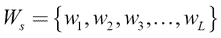

这里，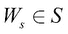。

源语言将被翻译成句子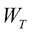，其中 *T* 是目标语言，由下式给出:

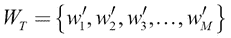

这里，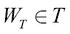。

通过 MT 系统获得，其输出如下:

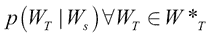

这里，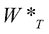是算法为源句子找到的可能翻译候选的池。此外，候选人池中的最佳候选人由以下等式给出:

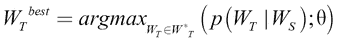

这里，θ是模型参数。在训练期间，我们使用优化模型，以最大化一些已知目标翻译对于一组相应源翻译(即训练数据)的概率。

到目前为止，我们讨论了我们有兴趣解决的语言翻译问题的形式设置。接下来，我们将回顾一下机器翻译的历史，感受一下早期人们是如何解决这个问题的。


# 机器翻译的简短历史之旅

这里我们将讨论机器翻译的历史。机器翻译的起源涉及基于规则的系统。然后，出现了统计上更合理的机器翻译系统。统计机器翻译使用一种语言的各种统计方法来翻译成另一种语言。然后是 NMT 时代。与其他方法相比，NMT 目前在大多数机器学习任务中保持着最先进的性能。

## 基于规则翻译

NMT 是在统计机器学习之后很久才出现的，而统计机器学习已经存在了半个多世纪。SMT 方法的出现可以追溯到 1950-1960 年，当时在第一个有记录的项目之一，乔治敦-IBM 实验中，超过 60 个俄语句子被翻译成了英语。

机器翻译最初的技术之一是基于单词的机器翻译。该系统使用双语词典进行单词到单词的翻译。但是，可以想象，这种方法有严重的局限性。显而易见的限制是，单词到单词的翻译不是不同语言之间的一对一映射。此外，逐字翻译可能会导致不正确的结果，因为它不考虑给定单词的上下文。给定单词在源语言中的翻译可以根据其使用的上下文而改变。为了用一个具体的例子来理解这一点，我们来看一下*图 10.1* 中从英语到法语的翻译例子。你可以看到在给出的两个英语句子中，有一个单词发生了变化。然而，这给翻译带来了巨大的变化:

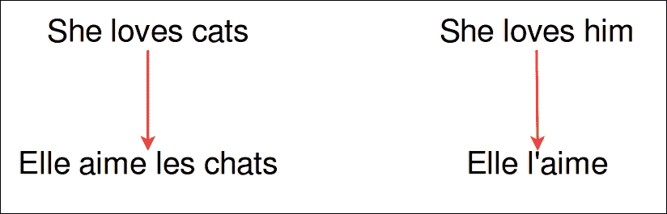

图 10.1:语言之间的翻译(英语到法语)不是单词之间的一对一映射

20 世纪 60 年代，**自动语言处理咨询委员会** ( **ALPAC** )发布了一份关于 MT 前景的报告，*语言与机器:翻译与语言学中的计算机*，*美国国家科学院(1966)* 。结论是这样的:

> 有用的机器翻译没有立即或可预测的前景。

这个是因为当时机器翻译比人工翻译速度慢，准确性差，而且成本高。这对 MT 的进步是一个巨大的打击，差不多十年就这样无声无息地过去了。

接下来是基于语料库的机器翻译，其中使用源句子的元组训练算法，并通过平行语料库获得相应的目标句子，即平行语料库将具有格式，( *[( <源 _ 句子 _1 >，<目标 _ 句子 _1 >)，(<源 _ 句子 _2 >，<目标 _ 句子 _2 >)，…]* )。平行语料库是由元组形成的大型文本语料库，由来自源语言的文本和该文本的相应翻译组成。表 10.2 中显示了这方面的说明。应当注意，建立平行语料库比建立双语词典容易得多，并且更准确，因为训练数据比词到词训练数据更丰富。此外，可以使用平行语料库来构建两种语言的双语词典(即转换模型),而不是直接依赖于手动创建的双语词典。给定当前源单词/短语，转换模型显示目标单词/短语成为正确翻译的可能性。除了学习转换模型，基于语料库的机器翻译还学习单词对齐模型。单词对齐模型可以表示来自源语言的短语中的单词如何对应于该短语的翻译。在*图 10.2* 中描述了一个平行语料库和单词对齐模型的示例。

在*表 10.2* 中显示了一个平行语料库的示例:

| 

源语言句子(英语)

 | 

目标语言句子(法语)

 |
| --- | --- |
| 我回家了 | 我喜欢这个房子 |
| 约翰喜欢弹吉他 | 约翰·艾梅·吉他手 |
| 他来自英国 | 这是安格特尔 |
| … | …. |

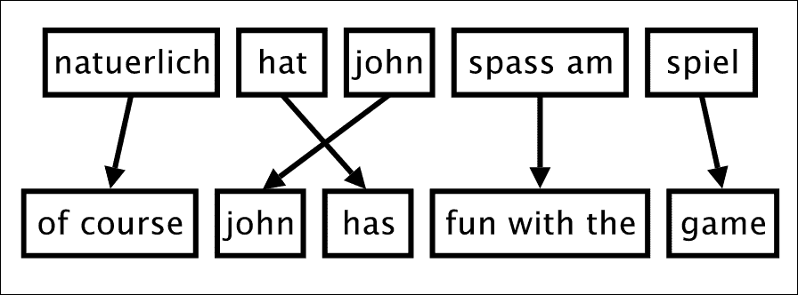

图 10.2:两种不同语言之间的单词对齐

另一种流行的方法是语际机器翻译，它包括将源句子翻译成一种语言中立的语际语言(即一种元语言)，然后从语际语言中生成翻译的句子。更具体地说，语际机器翻译系统由两个重要的组件组成，一个分析器和一个合成器。分析器将获取源句子并识别施事(例如，名词)、动作(例如，动词)等等，以及它们如何相互作用。接下来，这些被识别的元素通过语际词典来表示。语际词典的一个例子是 WordNet 中可用的同义词集(即，具有相同含义的一组同义词)。然后，从这个语际表达，合成器将创建翻译。由于合成器通过语际表示知道名词、动词等，所以它可以通过结合语言特定的语法规则来生成目标语言的翻译。

## 统计机器翻译(SMT)

接下来，更具统计学意义的音响系统开始出现。这个时代的先驱模型之一是基于单词翻译的 IBM 模型 1-5。然而，正如我们前面讨论的，单词翻译并不是从源语言到目标语言的一对一的(例如，复合词和词法)。最终，研究人员开始试验基于短语的翻译系统，该系统在机器翻译方面取得了一些显著的进步。

基于短语的翻译与基于单词的翻译的工作方式类似，只是它使用语言的短语而不是单个单词作为翻译的原子单位。这是一种更明智的方法，因为它使得单词之间的一对多、多对一或多对多关系的建模更加容易。基于短语的翻译的主要目标是学习一个*短语翻译模型*，该模型包含给定源短语的不同候选目标短语的概率分布。可以想象，这种方法需要维护两种语言中各种短语的巨大数据库。因为在一种语言的句子和另一种语言的句子之间没有单词的单调排序，所以也执行对短语的重新排序步骤。图 10.2 中显示了一个这样的例子。如果语言之间的单词是单调排序的，那么单词映射之间不应该有交叉。

这种方法的局限性之一是解码过程(为给定的源短语找到最佳目标短语)代价很高。这是由于短语数据库的大小以及经常包含多个目标语言短语的源短语。为了减轻负担，基于语法的翻译应运而生。

在基于句法的翻译中，源句子由句法树表示。在*图 10.3* 中， **NP** 代表一个名词短语， **VP** 一个动词短语， **S** 一个句子。然后**重新排序阶段**发生，根据目标语言，树节点被重新排序以改变主语、动词和宾语的顺序。这是因为句子结构可以根据语言的不同而变化(例如，在英语中是*主语-动词-宾语*，而在日语中是*主语-宾语-动词*)。根据被称为 **r 表**的东西来决定重新排序。r 表包含树节点被改变到某个其他顺序的可能性概率:

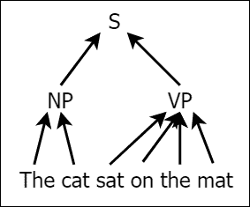

图 10.3。句子的语法树

出现**插入阶段**然后。在插入阶段，我们向树的每个节点随机插入一个单词。这是由于假设存在一个不可见的空单词，并且它在树的随机位置生成目标单词。同样，插入一个单词的概率是由一个叫做 **n 表**的东西决定的，这个表包含了将一个特定单词插入到树中的概率。

接下来**翻译阶段**发生，其中每个叶节点以逐字的方式被翻译成目标单词。最后，从语法树中读出翻译句子，以构建目标句子。

## 神经机器翻译(NMT)

最后，大约在【2014 年，NMT 系统被引入。NMT 是一个端到端的系统，它将一个完整的句子作为输入，执行某些转换，然后输出对应源句子的翻译句子。因此，NMT 消除了机器翻译所需的功能工程，如构建短语翻译模型和构建语法树，这是 NLP 社区的一大胜利。此外，NMT 在很短的时间内，仅仅两到三年，就胜过了所有其他流行的机器翻译技术。在*图 10.4* 中，我们描述了机器翻译文献中报道的各种机器翻译系统的结果。例如，2016 年的结果是从 Sennrich 等人的论文中获得的，*爱丁堡 WMT 神经机器翻译系统 16* ，*计算语言学协会*，*第一届机器翻译会议论文集*，*2016 年 8 月:371-376* ，以及从 Williams 等人的论文中获得的，*爱丁堡 WMT 16 统计机器翻译系统*，*计算语言学协会*所有机器翻译系统都用 BLEU 评分进行评估。正如我们在[第 9 章](ch09.html "Chapter 9. Applications of LSTM – Image Caption Generation")、*LSTM 的应用-图像字幕生成*中所讨论的，BLEU 分数表示候选翻译中与参考翻译相匹配的 n 元语法(例如，一元语法和二元语法)的数量。所以 BLEU 分数越高，MT 系统越好。我们将在本章后面详细讨论 BLEU 度量。没有必要强调 NMT 是一个明显的赢家:**

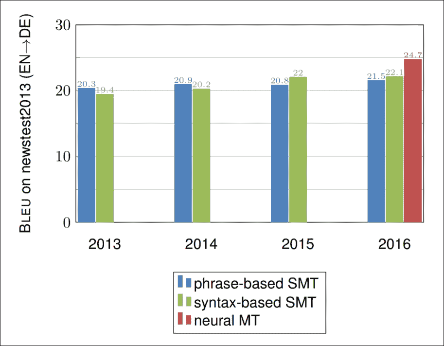

图 10.4。统计机器翻译系统与 NMT 系统的比较。里科·森里奇的好意。

评估 NMT 系统潜力的案例研究见*神经机器翻译准备好部署了吗？30 个翻译方向的案例研究*、 *Junczys-Dowmunt* 、 *Hoang* 和 *Dwojak* 、*第九届口语翻译国际研讨会论文集*、*西雅图(2016)* 。该研究着眼于不同系统在不同语言(英语、阿拉伯语、法语、俄语和汉语)之间的几项翻译任务中的表现。结果也支持 NMT 系统(NMT 120 万和 NMT 240 万)比 SMT 系统(PB-SMT 和 Hiero)表现更好。

*图 10.5* 显示了 2017 年当前最先进的机器翻译机的几个统计数据。这是来自一个演示文稿，*机器翻译的状态*， *Intento，Inc* ， *2017* ，由 Intento 的联合创始人兼首席执行官 Konstantin Savenkov 制作。我们可以看到，DeepL([https://www.deepl.com](https://www.deepl.com))生产的 MT 的性能似乎正在与包括谷歌在内的其他 MT 巨头展开激烈竞争。比较对象包括 DeepL (NMT)、Google (NMT)、Yandex (NMT-s MT 混合)、微软(同时拥有 SMT 和 NMT)、IBM (SMT)、Prompt(基于规则)、SYSTRAN(基于规则/SMT 混合)等 MT 系统。图表清楚地显示，NMT 系统公司引领着当前的机器翻译发展。LEPOR 分数用于评估不同的系统。LEPOR 是比 BLEU 更高级的度量标准，它试图解决*语言偏见问题*。语言偏差问题是指某些评价指标(如 BLEU)对某些语言表现良好，而对另一些语言表现不佳的现象。

然而，还应该注意，由于在比较中使用的平均机制，结果确实包含一些偏差。例如，Google Translator 已经在更大的语言集(包括困难的翻译任务)上进行了平均，而 DeepL 已经在更小且相对更容易的语言子集上进行了平均。所以不应该得出 DeepL MT 系统比 Google MT 系统好的结论。然而，总体结果提供了当前 NMT 和 SMT 系统的性能的一般比较:

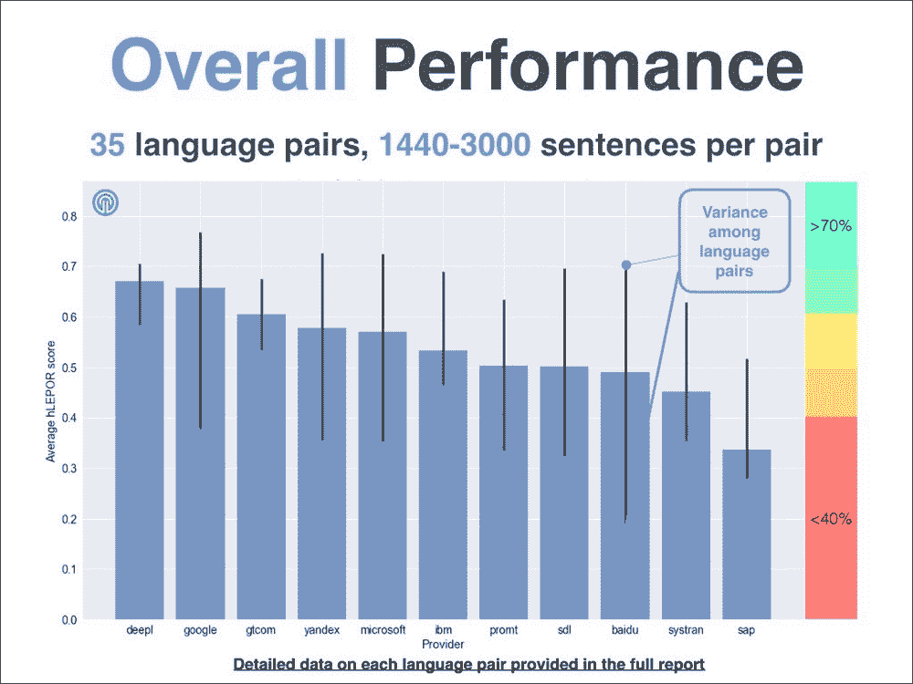

图 10.5:各种机器翻译系统的性能。Intento 公司提供。

我们已经看到，NMT 在短短几年内已经超越了 SMT 系统，这是当前的技术水平。我们现在将继续讨论 NMT 系统的细节和架构。最后，我们将从头开始实施 NMT 系统。


# 理解神经机器翻译

既然我们已经对机器翻译如何随着时间的推移而演变有了一个的认识，那么让我们试着去理解最先进的 NMT 是如何工作的。首先，我们将看看神经机器翻译器使用的模型架构，然后继续理解实际的训练算法。

## NMT 背后的直觉

首先，让我们理解 NMT 系统设计背后的直觉。假设你是一个英语和德语流利的人，要求你将下面的句子翻译成英语:

*我去了那家餐厅*

这句话翻译过来就是:

*我回家了*

虽然对于一个流利的人来说，翻译这个可能不需要超过几秒钟，但翻译中涉及到一定的过程。首先，你读德语句子，然后你创造一个关于这个句子代表或暗示什么的想法或概念。最后，你把这个句子翻译成英语。同样的想法也用于构建 NMT 系统(见*图 10.6* )。编码器读取源句子(即类似于你读取德语句子)。然后编码器输出一个上下文向量(上下文向量对应的是你看完句子后想象的思想/概念)。最后，解码器接收上下文向量并输出英语翻译:

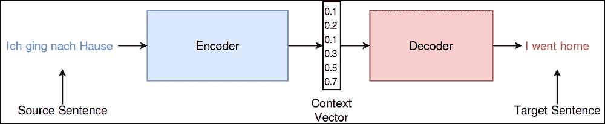

图 10.6。NMT 系统的概念架构

## NMT 建筑

现在我们将更详细地看看这个架构。这里讨论的序列到序列方法是由 Sutskever，Vinyals 和 Le 在他们的论文中提出的，*序列到序列学习与神经网络*，*第 27 届国际神经信息处理系统会议录-第 2 卷:3104-3112* 。从*图 10.6* 中的图表，我们可以看到NMT 架构中有两个主要组件。这些被称为编码器和解码器。换句话说，NMT 可以被视为一个编码器-解码器架构。**编码器**将一个句子从给定的源语言转换成*思维*，而**解码器** 将*思维*解码或翻译成目标语言。如您所见，这与我们简单讨论过的语际机器翻译方法有一些共同的特征。这在*图 10.7* 中有所说明。上下文向量的左侧表示编码器(它逐字逐句地获取源句子来训练时间序列模型)。右侧的表示解码器，它通过单词输出单词(同时使用前一个单词作为当前输入)源句子的相应翻译。我们还将使用嵌入层(针对源语言和目标语言)来提供单词向量作为模型的输入:

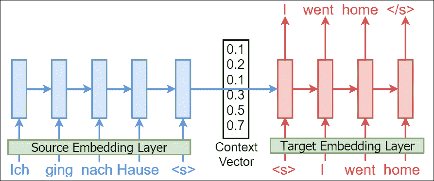

图 10.7:随着时间的推移展开源句子和目标句子

有了对 NMT 的基本了解，让我们正式定义 NMT 的目标。给定源句子*x[s]及其对应的*y[t]，NMT 系统的最终目标是最大化对数似然，即最大化以下内容:**

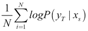

这里， *N* 是指我们作为训练数据的源和目标句子元组的数量。

然后，在推理过程中，对于一个给定的源句子，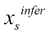，我们将使用下面的语句找到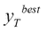的翻译:

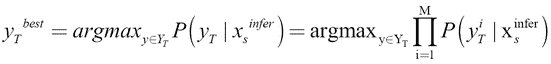

这里，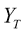是可能的候选句子的集合。

在我们检查 NMT 架构的每个部分之前，让我们定义数学符号来更具体地理解这个系统。

让我们将编码器 LSTM 定义为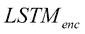，解码器 LSTM 定义为。在时间步 *t* 处，让我们将 LSTM 的单元状态定义为*c[t]，将外部隐藏状态定义为*h[t]。因此，输入*x[t]进给到 LSTM 产生*c[t]和*h[t]T30:*****

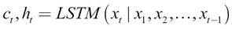

现在，我们将讨论嵌入层、编码器、上下文向量，最后是解码器。

### 嵌入层

在[第 8 章](ch08.html "Chapter 8. Applications of LSTM – Generating Text")、*LSTM 的应用-生成文本*和[第 9 章](ch09.html "Chapter 9. Applications of LSTM – Image Caption Generation")、*LSTM 的应用-图像标题生成*中，我们详细讨论了使用单词嵌入而不是单词的一次热编码表示的好处，尤其是当词汇量很大时。这里，我们也使用了两个单词的嵌入层，用于源语言，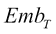用于目标语言。因此，我们将得到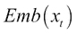，而不是直接将*x[t]t*进给到 *LSTM* 中。然而，为了避免不必要的增加符号，我们将假设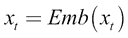。

### 编码器

正如前面提到的，编码器负责生成一个*思维向量*或者一个代表源语言含义的上下文向量。为此，我们将使用 LSTM 网络(见*图 10.8* ):

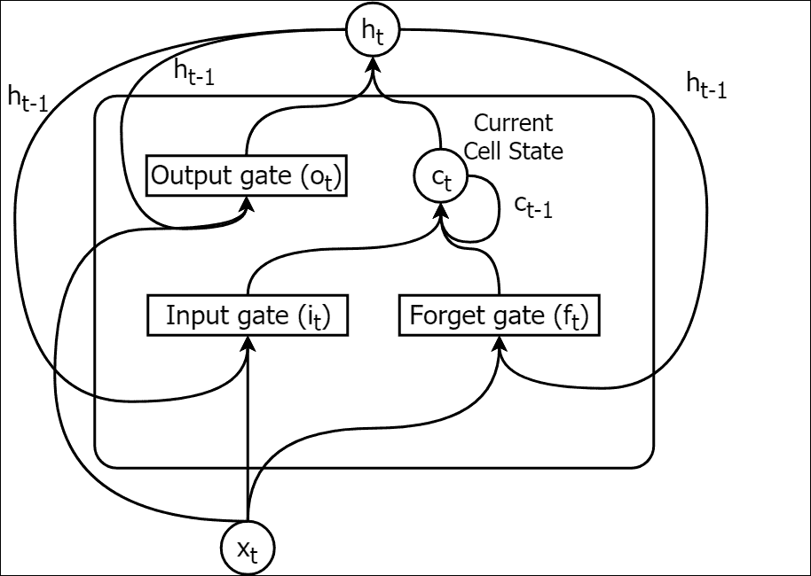

图 10.8:一个 LSTM 单元

编码器以 c [0] 和 h [0] 作为零向量进行初始化。编码器将单词序列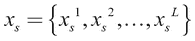作为输入，并计算上下文向量，其中 *v* *c* 是最终的单元状态，并且 *v [ h ]* 是在处理序列的最后一个元素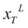*x[T]*之后获得的最终外部隐藏状态。我们将此描述如下:

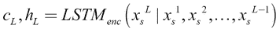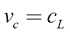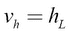

### 上下文向量

上下文向量( *v* )的思想是简明地表示源语言的句子。此外，与编码器状态的初始化方式相反(即，它们用零初始化)，上下文向量成为解码器 LSTM 的初始状态。换句话说，解码器 LSTM 不是以零的初始状态开始，而是以上下文向量作为其初始状态。我们接下来会更详细地讨论这一点。

### 解码器

解码器负责将上下文向量解码成期望的翻译。我们的解码器也是 LSTM 网络。虽然编码器和解码器可以共享同一组权重，但通常最好是编码器和解码器使用两个不同的网络。这增加了我们模型中的参数数量，允许我们更有效地学习翻译。

首先，用上下文向量初始化解码器的状态，如下所示: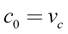 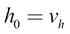

在这里，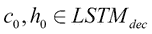。

这( *v* )是连接编码器和解码器形成端到端计算链的关键环节(参见*图 10.6* 编码器和解码器唯一共享的是 *v* )。此外，这是解码器可以获得的关于源句子的唯一信息。

然后，我们将使用以下公式计算翻译句子的第 *m* *th* 预测:

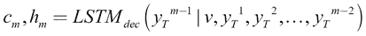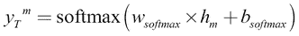

完整的 NMT 系统以及编码器中的 LSTM 单元如何连接到解码器中的 LSTM 单元以及 softmax 层如何用于输出预测的细节如图*图 10.9* 所示:

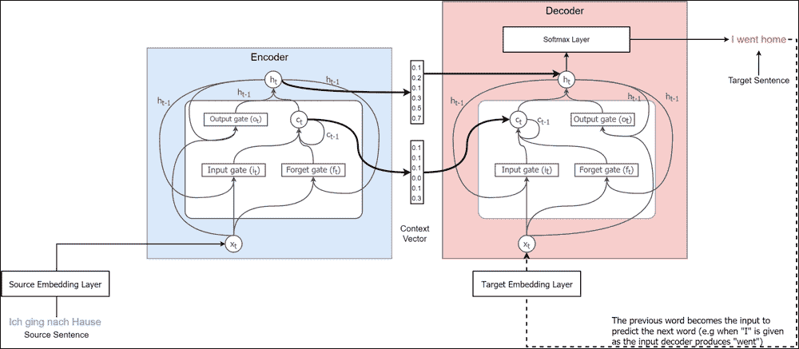

图 10.9:带 LSTMs 的编码器-解码器架构


# 为 NMT 系统准备数据

在本节中，我们将讨论从 NMT 系统中为训练和预测准备数据的确切过程。首先，我们将讨论如何准备训练数据(即源句子和目标句子对)来训练 NMT 系统，然后输入给定的源句子来产生源句子的翻译。

## 训练时

训练数据由成对的源句子和相应的目标语言翻译组成。一个例子可能是这样的:

*   *(我回家了)*
*   *(她在学校的帽子，她在学校等着)*

我们的数据集中有 *N* 个这样的对。如果我们要实现一个相当好的翻译器， *N* 需要在百万级别。同样，训练数据的增加也意味着训练时间的延长。

接下来介绍两个特殊令牌: *< s >* 和 *< /s >* 。 *< s >* 记号表示一个句子的开始，而 *< /s >* 表示一个句子的结束。现在，数据看起来像这样:

*   *(<>我去了家</我回家了</我回家了>/我回家了</我回家了> )*
*   她在学校里等着呢

此后，我们将使用 *< /s >* 标记填充句子，使得源句子具有固定长度 *L* ，目标句子具有固定长度 *M* 。需要注意的是 *L* 和 *M* 不需要相等。该步骤会导致以下结果:

*   *(<s>I ching nach Hause</s></s></s>，< s >我回家了</s></s></s>)*
*   她在学校里等着呢

如果一个句子的长度大于 *L* 或 *M* ，它将被截断以适应长度。然后将句子通过分词器，得到分词后的单词。这里我忽略了第二个元组(即一对句子)，因为两者的处理方式相似:

*([' < s >'，' Ich '，' ging '，' nach '，' Hause '，'< /s >'，'< /s >'，< s >'，'我'，'去了'，'家'，'< /s >'，'< /s >'，'< /s >*

应该注意的是，将句子定长并不是必须的，因为 LSTMs 能够处理动态序列大小的。然而，将它们固定长度有助于我们成批处理句子，而不是逐个处理。

## 颠倒源句

接下来我们将在源句子上表演一个特殊的戏法。比方说，我们在源语言中有一个句子 *ABC* ，我们想把它翻译成目标语言中的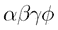。我们将首先颠倒源句子，这样句子 *ABC* 将读作 *CBA* 。这意味着为了将 *ABC* 翻译成，我们需要输入 *CBA* 。这大大提高了我们的模型的性能，尤其是当源语言和目标语言共享相同的句子结构(例如，主语-动词-宾语)时。

让我们试着理解为什么这有帮助。主要是，它有助于在编码器和解码器之间建立良好的*通信*。让我们从前面的例子开始。我们将连接源句子和目标句子:

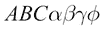

如果你计算一下从 *A* 到或者 *B* 到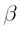的距离(也就是分隔两个单词的字数)，它们会是一样的。但是，当您颠倒源句子时，请考虑这一点，如下所示:

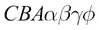

这里， *A* 和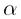非常接近，以此类推。此外，要做出好的翻译，从一开始就建立良好的沟通是很重要的。这可能有助于 NMT 系统通过这个简单的技巧来提高其性能。

现在，我们的数据集变成了这样:

*([' < /s >'，'< /s >'，'< /s >'，'豪斯'，' nach '，' ging '，' Ich '，'< s >')，< s >'，'我'，'去了'，'家'，'< /s >'，'< /s >'，'<*

接下来，使用所学习的嵌入、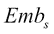和，我们用相应的嵌入向量替换每个单词。

另一个好消息是，我们的源句子以一个 *< s >* 标记结束，而目标句子以一个 *< s >* 标记开始，因此在训练期间，我们不必做任何特殊的处理来建立源句子的结尾和目标句子的开头之间的链接。

### 注

注意，源句子反转步骤是主观预处理步骤。对于某些翻译任务，这可能不是必需的。例如，如果你的翻译任务是从日语(也就是经常写的主语-宾语-动词格式)翻译成菲律宾语(经常写的动词-主语-宾语)，那么颠倒源句实际上可能会造成伤害而不是帮助。这是因为通过反转日语中的文本，您正在增加目标句子的起始元素(即动词(日语))和对应的源语言实体(即动词(菲律宾语))之间的距离。

## 测试时

在测试的时候，我们只有源句子，没有目标句子。此外，我们准备我们的源数据，就像我们在训练阶段所做的那样。接下来，我们通过将解码器的最后一个预测单词作为下一个输入，来得到逐字翻译的输出。预测过程首先通过首先向解码器输入一个 *< s >* 令牌来触发。

我们将讨论给定源句子的精确训练过程和预测过程。


# 训练 NMT

既然我们已经定义了 NMT 架构并预处理了训练数据，那么训练模型就相当简单了。这里我们将定义和说明(参见*图 10.10* )用于培训的确切流程:

1.  Preprocess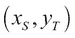

    如前所述

2.  将*x[s]送入并根据*x[s]计算 *v***
3.  用 *v* 初始化
4.  从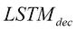预测对应输入句子 *x [ s ]* 的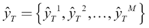，其中 *m [ th ]* 预测，出目标词汇 *V* 计算如下: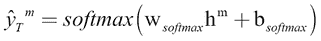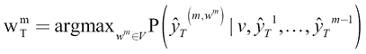这里 wTm 表示第 m 个位置的最佳目标词。
5.  计算损失:预测单词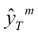和在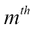位置的实际单词之间的分类交叉熵
6.  相对于损失

    优化、和 *softmax* 层图 10.10:NMT

    的训练过程


# 推论与 NMT

推理与 NMT 的训练过程略有不同(*图 10.11* )。由于我们在推理时没有目标句子，我们需要一种方法在编码阶段结束时触发解码器。这与我们在[第 9 章](ch09.html "Chapter 9. Applications of LSTM – Image Caption Generation")、*LSTM 的应用——图像字幕生成*中所做的图像字幕练习有相似之处。在那个练习中，我们将 *< SOS >* 标记附加到字幕的开头来表示字幕的开始，将 *< EOS >* 标记附加到字幕的结尾。

我们可以简单地做到这一点，将 *< s >* 作为解码器的第一个输入，然后将预测作为输出，并将最后一个预测作为下一个输入提供给 NMT:

1.  如前所述预处理*x[s]*
2.  将*x[s]送入并根据*x[s]计算 *v***
3.  用 *v* 初始化
4.  对于初始预测步骤，通过调节和 *v* 上的预测来预测
5.  对于随后的时间步骤，当时，通过调节对和 *v* 

    的预测来预测图 10.11:从 NMT

    推断


# BLEU 评分——评估机器翻译系统

**BLEU** 代表**双语评估候补**，是自动评估机器翻译系统的一种方式。这种度量首次在论文中介绍， *BLEU:一种自动评估机器翻译的方法*， *Papineni 等*，*计算语言学协会(ACL)第 40 届年会论文集*，*费城*，*2002 年 7 月:311-318* 。我们将实现 BLEU 分数计算算法，并在`bleu_score_example.ipynb`中作为练习提供。我们来了解一下这个是怎么算出来的。

让我们考虑一个例子来学习 BLEU 分数的计算。比方说，对于某个给定的源句子，我们有两个候选句子(即由我们的机器翻译系统预测的句子)和一个参考句子(即相应的实际翻译):

*   参考文献 1:猫坐在垫子上
*   候选人 1:猫在垫子上

要看翻译的有多好，我们可以用一个衡量标准，*精度*。Precision 是对候选词中有多少单词实际出现在引用中的度量。一般而言，如果考虑具有两个类别(由负数和正数表示)的分类问题，精度由以下公式给出:


现在让我们计算候选 1 的精度:

*精度=候选词的每个词在参考文献中出现的次数/候选词的字数*

在数学上，这可以由以下公式给出:


*候选人 1 的精度= 5/6*

这也被称为 1 克精度，因为我们一次只考虑一个单词。

现在让我们介绍一位新的候选人:

候选人 2:那只猫猫猫

人类不难看出候选人 1 比候选人 2 好得多。让我们计算一下精度:

*候选 2 的精度= 6/6 = 1*

我们可以看到，精度分数与我们做出的判断不一致。因此，不能仅仅依靠精确度来衡量翻译的质量。

## 修改精度

为了解决的精度限制，我们可以使用修正的 1 克精度。修改后的精度会根据候选词中每个唯一词在引用中出现的次数来裁剪该词的出现次数:


因此，对于候选项 1 和 2，修改后的精度如下:

*Mod-1-gram-Precision 候选 1 = (1 + 1 + 1 + 1 + 1)/ 6 = 5/6*

*Mod-1-gram-Precision 候选 2= (2 + 1) / 6 = 3/6*

我们已经可以看到这是一个很好的修改，因为候选 2 的精度降低了。通过一次考虑 *n* 个单词而不是单个单词，这可以扩展到任何 n 元语法。

## 简洁处罚

精准自然偏爱小句。这在评估中提出了一个问题，因为机器翻译系统可能为较长的引用生成小句，但仍然具有较高的精度。因此，引入了*简洁惩罚*来避免这种情况。简洁损失的计算方法如下:


这里， *c* 是候选句子长度， *r* 是参考句子长度。在我们的示例中，我们的计算如下所示:

候选人 1 的 BP =

候选人 2 的 BP =

## 最终 BLEU 分数

接下来，为了计算 BLEU 得分，我们首先为一组不同的值计算几个不同的修正 n 元语法精度。然后，我们将计算 n 元语法精度的加权几何平均值:


这里，*w[n]为修正后的 n 元精度*p[n]的权重。默认情况下，所有 n-gram 值使用相同的权重。总之，BLEU 计算一个修改的 n-gram 精度，并用一个简洁惩罚来惩罚修改的 n-gram 精度。修改后的 n-gram 精度避免了给予无意义句子(例如，候选 2)的潜在高精度值。**


# 从零开始实现 NMT——德语到英语的翻译器

现在我们将实现一个实际的神经机器翻译器。我们将使用原始张量流操作变量实现 NMT。该练习可在`ch10/neural_machine_translation.ipynb`中找到。不过 TensorFlow 中有一个子库，叫做`seq2seq`库。你可以阅读更多关于`seq2seq`的信息，也可以学习用[附录](apa.html "Appendix A. Mathematical Foundations and Advanced TensorFlow")、*数学基础和高级张量流*中的`seq2seq`实现一个 NMT。

我们之所以使用 raw TensorFlow 是因为，一旦你在不使用任何辅助函数的情况下从头开始学习实现一个机器翻译器，你将能够快速学会使用`seq2seq`库。此外，学习使用原始张量流实现序列到序列模型的在线资源非常匮乏。然而，有许多关于如何使用`seq2seq`库进行机器翻译的资源/教程。

### 注意

TensorFlow 在[https://www.tensorflow.org/tutorials/seq2seq](https://www.tensorflow.org/tutorials/seq2seq)针对 NMT 提供了非常翔实的序列对序列学习教程。

## 数据简介

我们使用在 https://nlp.stanford.edu/projects/nmt/可用的英德句子对。大约有 450 万对可用的句子。然而，由于计算的可行性，我们将只使用 250，000 个句子对。词汇表由 50，000 个最常见的英语单词和 50，000 个最常见的德语单词组成，词汇表中没有的单词将被替换为一个特殊的标记`<unk>`。这里，我们将列出在数据集中找到的例句:

```
DE:  Das Großunternehmen sieht sich einfach die Produkte des kleinen Unternehmens an und unterstellt so viele Patentverletzungen , wie es nur geht .

EN:  The large corporation will look at the products of the small company and bring up as many patent infringement assertions as possible .

DE:  In der ordentlichen Sitzung am 22\. September 2008 befasste sich der Aufsichtsrat mit strategischen Themen aus den einzelnen Geschäftsbereichen wie der Positionierung des Kassamarktes im Wettbewerb mit außerbörslichen Handelsplattformen , den Innovationen im Derivatesegment und verschiedenen Aktivitäten im Nachhandelsbereich .

EN:  At the regular meeting on 22 September 2008 , the Supervisory Board dealt with strategic issues from the various business areas , such as the positioning of the cash market in competition with OTC trading platforms , innovation in the derivatives segment and various post ##AT##-##AT## trading activities .
```

## 预处理数据

按照练习文件中的说明下载训练数据(`train.en`和`train.de)`)后，让我们看看这些文件中有什么。`train.en`文件包含英语句子，而`train.de`包含相应的德语句子。接下来，我们将从作为数据的大型语料库中选择 250，000 个句子对。我们还将从训练数据中收集 100 个句子作为测试数据。最后，两种语言的词汇表可以在`vocab.50K.en.txt`和`vocab.50K.de.txt`中找到。

然后我们将按照本章前面的解释对这些数据进行预处理。反转句子对于单词嵌入学习是可选的(如果单独执行)，因为反转句子不会改变给定单词的上下文。我们将使用下面的简单分词算法将句子分词。本质上，我们在各种标点符号前引入空格，这样它们就可以标记为单个元素。然后对于任何在词汇表中找不到的单词，我们会用一个特殊的`<unk>`标记来替换它。`is_source`参数告诉我们是处理源句子(`is_source = True`)还是目标句子(`is_source = False`):

```
def split_to_tokens(sent,is_source):
    '''
    This function takes in a sentence (source or target)
    and preprocess the sentency with various steps
    (e.g. removing punctuation)
    '''

    global src_unk_count, tgt_unk_count

    # Remove punctuation and new-line chars
    sent = sent.replace(',',' ,')
    sent = sent.replace('.',' .')
    sent = sent.replace('\n',' ') 

    sent_toks = sent.split(' ')
    for t_i, tok in enumerate(sent_toks):
        if is_source:
            # src_dictionary contain the word -> 
            # word ID mapping for source vocabulary
            if tok not in src_dictionary.keys():
                if not len(tok.strip())==0:
                    sent_toks[t_i] = '<unk>'
                    src_unk_count += 1
        else:
            # tgt_dictionary contain the word -> 
            # word ID mapping for target vocabulary
            if tok not in tgt_dictionary.keys():
                if not len(tok.strip())==0:
                    sent_toks[t_i] = '<unk>'
                    # print(tok)
                    tgt_unk_count += 1
    return sent_toks
```

## 学习单词嵌入

接下来，我们将继续学习单词嵌入。为了学习单词嵌入，我们将使用**连续单词袋** ( **CBOW** )模型。但是，欢迎你尝试其他单词嵌入学习方法，比如 GloVe。我们不会浏览代码(在`word2vec.py`文件中找到)，但是分享一些学到的单词嵌入:

*德语单词嵌入*

```
Nearest to In: in, Aus, An, Neben, Bei, Mit, Trotz, Auf,
Nearest to war: ist, hat, scheint, wäre, hatte, bin, waren, kam,
Nearest to so: verbreitet, eigentlich, ausserdem, ziemlich, Rad-, zweierlei, wollten, ebenso,
Nearest to Schritte: Meter, Minuten, Gehminuten, Autominuten, km, Kilometer, Fahrminuten, Steinwurf,
Nearest to Sicht: Aussicht, Ausblick, Blick, Kombination, Milde, Erscheinung, Terroranschläge, Ebenen,
```

*英语单词嵌入*

```
Nearest to more: cheaper, less, easier, better, further, greater, bigger, More,
Nearest to States: Kingdom, Nations, accross, attrition, Efex, Republic, authoritative, Sorbonne,
Nearest to Italy: Spain, Poland, France, Switzerland, Madrid, Portugal, Fuengirola, 51,
Nearest to island: shores, Principality, outskirts, islands, skyline, ear, continuation, capital,
Nearest to 2004: 2005, 2001, 2003, 2007, 1996, 2006, 1999, 1995,
```

可以在训练机器翻译系统的同时学习嵌入。另一种选择是使用预训练的单词嵌入。我们将在本章的后面讨论如何做到这一点。

## 定义编码器和解码器

我们将使用两个独立的 LSTMs 作为编码器，使用作为解码器。

首先，我们将定义超参数:

*   `batch_size`:你在设置批量的时候要非常小心。我们的 NMT 在运行时会占用大量内存。
*   这是 LSTM 隐藏单位的数量。大的`num_nodes`超参数将导致更好的性能和更高的计算成本。
*   `enc_num_unrollings`:我们将它设置为源句子中的字数。我们将在一次计算中展开整个句子的 LSTM。`enc_num_unrollings`越高，你的模型表现越好。但是，这会降低算法的速度。
*   `dec_num_unrollings`:设置为目标句子的字数。更高的`dec_num_unrollings`也将导致更好的性能，但是计算成本较大。
*   `embedding_size`:这个就是我们学习的向量的维度。100-300 的嵌入大小对于大多数使用单词向量的实际问题来说是足够的。

这里我们将定义超参数:

```
# We set the input size by loading the saved word embeddings
# and getting the column size
tgt_emb_mat = np.load('en-embeddings.npy')
input_size = tgt_emb_mat.shape[1]

num_nodes = 128
batch_size = 10

# We unroll the full length at one go
# both source and target sentences
enc_num_unrollings = 40
dec_num_unrollings = 60
```

### 注意

如果批量较大(在标准笔记本电脑上超过 20 个)，可能会遇到如下问题:

```
Resource exhausted: OOM when allocating tensor with ...
```

在这种情况下，您应该减少批处理大小并重新运行代码。

接下来，我们将定义 LSTMs 和 softmax 图层的权重和偏差。我们将使用编码器和解码器变量作用域，使变量的命名更加直观。这个是标准的 LSTM 电池，我们不再重复重量定义。

然后，我们将为培训定义四个张量流占位符:

*   `enc_train_inputs`:这是一个`enc_num_unrollings`占位符的列表，其中每个占位符的大小为`[batch_size, input_size]`。这用于将一批源语言句子馈送给编码器。
*   `dec_train_inputs`:这是`dec_num_unrollings`占位符的列表，其中每个占位符都是`[batch_size, input_size]`大小。这用于馈送目标语言句子的相应批次。
*   `dec_train_labels`: This is a list of the `dec_num_unrollings` placeholders, where each placeholder is of the `[batch_size, vocabulary_size]` size. This contains words of the `dec_train_inputs` offset by 1\. So that two placeholders from `dec_train_inputs` and `dec_train_labels` with the same index in the list would have the *i^(th)* word and the

    词。

*   `dec_train_masks`:与`dec_train_inputs`大小相同，屏蔽掉损失计算中任何带有`</s>`标签的元素。这很重要，因为有许多数据点带有`</s>`标记，因为它用于将句子填充到固定长度:

    ```
    for ui in range(dec_num_unrollings):     dec_train_inputs.append(tf.placeholder(tf.float32,         shape=[batch_size,input_size],         name='dec_train_inputs_%d'%ui))     dec_train_labels.append(tf.placeholder(tf.float32,         shape=[batch_size,vocabulary_size],         name = 'dec_train_labels_%d'%ui))     dec_train_masks.append(tf.placeholder(tf.float32,         shape=[batch_size,1],         name='dec_train_masks_%d'%ui))  for ui in range(enc_num_unrollings):     enc_train_inputs.append(tf.placeholder(tf.float32,         shape=[batch_size,input_size],         name='train_inputs_%d'%ui))
    ```

### 注

为了初始化 LSTM 细胞和 softmax 层的权重，我们将使用 **Xavier 初始化**，这是 Glorot 和 Bengio 在 2010 年他们的论文*中介绍的，理解训练深度前馈神经网络的困难*，*第 13 届国际人工智能和统计会议(2010)* 。这是一种原则性的初始化技术，旨在缓解超深网络中的消失梯度问题。这可以通过 TensorFlow 中提供的`tf.contrib.layers.xavier_initializer()`变量初始化器来实现。具体来说，在 Xavier 初始化中，神经网络的第 *j ^(th)* 层的权重按照均匀分布*U【a，b】*进行初始化，其中 *a* 为最小值， *b* 为最大值:


这里，*n[j]是第*j^(th)层的大小。**

## 定义端到端输出计算

这里，定义了变量和输入/输出占位符后，我们将继续定义从编码器到解码器的输出计算以及损失函数。

对于输出，我们将首先计算给定的一批句子中所有单词的 LSTM 单元状态和隐藏状态。这是通过运行一个`for`循环来实现的，其中在第 *i ^(th)* 迭代中，我们在`enc_train_inputs`中输入第 *i ^(th)* 占位符，以及来自迭代的单元格状态和输出隐藏状态。`enc_lstm_cell`函数的工作方式类似于我们在[第 8 章](ch08.html "Chapter 8. Applications of LSTM – Generating Text")、*LSTM 的应用-生成文本*和[第 9 章](ch09.html "Chapter 9. Applications of LSTM – Image Caption Generation")、*LSTM 的应用-图像字幕生成*中看到的`lstm_cell`函数:

```
# Update the output and state of the encoder iteratively
for i in enc_train_inputs:
    output, state = enc_lstm_cell(i, output,state)
```

```
v to initialize the decoder states with. This is achieved with the tf.control_dependencies(...) statement. So the nested commands within the with statement will only execute after the encoder output is fully calculated:
```

```
# With the computations of the enc_lstm_cell done,
# calculate the output and state of the decoder
with tf.control_dependencies([saved_output.assign(output),
                             saved_state.assign(state)]):
    # Calculate the decoder state and output iteratively
    for i in dec_train_inputs:
        output, state = dec_lstm_cell(i, output, state)
        outputs.append(output)
```

然后，在计算解码器输出之后，我们将使用 LSTM 的隐藏状态作为层的输入来计算 softmax 层的 logits:

```
# Calculate the logits of the decoder for all unrolled steps
logits = tf.matmul(tf.concat(axis=0, values=outputs), w) + b
```

现在，计算出逻辑值后，我们就可以计算损失了。请注意，我们使用 mask 来屏蔽掉不应该造成损失的元素(即，我们添加的用于构成固定长度句子的`</s>`元素):

```
loss_batch = tf.concat(axis=0,values=dec_train_masks)*
             tf.nn.softmax_cross_entropy_with_logits_v2(
                 logits=logits, labels=tf.concat(axis=0,
                 values=dec_train_labels))
loss = tf.reduce_mean(loss_batch)
```

此后，与前几章不同，我们将使用两个优化器:Adam 和标准随机梯度下降。这是因为长期使用 Adam 会产生不希望的结果(例如，BLEU 分数突然大幅波动)。我们也使用渐变剪辑来避免任何渐变爆炸。

```
# We use two optimizers: Adam and naive SGD
# using Adam in the long run produced undesirable results 
# (e.g.) sudden fluctuations in BLEU
# Therefore we use Adam to get a good starting point for optimizing
# and then switch to SGD from that point onwards
with tf.variable_scope('Adam'):
    optimizer = tf.train.AdamOptimizer(learning_rate)
with tf.variable_scope('SGD'):
    sgd_optimizer = tf.train.GradientDescentOptimizer(sgd_learning_rate)

# Calculates gradients with clipping for Adam
gradients, v = zip(*optimizer.compute_gradients(loss))
gradients, _ = tf.clip_by_global_norm(gradients, 5.0)
optimize = optimizer.apply_gradients(zip(gradients, v))

# Calculates gradients with clipping for SGD
sgd_gradients, v = zip(*sgd_optimizer.compute_gradients(loss))
sgd_gradients, _ = tf.clip_by_global_norm(sgd_gradients, 5.0)
sgd_optimize = optimizer.apply_gradients(zip(sgd_gradients, v))
```

我们将使用以下语句，通过确保所有可训练变量都存在梯度，来确保梯度正确地从解码器流向编码器:

```
for (g_i,v_i) in zip(gradients,v):
    assert g_i is not None, 'Gradient none for %s'%(v_i.name)
```

请注意，运行 NMT 将比之前的练习慢得多，在单个 GPU 上完全运行可能需要12 个多小时。

## 一些翻译结果

这些是我们经过 10，000 步后得到的结果:

```
DE:  &#124; Ferienwohnungen 1 Zi &#124; Ferienhäuser &#124; Landhäuser &#124; Autovermietung &#124; Last Minute Angebote ! !

EN (TRUE):&#124; 1 Bedroom Apts &#124; Holiday houses &#124; Rural Homes &#124; Car Rental &#124; Last Minute Offers !

EN (Predicted): Casino Tropez &#124; Club &#124; Club &#124; Aparthotels Hotels &#124; Club &#124; Last Minute Offers &#124; Last Minute Offers &#124; Last Minute Offers &#124; Last Minute Offers &#124; Last Minute Offers ! </s>

DE: Wie hilfreich finden Sie die Demo ##AT##-##AT## CD ?

EN (TRUE): How helpful do you find the demo CD ##AT##-##AT## ROM ?

EN (Predicted): How to install the new version of XLSTAT ? </s>

DE:  Das „ Ladino di Fassa “ ist jedoch mehr als ein Dialekt – es ist eine richtige Sprache .

EN (TRUE):This is Ladin from Fassa which is more than a dialect : it is a language in its own right .

EN (Predicted): The <unk> <unk> <unk> <unk> <unk> <unk> <unk> <unk> <unk> <unk> <unk> <unk> <unk> <unk> <unk> <unk> <unk> <unk> <unk> <unk> <unk> <unk> <unk> <unk> <unk> <unk> <unk> <unk> <unk> <unk> <unk> <unk> <unk> <unk> <unk> <unk> <unk> <unk> <unk> <unk> <unk> <unk> <unk> <unk> <unk> <unk> <unk> <unk> <unk> <unk> <unk> <unk> <unk> <unk> <unk> <unk> <unk> <unk> <unk>

DE: In der Hotelbeschreibung im Internet müßte die Zufahrt beschrieben
werden .
EN (TRUE): There are no adverse comments about this hotel at all .

EN (Predicted): The <unk> <unk> is a bit of the <unk> <unk> . </s>
```

我们可以看到第一句话是相当认可的。然而，第二句翻译得很差。

此外，以下是 100，000 步后获得的结果:

```
DE: Das Hotel Opera befindet sich in der Nähe des Royal Theatre ,
Kongens Nytorv , &apos; Stroget &apos; und Nyhavn .

EN (TRUE): Hotel Opera is situated near The Royal Theatre , Kongens
Nytorv , &quot; Strøget &quot; and fascinating Nyhavn .

EN (Predicted): Best Western Hotel <unk> <unk> , <unk> , <unk> ,
<unk> , <unk> , <unk> , <unk> , <unk> , <unk> , <unk> , <unk> , <unk>
, <unk> , <unk> , <unk> , <unk> , <unk> , <unk> , <unk> , <unk> ,
<unk> , <unk> , <unk> , <unk> , <unk> , <unk> , <unk> , <unk> ,

DE:  Alle älteren Kinder oder Erwachsene zahlen EUR 32,00 pro Übernachtung und Person für Zustellbetten .

EN (TRUE):All older children or adults are charged EUR 32.00 per night and person for extra beds .

EN (Predicted): All older children or adults are charged EUR 15 <unk> per night and person for extra beds . </s>

DE:  Im Allgemeinen basieren sie auf Datenbanken , Templates und Skripts .

EN (TRUE):In general they are based on databases , template and scripts .

EN (Predicted): The user is the most important software of the software . </s>

DE: Tux Racer wird Ihnen helfen , die Zeit totzuschlagen und sie
können OpenOffice zum Arbeiten verwenden .

EN (TRUE): Tux Racer will help you pass the time while you wait ,
and you can use OpenOffice for work .

EN (Predicted): <unk> .com we have a very friendly and helpful
staff . </s>
```

我们可以看到，即使的翻译并不完美，但大多数时候还是抓住了源句子的上下文，我们的 NMT 非常擅长生成语法正确的句子。

*图 10.12* 描绘了一段时间内 NMT 的 BLEU 分数。随着时间的推移，训练和测试数据集的 BLEU 分数都有明显增加:


图 10.12:一段时间内 NMT 的 BLEU 分数


# 用词嵌入联合训练 NMT

在这里，我们将讨论如何通过单词嵌入来训练 NMT。在本节中，我们将讨论两个概念:

*   与单词嵌入层联合训练 NMT
*   使用预先训练的嵌入，而不是随机初始化嵌入层

有几个可用的多语言单词嵌入库:

*   脸书的 fast text:[https://github . com/Facebook research/fast text/blob/master/pre trained-vectors . MD](https://github.com/facebookresearch/fastText/blob/master/pretrained-vectors.md)
*   CMU 多语种嵌入:[http://www . cs . CMU . edu/~ AFM/projects/multilingual _ embeddings . html](http://www.cs.cmu.edu/~afm/projects/multilingual_embeddings.html)

由此，我们将使用 CMU 嵌入(~200 MB)，因为它比 fastText (~5 GB)小得多。我们首先需要下载德语(`multilingual_embeddings.de`)和英语(`multilingual_embeddings.en`)嵌入。这可以在`ch10`文件夹的`nmt_with_pretrained_wordvecs.ipynb`中作为练习。

## 最大化数据集词汇和预训练嵌入之间的匹配

我们将首先必须获得与我们感兴趣解决的问题相关的预训练单词嵌入的子集。这很重要，因为预训练单词嵌入的词汇表可能很大，并且可能包含许多在数据集词汇表中找不到的单词。预训练的单词嵌入是一组行，其中行是单词和单词向量，由空格分隔。预训练嵌入的示例行可能如下所示:

```
door 0.283259492301 0.198089365764 0.335635845187 -0.385702777914 0.491404970211 …
```

实现这一点的一个显而易见且简单的方法是逐行遍历预训练的数据集词汇表，如果当前行中的单词与数据集词汇表中的任何单词匹配，我们将保存该单词嵌入以供将来使用。然而，这将是非常低效的，因为通常词汇表倾向于偏向于由创作者做出的各种设计决策。例如，有些人可能认为*猫的*、*猫的*和*猫的*是同一个单词，而其他人可能认为它们是不同的单词。如果我们天真地匹配预训练的单词嵌入词汇表和数据集词汇表，我们可能会错过许多单词。因此，我们将使用下面的逻辑来确保我们从预训练的单词向量中获得最多。

首先，我们将定义两个 NumPy 数组来保存源语言和目标语言的相关单词嵌入:

```
de_embeddings = np.random.uniform(size=(vocabulary_size, embeddings_size),low=-1.0, high=1.0)
en_embeddings = np.random.uniform(size=(vocabulary_size, embeddings_size),low=-1.0, high=1.0)
```

然后，我们将打开包含单词向量的文本文件，如下所示。`filename`参数是德语的`multilingual_embeddings.de`和英语的`miltilingual_embeddings.en`:

```
with open(filename,'r',encoding='utf-8') as f:
```

接下来，我们将通过用空格分割行来分离单词和单词向量:

```
        line_tokens = line.split(' ')
        lword = line_tokens[0]
        vector = [float(v) for v in line_tokens[1:]]
```

我们还将忽略单词是否为空(即只有空格、制表符或换行符):

```
        if len(lword.strip())==0:
            continue
```

我们还将去掉单词中的任何重音符号(尤其是德语单词),以确保我们最有可能找到匹配的单词:

```
        lword = unidecode.unidecode(lword)
```

此后，我们将使用以下逻辑来检查匹配。我们将编写一组级联条件来检查源语言和目标语言的匹配:

1.  首先检查来自预训练嵌入(`lword`)的单词是否在数据集词汇表中
2.  如果没有，检查首字母是否大写(即 *cat* 变成 *Cat* )，如果在数据集词汇表中找到的话
3.  如果不是，通过从数据集词汇单词中移除特殊字符(例如，重音)，检查来自预训练嵌入(`lword`)的单词是否与任何单词结果相似

如果满足其中一个条件，我们将获得单词嵌入向量，并将其分配给由该单词的 ID 索引的行(*单词* *→* *ID* )映射存储在两种语言的`src_dictionary`和`tgt_dictionary`中。我们将对两种语言都这样做:

```
            # Update the randomly initialized
            # matrix for the embeddings
            # Update the number of words
            # matched with pretrained embeddings
            try:
                dword = dictionary[lword]
                words_found_ids.append(dictionary[lword])
                embeddings[dictionary[lword],:] = vector
                words_found += 1

            # If a given word is not found in our vocabulary,
            except KeyError:
                try:
                    # First try to match the same
                    # with first letter capitalized
                    # capitalized
                    if len(lword)>0:
                        firt_letter_cap = lword[0].upper()+lword[1:]

                    else:
                        continue

                    # Update the word embeddings matrix
                    dword = dictionary[firt_letter_cap]
                    words_found_ids.append(dictionary[firt_letter_cap])
                    embeddings[dictionary[firt_letter_cap],:] = vector
                    words_found += 1

                except KeyError:
                    # If not found try to match the word with
                    # the unaccented word
                    try:
                        dword = unaccented_dict[lword]
                        words_found_ids.append(dictionary[lword])
                        embeddings[dictionary[lword],:] = vector
                        words_found += 1
                    except KeyError:

                        continue
```

## 将嵌入层定义为张量流变量

我们将为嵌入层定义两个可训练的张量流变量(即`tgt_word_embeddings`和`src_word_embeddings`，如下所示:

```
tgt_word_embeddings = tf.get_variable(
    'target_embeddings',shape=[vocabulary_size,
        embeddings_size],
    dtype=tf.float32, initializer = tf.constant_initializer(
        en_embeddings)
)
src_word_embeddings = tf.get_variable(
    'source_embeddings',shape=[vocabulary_size,
        embeddings_size], 
    dtype=tf.float32, initializer = tf.constant_initializer(
        de_embeddings)
)
```

然后我们首先将`dec_train_inputs`和`enc_train_inputs`中占位符的维度改为`[batch_size]`，数据类型改为`tf.int32`。这样我们可以使用它们为每个展开的输入执行嵌入查找(`tf.nn.embedding_lookup(...)`)，如下所示:

```
# Defining unrolled training inputs as well as embedding lookup (Encoder)
for ui in range(enc_num_unrollings):
    enc_train_inputs.append(tf.placeholder(tf.int32,
                            shape=[batch_size],
                            name='train_inputs_%d'%ui))
    enc_train_input_embeds.append(tf.nn.embedding_lookup(
                                  src_word_embeddings,
                                  enc_train_inputs[ui]))

# Defining unrolled training inputs, embeddings,
# outputs, and masks (Decoder)
for ui in range(dec_num_unrollings):
    dec_train_inputs.append(tf.placeholder(tf.int32,
                            shape=[batch_size],
                            name='dec_train_inputs_%d'%ui))
    dec_train_input_embeds.append(tf.nn.embedding_lookup(
                                  tgt_word_embeddings,
                                  dec_train_inputs[ui]))
    dec_train_labels.append(tf.placeholder(tf.float32,
                            shape=[batch_size,vocabulary_size],
                            name = 'dec_train_labels_%d'%ui))
    dec_train_masks.append(tf.placeholder(tf.float32,
                           shape=[batch_size,1],
                           name='dec_train_masks_%d'%ui))
```

然后，编码器和解码器的 LSTM 单元计算发生变化，如本部分所示，我们首先使用源语句输入计算编码器 LSTM 单元输出。接下来，通过使用来自编码器的最终状态信息作为解码器的初始化状态(即使用`tf.control_dependencies(...)`)，我们计算解码器输出以及 softmax 逻辑和预测:

```
# Update the output and state of the encoder iteratively
for i in enc_train_inputs:
    output, state = enc_lstm_cell(i, output,state)

print('Calculating Decoder Output')
# With the computations of the enc_lstm_cell done,
# calculate the output and state of the decoder
with tf.control_dependencies([saved_output.assign(output),
                             saved_state.assign(state)]):
    # Calculate the decoder state and output iteratively
    for i in dec_train_inputs:
        output, state = dec_lstm_cell(i, output, state)
        outputs.append(output)
```

请注意，练习文件的输出计算与这里显示的略有不同。我们没有将前面的预测作为输入，而是将真实的单词作为输入。这往往比之前预测中的 feeding 提供更好的性能，将在下一节中详细讨论。然而，总的想法是一样的。

最后的步骤包括，计算解码器的损耗，并定义一个优化器来优化模型参数，如我们之前所见。

最后，我们概述了实现我们的 NMT 的计算图。在这里，我们将模型的计算图可视化。


图 10.13:具有预训练嵌入的 NMT 系统的计算图


# 改进 NMTs

从前面的结果可以看出，我们的翻译模型表现得并不理想。这些结果是通过在单个 NVIDIA 1080 Ti GPU 上运行优化超过 12 小时获得的。还要注意，这甚至不是完整的数据集，我们只使用了 250，000 个句子对进行训练。然而，如果你在使用**谷歌神经机器翻译** ( **GNMT** )系统的谷歌翻译中输入一些东西，翻译几乎总是看起来非常逼真，只有一些小错误。因此，了解我们如何改进模型以使其产生更好的结果是很重要的。在这一节中，我们将讨论改善高考的几种方法，如教师强制、深层 LSTMs 和注意机制。

## 老师逼死

正如我们在*训练 NMT* 一节中所讨论的，我们通过以下方式来训练 NMT:

*   首先，我们输入完整的编码器语句，以获得编码器的最终状态输出
*   然后，我们将编码器的最终状态设置为解码器的初始状态
*   我们还要求解码器在没有任何附加信息的情况下预测完整的目标句子，除了编码器的最后状态输出

对于模型来说，这可能是一项非常困难的任务。我们可以这样理解这个现象。比方说，一位老师让一名幼儿园学生在给出第一个单词的情况下完成下面的句子:

*我 _ _ _ _ _ _ _ _ _ _ _ _ _ _ _ _ _ _ _ _ _ _ _ _ _ _*

这意味着孩子需要选择一个主题；动词；和一个对象，知道语言的语法，了解语言的语法规则等等。因此，孩子产生不正确句子的倾向很高。

然而，如果我们让孩子一个字一个字地说出来，他们可能会在造句方面做得更好。换句话说，我们要求孩子说出下面的下一个单词:

*我 ____*

然后，我们要求他们填写给定的空白:

*我喜欢 ____*

并以同样的方式继续:

我喜欢 __，我喜欢飞，我喜欢放风筝

这样，孩子就能更好地写出正确而有意义的句子。这种现象被称为**老师逼**。我们可以采用同样的方法来减轻翻译任务的难度，如图*图 10.13* 所示:


图 10.14:教师强制机制。输入中较暗的箭头表示新引入的解码器输入连接。右边的图显示了解码器 LSTM 单元是如何变化的。

如图中的粗体所示，解码器的输入已经被训练数据中的实际目标单词替换。因此，NMT 解码器不再需要承担在给定源句子的情况下预测整个目标句子的负担。相反，给定前一个字，解码器只需正确预测当前字。值得注意的是，在之前的讨论中，我们讨论了培训程序，但没有任何关于教师强制的细节。然而，我们实际上在本章的所有练习中使用了教师强制。

## 深层 LSTMs

我们可以做的一个明显的改进是通过堆叠 LSTM 来增加层数，从而创建一个*深 LSTM* (参见*图 10.14* )。例如，谷歌系统使用八个相互堆叠的层(*谷歌的神经机器翻译系统:弥合人类与机器翻译之间的鸿沟*、*吴等人*、*技术报告(2016)* )。虽然这妨碍了计算效率，但拥有更多层可以极大地提高神经网络学习两种语言的语法和其他语言特征的能力。


图 10.15:深 LSTM 的图示


# 注意

注意力是机器翻译的关键突破之一，它带来了更好的 NMT 系统。注意允许解码器访问编码器的完整状态历史，导致在翻译时创建源句子的更丰富的表示。在深入研究注意力机制的细节之前，让我们先了解一下当前 NMT 系统中的一个关键瓶颈，以及注意力在处理这个问题时的好处。

## 打破语境向量瓶颈

正如你可能已经猜到的那样，瓶颈是位于编码器和解码器之间的上下文向量或思想向量(参见图 10.15)。


图 10.16:编码器-解码器架构

为了理解为什么这是一个瓶颈，让我们想象翻译下面的英语句子:

我去花市买了些花

这转化为以下内容:

我想买一个，嗯，我想买一个

如果我们要将它压缩成一个固定长度的向量，得到的向量需要包含以下内容:

*   关于主题的信息( *I*
*   关于动词的信息(*买*和*去*
*   对象信息(*花卉*和*花卉市场*)
*   句子中主语、动词和宾语的相互作用

通常，上下文向量具有 128 或 256 个元素的大小。这对于系统来说是非常不切实际且极其困难的要求。因此，在大多数情况下，语境向量无法提供进行良好翻译所需的完整信息。这导致解码器性能不佳，无法最佳翻译句子。

此外，在解码期间，仅在开始时观察上下文向量。此后，解码器 LSTM 必须记住上下文向量，直到翻译结束。尽管 LSTMs 擅长长时记忆，但实际上它们是有限的。这将严重影响结果，尤其是长句子。

这就是注意力派上用场的地方。利用注意机制，解码器将能够访问每个解码时间步长的编码器的完整状态历史。这使得解码器能够访问源句子的非常丰富的表示。此外，注意机制引入了一个 softmax 层，允许解码器计算过去观察到的编码器状态的加权平均值，该平均值将用作解码器的上下文向量。这允许解码器在不同的解码步骤中对不同的单词投入不同的注意力。

## 详细的注意机制

现在让我们详细调查一下实际实施的注意机制。我们将使用论文中详述的注意力机制，*神经机器翻译通过学习来联合对齐和翻译*、*巴赫达瑙*、*乔*、*本吉奥*、 *arXiv:1409.0473 (2014)* 。为了与本文保持一致，我们将使用以下符号:

*   编码器的隐藏状态:*h[I]*
*   目标句单词:*y[I]*
*   解码器的隐藏状态:*s[I]*
*   上下文向量: *c [i] i*

到目前为止，我们的解码器 LSTM 由一个输入 *y [i] 和一个隐藏状态组成。我们将忽略单元状态，因为这是 LSTM 的内部部分。这可以表示如下:*


这里， *f* 表示用于计算*y[I+1]和*s[I]的实际更新规则。利用注意机制，我们为第*I^(th)解码步骤引入了新的时间相关上下文向量*c[I]。*c[I]T21 矢量是所有展开的编码器步骤的隐藏状态的加权平均值。如果第*j^(th)th*字对于翻译目标语言中的第*I^(th)th*字更重要，则将给予编码器的第 th*隐藏状态更高的权重。现在解码器 LSTM 变成了这样:****


从概念上讲，注意力机制可以被认为是一个独立的层，如图*图 10.16* 所示。如图所示，注意力作为一个层起作用。关注层负责为解码过程的第 *i ^(th)* 时间步产生*c[I]；*


图 10.17:NMT 的概念性注意机制

现在让我们看看如何计算*c[I]:*


这里， *L* 是源句子中的字数，是代表用于计算第 *i ^第解码器预测的第 *j ^第编码器隐藏状态的重要性的归一化权重。这是使用 softmax 层计算的。 *L* 是编码器句子的长度:**


这里，是*能量*或*重要性*衡量编码器的*j^(th)隐藏状态和前一个解码器状态对计算*s[I]的贡献:**


这实质上意味着是用多层感知器计算的，其权重为*v[a]、*W[a]、*U[a]T21，和*h[j]是网络的输入。注意机构如图*图 10.17* 所示:****


图 10.18:注意机制

### 实施注意机制

这里我们将讨论如何实现注意力机制。该系统将经历的两个主要变化如下:

*   将引入更多的参数(即权重)(用于计算注意力并将注意力用作解码器 LSTM 单元的输入)
*   将引入一个新的注意力相关计算函数(即`attn_layer`)
*   更改解码器 LSTM 单元计算，将所有编码器 LSTM 单元输出的注意力加权和作为输入

我们将只讨论与标准 NMT 模型相比引入的额外内容。你可以在`neural_machine_translation_attention.ipynb`中找到 NMT 的完整练习。

### 定义权重

将引入三组新的权重来实现注意机制。所有这些权重都用于计算我们之前讨论的*能量*项(即):

```
    W_a = tf.Variable(tf.truncated_normal([num_nodes,num_nodes],
        stddev=0.05),name='W_a')
    U_a = tf.Variable(tf.truncated_normal([num_nodes,num_nodes],
        stddev=0.05),name='U_a')
    v_a = tf.Variable(tf.truncated_normal([num_nodes,1],
        stddev=0.05),name='v_a')
```

此外，我们将定义一组新的权重，用于将*c*I 作为解码器展开的第 *i ^个* 步骤的输入:

```
    dec_ic = tf.get_variable('ic',shape=[num_nodes, num_nodes],
        initializer = tf.contrib.layers.xavier_initializer())
    dec_fc = tf.get_variable('fc',shape=[num_nodes, num_nodes],
        initializer = tf.contrib.layers.xavier_initializer())
    dec_cc = tf.get_variable('cc',shape=[num_nodes, num_nodes],
        initializer = tf.contrib.layers.xavier_initializer())
    dec_oc = tf.get_variable('oc',shape=[num_nodes, num_nodes],
        initializer = tf.contrib.layers.xavier_initializer())
```

### 计算注意力

为了计算编码器和解码器的每个位置的注意值，我们将定义一个函数来为我们做这些，`attn_layer(...)`。该方法为解码器的单个展开步骤计算编码器的所有位置(即`num_enc_unrollings`)的注意力。`attn_layer(...)`方法将两个参数作为函数的参数:

```
attn_layer(h_j_unrolled, s_i_minus_1)
```

这些参数如下:

*   `h_i_unrolled`:这些是`num_enc_unrolling`编码器 LSTM 单元输出，我们在将源句子输入编码器时计算了这些输出。这将是一个`num_enc_unrolling`张量的列表，其中每个张量的大小都是`[batch_size, num_nodes]`的。
*   `s_i_minus_1`:前一个解码器的 LSTM 单元输出。这将是一个`[batch_size, num_nodes]`大小的张量。

首先我们将用`[num_enc_unrollings * batch_size, num_nodes]`大小的展开编码器输出列表创建一个张量:

```
    enc_logits = tf.concat(axis=0,values=h_j_unrolled)
```

然后我们用下面的运算来计算:

```
    # of size [enc_num_unroll x batch_size, num_nodes]
    w_a_mul_s_i_minus_1 = tf.matmul(enc_outputs,W_a)
```

接下来我们就来算一算:

```
    # of size [enc_num_unroll x batch_size, num_nodes]
    u_a_mul_h_j = tf.matmul(tf.tile(s_i_minus_1,[enc_num_unrollings,1]), U_a)
```

现在我们将*能量*计算为。这是一个`[enc_num_unroll * batch_size ,1]`大小的张量:

```
    e_j = tf.matmul(tf.nn.tanh(w_a_mul_s_i_minus_1 +
        u_a_mul_h_j),v_a)
```

我们现在可以首先将大的`e_j`分解为带有`tf.split(...)`的`enc_num_unrolling`长张量列表，其中每个张量的大小为`[batch_size, 1]`。此后，我们沿着轴 1 连接这个列表以产生一个`[batch_size, enc_num_unrollings]`大小的张量(即`reshaped_e_j`)。因此，单行`reshaped_e_j`将对应于编码器展开的时间步长的所有位置的注意值:

```
    # list of enc_num_unroll elements, each 
    # element [batch_size, 1]
    batched_e_j = tf.split(axis=0,
        num_or_size_splits=enc_num_unrollings,value=e_j) 
    # of size [batch_size, enc_num_unroll]
    reshaped_e_j = tf.concat(axis=1,values=batched_e_j) 
```

我们现在可以很容易地计算出`reshaped_e_j`的标准化关注值。这些值将在展开的时间步长内标准化(第 1 轴`reshaped_e_j`):

```
    # of size [batch_size, enc_num_unroll]
    alpha_i = tf.nn.softmax(reshaped_e_j) 
```

接下来是将`alpha_i`分解成一个`enc_num_unroll`张量列表，每个`[batch_size,1]`大小为:

```
    alpha_i_list = tf.unstack(alpha_i,axis=1)
```

之后，我们将计算每个编码器输出(即`h_j_unrolled`)的加权和，并将其分配给`c_i`，这将被用作解码器 LSTM 单元的第 *i ^(th)* 展开时间步长的输入:

```
    c_i_list =  [tf.reshape(alpha_i_list[e_i],
        [-1,1])*h_j_unrolled[e_i] for e_i in range(enc_num_unrollings)]
    c_i = tf.add_n(c_i_list) # of size [batch_size, num_nodes]
```

然后，将`c_i`作为展开解码器 LSTM 单元的第 *i ^个步骤的输入，解码器 LSTM 单元计算变化如下:*

```
# Definition of the cell computation (Decoder)
def dec_lstm_cell(i, o, state, c):
    """Create a LSTM cell"""
    input_gate = tf.sigmoid(tf.matmul(i, dec_ix) + tf.matmul(o, dec_im) +
                 tf.matmul(c, dec_ic) + dec_ib)
    forget_gate = tf.sigmoid(tf.matmul(i, dec_fx) + tf.matmul(o, dec_fm) +
                  tf.matmul(c, dec_fc) + dec_fb)
    update = tf.matmul(i, dec_cx) + tf.matmul(o, dec_cm) +
             tf.matmul(c, dec_cc) +dec_cb 
    state = forget_gate * state + input_gate * tf.tanh(update)
    output_gate = tf.sigmoid(tf.matmul(i, dec_ox) + tf.matmul(o, dec_om) +
                  tf.matmul(o, dec_oc) + dec_ob)
    return output_gate * tf.tanh(state), state
```

## 一些翻译结果——NMT 关注着

以下是我们经过 10，000 步后获得的结果:

```
DE:  &#124; Ferienwohnungen 1 Zi &#124; Ferienhäuser &#124; Landhäuser &#124; Autovermietung &#124; Last Minute Angebote ! !

EN (TRUE):&#124; 1 Bedroom Apts &#124; Holiday houses &#124; Rural Homes &#124; Car Rental &#124; Last Minute Offers !

EN (Predicted): &#124; Apartments &#124; Hostels &#124; Hostels &#124; Last Minute Offers ! </s>

DE: Wie hilfreich finden Sie die Demo ##AT##-##AT## CD ?

EN (TRUE): How helpful do you find the demo CD ##AT##-##AT## ROM ?

EN (Predicted): How can you find the XLSTAT ##AT##-##AT## MX ? </s>

DE:  Das „ Ladino di Fassa “ ist jedoch mehr als ein Dialekt – es ist eine richtige Sprache .

EN (TRUE):This is Ladin from Fassa which is more than a dialect : it is a language in its own right .

EN (Predicted): The <unk> &quot; is a very important role in the world . </s>

DE: In der Hotelbeschreibung im Internet müßte die Zufahrt
beschrieben werden .

EN (TRUE): There are no adverse comments about this hotel at all .

EN (Predicted): The <unk> <unk> is the <unk> of the Internet . </s>
```

与我们之前观察到的类似，注意力集中的 NMT 擅长翻译一些句子，但不擅长翻译其他句子。

此外，这些是100，000 步后获得的结果:

```
DE: Das Hotel Opera befindet sich in der Nähe des Royal Theatre , Kongens Nytorv , &apos; Stroget &apos; und Nyhavn .

EN (TRUE): Hotel Opera is situated near The Royal Theatre , Kongens Nytorv , &quot; Strøget &quot; and fascinating Nyhavn .

EN (Predicted): Best Western Hotel <unk> <unk> , <unk> , <unk> ,
<unk> , <unk> , <unk> , <unk> , <unk> , <unk> , <unk> , <unk> , <unk>
, <unk> , <unk> , <unk> , <unk> , <unk> , <unk> , <unk> , <unk> ,
<unk> , <unk> , <unk> , <unk> , <unk> , <unk> , <unk> , <unk> ,

DE:  Alle älteren Kinder oder Erwachsene zahlen EUR 32,00 pro Übernachtung und Person für Zustellbetten .

EN (TRUE):All older children or adults are charged EUR 32.00 per night and person for extra beds .

EN (Predicted): All older children or adults are charged EUR 15 <unk> per night and person for extra beds . </s>

DE:  Im Allgemeinen basieren sie auf Datenbanken , Templates und Skripts .

EN (TRUE):In general they are based on databases , template and scripts .

EN (Predicted): The user is the most important software of the software . </s>

DE: Tux Racer wird Ihnen helfen , die Zeit totzuschlagen und sie
können OpenOffice zum Arbeiten verwenden .

EN (TRUE): Tux Racer will help you pass the time while you wait ,
and you can use OpenOffice for work .

EN (Predicted): <unk> .com we have a very friendly and helpful
staff . </s>
```

为了便于比较，我们使用了与评估标准 NMT 相同的测试句子。我们可以看到，与标准 NMT 相比，注意力 NMT 模型提供了更好的翻译。但是仍然有可能得到一些错误的翻译，因为我们使用的数据量有限。

*图 10.18* 描绘了 NMT 和 NMT 的 BLEU 分数随时间的变化情况，并将其并排显示。我们可以清楚地看到，注意力集中的 NMT 在训练和测试数据中都给出了更好的 BLEU 分数:


图 10.19:NMT 和 NMT+注意力的 BLEU 分数随时间的变化

### 注意

根据 2017 年的结果，德语到英语翻译的当前技术水平 BLEU 得分为 35.1 ( *爱丁堡大学的神经机器翻译系统 WMT17，由 Rico Sennrich 等人编写的 arXiv 预印本 arXiv:1708.00726 (2017)* )

## 视觉化对源句子和目标句子的注意力

在*图 10.19* 中，我们可以可视化对于几个源到目标翻译对，注意力值如何寻找给定目标词的不同源词。如果你记得，当计算注意力时，我们有解码器给定位置的`enc_num_unrollings`注意力值。因此，如果你将解码器中所有位置的所有注意力向量连接起来，你可以创建一个**注意力矩阵**。

在注意力矩阵中，我们将目标词作为行，将源词作为列。一些行和列的较高(较亮)的值指示当预测在该行中找到的目标单词时，解码器主要关注由该列给出的源单词。例如，您可以看到目标句子中的`Hotel`与源句子中的`Hotel`高度相关:


图 10.20:几种不同源-目标翻译对的注意矩阵

这让我们结束了对 NMT 的讨论。我们讨论了 NMT 使用的基本编码器-解码器架构，以及如何评估 NMT 系统。然后，我们讨论了改善 NMT 系统的几种方法，如教师强制、使用深度 LSTMs 和注意机制。

理解 NMT 在现实世界中有各种各样的用例是很重要的。一个明显的用例是在许多国家都有分支机构的国际企业。在这样的企业中，来自不同国家的员工需要有更快的沟通方式，而不要让语言成为障碍。因此，自动将电子邮件从一种语言翻译成另一种语言对于这样的公司来说非常有用。其次，在制造业中，机器翻译可以用来制作多语言产品描述/产品用户手册。然后，专家可以进行简单的后期处理，以确保翻译的准确性。最后，对于日常任务，例如多语言翻译，机器翻译可以派上用场。比如说，用户的母语不是英语，他需要搜索一些他们不知道如何用英语完全描述的东西。在这种情况下，用户可以编写多语言搜索查询。然后，MT 系统可以将查询翻译成不同的语言，并在互联网上搜索与用户的搜索请求相匹配的资源。


# seq 2 seq 模型的其他应用–聊天机器人

序列对序列模型的另一个流行的应用是创建聊天机器人。聊天机器人是一种能够与人进行真实对话的计算机程序。这类应用对拥有庞大客户群的公司非常有用。对客户提出的答案显而易见的基本问题做出回应，在客户支持请求中占了很大一部分。当聊天机器人能够找到答案时，它可以为客户提供基本的服务。此外，如果聊天机器人不能回答问题，请求会被重定向到人工操作员。聊天机器人可以节省人工操作员回答基本问题的大量时间，让他们专注于更困难的任务。

## 训练聊天机器人

那么，我们如何使用序列对序列模型来训练聊天机器人呢？答案很简单，因为我们已经了解了机器翻译模型。唯一的区别是源句子和目标句子是如何形成的。

在 NMT 系统中，句子对由源句子和该句子在目标语言中的相应翻译组成。然而，在训练聊天机器人时，数据是从两个人的对话中提取的。源句子将是人 A 说出的句子/短语，目标句子将是人 b 对人 A 的回复。这里有一个这样的例子。这些数据由人与人之间的电影对话组成，可在 https://www . cs . Cornell . edu/~ cristian/Cornell _ Movie-Dialogs _ corpus . html 找到。

> 比安卡:他们没有！
> 
> 卡梅伦:他们会的！
> 
> 比安卡:我希望如此。
> 
> 她还好吗？
> 
> 比安卡:我们走吧。
> 
> 卡梅伦:哇
> 
> 比安卡:好吧——你需要学习如何撒谎。
> 
> 卡梅伦:不
> 
> 比安卡:我开玩笑的。你知道有时候你会变成一个“角色”吗？你不知道如何戒掉？
> 
> 比安卡:就像我害怕穿彩色蜡笔一样？
> 
> 卡梅隆:“真实的你”。

这里有一些链接指向其他几个用于训练对话聊天机器人的数据集:

*   Reddit 评论数据集:[https://www . Reddit . com/r/datasets/comments/3bxlg 7/I _ have _ every _ public _ available _ Reddit _ comment/](https://www.reddit.com/r/datasets/comments/3bxlg7/i_have_every_publicly_available_reddit_comment/)
*   马鲁巴对话数据集:[https://datasets.maluuba.com/Frames](https://datasets.maluuba.com/Frames)
*   Ubuntu 对话文集:[http://dataset.cs.mcgill.ca/ubuntu-corpus-1.0/](http://dataset.cs.mcgill.ca/ubuntu-corpus-1.0/)
*   NIPS 对话智能挑战:[http://convai.io/](http://convai.io/)
*   微软研究院社交媒体文本语料库:[https://tinyurl.com/y7ha9rc5](https://tinyurl.com/y7ha9rc5)

图 10.20 显示了聊天机器人系统和 NMT 系统的相似性。例如，我们用由两个人之间的对话组成的数据集来训练聊天机器人。编码器接受一个人所说的句子/短语，解码器被训练来预测另一个人的反应。经过这样的训练后，我们可以使用聊天机器人来回答一个给定的问题:


图 10.21:聊天机器人的图示

## 评估聊天机器人–图灵测试

图灵测试是艾伦·图灵在 20 世纪 50 年代发明的，作为一种测量机器智能的方法。实验设置非常适合评估聊天机器人。实验的设置如下。

这里涉及到三个方:一个评价者(也就是一个人)( **A** )、另一个人( **B** )和一台机器( **C** )。他们三个坐在三个不同的房间里，这样他们谁也看不见谁。唯一的交流媒介是文本，由一方输入计算机，接收者在他们这边的计算机上看到文本。评估器同时与人和机器通信。在对话的最后，评估者要区分机器和人类。如果评估者不能做出区分，就说机器通过了图灵测试。该设置如图*图 10.21* 所示:


图 10.22:图灵测试


# 总结

在这一章中，我们详细讨论了 NMT 系统。机器翻译是将给定的文本语料库从源语言翻译成目标语言的任务。首先，我们简要地讨论了机器翻译的历史，以建立一种对机器翻译的欣赏意识，从而成为今天的机器翻译。我们看到今天最高性能的机器翻译系统实际上是 NMT 系统。接下来，我们讨论了这些系统的基本概念，并将模型分解为嵌入层、编码器、上下文向量和解码器。我们首先确定了拥有嵌入层的好处，因为与一次性编码的向量相比，它给出了单词的语义表示。然后我们理解了编码器的目标，即学习一个好的固定维向量来表示源句子。接下来，一旦学习了固定维度的上下文向量，我们就用它来初始化解码器。解码器负责产生源句子的实际翻译。然后我们讨论了训练和推理在 NMT 系统中是如何工作的。

然后我们看了一个 NMT 系统的实际实现，该系统将句子从德语翻译成英语，以理解 NMT 系统的内部机制。在这里，我们查看了一个使用基本 TensorFlow 操作实现的 NMT 系统，与使用 TensorFlow 中的 seq2seq 等现成库相比，这让我们对系统的逐步执行有了深入的了解。然后我们了解到，上下文向量会导致系统出现瓶颈，因为系统被迫将源句子中的所有知识嵌入到一个固定维度(相对较小)的向量中。由于系统表现不佳的任务的难度，我们继续学习避免这个瓶颈的技术:注意力机制。注意力机制允许解码器在每个解码步骤观察编码器的完整状态历史，从而允许解码器形成丰富的上下文向量，而不是仅仅依赖于固定维度的向量来学习翻译。我们看到这种技术使得 NMT 系统性能更好。

最后，我们讨论了序列对序列学习的另一个流行应用:聊天机器人。聊天机器人是机器学习应用程序，能够与人进行真实的对话，甚至回答问题。我们看到 NMT 系统和聊天机器人的工作方式相似，只有训练数据不同。我们还讨论了图灵测试，这是一种定性测试，可用于评估聊天机器人。

在下一章，我们将讨论自然语言处理的各种未来趋势。