<title>Chapter 11. Current Trends and the Future of Natural Language Processing</title>   

# 第十一章。自然语言处理的当前趋势和未来

在这一章中，我们将讨论 NLP 的最新趋势以及未来会是什么样子。在第一部分中，我们将讨论 NLP 的最新趋势。改进现有模型是最新趋势的关键部分。这包括改进现有模型的性能(例如，单词嵌入和机器翻译系统)。

本章的其余部分是关于最近在自然语言处理领域出现的新领域。我们将从本学科独特且有启发性的论文中，将我们的讨论分成五个不同的分区。首先，我们将看到 NLP 如何进入其他研究领域，如计算机视觉和强化学习。接下来，我们将讨论在 NLP 中实现**人工一般智能** ( **AGI** )的几种新颖尝试，通过训练一个单一模型来执行几种 NLP 任务。我们还将研究自然语言处理领域中出现的一些新任务，例如检测讽刺和语言基础。然后，我们将看到 NLP 是如何在社交媒体中使用的，尤其是在挖掘社交媒体信息方面。最后，我们将了解最近出现的一些新的时间序列学习模型，如分阶段 LSTMs。例如，分阶段 LSTMs 在识别长时间内发生的特定事件方面要好得多。

总而言之，我们将讨论最新的 NLP 趋势，然后是最重要的新兴创新:

*   自然语言处理的当前趋势
*   自然语言处理向其他领域的渗透
*   AGI 在自然语言处理方面的进展
*   新兴的新型自然语言处理任务
*   社交媒体的 NLP
*   更好的时间序列模型

### 注意

本章中关于当前趋势和新方向的大部分材料都是基于学科内部的学术论文。我们引用了所有的原始资料来证明作者，并为进一步阅读提供了资源。文本内参考包括一个括号编号，该编号与本章末尾的*参考*部分中的编号相关。

# 自然语言处理的当前趋势

在这一部分，我们将讨论自然语言处理的当前趋势。这些趋势来自 2012 年至 2018 年初进行的 NLP 研究。首先让我们谈谈单词嵌入的现状。单词嵌入是一个至关重要的主题，因为我们已经看到许多有趣的任务依赖于单词嵌入来很好地执行。然后我们将看看 NMT 的重要改进。

## 单词嵌入

随着时间的推移，单词嵌入出现了许多变体。随着 NLP 中高质量单词嵌入的出现(参考*单词和短语的分布式表示及其组成*、*米科洛夫和其他人*【1】)，可以说 NLP 有了复兴，其中许多人对在各种 NLP 任务中使用单词嵌入感兴趣(例如，情感分析、机器翻译和问题回答)。此外，也有很多改进单词嵌入的尝试，甚至导致了更好的嵌入。我们将介绍的四个模型是区域嵌入、概率单词嵌入、元嵌入和主题嵌入。

### 区域嵌入

**tv-embedding** (简称**双视图嵌入**)模型是在 Rie Johnson 和张彤的论文*中介绍的，用于通过区域嵌入进行文本分类的半监督卷积神经网络*【2】。这种方法不同于单词嵌入，因为这些是区域嵌入，它们将文本的一个区域嵌入到固定的维度向量中。以为例，不像在单词嵌入中，每个单词都有一个向量(例如，*猫*)，在电视嵌入中，我们有短语的嵌入(例如，*猫坐在垫子上*)。如果嵌入保留了从另一个视图(即上下文单词或上下文区域)预测一个视图(即单词或区域)所需的信息，则该嵌入称为双视图嵌入。

#### 输入表示法

现在让我们来看看这种方法的细节。电视嵌入系统看起来像*图 11.1* 。首先，找到单词区域的数字表示。例如，考虑下面的短语:

*很好看的剧*

这可以表示为如下所示:

*非常好的剧|非常好的剧|非常好的剧*

1 0 0 | 0 1 0 | 0 0 1

这被称为一个**序列一热编码向量**。或者，它可以表示如下:

*很好看的剧*

*1 1 1*

这就是所谓的**袋字** ( **弓**)的表象。我们可以看到，BOW 表示更加紧凑，并且不随短语大小而增长。然而，注意这个表示丢失了上下文信息。注意，BOW 是我们用来表示单词或文本短语的特征表示。这与我们在[第三章](ch03.html "Chapter 3. Word2vec – Learning Word Embeddings")、*Word 2 vec——学习单词嵌入*中讨论的 CBOW 单词嵌入学习算法无关。

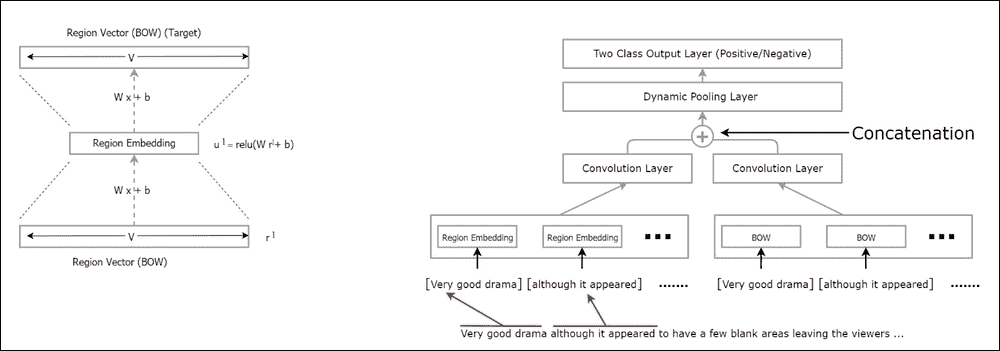

图 11.1:学习区域嵌入并使用区域嵌入进行情感分析

#### 学习区域嵌入

我们学习区域嵌入的方式和我们学习单词嵌入的方式一样。我们输入一个包含文本区域的输入，并要求模型预测目标上下文区域。例如，我们使用区域大小为三的短语:

非常好的戏剧，我很喜欢

然后，对于输入，我们使用这个:

*很好看的剧*

产出(目标)如下:

我很喜欢

作为一个练习，我们将看看学习过的区域嵌入是否有助于改进情感分析任务。为此，我们将使用在 http://ai.stanford.edu/~amaas/data/sentiment/[发现的数据集。这是一个包含 IMDB 电影评论的文本语料库。我们将首先通过训练嵌入层来学习有用的区域嵌入，以便为给定的输入文本区域正确地预测上下文区域。然后，我们将使用这些嵌入作为情感分析网络的*附加*输入。这可以在`ch11`文件夹的`tv_embeddings.ipynb`中作为练习使用。](http://ai.stanford.edu/~amaas/data/sentiment/)

#### 实施–区域嵌入

对于这个例子，我们将使用来自数据集的 400 个阳性和 400 个阴性样本作为我们的训练数据。我们还将建立一个包含大约 150 个阳性和 150 个阴性样本的验证集。我们只会掩饰这个实现，而不会讨论具体的细节。更多细节可以参考练习文件。

首先，对于学习区域嵌入，我们将定义一组完全连通的权重和偏差:

```
  w1 = tf.get_variable('w1', shape=[vocabulary_size,500],
      initializer = tf.contrib.layers.xavier_initializer_conv2d())
  b1 = tf.get_variable('b1',shape=[500],
      initializer = tf.random_normal_initializer(stddev=0.05))
```

接下来，使用权重和偏差，我们将计算校正了线性单位的隐藏值，这是我们在神经网络中使用的一种非线性:

```
  h = tf.nn.relu(
      tf.matmul(train_dataset,w1) + b1
  )
```

然后，我们将定义另一组权重和偏差，作为顶部回归层。对于给定的文本区域，顶层预测上下文区域的弓形表示:

```
  w = tf.get_variable('linear_w', shape=[500, vocabulary_size],
      initializer= tf.contrib.layers.xavier_initializer())
  b = tf.get_variable('linear_b', shape=[vocabulary_size],
      initializer= tf.random_normal_initializer(stddev=0.05))
```

接下来，我们将计算最终输出:

```
  out =tf.matmul(h,w)+b
```

我们现在将定义损失。损失是预测的上下文区域 BOW 和真实上下文 BOW 之间的均方误差。我们将使用`train_mask`来屏蔽一些不存在的单词(真实 BOW 表示中的*0*，类似于我们在[第 3 章](ch03.html "Chapter 3. Word2vec – Learning Word Embeddings")、*Word 2 vec–学习单词嵌入*中讨论的负采样方法。

```
  loss = tf.reduce_mean(tf.reduce_sum(train_mask*(
         out - train_labels)**2,axis=1))
```

最后，我们将使用优化器来优化定义的损失:

```
  optimizer = tf.train.AdamOptimizer(
              learning_rate = 0.0005).minimize(loss)
```

然后，我们将使用学习到的嵌入作为附加输入来分类文本，如图*图 11.1* 所示。为此，我们将为给定评论中找到的所有文本区域顺序连接区域嵌入。我们将为 BOW 输入做同样的事情。然后，我们将并行卷积连接的向量(即区域嵌入和弓形向量),并连接卷积输出。接下来，我们将把级联的卷积输出馈送到顶部分类层，该层输出电影评论是正面的还是负面的。

#### 分类准确度

当根据保留的验证数据集对性能进行测量时，具有电视嵌入的模型似乎比不使用电视嵌入的模型略胜一筹(参见*图 11.2* )。这种差异可以通过采用正则化技术来改善，如辍学和训练更长的时间。因此，我们可以得出结论，与仅使用诸如 BOW 的简单表示相比，电视嵌入事实上有助于文本分类任务的更好性能:

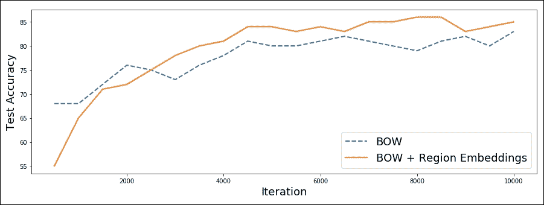

图 11.2:使用 BOW 输入的模型和使用 BOW 和区域嵌入的模型的情感分类准确度

### 概率单词嵌入

概率单词嵌入模型是单词嵌入领域的另一个新发展。*李少华等人的生成式单词嵌入模型及其低秩半正定解*【3】引入了一种被称为 **PSDVec** 的单词嵌入技术，该技术产生的嵌入与我们在本书前面看到的确定性单词向量模型(例如，skip-gram、CBOW 和 GloVe)不同且信息量更大。PSDVecs 将为每个单词嵌入提供嵌入分布，而不是精确的数字向量。例如，如果我们假设单词向量的嵌入大小为 1，GloVe 说单词 *dog* 的单词向量为 0.5，PSDVec 将提供所有可能值的分布，如图*图 11.3* 所示。PSDVec 可能会说， *dog* 的嵌入值可以是概率较高的 0.5(例如 0.3)，也可以是概率较低的 0.1(例如 0.05):

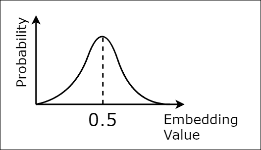

图 11.3:PSD vec 为一维嵌入提供了什么

概率模型比确定性模型(如 Word2vec)有更丰富的解释。为了了解单词向量的概率分布，他们使用了一种被称为**变分推理**的技术。在他们的工作中，他们学习了一个嵌入层和一个残差层，后者捕捉了单词之间的噪声和非线性关系。作者表明，PSDVec 与标准的 Word2vec 和 GloVe 相比，提供了具有竞争力的性能。

### 集成嵌入

在他们的论文*学习单词元嵌入*【4】中，尹和辛里奇舒泽提出了一种方法来学习*元嵌入*，即从几个公开可用的嵌入集中学习集成嵌入模型。这种方法的两个主要好处是:( 1)由于它们利用了多个单词嵌入集而提高了性能;( 2)由于使用了多个单词嵌入集而提高了词汇覆盖率。

### 主题嵌入

主题嵌入也引起了 NLP 社区的兴趣。它允许任何文档由一组主题表示(例如，信息技术、医学和娱乐)，对于给定的文档，我们将计算每个主题的权重，表示该文档与该主题的相关程度。例如，关于将机器学习用于医疗保健的文档将对诸如*信息技术*和*医学*的主题具有较高的权重，但是对主题*法律*具有较低的权重。

刘洋等人的论文*主题词嵌入*【5】采用这种方法来学习词嵌入。**主题词嵌入** ( **TWE** )学习多原型嵌入。多原型嵌入不同于标准单词嵌入，因为它们根据单词使用的上下文给出不同的嵌入值。例如，在**信息技术** ( **IT** )， *Windows* 将给出一个不同的嵌入值，与它在 *home* 的上下文中提供的值相比。他们通过被称为**潜在狄利克雷分配** ( **LDA** )的过程来学习主题，这是一种用于主题建模的流行方法。作者在一个新闻组的多类文本分类任务中评估了他们的方法，该新闻组包含各种主题，如 IT、医学和政治。TWE 优于其他主题建模方法，如单独使用的 BOW 和 LDA。

## 神经机器翻译(NMT)

NMT 已经证明了它的多功能性，许多公司和研究人员正在投资改进 NMT 系统。NMTs 提供了当前最先进的翻译性能，这一点已经被自主翻译系统所证实。然而，这些系统仍然没有达到人工翻译的能力。因此，人们正在努力改进 NMT 系统。正如我们在[第 10 章](ch10.html "Chapter 10. Sequence-to-Sequence Learning – Neural Machine Translation")中讨论的那样，*序列对序列学习——神经机器翻译* MT 在制造和商业等各个领域都有潜力。实时机器翻译的另一个用例可以在旅游领域找到，其中游客可以在访问其他国家时获得各种语言的英语翻译(通过照片/语音/文本)。

### 改善注意机制

我们已经讨论过*注意力机制*，它消除了众所周知的性能瓶颈限制普通编码器-解码器风格的 NMTs。有了注意机制，解码者可以在每个解码步骤自由地查看完整的源句子。然而，改进并不止于此。已经提出的一个改进是在*基于注意力的神经机器翻译的有效方法*【6】、 *Minh-Thang Luong 等人*中发现的*输入反馈*方法。通过这种方法，我们将先前的注意力向量作为输入提供给解码器的当前时间步长。采取这种措施是为了使解码器知道先前的字对齐信息，因为这提高了 MT 系统的性能。

由 Taiki Watanabe 等人撰写的论文*基于 CKY 的用于神经机器翻译的卷积注意力*【7】介绍了一种方法，该方法使用复杂的**卷积神经网络** ( **CNN** )来学习在源句子中的何处关注。这往往会提供更好的结果，因为与最初的注意力机制中使用的多层感知器相比，CNN 擅长收集空间信息。

### 混合 MT 车型

正如我们在[第 10 章](ch10.html "Chapter 10. Sequence-to-Sequence Learning – Neural Machine Translation")、*序列对序列学习-神经机器翻译*中实现的 NMT 系统的结果中看到的，预测通常包括`<unk>`令牌。这是为了替换预测中出现的罕见单词。然而，我们不希望这种行为。所以应该有办法把源句和目标句中的这些生僻字换成一些有意义的词。

然而，将一种语言中所有可能的单词都包含在词汇表中是不现实的，因为这将产生一个巨大的数据库。目前，牛津英语词典包含超过 15 万个不同的单词。然而，加上世界上各种时态的动词、名称和物体，这很快就达到了难以管理的数字。

这就是混合动力车型派上用场的地方(见*图 11.4* )。在混合模型中，我们不使用`<unk>`标记替换罕见的单词。相反，我们将单词保留在句子中，当在源句子中遇到一个罕见的单词时，我们将处理该单词的任务委托给字符级编码器。因为可能的字符非常少，所以这种方法非常可行。然后，字符级编码器的最后状态被返回给基于单词的机器翻译器，并正常地继续整个句子。同样，当解码器输出一个`<unk>`令牌时，同样的过程也用于解码器。这是在 *Minh-Thang Luong 的论文《神经机器翻译*【8】中介绍的。你可以在 https://github.com/lmthang/nmt.hybrid[找到一个混合 NMT 模型的实现。](https://github.com/lmthang/nmt.hybrid)

这里，为了清楚起见，我们将以伪代码的形式显示混合 NMT 中使用的预测方法。

对于源句子中的每个单词，如下所示:

```
If word != <unk>
    encode the word with the word-based encoder
Else
    For each character in actual rare word
        Encode with the character-based encoder
    Return last hidden state of the char-based encoder as the input to the word-based encoder, instead of the <unk> token
```

对于解码器预测的每个字，预测如下:

```
If word != <unk>
    Decode with the word-based decoder
If word == <end>
    Stop prediction
Else
    Initialize the character level decoder with the word-based decoder hidden state
    Output a sequence of characters using the character level decoder until <end> is output
```

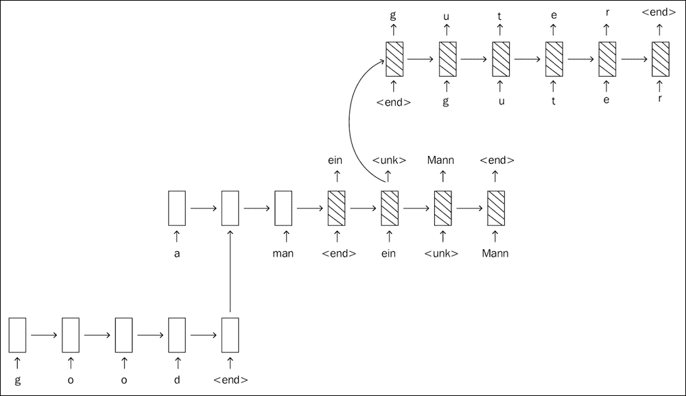

图 11.4:混合神经机器翻译模型

现在，让我们来看看我们将来会看到的一些有前途的 NLP 方向的。这些方向包括将 NLP 与其他已建立的研究领域相结合，如强化学习和**生成** **对抗模型** ( **GANs** )。

<title>Penetration into other research fields</title>   

# 向其他研究领域渗透

接下来我们将讨论三个不同的领域，它们已经与 NLP 融合，产生了一些有趣的机器学习任务。我们将讨论三个具体领域:

*   自然语言处理和计算机视觉
*   自然语言处理和强化学习
*   自然语言处理和生成对抗网络

## 结合自然语言处理和计算机视觉

首先我们将讨论两个应用，其中 NLP 与各种计算机视觉应用相结合来处理多模态数据(即图像和文本)。

### 视觉问答(VQA)

VQA 是一个新奇的研究领域，这里的焦点是为一个关于图像的文本问题提供答案。例如，考虑这些关于*图 11.5* 的问题:

Q1:沙发是什么颜色的？

Q2:有多少把黑色的椅子？


图 11.5:我们已经问过问题的图像

向系统提供这种类型的信息后，系统应输出以下内容(最好是):

回答 Q1:沙发的颜色是黑色的

回答 Q2:房间里有两把黑色的椅子

这类任务的学习模型与我们在[第 9 章](ch09.html "Chapter 9. Applications of LSTM – Image Caption Generation")、*LSTM 的应用-图像字幕生成*中用于图像字幕生成的架构非常相似。数据集将由图像和对应于图像的问题和答案组成。

培训过程如下:

1.  通过 CNN(例如，在 ImageNet 上预先训练的)输入图像，以获得表示图像的上下文向量
2.  创建一个数据序列，该序列由`(image encoding, <s>, question, </s>, <s>, answer, </s>)`组成，`<s>`表示开始，`</s>`是一个标记问题结束的特殊标记
3.  使用此序列训练 LSTM 回答相应问题

预测时，过程如下:

1.  通过 CNN(例如，在 ImageNet 上预先训练的)输入图像，以获得表示图像的上下文向量。
2.  创建一个数据序列，该序列由`(image encoding, <s>, question, </s>, <s>).`组成
3.  将序列输入到 LSTM，一旦输入了最后一个`<s>`，它就通过输入最后一个预测的字作为下一步的输入来迭代预测字，直到 LSTM 输出`</s>`。新预测的单词将组成答案。

在*探索用于图像问答的模型和数据*【8】、*任和其他*中解释了一种早期的基于 CNN 和 LSTM 的模型，该模型成功地用于回答关于图像的问题。另一种更先进的方法是在*视觉问答的层次化问题-图像协同注意*【9】，*陆等人*中提出的。

用 TensorFlow 编写的 VQA 系统的代码可在`https://github.com/tensorflow/models/tree/master/research/qa_kg`获得。这段代码包含了*学会推理:端到端模块网络视觉问答*【10】，*胡荣航等人*一文中描述的方法。

在[http://www.visualqa.org/vqa_v1_download.html](http://www.visualqa.org/vqa_v1_download.html)可以找到用于训练和测试 VQA 模型的良好数据集(带有图像的数据集，以及对应于每个图像的问题和答案)，该数据集在 *VQA:视觉问题回答*【11】、*斯坦尼斯劳·安托尔等人*中有所介绍。

### 关注图像的字幕生成

一篇名为 *Show，Attend and Tell:Neural Image Caption Generation with Visual Attention*【12】， *Kelvin* *徐等人*的论文描述了一项有趣的研究，其中的重点是学习在图像中的何处寻找以生成字幕。这里的主要贡献是，与使用 CNN 的全连接层来提取特征向量的标准图像字幕生成模型不同，该方法使用较低的卷积层作为图像的特征表示。然后，在卷积层的顶部，它使用了 2D 注意力层(类似于我们在[第 10 章](ch10.html "Chapter 10. Sequence-to-Sequence Learning – Neural Machine Translation")、*序列到序列学习-神经机器翻译*中使用的一维注意力层)，它代表了模型在生成单词时应该关注的图像部分。例如，给定一幅坐在地毯上的*狗的图像，当生成单词*狗*时，图像字幕生成器可以更多地关注图像中狗所在的部分，而不是图像的其余部分。*

## 强化学习

NLP 利用的另一个研究领域是**强化学习** ( **RL** )。NLP 和 RL 几十年来没有相互作用，并且看到 NLP 问题如何通过 RL 透镜公式化并通过 RL 技术解决是非常有趣的。我们来快速了解一下 RL 是什么。在 RL 中，代理与环境交互。代理可以观察环境(完全或部分)，环境作为一种状态反馈给代理。然后，根据状态，代理将采取从某个动作空间采样的动作。最后，在行动执行之后，将向代理提供奖励。代理人的目标是使其积累的长期回报最大化。

接下来我们将讨论 RL 如何用于解决各种 NLP 任务。首先，我们将讨论 RL 如何被用来教几个代理一种“语言”,他们用这种“语言”来交流数据。接下来，RL 将被用来训练代理，通过就用户没有指定的信息提出问题来更好地满足用户的请求。

### 教导代理使用自己的语言进行交流

在*多智能体合作和(自然)语言的出现*【13】，*安吉里基·拉扎里杜等人*教几个智能体学习一种独特的语言进行交流。这是通过从组中选择两个代理(发送者和接收者)来具体完成的。给发送者一对图像(其中一个图像是目标)，发送者应该为接收者发送一个小消息。该消息由从固定词汇中选择的符号组成，该词汇最初在符号之间没有语义含义。接收者看到图像，但不知道目标，应该从接收到的信息中识别目标。代理人的最终目标是为看起来相似的图像激活相同的符号。如果接收者正确预测目标图像，两个代理都将获得 1 的奖励；如果失败，双方都将获得 0 英镑的奖励。这在*图 11.6* 中描述:

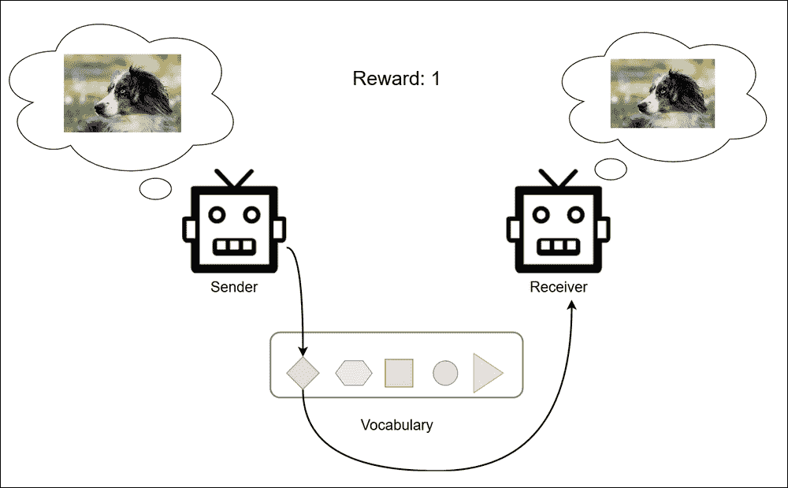

图 11.6:代理学习使用词汇来交流图像，每次只提供一幅图像。如果接收者正确识别图像，发送者和接收者都将获得积极的奖励。

### 对话代理与强化学习

以下两篇论文使用 RL 训练基于端到端深度学习的对话系统:*面向信息访问的对话代理端到端强化学习*【14】， *Bhuwan Dhingra 等*和*一个基于网络的端到端可训练的面向任务的对话系统*【15】， *Tsung-Hsien Wen 等*。对话系统用自然语言与人类对话，并试图完成由人类说出的短语所暗示的任务。例如，一个人可能会这样问:

悉尼有哪些法国餐厅？

然后代理应该将问题转换成系统期望的特征向量，这是通过一个叫做**信念跟踪器**的系统实现的。信念跟踪器将自由形式的自然语言请求映射到固定的特征向量。这也可以看作是一个语义解析器。然后，使用特征向量来查询结构化知识库以找到答案。

然而，也有一些棘手的情况，人们在请求中提供了部分信息。例如，人类可能会问以下问题:

*镇上最好的餐馆有哪些？*

那么系统可能会问:

哪个城镇？

对此，人类回答如下:

悉尼。

那么系统可能会问:

*哪个菜系？*

对此，人类回答如下:

*法语。*

在获得完成请求所需的所有信息后，系统将查询知识库并找到答案。可以设计一个奖励函数，每当系统找到正确答案时就给予肯定的奖励。这将促使代理提出正确的相关问题，以填补用户请求中缺失的信息。

## 自然语言处理的生成对抗网络

生成模型是一个模型家族，能够从一些观察到的样本分布中生成新的样本。当我们使用 LSTM 生成文本时，我们已经看到了一个生成模型的示例。另一个例子是生成图像。在手写数字上训练模型，并要求该模型生成新的手写数字。对于生成图像，我们可以使用**生成对抗模型** ( **GANs** )，这是一种流行的生成方法。GAN 的外观如图*图 11.7* 所示:

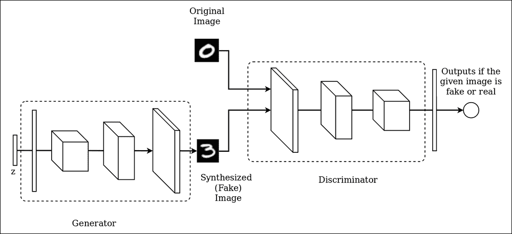

图 11.7。生成性对抗网络

系统中有两个不同的组件:一个发生器和一个鉴别器。生成器的目标是生成看起来像真实图像的图像。鉴别器试图正确地区分真实的(例如，真实的手写图像)和伪造的图像(由生成器生成)。我们将为生成器提供一些噪声(即从正态分布生成的样本值)，它会生成一个图像。生成器是一个*逆* CNN，它以一个矢量作为输入，输出一个图像。这与标准的 CNN 形成对比，后者将图像作为输入并输出预测向量。鉴别器试图区分真实图像和生成器生成的图像。所以刚开始的时候，鉴别者很容易分辨真假。发生器经过优化，使鉴别器更难识别真假。通过这个过程，生成器变得善于生成看起来像真实图像的图像。

GANs 最初被设计用来生成真实的图像。然而，已经有过几次尝试将甘用于生成句子。*图 11.8* 说明了使用 GAN 生成句子的一般方法。接下来，让我们看看这种方法的具体细节:

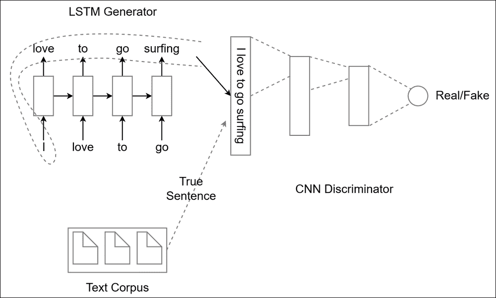

图 11.8:使用 LSTM 生成器和 CNN 鉴别器生成句子的一般概念

在*对抗训练生成文本*【16】，*张等人*使用了一种改进的甘用于生成文本。在他们的工作中，与我们之前讨论的卷积 GAN 有显著的不同。首先，他们使用 LSTM 生成器，它从词汇表中随机抽取一些条目作为输入，生成一个任意长的句子。接下来，鉴别器是一个 CNN，它被训练成将给定的句子分为两类(即假的或真的)。将数据馈送给 CNN 并进行训练，类似于我们在[第五章](ch05.html "Chapter 5. Sentence Classification with Convolutional Neural Networks")、*用卷积神经网络进行句子分类*中讨论的句子分类 CNN。第一，CNN 会很擅长辨别真句和假句。随着时间的推移，LSTM 将被优化，以产生越来越多看起来更真实的句子来欺骗分类器。

在 *SeqGAN:具有策略梯度的序列生成对抗网*【17】， *Lantao Yu 和其他人*展示了使用生成模型生成文本的另一种方法。同样在这种情况下，生成器是网络，鉴别器是 CNN 网络(例如，类似于*通过对抗性训练生成文本*【16】、*张等人*)。然而，与该工作中的方法不同，训练过程被公式化为强化学习问题。

状态是生成器当前生成的文本串，动作空间是从中选词的词汇。这一过程一直持续到给定步骤的全文生成为止。只有在整个序列结束时才能获得奖励。鉴别器的输出被用作奖励。因此，如果鉴别器的输出接近 1(即鉴别器认为数据是真实的)，奖励就会高，如果输出接近 0，奖励就会低。然后定义奖励，作者使用*策略梯度*通过反向传播训练生成器。具体来说，策略梯度计算生成器中参数(即权重)相对于鉴别器产生的奖励的梯度。SeqGAN 的 TensorFlow 实现可在 https://github.com/LantaoYu/SeqGAN 获得。

<title>Towards Artificial General Intelligence</title>   

# 走向人工通用智能

**人工通用智能** ( **AGI** )使机器能够执行人类可以执行的认知或智力任务。这是一个不同于人工智能或者比人工智能更难的概念，因为 AGI 涉及实现一般智能，而不仅仅是在给定必要数据的情况下让机器执行任务。例如，假设我们将一个机器人放在一个新奇的环境中(比如说，一个机器人从未去过的房子)，并让它煮咖啡。如果它真的能在房子里导航，找到机器，学习如何操作它，执行制作咖啡所需的正确动作序列，并把咖啡带给人类，那么我们可以说机器人已经实现了 AGI。我们离实现 AGI 目标还很远，但正在朝着这个方向迈出步伐。此外，NLP 将在这方面发挥重要作用，因为人类最自然的交互方式是语音交流。

这里将要讨论的论文是试图学习做许多任务的单一模型。换句话说，单个端到端模型将能够对图像进行分类、检测对象、识别语音、在语言之间进行翻译等等。我们可以将能够完成许多任务的机器学习模型视为迈向 AGI 的一步。

## 一个模型学会所有

在*一个模型学会全部*【18】， *Lukasz Kaiser 和其他人*介绍了一个单一的深度学习模型，它能够学习许多任务(例如，图像分类、图像字幕生成、语言翻译和语音识别)。具体来说，这个模型(称为**多模型**)由几个模块组成:子网、编码器、输入/输出混合器和解码器。

首先，多模型包括几个子网或*模态网*。模态网络将属于某些特定模态的输入转换为统一的表示。这样，具有不同模态的所有输入可以由单个深度网络处理。请注意，模态网络不是特定于任务的；它们只是特定于输入模式的。这意味着具有相同输入模态的几个任务将共享单个模态网络。接下来，我们将列出编码器、I/O 混合器和解码器所扮演的角色。

编码器使用诸如卷积块、注意块和专家块的混合的计算元素来处理由模态网络产生的输入。我们将在后面描述每个元素所完成的任务。

I/O 混合器将编码输入与先前观察到的输出组合(或混合)以产生编码输出。该模块将输入和之前观察到的输出作为*自回归模型*进行处理。为了理解什么是自回归模型，让我们考虑一个用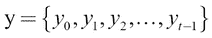表示的时间序列。在其最简单的形式中，自回归模型将*y[t]预测为*y*t-1*的函数(即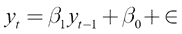，其中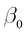和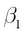是可学习的系数，而捕捉存在于 *y* 中的噪声。然而，这可以推广到任意数量的先前的 *y* 值，例如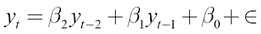。这在多模型处理多种类型的时间序列数据(如语音和文本)时非常有用。

解码器接收编码输出和编码输入，并使用卷积和注意块以及专家块的混合产生解码输出。我们将在这里描述这些块:

*   **卷积块**:卷积块检测局部和空间模式，并将它们转换成特征图。
*   **关注块**:关注块决定在编码/解码时，在输入中关注什么。
*   **混合专家模块**:混合专家模块是一种以可忽略不计的额外计算成本增加模型容量的方法。混合专家是几个前馈网络(即专家)的集合，具有可训练的(和可区分的)门控机制，该机制根据输入选择不同的网络。

虽然细节差异很大，但你应该能够看出与我们在[第 10 章](ch10.html "Chapter 10. Sequence-to-Sequence Learning – Neural Machine Translation")、*序列到序列学习-神经机器翻译*中研究的 NMT 系统的相似之处。多模型首先对输入进行编码，就像我们通过 NMT 编码器对源句子进行编码一样。最后，多模型解码并生成人类可读的输出，就像 NMT 解码器生成目标句子一样。

多模型经过训练，可以使用以下数据集执行各种任务，这些数据集在论文中有所阐述*一个模型学习所有数据集*、*凯泽等人*:

1.  华尔街日报(WSJ)语音语料库:WSJ 语音语料库是一个大型数据集，包含各种人(包括具有不同经验的记者)的话语(约 73 小时的讲话)。该数据集位于[https://catalog.ldc.upenn.edu/ldc93s6a](https://catalog.ldc.upenn.edu/ldc93s6a)。
2.  ImageNet 数据集:ImageNet 数据集是我们在[第 9 章](ch09.html "Chapter 9. Applications of LSTM – Image Caption Generation")、*LSTM 的应用-图像标题生成*中讨论的图像数据集。它包含 100 多万张图片，分属 1000 个不同的类别。该数据集位于[image-net.org/download](http://image-net.org/download)。
3.  MS-COCO 图像字幕数据集:MS-COCO 数据也用于[第 9 章](ch09.html "Chapter 9. Applications of LSTM – Image Caption Generation")、*LSTM 应用-图像字幕生成*。这包含了人类生成的图像和图像描述。这个数据集可以在 http://cocodataset.org/#download 找到。
4.  WSJ 解析数据集:解析是识别句子中的名词、行列式、动词、名词短语、动词短语等，并为该句子构建解析树的过程。在 WSJ 解析数据集中找到了通过解析 WSJ 材料的语料库而构建的数据集。该数据集位于 https://catalog.ldc.upenn.edu/ldc99t42 的。
5.  WMT 英德翻译语料库:这是一个双语文本语料库，有英语句子和相应的德语翻译，类似于我们在[第十章](ch10.html "Chapter 10. Sequence-to-Sequence Learning – Neural Machine Translation")、*序列对序列学习——神经机器翻译*中使用的数据集。数据集可以在 http://www.statmt.org/wmt14/translation-task.html 找到。
6.  5 的反面:这是德-英翻译。
7.  WMT 英法翻译语料库:这是一个双语文本语料库，有英语句子和对应的法语翻译，类似于我们在[第十章](ch10.html "Chapter 10. Sequence-to-Sequence Learning – Neural Machine Translation")、*序列对序列学习——神经机器翻译*中使用的数据集。数据集在[http://www.statmt.org/wmt14/translation-task.html](http://www.statmt.org/wmt14/translation-task.html)找到。
8.  7 的反面:这是法英翻译。在*一个学习全部*的模型中，作者实际上在这里说*德语法语*，我们认为这是一个无意的错误，因为前面的语料库是英语和法语翻译。

在对这些数据集进行训练后，该模型有望以良好的准确性执行以下任务:

*   将语音转换为文本
*   为给定图像生成字幕
*   识别给定图像中的对象
*   从英语翻译成德语或法语
*   为英语构建解析树

在 https://github.com/tensorflow/tensor2tensor[和](https://github.com/tensorflow/tensor2tensor)发现了一个 TensorFlow 实现。

## 联合多任务模型——为多个 NLP 任务发展神经网络

在*一个联合多任务模型——为多个 NLP 任务培养一个神经网络*【19】，*和马·桥本和其他人*在各种 NLP 任务上训练一个端到端模型。然而，该方法公式不同于之前讨论的方法。在这种情况下，模型的较低层学习较简单的任务，而较高层(或较深层)学习更高级的任务。为了实现这一点，训练所需的标签(例如，**词性** ( **词性**)标签)被提供给网络的各个级别。这些任务按照这个顺序(也就是在网络中从低到高)被分为三种不同的类型:单词级任务、句法任务和语义任务。当以这种方式组织时，更高层可以使用完成更简单任务的知识来执行更高级的任务(例如，识别句子的依赖性可以从 POS 标签中受益)。这个概念在*图 11.9* 中进行了说明。

### 第一级——基于单词的任务

前两层执行单词级任务。给定一个句子，第一层对句子中的每个单词进行词性标注。下一层执行分块，这是一个再次给每个单词分配标签的过程。

### 第二级——句法任务

下一层对句子进行依存解析。依存句法分析的任务是分析句子的语法结构并识别单词之间的关系。

### 第三级——语义级任务

下一层编码句子的相关度信息。然而，关联性是在两个句子之间衡量的。为了并行处理两个句子，我们有两个前面描述过的并行堆栈。因此，我们有两个不同的网络对两个句子的相关性进行编码。最后一层执行文本蕴涵。语篇蕴涵是分析前提句(第二句)是否包含假设句(第一句)的任务。输出可以是包含、矛盾或中性的。这里我们将列出肯定/否定和中性文本蕴涵的例子:

*   Positive:

    假设:*多云天气导致下雨*

    前提:*如果是阴天，就会下雨*

*   Negative:

    假设:*多云的天空不会导致下雨*

    前提:*如果是阴天，就会下雨*

*   Neutral:

    假设:*多云的天空导致下雨*

    前提:*如果是阴天，你的狗会叫*

    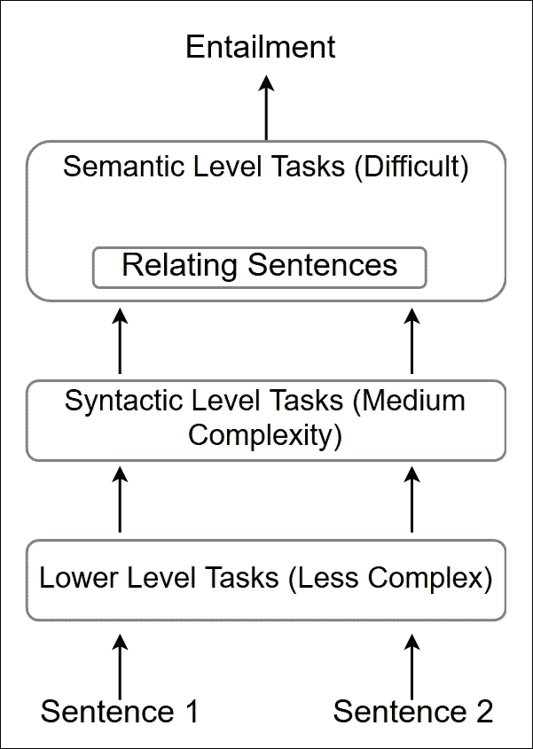

    图 11.9:以自下而上的方式解决日益复杂的任务

<title>NLP for social media</title>   

# 社交媒体的自然语言处理

现在我们将讨论 NLP 如何影响社交媒体挖掘。这里我们将讨论几篇论文中的发现。这些发现包括从真相中检测谣言，并检测情绪和识别政治家对文字的操纵，例如，以获得更多的支持(即政治诬陷)。

## 检测社交媒体中的谣言

在*利用微博网站的社会背景信息的时间序列检测谣言*【20】，*马静等人*提出了一种检测微博谣言的方法。谣言是故意制造虚假或真相未被证实的故事或陈述。在早期阶段识别谣言对于防止虚假/无效信息被传递给人们是非常重要的。本文将事件定义为与该事件相关的一组微博。为每个微博导出时间敏感的上下文特征，并且根据微博出现的时间将它们分成时间间隔。此后，他们使用**动态序列时间结构** ( **DSTS** )来学习演化上下文特征的时间序列的“形状”。更具体地，给定一系列时间上下文特征，DSTS 用随时间变化的特征向量的组合来表示时间序列的形状 *(f [0]* *，f [1]* *，f [2]* *，…，f[t]*【T27)以及随时间变化的连续上下文特征之间的斜率的函数 *(0，f 这有助于识别谣言，因为这些模式对于谣言和非谣言往往表现不同。例如，微博中与非谣言事件相关的问号数量会随着时间的推移而减少，而对于谣言来说则不会。***

## 检测社交媒体中的情绪

*EmoNet:使用门控递归神经网络的细粒度情绪检测*【21】， *Muhammad Abdul-Mageed 和 Lyle Ungar* 展示了一种用于检测社交媒体帖子(例如，推文)中的情绪的方法。检测社交媒体帖子中的情绪起着重要的作用，因为情绪有助于确定一个人的身心健康。T4 探测情绪的能力也提供了对顾客的洞察力，这对企业来说是很有价值的。因此，正确挖掘社交媒体帖子中的情绪可以为父母提供孩子的身体/精神状态，或者可以帮助企业发展。然而，自动情绪检测方法存在技术障碍，因为情绪本身的争议性导致数据量有限。例如，当一个人说，*我喜欢星期一*，这可能是一句讽刺的话，表明对一个工作的人的厌恶。相反，也可能是有人因为周一举行的每周庆祝活动而对周一感到开心。

作者使用普卢奇克的情绪之轮(见*图 11.10* )对情绪进行分类，从中他们得出了 24 个不同的类别。然而，tweets 可能使用不同的同义词来表示同一件事(例如，happy 可以用 happy、blindy 和 excited 来表示)。因此，作者使用谷歌同义词和其他资源，找到了 665 个不同的情感标签，分属 24 个主要类别。

接下来，为了收集数据，他们浏览了自 2009 年以来的推文帖子，收集了大约 5 亿条推文。然后，他们对原始数据进行预处理，主要是为了删除重复和带有多种情绪的推文，最终得到了大约 150 万条推文。最后，门控循环网络(即 GRUs 网络)被用于对推文进行分类，并预测给定推文表达的是哪种类型的情绪:

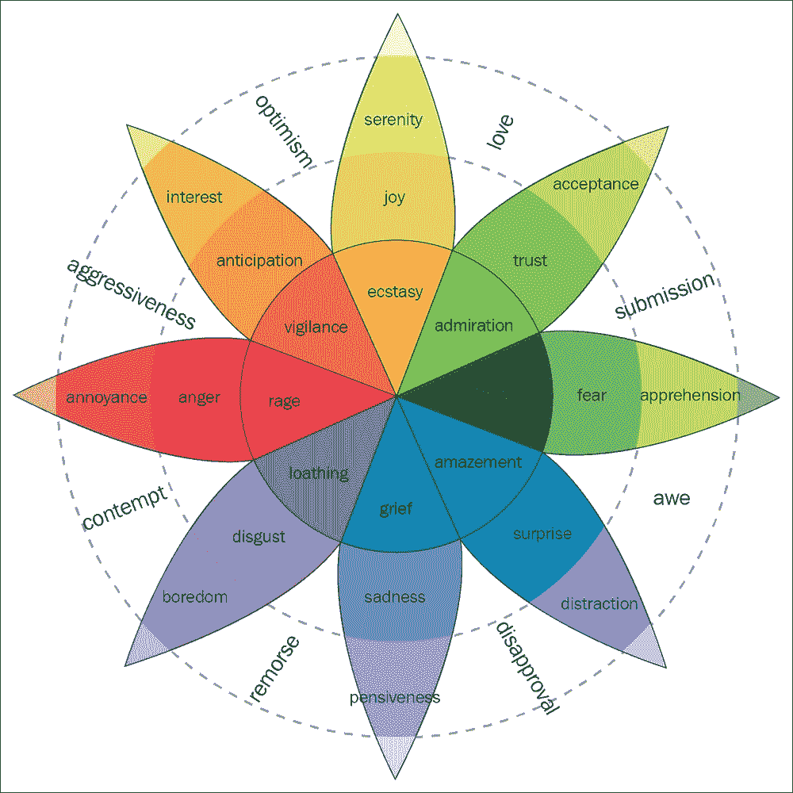

图 11.16:普卢奇克的情感之轮

## 分析推文中的政治框架

社交媒体被广泛用作各种政治任务的平台。在最近的美国选举中，候选人大量利用 Twitter 宣传他们的议程，扩大他们的支持者基础，并攻击和报复反对的候选人。这就凸显了这类政治岗位对于挖掘重要信息的重要性。识别*政治框架*就是这样一项重要而困难的任务。政治框架指的是小心操纵语言来控制公众的看法。

在*利用行为和社会信息对 Twitter 上的政治话语进行弱监督集体分类的过程中*【22】， *Kristen Johnson 和其他人*开发了一个带标签的数据集，由随机选择的 40 名国会议员的推文组成。首先，提取推文，并使用*政策框架码本*标注推文。接下来，由于问题的动态性质，弱监督模型被用来学习推文。弱监督模型旨在利用有限的数据进行学习(与深度学习模型不同)。

<title>New tasks emerging</title>   

# 新任务不断涌现

现在我们将研究最近出现的几个新领域。这些领域包括检测讽刺、语言基础(即从自然语言中引出常识的过程)和略读文本。

## 察觉讥讽

讽刺是当一个人说了一些实际上与话语相反的话(例如，*我爱星期一！*)。有时检测讽刺对人类来说甚至是困难的，而通过 NLP 检测讽刺则是一项更加困难的任务。*讽刺符号:使用基于情感的单语机器翻译*【23】， *Lotem Peled 和 Roi Reichart* ，使用 NLP 来检测 Twitter 帖子中的讽刺。他们首先创建了一个包含 3000 条推文对的数据集，其中一条推文是讽刺性的推文，另一条推文是解密的非讽刺性推文。解密的推文是由五名人类法官创建的，他们看着推文并提出实际意义。然后他们用一个*单语*机器翻译机制来学习讽刺。这是一个序列到序列模型，正如我们在前面的章节中所讨论的。这里我们不是给出一对属于两种不同语言的句子，而是提供讽刺和非讽刺的句子对。

## 语言基础

语言基础是从自然语言中获得常识的任务。例如，当我们使用语言时，通常会有一个强烈的概念想法，即我们想要解释的对象和动作。这允许我们得出关于物体的各种结论，即使这些结论没有直接出现在句子中。然而，对于机器来说，情况并非如此。机器不会通过将自然语言与它们所代表的实际概念实体联系起来来学习自然语言。然而，如果我们想要建立真正的人工智能，这是必不可少的一部分。语言基础是实现这一属性的任务。例如，当我们说*汽车进入车库*时，它暗示车库比汽车大。然而，它不一定是由机器学习算法学习的，除非因为学习而获得奖励。在*动词物理学:动作和物体的相对物理知识*【24】中，麦克斯韦·福布斯和叶筋·崔提出了一种学习语言基础的方法。

在本文中，作者关注接地的五个不同属性或维度:大小、重量、强度、刚性和速度。最后，使用因子图模型来学习出现在对话中的对象的各种属性。因子图包含由每个属性的两个子图组成的子图——对象子图和动词子图。

接下来，每个子图包含节点。有两种类型的节点:

*   **对象对节点(在对象子图中找到的节点)**:这些节点捕获两个对象的属性的相对强度(例如，用 : *大小概率(人类)>大小(浆果)*)
*   **动作框架节点(在动词子图中找到的节点)**:这些节点捕获动词如何与属性相关联(即，用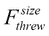表示:对于句子 *x 抛出 y* ， *size(x) > size(y)* )

然后，可以在两个对象对节点或两个动作帧节点之间创建连接(即，二元因素)，这取决于给定节点对出现在相似上下文中的可能性。例如，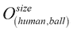和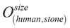应该具有高二进制因子，而和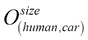应该具有低二进制因子。然后通过对非结构化自然语言的学习，建立最关键的连接(即动作帧节点和对象对节点之间的连接)。

最后有了这个图，如果需要知道*体重(人)*和*体重(球)*之间的关系，就可以推断出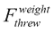和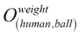的连接强度。这是通过所谓的*循环信念传播*来实现的。

## 使用 LSTMs 略读文本

略读文本在许多 NLP 活动中扮演着重要的角色。例如，如果一个 LSTM 被设计来回答书中的问题，它可能不应该阅读全文，而是只阅读包含有助于回答问题的信息的相关部分。另一个用途可能是文档检索，其中需要从现有的大型文档库中获取一组包含一些文本的相关文档。在*学习略读文本*【25】*中，亚当斯·禹卫和其他人*提出了一个名为 LSTM-跳跃的模型来做这件事。

有三个重要的超参数:

*   *N* :这是允许的总跳转次数
*   *R* :这是两次跳转之间要读取的令牌数
*   K :这是允许的最大跳跃尺寸(一步)

接下来，用 softmax 图层创建一个 LSTM，在 LSTM 的顶部有 K 个*节点。该 softmax 层决定在给定的时间步长进行多少次跳跃。这个 softmax 层的功能有点类似于注意力机制。满足下列条件之一时停止跳跃或撇除:*

*   跳转 softmax 样本 a 0
*   LSTM 到达了文本的结尾
*   跳跃次数超过 *N*

<title>Newer machine learning models</title>   

# 更新的机器学习模型

现在我们将讨论几个新的机器学习模型，这些模型已经出现以解决当前模型的各种限制(例如，标准 LSTMs)。一个这样的模型是分阶段 LSTMs，它允许我们在学习过程中关注未来发生的非常具体的事件。另一个模型是**扩展 RNNs** ( **DRNNs** )，它提供了一种对输入中存在的复杂依赖关系进行建模的方法。与简单地迭代展开的 rnn 相比，DRNNs 还支持展开的 rnn 的并行计算。

## 阶段性 LSTM

当前的 LSTM 网络在许多顺序学习任务中表现出了显著的表现。然而，它们不太适合处理不规则定时的数据，例如由事件驱动的传感器提供的数据。这主要是因为无论事件是否发生，LSTM 的单元状态和隐藏状态都是不断更新的。这种行为会导致 LSTM 忽略可能很少或不定期发生的特殊事件。

分阶段 LSTM 是在*分阶段 LSTM:加速长序列或基于事件序列的递归网络训练*【26】、*丹尼尔尼尔等人*中引入的，他们试图通过引入新的*时间门*来解决这个问题。仅当时间门打开时，才允许更新单元状态和隐藏状态。因此，除非事件发生，否则时间门将关闭，导致单元状态和隐藏状态保持相同。这种行为有助于将信息保存更长时间，并关注发生的事件。*图 11.11* 说明了一般概念。

这种定时门操作通过三个新引入的参数来实现:

*   :控制实时振荡周期
*   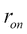:控制闸门完全打开的时间
*   *s*: This controls the phase shift of the oscillations of the gate

    这些变量可以与 LSTM 的其余参数一起学习。TensorFlow 已经发布了一个分阶段 LSTMs 的实现，可在[https://www . tensor flow . org/API _ docs/python/TF/contrib/rnn/PhasedLSTMCell](https://www.tensorflow.org/api_docs/python/tf/contrib/rnn/PhasedLSTMCell)找到:

    

    图 11.11:定时门的一般概念。仅当定时门打开时，才允许更新隐藏状态和单元状态。

## 扩张型递归神经网络

当前的 rnn 在学习长期依赖性方面有几个限制，例如:

*   输入中存在复杂的依赖关系
*   消失渐变
*   学习的有效并行化

DRNNs 在*扩张递归神经网络*【27】，*常等人*中介绍。他们试图一次解决所有这些限制。

DRNNs 通过确保给定状态连接到旧的隐藏状态，而不仅仅是前一个隐藏状态，解决了学习复杂依赖关系的问题。这种设计有助于更有效地学习长期依赖性。

这种体系结构解决了消失梯度的问题，因为一个隐藏状态看到的是前一个隐藏状态之外的过去，所以很容易将梯度随着时间传播到更远的距离。

如果压缩 DRNN 架构，它代表了同时处理多个输入的标准 RNN。因此，再次通过设计，与标准 rnn 相比，DRNNs 允许更大的并行化。*图 11.12* 显示了 DRNNs 与标准 rnn 的不同之处。在 https://github.com/code-terminator/DilatedRNN 的[可以实现这一点。](https://github.com/code-terminator/DilatedRNN)

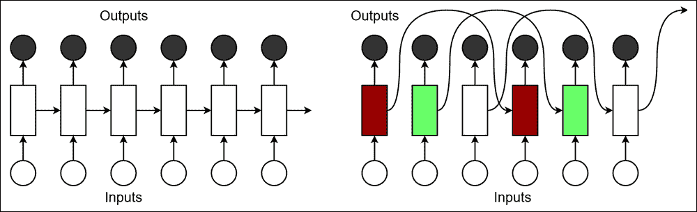

图 11.12:随时间展开的标准 RNN(左)和 d RNN(右)。不同阴影展开的 rnn 可以并行处理，因为它们没有任何共享连接。

<title>Summary</title>   

# 总结

本章的目的是了解自然语言处理的当前趋势，以及自然语言处理的未来发展方向。虽然这是一个非常广泛的主题，但我们讨论了 NLP 中最近取得的一些进展。作为当前的趋势，我们首先着眼于单词嵌入方面的进步。我们看到更精确的嵌入和更丰富的解释(例如，概率)正在出现。然后，我们研究了机器翻译方面的改进，因为它是 NLP 中最受欢迎的领域之一。我们看到，更好的注意力机制和更好的机器翻译模型都在出现，能够产生越来越真实的翻译。

然后，我们查看了 NLP 中正在进行的一些新研究(主要是在 2017 年)。首先，我们研究了自然语言处理在其他领域的渗透:计算机视觉、强化学习和生成对抗模型。我们研究了如何改进 NLP 系统，使其更接近实现 GAI。接下来，我们看看 NLP 在社交媒体方面取得了什么样的进展，例如 NLP 如何被用于检测和揭穿谣言，检测情绪，以及分析政治局势。

我们还研究了一些最近和更有趣的任务，这些任务在 NLP 社区中越来越受欢迎，例如学习使用编码器-解码器学习模型来检测讽刺，学习对某些话语所隐含的内容有透彻见解的语言基础，以及学习略读文本而不是从头到尾完整阅读文本。我们讨论了最近推出的一些最新的机器学习模型。分阶段 lstm 是 lstm 的高级类型，对如何更新单元状态和隐藏状态有更多的控制。这种行为允许 LSTMs 学习具有不规则性的长期依赖性。最后，我们讨论了另一种称为 DRNNs 的模型。DRNNs 引入了对标准 rnn 如何随时间展开的简单修改。通过这种修改，DRNNs 能够对复杂的依赖关系进行建模，解决消失梯度问题，并实现处理数据的更多并行化。

<title>References</title>   

# 参考文献

[1] *单词和短语的分布式表示及其组合性*， *T. Mikolov* ， *I. Sutskever* ， *K. Chen* ， *G. S. Corrado* ， *J. Dean* ，*神经信息处理系统进展*，*第 3111–3119 页*， *2013*

[2] *通过区域嵌入进行文本分类的半监督卷积神经网络*，*约翰逊，Rie* 和*张彤*，*神经信息处理系统进展*，*第 919-927 页*， *2015* 。

[3] *一种生成式单词嵌入模型及其低秩半正定解*，*，李，*，*，*，*苗*，*2015 自然语言处理经验方法会议论文集*，*第 1599-1609 页*， *2015* 。

[4] *学习词元嵌入*，*尹*，*辛里奇·舒尔茨*，*计算语言学协会第五十四届年会论文集*，*第一卷*，*第 1351-1360 页*， *2016* 。

[5] *话题词嵌入*、*、*、*蔡达生*、*孙茂松*、 *AAAI* 、*第 2418-2424 页*、 *2015* 。

[6] *基于注意力的神经机器翻译的有效方法*， *Thang Luong* ， *Hieu Pham* ， *Christopher D. Manning* ，*2015 自然语言处理经验方法会议论文集*，*第 1412-1421 页*， *2015* 。

[7] *基于 CKY 卷积注意的神经机器翻译*， *Watanabe，Taiki* ， *Akihiro Tamura* ，and *Takashi Ninomiya* ，*第八届国际自然语言处理联合会议论文集(第 2 卷:短文)*，*第 2 卷*，*第 1-6 页*

[8] *神经机器翻译*，*吴明良*。*斯坦福大学*， *2016* 。

【9】*探索图像问答的模型和数据*，*任，*，*瑞恩基洛*，*理查德泽梅尔*，*神经信息处理系统进展*，*第 2953-2961 页*， *2015* 。

【10】*学习推理:端到端的模块式网络视觉问答*、*胡、*、*雅各布·安德列斯*、*马库斯·罗尔巴赫*、*特雷弗·达雷尔*、*凯特·萨恩科*、*科尔*、 *abs/1704.05526 3* 、

*[11] *VQA:视觉问答*、*安托尔、*、*艾西瓦娅·阿格拉瓦尔*、*贾森·卢*、*玛格丽特·米歇尔*、*德鲁夫·巴特拉*、*c·劳伦斯·兹尼克*、*德维·帕里克*、*计算机视觉(ICCV)* 、*

**【12】*展示、旁听、讲述:视觉注意的神经图像字幕生成*、*徐、凯尔文*、*吉米巴*、*瑞安基洛什*、*赵京云*、*亚伦*、*鲁斯兰·萨拉赫迪诺夫、里奇·泽梅尔*、*约舒阿·本***

**【13】*【多智能体合作与(自然)语言的出现】**拉扎里杜、安杰里奇**亚历山大·佩萨霍维奇**马尔科·巴罗尼**国际学习表征会议**2016*。**

**[14] *面向信息获取的对话代理端到端强化学习*、*丁格拉、布万*、*李立宏*、*李秀俊*、*高剑锋*、*陈云农*、*费萨尔·艾哈迈德*、*邓梨*、*计算语言学协会第 55 届年会论文集(第 1 卷:龙***

**[15] *一个基于网络的端到端可训练的面向任务的对话系统*、*文、*、*戴维·范戴克*、*尼古拉·姆尔克希奇*、*米利卡·加西奇*、*林娜·m·罗哈斯·*、*佩*、*斯特凡·乌尔特斯***

**【16】*通过对抗性训练生成文本*，*张，*，*哲甘*，*劳伦斯卡林*， *NIPS 对抗训练工作坊*，*第 21 卷*， *2016* 。**

**[17] *SeqGAN:具有政策梯度的序列生成对抗网*、*余、兰涛*、*渭南张*、*、*永裕*、*、*、*第 2852-2858 页*、 *2017****

*[18] *一个模特全部学会*、*凯泽、*、*艾丹.戈麦斯*、*诺姆.沙泽尔*、*阿什什.瓦斯瓦尼*、*尼基.帕尔马*、*利永.琼斯*和*雅各布.乌兹科雷特*、*

**[19] *一个联合多任务模型:为多个 NLP 任务生长一个神经网络*，*桥本，和马*，*吉正鹤冈*，*理查德·索彻*，*2017 年自然语言处理经验方法会议论文集*，*第 1923-1933 页*， *2017***

**[20] *利用微博网站的社会语境信息时间序列检测谣言*、【马】、、【魏高】、*魏中宇*、*吕月明*、*黄锦辉*、*第 24 届 ACM 国际信息与知识管理会议论文集*、*第 1751-1754 页*、**

***[21] *Emonet:用门控递归神经网络进行细粒度情感检测*、 *Abdul-Mageed* 、 *Muhammad* 和 *Lyle Ungar* 、*计算语言学协会第 55 届年会会议录(第 1 卷:长篇论文)*、*第 1 卷*、*第 718-728 页*、*2008****

**[22] *利用行为和社会信息对 Twitter 上的政治话语进行弱监督的集体分类*、*约翰逊、*、*金迪*、*丹·戈德瓦瑟*、*计算语言学协会第 55 届年会会议录(第 1 卷:长篇论文)*、*第 1 卷*、*第 741-752 页*、**

***【23】*讽刺符号:用基于情感的单语机器翻译解读讽刺*， *Peled，Lotem* ，和 *Roi Reichart* ，*计算语言学协会第 55 届年会论文集(第 1 卷:长篇论文)*，*第 1 卷*，*第 1690-1700 页*， *2017****

**[24] *动词物理学:动作和物体的相对物理知识*、*福布斯、麦克斯韦*、*叶筋·崔*、*计算语言学协会第 55 届年会论文集(第 1 卷:长篇论文)*、*第 1 卷*、*第 266-276 页*、*2000***

**[25] *学习略读课文*，*余，亚当斯魏*，*李洪蕾*，*郭乐*，*计算语言学协会第 55 届年会论文集(第 1 卷:长篇论文)*，*第 1 卷*，*第 1880-1890 页*，*第 22 页***

**[26] *分阶段 LSTM:加速长序列或基于事件序列的递归网络训练*、*尼尔、*、*、*、*刘世奇*、*神经信息处理系统进展*、*第 3882-3890 页*、 *2016* 。**

**[27] *扩张型递归神经网络*、*常、*、*、*、*、*莫宇*、*郭晓晓*、*、*、*、*、*麦克·维特布洛克*、*马克·长谷川-约翰逊*、***