# 十二、附录 A：数学基础和高级 TensorFlow

在这里，我们将讨论一些概念，这将有助于理解章节中提供的细节。首先，我们将讨论贯穿全书的几种数学数据结构，然后描述对这些数据结构执行的各种操作。接下来，我们将讨论概率的概念。概率在机器学习中起着至关重要的作用，因为它们通常可以让我们了解一个模型的预测有多不确定。此后，我们讨论 TensorFlow 中称为 Keras 的高级库，以及如何用 TensorFlow 中的 seq2seq 子库实现神经机器翻译器。最后，我们以如何使用 TensorBoard 作为词嵌入的可视化工具的指南来结束这一部分。

# 基本数据结构

## 标量

与矩阵或向量不同，标量是一个单独的数字。例如，1.3 是一个标量。一个标量可以用数学方法表示如下: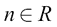

这里， *R* 是实数空间。

## 载体

向量是数字的数组。与元素没有顺序的集合不同，向量的元素有一定的顺序。一个示例向量是[1.0，2.0，1.4，2.3]。在数学上，它可以表示如下:

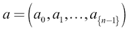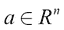

或者，我们可以这样写:

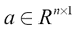

这里， *R* 是实数空间， *n* 是向量中元素的数量。

## 矩阵

矩阵可以被认为是标量集合的二维排列。换句话说，矩阵可以被认为是向量的向量。矩阵示例如下所示:

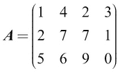

大小为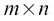的更一般的矩阵可以数学定义如下:

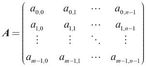

并且:

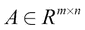

这里， *m* 是矩阵的行数， *n* 是矩阵的列数， *R* 是实数空间。

## 矩阵的索引

我们将使用零索引符号(也就是说，索引从 0 开始)。

为了索引位于 *(i，j)*位置的矩阵中的单个元素，我们使用以下符号:

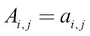

参考之前定义的矩阵，我们得到以下结果:

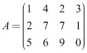

我们从*到*这样索引一个元素:

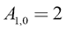

我们将任意矩阵*的单行表示为*，如下所示:

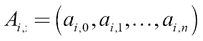

对于我们的示例矩阵，我们可以表示矩阵的第二行(索引为 1 ),如下所示:

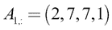

我们表示从任意矩阵 *A* 的第 *(i，k)*索引到第 *(j，l)*索引的切片，如下所示:

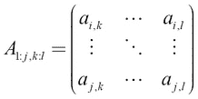

在我们的示例矩阵中，我们可以表示从第一行第三列到第二行第四列的切片，如下所示:

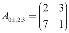

# 特殊类型的矩阵

## 单位矩阵

一个单位矩阵是，其中它在矩阵的对角线上等于 1，在其他地方等于 0。数学上，它可以表示如下:

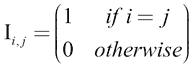

这看起来像下面这样:

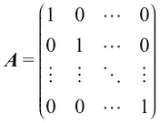

这里，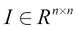。

当与另一个矩阵 *A* 相乘时，单位矩阵给出了以下良好的性质:

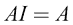

## 对角矩阵

对角线矩阵是单位矩阵的更一般的情况，其中沿对角线的值可以取任何值，非对角线值为零:

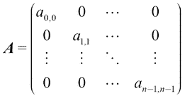

## 张量

一个 *n* 维矩阵被称为**张量**。换句话说，一个任意维数的矩阵叫做张量。例如，四维张量可以表示为:

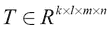

这里， *R* 是实数空间。


# 张量/矩阵运算

## 转置

转置是为矩阵或张量定义的重要操作。对于矩阵，转置的定义如下:

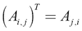

这里，*A[T]表示 *A* 的转置。*

转置操作的示例可以如下所示:

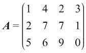

转置操作后:

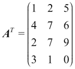

对于张量来说，转置可以看作是改变维度的顺序。例如，让我们定义一个张量 *S* ，如下所示:

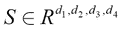

现在转置操作(许多转置操作中的一个)可以定义如下:

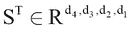

## 乘法

矩阵乘法是线性代数中出现频率相当高的另一个重要运算。

给定矩阵和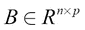，A*和 B*的乘积定义如下:**

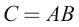

在这里，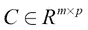。

考虑这个例子:

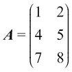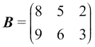

这给了


，并且 *C* 的值如下:

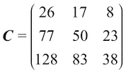

## 逐元素乘法

针对具有相同形状的两个矩阵，计算逐元素矩阵乘法(或哈达玛乘积)。给定矩阵和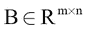，将 *A* 和 *B* 的逐元素乘法定义如下:

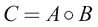

在这里，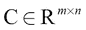

考虑这个例子:


这给出了，并且 *C* 的值如下:

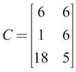

## 逆

矩阵 *A* 的逆用 *A* *-1* 表示，其中满足以下条件:

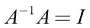

如果我们试图解一个线性方程组，逆是非常有用的。考虑这个例子:

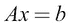

我们可以这样求解 *x* :

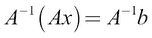

这可以写成，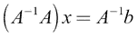用结合律(即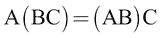)。

接下来我们会得到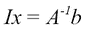因为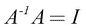，其中 *I* 是单位矩阵。

最后，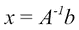因为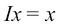。

例如，多项式回归是一种回归技术，它使用线性方程组来解决回归问题。回归与分类相似，但回归模型输出的不是一个类，而是一个连续值。让我们来看一个示例问题:给定一所房子的卧室数量，我们将计算房子的房地产价值。形式上，多项式回归问题可以写成如下形式:

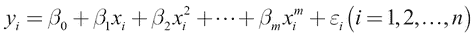

这里，

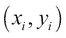

是第 *i ^(th)* 数据输入，其中*x[I]是输入，*y[I]是标签，是数据中的噪声。在我们的例子中， *x* 是卧室的数量，y* 是房子的价格。这可以写成如下的线性方程组:*

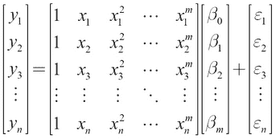

然而，*A^(-1)T3 并不存在于所有的 *A* 中。为了矩阵的逆存在，需要满足某些条件。比如定义逆矩阵， *A* 需要是方阵(也就是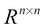)。即使逆存在，我们也不能总是在封闭形式中找到它；有时只能用有限精度的计算机来近似计算。如果逆存在，有几种算法可以找到它，我们将在这里讨论。*

### 注意

当说 *A* 需要是方阵求逆才能存在时，我指的是标准的求逆。存在逆运算的变体(例如，Moore-Penrose 逆运算，也称为伪逆运算)


矩阵。

## 寻找矩阵逆-奇异值分解(SVD)

现在让我们看看如何使用 SVD 来寻找矩阵 A 的逆矩阵。SVD 将 *A* 分解成三个不同的矩阵，如下所示:

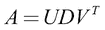

这里 *U* 的列称为左奇异向量， *V* 的列称为右奇异向量， *D* (对角矩阵)的对角值称为奇异值。左奇异向量是的特征向量，右奇异向量是的特征向量。最后，奇异值是和的特征值的平方根。方阵 *A* 的特征向量及其对应的特征值满足以下条件:


然后，如果 SVD 存在，则 *A* 的倒数由下式给出:


由于 *D* 是对角的， *D ^(-1)* 就是 *D* 的非零元素的逐元素倒数。奇异值分解是一种重要的矩阵分解技术，出现在机器学习的许多场合。以为例，SVD 用于计算**主成分分析** ( **PCA** )，这是一种流行的数据降维技术(目的类似于我们在[第四章](ch04.html "Chapter 4. Advanced Word2vec")、*高级 Word2vec* 中看到的 t-SNE)。SVD 的另一个更面向 NLP 的应用是文档排序。也就是说，当您想要获得最多的相关文档(并根据与某个术语的相关性对它们进行排序，例如*足球*)时，可以使用 SVD 来实现这一点。

## 规范

Norm 用作矩阵的*大小*的度量(即矩阵中的值)。第*p^(th)定额的计算和表示如下:*


例如，L2 的标准是这样的:


## 行列式

方阵的行列式，用表示，是矩阵所有特征值的乘积。行列式在很多方面都非常有用。例如， *A* 可逆当且仅当行列式非零。以下等式显示了对矩阵的行列式的计算:


# 概率

接下来，我们将讨论与概率论相关的术语。概率论是机器学习的一个重要组成部分，因为用概率模型对数据建模允许我们得出关于模型对一些预测的不确定性的结论。考虑这个例子，我们在[第 11 章](ch11.html "Chapter 11. Current Trends and the Future of Natural Language Processing")、*自然语言处理的当前趋势和未来*中执行情感分析，其中我们有给定电影评论的输出值(正/负)。尽管对于我们输入的任何样本，模型都输出在`0`和`1`之间的某个值(`0`表示负，`1`表示正)，但是模型不知道*如何不确定*它的答案。

让我们理解不确定性如何帮助我们做出更好的预测。例如，一个确定性的模型可能会错误地将评论的积极性*【我从未失去兴趣*】说成`0.25`(也就是说，更有可能是负面评论)。然而，概率模型将给出预测的平均值和标准偏差。例如，它会说，这个预测的均值为`0.25`，标准差为`0.5`。对于第二个模型，我们知道由于高标准偏差，预测很可能是错误的。然而，在确定性模型中，我们没有这种奢侈。这一特性对于关键的机器系统(例如，恐怖主义风险评估模型)尤其有价值。

要开发这样的概率机器学习模型(例如，贝叶斯逻辑回归、贝叶斯神经网络或高斯过程)，您应该熟悉基本的概率理论。因此，我们在这里提供一些基本的概率信息。

## 随机变量

随机变量是一个可以随机取值的变量。同样，随机变量表示为 *x [1]* 、 *x [2]* 等等。随机变量有两种类型:离散型和连续型。

## 离散随机变量

离散随机变量是可以取离散随机值的变量。例如，抛硬币的试验可以建模为一个随机变量，也就是说，当你抛硬币时硬币落地的一面是一个离散变量，因为数值只能是*正面*或*反面*。或者，掷骰子得到的值也是离散的，因为这些值只能来自集合 *{1，2，3，4，5，6}* 。

## 连续随机变量

连续型随机变量是可以取任意实值的变量，即如果 *x* 是连续型随机变量:


这里， *R* 是实数空间。

例如，一个人的身高是一个连续的随机变量，因为它可以取任何真实值。

## 概率质量/密度函数

**概率质量函数** ( **PMF** )或**概率密度函数** ( **PDF** )是一种显示随机变量可以取的不同值的概率分布的方式。对于离散变量，定义一个 PMF，对于连续变量，定义一个 PDF。*图 A.1* 显示了一个 PMF 示例:


A.1:概率质量函数(PMF)离散

前述的 PMF 可以通过*偏置的*模具来实现。在这个图中，我们可以看到，用这个骰子得到一个 **3** 的概率很高。这样的图表可以通过运行数量的试验(比如说 100)然后计算每个面落在上面的次数来获得。最后，将每个计数除以试验次数以获得标准化概率。请注意，所有概率的总和应为 1，如下所示:


相同的概念被扩展到连续随机变量以获得 PDF。假设我们正试图对给定人口的某个身高的概率进行建模。与离散情况不同，我们没有计算概率的单个值，而是一个连续的值谱(在本例中，它从 0 延伸到 2.4 m)。如果我们要为这个例子画一个像*图 A.1* 中那样的图，我们需要把它想象成无限小的容器。比如我们求出一个人身高在 0.0 米-0.01 米，0.01 米-0.02 米之间的概率密度，...，1.8 米-1.81 米，…等等。概率密度可以使用以下公式计算:


然后，我们将绘制那些相互靠近的条以获得一条连续的曲线，如图*图 A.2* 所示。请注意，给定条柱的概率密度可以大于 1(因为它是密度)，但曲线下的面积必须为 1:


图 A.2:概率密度函数(PDF)连续

图 A.2 中*所示的形状被称为正态(或高斯)分布。它也被称为*钟形曲线*。我们之前给了一个关于如何考虑连续概率密度函数的直观解释。更正式地说，正态分布的连续 PDF 有一个等式，定义如下。假设一个连续随机变量 *X* 具有均值和标准差的正态分布。对于 *x* 的任意值， *X = x* 的概率由以下公式给出:*


如果您将这个量对所有可能的无限小的 dx 值进行积分，您应该得到面积(对于有效的 PDF，该面积需要为 1 ),如下式所示:


任意 *a* 、 *b* 值的法线的积分为由以下公式给出:


(你可以在[http://mathworld.wolfram.com/GaussianIntegral.html](http://mathworld.wolfram.com/GaussianIntegral.html)找到更多信息，或者参考[https://en.wikipedia.org/wiki/Gaussian_integral](https://en.wikipedia.org/wiki/Gaussian_integral)进行不太复杂的讨论。)

利用这个，我们可以得到正态分布的积分，其中和:


这给出了 *x* 的所有值的所有概率值的累加，并给出值 1。

## 条件概率

条件概率表示一个事件发生的概率，假设另一个事件发生。例如，给定两个随机变量 *X* 和 *Y* ，给定 *Y = y* ，则 *X = x* 的条件概率由以下公式表示:


这种概率的真实示例如下:


## 联合概率

给定两个随机变量 *X* 和 *Y* ，我们将 *X = x* 的概率与 *Y = y* 一起称为 *X = x* 和 *Y = y* 的联合概率。该由以下公式表示:


如果 *X* 和 *Y* 是互斥事件，则该表达式简化为:


这方面的一个真实示例如下:


## 边际概率

边际概率分布是随机变量子集的概率分布，给定所有变量的联合概率分布。例如，考虑两个随机变量， *X* 和 *Y* 存在，我们已经知道并且我们想要计算 *P(x)* :


直观上，我们将对 *Y* 的所有可能值求和，有效地使得 *Y = 1* 的概率。这给了我们


。

## 贝叶斯法则

如果我们已经知道和，贝叶斯法则给了我们一个计算的方法。我们可以很容易地得出贝叶斯法则如下:


现在让我们看看中间和右边的部分:


这是贝叶斯法则。简单来说，如下图:


# Keras 简介

这里我们将提供一个对 Keras 的简单介绍，Keras 是 TensorFlow 的一个子库，为实现深度学习算法提供了更多的高层函数。Keras 使用基本的 TensorFlow 操作，在下面；然而，它为用户提供了一个更高级的、初学者友好的 API。为了了解如何使用 Keras，我们将看一个简单的例子。我们将概述如何使用 Keras 创建 CNN。完整的练习可以在位于`appendix`文件夹的`keras_cnn.ipynb`中找到。

我们将首先确定我们将定义什么类型的模型。Keras 有两种不同的 API:顺序 API 和函数 API。顺序 API 更简单，允许一层一层地设计模型。然而，顺序 API 在设计网络各层之间的组织和连接时具有有限的灵活性。另一方面，函数式 API 具有更大的灵活性，允许用户设计神经网络的具体细节。出于演示的目的，我们将使用 Keras 中的顺序 API 实现一个 CNN。在这种情况下，顺序模型是一系列层(例如，输入层、卷积层和池层):

```py
model = Sequential()
```

接下来，我们将逐一定义我们 CNN 的层。首先，我们将定义一个具有 32 个滤波器的卷积层，内核大小为 3 × 3，非线性度为 *ReLU* 。该层将接受大小为 28 × 28 × 1 的输入(即 MNIST 图像的大小):

```py
model.add(Conv2D(32, 3, activation='relu', input_shape=[28, 28, 1]))
```

接下来，我们将定义一个最大池层。如果没有定义内核大小和步幅，它们默认为 2(内核大小)和 1(步幅):

```py
model.add(MaxPool2D())
```

然后，我们将添加一个批量标准化层:

```py
model.add(BatchNormalization())
```

一个批量归一化层(参考*批量归一化:通过减少内部协变量移位加速深度网络训练*、 *Ioffe* 和 *Szegedy* 、*国际机器学习会议*、 *2015* )归一化(即激活零均值和单位方差)前一层的输出。这是用于提高 CNN 性能的附加步骤，尤其是在计算机视觉应用中。请注意，我们在本章练习中没有使用批处理规范化，因为与计算机视觉应用中使用的数量相比，批处理规范化并没有在 NLP 任务中大量使用。

接下来，我们将再添加两个卷积层，然后添加一个最大池层和一个批处理规范化层:

```py
model.add(Conv2D(64, 3, activation='relu'))
model.add(MaxPool2D())
model.add(BatchNormalization())
model.add(Conv2D(128, 3, activation='relu'))
model.add(MaxPool2D())
model.add(BatchNormalization())
```

接下来，我们将展平输入，因为这是将输出馈入完全连接的层所必需的:

```py
model.add(Flatten())
```

然后，我们将添加一个带有`256`隐藏单元的完全连接层、一个 *ReLU* 激活层和一个带有`10` softmax 单元的最终 softmax 输出层(即，用于 MNIST 的 10 个不同等级):

```py
model.add(Dense(256, activation='relu'))
model.add(Dense(10, activation='softmax'))
```

最后，我们将*编译*该模型，同时我们还告诉 Keras 使用*亚当*作为优化器，并使用分类交叉熵损失和输出度量作为模型的准确性:

```py
model.compile(optimizer='adam', loss='categorical_crossentropy', metrics=['accuracy'])
```

一旦定义了模型、损失和优化器，我们就可以如下运行 Keras 模型。

要训练模型，您可以使用以下命令:

```py
model.fit(x_train, y_train, batch_size = batch_size)
```

这里，`x_train`和`y_train`是训练数据。而`batch_size`定义了批量大小。当您运行此程序时，培训进度将显示如下。

然后，使用以下方法评估模型:

```py
test_acc = model.evaluate(x_test, y_test, batch_size=batch_size)  
```

这一行将再次输出进度条以及每个时期的测试损失和准确性。


# tensor flow seq 2 seq 文库简介

我们在本书的所有实现中使用了原始的 TensorFlow API，以提高模型实际功能的透明度和更好的学习体验。然而，TensorFlow 有各种各样的库，它们隐藏了实现的所有细粒度细节。这允许用户用更少的代码行实现序列到序列模型，如我们在第 10 章、*序列到序列学习-神经机器翻译*中看到的**神经机器翻译** ( **NMT** )模型，而不用担心关于它们如何工作的更具体的技术细节。关于这些库的知识是很重要的，因为它们提供了一种更干净的方式在生产代码中使用这些模型，或者在现有方法之外进行研究。因此，我们将快速介绍如何使用 TensorFlow `seq2seq`库。这个代码可以在`seq2seq_nmt.ipynb`文件中作为练习使用。

## 定义编码器和解码器的嵌入

我们将首先定义编码器输入、解码器输入和解码器输出占位符:

```py
enc_train_inputs = []
dec_train_inputs, dec_train_labels = [],[]
for ui in range(source_sequence_length):
    enc_train_inputs.append(tf.placeholder(tf.int32, shape=[batch_size],name='train_inputs_%d'%ui))

for ui in range(target_sequence_length):
    dec_train_inputs.append(tf.placeholder(tf.int32, shape=[batch_size],name='train_inputs_%d'%ui))
    dec_train_labels.append(tf.placeholder(tf.int32, shape=[batch_size],name='train_outputs_%d'%ui))
```

接下来，我们将为所有编码器和解码器输入定义嵌入查找函数，以获得词嵌入:

```py
encoder_emb_inp = [tf.nn.embedding_lookup(encoder_emb_layer, src) for src in enc_train_inputs]
encoder_emb_inp = tf.stack(encoder_emb_inp)

decoder_emb_inp = [tf.nn.embedding_lookup(decoder_emb_layer, src) for src in dec_train_inputs]
decoder_emb_inp = tf.stack(decoder_emb_inp)
```

## 定义编码器

编码器由一个 LSTM 单元作为其基本构建模块制成。然后，我们将定义`dynamic_rnn`，它以定义的 LSTM 单元作为输入，状态用零初始化。然后，我们将`time_major`参数设置为`True`，因为我们的数据将时间轴作为第一轴(即 0 轴)。换句话说，我们的数据具有`[sequence_length, batch_size, embeddings_size]`形状，其中依赖于时间的`sequence_length`位于第一轴。`dynamic_rnn`的好处是它能够处理动态大小的输入。您可以使用可选的`sequence_length`参数来定义批处理中每个句子的长度。例如，假设您有一个大小为`[3,30]`的批处理，其中有三个长度为[10，20，30]的句子(注意，我们用一个特殊的标记将短句子填充到 30)。将值为[10，20，30]的张量作为`sequence_length`传递给 T17 会将计算出的超过每个句子长度的 LSTM 输出清零。对于单元状态，它不会清零，而是取在句子长度内计算的最后一个单元状态，并将该值复制到句子长度之外，直到达到 30:

```py
encoder_cell = tf.nn.rnn_cell.BasicLSTMCell(num_units)

initial_state = encoder_cell.zero_state(batch_size, dtype=tf.float32)

encoder_outputs, encoder_state = tf.nn.dynamic_rnn(
    encoder_cell, encoder_emb_inp, initial_state=initial_state,
    sequence_length=[source_sequence_length for _ in range(batch_size)], 
    time_major=True, swap_memory=True)
```

`swap_memory`选项允许 TensorFlow 在 GPU 和 CPU 之间交换推理过程中产生的张量，以防模型过于复杂而无法完全适合 GPU。

## 定义解码器

解码器的定义类似于编码器，但有一个称为`projection_layer`的额外层，它代表 softmax 输出层，用于对解码器做出的预测进行采样。我们还将定义一个`TrainingHelper`函数，它将解码器输入正确地馈送到解码器。在本例中，我们还定义了两种类型的解码器:a `BasicDecoder`和`BahdanauAttention`解码器。(注意力机制在[第 10 章](ch10.html "Chapter 10. Sequence-to-Sequence Learning – Neural Machine Translation")、*序列到序列学习-神经机器翻译*中讨论。)库中还有很多其他的解码器，比如`BeamSearchDecoder`和`BahdanauMonotonicAttention`:

```py
decoder_cell = tf.nn.rnn_cell.BasicLSTMCell(num_units)

projection_layer = Dense(units=vocab_size, use_bias=True)

helper = tf.contrib.seq2seq.TrainingHelper(
    decoder_emb_inp, [target_sequence_length for _ in range(batch_size)], time_major=True)

if decoder_type == 'basic':
    decoder = tf.contrib.seq2seq.BasicDecoder(
        decoder_cell, helper, encoder_state,
        output_layer=projection_layer)

elif decoder_type == 'attention':
    decoder = tf.contrib.seq2seq.BahdanauAttention(
        decoder_cell, helper, encoder_state,
        output_layer=projection_layer)
```

我们将使用动态解码来获得解码器的输出:

```py
outputs, _, _ = tf.contrib.seq2seq.dynamic_decode(
    decoder, output_time_major=True,
    swap_memory=True
)
```

接下来，我们将定义逻辑、交叉熵损失和训练预测操作:

```py
logits = outputs.rnn_output

crossent = tf.nn.sparse_softmax_cross_entropy_with_logits(
    labels=dec_train_labels, logits=logits)
loss = tf.reduce_mean(crossent)

train_prediction = outputs.sample_id
```

然后，我们将定义两个优化器，其中前 10，000 步使用`AdamOptimizer`，其余的优化过程使用普通随机变量`GradientDescentOptimizer`。这是因为，长期使用 Adam optimizer 会导致一些意想不到的行为。因此，我们将使用 Adam 为 SGD 优化器获得一个良好的初始位置，然后从那时起使用 SGD:

```py
with tf.variable_scope('Adam'):
    optimizer = tf.train.AdamOptimizer(learning_rate)
with tf.variable_scope('SGD'):
    sgd_optimizer = tf.train.GradientDescentOptimizer(learning_rate)

gradients, v = zip(*optimizer.compute_gradients(loss))
gradients, _ = tf.clip_by_global_norm(gradients, 25.0)
optimize = optimizer.apply_gradients(zip(gradients, v))

sgd_gradients, v = zip(*sgd_optimizer.compute_gradients(loss))
sgd_gradients, _ = tf.clip_by_global_norm(sgd_gradients, 25.0)
sgd_optimize = optimizer.apply_gradients(zip(sgd_gradients, v))
```

### 注意

Bahar 等人在一篇名为*神经机器翻译中优化算法的实证研究*，*布拉格数学语言学公报*， *2017* 的论文中对优化器在 NMT 训练中的表现进行了严格的评估。


# 使用 TensorBoard 可视化词嵌入

当我们想在第 3 章、*Word 2 vec-学习词嵌入*中可视化词嵌入时，我们用 t-SNE 算法手动实现了可视化。然而，你也可以使用 TensorBoard 来可视化单词的嵌入。TensorBoard 是 TensorFlow 提供的可视化工具。您可以使用 TensorBoard 在程序中可视化 TensorFlow 变量。这允许您查看各种变量随时间的变化情况(例如，模型损失/准确性)，以便您可以识别模型中的潜在问题。

TensorBoard 使您能够将标量值和向量可视化为直方图。除此之外，TensorBoard 还允许你可视化词嵌入。因此，如果您需要分析嵌入是什么样子的话，它会将所有需要的代码实现从您身边带走。接下来我们将看到如何使用 TensorBoard 来可视化词嵌入。本练习的代码在`appendix`文件夹的`tensorboard_word_embeddings.ipynb`中提供。

## 启动张量板

首先，我们将列出启动 TensorBoard 的步骤。TensorBoard 作为一个服务运行在一个特定的端口上(默认情况下，在`6006`)。要启动 TensorBoard，您需要遵循以下步骤:

1.  打开命令提示符(Windows)或终端(Ubuntu/macOS)。
2.  进入项目主目录。
3.  如果您使用的是`python` virtuanenv，请激活安装了 TensorFlow 的虚拟环境。
4.  确保可以通过 Python 看到 TensorFlow 库。为此，请遵循以下步骤:

    1.  键入`python3`，您将得到一个`>>>` looking 提示
    2.  Try `import tensorflow as tf`
    3.  如果您可以成功运行此提示，您就没事了
    4.  通过键入`exit()`

    退出`python`提示(即`>>>`
5.  键入`tensorboard --logdir=models`:

    *   `--logdir`选项指向您将创建数据的目录，以可视化
    *   可选地，您可以使用`--port=<port_you_like>`来更改

    上运行的端口张量板
6.  你现在应该得到以下消息:

    ```py
     TensorBoard 1.6.0 at <url>;:6006 (Press CTRL+C to quit) 
    ```

7.  在网络浏览器中输入`<url>:6006`。此时，您应该能够看到一个橙色的仪表盘。您将没有任何东西可显示，因为我们还没有生成数据。

## 通过 TensorBoard 保存词嵌入和可视化

首先，我们将下载并加载我们在[第 9 章](ch09.html "Chapter 9. Applications of LSTM – Image Caption Generation")、*LSTM 应用–图像字幕生成*中使用的 50 维手套嵌入。首先从[https://nlp.stanford.edu/projects/glove/](https://nlp.stanford.edu/projects/glove/)下载手套嵌入文件(`glove.6B.zip`)并放入`appendix`文件夹。我们将在文件中加载前 50，000 个单词向量，稍后使用来初始化 TensorFlow 变量。我们还将记录每个单词的单词串，因为我们稍后会将这些作为标签提供给每个点以显示在 TensorBoard 上:

```py
vocabulary_size = 50000
pret_embeddings = np.empty(shape=(vocabulary_size,50),dtype=np.float32)

words = [] 

word_idx = 0
with zipfile.ZipFile('glove.6B.zip') as glovezip:
    with glovezip.open('glove.6B.50d.txt') as glovefile:
        for li, line in enumerate(glovefile):
            if (li+1)%10000==0: print('.',end='')
            line_tokens = line.decode('utf-8').split(' ')
            word = line_tokens[0]

            vector = [float(v) for v in line_tokens[1:]]
            assert len(vector)==50
            words.append(word)
            pret_embeddings[word_idx,:] = np.array(vector)
            word_idx += 1
            if word_idx == vocabulary_size:
                break
```

现在，我们将定义与 TensorFlow 相关的变量和运算。在此之前，我们将创建一个名为`models`的目录，用于存储变量:

```py
log_dir = 'models'

if not os.path.exists(log_dir):
    os.mkdir(log_dir)
```

然后，我们将定义一个变量，这个变量将用我们之前从文本文件中复制的词嵌入进行初始化:

```py
embeddings = tf.get_variable('embeddings',shape=[vocabulary_size, 50],
                             initializer=tf.constant_initializer(pret_embeddings))
```

接下来，我们将创建一个会话，并初始化我们之前定义的变量:

```py
session = tf.InteractiveSession()
tf.global_variables_initializer().run()
```

此后，我们将创建一个`tf.train.Saver`对象。`Saver`对象可用于将 TensorFlow 变量保存到内存中，以便日后需要时可以恢复。在下面的代码中，我们将把嵌入变量保存到名为`model.ckpt`的`models`目录中:

```py
saver = tf.train.Saver({'embeddings':embeddings})
saver.save(session, os.path.join(log_dir, "model.ckpt"), 0)
```

我们还需要保存元数据文件。元数据文件包含与词嵌入相关联的标签/图像或其他类型的信息，因此当您将鼠标悬停在嵌入可视化上时，相应的点将显示它们所代表的单词/标签。元数据文件应该是`.tsv`(制表符分隔值)格式，并且应该包含`vocabulary_size + 1`行，其中第一行包含您要包含的信息的标题。在下面的代码中，我们将保存两条信息:单词字符串和每个单词的唯一标识符(即行索引):

```py
with open(os.path.join(log_dir,'metadata.tsv'), 'w',encoding='utf-8') as csvfile:
    writer = csv.writer(csvfile, delimiter='\t',
                            quotechar='|', quoting=csv.QUOTE_MINIMAL)
    writer.writerow(['Word','Word ID'])
    for wi,w in enumerate(words):
      writer.writerow([w,wi])
```

然后，我们需要告诉 TensorFlow 在哪里可以找到我们保存到磁盘的嵌入数据的元数据。为此，我们需要创建一个`ProjectorConfig`对象，它维护关于我们想要显示的嵌入的各种配置细节。存储在`ProjectorConfig`文件夹中的详细信息将被保存到`models`目录下的一个名为`projector_config.pbtxt`的文件中:

```py
config = projector.ProjectorConfig()
```

这里，我们将填充我们创建的`ProjectorConfig`对象的必填字段。首先，我们将告诉它我们想要可视化的变量的名字。接下来，我们将告诉它在哪里可以找到对应于该变量的元数据:

```py
embedding_config = config.embeddings.add()
embedding_config.tensor_name = embeddings.name
embedding_config.metadata_path = 'metadata.tsv'
```

我们现在将使用一个摘要编写器把它写到`projector_config.pbtxt`文件中。TensorBoard 将在启动时读取该文件:

```py
summary_writer = tf.summary.FileWriter(log_dir)
projector.visualize_embeddings(summary_writer, config)
```

现在，如果您加载 TensorBoard，您应该会看到类似于*图 A.3* 的内容:


图 A.3:嵌入的张量板视图

当您悬停在显示的点云上时，它将显示您当前悬停的单词的标签，因为我们在`metadata.tsv`文件中提供了该信息。此外，你有几个选择。第一个选项(用虚线显示并标记为 **1** )将允许您选择完整嵌入空间的子集。你可以在你感兴趣的嵌入空间的区域上画一个包围盒，它看起来如图*图 A.4* 所示。我选择了右下角的嵌入:


图 A.4:选择嵌入空间的子集

你的另一个选择是查看单词本身，而不是点。您可以通过选择*图 A.3* 中的第二个选项来完成此操作(显示在实心框内并标记为 **2** )。这将如图*图 A.5* 所示。此外，您可以根据自己的喜好平移/缩放/旋转视图。如果您点击帮助按钮(显示在实心框内，在*图 A.5* 中标记为 **1** )，它将向您显示控制视图的指南:


图 A.5:嵌入向量显示为单词而不是点

最后，您可以从左侧面板中更改可视化算法(在*图 A.3* 中用虚线显示并标有 **3** )。


# 总结

在这里，我们讨论了一些数学背景知识以及一些我们在其他章节中没有涉及到的实现。首先，我们讨论了标量、向量、矩阵和张量的数学符号。然后我们讨论了在这些数据结构上执行的各种操作，比如矩阵乘法和求逆。接下来，我们讨论了有助于理解概率机器学习的各种术语，如概率密度函数、联合概率、边际概率和贝叶斯规则。之后，我们将讨论转移到了其他章节中没有涉及到的各种实现。我们学会了如何使用 Keras 实现 CNN 的高级 TensorFlow 库。然后，我们讨论了如何使用 TensorFlow 中的 seq2seq 库高效地实现神经机器翻译器，并与我们在第 10 章、*序列到序列学习-神经机器翻译*中讨论的实现进行了比较。最后，我们用一个指导来结束这一节，这个指导教你使用张量板来可视化词嵌入；TensorFlow 自带的可视化平台。