# 四、感知器神经网络建模——基本模型

到目前为止，我们已经看到了神经网络的基础知识以及学习部分是如何工作的。在这一章中，我们来看看神经网络结构的一种基本而简单的形式，感知器。

一个**感知器**被定义为神经网络的基本构建模块。在机器学习中，感知器是用于二进制分类器的监督学习的算法。他们将输出分类为二进制:`TRUE` / `FALSE`或`1` / `0`。

本章有助于理解以下主题:

*   感知器的解释
*   线性可分分类器
*   简单感知器实现函数
*   **多层感知器** ( **多层感知器**)

本章结束时，我们将了解感知器的基本概念，以及它们如何用于神经网络算法。我们将发现线性可分分类器。我们将在 R 环境中学习一个简单的感知器实现函数。我们将知道如何训练和模拟 MLP。


# 感知器及其应用

感知器可以理解为接受多个输入并产生一个输出的任何东西。它是神经网络的最简单形式。感知机是由 Frank Rosenblatt 在 1958 年提出的，它是一个具有输入和输出层以及基于最小化误差的学习规则的实体。这个被称为**误差反向传播**的学习函数根据网络相对于给定输入的实际输出来改变连接权重(突触)，作为实际输出和期望输出之间的差异。

热情是巨大的，控制论产业诞生了。但是后来，科学家马文·明斯基和西蒙·派珀特(1969)证明了感知机的局限性。事实上，感知器在经过适当的训练后，只能识别线性可分函数。例如，XOR 逻辑功能不能由感知器实现。

下图显示了 Frank Rosenblatt 在康奈尔航空实验室(1957-1959)研究 Mark I 感知器分类器时的情况:


潜在地，一个多级的分类器网络可以解决更复杂的问题，但是不断增加的训练计算复杂度使得这条路不可行。只是在最近，我们才开始考虑这个操作实体的效用。

在单一形式中，感知器有一个神经元单元接受输入并产生一组输出。

例如，让我们看一下下图:

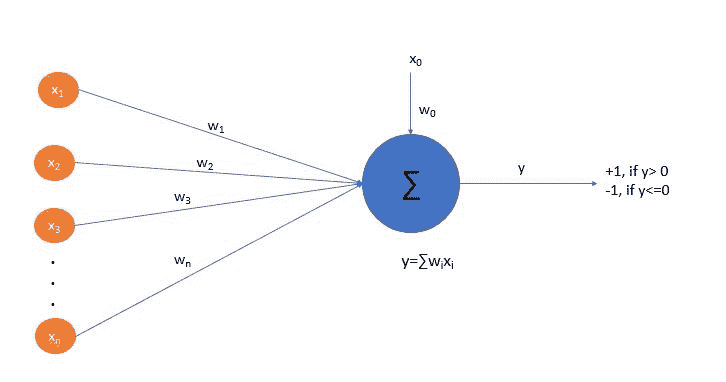

这里 **x [1] ，x [2] ，..，x [n]** 为输入集， **x [0]** 为偏置。**x[0]设置为 **1** 。输出 **y** 是**w[I]x[I]的和积。 **signum** 函数在求和乘积执行完毕后应用。****

它将输出分为:

*   如果 **y > 0** ，则输出为 **1**
*   如果 **y < =0** ，则输出为 **-1**

偏差是恒定的，并且与重量**w[0]相关联。这个感知器的功能相当于一个线性分离器，将输出分成一个类别， **-1** 或 **+1** 。**

请注意，这里没有反向传播，权重更新通过我们很快将看到的步骤进行更新。有一个决定输出值的阈值设置。这里的输出是二进制的(要么是 **-1** 要么是 **+1** )，可以设置为 0 或者 1。

因此，感知器是一个简单的分类功能，直接进行预测。该功能的核心在于权重以及我们如何将权重更新为对 **y** 的最佳预测。

这个案例是一个**简单感知器**或者基本感知器，输出本质上是二进制的:*0/1*真/假 *+1/-1* 。

还有另一种类型的感知器，称为**多类感知器**，它可以为一种动物分类许多可能的标签，比如狗、猫或鸟。

下图显示了简单感知器架构与多类感知器架构的对比:

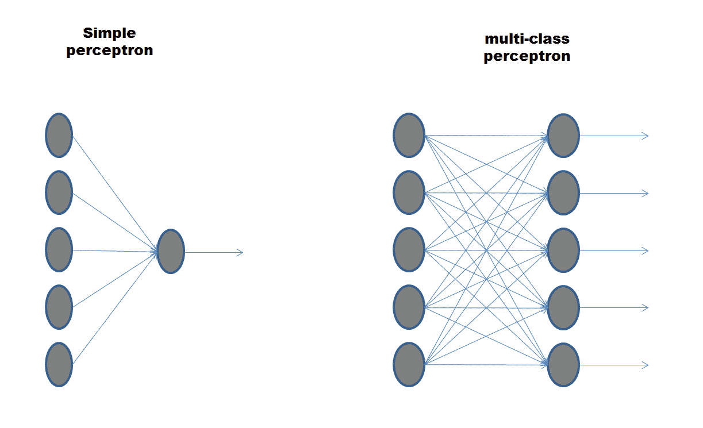

通过修改加权向量，我们可以修改感知器的输出，以改善学习或存储特性。例如，我们可以尝试指示感知器，使得给定输入 *x* ，输出 *y* 尽可能接近给定的先验选择的 *y* 实际值。然而，单个感知器的计算能力是有限的，并且可以获得的性能在很大程度上取决于输入选择和想要实现的功能选择。

事实上，输入可以被限制为所有可能输入的子集，或者根据某个预定的概率分布被随机提取。在较小程度上，这种系统的绩效也取决于如何量化实际产出和预期产出之间的距离。

一旦你确定了学习的问题，你就可以试着为给定的问题找到最优的权重分配。


# 简单感知器——线性可分离分类器

正如我们所见，一个简单的感知器是一个单层的神经单元，它是一个线性分类器。它是一个只能产生两种输出模式的神经元，可以在*激活*或*不激活*时合成。它的决策规则是通过一个*阈值*行为实现的:如果组成输入层的单个神经元的激活模式之和(按其权重加权)超过某个阈值，那么输出神经元将采用激活的输出模式*。相反，输出神经元将保持在*非活动*状态。*

如上所述，输出是*权重*输入*和应用于其上的函数的总和；输出为 *+1 (y > 0)* 或 *-1(y < =0)* ，如下图所示:

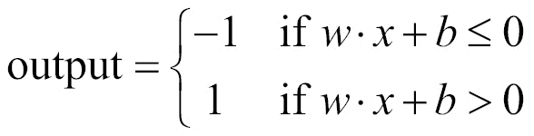

我们可以看到这里的线性相互作用。输出 *y* 线性依赖于输入。

与大多数神经网络模型一样，即使在感知器中，也可以基于突触连接权重的修改来实现学习功能。在训练阶段的开始，感知器突触连接的权重 *w* 采用完全随机的值。对于培训，我们有一些例子，其相对，正确的，分类。依次呈现网络、要分类的不同情况以及网络每次处理其响应(大于阈值或小于阈值)。如果分类正确(网络输出与预期相同)，则训练算法不做任何更改。相反，如果分类不正确，该算法改变突触权重以试图提高网络的分类性能。

单一感知机是一个在线学习者。重量更新通过以下步骤进行:

1.  得到 *x* 并输出标签 *y* 。
2.  为 *f(x)* 更新 *w* 。
3.  如果 *f(x)=y* ，标记为完成；否则，修复它
4.  现在根据误差调整分数:

*f(x)=符号(权重之和*输入)*，错误是可能的

如果 *y=+1* 和 *f(x)=-1，w*x* 太小，请加大

如果 *y=-1* 和 *f(x)=+1，w*x* 太大，则使其变小

5.  应用以下规则:

如果 *f(f)=+1* 且 *y=-1* ，则使 *w=w-x*

如果 *f(f)=-1* 和 *y=+1* ，则使 *w=w+x*

*w=w* 如果 *f(x)=y*

或者干脆， *w=w+yx* if *f(x)！=y*

6.  重复步骤 3 到 5，直到 *f(x) = y* 。

感知器保证满足我们所有的数据，但只适用于只有一个神经元的二进制分类器。在第 5 步中，我们引入了一个术语叫做**学习率**。这有助于我们的模型收敛。第 5 步， *w* 写成: *w=w+αyx if f(x)！= y* ，其中 *α* 是选择的学习速率。

偏差也更新为 *b=b+ αy* if *f(x)！= y* 。那个 *b* 其实就是我们的*w[0]。*

如果布尔函数是线性阈值函数(也就是说，如果它是线性可分的)，那么局部感知器规则可以找到一组能够在有限数量的步骤中实现它的权重。

这个定理被称为**感知器定理**，也适用于全局规则的情况，该规则修改突触权重的向量 *w* ，不是在单个输入向量，而是取决于感知器在整个输入向量集上的行为。

我们刚刚提到了线性可分函数，但是这个术语是什么意思呢？我们将在下一节中理解它。


# 线性分离

当一组输出值可以被一条直线分割时，这些输出值被称为线性可分的。从几何角度来看，该条件描述了这样一种情况:在输入的向量空间中，有一个超平面将那些需要正输出的超平面与那些需要负输出的超平面分开，如下图所示:

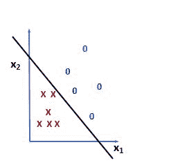

这里，分隔符的一侧是预测属于一个类别的那些，而另一侧是预测属于不同类别的那些。布尔神经元的决策规则对应于由超平面操作的输入特征空间的分解。

如果除了输出神经元之外，甚至神经网络的输入也是布尔的，那么使用神经网络来执行分类相当于确定输入向量的布尔函数。该函数在超过阈值时取值 1，否则取值 0。例如，利用两个输入和输出布尔神经元，可以以非常直观的方式表示*和*以及*或*功能。

实际上，*和*浇口和*或*浇口是线性分离的。让我们在实践中测试它，首先在一个表格中列出可能的情况，然后在一个二维平面上表示它们。

让我们首先为*和*功能做这件事。下表列出了逻辑结果的所有可能情况:

| **x1** | **x2** | **y** ( **与门**) |
| *1* | *1* | *1* |
| *1* | *0* | *0* |
| *0* | *1* | *0* |
| *0* | *0* | *0* |

下图显示了二维平面中的所有四种情况:

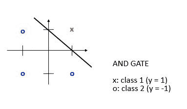

超平面上面的所有点都被假定为*1/真*，而下面的点被假定为*0/假*。

现在让我们为*或*功能做一下。下表列出了逻辑结果的所有可能情况:

| **x1** | **x2** | **y** ( **或门**) |
| *1* | *1* | *1* |
| *1* | *0* | *1* |
| *0* | *1* | *1* |
| *0* | *0* | *0* |

下图显示了二维平面中的所有四种情况:

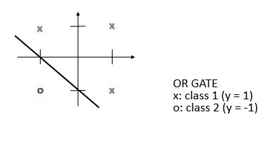

同样在这种情况下，超平面上方的所有点被假定为*1/真*，而下方的点被假定为*0/假*。

然而，一些布尔函数不能通过网络结构复制，就像这里看到的那样。例如, *XOR* 和 identity 函数是不可分的:要隔离它们，需要两条线，这只能通过使用更复杂的网络结构来实现。

下表列出了 *XOR* 函数的所有可能的逻辑结果:

| **x1** | **x2** | **y(异或门)** |
| *1* | *1* | *0* |
| *1* | *0* | *1* |
| *0* | *1* | *1* |
| *0* | *0* | *0* |

下图显示了二维平面中的所有四种情况:

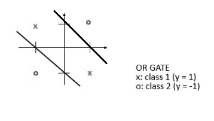

正如预期的那样，这样的函数需要两行来对所有可能的情况进行分组。

了解了感知机理论的基础之后，我们就可以研究一个实际案例了。


# R 中的感知器函数

在前面的章节中，我们了解了使用感知器作为分类器的基本概念。把迄今为止所研究的东西付诸实践的时候到了。我们将通过分析一个例子来做到这一点，在这个例子中，我们将尝试根据鸢尾属植物的花瓣和萼片的大小来对花的种类进行分类。大家应该还记得，`iris`数据集已经在[第 3 章](b5f75068-f1e3-465e-969d-a8f1ad48378d.xhtml)、*使用多层神经网络的深度学习*中使用过。重用它的原因不仅是因为它所包含的数据的质量使读者能够容易地理解所概述的概念，而且更重要的是，能够比较不同的算法。

您可能还记得，该数据集包含三种鸢尾(鸢尾`setosa`、鸢尾`virginica`和鸢尾`versicolor`)各 50 个样本。测量每个样品的四个特征:萼片和花瓣的长度和宽度，以厘米为单位。

包含以下变量:

*   萼片长度，单位为厘米
*   萼片宽度，单位为厘米
*   花瓣长度(厘米)
*   花瓣宽度(厘米)
*   班级:`setosa`、`versicolour`、`virginica`

在给出的例子中，我们将尝试通过线性分离对`setosa`和`versicolor`物种进行分类。

让我们在 R 中为`iris`数据集实现一个感知器函数。代码如下所示:

```
######################################################################
###Chapter 4 - Introduction to Neural Networks - using R    ##########
###Simple Perceptron implementation function in R - iris dataset  ####
######################################################################

data(iris)
head(iris, n=20)

iris_sub=iris[1:100, c(1, 3, 5)] 
names(iris_sub)=c("sepal", "petal", "species") 
head(iris_sub) 

library(ggplot2) 

ggplot(iris_sub, aes(x = sepal, y = petal)) + 
 geom_point(aes(colour=species, shape=species), size = 3) +
 xlab("Sepal length") +
 ylab("Petal length") +
 ggtitle("Species vs Sepal and Petal lengths")

euclidean.norm = function(x) {sqrt(sum(x * x))}

distance.from.plane = function(z,w,b) {
 sum(z*w) + b
}

classify.linear = function(x,w,b) {
 distances = apply(x, 1, distance.from.plane, w, b)
 return(ifelse(distances < 0, -1, +1))
}

perceptron = function(x, y, learning.rate=1) {
 w = vector(length = ncol(x)) # initialize weights
 b = 0 # Initialize bias
 k = 0 # count updates
 R = max(apply(x, 1, euclidean.norm))
 mark.complete = TRUE 

 while (mark.complete) {
 mark.complete=FALSE 
 yc = classify.linear(x,w,b)
 for (i in 1:nrow(x)) {
 if (y[i] != yc[i]) {
 w = w + learning.rate * y[i]*x[i,]
 b = b + learning.rate * y[i]*R^2
 k = k+1
 mark.complete=TRUE
 }
 }
 }
 s = euclidean.norm(w)
 return(list(w=w/s,b=b/s,updates=k))
}

x = cbind(iris_sub$sepal, iris_sub$petal)

y = ifelse(iris_sub$species == "setosa", +1, -1)

p = perceptron(x,y)

plot(x,cex=0.2)

points(subset(x,Y==1),col="black",pch="+",cex=2)
points(subset(x,Y==-1),col="red",pch="-",cex=2)

intercept = - p$b / p$w[[2]]
slope = - p$w[[1]] /p$ w[[2]]

abline(intercept,slope,col="green")
```

现在，让我们一行一行地检查代码。按照本书其余部分的风格，我们将首先呈现如下代码的一部分，然后详细解释它:

```
data(iris)
head(iris, n=20)
```

第一个命令加载包含在数据集库中的`iris`数据集，并将其保存在给定的数据帧中。然后我们使用`head`函数显示数据集的第一个`20`行。记住，`head`函数返回向量、矩阵、表格、数据帧或函数的第一部分或最后一部分。在这种情况下，我们指定必须显示的行数(`n=20`)。以下是结果:

```
> head(iris, n=20)
 Sepal.Length Sepal.Width Petal.Length Petal.Width Species
1           5.1         3.5          1.4         0.2  setosa
2           4.9         3.0          1.4         0.2  setosa
3           4.7         3.2          1.3         0.2  setosa
4           4.6         3.1          1.5         0.2  setosa
5           5.0         3.6          1.4         0.2  setosa
6           5.4         3.9          1.7         0.4  setosa
7           4.6         3.4          1.4         0.3  setosa
8           5.0         3.4          1.5         0.2  setosa
9           4.4         2.9          1.4         0.2  setosa
10          4.9         3.1          1.5         0.1  setosa
11          5.4         3.7          1.5         0.2  setosa
12          4.8         3.4          1.6         0.2  setosa
13          4.8         3.0          1.4         0.1  setosa
14          4.3         3.0          1.1         0.1  setosa
15          5.8         4.0          1.2         0.2  setosa
16          5.7         4.4          1.5         0.4  setosa
17          5.4         3.9          1.3         0.4  setosa
18          5.1         3.5          1.4         0.3  setosa
19          5.7         3.8          1.7         0.3  setosa
20          5.1         3.8          1.5         0.3  setosa
```

让我们回到代码。我们将通过仅提取`iris`数据集的 *100* 行，并且仅提取`sepal`长度和`petal`长度与`species`来获得二进制输出:

```
iris_sub=iris[1:100, c(1, 3, 5)] 
names(iris_sub)=c("sepal", "petal", "species") 
head(iris_sub) 
```

这里，只取了`iris`数据集的前`100`行，并选择了`1`、`3`和`5`列。这是因为第一个`100`行包含我们感兴趣的两个物种(`setosa`和`versicolor`)的数据，在下面的例子中。这三列是`sepal.length(x1)`、`petal.length(x2)`和`species(y - output)`。

```
library(ggplot2) 

ggplot(iris_sub, aes(x = sepal, y = petal)) + 
 geom_point(aes(colour=species, shape=species), size = 3) +
 xlab("Sepal length") +
 ylab("Petal length") +
 ggtitle("Species vs Sepal and Petal lengths")
```

首先我们加载`ggplot2`库，然后我们使用`ggplot()`得到关于`sepal.length`和`petal.length`的物种分布散点图。当然，库应该是事先安装好的。

记住，要安装 R 的初始发行版中没有的库，必须使用`install.package`函数。这是安装包的主要功能。它接受一个名称向量和一个目的库，从存储库中下载包并安装它们。

`perceptron`函数的目标是找到`setosa`和`versicolor`物种的线性分离。下图显示了两种鸢尾花的**萼片长度**与**花瓣长度**的关系:

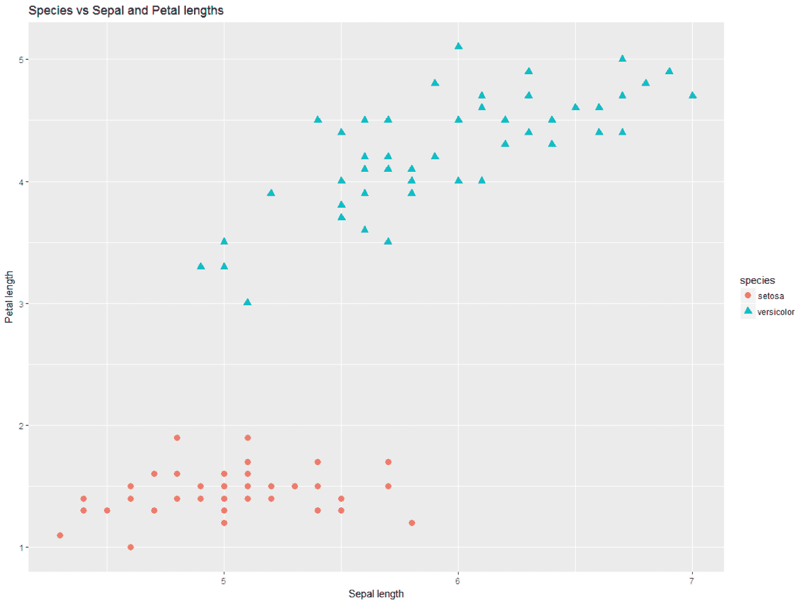

可以看出，这两个物种位于平面的不同区域，因此线性分离是可能的。此时，我们需要定义函数来进行感知器处理:

```
euclidean.norm = function(x) {sqrt(sum(x * x))}

distance.from.plane = function(z,w,b) {
 sum(z*w) + b
}

classify.linear = function(x,w,b) {
 distances = apply(x, 1, distance.from.plane, w, b)
 return(ifelse(distances < 0, -1, +1))
}

perceptron = function(x, y, learning.rate=1) {
 w = vector(length = ncol(x)) # initialize weights
 b = 0 # Initialize bias
 k = 0 # count updates
 R = max(apply(x, 1, euclidean.norm))
 mark.complete = TRUE 

 while (mark.complete) {
 mark.complete=FALSE 
 yc = classify.linear(x,w,b)
 for (i in 1:nrow(x)) {
 if (y[i] != yc[i]) {
 w = w + learning.rate * y[i]*x[i,]
 b = b + learning.rate * y[i]*R^2
 k = k+1
 mark.complete=TRUE
 }
 }
 }
 s = euclidean.norm(w)
 return(list(w=w/s,b=b/s,updates=k))
}
```

我们定义`perceptron`函数，如感知器训练算法中所讨论的。我们将`learning.rate`应用为`1`，并尝试更新每个循环中的权重。一旦输出和函数*(权重*输入)*相等，我们就停止训练，开始行动。更新的权重由函数返回。该函数的目标是获得模型所需的一组最佳权重，如下所示:

```
x = cbind(iris_sub$sepal, iris_sub$petal)

y = ifelse(iris_sub$species == "setosa", +1, -1)

p = perceptron(x,y)
```

对于第一行，我们将`x`输入设置为`sepal`和`petal`长度。`sepal.length`和`petal.length`构成输入矩阵。在第二行，我们为`setosa`设置标签输出为正，其余为负。输出为`setosa`或不为`+1`或`-1`。在第三行，我们运行`perceptron`函数。

我们用`x`和`y`调用`perceptron`函数，它给出了感知器的最佳权重，如下面的代码示例所示:

```
plot(x,cex=0.2)

points(subset(x,Y==1),col="black",pch="+",cex=2)
points(subset(x,Y==-1),col="red",pch="*",cex=2)

intercept = - p$b / p$w[[2]]
slope = - p$w[[1]] /p$ w[[2]]

abline(intercept,slope,col="green")
```

前面几行代码绘制了`x`和`y`，将`setosa`和`versicolor`突出显示为图中的`+`和`*`点。然后我们找到由感知器返回的`p`变量(感知器)的截距和斜率。绘制线性分隔线给出了下图:

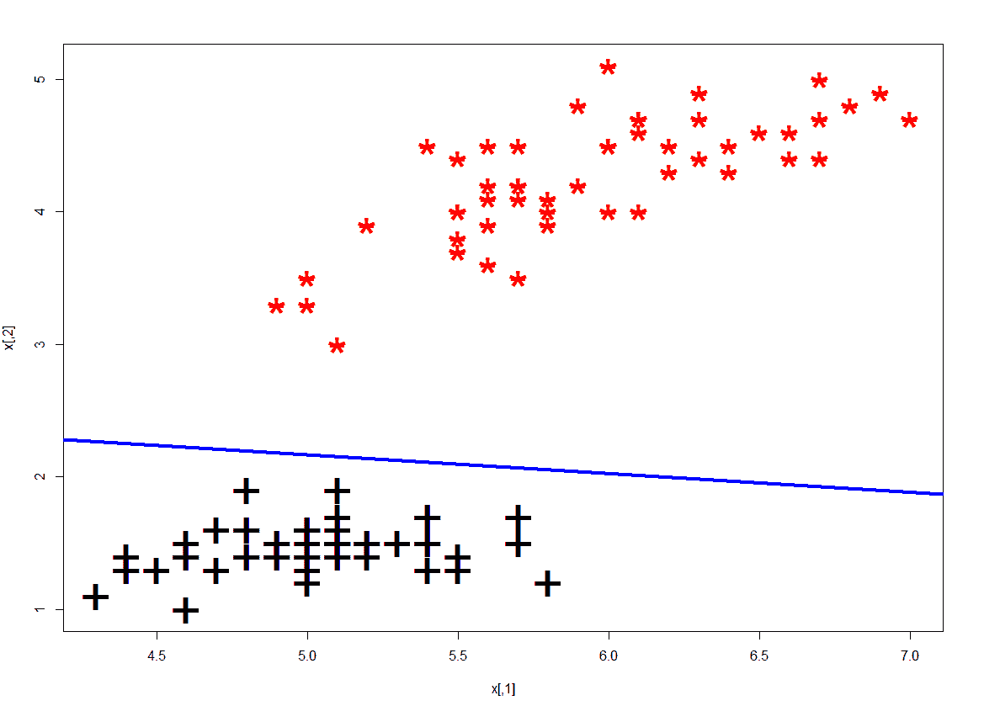

总而言之，我们已经使用 R 代码实现了感知器，并找到了最佳权重。使用感知器实现了线性分离。


# 多层感知器

我们看到*和*和*或*门输出是线性可分的，感知器可以用来模拟这些数据。然而，并不是所有的函数都是可分的。事实上，数量很少，而且随着位数的增加，它们在可实现功能总数中所占的比例趋于零。事实上，正如我们预期的那样，如果我们采用 *XOR* 门，线性分离是不可能的。十字和零在不同的位置，我们不能用一条线将它们分开，如下图所示:


我们可以考虑解析更多的感知机。由此产生的结构可以学习更多的函数，所有这些函数都属于线性可分函数的子集。
为了实现更广泛的功能，必须在输入层和输出层之间的感知器中引入中间传输，允许输入的某种内部表示。由此产生的感知机被称为 MLP。

我们已经在第一章、*神经网络和人工智能概念*中看到了前馈网络。MLP 至少由三层节点组成:输入、隐藏和输出节点。除了输入节点，每个节点都是使用非线性激活函数的神经元。MLP 使用监督学习技术和反向传播进行训练。多层和非线性的本质使 MLP 区别于简单的感知器。当数据不是线性可分时，特别使用 MLP。

例如，下图所示的 MLP 能够实现**异或**功能，这是我们之前看到的简单感知器无法实现的:

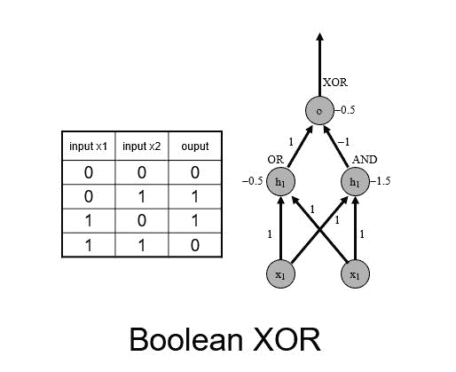

**XOR** 使用三层网络实现，是**或**以及**和**感知器的组合。输出层包含一个神经元，它给出**异或**输出。这种配置允许两个神经元各自专注于特定的逻辑功能。例如，在**异或的情况下，**两个神经元可以分别执行**和**和**或**逻辑功能。

术语 MLP 并不是指一个具有多层的感知器。相反，它包含许多组织成层的感知器。另一种选择是 MLP 网络。

MLP 的应用有:

*   MLP 对于研究中的复杂问题非常有用。
*   MLP 是通用函数逼近器，它们可用于通过回归分析创建数学模型。MLP 也是很好的分类算法。
*   MLP 用于不同的领域，例如语音识别、图像识别和语言翻译。它们构成了深度学习的基础。

我们现在将使用 R 包 SNNS 实现一个 MLP。


# 使用 RSNNS 实现 MLP R

对于这个`mlp()`模型构建的例子，包`RSNNS`取自 CRAN。SNNS 是一个用 C++编写的库，包含许多神经网络的标准实现。这个`RSNNS`包包装了 SNNS 的功能，使其可以在 r 内部使用。使用`RSNNS`低级接口，可以访问 SNNS 的所有算法功能和灵活性。该包包含一个最常用的神经网络拓扑和学习算法的高级接口，该接口无缝集成到 r 中。摘自官方文档的`RSNNS`包的简要描述如下表所示:

| **RSNNS 包** |
| **描述**: |
| SNNS 是一个包含许多神经网络标准实现的库。这个包封装了 SNNS 功能，使其在 r 中可用。使用`RSNNS`低级接口，可以访问 SNNS 的所有算法功能和灵活性。此外，该包包含一个方便的高级接口，因此最常见的神经网络拓扑和学习算法可以无缝集成到 r。 |
| **详情**: |
| 包:`RSNNS`
类型:包
版本:0.4-9
日期:2016-12-16
许可证:LGPL ( > =2) |
| **作者**: |
| 克里斯托弗·伯格梅尔
*何塞·贝尼特斯* |
| **用法**: |
| `mlp(x, y,`
`size = c(5),`
`maxit = 100,`
`initFunc = "Randomize_Weights",`
`initFuncParams = c(-0.3, 0.3),`
`learnFunc = "Std_Backpropagation",`
`learnFuncParams = c(0.2, 0),`
`updateFunc = "Topological_Order",`
`updateFuncParams = c(0),`
`hiddenActFunc = "Act_Logistic",`
`shufflePatterns = TRUE,`
`linOut = FALSE,`
`outputActFunc = if (linOut) "Act_Identity" else "Act_Logistic",`
`inputsTest = NULL,`
`targetsTest = NULL,`
`pruneFunc = NULL,`
`pruneFuncParams = NULL, ...)` |

我们使用`mlp()`函数创建一个 MLP 并训练它。训练通常通过反向传播来进行。

下表列出了最常用的参数:

| `x` | 具有网络训练输入的矩阵 |
| `y` | 相应的目标值 |
| `size` | 隐藏层中的单元数 |
| `maxit` | 要学习的最大迭代次数 |
| `hiddenActFunc` | 所有隐藏单元的激活功能 |
| `outputActFunc` | 所有输出单元的激活功能 |
| `inputsTest` | 用于测试网络的输入矩阵 |
| `targetsTest` | 测试输入的相应目标 |

让我们看看使用完整的虹膜数据集构建 SNNS MLP 的代码:

```
###################################################################
###Chapter 4 - Introduction to Neural Networks - using R ##########
###Simple RSNNS implementation function in R - iris dataset #######
###################################################################

data(iris)

library("RSNNS")

iris = iris[sample(1:nrow(iris),length(1:nrow(iris))),1:ncol(iris)]

irisValues = iris[,1:4]
irisTargets = decodeClassLabels(iris[,5])

iris = splitForTrainingAndTest(irisValues, irisTargets, ratio=0.15)
iris = normTrainingAndTestSet(iris)

model = mlp(iris$inputsTrain, 
 iris$targetsTrain, 
 size=5, 
 learnFuncParams=c(0.1),
 maxit=50, 
 inputsTest=iris$inputsTest, 
 targetsTest=iris$targetsTest)

summary(model)
weightMatrix(model)

par(mfrow=c(2,2))
plotIterativeError(model)

predictions = predict(model,iris$inputsTest)

plotRegressionError(predictions[,2], iris$targetsTest[,2])

confusionMatrix(iris$targetsTrain,fitted.values(model))
confusionMatrix(iris$targetsTest,predictions)

par(mfrow=c(1,2))
plotROC(fitted.values(model)[,2], iris$targetsTrain[,2])
plotROC(predictions[,2], iris$targetsTest[,2])

confusionMatrix(iris$targetsTrain, 
 encodeClassLabels(fitted.values(model),
 method="402040", 
 l=0.4, 
 h=0.6)) ###################################################################
```

让我们一步一步地检查代码。

该命令加载包含在数据集库中的 iris 数据集，并将其保存在给定的数据帧中。考虑到我们已经用了很多次了，我认为没有必要再加什么了。这将加载程序的`RSNNS`库:

```

 install.packages("RSNNS") 
 library("RSNNS")
```

记住，要安装 R 的初始发行版中没有的库，必须使用`install.package`函数。这是安装包的主要功能。它接受一个名称向量和一个目的库，从存储库中下载包并安装它们。

在我们的例子中，我们必须使用命令`install.packages("RSNNS")`。安装包仅在第一次安装时需要，从起重机安装`RSNNS`包。

```
iris = iris[sample(1:nrow(iris),length(1:nrow(iris))),1:ncol(iris)]
```

在前面的这一行中，`iris`数据集在行内被混洗。该操作使数据集中的行顺序变得随机。事实上，在原始数据集中，观察结果是按花卉物种排序的:第一个 *50* 出现的是`setosa`物种，接下来是 *50* 出现的是`versicolor`物种，最后是 *50* 出现的是海滨草物种。在此操作之后，这些行将随机出现。为了验证这一点，我们打印修改后数据集的第一个`20`行:

```
> head(iris, n=20)
 Sepal.Length Sepal.Width Petal.Length Petal.Width    Species
75           6.4         2.9          4.3         1.3 versicolor
112          6.4         2.7          5.3         1.9  virginica
54           5.5         2.3          4.0         1.3 versicolor
36           5.0         3.2          1.2         0.2     setosa
14           4.3         3.0          1.1         0.1     setosa
115          5.8         2.8          5.1         2.4  virginica
125          6.7         3.3          5.7         2.1  virginica
27           5.0         3.4          1.6         0.4     setosa
8            5.0         3.4          1.5         0.2     setosa
41           5.0         3.5          1.3         0.3     setosa
85           5.4         3.0          4.5         1.5 versicolor
64           6.1         2.9          4.7         1.4 versicolor
108          7.3         2.9          6.3         1.8  virginica
65           5.6         2.9          3.6         1.3 versicolor
66           6.7         3.1          4.4         1.4 versicolor
98           6.2         2.9          4.3         1.3 versicolor
39           4.4         3.0          1.3         0.2     setosa
84           6.0         2.7          5.1         1.6 versicolor
2            4.9         3.0          1.4         0.2     setosa
142          6.9         3.1          5.1         2.3  virginica
```

第一列中的数字是原始数据集的行号。我们怎么能注意到洗牌有完美的瑕疵。要与原始序列进行比较，请参见前面的示例:

```
irisValues = iris[,1:4]
irisTargets = decodeClassLabels(iris[,5])
```

设置自变量和目标变量，并分别分配给`irisValues`和`irisTargets`:

```
iris = splitForTrainingAndTest(irisValues, irisTargets, ratio=0.15)
iris = normTrainingAndTestSet(iris)
```

在第一行中，训练数据和测试数据通过`splitForTrainingAndTest()`函数分开。此函数将输入值和目标值拆分为一个定型集和一个测试集。测试集从数据的末尾开始。如果要打乱数据，应该在调用这个函数之前完成。具体来说，数据的分割如下: *85* 用于培训，而 *15* 用于测试。在第二行中，数据被规范化。为此，使用`normTrainingAndTestSet()`功能。该函数以如下方式规范化训练和测试集:`inputsTrain`成员使用`normalizeData`规范化，参数在类型中给出。然后，在此规范化过程中获得的规范化参数用于规范化`inputsTest`成员。如果没有设置`dontNormTargets`参数，那么目标以同样的方式规范化:

```
model = mlp(iris$inputsTrain, 
 iris$targetsTrain, 
 size=5, 
 learnFuncParams=c(0.1),
 maxit=50, 
 inputsTest=iris$inputsTest, 
 targetsTest=iris$targetsTest)
```

使用训练数据集调用`mlp()`函数来构建模型。这个函数创建一个 MLP 并训练它。MLP 是完全连接的前馈网络，可能是最常用的网络架构。训练通常通过误差反向传播或相关程序来进行。测试数据集也被传递以提供测试结果:

```
summary(model)
weightMatrix(model)
```

这些代码行允许我们从新创建的模型中提取有用的信息。`summary()`功能打印出网络摘要。打印的信息可以是原始 SNNS 文件格式的网络所有信息，也可以是`extractNetInfo`给出的信息。该行为由参数`origSnnsFormat`控制，而`weightMatrix()`函数提取`rsnns`对象的权重矩阵。下图显示了汇总结果的屏幕截图:

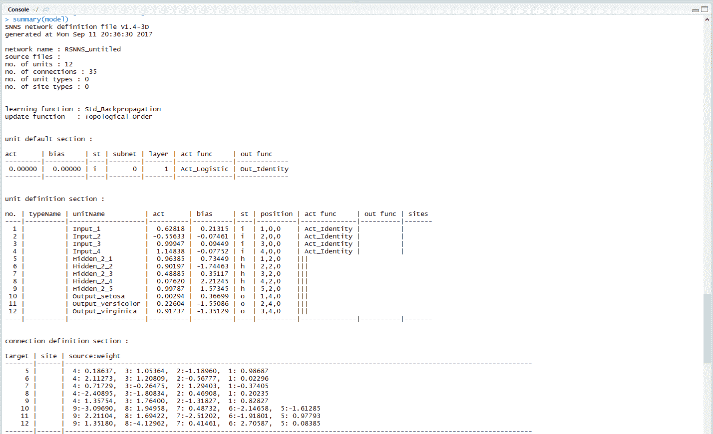

现在，我们在模型训练中测量算法的性能:

```
plotIterativeError(model)
```

`plotIterativeError()`函数绘制模型网络的迭代训练和测试误差。结果如下图所示:

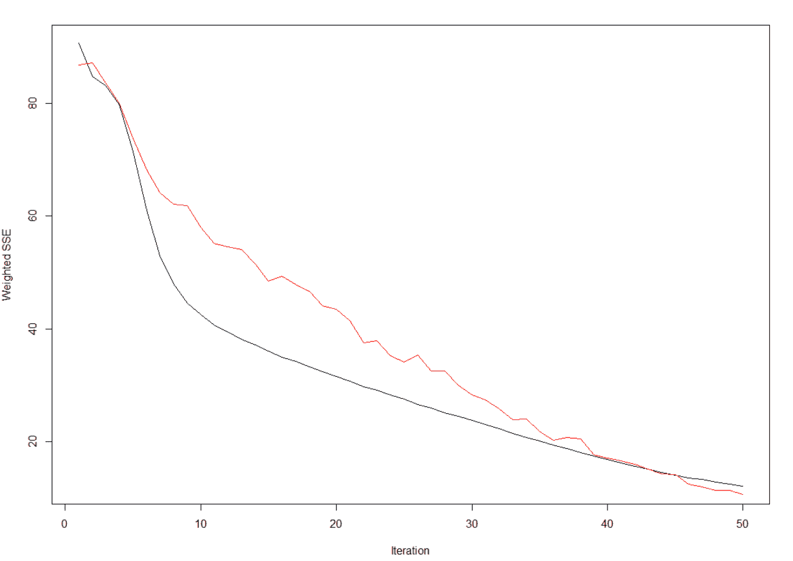

上图显示迭代拟合误差为黑线，迭代测试误差为红线。可以看出，两条线都具有强烈的下降趋势，表明该算法快速收敛。
对模型进行适当的训练后，就可以用它来进行预测了:

```
predictions = predict(model,iris$inputsTest)
```

在这种情况下，我们使用了`predict()`函数。这是一个通用函数，用于根据各种模型拟合函数的结果进行预测。该函数调用依赖于第一个参数的类的特定方法。我们既有预测，也有实际数据；我们只需要通过回归误差计算来比较它们:

```
plotRegressionError(predictions[,2], iris$targetsTest[,2])
```

为了绘制回归误差，我们使用了`plotRegressionError()`函数。该功能在 *X* 轴上显示目标值，在 *Y* 轴上显示拟合/预测值。最佳拟合将产生一条穿过零且梯度为 1 的线。在下图中，这条最佳线以黑色显示。与实际数据的线性拟合以红色显示。下图显示了我们之前训练的模型的回归误差:

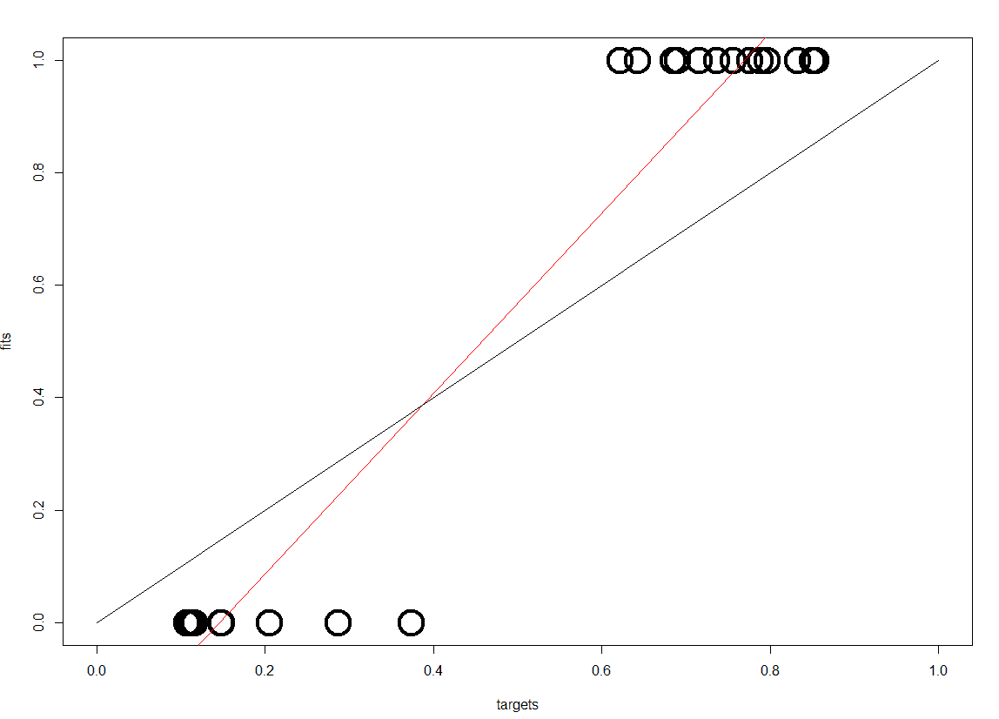

现在，让我们通过计算混淆矩阵来评估模型在预测数据方面的性能:

```
confusionMatrix(iris$targetsTrain,fitted.values(model))
confusionMatrix(iris$targetsTest,predictions)
```

为了计算混淆矩阵，我们使用了`confusionMatrix()`函数。

记住，混淆矩阵显示了真实类别`x`的模式被归类为类别`y`的次数。一个完美的方法应该产生一个对角矩阵。所有不在对角线上的值都是该方法的误差。

在代码的第一行，我们计算了训练中使用的数据的混淆矩阵(这是数据的 *85* 百分比)，而在第二行，我们计算了测试中使用的数据的混淆矩阵(这是数据的剩余 *15* 百分比)。结果如下:

```
> confusionMatrix(iris$targetsTrain,fitted.values(model))
 predictions
targets  1  2  3
 1 45  0  0
 2  0 34  3
 3  0  1 44
> confusionMatrix(iris$targetsTest,predictions)
 predictions
targets  1  2  3
 1  5  0  0
 2  0 13  0
 3  0  0  5
```

可以看出，在训练阶段有四个错误，只涉及到`versicolor`和`virginica`物种。记住，我们在[第 3 章](b5f75068-f1e3-465e-969d-a8f1ad48378d.xhtml)、*使用多层神经网络的深度学习*中给出的例子中获得了相同的结果。然而，在测试中，我们没有犯任何错误。我会说非常好的结果，虽然处理的数据实际上很小。我们以图形方式评估这些结果:

```
par(mfrow=c(1,2))
plotROC(fitted.values(model)[,2], iris$targetsTrain[,2])
plotROC(predictions[,2], iris$targetsTest[,2])
```

为了评估网络性能，我们绘制了接收机工作特性曲线。前面的命令绘制了两个阶段(训练和测试)的 ROC。
ROC 是一种用于检查分类器质量的指标。对于分类器的每一类，ROC 在区间*【0，1】*上对输出应用阈值。ROC 曲线是 TPR 对 FPR 的曲线图，因为阈值是变化的。一个完美的测试应该在左上角显示点，具有 100%的灵敏度和 100%的特异性。这些线越靠近左上角，网络性能就越好。下图显示了两个阶段的 ROC 曲线(左侧为训练，右侧为测试):

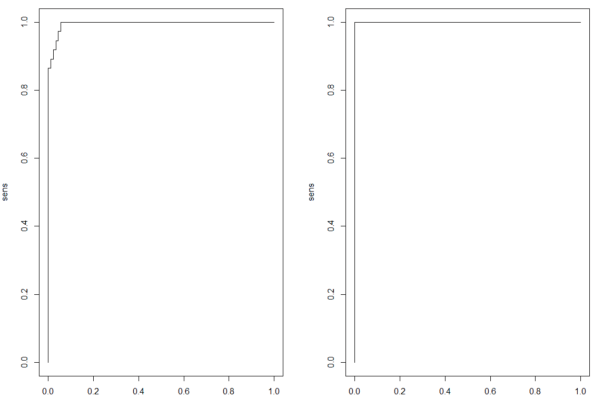

如前所述，在训练阶段，存在测试中不存在的错误。

注意，我们使用了`par()`函数在一个窗口中显示两个图表。在其中，我们将图形显示为一个一行两列的矩阵。

在`RSNNS`中没有`plot`函数，因此我们使用 GitHub 中的`plot`函数为我们刚刚构建的神经网络绘制以下 MLP。有三类输出和四个输入节点:

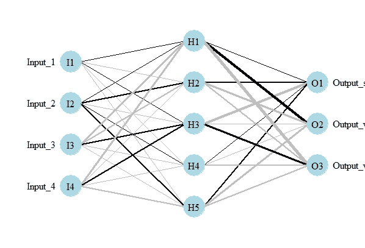

我们已经看到了一个使用`RSNNS`的`iris`数据集神经网络的简单实现。相同的`mlp()`函数可用于任何 MLP 神经网络架构。


# 摘要

在本章中，我们向您介绍了感知器的概念，它是神经网络的基本构件。我们还看到了多层感知器和一个使用`RSNNS`的实现。简单感知器只对线性分离问题有用，不能用于输出数据不可线性分离的情况。MLP 算法的使用超过了这些限制。

我们了解了感知器的基本概念以及它们在神经网络算法中的应用。我们发现了线性可分分类器和这个概念适用的函数。我们在 R 环境中学习了一个简单的感知器实现函数，然后我们学习了如何训练和模拟一个 MLP。

在下一章中，我们将了解如何使用神经网络模型来训练、测试和评估数据集。我们将学习如何在 R 环境中可视化神经网络模型。我们将涵盖早期停止、避免过度拟合、神经网络泛化和神经网络参数缩放等概念。