# 五、在 R 中训练和可视化神经网络

如在[第 1 章](b283a577-2201-43eb-877c-f281677370bf.xhtml)、*神经网络和人工智能概念*和[第 2 章](9318274a-72ac-4475-a140-7aaf92253400.xhtml)、*神经网络中的学习过程*中所见，训练神经网络模型形成了构建神经网络的基础。

前馈和反向传播是用于确定模型的权重和偏差的技术。权重永远不会为零，但偏差可以为零。首先，将权重初始化为一个随机数，通过梯度下降，误差被最小化；我们得到了模型的一组可能的最佳权重和偏差。

一旦使用任何 R 函数训练了模型，我们就可以传递自变量来预测目标或未知变量。在本章中，我们将使用公开可用的数据集来训练、测试和可视化神经网络模型。将涵盖以下项目:

*   使用神经网络模型训练、测试和评估数据集
*   可视化神经网络模型
*   提前停止
*   避免过度拟合
*   神经网络的推广
*   神经网络参数的缩放
*   集合模型

本章结束时，我们将了解如何使用神经网络模型训练、测试和评估数据集。我们将学习如何在 R 环境中可视化神经网络模型。我们将涵盖早期停止、避免过度拟合、神经网络的泛化和神经网络参数的缩放等概念。


# 神经网络数据拟合

数据拟合是构建一条曲线或一个数学函数的过程，它与一组先前收集的点具有最佳匹配。曲线拟合可以涉及插值(需要精确的数据点)和平滑(构建逼近数据的平坦函数)。从数据拟合中获得的近似曲线可用于帮助显示数据，在没有数据可用的情况下预测函数值，以及总结两个或多个变量之间的关系。下图显示了收集数据的线性插值:

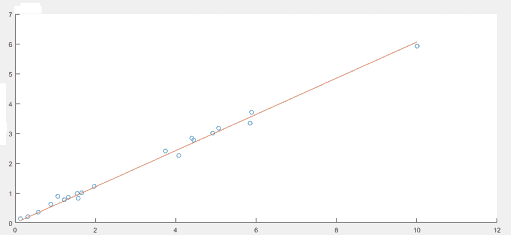

数据拟合是根据一组输入训练神经网络以产生一组相关的目标输出的过程。一旦神经网络拟合了数据，它就形成了输入-输出关系的一般化，并可用于为未经训练的输入生成输出。

全球主要制造商一直在研究车辆的油耗。在一个以加油问题甚至更大的空气污染问题为特征的时代，车辆的燃料消耗已经成为一个关键因素。在本例中，我们将构建一个神经网络，目的是根据某些特征预测车辆的燃油消耗量。

为此，使用包含在`ISLR`包中的`Auto`数据集，我们已经在[第 3 章](b5f75068-f1e3-465e-969d-a8f1ad48378d.xhtml)、*使用多层神经网络的深度学习*中的一个示例中使用了该数据集。`Auto`数据集包含 392 辆汽车的汽油里程、马力和其他信息。这是一个数据框架，包含以下九个变量的 392 个观察值:

*   `mpg`:每加仑英里数
*   `cylinders`:气缸数量在 4 到 8 之间
*   `displacement`:发动机排量(立方英寸)
*   `horsepower`:发动机马力
*   `weight`:车辆重量(磅)
*   `acceleration`:从 0 加速到 60 英里/小时的时间(秒)
*   `year`:年款(以 100 为模)
*   `origin`:汽车产地(美国、欧洲、日本)
*   `name`:车辆名称

下面是我们将在本例中使用的代码:

```
###########################################################################
########Chapter 5 - Introduction to Neural Networks - using R############## 
##########R program to build, train and test neural networks############### 
###########################################################################
library("neuralnet")
library("ISLR")

data = Auto
View(data)

plot(data$weight, data$mpg, pch=data$origin,cex=2)
par(mfrow=c(2,2))
plot(data$cylinders, data$mpg, pch=data$origin,cex=1)
plot(data$displacement, data$mpg, pch=data$origin,cex=1)
plot(data$horsepower, data$mpg, pch=data$origin,cex=1)
plot(data$acceleration, data$mpg, pch=data$origin,cex=1)

mean_data <- apply(data[1:6], 2, mean)
sd_data <- apply(data[1:6], 2, sd)

data_scaled <- as.data.frame(scale(data[,1:6],center = mean_data, scale = sd_data))
head(data_scaled, n=20)

index = sample(1:nrow(data),round(0.70*nrow(data)))
train_data <- as.data.frame(data_scaled[index,])
test_data <- as.data.frame(data_scaled[-index,])

n = names(data_scaled)
f = as.formula(paste("mpg ~", paste(n[!n %in% "mpg"], collapse = " + ")))

net = neuralnet(f,data=train_data,hidden=3,linear.output=TRUE)
plot(net)

predict_net_test <- compute(net,test_data[,2:6])
MSE.net <- sum((test_data$mpg - predict_net_test$net.result)^2)/nrow(test_data)

Lm_Mod <- lm(mpg~., data=train_data)
summary(Lm_Mod)
predict_lm <- predict(Lm_Mod,test_data)
MSE.lm <- sum((predict_lm - test_data$mpg)^2)/nrow(test_data)

par(mfrow=c(1,2))
plot(test_data$mpg,predict_net_test$net.result,col='black',main='Real vs predicted for neural network',pch=18,cex=4)
abline(0,1,lwd=5)
plot(test_data$mpg,predict_lm,col='black',main='Real vs predicted for linear regression',pch=18,cex=4)
abline(0,1,lwd=5)
###########################################################################
```

像往常一样，我们将逐行分析代码，详细解释用于捕获结果的所有特性。

```
library("neuralnet")
library("ISLR")
```

初始代码的前两行用于加载运行分析所需的库。

记住，要安装 R 的初始发行版中没有的库，必须使用`install.package`函数。这是安装包的主要功能。它接受一个名称向量和一个目的库，从存储库中下载包并安装它们。这个函数应该只使用一次，而不是每次运行代码时都使用。

`neuralnet`库用于使用反向传播、**弹性反向传播** ( **RPROP** )带或不带权重回溯，或修改的**全局收敛版本** ( **GRPROP** )来训练神经网络。该功能允许通过自定义选择错误和激活功能进行灵活设置。此外，还实现了广义权重的计算。

`ISLR`库包含一组可免费用于我们示例的数据集。这是在研究中心进行的主要研究中收集的一系列数据。

```
data = Auto
View(data)
```

这个命令加载了`Auto`数据集，正如我们所预料的，它包含在`ISLR`库中，并将其保存在给定的数据帧中。使用`View`功能查看任意 R 物体结构的紧凑显示。下面的截图显示了包含在`Auto`数据集中的一些数据:

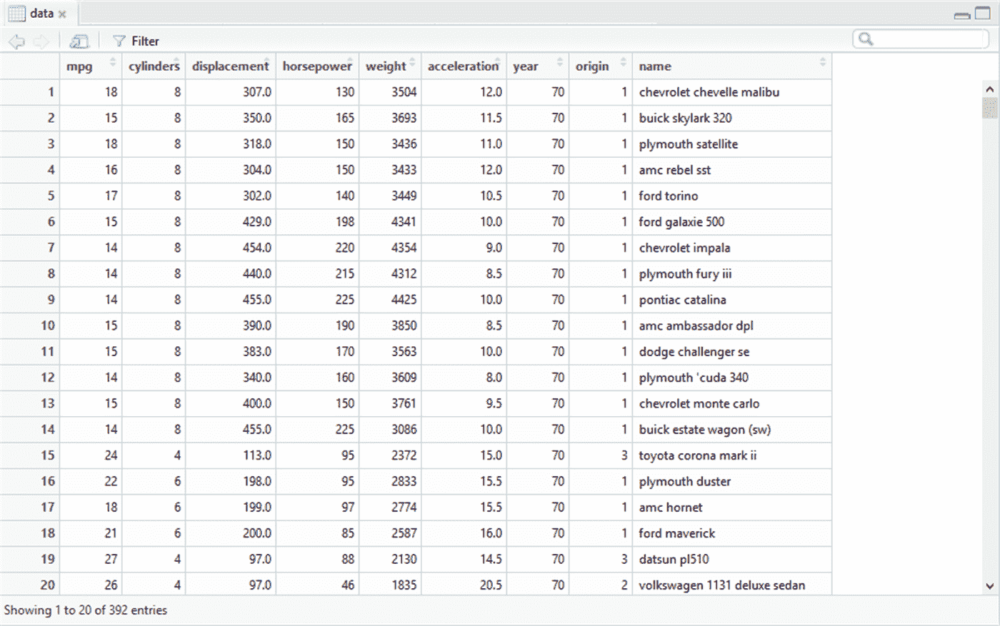

如您所见，数据库由 392 行和 9 列组成。这些行代表了从 1970 年到 1982 年的 392 辆商用车辆。这些列代表为每辆车收集的 9 个特征，依次为:`mpg`、`cylinders`、`displacement`、`horsepower`、`weight`、`acceleration`、`year`、`origin`和`name`。


# 探索性分析

在通过构建和训练神经网络开始数据分析之前，我们进行探索性分析，以了解数据是如何分布的，并提取初步知识。

我们可以通过描绘预测值与目标值的关系图来开始探索性分析。在这方面，我们记得在我们的分析中，预测因子是以下变量:`cylinders`、`displacement`、`horsepower`、`weight`、`acceleration`、`year`、`origin`和`name`。目标是包含 392 辆样车的每加仑英里数的`mpg`变量。

假设我们想要检查来自三个不同产地的汽车的重量和里程，如下图所示，使用以下代码:

```
plot(data$weight, data$mpg, pch=data$origin,cex=2)
```

为了绘制图表，我们使用了`plot()`函数，指定在 *x* 轴(`weight`)上指向什么，在 *y* 轴(`mpg`)上指向什么，最后，根据哪个变量对数据进行分组(`origin`)，如下图所示:


记住`origin`栏中的数字对应以下区域:1=美国，2 =欧洲，3 =日本)。通过对上图的分析，我们可以发现油耗随着体重的增加而增加。让我们记住，目标衡量的是每加仑的英里数，那么一加仑燃料能跑多少英里。由此得出结论，mpg(每加仑英里数)值越大，油耗越低。

另一个来自情节分析的考虑是，美国生产的汽车更重。事实上，在图表的右边部分(对应于较高的重量值)，只有该地区生产的汽车。

最后，如果我们将分析的重点放在图表的左侧，在对应最低油耗的上部，我们会发现大多数情况下是日本和欧洲的汽车。总之，我们可以注意到油耗最低的车是日本的。

现在，让我们看看其他图表，也就是说，如果我们绘制剩余的数字预测值(`cylinders`、`displacement`、`horsepower`和`acceleration`)与目标值(`mpg`)的关系，我们会得到什么。

```
par(mfrow=c(2,2))
plot(data$cylinders, data$mpg, pch=data$origin,cex=1)
plot(data$displacement, data$mpg, pch=data$origin,cex=1)
plot(data$horsepower, data$mpg, pch=data$origin,cex=1)
plot(data$acceleration, data$mpg, pch=data$origin,cex=1)
```

由于篇幅原因，我们决定将四个图表放在一起。使用`par()`函数，r 可以很容易地将多个图合并成一个总图。使用 par()函数，我们可以包含选项 mfrow=c(nrows，ncols)来创建一个由 nrows x ncols 图组成的矩阵，这些图按行填充。例如，选项 mfrow=c(3，2)创建一个 3 行 2 列的矩阵图。此外，选项 mfcol=c(nrows，ncols)按列填充矩阵。

下图显示了以 2 行 2 列矩阵排列的 4 个图:

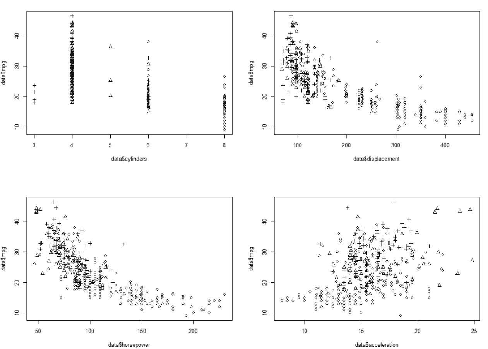

通过对上图的分析，我们发现前面已经提到的内容得到了证实。我们可以注意到马力越大的车油耗越高。同样的事情我们可以说关于发动机排量；同样在这种情况下，排量越高的车油耗越高。还是那句话，马力和排量值更高的车都是美国生产的。

相反，加速值较高的汽车油耗较低。这是因为这种汽车的重量较轻。通常情况下，重型车加速较慢。


# 神经网络模型

在[第 2 章](9318274a-72ac-4475-a140-7aaf92253400.xhtml)、*神经网络的学习过程*中，我们在构建网络之前对数据进行了缩放。在那种情况下，我们指出，在训练神经网络之前对数据进行标准化是一种很好的做法。通过规范化，消除了数据单元，使您可以轻松地比较不同位置的数据。

并不总是需要规范化数字数据。然而，已经表明，当数值被归一化时，神经网络的形成通常更有效，并且导致更好的预测。事实上，如果数值数据没有被归一化，并且两个预测值的大小相差很远，则神经网络权重值的变化对更高的值具有更大的相对影响。

有几种标准化技术；在[第二章](9318274a-72ac-4475-a140-7aaf92253400.xhtml)、*神经网络*的学习过程中，我们采用了 min-max 标准化。在这种情况下，我们将采用*Z*-分数归一化。该技术包括将列中的每个值减去列的平均值，然后将结果除以列的标准偏差。实现这一点的公式如下:

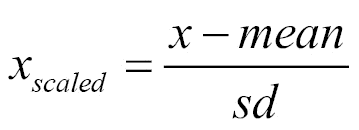

总之， *Z* 得分(也称为标准得分)代表观察点或数据的值大于观察或测量的平均值的标准偏差的数量。高于平均值的值具有正的 *Z* 分数，而低于平均值的值具有负的 *Z* 分数。*Z*-得分是一个无量纲的量，通过从单个粗略得分中减去总体平均值，然后将差值除以总体的标准差来获得。

在应用为规范化选择的方法之前，必须计算每个数据库列的平均值和标准偏差值。为此，我们使用了`apply`函数。此函数返回一个向量、一个数组或一组通过对数组或矩阵的边距应用函数而获得的值。让我们理解一下所用论据的含义。

第一行允许我们计算每个变量的平均值，第二行允许我们计算每个变量的标准差。让我们看看如何使用函数`apply()`。`apply`函数的第一个参数指定了要将函数应用到的数据集，在我们的例子中，数据集名为 data。特别是，我们只考虑了前六个数值变量；其他的我们会用于其他目的。第二个参数必须包含一个向量，该向量给出函数将应用到的下标。在我们的例子中，一个表示行，两个表示列。第三个参数必须包含要应用的函数；在我们的例子中，第一行的`mean()`函数和第二行的`sd()`函数。结果如下所示:

```
mean_data <- apply(data[1:6], 2, mean)
sd_data <- apply(data[1:6], 2, sd)
```

为了规范化数据，我们使用了`scale()`函数，这是一个通用函数，它的默认方法是居中和/或缩放数字矩阵的列:

```
> mean_data
 mpg    cylinders displacement   horsepower       weight 
 23.445918     5.471939   194.411990   104.469388  2977.584184 
acceleration
 15.541327
> sd_data
 mpg    cylinders displacement    horsepower       weight 
 7.805007     1.705783    04.644004     38.491160   849.402560 
acceleration
 2.758864
```

让我们来看看通过规范化转换的数据:

```
data_scaled <- as.data.frame(scale(data[,1:6],center = mean_data, scale = sd_data))
```

结果如下:

```
head(data_scaled, n=20)
```

现在，让我们拆分培训和测试的数据:

```
> head(data_scaled, n=20)
 mpg  cylinders displacement horsepower     weight acceleration
1  -0.69774672  1.4820530   1.07591459  0.6632851  0.6197483  -1.28361760
2  -1.08211534  1.4820530   1.48683159  1.5725848  0.8422577  -1.46485160
3  -0.69774672  1.4820530   1.18103289  1.1828849  0.5396921  -1.64608561
4  -0.95399247  1.4820530   1.04724596  1.1828849  0.5361602  -1.28361760
5  -0.82586959  1.4820530   1.02813354  0.9230850  0.5549969  -1.82731962
6  -1.08211534  1.4820530   2.24177212  2.4299245  1.6051468  -2.00855363
7  -1.21023822  1.4820530   2.48067735  3.0014843  1.6204517  -2.37102164
8  -1.21023822  1.4820530   2.34689042  2.8715843  1.5710052  -2.55225565
9  -1.21023822  1.4820530   2.49023356  3.1313843  1.7040399  -2.00855363
10 -1.08211534  1.4820530   1.86907996  2.2220846  1.0270935  -2.55225565
11 -1.08211534  1.4820530   1.80218649  1.7024847  0.6892089  -2.00855363
12 -1.21023822  1.4820530   1.39126949  1.4426848  0.7433646  -2.73348966
13 -1.08211534  1.4820530   1.96464205  1.1828849  0.9223139  -2.18978763
14 -1.21023822  1.4820530   2.49023356  3.1313843  0.1276377  -2.00855363
15  0.07099053 -0.8629108  -0.77799001 -0.2460146 -0.7129531  -0.19621355
16 -0.18525522  0.3095711   0.03428778 -0.2460146 -0.1702187  -0.01497955
17 -0.69774672  0.3095711   0.04384399 -0.1940546 -0.2396793  -0.01497955
18 -0.31337809  0.3095711   0.05340019 -0.5058145 -0.4598340   0.16625446
19  0.45535916 -0.8629108  -0.93088936 -0.4278746 -0.9978592  -0.37744756
20  0.32723628 -0.8629108  -0.93088936 -1.5190342 -1.3451622   1.79736053
```

在刚刚建议的代码的第一行中，数据集被分成 70:30，目的是使用 70%的数据来训练网络，剩余的 30%用于测试网络。在第二行和第三行，名为 data 的数据帧的数据被细分成两个新的数据帧，称为`train_data`和`test_data`。现在我们必须构建提交给网络的函数:

```
index = sample(1:nrow(data),round(0.70*nrow(data)))
train_data <- as.data.frame(data_scaled[index,])
test_data <- as.data.frame(data_scaled[-index,])
```

在第一行中，我们使用`names()`函数恢复了`data_scaled`数据帧中的所有变量名。在第二行中，我们构建将用于训练网络的公式。这个公式代表什么？

```
n = names(data_scaled)
f = as.formula(paste("mpg ~", paste(n[!n %in% "mpg"], collapse = " + ")))
```

由`neuralnet()`功能拟合的模型以紧凑的符号形式指定。~运算符是形成这种模型的基础。形式为 *y* ~ model 的表达式被解释为响应 *y* 由模型象征性指定的预测器建模的规范。这种模型由一系列用+运算符分隔的术语组成。术语本身由变量和因子名称组成，用:运算符分隔。该术语被解释为术语中出现的所有变量和因素的相互作用。让我们来看看我们设定的公式:

现在我们可以建立和训练网络。

```
> f
mpg ~ cylinders + displacement + horsepower + weight + acceleration
```

在[第三章](b5f75068-f1e3-465e-969d-a8f1ad48378d.xhtml)、*使用多层神经网络进行深度学习*中，我们说过要选择最佳的神经元数量，我们需要知道:

少量的神经元会导致系统的高误差，因为对于少量的神经元来说，预测因素可能太复杂而难以捕捉

*   大量的神经元会使你的训练数据过拟合，不能很好地概括
*   每个隐藏层中的神经元数量应该介于输入层和输出层的大小之间，可能是平均值
*   每个隐藏层中的神经元数量不应该超过输入神经元数量的两倍，因为在这一点上你可能会严重超载
*   在这种情况下，我们有五个输入变量(`cylinders`、`displacement`、`horsepower`、`weight`和`acceleration`)和一个变量输出(`mpg`)。我们选择在隐藏层设置三个神经元。

hidden 参数接受一个带有每个隐藏层神经元数量的向量，而参数`linear.output`用于指定我们是要进行回归(`linear.output=TRUE`)还是分类(`linear.output=FALSE`)。

```
net = neuralnet(f,data=train_data,hidden=3,linear.output=TRUE)
```

默认情况下，`neuralnet()`中使用的算法基于无权重回溯的弹性反向传播，并额外修改一个学习率，或者是与最小绝对梯度(`sag`)相关的学习率，或者是最小学习率(`slr`)本身。`neuralnet()`函数返回一个类为`nn`的对象。类别`nn`的对象是最多包含下表所示组件的列表:

**组件**

| **描述** | `call` |
| 匹配的呼叫。 | `response` |
| 摘自`data`论据。 | `covariate` |
| 从数据参数中提取的变量。 | `model.list` |
| 包含协变量和从`formula`参数中提取的`response`变量的列表。 | `err.fct` |
| 误差函数。 | `act.fct` |
| 激活功能。 | `data` |
| 数据参数。 | `net.result` |
| 包含神经网络每次重复的总体结果的列表。 | `weights` |
| 包含每次重复的神经网络拟合权重的列表。 | `generalized.weights` |
| 包含每次重复的神经网络广义权重的列表。 | `result.matrix` |
| 包含达到的阈值、需要的步数、误差、AIC 和 BIC(如果计算的话)以及每次重复的权重的矩阵。每一列代表一次重复。 | `startweights` |
| 包含每次重复的神经网络的起始权重的列表。 | A list containing the startweights of the neural network for every repetition. |

为了生成模型结果的结果摘要，我们使用了`summary()`函数:

对于神经网络模型的每个组件，显示了三个特征:

```
> summary(net)
 Length Class      Mode 
call                   5   -none-     call 
response             274   -none-     numeric
covariate           1370   -none-     numeric
model.list             2   -none-     list 
err.fct                1   -none-     function
act.fct                1   -none-     function
linear.output          1   -none-     logical
data                   6   data.frame list 
net.result             1   -none-     list 
weights                1   -none-     list 
startweights           1   -none-     list 
generalized.weights    1   -none-     list 
result.matrix         25   -none-     numeric 
```

**Length** :这是组件长度，也就是包含了多少个该类型的元素

*   **类别**:包含组件类别的具体指示
*   **模式**:这是组件的类型(数字、列表、函数、逻辑等)
*   为了用每个连接上的权重绘制模型的图形表示，我们可以使用`plot()`函数。`plot()`函数是一个通用函数，用于表示 r 中的对象。通用函数意味着它适用于不同类型的对象，从变量到表格到复杂的函数输出，产生不同的结果。应用于一个名义变量，它会产生一个条形图。应用于基数变量，它将产生一个散点图。应用于同一个变量，但制成表格，即其频率分布，它会产生一个直方图。最后，应用于两个变量，一个名义变量和一个基数变量，它将产生一个箱线图。

神经网络图如下图所示:

```
plot(net)
```

在前面的图中，黑线(这些线从输入节点开始)显示了每个层之间的连接以及每个连接上的权重，而蓝线(这些线从由数字 1 区分的偏差节点开始)显示了每个步骤中添加的偏差项。偏差可以被认为是线性模型的截距。

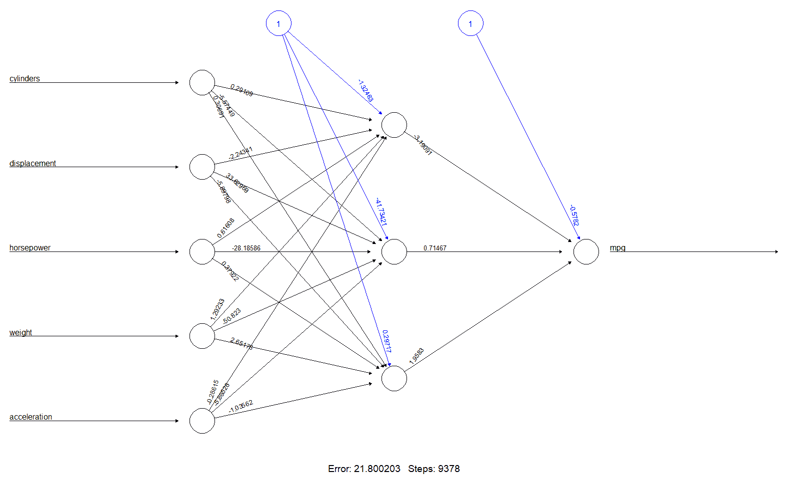

虽然随着时间的推移，我们已经了解了许多作为神经网络基础的机制，但在许多方面，我们建立和训练的模型仍然是一个黑盒。配件、重量和型号不够清楚。我们可以确信训练算法是收敛的，然后模型就可以使用了。

我们可以在视频上打印重量和偏差:

可以看出，这些值与我们在网络图中看到的值相同。例如，`cylinders.to.1layhid1 = 0.291091600669`是输入圆柱体和隐藏层第一个节点之间连接的权重。

```
> net$result.matrix
 1
error                      21.800203210980
reached.threshold           0.009985137179
steps                    9378.000000000000
Intercept.to.1layhid1      -1.324633695625
cylinders.to.1layhid1       0.291091600669
displacement.to.1layhid1   -2.243406161080
horsepower.to.1layhid1      0.616083122568
weight.to.1layhid1          1.292334492287
acceleration.to.1layhid1   -0.286145921068
Intercept.to.1layhid2     -41.734205163355
cylinders.to.1layhid2      -5.574494023650
displacement.to.1layhid2   33.629686446649
horsepower.to.1layhid2    -28.185856598271
weight.to.1layhid2        -50.822997942647
acceleration.to.1layhid2   -5.865256284330
Intercept.to.1layhid3       0.297173606203
cylinders.to.1layhid3       0.306910802417
displacement.to.1layhid3   -5.897977831914
horsepower.to.1layhid3      0.379215333054
weight.to.1layhid3          2.651777936654
acceleration.to.1layhid3   -1.035618563747
Intercept.to.mpg           -0.578197055155
1layhid.1.to.mpg           -3.190914666614
1layhid.2.to.mpg            0.714673177354
1layhid.3.to.mpg            1.958297807266
```

现在我们可以利用网络进行预测。为此，我们在`test_data`数据帧中留出了 30%的数据。是时候使用它了。

在我们的例子中，我们将函数应用于`test_data`数据集，仅使用从`2`到`6`的列，代表网络的输入变量。为了评估网络性能，我们可以使用**均方误差** ( **MSE** )来衡量我们的预测与真实数据的差距。

```
predict_net_test <- compute(net,test_data[,2:6])
```

这里`test_data$mpg`是实际数据，而`predict_net_test$net.result`是分析目标的预测数据。以下是结果:

```
MSE.net <- sum((test_data$mpg - predict_net_test$net.result)^2)/nrow(test_data)
```

看起来是个不错的结果，但是我们拿什么来比呢？为了了解网络预测的准确性，我们可以建立一个线性回归模型:

```
> MSE.net
[1] 0.2591064572
```

我们使用`lm`函数建立一个线性回归模型。该函数用于拟合线性模型。它可用于执行回归、单层方差分析和协方差分析。为了对获得的模型拟合结果进行汇总，我们使用了`summary()`函数，该函数返回以下结果:

```
Lm_Mod <- lm(mpg~., data=train_data)
summary(Lm_Mod)
```

现在，我们使用包含在`test_data`数据框架中的数据，通过线性回归模型进行预测:

```
> summary(Lm_Mod)
Call:
lm(formula = mpg ~ ., data = train_data)
Residuals:
 Min          1Q      Median          3Q         Max
-1.48013031 -0.34128989 -0.04310873  0.27697893  1.77674878
Coefficients:
 Estimate  Std. Error  t value        Pr(>|t|) 
(Intercept)   0.01457260  0.03268643  0.44583        0.656080 
cylinders    -0.14056198  0.10067461 -1.39620        0.163809 
displacement  0.06316568  0.13405986  0.47118        0.637899 
horsepower   -0.16993594  0.09180870 -1.85098        0.065273 . 
weight       -0.59531412  0.09982123 -5.96380 0.0000000077563 ***
acceleration  0.03096675  0.05166132  0.59942        0.549400 
---
Signif. codes:  0 ‘***’ 0.001 ‘**’ 0.01 ‘*’ 0.05 ‘.’ 0.1 ‘ ’ 1
Residual standard error: 0.5392526 on 268 degrees of freedom
Multiple R-squared:  0.7183376, Adjusted R-squared:  0.7130827
F-statistic: 136.6987 on 5 and 268 DF,  p-value: < 0.00000000000000022204
```

最后，我们计算回归模型的 MSE:

```
predict_lm <- predict(Lm_Mod,test_data)
```

以下是结果:

```
MSE.lm <- sum((predict_lm - test_data$mpg)^2)/nrow(test_data)
```

从两个模型(神经网络模型对线性回归模型)之间的比较来看，神经网络再次获胜(0.26 对 0.31)。

```
> MSE.lm
[1] 0.3124200509
```

我们现在通过在图表上绘制实际值与预测值的对比来进行视觉比较，首先是神经网络，然后是线性回归模型:

神经网络模型(左侧)和线性回归模型(右侧)在测试集上的性能比较如下图所示:

```
par(mfrow=c(1,2))

plot(test_data$mpg,predict_net_test$net.result,col='black',main='Real vs predicted for neural network',pch=18,cex=4)
abline(0,1,lwd=5)

plot(test_data$mpg,predict_lm,col='black',main='Real vs predicted for linear regression',pch=18,cex=4)
abline(0,1,lwd=5)
```

正如我们可以看到的，神经网络的预测比线性回归模型的预测更集中在线周围，即使您没有注意到很大的差异。

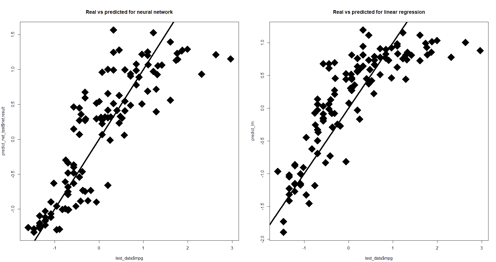

用神经网络对乳腺癌进行分类


# 乳房由一组腺体和脂肪组织组成，位于皮肤和胸壁之间。事实上，它不是一个单一的腺体，而是一组腺体结构，称为小叶，连接在一起形成一个叶。一个乳房有 15 到 20 个叶。乳汁通过称为乳管的小管从小叶到达乳头。
乳腺癌如果长期得不到发现和治疗，是一种潜在的严重疾病。它是由乳腺中一些转化为恶性细胞的细胞不受控制的增殖引起的。这意味着它们有能力从产生它们的组织中脱离出来，侵入周围的组织，并最终侵入身体的其他器官。理论上，所有类型的乳腺组织都可以形成癌症，但最常见的是腺细胞或形成导管壁的细胞。

此示例的目的是识别多个良性或恶性类别中的每一个。为此，我们将使用包含在`mlbench`包中的名为`BreastCancer`(威斯康星乳腺癌数据库)的数据集中的数据。这些数据是从 UCI 机器学习数据库中获取的，DNA 样本定期到达，沃尔伯格博士报告了他的临床病例。因此，数据库反映了数据的时间分组。这种分组信息立即出现，已经从数据本身中删除。除了第一个变量之外，每个变量都被转换成 11 个原始的数值属性，值的范围从 0 到 10。缺少 16 个值。

数据帧包含 11 个变量的 699 个观察值——1 个是字符变量，9 个是有序或名义变量，1 个是目标类:

`Id`:样本代码编号

*   `Cl.thickness`:团块厚度
*   `Cell.size`:细胞大小均匀
*   `Cell.shape`:细胞形状的均匀性
*   `Marg.adhesion`:边缘粘连
*   `Epith.c.size`:单个上皮细胞大小
*   `Bare.nuclei`:裸核
*   `Bl.cromatin`:平淡的染色质
*   `Normal.nucleoli`:正常核仁
*   `Mitoses`:有丝分裂
*   `Class`:类别
*   如前所述，本示例的目的是识别多个良性或恶性类别中的每一个。下面是我们将在本例中使用的代码:

我们开始逐行分析代码，详细解释用于捕获结果的所有特性。

```
###########################################################################
########Chapter 5 - Introduction to Neural Networks - using R############## 
####################Classifing breast cancer with R######################## 
########################################################################### 
library("mlbench")
library(neuralnet)

data(BreastCancer)
summary(BreastCancer)

mvindex = unique (unlist (lapply (BreastCancer, function (x) which (is.na (x)))))
data_cleaned <- na.omit(BreastCancer) 
summary(data_cleaned)

boxplot(data_cleaned[,2:10])
hist(as.numeric(data_cleaned$Mitoses))

par(mfrow=c(3, 3))
hist(as.numeric(data_cleaned$Cl.thickness))
hist(as.numeric(data_cleaned$Cell.size))
hist(as.numeric(data_cleaned$Cell.shape))
hist(as.numeric(data_cleaned$Marg.adhesion))
hist(as.numeric(data_cleaned$Epith.c.size))
hist(as.numeric(data_cleaned$Bare.nuclei))
hist(as.numeric(data_cleaned$Bl.cromatin))
hist(as.numeric(data_cleaned$Normal.nucleoli))
hist(as.numeric(data_cleaned$Mitoses))

str(data_cleaned)
input<-data_cleaned[,2:10]
indx <- sapply(input, is.factor)
input <- as.data.frame(lapply(input, function(x) as.numeric(as.character(x))))

max_data <- apply(input, 2, max)
min_data <- apply(input, 2, min)
input_scaled <- as.data.frame(scale(input,center = min_data, scale = max_data - min_data))
View(input_scaled)

Cancer<-data_cleaned$Class
Cancer<-as.data.frame(Cancer)
Cancer<-with(Cancer, data.frame(model.matrix(~Cancer+0)))

final_data<-as.data.frame(cbind(input_scaled,Cancer))

index = sample(1:nrow(final_data),round(0.70*nrow(final_data)))
train_data <- as.data.frame(final_data[index,])
test_data <- as.data.frame(final_data[-index,])

n = names(final_data[1:9])
f = as.formula(paste("Cancerbenign + Cancermalignant ~", paste(n, collapse = " + ")))

net = neuralnet(f,data=train_data,hidden=5,linear.output=FALSE)
plot(net)

predict_net_test <- compute(net,test_data[,1:9])
predict_result<-round(predict_net_test$net.result, digits = 0)
net.prediction = c("benign", "malignant")[apply(predict_result, 1, which.max)]
predict.table = table(data_cleaned$Class[-index], net.prediction)
predict.table

library(gmodels)
CrossTable(x = data_cleaned$Class[-index], y = net.prediction,
 prop.chisq=FALSE)
###########################################################################
```

初始代码的前两行用于加载运行分析所需的库。

```
library("mlbench")
library("neuralnet")
```

记住，要安装 R 的初始发行版中没有的库，必须使用`install.package`函数。这是安装包的主要功能。它接受一个名称向量和一个目的库，从存储库中下载包并安装它们。这个函数应该只使用一次，而不是每次运行代码时都使用。

`mlbench`库包含一系列人工和真实世界的机器学习基准问题，例如，包括来自 UCI 知识库的几个数据集。

`neuralnet`库用于使用反向传播、带或不带权重回溯的 RPROP 或修改的 GRPROP 来训练神经网络。该功能允许通过自定义选择错误和激活功能进行灵活设置。此外，还实现了广义权重的计算。下表显示了摘自官方文档的对 nnet 包的简要描述:

`neuralnet`:神经网络的训练

| **描述**: |
| 使用反向传播、有(Riedmiller，1994)或没有权重回溯(Riedmiller 和 Braun，1993)的弹性反向传播或阿纳斯塔夏迪斯等人(2005)的修改的全局收敛版本来训练神经网络。该软件包允许通过自定义选择错误和激活功能进行灵活设置。 |
| **详情**: |
| 包:`neuralnet`T11 类型:包
版本:1.33
日期:2016-08-05
许可证:GPL-2 |
| **作者**: |
| 斯蒂芬·弗里奇
弗劳克·根特
马克·苏林
塞巴斯蒂安·穆勒 |
| Stefan Fritsch
Frauke Guenther
Marc Suling
Sebastian M. Mueller |

回到代码，此时我们必须加载要分析的数据:

使用这个命令，我们上传名为`BreastCancer`的数据集，如前所述，在`mlbench`库中。

```
data(BreastCancer)
```

探索性分析


# 在通过构建和训练神经网络开始数据分析之前，我们进行探索性分析，以了解数据是如何分布的，并提取初步知识。

使用该命令，我们将看到使用`summary()`功能的简要总结。

```
summary(BreastCancer)
```

请记住，`summary()`函数是一个通用函数，用于生成各种模型拟合函数的结果汇总。该函数调用依赖于第一个参数的类的特定方法。

在这种情况下，该函数被应用于 dataframe，结果如下面的屏幕截图所示:

`summary()`函数返回每个变量的一组统计数据。特别是，突出显示为包含癌块诊断的`class`变量提供的结果是有用的。在这种情况下，检测出 458 例良性`class`和 241 例`malignant`级。另一个需要强调的特性是 Bare.nuclei 变量。对于该变量，检测到 16 例缺失值。

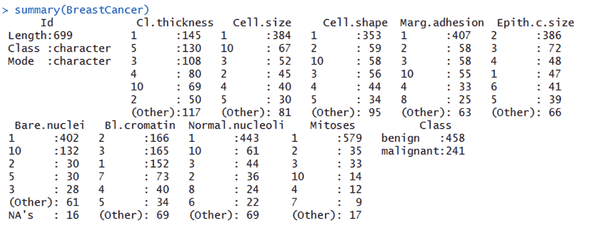

缺失值是其值未知的值。缺失值在 R 中用`NA`符号表示。`NA`是一个特殊值，其性质不同于其他值。`NA`是 R 中为数不多的保留字；你不能给任何东西起这个名字。例如，当您在 Excel 电子表格中读取空单元格时，可能会出现`NA`。当你尝试某些不合法或没有意义的操作时，你也会看到`NA`。缺失值不一定是由错误引起的；往往在现实生活中，缺乏检测。

一个问题油然而生:我们是否要担心价值缺失的存在？不幸的是，是的，这是因为几乎每个在`NA`上执行的操作都会产生一个`NA`。那么数据集中缺失值的存在会导致我们稍后进行的计算出错。这就是为什么我们被迫删除丢失的值。

要删除丢失的值，我们必须首先识别它们。`is.na()`函数为我们找到缺失的值；该函数返回一个与其参数长度相同的逻辑向量，其中 *T* 表示缺失值，而 *F* 表示非缺失值。想要知道缺失值的索引是很常见的，而`which()`函数可以帮助我们做到这一点。要查找至少有一个`NA`的数据帧中的所有行，请尝试:

`lapply()`函数将函数应用于每一列并返回一个列表，其第 *i* 个元素是一个向量，包含第 *i* 列中缺少值的元素的索引。函数`unlist()`将列表转换成一个向量，`unique()`去掉重复的列表。

```
mvindex = unique (unlist (lapply (BreastCancer, function (x) which (is.na (x)))))
```

现在我们有了缺失值(`NA`)出现的行数，如下所示:

现在我们知道数据库中有丢失的值，并且知道它们在哪里。我们只需从原始数据集中移除这些线。为此，我们可以使用以下函数:

```
> mvindex
 [1] 24 41 140 146 159 165 236 250 276 293 295 298 316 322 412 618
```

`na.omit`:删除任何缺少值的行，并且永远忘记它们

*   `na.exclude`:删除缺少值的行，但是跟踪它们的位置，这样当您进行预测时，例如，您会得到一个长度为原始响应长度的向量
*   我们将使用第一种选择，从而永远消灭它们:

要确认删除出现缺失值的行，再次应用`summary()`功能:

```
data_cleaned <- na.omit(BreastCancer) 
```

结果如以下截图所示:

```
summary(data_cleaned)
```

正如您现在看到的，不再有丢失的值了。

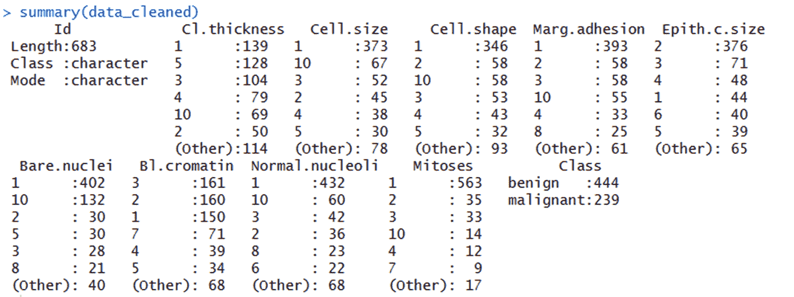

现在，让我们进入探索性分析。我们能做的第一件事是绘制变量的箱线图。通过查看`summary()`函数的结果，已经有了第一个想法。自然地，我们将只限于数值变量。

在下图中，显示了包含在已清理数据集(`data_cleaned`)中的数值变量(从 2 到 10)的箱线图:

```
boxplot(data_cleaned[,2:10])
```

从上图的分析中，我们可以注意到几个变量有异常值，其中变量`Mitoses`的数值最大。

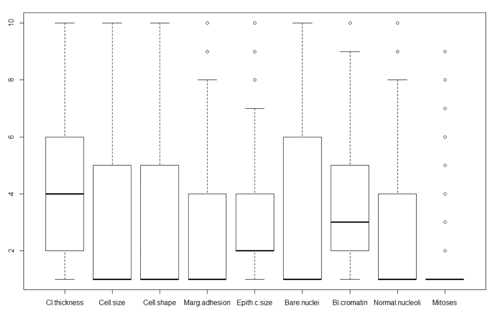

异常值在数值上不同于收集的其他数据。从包含异常值的样本中得出的统计数据可能会产生误导。

为了更好地识别异常值的存在，我们可以绘制数据库中变量的直方图。直方图是数字数据分布的精确图形表示。它是对连续变量的概率分布的估计。要构建直方图，第一步是指定值的范围(即，将整个值范围分成一系列区间)，然后计算每个区间内有多少个值。箱通常被指定为变量的连续的、不重叠的区间。箱子必须是相邻的，并且通常大小相等。使用直方图，我们可以看到数据分布的中间位置，数据离中间位置有多近，以及可能的异常值在哪里。

在 R 环境中，我们可以通过使用`hist()`函数简单地制作一个直方图，该函数计算给定数据值的直方图。我们必须将数据集的名称放在这个函数的括号之间。为了在同一个窗口中绘制多个图形，我们将使用`par()`函数，该函数已经在前面的示例中使用过:

由于函数`hist()`需要一个向量作为参数，我们使用`as.numeric(`函数将包含在数据集列中的值转换成数字向量。该函数创建或强制`numeric`类型的对象。下图显示了包含在已清理数据集(`data_cleaned`)中的数值变量(从 2 到 10)的直方图:

```
par(mfrow=c(3, 3))
hist(as.numeric(data_cleaned$Cl.thickness))
hist(as.numeric(data_cleaned$Cell.size))
hist(as.numeric(data_cleaned$Cell.shape))
hist(as.numeric(data_cleaned$Marg.adhesion))
hist(as.numeric(data_cleaned$Epith.c.size))
hist(as.numeric(data_cleaned$Bare.nuclei))
hist(as.numeric(data_cleaned$Bl.cromatin))
hist(as.numeric(data_cleaned$Normal.nucleoli))
hist(as.numeric(data_cleaned$Mitoses))
```

从直方图的分析中，可以注意到一些变量有异常值。

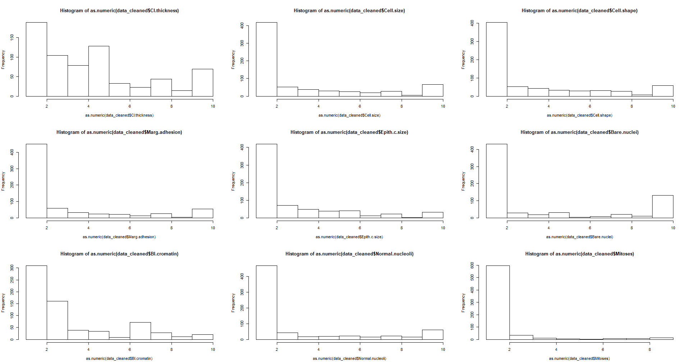

神经网络模型


# 正如我们在前面的示例中所做的那样，在构建和训练网络之前，我们必须运行数据标准化。在这种情况下，我们将采用最小-最大标准化。

请记住，在训练神经网络之前对数据进行规范化是一种很好的做法。通过规范化，消除了数据单元，使您可以轻松地比较不同位置的数据。

开始之前，使用`str()`功能做进一步检查。该功能提供对象内部结构的紧凑显示、诊断功能以及`summary()`功能的替代功能。理想情况下，每个基本结构只显示一行。它特别适合紧凑地显示(可能是嵌套的)列表的(缩写的)内容。这个想法是为任何 R 对象提供合理的输出。

结果如以下截图所示:

```
str(data_cleaned)
```

可以注意到，变量是作为一个因素出现的。我们需要为我们的计算做一个转换。

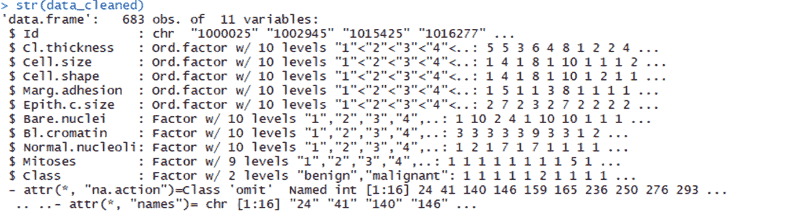

我们首先识别因子类型的变量，然后将它们转换成数字类型。我们现在可以标准化。

```
input<-data_cleaned[,2:10]
indx <- sapply(input, is.factor)
input <- as.data.frame(lapply(input, function(x) as.numeric(as.character(x))))
```

对于本例，我们将使用最小-最大方法(通常称为特征缩放)来获取范围*【0，1】*内的所有缩放数据。实现这一点的公式如下:

在应用为规范化选择的方法之前，必须计算每个数据库列的最小值和最大值。为此，我们使用了`apply()`函数。此函数返回一个向量、一个数组或一组通过对数组或矩阵的边距应用函数而获得的值。让我们理解一下所用论据的含义。


apply 函数的第一个参数指定了要将函数应用到的数据集，在我们的例子中，数据集名为`data`。第二个参数必须包含一个向量，该向量给出函数将应用到的下标。在我们的例子中，一个表示行，两个表示列。第三个参数必须包含要应用的函数；在我们的例子中，最大值函数。我们接下来要做的是计算每列的最小值:

```
max_data <- apply(data_cleaned[,2:10], 2, max)
```

最后，为了规范化数据，我们使用了`scale()`函数，这是一个通用函数，它的默认方法是居中和/或缩放数字矩阵的列，如下面的代码所示:

```
min_data <- apply(data_cleaned[,2:10], 2, min)
```

为了确认数据的标准化，让我们看看我们创建的新矩阵的前 20 行。为此，我们将使用`View()`功能:

```
data_scaled <- scale(data_cleaned[,2:10],center = min_data, scale = max_data - min_data)
```

正如你现在看到的，数据在 0 和 1 之间。此时，我们重建数据集，添加我们的目标(即`class`变量)，它代表癌症的诊断(`benign`或`malignant`)。这个话题需要我们注意:正如我们之前看到的，这个变量(`class`)是绝对的。特别是在数据帧中是作为一个因素存在的，为了使我们能在网络中恰当地使用它，我们必须对它进行必要的转换。我们的目标是一个二分变量(只有两个值:`benign`和`malignant`)，所以它可以很容易地转换成两个哑变量。

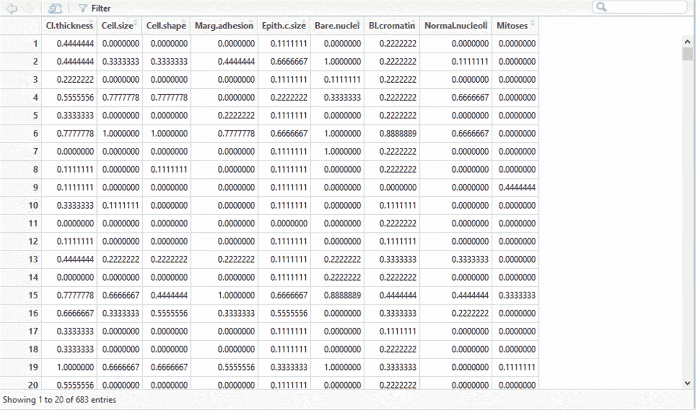

虚拟变量是一个取值`0`或`1`的变量，用来表示可能会改变结果的某种分类效应的存在与否。

我们要做的是创建两个新变量(`Cancerbenign`和`Cancermalignant`)，从代表我们目标的`Class`变量开始。`Cancerbenign`变量将在`Class`变量中出现的`benign`值每次出现时包含值 1，在其他情况下包含值 0。相反，`Cancermalignant`变量将在`Class`变量中出现的`malignant`值每次出现时包含值 1，在其他情况下包含值 0。

为了获得两个新的虚拟变量，我们使用了`model.matrix()`函数。该函数通过将因子扩展为一组虚拟变量(取决于对比)以及类似地扩展交互来创建模型矩阵。最后，我们将新变量添加到数据集:

```
Cancer<-data_cleaned$Class
Cancer<-as.data.frame(Cancer)
Cancer<-with(Cancer, data.frame(model.matrix(~Cancer+0)))
```

训练网络的时候到了。

```
final_data<-as.data.frame(cbind(input_scaled,Cancer))
```

网络培训阶段


# 人工神经网络由并行操作的简单元件组成。网络元件之间的连接是基本的，因为它们决定网络功能。这些连接通过其权重影响结果，权重在神经网络训练阶段进行调节。下图显示了串行和并行处理之间的比较:

然后，在训练阶段，通过改变连接权重来调节网络，使得特定的输入将导向特定的目的地。例如，可以通过比较输出(我们实际计算的)和目标(我们想要得到的)来调整网络，直到网络输出与目标匹配。为了获得足够可靠的结果，需要许多输入/目标对来形成网络。下图显示了培训阶段的简单流程图:

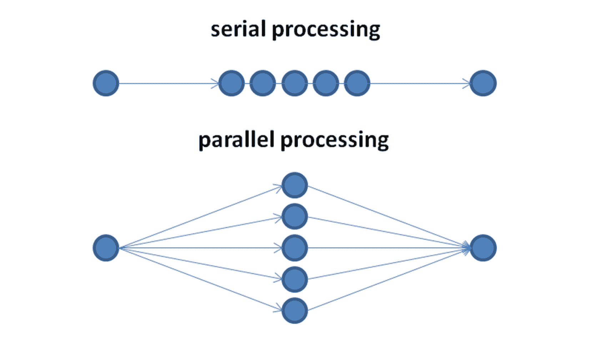

这些权重的调整方式由我们采用的特定算法来定义。在强调了算法在网络训练中的重要性之后，必须将更多的兴趣放在准备提供给网络的数据上。


在网络训练中，必须调整权重和偏差以优化网络性能。它代表了整个过程中最重要的阶段，因为网络越好，概化就能越好地处理未知的新数据。在这个阶段，部分收集的数据是随机获取的(通常是 70%的可用案例)。

在神经网络训练之后，我们可以使用该网络，在该阶段，随机抽取一部分收集的数据(通常是可用案例的 30 %)传递给网络进行测试。然后，可以保存神经网络对象，并根据需要多次使用任何新数据。下图显示了原始数据集的分割方式:

代码中的数据细分如下所示:

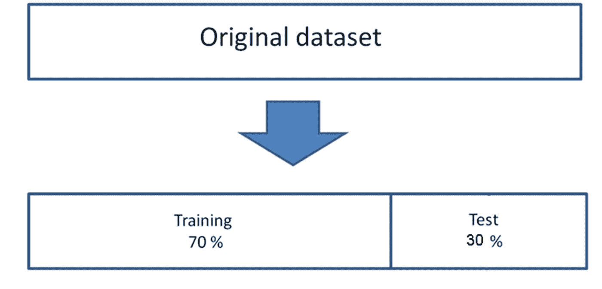

在刚刚建议的代码的第一行中，数据集被分成 70:30，目的是使用 70%的数据来训练网络，剩余的 30%用于测试网络。在第二行和第三行，名为`data`的数据帧的数据被细分为两个新的数据帧，名为`train_data`和`test_data`。现在我们必须构建提交给网络的函数:

```
index = sample(1:nrow(final_data),round(0.70*nrow(final_data)))
train_data <- as.data.frame(final_data[index,])
test_data <- as.data.frame(final_data[-index,])
```

在第一行中，我们使用`names()`函数恢复了`data_scaled`数据帧中前九个变量的名称。在第二行中，我们构建将用于训练网络的公式。这个公式代表什么？

```
n = names(final_data[1:9])
f = as.formula(paste("Cancerbenign + Cancermalignant ~", paste(n, collapse = " + ")))
```

由`neuralnet()`功能拟合的模型以紧凑的符号形式指定。~运算符是形成这种模型的基础。形式为 *y* ~ model 的表达式被解释为响应 *y* 由 model 象征性指定的预测器建模的规范。这种模型由一系列用+运算符分隔的术语组成。术语本身由变量和因子名称组成，用:运算符分隔。该术语被解释为术语中出现的所有变量和因素的相互作用。让我们来看看我们设定的公式:

我们现在有了我们需要的一切，我们可以创建和训练网络。我们回忆一下我们在前面的例子中给出的关于正确选择隐藏层中神经元数量的建议。我们有八个输入变量(`Cl.thickness`、`Cell.size`、`Cell.shape`、`Marg.adhesion`、`Epith.c.size`、`Bare.nuclei`、`Bl.cromatin`、`Normal.nucleoli`和`Mitoses`)和一个输出变量(`Cancer`)。然后我们选择在隐藏层设置五个神经元:

```
> f
Cancerbenign + Cancermalignant ~ Cl.thickness + Cell.size + Cell.shape + 
 Marg.adhesion + Epith.c.size + Bare.nuclei + Bl.cromatin + 
 Normal.nucleoli + Mitoses
```

`hidden`参数接受一个带有每个隐藏层的神经元数量的向量，而`linear.output`参数用于指定我们是想要进行回归(`linear.output=TRUE`)还是分类(`linear.output=FALSE`(我们的例子)。

```
net = neuralnet(f,data=train_data,hidden=5,linear.output=FALSE)
```

默认情况下，`neuralnet()`中使用的算法基于无权重回溯的弹性反向传播，并额外修改一个学习率，或者是与最小绝对梯度(`sag`)相关联的学习率，或者是最小学习率(`slr`)本身。

要用每个连接的权重绘制模型的图形表示，我们可以使用`plot()`函数，该函数已在前面的章节中广泛解释过:

神经网络图如下图所示:

```
plot(net)
```

在前面的图中，黑线(这些线从输入节点开始)显示了每个层之间的连接以及每个连接上的权重，而蓝线(这些线从由数字 1 区分的偏差节点开始)显示了每个步骤中添加的偏差项。偏差可以被认为是线性模型的截距。

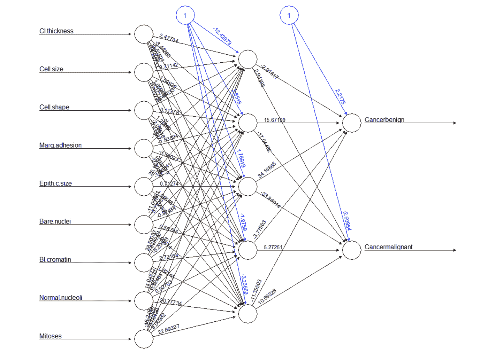

测试网络


# 我们终于训练好了网络，可以使用了。现在，我们可以用它来做预测。请记住，我们已经留出了 30%的可用数据，然后用它们来测试网络。是时候用了。

为了预测数据，我们使用了 compute 函数，该函数在给定一个训练好的神经网络的情况下，针对特定的任意协变量向量计算所有神经元的输出。让我们通过打印前十行来看看结果:

```
predict_net_test <- compute(net,test_data[,1:9])
```

正如我们所看到的，这些是有几个小数的实数。为了将它们与数据集中包含的数据进行比较，我们必须将它们四舍五入到最接近的整数。为此，我们将使用`round()`函数，该函数将第一个参数中的值四舍五入到指定的小数位数(默认为零)。

```
> head(predict_net_test$net.result,n=10)
 [,1]                       [,2]
1  0.9999999935589190 0.000000003587253510720848
2  0.0000011083596034 0.999999376764558189911725
4  0.9792070465712006 0.017164709664531079685856
5  0.9999999746453074 0.000000021909385204003642
9  0.9999993390597798 0.000000327298596658228207
14 0.9999999999953126 0.000000000000889095157872
17 0.9999999999989946 0.000000000000442776879837
19 0.0000001409393993 0.999999920006766185309743
21 0.0000024771345578 0.999998553964539960148272
23 0.9999999999999967 0.000000000000001305142352
```

我们现在重建起始变量。我们不再需要这两个虚拟变量。他们做得很好，但现在我们不再需要他们了。

```
predict_result<-round(predict_net_test$net.result, digits = 0)
```

现在，我们可以构建混淆矩阵来检查我们的分类器的性能。

```
net.prediction = c("benign", "malignant")[apply(predict_result, 1, which.max)]
```

混淆矩阵如下所示:

```
predict.table = table(data_cleaned$Class[-index], net.prediction)
```

虽然用一种简单的方式，矩阵告诉我们，我们只犯了八个错误。关于混淆矩阵的更多信息，我们可以使用包含在`gmodels`包中的`CrossTable()`函数。和往常一样，在加载书之前，你需要安装它。

```
> predict.table
 net.prediction
 benign malignant
 benign       132         5
 malignant      3        65
```

使用`CrossTable()`函数得到的混淆矩阵如下截图所示:

```
library(gmodels)
CrossTable(x = data_cleaned$Class[-index], y = net.prediction,
 prop.chisq=FALSE)
```

落在主对角线上的单元包含分类器正确分类的实例的计数。在左上角标有`TN`的单元格中，是真正的阴性结果。这 205 个值中的 132 个指示癌症是`benign`的情况，并且算法正确地将其识别为 T5。右下角标有`TP`的单元格表示真正的阳性结果，其中分类器和临床确定的标签一致认为质量为`malignant`。总共 205 个预测中有 65 个是真阳性。

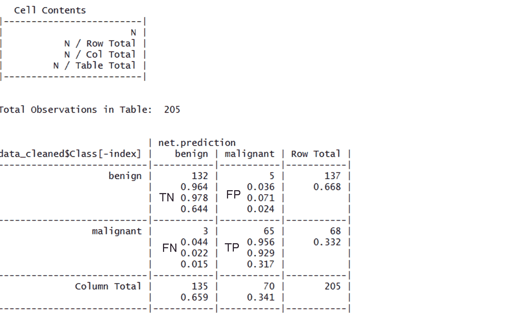

落在另一条对角线上的单元包含分类器错误分类的例子的计数。左下`FN`单元格中的三个例子是假阴性结果；在这种情况下，预测值是`benign`，但癌症实际上是`malignant`。在这个方向上的错误可能会付出极其高昂的代价，因为它们可能会导致患者认为她没有患癌症，而实际上疾病可能会继续扩散。标记为`FP`的单元格将包含假阳性结果，如果有的话。当模型将癌症分类为恶性而实际上是良性时，就会出现这些值。虽然这种错误没有假阴性结果危险，但是也应该避免，因为它们可能导致卫生保健系统的额外经济负担，或者患者的额外压力，因为可能必须提供额外的测试或治疗。

神经网络训练中的早期停止


# 历元是对权重和偏差的前向传播训练和反向传播更新的每次往返的测量。一旦我们收敛(最小误差项)或者在预设的迭代次数之后，训练的往返必须停止。

早期停止是一种用于处理模型过度拟合的技术(在接下来的几页中有更多关于过度拟合的内容)。训练集分为两部分:一部分用于训练，另一部分用于验证。我们已经将我们的`IRIS`数据集分成两部分:一部分 75 %,另一部分 25%。

利用训练数据，我们计算梯度并更新网络权重和偏差。第二组数据，即测试或验证数据，用于验证模型过拟合。如果验证期间的误差增加了指定的迭代次数(`nnet.abstol` / `reltol`)，则停止训练，模型使用该点的权重和偏差。这种方法叫做*提前停车。*

早期停止的神经网络集成泛化误差与由传统算法训练的最佳结构的单个神经网络相当。单个神经网络需要复杂而完美的调整，才能在不提前停止的情况下实现这种泛化。

避免模型中的过度拟合


# 训练数据的拟合使得模型确定权重和偏差以及激活函数值。当算法在一些训练数据集中表现得太好时，它被认为与该特定数据集太一致。当测试数据与训练数据非常不同时，这导致输出值的高变化。这种高估计方差被称为**过拟合**。预测会受到所提供的训练数据的影响。

有许多可能的方法来处理神经网络中的过拟合。第一种是正则化，类似于回归。有两种正则化:

L1 或拉索正则化

*   L2 或岭正则化
*   最大范数约束
*   神经网络中的辍学
*   正则化引入了影响激活函数的成本项。它试图通过在目标函数中引入更多的特征来改变大多数系数。因此，它试图将许多变量的系数推到零，并减少成本项。

**套索或 L1 正则化或 L1 惩罚**:这有一个惩罚项，它使用绝对权重的总和，从而优化权重以减少过拟合。**最小绝对收缩和选择算子** ( **套索**)引入惩罚权重，使网络权重向零收缩。

*   **L2 惩罚或岭回归**:这与 L1 相似，但惩罚是基于平方权重而不是绝对权重之和。重量越大惩罚越重。
*   对于这两种情况，只有权重被考虑用于优化，偏差(或偏移或截距)被排除在练习之外。

**最大范数约束**:这是另一种正则化技术，通过这种技术，我们对每个神经元的输入权重向量的幅度施加绝对上限，并且由于这种约束，投影梯度下降不能修改权重。这里，参数向量不会失去控制(即使学习率太高)，因为对权重的更新总是有限的。

*   **脱落**:这是另一种防过拟合技术。在训练时，通过以某种概率 *p* (一个超参数)保持神经元活动或者否则将其设置为零来实现退出。这意味着一些神经元可能在训练过程中不存在，从而退出。网络不受影响，甚至在缺少某些信息的情况下变得更加准确。这防止了网络变得过于依赖任何一个(或任何小的组合)神经元。下图解释了退出的过程。红色(或黑色)神经元是被丢弃的神经元，神经网络模型在没有这些神经元的情况下仍然存在，并且提供了更少的过拟合和更高的准确性:
*   神经网络的泛化

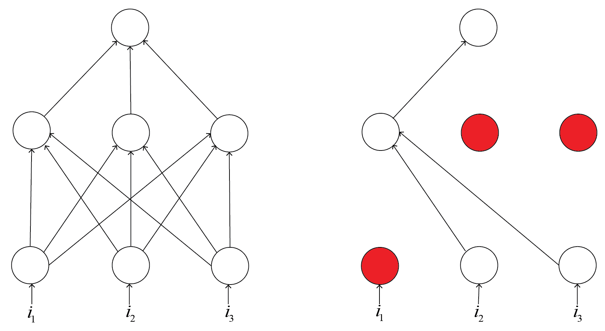

# 概括的目的是拟合训练数据。这是我们在神经网络模型上所做训练的延伸。它寻求最小化模型在训练数据上的误差平方和(例如使用普通的最小二乘法)并降低模型的复杂性。

概括的方法如下:

提前停止训练

*   用不同训练数据重新训练神经网络
*   使用随机抽样、分层抽样或任何目标数据的良好组合
    *   训练多个神经网络并平均它们的输出
*   神经网络模型中的数据缩放


# 数据缩放或规范化是一个以标准格式制作模型数据的过程，这样可以提高训练的质量、准确性和速度。神经网络中缩放数据的方法类似于任何机器学习问题中的数据规范化。

下面列出了一些简单的数据标准化方法:

**Z 分数归一化**:如前几节所预期的，首先计算给定数据的算术平均值和标准偏差。标准化分数或*Z*-分数计算如下:

*   **Z-score normalization**: As anticipated in previous sections, the arithmetic mean and standard deviation of the given data are calculated first. The standardized score or *Z*-score is then calculated as follows:


这里， *X* 是数据元素的值，μ是均值，σ是标准差。*Z*-分数或标准分数表示数据元素与平均值的标准偏差。由于均值和标准差对异常值很敏感，因此这种标准化对异常值也很敏感。

**最小-最大标准化**:计算每个数据元素的以下内容:

*   这里， *x* [*i*] 为数据元素， *min(x)* 为所有数据值的最小值， *max(x)* 为所有数据值的最大值。这种方法将所有的分数转换成一个普通的范围[0，1]。然而，它受到离群值敏感性的影响。

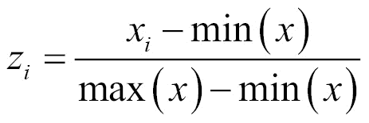

**中位数和 MAD** :中位数和中位数绝对偏差(MAD)归一化使用以下公式计算归一化数据值:

*   这里，*x[I]表示每个数据值。这种方法对异常值和分布极端尾部的点不敏感，因此是稳健的。然而，这种技术不保留输入分布，并且不将分数转换到公共数值范围。*

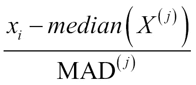

使用神经网络的集合预报


# 另一种正则化方法包括组合神经网络模型并平均结果。得到的模型是最精确的。

神经网络集成是一组神经网络模型，通过平均各个模型的结果来做出决策。集成技术是一种提高泛化能力的简单方法，尤其是在由噪声数据或小数据集引起的情况下。我们训练多个神经网络并平均它们的输出。

作为一个例子，我们对同一个学习问题取 20 个神经网络，我们在训练过程中调整各种参数，然后将均方误差与其平均值的均方误差进行比较。

以下是遵循的步骤:

数据集被加载并分成训练集和测试集。对于不同的神经网络模型，百分比分割可以不同。

1.  通过调整`nnet()`功能中的参数，使用不同的训练集创建多个模型。
2.  所有模型都经过训练，每个模型中的误差都被制成表格。
3.  找到测试数据中每一行的平均误差，并计算每个模型的均方误差。
4.  将均方误差与平均值的均方误差进行比较。
5.  从比较中选择最佳模型，并进一步用于预测。
6.  这种方法允许我们处理数据和函数参数，以达到模型的最佳设置。我们可以在集合中选择任意数量的模型，并使用 r。

过度拟合被大大减少，并且模型的最佳参数在这里达到。

摘要


# 在本章中，我们介绍了使用 r 对简单神经网络进行训练和可视化。在这里，我们可以更改神经元的数量、隐藏层的数量、激活函数等，以确定模型的训练。

而处理一个回归问题，最后一层是单个单元，会给出连续的值。对于一个分类问题，有 n 个终端单元，每个终端单元用其概率表示输出的类别。乳腺癌示例有两个输出神经元来表示从神经网络输出的两类值。

我们已经学习了如何使用神经网络模型来训练、测试和评估数据集。我们还学习了如何在 R 环境中可视化 NN 模型。我们已经介绍了早期停止、避免过拟合、神经网络泛化和神经网络参数缩放等概念。

We have learned how to train, test, and evaluate a dataset using NN model. We have also learned how to visualize the NN model in R environment. We have covered the concepts like early stopping, avoiding overfitting, generalization of NN, and scaling of NN parameters.