<title>Recurrent and Convolutional Neural Networks</title>  

# 递归和卷积神经网络

到目前为止，我们一直在研究前馈网络，其中数据沿一个方向移动，各层节点之间没有互联。在存在与一些问题相互作用的基本假设的情况下，前馈网络的固有单向结构具有很大的局限性。然而，有可能从它开始并创建网络，其中一个单元的计算结果影响另一个单元的计算过程。显然，管理这些网络动态的算法必须满足新的收敛标准。

本章我们将介绍**递归神经网络** ( **RNN** )，这是一种具有循环数据流的网络。我们还会看到**卷积神经网络** ( **CNN** )，这是主要用于图像识别的标准化神经网络。对于这两种类型的网络，我们将在 r 中进行一些示例实现，包括以下主题:

*   RNN
*   `rnn`套餐
*   **长短期记忆** ( **LSTM** )模型
*   美国有线新闻网；卷积神经网络
*   通用 CNN 架构- **LeNet**

在本章的最后，我们将了解培训、测试和评估 RNN。我们将学习如何在 R 环境中可视化 RNN 模型。我们也可以训练一个 LSTM 模型。我们将介绍 CNN 和公共 CNN 架构- LeNet 的概念。

<title>Recurrent Neural Network</title>  

# 递归神经网络

在**人工神经网络** ( **ANN** )的集合中，根据隐含层数和数据流有几种变体。其中一个变体是 RNN，神经元之间的连接可以形成一个循环。与前馈网络不同，rnn 可以使用内存进行处理。rnn 是一类人工神经网络，其特征在于隐藏层之间的连接，隐藏层通过时间传播以学习序列。RNN 用例包括以下字段:

*   股票市场预测
*   图像字幕
*   天气预报
*   基于时间序列的预测
*   语言翻译
*   语音识别
*   手写识别
*   音频或视频处理
*   机器人动作排序

到目前为止，我们所研究的网络(前馈网络)是基于输入数据的，这些输入数据被提供给网络并被转换成输出。如果是监督学习算法，输出就是能识别输入的标签。基本上，这些算法通过识别模式将原始数据与特定类别联系起来。另一方面，递归网络不仅将向网络供电的当前输入数据作为其输入，还将它们随时间推移所经历的数据作为其输入。

循环网络在特定时刻做出的决策会影响它随后立即做出的决策。因此，递归网络有两个输入源——现在和最近的过去——结合起来决定它们如何对新数据做出反应，就像人们在日常生活中所做的那样。

递归网络不同于前馈网络，这是因为反馈回路与它们过去的决策相关联，从而暂时接受它们的输出作为输入。可以通过说递归网络具有记忆来强调这个特征。给神经网络增加记忆是有目的的:序列本身就有信息，递归网络用它来完成前馈网络不能完成的任务。

RNN 是一类神经网络，其中神经元之间存在连接，形成有向循环。典型的 RNN 如下图所示:

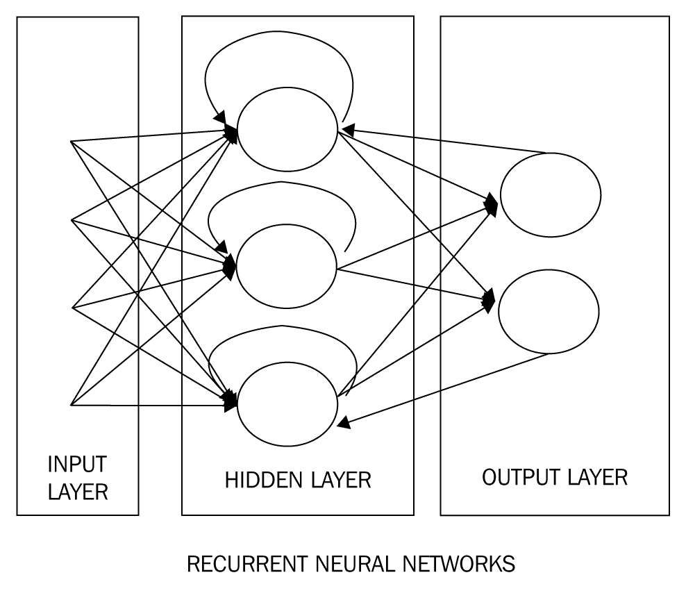

这里，一个实例的输出被用作同一神经元的下一个实例的输入。数据保存在内存中以及在不同时间段流动的方式使得 RNNs 强大而成功。

在 RNNs 下，数据反向流动的方式有更多的变体:

*   完全循环
*   递归的
*   霍普菲尔德
*   埃尔曼和乔丹网络公司
*   神经历史压缩器
*   LSTM
*   **门控循环单元** ( **GRU** )
*   双向的
*   复发性 MLP

递归网络被设计为将模式识别为数据序列，并且有助于预测和预报。他们可以处理文本、图像、语音和时间序列数据。rnn 是强大的 ann 之一，代表生物大脑，包括具有处理能力的记忆。递归网络从当前输入(类似前馈网络)和先前计算的输出获取输入:

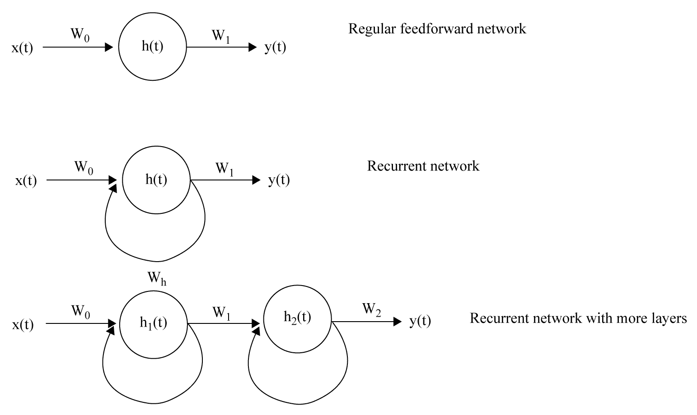

为了更好地理解这一点，我们认为 RNN 是一个神经网络的网络，其循环性质以下面的方式展开。在不同的时间周期( *-t-1* 、 *t* 、 *t+1* 等等)考虑神经元 *h* 的状态，直到达到收敛或总次数。

Vanilla 是引入的第一个递归神经网络模型。下图显示了一个普通的 RNN:

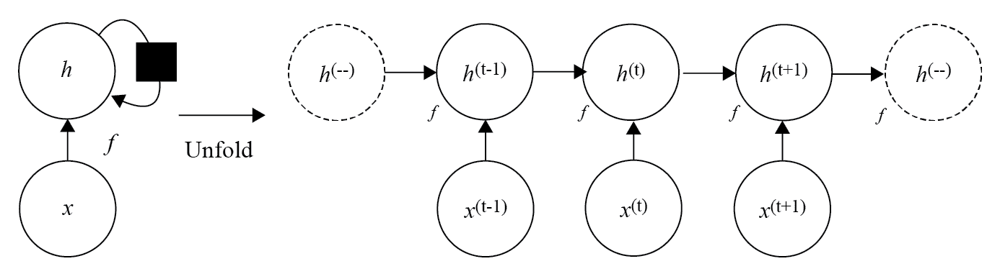

诸如 GRU 或 LSTM 网络之类的其他变体由于实现简单而更加广泛，并且它们已经在涉及诸如语言建模、语音识别、图像字幕和自动翻译之类的序列的广泛应用中表现出显著的性能。

RNNs 可以通过以下包在 R 中实现:

*   `rnn`
*   `MxNetR`
*   `TensorFlow`为居

rnn 主要用于序列建模。输入和输出被视为向量(数字矩阵)。对于 RNNs 的另一个层次的理解，我建议你去看看 Andrej Karpathy 的字符排序例子。

RNN 的特点使它像一个有记忆的人工神经网络。人工神经网络的记忆更像人类的大脑。有了记忆，我们可以让机器从头开始思考，从它们的“记忆”中学习。rnn 基本上是带有环路的 ann，允许信息在网络中持续存在。该循环允许信息从状态 t 传递到状态 *t+1* 。

如上图所示，rnn 可以看作是同一个 ANN 的多个副本，其中一个的输出作为输入传递给下一个。当我们保存信息时，随着模式的改变，RNN 能够预测出 *t+1* 的值。这对于分析基于时间序列的问题特别有用。

没有具体的标签要求；作为输入一部分的值构成了时间序列变量，RNN 可以学习模式并进行预测。

RNN 的内部状态在学习过程的每个时间步都会更新。RNN 的前馈机制类似于 ANN 然而，反向传播是一种误差项校正，跟随在时间**反向传播之后( **BPTT** )。**

时间反向传播遵循以下伪代码:

1.  展开 RNN 以包含 *n* 个前馈网络。
2.  将权重 *w* 初始化为随机值。
3.  执行以下操作，直到满足停止标准或完成所需的时期数。
4.  用值 *x [i.]* 设置每个网络的输入
5.  通过整个展开的网络向前传播输入。
6.  通过展开的网络反向传播错误。
7.  更新网络中的所有权重。
8.  平均权重，找出折叠网络中的最终权重。

<title>The rnn package in R</title>  

# R 中的 rnn 包

要在 R 环境中实现 RNN，我们可以使用 CRAN 提供的`rnn`包。这个包广泛用于实现 RNN。从官方文件中摘录的`rnn`包的简要描述如下表所示:

| **rnn** :递归神经网络 |
| **描述**: |
| R 中 RNN 的实现 |
| **详情**: |
| 包:`rnn`
类型:包
版本:0.8.0
日期:2016-09-11
许可证:GPL-3 |
| **作者**: |
| 迪米特里·菲乔 |

`rnn`包中使用的主要功能如下表所示:

| `predict_rnn` | 预测 RNN 模型的输出:`predict_rnn(model, X, hidden = FALSE, real_output = T, ...)` |
| `run.rnn_demo` | 启动`rnn_demo`应用程序的功能:`run.rnn_demo(port = NULL)` |
| `trainr` | 这列火车开往 RNN。该模型由`predictr`功能使用。 |
| `predictr` | 这预测了 RNN 模型的输出:`predictr(model, X, hidden = FALSE, real_output = T, ...)` |

和往常一样，为了能够使用一个库，我们必须首先安装，然后将它加载到我们的脚本中。

记住，要安装 R 的初始发行版中没有的库，必须使用`install.package`函数。这是安装包的主要功能。它接受一个名称向量和一个目的库，从存储库中下载包并安装它们。这个函数应该只使用一次，而不是每次运行代码时都使用。

因此，让我们安装并加载库:

```
install.packages("rnn")
library("rnn")
```

当我们加载库(`library("rnn")`)时，我们可能会收到以下错误:

```
> library("rnn")
Error: package or namespace load failed for ‘rnn’ in get(Info[i, 1], envir = env):
 cannot open file 'C:/Users/Giuseppe/Documents/R/win-library/3.4/digest/R/digest.rdb': No such file or directory
```

别担心，没什么大不了的。r 只是说，为了运行`rnn`库，你还需要安装`digest`库。记住它；将来，如果发生这样的问题，你现在知道如何解决它。只需添加以下命令:

```
install.packages("digest")
```

现在我们可以开始演示了:

```
run.rnn_demo()
```

当我们在安装`rnn`包后运行`run.rnn_demo()`时，我们可以通过`127.0.0.1:5876`访问一个网页，这允许我们运行一个带有预置值的 RNN 的演示，并且还可以直观地看到参数如何影响 RNN，如下图所示:

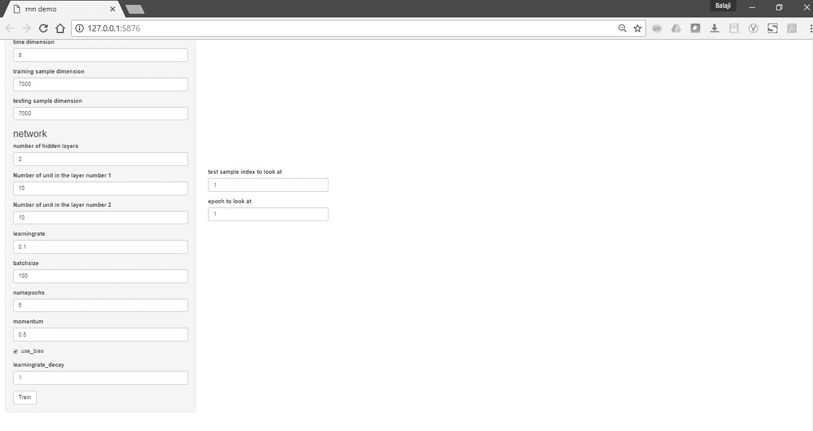

在这一点上，我们将能够设置我们的网络的参数，并选择合适的值通过它的标签插入到框中。必须正确设置以下参数:

*   `time dimension`
*   `training sample dimension`
*   `testing sample dimension`
*   `number of hidden layers`
*   `Number of unit in the layer number 1`
*   `Number of unit in the layer number 2`
*   `learningrate`
*   `batchsize`
*   `numepochs`
*   `momentum`
*   `learningrate_decay`

完成此操作后，我们只需单击 train 按钮，命令就会被构建和训练。

下图显示了模拟的结果:


`trainr`和`predictr`功能是`rnn`包中最重要的功能。`trainr()`函数用一组`X`和`Y`参数训练一个模型，该模型可用于使用`predictr()`函数的预测:

```
trainr(Y, X, 
 learningrate, 
 learningrate_decay = 1, 
 momentum = 0, 
 hidden_dim = c(10), 
 network_type = "rnn", 
 numepochs = 1, 
 sigmoid = c("logistic", "Gompertz", "tanh"), 
 use_bias = F, 
 batch_size = 1, 
 seq_to_seq_unsync = F, 
 update_rule = "sgd", 
 epoch_function = c(epoch_print, epoch_annealing), 
 loss_function = loss_L1, ...) 

predictr(model, 
 X, 
 hidden = FALSE, 
 real_output = T, 
 arguments to pass to sigmoid function)
```

`trainr()`函数采用以下参数。输出是可用于预测的模型:

| `Y` | 输出值数组:

*   `dim 1`:样品(必须等于`X`的尺寸 1)
*   `dim 2`:时间(必须等于`X`的尺寸 2)
*   `dim 3`:变量(可以是一个或多个，如果是矩阵，将被强制为数组)

 |
| `X` | 输入值数组:

*   `dim 1`:样品
*   `dim 2`:时间
*   `dim 3`:变量(可以是一个或多个；如果是矩阵，将被强制为数组)

 |
| `learningrate` | 要应用于权重迭代的学习率。 |
| `learningrate_decay` | 通过`epoch_annealing`功能应用于每个时期学习率的系数。 |
| `momemtum` | 为加快学习速度而保留的上次权重迭代的系数。 |
| `hidden_dim` | 隐藏层的尺寸。 |
| `network_type` | 网络类型，可以是`rnn`、`gru`或`lstm`。 |
| `numepochs` | 迭代次数，即整个数据集呈现给网络的次数 |
| `sigmoid` | 要传递给`sigmoid`函数的方法。 |
| `batch size` | 每次权重迭代中使用的样本数。暂时只支持一个。 |
| `epoch_function` | 要在每个历元循环中应用的函数向量。使用它与列表模型中的对象进行交互，或者在每个时期进行打印和绘图。它应该返回模型。 |
| `loss function` | 应用于每个样本循环，词汇验证。 |
| `...` | 传递给方法的参数，用于用户定义的函数。 |

现在让我们看一个简单的例子。该示例包含在 CRAN `rnn`包的官方文档中，用于演示`trainr`和`predictr`功能并查看预测的准确性。

我们有随机数在范围 *0-127* 内的`X1`和`X`。`Y`初始化为`X1+X2`。将`X1`、`X2`、`Y`转换成二进制值后，我们使用`trainr`基于`X(array of X1 and X2)`训练`Y`。

使用该模型，我们根据`A1+A2`的另一个样本预测`B`。误差差被绘制成直方图:

```
library("rnn")

#Create a set of random numbers in X1 and X2
X1=sample(0:127, 7000, replace=TRUE)
X2=sample(0:127, 7000, replace=TRUE)

#Create training response numbers
Y=X1 + X2

# Convert to binary
X1=int2bin(X1)
X2=int2bin(X2)
Y=int2bin(Y)

# Create 3d array: dim 1: samples; dim 2: time; dim 3: variables.
X=array( c(X1,X2), dim=c(dim(X1),2) )

# Train the model
model <- trainr(Y=Y[,dim(Y)[2]:1],
 X=X[,dim(X)[2]:1,],
 learningrate = 0.1,
 hidden_dim = 10,
 batch_size = 100,
 numepochs = 100)

plot(colMeans(model$error),type='l',xlab='epoch',ylab='errors')

# Create test inputs
A1=int2bin(sample(0:127, 7000, replace=TRUE))
A2=int2bin(sample(0:127, 7000, replace=TRUE))

# Create 3d array: dim 1: samples; dim 2: time; dim 3: variables
A=array( c(A1,A2), dim=c(dim(A1),2) )

# Now, let us run prediction for new A
B=predictr(model,
 A[,dim(A)[2]:1,] )
B=B[,dim(B)[2]:1]

# Convert back to integers
A1=bin2int(A1)
A2=bin2int(A2)
B=bin2int(B)

# Plot the differences as histogram
hist( B-(A1+A2) )
```

像往常一样，我们将逐行分析代码，详细解释用于捕获结果的所有特性:

```
library("rnn")
```

初始代码的第一行用于加载运行分析所需的库。让我们转到以下命令:

```
X1=sample(0:127, 7000, replace=TRUE)
X2=sample(0:127, 7000, replace=TRUE)
```

这些行创建训练响应号码；这两个向量将是我们将要建立的网络的输入。我们已经使用`sample()`功能从`x`的元素中抽取指定大小的样本，无论有无替换。这两个向量包含在`1`和`127`之间的 7000 个随机整数值。

```
Y = X1 + X2
```

此命令创建训练响应号；这就是我们的目标，或者说我们希望借助网络来预测的东西。

```
X1=int2bin(X1)
X2=int2bin(X2)
Y=int2bin(Y)
```

这三行代码将整数转换成二进制序列。在一点一点相加之前，我们需要将数字转换成二进制。最后，我们得到每个值的八个值的序列，这些值是`0`或`1`。为了理解这种转换，我们先分析其中一个变量:

```
> head(X1,n=10)
 [,1] [,2] [,3] [,4] [,5] [,6] [,7] [,8]
 [1,]    1    1    1    0    0    1    0    0
 [2,]    0    0    0    1    0    0    0    0
 [3,]    1    0    0    0    1    0    1    0
 [4,]    0    0    0    0    0    0    1    0
 [5,]    0    1    0    0    0    0    0    0
 [6,]    0    0    0    1    1    1    0    0
 [7,]    1    0    1    1    0    1    1    0
 [8,]    1    1    0    0    0    1    0    0
 [9,]    1    0    1    0    0    0    0    0
[10,]    0    0    0    1    0    0    0    0
```

我们回过头来分析一下代码:

```
X=array( c(X1,X2), dim=c(dim(X1),2) )
```

该代码根据`trainr()`功能的要求创建一个 3D 数组。在此阵列中，我们有以下内容:

*   `dim 1`:样本(必须等于输入的`dim 1`)
*   `dim 2`:时间(必须等于输入的`dim 2`)
*   `dim 3`:变量(可以是一个或多个；如果是矩阵，这将被强制为数组)

```
model <- trainr(Y=Y[,dim(Y)[2]:1],
 X=X[,dim(X)[2]:1,],
 learningrate = 0.1,
 hidden_dim = 10,
 batch_size = 100,
 numepochs = 100)
```

`trainr()`函数在原生 r 中训练 RNN。这需要几分钟，因为训练是基于`X`和`Y`进行的。以下代码显示了在 R 提示符下显示的最后 10 个训练历元结果:

```
Trained epoch: 90 - Learning rate: 0.1
Epoch error: 3.42915263914405
Trained epoch: 91 - Learning rate: 0.1
Epoch error: 3.44100549476955
Trained epoch: 92 - Learning rate: 0.1
Epoch error: 3.43627697030863
Trained epoch: 93 - Learning rate: 0.1
Epoch error: 3.43541472188254
Trained epoch: 94 - Learning rate: 0.1
Epoch error: 3.43753094787383
Trained epoch: 95 - Learning rate: 0.1
Epoch error: 3.43622412149714
Trained epoch: 96 - Learning rate: 0.1
Epoch error: 3.43604894997742
Trained epoch: 97 - Learning rate: 0.1
Epoch error: 3.4407798878595
Trained epoch: 98 - Learning rate: 0.1
Epoch error: 3.4472752590403
Trained epoch: 99 - Learning rate: 0.1
Epoch error: 3.43720125450988
Trained epoch: 100 - Learning rate: 0.1
Epoch error: 3.43542353819336
```

我们可以通过绘制算法对后续时期造成的误差来了解算法的演变:

```
plot(colMeans(model$error),type='l',xlab='epoch',ylab='errors')
```

该图显示了历元与误差的关系:

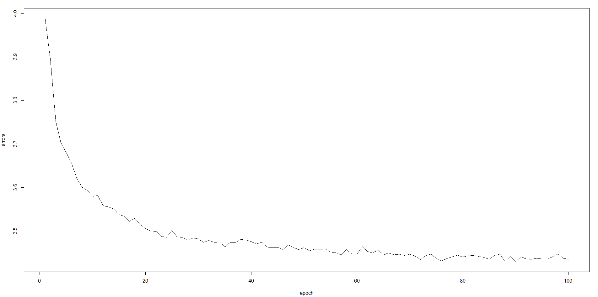

现在模型准备好了，我们可以用它来测试网络。但是首先，我们需要创建一些测试数据:

```
A1=int2bin(sample(0:127, 7000, replace=TRUE))
A2=int2bin(sample(0:127, 7000, replace=TRUE))
A=array( c(A1,A2), dim=c(dim(A1),2) )
```

现在，让我们对新数据进行预测:

```
B=predictr(model, A[,dim(A)[2]:1,] ) 
B=B[,dim(B)[2]:1]
```

转换回整数:

```
A1=bin2int(A1)
A2=bin2int(A2)
B=bin2int(B)
```

最后，将差异绘制成直方图:

```
hist( B-(A1+A2) )
```

误差直方图如下所示:

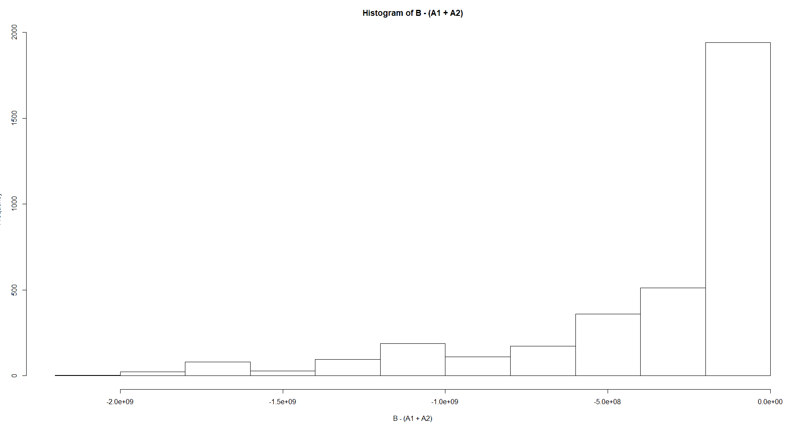

正如这里可以看到的，频率较高的箱接近零，表明在大多数情况下，预测值与当前值一致。所有其他箱都与误差相关。因此，我们可以说网络以良好的性能模拟了系统。

<title>LSTM model</title>  

# LSTM 模型

我们已经看到，RNNs 有一个存储器，它使用持久的先前信息，用于当前的神经网络处理。先前的信息用于当前任务。然而，记忆是短期的，我们没有一个神经节点所有可用的先前信息的列表。

当我们将长期记忆引入 RNN 时，我们能够记住大量先前的信息，并将其用于当前的处理。这个概念被称为 RNN 的 LSTM 模型，它在视频、音频、文本预测和各种其他应用程序中有许多用例。

LSTMs 是由 Hochreiter & Schmidhuber 在 1997 年提出的。

使用 **BPTT** 训练 LSTM 网络，并减少消失梯度问题。LSTMs 在时间序列预测中具有强大的应用，并且可以创建大型的递归网络来解决机器学习中的困难序列问题。

LSTM 有**门**，使得长期/短期记忆成为可能。这些包含在通过层连接的存储器块中:

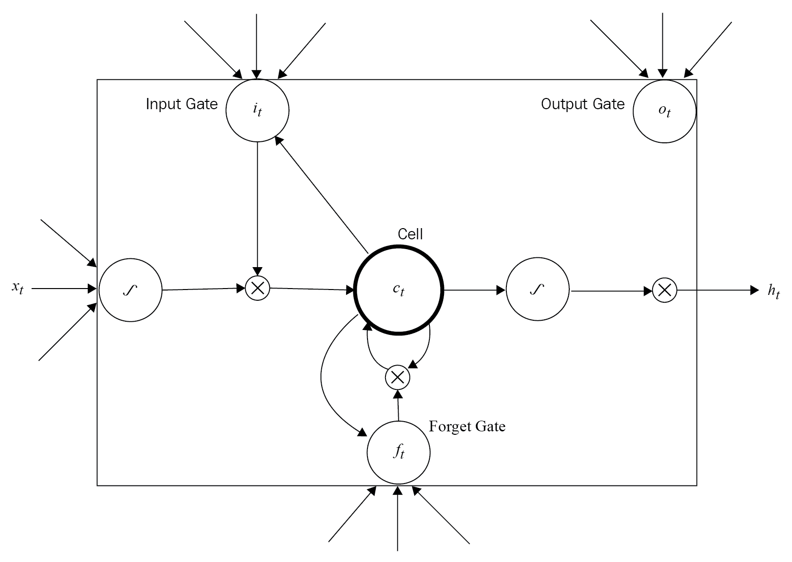

一个单元内有三种类型的门:

*   **输入门:**缩放输入到单元(写入)
*   **输出门**:将输出缩放至单元格(读取)
*   **忘记门**:缩放旧单元值(复位)

每个门就像一个控制读/写的开关，从而将长期记忆功能纳入了 LSTM 模型。

LSTMs 可用于解决以下序列预测问题:

*   直接序列预测
*   序列分类
*   序列生成
*   序列间预测

GRU 和 LSTM 的主要区别在于:

*   GRU 有两个门，而 LSTM 有三个门。
*   GRUs 没有任何不同于暴露隐藏状态的内部记忆。它们没有 LSTMs 中的输出门。
*   计算 GRU 中的输出时，没有应用二次非线性。

<title>Convolutional Neural Networks</title>  

# 卷积神经网络

深度学习中另一组重要的神经网络是 CNN。它们是专门为图像识别和分类而设计的。CNN 有多层神经网络，从图像中提取信息，并确定它们所属的类别。

例如，如果 CNN 使用一组猫的图像进行训练，它可以检测出图像是否是猫。在这一节中，我们将看到 CNN 的架构和工作方式。

对于一个程序来说，任何图像都只是一组矢量格式的 RGB 数字。如果我们能让一个神经网络理解模式，它就能组成一个 CNN 并检测图像。

常规神经网络是通用的数学逼近器，它接受输入，通过一系列函数对其进行转换，并导出输出。然而，这些常规神经网络不能很好地适应图像分析。对于 32 x 32 像素的 RGB 图像，隐藏层的权重为 *32*32*3=3072* 。常规的神经网络在这种情况下工作良好。但是，当 RGB 图像缩放到大小为 *200 x 200* 像素时，隐藏层中所需的权重数为*200 * 200 * 3 = 120000*，网络表现不佳。

进入 CNN 解决这个扩展性问题。在 CNN 中，一个 CNN 的层有三维排列的神经元(**高**、**宽**、**深**)。

下图显示了神经网络和 CNN:

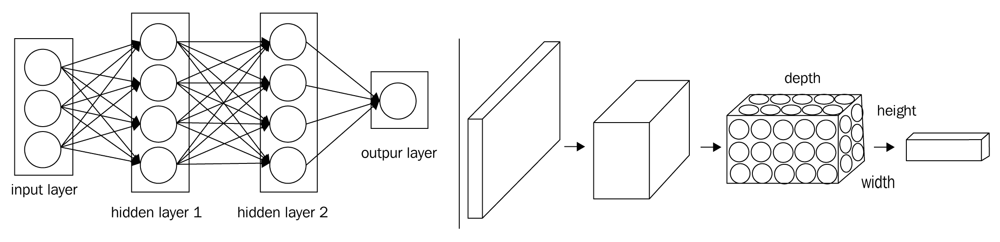

CNN 是一系列神经网络层，其中每一层通过可微分函数将一个激活量转换为另一个激活量。构建 CNN 有三种类型的层:

*   卷积层
*   汇集层
*   全连接层

<title>Step #1 – filtering</title>  

# 步骤# 1–过滤

卷积层执行繁重的数学运算。在计算机视觉中，处理图像的一种典型方法是用过滤器对其进行卷积，以仅提取其中的显著特征。这是 CNN 的第一次行动。输入图像被应用过滤逻辑以创建**激活图**或**特征图**:

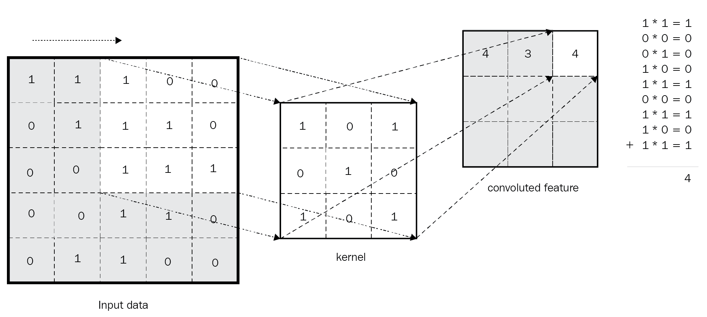

通过在图像的每个 3×3 向量上应用核向量来创建回旋特征向量。

过滤的数学步骤如下:

1.  对齐特征和图像补片。
2.  将每个图像像素乘以相应的特征像素。
3.  把它们加起来。
4.  将每个总和除以特征中的像素总数。

过滤完成后，下一步是压缩过滤后的像素。

<title>Step #2 – pooling</title>  

# 第 2 步–汇集

在这一步中，我们收缩图像堆栈。对于在卷积步骤中获得的每个特征，我们建立一个矩阵，现在在每个选择的矩阵中找到最大值，以缩小整个输入。这些步骤如下:

1.  选择一个窗口大小(通常为 2 或 3)。
2.  选择一个步幅移动的像素范围(通常为 2)。
3.  在过滤后的图像上滑动窗口。
4.  对于每个窗口，我们取最大值。

如果滑动窗口不像在先前的窗口中那样具有所需数量的单元，我们采用任何可用的值。

<title>Step #3 – ReLU for normalization</title>  

# 第 3 步–ReLU 进行标准化

在这一步中，我们获取每个像素的池输出和，并应用 ReLU 规范化来调整这些值。如果任何一个值是负的，我们让它为零。

<title>Step #4 – voting and classification in the fully connected layer</title>  

# 步骤# 4–全连接层中的投票和分类

最后一层是全连接层，通过一组值进行投票来确定输出的类别。完全连接的层只是所有先前输出的合并矩阵。

这是最后一层，输出是根据投票最高的类别决定的。

通过堆叠步骤 1、2 和 3 中的层，我们形成卷积网络，它可以通过反向传播减少误差项，从而给出最佳预测。

这些层可以重复多次，并且每个层的输出形成下一层的输入。

一个经典的 CNN 架构应该是这样的:

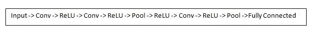

下图显示了一个使用 CNN 的分类预测示例:

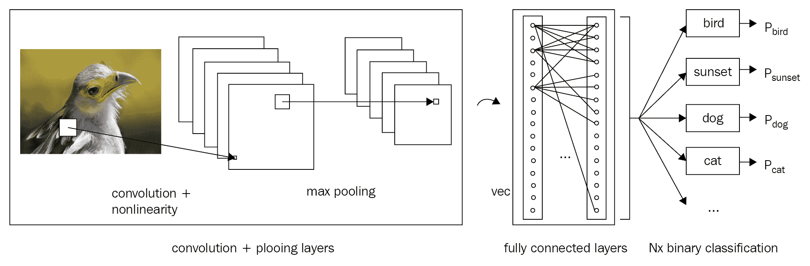

我们将在[第 7 章](e3bdb377-05bc-40d2-87ed-6085861eca56.xhtml)、*神经网络用例-高级主题*中看到使用 R 的 CNN 实现。

<title>Common CNN architecture - LeNet</title>  

# 通用 CNN 架构- LeNet

LeNet-5 是 Le Cun 在 20 世纪 90 年代设计的用于手写和机器印刷字符识别的卷积网络。
这是卷积网络的首次成功应用。它具有以下架构:

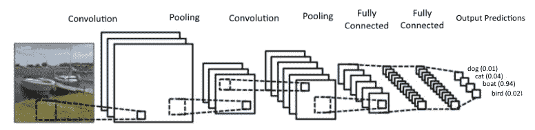<title>Humidity forecast using RNN</title>  

# 利用 RNN 进行湿度预报

作为 RNNs 的第一个用例，我们看到如何使用`trainr()`函数*来训练和预测 RNN。*我们的目的是预测某个位置一天的湿度。输入文件包含来自多个澳大利亚气象站的每日天气观测。这些观测数据是从澳大利亚联邦气象局获得的，随后经过处理以创建一个相对较大的样本数据集，用于使用 R 和 rattle.data 包说明分析、数据挖掘和数据科学。`weatherAUS`数据集定期更新，并且该包的更新通常对应于该数据集的更新。数据是从气象局网站更新的。`locationsAUS`数据集记录了每个气象站的位置。源数据集版权归澳大利亚联邦气象局所有，经许可使用。

该数据集的 CSV 版本可从以下链接获得:
[https://rattle.togaware.com/weatherAUS.csv](https://rattle.togaware.com/weatherAUS.csv)

`weatherAUS`数据集是一个数据帧，包含来自超过 45 个澳大利亚气象站的超过 140，000 条每日观测数据。该数据集包含以下变量:

*   `Date`:观察日期(一个`Date`对象)。
*   `Location`:气象站所在地的俗称。
*   `MinTemp`:以摄氏度为单位的最低温度。
*   `MaxTemp`:最高温度，单位为摄氏度。
*   `Rainfall`:当天记录的降雨量，单位为毫米
*   `Evaporation`:所谓 a 级蒸发皿蒸发量(毫米)在 24 小时至 9 点之间
*   `Sunshine`:一天中日照充足的小时数。
*   `WindGustDir`:24 小时至午夜最强阵风的方向。
*   `WindGustSpeed`:24 小时至午夜最强阵风的速度(km/h)。
*   `Temp9am`:上午 9 点的温度(摄氏度)
*   `RelHumid9am`:上午 9 点的相对湿度(百分比)
*   上午 9 点，天空中被云遮住的部分。这是用奥克塔来衡量的，奥克塔是八分之一的单位。它记录了八分之几的天空被云遮住。零表示天空完全晴朗，而 8 表示天气完全阴沉。
*   `WindSpeed9am`:上午 9 点前 10 分钟的平均风速(公里/小时)6 `weatherAUS`。
*   `Pressure9am`:上午 9 时，大气压力降至平均海平面
*   `Temp3pm`:下午 3 点的温度(摄氏度)
*   `RelHumid3pm`:下午 3 点的相对湿度(百分比)
*   下午 3 点被云遮住的天空比例(单位:八分之一)
*   下午 3 点前 10 分钟的平均风速(公里/小时)
*   `Pressure3pm`:下午 3 时气压降至平均海平面
*   `ChangeTemp`:温度变化。
*   `ChangeTempDir`:温度变化方向。
*   `ChangeTempMag`:温度变化幅度。
*   `ChangeWindDirect`:风向改变。
*   `MaxWindPeriod`:最大风期。
*   `RainToday`:截止到上午 9 点的 24 小时内降雨量(mm)超过 1 mm 时为整数 1，否则为 0。
*   `TempRange`:截至上午 9 点的 24 小时内最低温度和最高温度之差(℃)
*   `PressureChange`:压力变化。
*   `RISK_MM`:降雨量。一种衡量风险的方法。
*   `RainTomorrow`:目标变量。明天会下雨吗？

在我们的例子中，我们将只使用其中的两个变量:

*   `Date`:观察日期(一个`Date`对象)
*   `RelHumid9am`:上午 9 时的相对湿度(百分比)

如前所述，本例的目的是预测某个位置一天的湿度。以下是我们将在本例中使用的代码:

```
##########################################################
### Chapter 6 - Introduction to RNNs - using R  ##########
########## Humidity forecasting with RNNs#################
##########################################################
 library("rattle.data")
library("rnn")

data(weatherAUS)
View(weatherAUS)

#extract only 1 and 14 clumn and first 3040 rows (Albury location)
data=weatherAUS[1:3040,c(1,14)]
summary(data)

data_cleaned <- na.omit(data) 
data_used=data_cleaned[1:3000]

x=data_cleaned[,1]
y=data_cleaned[,2]

head(x)
head(y)

X=matrix(x, nrow = 30)
Y=matrix(y, nrow = 30)

# Standardize in the interval 0 - 1
Yscaled = (Y - min(Y)) / (max(Y) - min(Y))
Y=t(Yscaled)

train=1:70
test=71:100

model <- trainr(Y = Y[train,],
 X = Y[train,],
 learningrate = 0.05,
 hidden_dim = 16,
 numepochs = 1000)

plot(colMeans(model$error),type='l',xlab='epoch',ylab='errors')

Yp <- predictr(model, Y[test,])

plot(as.vector(t(Y[test,])), col = 'red', type='l', 
 main = "Actual vs Predicted Humidity: testing set", 
 ylab = "Y,Yp")
lines(as.vector(t(Yp)), type = 'l', col = 'black')
legend("bottomright", c("Predicted", "Actual"), 
 col = c("red","black"), 
 lty = c(1,1), lwd = c(1,1))

############################################################
```

我们开始逐行分析代码，详细解释用于捕获结果的所有特性:

```
library("rattle.data")
library("rnn")
```

初始代码的前两行用于加载运行分析所需的库。

记住，要安装 R 的初始发行版中没有的库，必须使用`install.package`函数。这是安装包的主要功能。它接受一个名称向量和一个目的库，从存储库中下载包并安装它们。这个函数应该只使用一次，而不是每次运行代码时都使用。

`rattle.data`库包含被`rattle`包用作默认例子的数据集。数据集本身可以独立于`rattle`包来说明分析、数据挖掘和数据科学任务。

`rnn`库包含了几个在 R 中实现 RNN 的函数:

```
data(weatherAUS)
View(weatherAUS)
```

使用这个命令，我们上传名为`weatherAUS`的数据集，如上所述，包含在`rattle.data`库中。在第二行中，`view`函数用于调用 dataframe 对象上的电子表格样式的数据查看器，如下图所示:

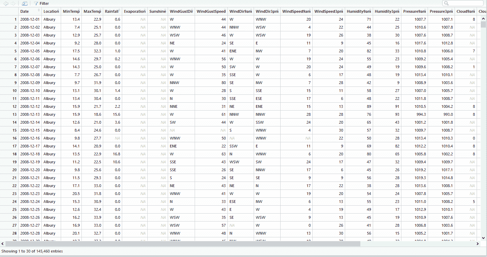

回到代码，和以前一样，我们只使用两个变量。此外，该数据集包含来自澳大利亚不同地点的数据。我们将把研究限制在第一个位置(`Albury`):

```
data=weatherAUS[1:3040,c(1,14)]
```

让我们使用`summary()`功能进行初步的数据分析:

```
> summary(data)
 Date             Humidity9am 
 Min.   :2008-12-01   Min.   : 18.00 
 1st Qu.:2010-12-30   1st Qu.: 61.00 
 Median :2013-04-27   Median : 76.00 
 Mean   :2013-03-22   Mean   : 74.07 
 3rd Qu.:2015-05-27   3rd Qu.: 88.00 
 Max.   :2017-06-25   Max.   :100.00 
 NA's   :9 
```

`summary()`函数返回每个变量的一组统计数据。特别是，突出显示为`Humidity9am`变量提供的结果是有用的；这代表了我们的目标。对于该变量，检测到 9 种缺失值的情况。为了删除丢失的值，我们将使用`na.omit()`函数；它会删除任何缺少值的行，并永远忘记它们:

```
data_cleaned <- na.omit(data) 
data_used=data_cleaned[1:3000]
```

对于第二行代码，我们将分析限制在第一个`3000`观察值。现在我们必须将输入和输出数据设置为`trainr()`功能要求的格式:

```
x=data_cleaned[,1]
y=data_cleaned[,2]
```

这样，`x`将代表我们的输入，`y`将代表我们的目标:

```
X=matrix(x, nrow = 30)
Y=matrix(y, nrow = 30)
```

通过这段代码，我们用可用的数据构建了一个由`30`行和`100`列组成的矩阵。召回是我们将用于模型构建的功能所需的大小设置。我们现在可以对此进行标准化:

```
Yscaled = (Y - min(Y)) / (max(Y) - min(Y))
Y=t(Yscaled)
```

对于本例，我们使用了最小-最大方法(通常称为特征缩放)来获取范围*【0，1】*内的所有缩放数据。其公式如下:

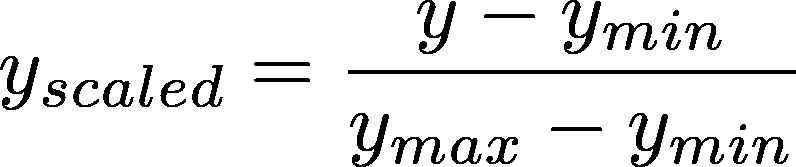

在规范化过程中，我们必须计算每个数据库列的最小值和最大值。然后我们转置得到的矩阵:

```
train=1:70
test=71:100
```

在这几行代码中，数据集被分成了`70:30`，目的是使用我们所掌握的`70`百分比的数据来训练网络，剩余的`30`百分比来测试网络。现在是构建和训练模型的时候了:

```
model <- trainr(Y = Y[train,],
 X = Y[train,],
 learningrate = 0.05,
 hidden_dim = 16,
 numepochs = 1000)
```

`trainr()`功能在 R 环境中训练 RNN。我们已经在隐藏层中使用了`16`神经元，并且历元的数量是`1,000`。`trainr()`功能需要几分钟，因为训练是基于`X`和`Y`进行的。以下是 R 提示符上显示的最后 10 个`Trained epoch`结果:

```
Trained epoch: 990 - Learning rate: 0.05
Epoch error: 0.382192317958489
Trained epoch: 991 - Learning rate: 0.05
Epoch error: 0.376313106021699
Trained epoch: 992 - Learning rate: 0.05
Epoch error: 0.380178990096884
Trained epoch: 993 - Learning rate: 0.05
Epoch error: 0.379260612039631
Trained epoch: 994 - Learning rate: 0.05
Epoch error: 0.380475314573825
Trained epoch: 995 - Learning rate: 0.05
Epoch error: 0.38169633378182
Trained epoch: 996 - Learning rate: 0.05
Epoch error: 0.373951666567461
Trained epoch: 997 - Learning rate: 0.05
Epoch error: 0.374880624458934
Trained epoch: 998 - Learning rate: 0.05
Epoch error: 0.384185799764121
Trained epoch: 999 - Learning rate: 0.05
Epoch error: 0.381408598560978
Trained epoch: 1000 - Learning rate: 0.05
Epoch error: 0.375245688144538
```

我们可以通过绘制算法对后续时期造成的误差来了解算法的演变:

```
plot(colMeans(model$error),type='l',xlab='epoch',ylab='errors')
```

该图显示了**时期**与**误差**:

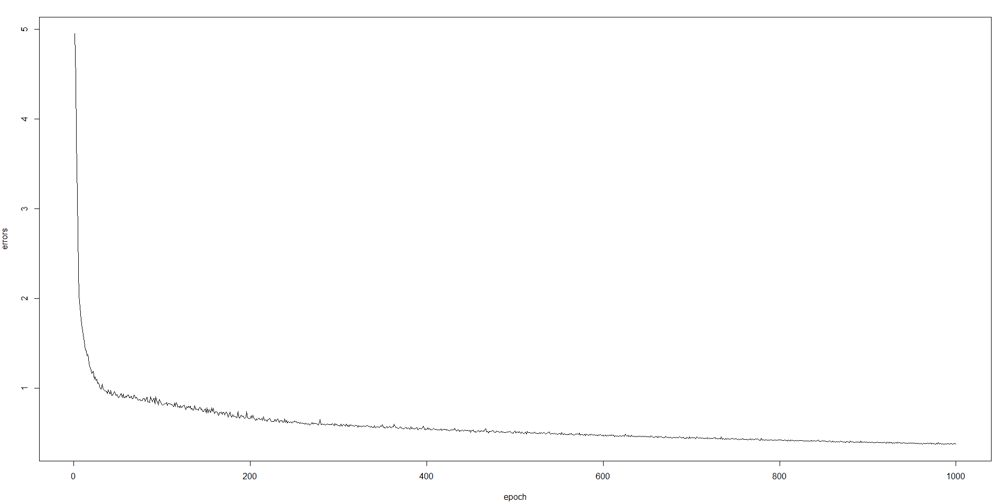

我们终于训练好了网络，可以使用了；现在我们可以用它来做预测。请记住，我们已经留出 30%的可用数据来测试网络。是时候使用它了:

```
Yp <- predictr(model, Y[test,])
```

最后，为了比较结果，让我们绘制一个图表，按顺序显示测试集和预测结果中的水分含量:

```
plot(as.vector(t(Y[test,])), col = 'red', type='l', 
 main = "Actual vs Predicted Humidity: testing set", 
 ylab = "Y,Yp")
lines(as.vector(t(Yp)), type = 'l', col = 'black')
legend("bottomright", c("Predicted", "Actual"), 
 col = c("red","black"), 
 lty = c(1,1), lwd = c(1,1))
```

下图显示了实际值和预测值:

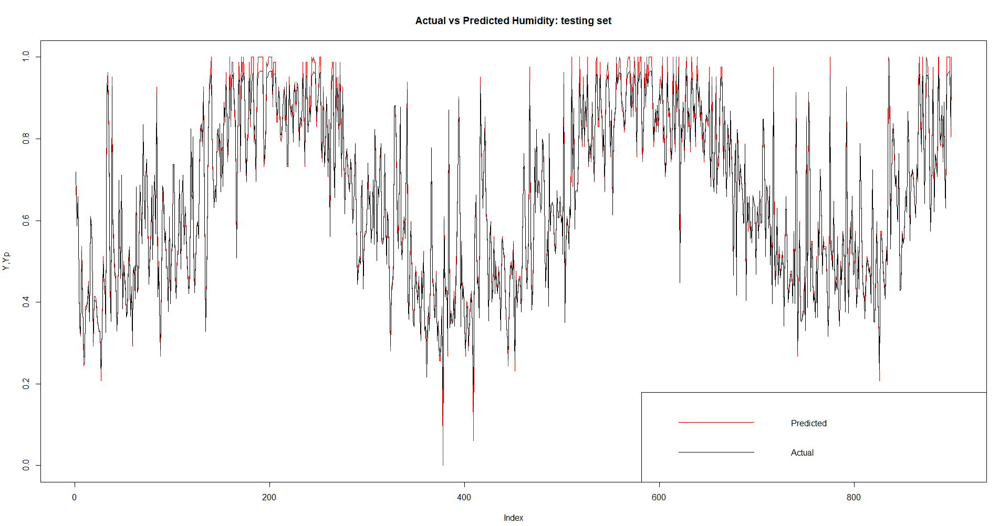

从该图的分析中，可以注意到一件事:该数据适合于良好的近似，以表明该模型能够以良好的性能预测湿度条件。

<title>Summary</title>  

# 摘要

在本章中，我们看到了 rnn 以及如何使用内存进行处理。我们还介绍了 CNN，它是主要用于图像识别的标准化神经网络。对于 RNNs，我们研究了 r 中的一些示例实现。

我们学习了如何训练、测试和评估 RNN。我们还学习了如何在 R 环境中可视化 RNN 模型。我们发现了 LSTM 模型。我们介绍了 CNN 的概念和一个通用的 CNN 架构:LeNet。

在下一章中，我们将看到更多涉及神经网络和深度学习的 R 实现的用例。