# 神经网络的用例——高级主题

借助**人工神经网络** ( **ANN** )，让我们尝试模拟典型的大脑活动，比如图像感知、模式识别、语言理解、感觉-运动协调等等。ANN 模型由节点系统组成，相当于人脑的神经元，这些节点通过加权链接相互连接，相当于神经元之间的突触。从链路权重到收敛，网络的输出被迭代地修改。

这最后一章介绍了不同用例的人工神经网络应用，以及神经网络如何在人工智能世界中使用。我们将在 r 中看到一些用例及其实现。您可以将相同的一组程序用于其他真实的工作场景。

将涵盖以下主题:

*   带 R 的TensorFlow积分
*   Keras 与 R 集成
*   使用带有`H2O`的`MNIST`数据集进行手写数字识别
*   用 mxnet 构建 LSTM
*   使用带有`H2O`的自编码器对数据进行聚类
*   **主成分分析** ( **PCA** )使用`H2O`
*   使用`darch`包进行乳腺癌检测

到本章结束时，你将理解学习过程的高级概念以及它们在 R 环境中的实现。我们将应用不同类型的算法来实现神经网络。我们将回顾如何训练、测试和部署模型。我们将再次研究如何执行正确的估价程序。我们还将在我们的用例中涵盖更多深度学习，因为深度学习是基于高级神经网络的最新事物。


# 带 R 的TensorFlow积分

TensorFlow 是 Google 为机器智能提供的开源数值计算库。它隐藏了构建深度学习模型所需的所有编程，并为开发人员提供了编程的黑盒界面。TensorFlow 的 Keras API 为神经网络提供了一个高级接口。

Python 是深度学习事实上的编程语言，但 R 正在迎头赶上。深度学习库现在可以与 R 一起使用，开发人员可以很容易地下载 TensorFlow 或 Keras，类似于其他 R 库并使用它们。

在 TensorFlow 中，图中的节点表示数学运算，而图边表示它们之间通信的多维数据数组(tensors)。TensorFlow 最初是由谷歌机器智能研究内部的谷歌大脑团队开发的，用于机器学习和深度神经网络研究，但它现在可以在公共领域使用。适当配置后，TensorFlow 会利用 GPU 处理。

TensorFlow 的一般用例如下:

*   图像识别
*   计算机视觉
*   语音/声音识别
*   时间序列分析
*   语言检测
*   语言翻译
*   基于文本的处理
*   **手写识别** ( **HWR** )
*   许多其他人

在本节中，我们将了解如何将 TensorFlow 库引入 r。这将为在 r 中使用 TensorFlow 进行深度学习提供大量可能性。为了使用 TensorFlow，我们必须首先安装 Python。如果您的机器上没有安装 Python，那么是时候安装了。

Python 是一种动态的**面向对象编程** ( **OOP** )语言，可用于多种类型的软件开发。它为与其他语言和程序的集成提供了强大的支持，提供了一个大型标准库，并且可以在几天内学会。许多 Python 程序员可以证实生产率的大幅提高，并认为这鼓励了更高质量代码和可维护性的开发。Python 可以在 Windows、Linux/Unix、macOS X、OS/2、Amiga、掌上电脑和诺基亚手机上运行。它也适用于 Java 和。NET 虚拟机。Python 是在 OSI 批准的开源许可证下授权的；它的使用是免费的，包括商业产品。

Python 是由吉多·范·罗苏姆在 20 世纪 90 年代早期在荷兰的 Stichting Mathematisch Centrum 创建的，作为一种叫做 ABC 的语言的继承者。Guido 仍然是 Python 的主要作者，尽管它包含了其他人的许多贡献。

如果您不知道使用哪个版本，有一个(英文)文档可以帮助您选择。原则上，如果你必须从头开始，我们建议选择 Python 3，如果你需要使用可能与 Python 3 不兼容的第三方软件包，我们建议使用 Python 2.7。关于可用版本以及如何安装 Python 的所有信息都在[https://www.python.org/](https://www.python.org/)给出。

在正确安装了我们机器的 Python 版本后，我们还要担心安装 TensorFlow 的问题。我们可以通过以下链接检索所有库信息和操作系统的可用版本:【https://www.tensorflow.org/】T4。

此外，在安装部分，我们可以找到一系列指南，解释如何安装允许我们用 Python 编写应用程序的 TensorFlow 版本。指南适用于以下操作系统:

*   在 Ubuntu 上安装 TensorFlow
*   在 macOS X 上安装 TensorFlow
*   在 Windows 上安装 TensorFlow
*   从源安装TensorFlow

例如，要在 Windows 上安装 Tensorflow，我们必须选择以下类型之一:

*   仅支持 CPU 的 TensorFlow
*   支持 GPU 的 TensorFlow

要安装 TensorFlow，请以管理员权限启动终端。然后在该终端中发出适当的`pip3` install 命令。要安装纯 CPU 版本，请输入以下命令:

```
C:\> pip3 install --upgrade tensorflow
```

一系列代码行将显示在视频上，以便我们了解安装过程的执行情况，如下图所示:


此时，我们可以回到自己喜欢的环境；我指的是 R 开发环境。我们需要安装 TensorFlow 的接口。TensorFlow 的 R 接口允许您使用高级 Keras 和 Estimator APIs 高效地工作，当您需要更多控制时，它提供对核心 TensorFlow API 的完全访问。要将 R 接口安装到 TensorFlow，我们将使用以下步骤。

首先，从起重机上安装`tensorflow` R 组件，如下所示:

```
install.packages("tensorflow")
```

然后，使用 **install_tensorflow()** 函数安装 tensorflow(正确的安装步骤，您必须具有管理员权限):

```
library(tensorflow)
install_tensorflow()
```

我们可以确认安装成功:

```
sess = tf$Session()
hello <- tf$constant('Hello, TensorFlow!')
sess$run(hello)
```

这将为您提供适用于`tensorflow` R 包的 TensorFlow 默认安装。如果您想了解其他安装选项，请继续阅读，包括如果您安装了正确的 CUDA 库，安装一个利用 NVIDIA GPUs 的 TensorFlow 版本。在下面的代码中，我们可以检查安装是否成功:

```
> library(tensorflow)
> sess = tf$Session()
> hello <- tf$constant('Hello, TensorFlow!')
> sess$run(hello)
b'Hello, TensorFlow!'
```


# Keras 与 R 集成

Keras 是一组用 Python 编码的开源神经网络库。它能够在 MxNet、TensorFlow 或 Theano 上运行。在 RStudio 中安装 Keras 的步骤非常简单。下面的代码片段给出了安装步骤，我们可以通过检查`MNIST`数据集的负载来检查 Keras 是否在工作。

默认情况下，RStudio 加载 TensorFlow 的 CPU 版本。一旦加载了 Keras，我们就有了一套强大的深度学习库，R 程序员可以利用它们来执行神经网络和深度学习。要安装 Keras for R，请使用以下代码:

```
install.packages("devtools")
devtools::install_github("rstudio/keras")
```

此时，我们加载`keras`库:

```
library(keras)
```

最后，我们通过加载`MNIST`数据集来检查 keras 是否安装正确:

```
> data=dataset_mnist()
```


# MNIST·HWR 使用 R

手写识别(HWR)是现代技术中非常常用的程序。可以通过光学扫描(**光学字符识别** ( **OCR** ))或智能文字识别从一张纸上离线检测书写文本的图像。或者，可以在线检测笔尖移动(例如，从笔-计算机表面，这是一项通常更容易的任务，因为有更多的线索可用)。从技术上来说，手写识别是计算机接收和解释来自纸质文档、照片、触摸屏和其他设备等来源的手写可理解输入的能力。

HWR 是通过通常需要 OCR 的各种技术来执行的。然而，一个完整的文字识别系统还管理格式，执行正确的字符分割，并找到最合理的单词。

**修改后的国家标准与技术研究院** ( **MNIST** )是一个手写数字的大型数据库。它有一组 70，000 个数据示例。这是 NIST 更大数据集的一个子集。数字具有 28×28 像素的分辨率，并且存储在 70，000 行和 785 列的矩阵中；784 列形成来自 28×28 矩阵的每个像素值，并且一个值是实际数字。数字已经过大小标准化，并在固定大小的图像中居中。

MNIST 集合中的数字图像最初是由 Chris Burges 和 Corinna Cortes 使用包围盒归一化和居中来选择和实验的。Yann LeCun 的版本在一个更大的窗口中使用质心居中。这些数据可以在 Yann LeCun 位于 http://yann.lecun.com/exdb/mnist/的网站上找到。

每个图像都创建为 28x28。以下是来自 MNIST 数据集的 *0-8* 的图像示例:

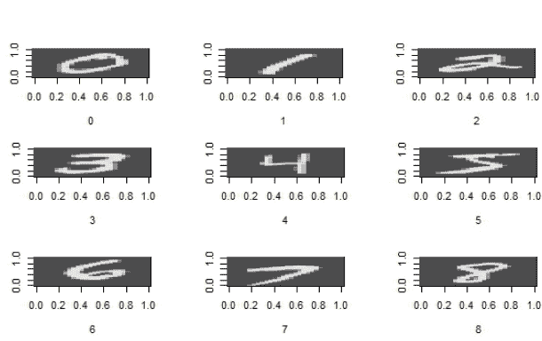

MNIST 有几个手写数字的样本。这个数据集可以作为我们的训练输入到 R 程序中，我们的代码可以识别任何新的手写数字，作为预测数据。这是一个神经网络架构作为人工智能应用的计算机视觉系统的例子。

下表显示了 LeCun 网站上提供的`MNIST`数据集的分布情况:

| **数字** | **计数** |
| *0* | *5923* |
| *1* | *6742* |
| *2* | *5958* |
| *3* | *6131* |
| *4* | *5842* |
| *5* | *5421* |
| *6* | *5918* |
| *7* | *6265* |
| *8* | *5851* |
| *9* | *5949* |

我们不会使用深度学习的`h2o`包来训练和测试`MNIST`数据集。我们将把 70，000 行的数据集分成 60，000 个训练行和 10，000 个测试行。然后，我们会发现模型的准确性。然后，该模型可以用于预测任何包含 0 到 9 之间的数字的 28x28 像素手写数字的传入数据集。最后，我们将文件大小减少到 100 行，用于在两个名为`mnist_train_100.csv`和`mnist_test_10.csv`的`.csv`格式的数据集上进行演示训练处理。

对于我们的示例 R 代码，我们使用一个 100 行的训练数据集和一个 10 行的测试数据集。这里给出了 R 代码:

```
#################################################################
### Chapter 7 - Neural Networks with R - Use cases      #########
### Handwritten digit recognition through MNIST dataset #########
#################################################################

library("h2o")

h2o.init(nthreads=-1,max_mem_size="3G")

setwd ("c://R")

train_mnist=read.csv("mnist_train_100.csv", header=FALSE)
attach(train_mnist)
names(train_mnist)

test_mnist=read.csv("mnist_test_10.csv", header=FALSE)
attach(test_mnist)
names(test_mnist)

m = matrix(unlist(train_mnist[10,-1]), 
 nrow = 28, 
 byrow = TRUE)

image(m,col=grey.colors(255))

rotate = function(x) t(apply(x, 2, rev)) 

image(rotate(m),col=grey.colors(255))

par(mfrow=c(2,3))
lapply(1:6, 
 function(x) image(
 rotate(matrix(unlist(train_mnist[x,-1]),
 nrow = 28, 
 byrow = TRUE)),
 col=grey.colors(255),
 xlab=train_mnist[x,1]
 )
)

par(mfrow=c(1,1))

str(train_mnist)

x=2:785
y=1

table(train_mnist[,y])

model=h2o.deeplearning(x,
 y,
 as.h2o(train_mnist),
 model_id="MNIST_deeplearning",
 seed=405,
 activation="RectifierWithDropout",
 l1=0.00001,
 input_dropout_ratio=0.2,
 classification_stop = -1,
 epochs=2000
 )

summary(model)

h2o.scoreHistory(model)

preds=h2o.performance(model, 
 as.h2o(test_mnist))

newdata = h2o.predict(model, 
 as.h2o(test_mnist))

predictions = cbind(as.data.frame(seq(1,10)),
 test_mnist[,1],
 as.data.frame(newdata[,1]))

names(predictions) = c("Number","Actual","Predicted")

as.matrix(predictions)
#################################################################
```

现在，让我们浏览代码，学习如何应用`h2o`包来解决 HWR 问题。我们已经在[第 3 章](b5f75068-f1e3-465e-969d-a8f1ad48378d.xhtml)、*使用多层神经网络的深度学习*中恰当地介绍了`h2o`包。通过以下代码包含并启动`h2o`:

```
library("h2o")
h2o.init(nthreads=-1,max_mem_size="3G")
```

以下结果显示在 R 提示符下:

```
> h2o.init(nthreads=-1,max_mem_size="3G")
H2O is not running yet, starting it now...
Note: In case of errors look at the following log files:
 C:\Users\lavoro\AppData\Local\Temp\Rtmpiit6zE/h2o_lavoro_started_from_r.out
 C:\Users\lavoro\AppData\Local\Temp\Rtmpiit6zE/h2o_lavoro_started_from_r.err
java version "1.7.0_40"
Java(TM) SE Runtime Environment (build 1.7.0_40-b43)
Java HotSpot(TM) 64-Bit Server VM (build 24.0-b56, mixed mode)
Starting H2O JVM and connecting: ..... Connection successful!
R is connected to the H2O cluster: 
 H2O cluster uptime: 15 seconds 229 milliseconds 
 H2O cluster version: 3.10.5.3 
 H2O cluster version age: 2 months and 18 days 
 H2O cluster name: H2O_started_from_R_lavoro_huu267 
 H2O cluster total nodes: 1 
 H2O cluster total memory: 2.67 GB 
 H2O cluster total cores: 4 
 H2O cluster allowed cores: 4 
 H2O cluster healthy: TRUE 
 H2O Connection ip: localhost 
 H2O Connection port: 54321 
 H2O Connection proxy: NA 
 H2O Internal Security: FALSE 
 R Version: R version 3.4.1 (2017-06-30)
```

使用句柄打开训练文件。为了简化演示工作，它被设置为 100 行。完整的数据集可以从之前建议的 URL 下载。

```
setwd("C://R")
```

该命令设置工作目录，我们将在该目录中插入数据集以供下一次读取。

```
train_mnist=read.csv("mnist_train_100.csv", header=FALSE)
attach(train_mnist)
names(train_mnist)
```

这段代码首先加载`MNIST`的训练数据集，将文件大小减少到 100 行，用于演示训练处理。然后我们使用`attach()`函数将数据库附加到 R 搜索路径上。这意味着在计算一个变量时，R 会搜索数据库，因此只需给出对象的名称就可以访问数据库中的对象。最后，我们使用`names()`函数来设置数据集的名称。我们将对测试阶段使用的数据集做同样的事情:

```
test_mnist=read.csv("mnist_test_10.csv", header=FALSE)
attach(test_mnist)
names(test_mnist)
```

此时，我们通过获取数据集的第十行(包含数字零)来创建一个具有像素颜色值的 28x28 矩阵:

```
m = matrix(unlist(train_mnist[10,-1]),
 + nrow = 28,
 + byrow = TRUE)
```

让我们通过绘制一个对象`image`来看看我们得到了什么:

```
image(m,col=grey.colors(255))
```

下面显示了手写数字的图像:

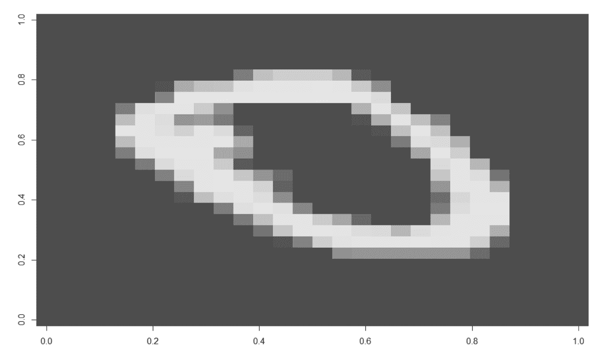

现在让我们创建手写数字的镜像:

```
> rotate = function(x) t(apply(x, 2, rev))
```

然后，查看图像以验证刚刚进行的操作:

```
> image(rotate(m),col=grey.colors(255))
```

下图显示了镜像:

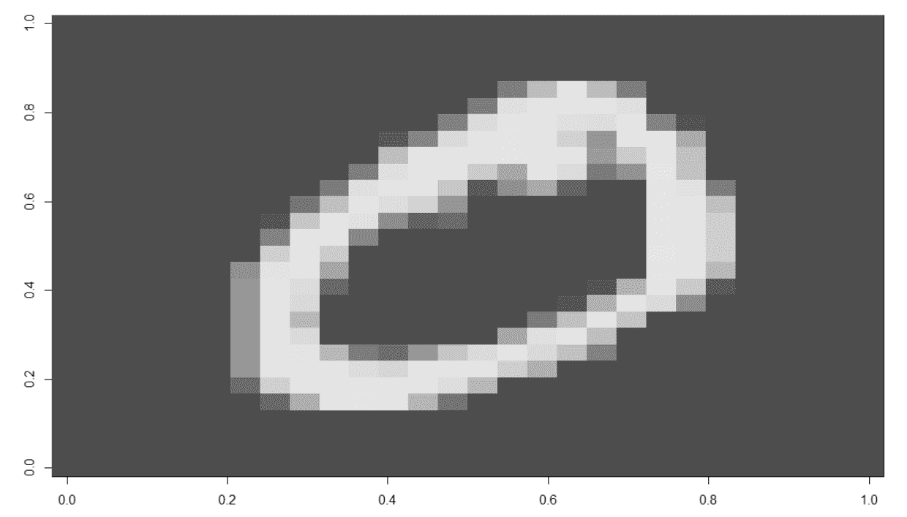

现在，让我们对数据集中的前六行进行同样的操作:

```
par(mfrow=c(2,3))
lapply(1:6,
 function(x) image(
 rotate(matrix(unlist(train_mnist[x,-1]),
 nrow = 28,
 byrow = TRUE)),
 col=grey.colors(255),
 xlab=train_mnist[x,1]
 )
)
```

这些是数据集前六行中包含的手写数字的图像:

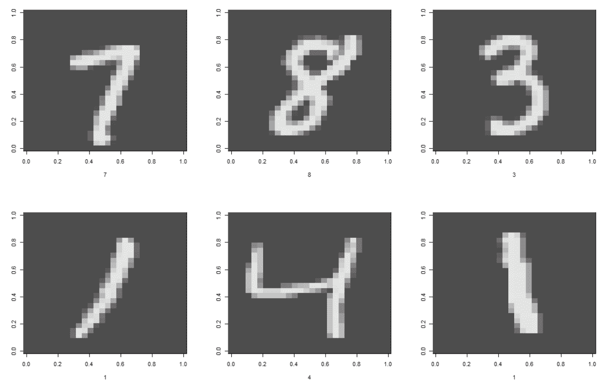

将绘图选项重置为默认值:

```
 par(mfrow=c(1,1)) 
```

下一个命令让我们对训练数据进行一些解释性分析:

```
str(train_mnist)
x=2:785
y=1 
```

该命令查找训练矩阵中每个数字的计数:

```
table(train_mnist[,y]) 
```

结果如下所示:

```
> table(train_mnist[,y])
 0  1  2  3  4  5  6  7  8  9
13 14  6 11 11  5 11 10  8 11
```

上面显示了数据集中每个数字出现的次数。是时候构建和训练模型了:

```
model=h2o.deeplearning(x,
 y,
 as.h2o(train_mnist),
 model_id="MNIST_deeplearning",
 seed=405,
 activation="RectifierWithDropout",
 l1=0.00001,
 input_dropout_ratio=0.2,
 classification_stop = -1,
 epochs=2000
)
```

现在，为了生成`model`拟合函数的结果汇总，我们将使用`summary()`函数:

```
summary(model)
```

下图显示了获得的一些结果:

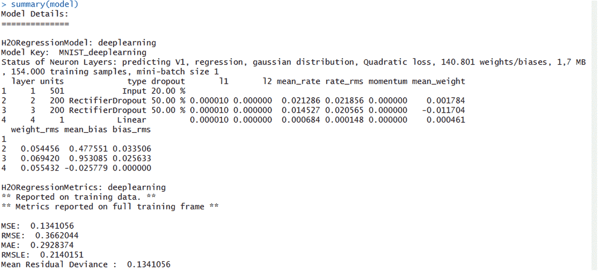

通过检查训练模型的性能，我们可以了解所用算法的演变:

```
preds=h2o.performance(model,
 as.h2o(test_mnist))
```

此时，我们有了一个经过适当训练的`model`，所以我们可以用它来进行预测。在我们的例子中，我们将使用它来识别手写数字:

```
newdata = h2o.predict(model,
 as.h2o(test_mnist))
```

现在我们已经使用了`model`，我们需要格式化实际和预期的矩阵来验证准确性:

```
predictions = cbind(as.data.frame(seq(1,10)),
 test_mnist[,1],
 as.data.frame(newdata[,1]))
```

输入插入矩阵的变量名称:

```
names(predictions) = c("Number","Actual","Predicted")
```

最后，检查输出:

```
as.matrix(predictions)
```

结果如下所示:

```
> as.matrix(predictions)
 Number Actual   Predicted
 [1,]      1      7  6.90180840
 [2,]      2      3  3.62368445
 [3,]      3      1  0.53782891
 [4,]      4      0 -0.03092147
 [5,]      5      6  5.21024129
 [6,]      6      1  0.30850593
 [7,]      7      6  6.44916207
 [8,]      8      9  3.59962551
 [9,]      9      5  3.17590073
[10,]     10      9  7.35213625
```

从对刚刚提出的表格的分析中可以看出，对于测试数据，该模型的预测正确率为 60%(十分之六)。这种准确性仅适用于小的训练数据集。可以通过以下方式进一步改进该模型:

*   增加训练数据集计数
*   调整`h20.deeplearning`功能的参数
*   给`h2o` JVM 分配更多的内存
*   扩展测试数据集


# 使用虹膜数据集的 LSTM

继续在第 6 章、*递归和卷积神经网络*中介绍的 RNN LSTM 架构，我们展示使用`mxnet` LSTM 函数的`iris`数据集处理。该函数期望所有输入和输出都是数字。它对于处理文本序列特别有用，但这里我们将在`iris`数据集上训练一个 LSTM 模型。输入值为`petal.length`、`petal.width`、`sepal.length`和`sepal.width`。输出变量是`Species`，转换成 1 到 3 之间的数值。`iris`数据集已在[第 4 章](0eca6488-d9c4-4e88-99ea-5650a3f3a998.xhtml)、*感知器神经网络建模-基本模型*中详述:

```
#################################################################
### Chapter 7 - Neural Networks with R - Use cases      #########
### Prediction using LSTM on IRIS dataset               #########
#################################################################

##Required one time
library("mxnet")

data(iris)

x = iris[1:5!=5,-5]
y = as.integer(iris$Species)[1:5!=5]

train.x = data.matrix(x)
train.y = y

test.x = data.matrix(iris[1:5==5,-5])
test.y = as.integer(iris$Species)[1:5==5]

model <- mx.mlp(train.x, train.y, hidden_node=10, out_node=3, out_activation="softmax",
 num.round=20, array.batch.size=15, learning.rate=0.07, momentum=0.9,
 eval.metric=mx.metric.accuracy)

preds = predict(model, test.x)
pred.label = max.col(t(preds))

test.y
pred.label
#################################################################
```

程序需要`mxnet`，需要安装。`mxnet` for R 可用于 CPU 和 GPU 以及以下操作系统:Linux、macOS 和 Windows。

我们将只指出 Windows 机器和 CPU 版本的安装过程。有关其他架构的安装程序信息，请参考以下 URL:[https://mxnet.incubator.apache.org/get_started/install.html](https://mxnet.incubator.apache.org/get_started/install.html)。

为了在带有 CPU 处理器的计算机上安装`mxnet`，我们使用预构建的二进制包。我们可以通过下面的代码在 R 控制台上直接安装包:

```
cran <- getOption("repos")
cran["dmlc"] <- "https://s3-us-west-2.amazonaws.com/apache-mxnet/R/CRAN/"
options(repos = cran)
install.packages("mxnet")
```

安装了以下软件包:

```
package ‘bindr’ successfully unpacked and MD5 sums checked
package ‘brew’ successfully unpacked and MD5 sums checked
package ‘assertthat’ successfully unpacked and MD5 sums checked
package ‘bindrcpp’ successfully unpacked and MD5 sums checked
package ‘glue’ successfully unpacked and MD5 sums checked
package ‘pkgconfig’ successfully unpacked and MD5 sums checked
package ‘BH’ successfully unpacked and MD5 sums checked
package ‘plogr’ successfully unpacked and MD5 sums checked
package ‘yaml’ successfully unpacked and MD5 sums checked
package ‘irlba’ successfully unpacked and MD5 sums checked
package ‘hms’ successfully unpacked and MD5 sums checked
package ‘XML’ successfully unpacked and MD5 sums checked
package ‘Rook’ successfully unpacked and MD5 sums checked
package ‘tidyselect’ successfully unpacked and MD5 sums checked
package ‘gridExtra’ successfully unpacked and MD5 sums checked
package ‘dplyr’ successfully unpacked and MD5 sums checked
package ‘downloader’ successfully unpacked and MD5 sums checked
package ‘htmltools’ successfully unpacked and MD5 sums checked
package ‘htmlwidgets’ successfully unpacked and MD5 sums checked
package ‘igraph’ successfully unpacked and MD5 sums checked
package ‘influenceR’ successfully unpacked and MD5 sums checked
package ‘purrr’ successfully unpacked and MD5 sums checked
package ‘readr’ successfully unpacked and MD5 sums checked
package ‘rstudioapi’ successfully unpacked and MD5 sums checked
package ‘rgexf’ successfully unpacked and MD5 sums checked
package ‘tidyr’ successfully unpacked and MD5 sums checked
package ‘viridis’ successfully unpacked and MD5 sums checked
package ‘DiagrammeR’ successfully unpacked and MD5 sums checked
package ‘visNetwork’ successfully unpacked and MD5 sums checked
package ‘data.table’ successfully unpacked and MD5 sums checked
package ‘mxnet’ successfully unpacked and MD5 sums checked
```

正如你所看到的`mxnet`包的安装，安装除了几个包。所以，我们已经有了我们需要的一切。这个`mxnet`库包含了我们将要使用的`mx.lstm`函数:

```
library("mxnet")
```

在下面的代码中，加载了内部数据集`iris`，并且分别用独立变量和目标变量设置了`x`和`y`变量。物种变量被转换为 1 到 3 之间的数字:

```
data(iris)
x = iris[1:5!=5,-5]
y = as.integer(iris$Species)[1:5!=5]
```

只是一个解释，代码如下:

```
x = iris[1:5!=5,-5]
```

我们让 R 从由 150 行和 5 列组成的`iris`数据集中进行选择，只选择第一到第四行，忽略第五行。这个过程也将对 5 的倍数执行，所以最后，我们将从我们的选择中忽略每一个 5 的倍数行。我们也将省略第五列。最后，我们将得到 120 行和 4 列。

我们现在设置输入和输出:

```
train.x = data.matrix(x)
train.y = y
```

然后，我们设置将用于测试的数据帧，只选择我们之前忽略的行:

```
test.x = data.matrix(iris[1:5==5,-5])
test.y = as.integer(iris$Species)[1:5==5]
```

使用输入和输出值调用`mx.lstm`函数，以便使用 RNN 上的 LSTM 和数据集对模型进行训练:

```
model <- mx.mlp(train.x, train.y, hidden_node=10, out_node=3, out_activation="softmax",
 num.round=20, array.batch.size=15, learning.rate=0.07, momentum=0.9,
 eval.metric=mx.metric.accuracy)
```

现在我们可以预测:

```
preds = predict(model, test.x)
pred.label = max.col(t(preds))
```

最后，我们打印结果来比较模型性能:

```
test.y
pred.label
```

结果如下:

```
> test.y
 [1] 1 1 1 1 1 1 1 1 1 1 2 2 2 2 2 2 2 2 2 2 3 3 3 3 3 3 3 3 3 3
> pred.label
 [1] 2 2 2 2 2 2 2 2 2 2 3 3 3 3 3 3 3 3 3 3 3 3 3 3 3 3 3 3 3 3
```

从测试数据和从预报中获得的数据之间的比较中，可以注意到对于杂色物种获得了最好的结果。从获得的结果来看，很明显，该模型需要改进，因为它能够执行的预测与我们在前面的示例中获得的模型中获得的预测不在一个水平上。


# 使用自编码器

我们已经在深度学习章节中看到了用于无监督学习的自编码器。自编码器利用神经网络来执行非线性降维。它们通过使用通用函数逼近器寻找数据中的潜在特征，以更好的方式表示数据。自编码器试图以不同的方式组合或压缩输入数据。

使用 MLP 的示例表示如下所示:

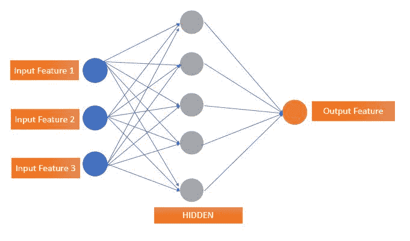

# 使用 H2O 的 PCA

多元统计分析中遇到的最大困难之一是显示具有许多变量的数据集的问题。幸运的是，在包含许多变量的数据集中，一些数据片段通常彼此密切相关。这是因为它们实际上包含相同的信息，因为它们测量的是控制系统行为的相同量。因此，这些都是多余的变量，对我们想要建立的模型没有任何帮助。然后，我们可以通过用包含信息内容的新变量替换一组变量来简化问题。

主成分分析产生一组新的变量，它们之间不相关，称为主成分；每个主成分都是原始变量的线性组合。所有的主成分都是相互正交的，所以没有冗余信息。主成分作为一个整体构成了数据空间的正交基。PCA 的目标是用最少数量的主成分解释最大数量的方差。这是多维标度的一种形式。它是变量到低维空间的线性变换，保留了关于变量的最大量的信息。因此，主成分是线性变换后原始变量的组合。

在下面的例子中，我们使用`h2o`来实现 PCA。`prcomp()`函数用于查找一组输入特征的主成分。这是无监督学习:

```
library(h2o)
h2o.init()

ausPath = system.file("extdata", "australia.csv", package="h2o")
australia.hex = h2o.uploadFile(path = ausPath)
summary(australia.hex)

pca_model=h2o.prcomp(training_frame = australia.hex, 
 k = 8, 
 transform = "STANDARDIZE")

summary(pca_model)
barplot(as.numeric(pca_model@model$importance[2,]),
 main="Pca model", 
 xlab="Pca component",
 ylab="Proportion of Variance")
```

现在，让我们通过代码来了解如何应用`h2o`包来应用 PCA。

我们可以继续加载库:

```
library(h2o)
```

这个命令将库加载到 R 环境中。以下函数启动最大内存大小为`2` GB 的`h2o`引擎和两个并行内核:

```
h2o.init()
```

将返回以下消息:

```
> h2o.init()
 Connection successful!

R is connected to the H2O cluster: 
 H2O cluster uptime: 5 hours 40 minutes 
 H2O cluster version: 3.10.5.3 
 H2O cluster version age: 2 months and 18 days 
 H2O cluster name: H2O_started_from_R_lavoro_huu267 
 H2O cluster total nodes: 1 
 H2O cluster total memory: 2.63 GB 
 H2O cluster total cores: 4 
 H2O cluster allowed cores: 4 
 H2O cluster healthy: TRUE 
 H2O Connection ip: localhost 
 H2O Connection port: 54321 
 H2O Connection proxy: NA 
 H2O Internal Security: FALSE 
 R Version: R version 3.4.1 (2017-06-30) 
```

我们按照 R 提示符上的指示:

```
c1=h2o.init(max_mem_size = "2G", 
 nthreads = 2, 
 ip = "localhost", 
 port = 54321)
```

`h20.init`函数启动`h2o`引擎，最大内存大小为`2` GB，有两个并行内核。以下命令将数据加载到 R 环境中:

```
ausPath = system.file("extdata", "australia.csv", package="h2o")
australia.hex = h2o.uploadFile(path = ausPath)
```

第一条指令生成包含要上传的文件的路径。要将一个文件上传到您的`h2o`实例的本地目录中，使用`h2o.uploadFile()`，除了您的 R 会话之外，它还可以将本地数据上传到您的`h2o`实例。在括号中，指定 R 中的`h2o`引用对象和文件的完整 URL 或规范化文件路径。让我们看看它在里面:

```
summary(australia.hex)
```

现在，让我们打印数据集的简短摘要:

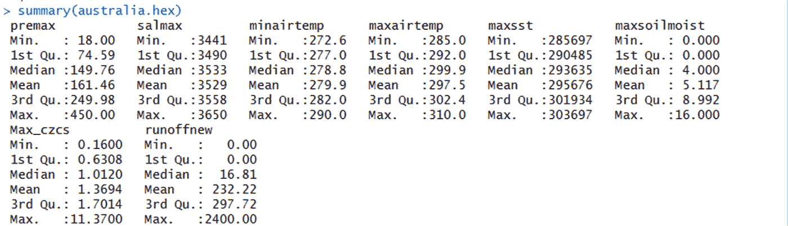

为了对给定的数据集执行 PCA，我们将使用`prcomp()`函数:

```
pca_model=h2o.prcomp(training_frame = australia.hex, 
 k = 8, 
 transform = "STANDARDIZE")
```

现在让我们打印一份模型的简介`summary`:

```
summary(pca_model)
```

在下图中，我们看到了 PCA 模型的摘要:

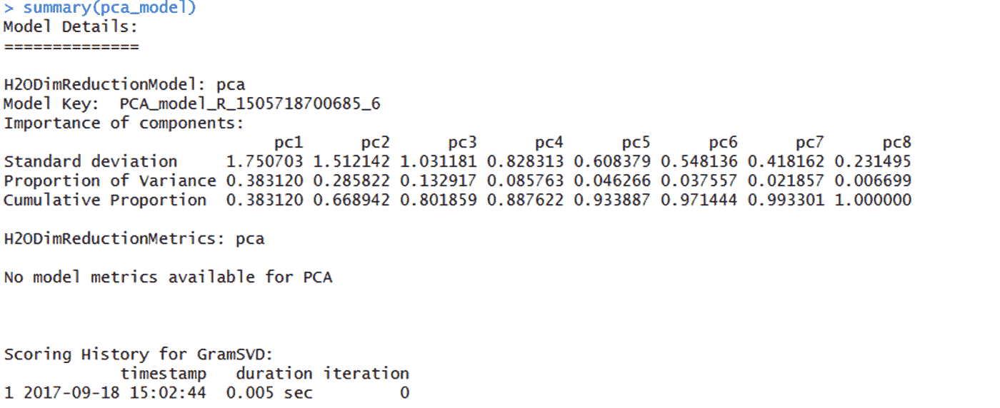

为了更好地理解结果，我们可以做一个由每个主成分解释的百分比可变性的 scree 图。解释的可变性百分比包含在 PCA 模型的模型重要性变量中。

下图显示了由每个主成分解释的可变性百分比的 scree 图:

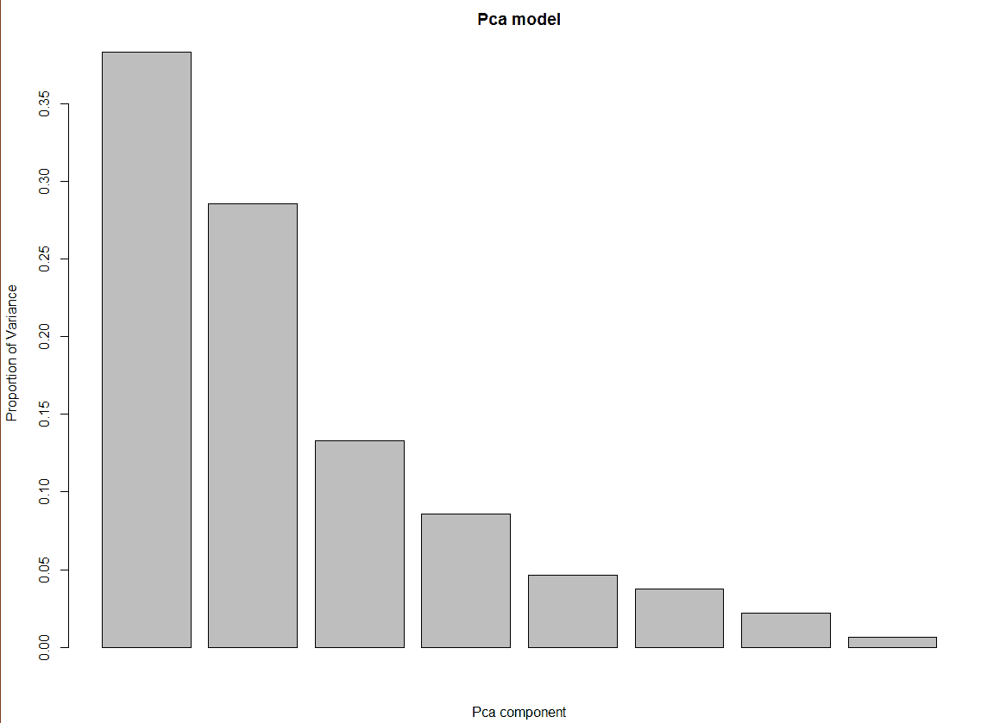

条形图显示了每个主成分的方差比例；正如你所看到的，前两个部分有大约 70%的方差。


# 使用 H2O 的自编码器

自编码器是在没有有效编码控制的情况下用于学习的 ANN。自编码器的目的是学习一组数据的编码，通常是为了减少维数。
在架构上，最简单形式的自编码器是一种非常类似于 MLP 的高级非循环神经网络，具有输入层、输出层以及连接它们的一个或多个隐藏层，但是层输出具有相同数量的输入层节点，用于重建它们的输入。

下面提出了一个在`movie`数据集上使用`h2o`的自编码器的例子。

本例中使用的数据集是取自[https://grouplens.org/datasets/movielens](https://grouplens.org/datasets/movielens)的一组电影和流派。

我们使用 movies.csv 文件，它有三列:

*   `movieId`
*   `title`
*   `genres`

有 164，979 行数据用于聚类。我们将使用`h2o.deeplearning`让`autoencoder`参数修复集群。这个练习的目的是根据类型对电影进行聚类，然后可以用它向用户推荐相似的电影或相同类型的电影。程序使用`h20.deeplearning`，将`autoencoder`参数设置为`T`:

```
#################################################################
### Chapter 7 - Neural Networks with R - Use cases      #########
### Autoencoder using H2O on a movie dataset            #########
#################################################################

library("h2o")

setwd ("c://R")
#Load the training dataset of movies
movies=read.csv ( "movies.csv", header=TRUE)
head(movies)

model=h2o.deeplearning(2:3, 
 training_frame=as.h2o(movies),
 hidden=c(2), 
 autoencoder = T, 
 activation="Tanh")

summary(model)

features=h2o.deepfeatures(model,
 as.h2o(movies),
 layer=1)

d=as.matrix(features[1:10,])
labels=as.vector(movies[1:10,2])
plot(d,pch=17)
text(d,labels,pos=3)
```

现在，让我们看一下代码:

```
library("h2o")
setwd ("c://R")
```

这些命令将库加载到 R 环境中，并设置工作目录，我们将在该目录中插入数据集以供下一次读取。然后我们加载数据:

```
movies=read.csv( "movies.csv", header=TRUE)
```

为了直观显示数据集中包含的数据类型，我们分析这些变量之一的预览:

```
head(movies)
```

下图显示了`movie`数据集的前`20`行:

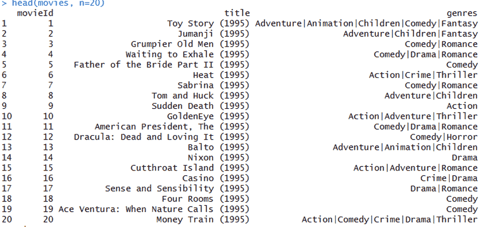

现在我们建立和训练`model`:

```
model=h2o.deeplearning(2:3, 
 training_frame=as.h2o(movies),
 hidden=c(2), 
 autoencoder = T, 
 activation="Tanh")
```

让我们分析一下`model`中包含的一些信息:

```
summary(model)
```

这是从`summary()`函数的结果中摘录的:

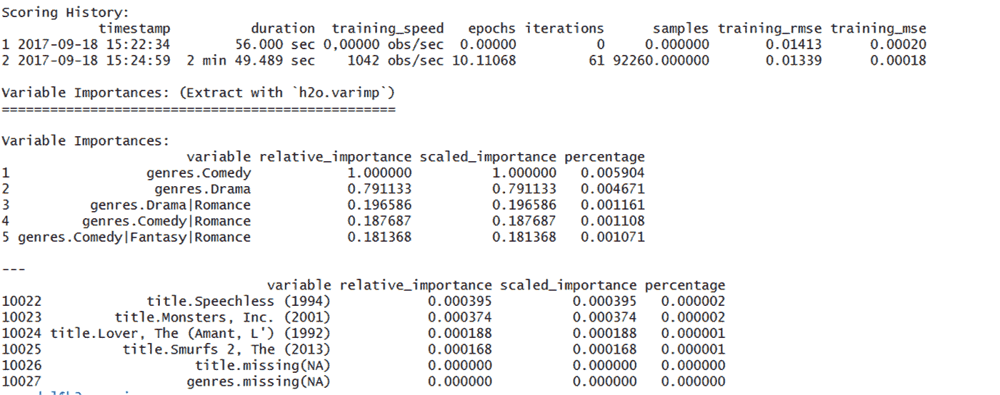

在下一个命令中，我们使用 H2O 深度学习模型，使用`h2o.deepfeatures()`函数从`h2o`数据集中提取非线性特征:

```
features=h2o.deepfeatures(model,
 as.h2o(movies),
 layer=1)
```

在以下代码中，显示了从模型中提取的前六行要素:

```
> features
 DF.L1.C1 DF.L1.C2
1 0.2569208 -0.2837829
2 0.3437048 -0.2670669
3 0.2969089 -0.4235294
4 0.3214868 -0.3093819
5 0.5586608 0.5829145
6 0.2479671 -0.2757966
[9125 rows x 2 columns]
```

最后，我们绘制了一个图表，从中我们可以看到模型是如何根据分析结果对电影进行分组的:

```
d=as.matrix(features[1:10,])
labels=as.vector(movies[1:10,2])
plot(d,pch=17)
text(d,labels,pos=3)
```

一旦聚类完成，接下来显示电影的情节。由于空间问题，我们只设计了 100 部电影。我们可以看到一些电影被放置得很近，这意味着它们属于同一类型。标题基于它们之间的距离、基于流派而被聚类。

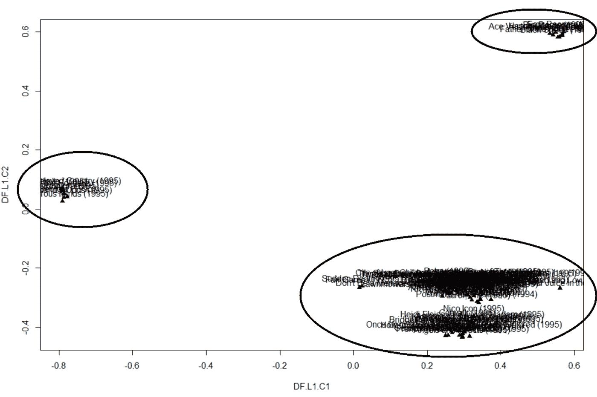

给定大量的标题，无法区分电影名称，但是看起来很清楚的是，模型已经将电影分成了三个不同的组。


# 使用 darch 的乳腺癌检测

在本节中，我们将使用`darch`包，它用于深度架构和**受限玻尔兹曼机** ( **RBM** )。`darch`包是在 G. E .辛顿和 R. R .萨拉胡特迪诺夫的代码基础上构建的(可在**深度信念网** ( **DBN** )的 MATLAB 代码下获得)。这个软件包用于生成多层(深层结构)神经网络，并用作者介绍的方法训练它们。
该方法包括使用对比散度方法进行预训练，以及使用公知的训练算法(如反向传播或共轭梯度)进行微调。此外，监督式微调可以通过 maxout 和 dropout 来增强，这两种最近开发的技术用于改善深度学习的微调。

该示例的基础是基于一组输入的分类。为此，我们将使用名为 BreastCancer.csv 的数据集中包含的数据，我们刚刚在[第 5 章](d3905bda-321c-4496-99dc-391f612240f3.xhtml)、*中使用该数据在 R* 中训练和可视化神经网络。这些数据来自 UCI 机器学习知识库。一旦沃尔伯格博士报告了他的临床病例，数据集就会定期更新。该数据是基于一组十个独立变量的良性或恶性肿瘤分类的乳腺癌患者的数据。

为了获得数据，我们利用了位于 http://archive.ics.uci.edu/ml[的 UCI 机器学习知识库中的大量可用数据。](http://archive.ics.uci.edu/ml)

数据详情如下:

*   实例数量:699(截至 1992 年 7 月 15 日)
*   **属性数量** : 10 加上类属性
*   **属性信息**:类别属性被移动到最后一列

属性的描述如下所示:

```
 #  Attribute                     Domain

   -- -----------------------------------------

   1\. Sample code number            id number

   2\. Clump Thickness               1 - 10

   3\. Uniformity of Cell Size       1 - 10

   4\. Uniformity of Cell Shape      1 - 10

   5\. Marginal Adhesion             1 - 10

   6\. Single Epithelial Cell Size   1 - 10

   7\. Bare Nuclei                   1 - 10

   8\. Bland Chromatin               1 - 10

   9\. Normal Nucleoli               1 - 10

  10\. Mitoses                       1 - 10

  11\. Class:                        (2 for benign, 4 for malignant)

```

为了理解`darch`函数，我们首先设置一个异或门，然后用它进行训练和验证。`darch`函数使用输出数据和输入属性来构建模型，这个模型可以由`darch`自己进行内部测试。在这种情况下，我们实现了 0%的误差和 100%的准确性。

接下来，我们使用乳腺癌数据构建`darch`模型，然后检查其准确性:

```
#####################################################################
####Chapter 7 - Neural Networks with R #########
####Breast Cancer Detection using darch package #########
#####################################################################
library("mlbench")
library("darch")

data(BreastCancer)
summary(BreastCancer)

data_cleaned <- na.omit(BreastCancer) 
summary(data_cleaned)

model <- darch(Class ~ ., data_cleaned,layers = c(10, 10, 1),
 darch.numEpochs = 50, darch.stopClassErr = 0, retainData = T)

plot(model)

predictions <- predict(model, newdata = data_cleaned, type = "class")
cat(paste("Incorrect classifications:", sum(predictions != data_cleaned[,11])))
table(predictions,data_cleaned[,11])

library(gmodels)
CrossTable(x = data_cleaned$Class, y = predictions,
 prop.chisq=FALSE)
```

我们开始逐行分析代码，详细解释用于捕获结果的所有特性:

```
library("mlbench")
library("darch")
```

初始代码的前两行用于加载运行分析所需的库。

记住，要安装 R 初始发行版中没有的库，必须使用`install.package`函数。这是安装包的主要功能。它接受一个名称向量和一个目的库，从存储库中下载包并安装它们。这个函数应该只使用一次，而不是每次运行代码时都使用。

`mlbench`库包含一系列人工和现实世界的机器学习基准问题，例如，包括来自 UCI 知识库的几个数据集。

`darch`库是一个用于深度架构和 RBM 的包:

```
data(BreastCancer)
```

使用这个命令，我们在`mlbench`库中上传名为`BreastCancer`的数据集。让我们看看它在里面:

```
summary(BreastCancer)
```

使用这个命令，我们可以通过使用`summary()`功能看到一个简短的摘要。

请记住，`summary()`函数是一个通用函数，用于生成各种模型拟合函数的结果汇总。该函数调用依赖于第一个参数的类的特定方法。

在这种情况下，函数已应用于数据帧，结果如下图所示:


`summary()`函数返回每个变量的一组统计数据。特别是，突出显示为`Class`变量提供的结果是有用的，该变量包含对癌块的诊断。在这种情况下，检测到了`benign`类的`458`病例和`malignant`类的`241`病例。另一个需要强调的特性是`Bare.nuclei`变量。对于此变量，`16`检测到缺失值的情况。

要删除丢失的值，我们可以使用`na.omit()`功能:

```
data_cleaned <- na.omit(BreastCancer) 
```

现在我们构建并训练模型:

```
model <- darch(Class ~ ., data_cleaned,layers = c(10, 10, 1),
 darch.numEpochs = 50, darch.stopClassErr = 0, retainData = T)
```

为了评估`model`性能，我们可以绘制原始网络误差:

```
plot(model)
```

误差与历元的关系曲线如下图所示:

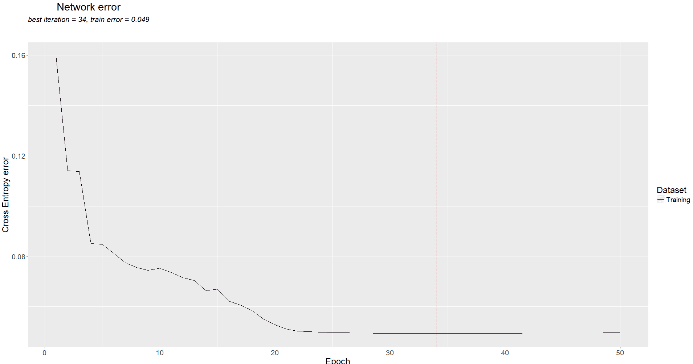

我们在 34 个时期得到最小误差。

我们终于训练好了网络，可以使用了；现在我们可以用它来做预测:

```
predictions <- predict(model, newdata = data_cleaned, type = "class")
```

我们利用我们所掌握的全部数据，通过这个模型进行预测。我们所要做的就是将获得的结果与模型预测和数据集中可用的数据进行比较:

```
cat(paste("Incorrect classifications:", sum(predictions != data_cleaned[,11])))
```

结果如下所示:

```
> cat(paste("Incorrect classifications:", sum(predictions != data_cleaned[,11])))
Incorrect classifications: 2
```

成绩真的很好！只有两个错误的分类！我会说，我们可以满足于他们从`683`观察开始的事实。为了更好地理解错误是什么，我们构建了一个混淆矩阵:

```
table(predictions,data_cleaned[,11])
```

结果如下所示:

```
> table(predictions,data_cleaned[,11])

predictions benign malignant
 benign       443         1
 malignant      1       238
```

虽然以一种简单的方式，矩阵告诉我们，我们只做了两个错误，平均分布在类的两个值之间。关于混淆矩阵的更多信息，我们可以使用`gmodels`包中的`CrossTable()`函数。像往常一样，在加载图书之前，您需要安装它:

```
library(gmodels)
CrossTable(x = data_cleaned$Class, y = predictions,
 prop.chisq=FALSE)
```

使用`CrossTable()`函数得到的混淆矩阵如下图所示:

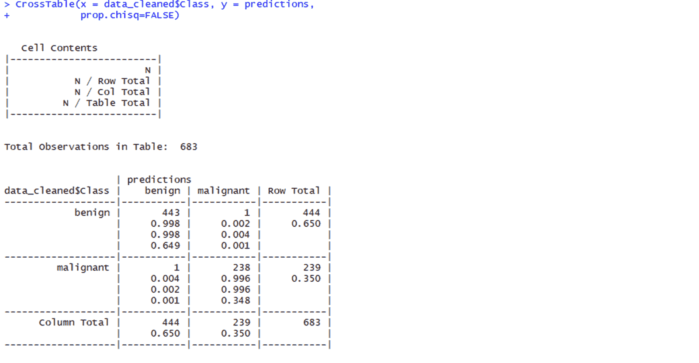

正如我们在分类中所预期的，我们的模型只有两个错误: *FP* 和 *FN* 。然后计算精度；如[第二章](9318274a-72ac-4475-a140-7aaf92253400.xhtml)、*神经网络*中的学习过程所示，由以下公式给出:


让我们计算一下 R 环境下的精度:

```
> Accuracy = (443+238)/683
> Accuracy
[1] 0.9970717
```

如前所述，该分类器取得了很好的效果。


# 摘要

在这最后一章中，我们看到了神经网络和深度学习的一些用例。这应该成为你未来神经网络工作的基础。这种用法在大多数情况下都很常见，在训练和测试过程中，模型所涉及的数据集会发生变化。

我们在本章中看到了以下例子:

*   将 TensorFlow 和 Keras 与 R 集成在一起，这开放了大量使用 R 构建的用例集
*   利用 H2O 通过分类建立数字识别器
*   用 MxNet 理解 LSTM 函数
*   使用 H2O 的 PCA
*   使用 H2O 构建自编码器
*   分类问题使用`darch`

对于全世界的数据科学家来说，r 是一种非常灵活的主要统计编程语言。掌握 R 神经网络将有助于社区进一步发展，并增加 R 在深度学习和更新用例中的使用。