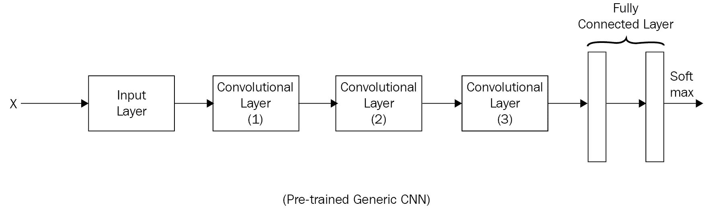
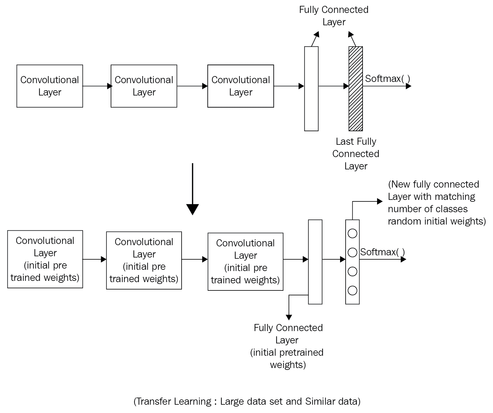
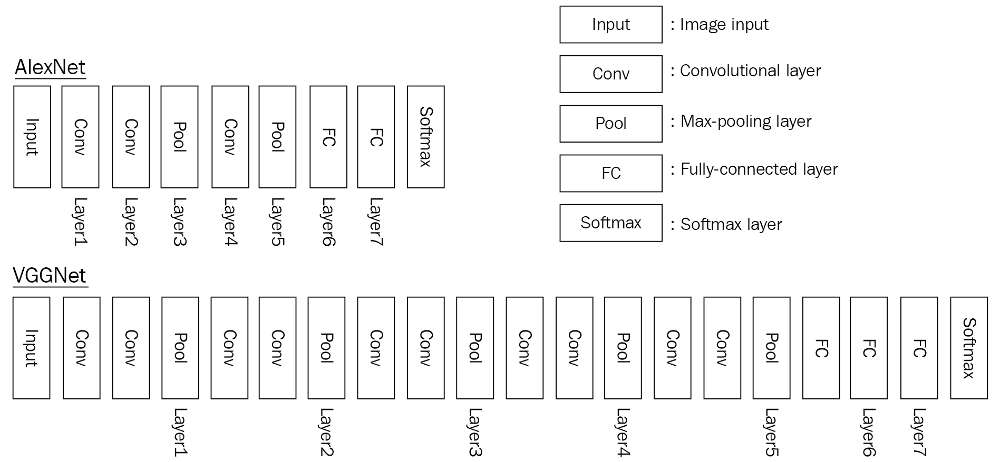

<title>Transfer Learning</title>  

# 迁移学习

在前一章中，我们了解到 CNN 由几层组成。我们还研究了不同的 CNN 架构，调整了不同的超参数，并确定了步幅、窗口大小和填充的值。然后我们选择了一个正确的损失函数，并对其进行优化。我们用大量的图像来训练这个架构。所以，这里的问题是，我们如何在不同的数据集上利用这些知识？不用构建一个 CNN 架构并从头开始训练它，可以通过一种称为**迁移学习**的技术，利用现有的预训练网络并使其适应新的不同数据集。我们可以通过特征提取和微调来做到这一点。

迁移学习是将知识从一个已经训练好的网络复制到一个新的网络来解决类似问题的过程。

在本章中，我们将讨论以下主题:

*   特征提取方法
*   迁移学习示例
*   多任务学习

<title>Feature extraction approach</title>  

# 特征提取方法

在特征提取方法中，我们只训练网络的顶层；网络的其余部分保持固定。当新数据集相对较小并且与原始数据集相似时，可以考虑使用特征提取方法。在这种情况下，从原始数据集学习到的高级特征应该可以很好地转移到新的数据集。

当新数据集很大并且与原始数据集相似时，可以考虑微调方法。更改原始权重应该是安全的，因为网络不太可能过度适应新的大型数据集。

让我们考虑一个预训练的卷积神经网络，如下图所示。利用这一点，我们可以研究如何在不同的情况下运用知识转移:



什么时候应该使用迁移学习？迁移学习可应用于以下情况，具体取决于:

*   新(目标)数据集的大小
*   原始数据集和目标数据集之间的相似性

有四种主要的使用情形:

*   **案例 1** :新的(目标)数据集很小，与原始训练数据集相似
*   **情况 2** :新的(目标)数据集很小，但与原始训练数据集不同
*   **情况 3** :新的(目标)数据集很大，并且与原始训练数据集相似
*   **情况 4** : 新的(目标)数据集很大，并且不同于原始的训练数据集

现在，让我们在下面几节中详细介绍每种情况。

<title>Target dataset is small and is similar to the original training dataset</title>  

# 目标数据集很小，并且类似于原始训练数据集

如果目标数据集很小并且与原始数据集相似:

*   在这种情况下，将最后一个完全连接的图层替换为与目标数据集的类数量相匹配的新的完全连接的图层
*   用随机权重初始化旧权重
*   训练网络以更新新的全连接层的权重:


迁移学习可以用作避免过度拟合的策略，尤其是在数据集很小的情况下。

<title>Target dataset is small but different from the original training dataset</title>  

# 目标数据集很小，但不同于原始训练数据集

如果目标数据集很小，但与原始数据集的类型不同，例如，原始数据集是狗图像，而新(目标)数据集是花图像，则执行以下操作:

*   对网络的大部分初始层进行切片
*   向剩余的预训练层添加与目标数据集的类数量相匹配的新的完全连接层
*   随机化新的全连接层的权重，并冻结预训练网络的所有权重
*   训练网络以更新新的全连接层的权重

由于数据集很小，过度拟合仍然是一个问题。为了克服这一点，我们将保持原始预训练网络的权重不变，并且仅更新新的全连接层的权重:


仅微调网络的高层部分。这是因为起始层被设计为提取更多的通用特征。通常，卷积神经网络的第一层并不特定于数据集。

<title>Target dataset is large and similar to the original training dataset</title>  

# 目标数据集很大，并且与原始训练数据集相似

这里我们没有过度拟合的问题，因为数据集很大。因此，在这种情况下，我们可以重新训练整个网络:

*   移除最后一个完全连接的图层，并将其替换为与目标数据集中的类数量相匹配的完全连接的图层
*   随机初始化这个新添加的全连接层的权重
*   用预训练的权重初始化其余的权重
*   训练整个网络:

<title>Target dataset is large and different from the original training dataset</title>  

# 目标数据集很大，并且不同于原始训练数据集

如果目标数据集很大并且不同于原始数据集:

*   移除最后一个完全连接的图层，并将其替换为与目标数据集中的类数量相匹配的完全连接的图层
*   使用随机初始化的权重从头开始训练整个网络:


图书馆有 ModelZoo，人们可以在那里分享网络权重。

当数据集很大并且与原始数据集完全不同时，可以考虑从头开始训练。在这种情况下，我们有足够的数据从头开始训练，而不用担心过度拟合。然而，即使在这种情况下，用预先训练的权重初始化整个网络并在新的数据集上对其进行微调也可能是有益的。

<title>Transfer learning example</title>  

# 迁移学习示例

在这个例子中，我们将采用预训练的 VGGNet，并使用迁移学习来训练 CNN 分类器，该分类器在给定狗图像的情况下预测狗的品种。Keras 包含许多预先训练好的模型，以及加载和可视化它们的代码。另一个是花卉数据集，可以在这里下载。狗品种数据集具有 133 个狗品种类别和 8，351 个狗图像。在这里下载犬种数据集，并复制到你的文件夹中。VGGNet 有 16 个卷积层，从头到尾都有池层，还有三个全连接层，后面跟着一个`softmax`函数。其主要目的是展示网络的深度如何提供最佳性能。它来自牛津大学的视觉几何小组 ( **VGG** )。他们性能最好的网络是 VGG16。犬种数据集相对较小，与`imageNet`数据集有一点重叠。因此，我们可以删除卷积层之后的最后一个全连接层，并替换为我们自己的层。卷积层的权重保持不变。输入图像通过卷积层并在第 16 层停止:



VGGNet 架构

我们将使用预训练的 VGG16 网络的瓶颈特征——这样的网络已经从`imageNet`数据集学习了特征。因为`imageNet`数据集已经包含一些狗的图像，所以 VGG16 网络模型已经学习了用于分类的关键特征。类似地，其他预训练的 CNN 架构也可以被认为是解决其他图像分类任务的练习。

在这里下载 VGG16 的`bottleneck_features`，复制到自己的文件夹，加载:

```
bottleneck_features = np.load('bottleneck_features/DogVGG16Data.npz')
train_vgg16 = bottleneck_features['train']
valid_vgg16 = bottleneck_features['valid']
test_vgg16 = bottleneck_features['test']
```

现在定义模型架构:

```
from keras.layers import GlobalAveragePooling2D

model = Sequential()
model.add(GlobalAveragePooling2D(input_shape=(7, 7, 512)))
model.add(Dense(133, activation='softmax'))
model.summary()
Layer (type)                     Output Shape          Param #     Connected to                     
=================================================================================================
globalaveragepooling2d_1 (Global (None, 512)           0           globalaveragepooling2d_input_1[0]
_________________________________________________________________________________________________
dense_2 (Dense)                  (None, 133)           68229       globalaveragepooling2d_1[0][0]   
=================================================================================================
Total params: 68,229
Trainable params: 68,229
Non-trainable params: 0
_________________________________________________________________________________________________
```

编译模型并对其进行训练:

```
model.compile(loss='categorical_crossentropy', optimizer='rmsprop', 
                  metrics=['accuracy'])
from keras.callbacks import ModelCheckpoint 

# train the model
checkpointer = ModelCheckpoint(filepath='dogvgg16.weights.best.hdf5', verbose=1, 
                               save_best_only=True)
model.fit(train_vgg16, train_targets, nb_epoch=20, validation_data=(valid_vgg16, valid_targets), 
          callbacks=[checkpointer], verbose=1, shuffle=True)
```

加载模型并计算测试集的分类精度:

```
# load the weights that yielded the best validation accuracy
model.load_weights('dogvgg16.weights.best.hdf5')
# get index of predicted dog breed for each image in test set
vgg16_predictions = [np.argmax(model.predict(np.expand_dims(feature, axis=0))) 
                     for feature in test_vgg16]

# report test accuracy
test_accuracy = 100*np.sum(np.array(vgg16_predictions)==
                           np.argmax(test_targets, axis=1))/len(vgg16_predictions)
print('\nTest accuracy: %.4f%%' % test_accuracy)
```

<title>Multi-task learning</title>  

# 多任务学习

在多任务学习中，迁移学习恰好是从一个预先训练好的模型同时迁移到多个任务。例如，在自动驾驶汽车中，深度神经网络同时检测交通标志、行人和前面的其他汽车。语音识别也受益于多任务学习。

<title>Summary</title>  

# 摘要

在一些特定情况下，在图像上训练的卷积神经网络架构允许我们在新的网络中重用学习到的特征。基础任务和目标任务越不相似，转移特征的性能优势就越小。令人惊讶的是，在对新数据集进行微调后，用几乎任何数量的层的转移特征初始化卷积神经网络都可以提高泛化性能。