# 基于 CNN 的目标检测和实例分割

到目前为止，在这本书里，我们一直大多使用**卷积神经网络**(**CNN**)进行分类。分类相对于图像中具有最大检测概率的实体，将整个图像分类到一个类别中。但是，如果不是一个而是多个感兴趣的实体，并且我们希望将图像与所有这些实体相关联，该怎么办呢？一种方法是使用标签而不是类，其中这些标签是倒数第二个 Softmax 分类图层的所有类，其概率高于给定阈值。然而，这里的检测概率因实体的大小和位置而变化很大，从下图中，我们实际上可以说，*该模型对所识别的实体就是所声明的实体有多大把握？*如果我们非常确信图像中存在一个实体，比如说一只狗，但是它在图像中的尺度和位置没有它的主人*人*实体那么突出怎么办？因此,*多类标签*是一种有效的方式，但对于这个目的来说不是最好的:


在本章中，我们将讨论以下主题:

*   目标检测和图像分类的区别
*   用于对象检测的传统的非 CNN 方法
*   基于区域的 CNN 及其特点
*   快速 R-CNN
*   更快的 R-CNN
*   屏蔽 R-CNN


# 目标检测和图像分类的区别

我们再举一个例子。您正在观看电影 *101 只斑点狗*，您想知道在该电影的给定电影场景中，您实际上可以数出多少只斑点狗。图像分类最多只能告诉你至少有一只狗或一只达尔马提亚狗(取决于你训练分类器的等级)，但不能告诉你到底有多少只。

基于分类的模型的另一个问题是，它们不能告诉你图像中被识别的实体在哪里。很多时候，这很重要。比方说，你看到邻居家的狗和他(*人*)还有他家的猫在玩。你给它们拍了一张快照，想从那里提取狗的图像，在网上搜索它的品种或类似的狗。这里唯一的问题是搜索整个图像可能不起作用，如果不从图像中识别单个对象，您必须手动执行剪切-提取-搜索任务，如下图所示:

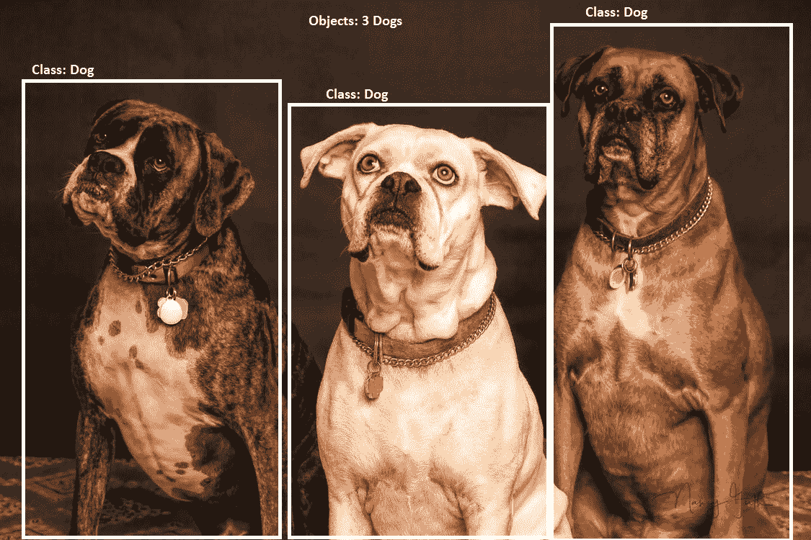

因此，您本质上需要一种技术，不仅能识别图像中的实体，还能告诉您它们在图像中的位置。这就是所谓的**物体检测**。对象检测为您提供图像中识别的所有实体的边界框和类别标签(以及检测概率)。该系统的输出可用于支持多个高级用例，这些用例处理特定类别的检测到的对象。

以脸书、谷歌照片和许多其他类似应用程序中的面部识别功能为例。在这种情况下，在你从一个聚会上拍摄的图像中识别出*是谁之前，你需要检测图像中所有的人脸；然后你就可以把这些脸通过你的人脸识别/分类模块来获取/分类他们的名字。因此，对象检测中的对象命名法不限于语言实体，而是包括任何具有特定边界和足够数据来训练系统的事物，如下图所示:*

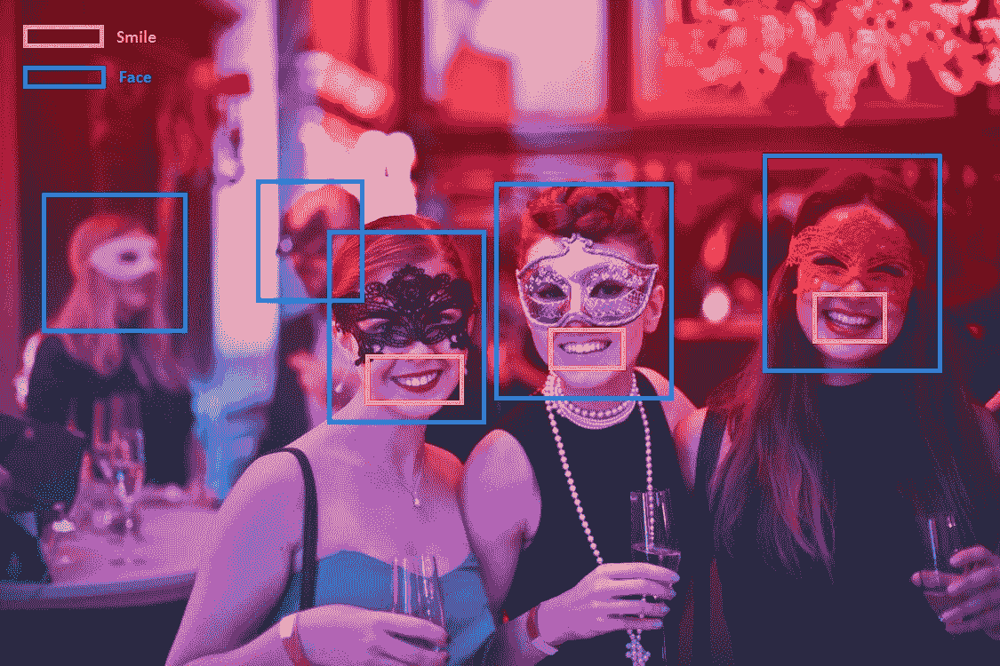

现在，如果你想知道有多少出席你的派对的客人实际上是**在享受**它，你甚至可以运行一个**笑脸**或**微笑探测器**的对象检测。对于大多数可检测的人体部位(眼睛、面部、上身等)、流行的人类表情(如微笑)以及许多其他一般对象，都有非常强大且高效的对象检测器训练模型。所以，下次你在智能手机上使用**微笑快门**(当场景中的大多数人脸被检测到微笑时，自动点击图像的功能)，你就知道是什么驱动了这个功能。


# 为什么物体检测比图像分类更具挑战性？

从我们到目前为止对 CNN 和图像分类的理解，让我们尝试理解我们可以如何处理对象检测问题，并且这应该在逻辑上引导我们发现潜在的复杂性和挑战。为了简单起见，假设我们处理的是单色图像。

任何高水平的物体检测可以被认为是两个任务的组合(我们将在后面反驳这一点):

*   获得正确的边界框(或尽可能多的边界框以便稍后过滤)
*   对该边界框中的对象进行分类(同时返回用于过滤的分类有效性)

因此，对象检测不仅要满足图像分类(第二个目标)的所有挑战，还要面对找到正确的或尽可能多的边界框的新挑战。由于我们已经知道如何使用 CNN 进行图像分类，以及相关的挑战，我们现在可以专注于我们的第一项任务，并探索我们的方法有多有效(分类精度)和高效(计算复杂性)——或者说这项任务将有多具挑战性。

所以，我们从图像中随机生成边界框开始。即使我们不担心生成如此多的候选框的计算负荷，这些候选框在技术上被称为**区域建议**(我们作为对对象进行分类的建议发送的区域)，我们仍然需要一些机制来找到以下参数的最佳值:

*   提取/绘制候选边界框的起始(或中心)坐标
*   候选边界框的长度
*   候选边框的宽度
*   跨越每个轴(水平轴 *x* 和垂直轴 *y* 从一个起点到另一个起点的距离)

假设我们可以生成这样一个算法，它可以给出这些参数的最优值。然而，这些参数的一个值在大多数情况下，或者事实上，在一些一般情况下是否有效？根据我们的经验，我们知道每个对象都有不同的比例，所以我们知道这些盒子的固定值 *L* 和 *W* 是行不通的。此外，我们可以理解，同一个物体，比如说狗，可能会以不同的比例/尺度和位置出现在不同的图像中，就像我们前面的一些例子一样。所以这证实了我们的信念，我们不仅需要不同尺度的盒子，还需要不同大小的盒子。

让我们假设，修正前面的类比，我们想要在图像中每个起始坐标提取 *N* 个候选框，其中 *N* 包含了可能适合我们分类问题的大多数尺寸/比例。虽然这本身似乎是一项相当具有挑战性的工作，但让我们假设我们有这个神奇的数字，并且它远不是一个组合 *L[1，l-image] x W[1，w-image]* (所有组合 *L* 和 *W* ，其中长度是 1 和实际图像长度之间的所有整数的集合，宽度是从 1 到图像的宽度)；这将引导我们找到每个坐标的*长*宽*框:


然后，另一个问题是关于我们需要在我们的图像中访问多少个起始坐标，从那里我们将提取这些 *N* 个框，或者步幅。使用非常大的步幅将使我们提取子图像本身，而不是可以有效分类并用于实现我们早期示例中的一些目标的单个同质对象。相反，太短的步幅(比如，每个方向 1 个像素)可能意味着很多候选框。

从前面的例子中，我们可以理解，即使在假设放松了大多数限制后，我们也远远没有实现一个可以在智能手机中实时检测微笑自拍甚至是笑脸的系统(事实上，即使在一个小时后)。它也不能让我们的机器人和自动驾驶汽车在物体移动时识别它们(并通过避开它们来导航)。这种直觉应该有助于我们理解物体检测领域的进步，以及为什么它是一个如此有影响力的工作领域。


# 传统的非神经网络目标检测方法

OpenCV 和其他一些库迅速包含在智能手机、机器人项目和许多其他项目的软件包中，以提供特定对象(面部、微笑等)的检测功能和类似计算机视觉的好处，尽管在大量采用 CNN 之前就有一些限制。

基于 CNN 的对象检测和实例分割领域的研究为该领域提供了许多进步和性能增强，不仅实现了这些系统的大规模部署，还为许多新的解决方案开辟了道路。但在我们计划进入基于 CNN 的进步之前，最好先了解如何应对前面部分提到的挑战，以使物体检测成为可能(即使有所有限制)，然后我们将合乎逻辑地开始讨论不同的研究人员以及如何应用 CNN 来解决使用传统方法仍然存在的其他问题。


# Haar 特征、级联分类器和 Viola-Jones 算法

与 CNN 或最深度学习不同，后者以其自动生成更高概念特征的能力而闻名，这反过来又大大推动了分类器，在传统机器学习应用的情况下，这些特征需要由 SME 手工制作。

我们也可以从基于 CPU 的机器学习分类器的工作经验中了解到，它们的性能受到数据的高维度和太多功能的可用性的影响，无法应用于模型，特别是一些非常流行和复杂的分类器，如**支持向量机** ( **SVM** )，这些分类器在不久前还被认为是最先进的。

在本节中，我们将了解一些从科学和数学的不同领域中汲取灵感的创新想法，这些想法导致了上述一些挑战的解决方案，从而使非 CNN 系统中的实时对象检测的概念更加充实。


# 哈尔特征

哈尔或类哈尔特征是具有不同像素密度的矩形的形成。Haar 特征对检测区域中特定位置的相邻矩形区域中的像素强度求和。基于不同区域像素亮度总和的差异，他们对图像的不同子部分进行分类。

Haar-like 特征的名称归因于数学术语 Haar 小波，Haar 小波是一系列重新缩放的方形函数，它们一起形成小波族或基。

因为 Haar-like 特征对不同区域的像素强度之间的差异起作用，所以它们对单色图像最有效。这也是为什么前面和本节中使用的图像是单色的，以便更直观。

这些类别可分为以下三大类:

*   两个矩形特征
*   三个矩形特征
*   四个矩形特征

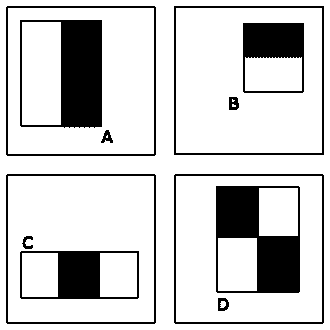

类哈尔特征

通过一些简单的技巧，图像上不同强度的计算变得非常有效，并且可以以非常高的速度实时处理。


# 级联分类器

即使我们可以非常快速地从特定区域提取 Haar 特征，它也不能解决从图像中大量不同的地方提取这种特征的问题；这就是级联功能的概念发挥作用的地方。据观察，只有 1/10，000 的子区域在分类中对人脸是阳性的，但是我们必须提取所有特征并在所有区域中运行整个分类器。此外，观察到通过仅使用一些特征(级联的第一层中的两个)，分类器可以消除非常高比例的区域(级联的第一区域中的 50%)。此外，如果样本仅由这些缩减区域样本组成，那么分类器只需要稍微多一点的特征(级联的第二层中的 10 个特征)就可以剔除更多的情况，等等。因此，我们在层中进行分类，从需要很低计算能力的分类器开始剔除大部分子区域，逐渐增加剩余子集所需的计算负荷，等等。


# 维奥拉-琼斯算法

2001 年，Paul Viola 和 Michael Jones 提出了一个解决方案，可以很好地应对前面的一些挑战，但有一些限制。尽管这是一个有近二十年历史的算法，但迄今为止，或者至少直到最近，一些最受欢迎的计算机视觉软件都用来以某种形式嵌入它。这个事实使得在我们转到基于 CNN 的区域提议方法之前，理解这个非常简单但是强大的算法非常重要。

OpenCV 是最流行的计算机视觉软件库之一，它使用级联分类器作为目标检测的主要模式，而 Haar-featured-like 级联分类器在 OpenCV 中非常流行。许多预训练的 Haar 分类器可用于多种类型的一般对象。

该算法不仅能够以高 **TPRs** ( **真阳性率**)和低 **FPRs** ( **假阳性率**)进行检测，还能够实时工作(每秒至少处理两帧)。

高 TPR 结合低 FPR 是确定算法鲁棒性的非常重要的标准。

他们提出的算法的限制如下:

*   它只能用于检测，而不能识别人脸(他们提出了人脸的算法，尽管同样的算法可以用于许多其他物体)。
*   这些脸必须作为正面视图出现在图像中。无法检测到其他视图。

该算法的核心是 Haar (like)特征和级联分类器。Haar 特性将在后面的小节中介绍。Viola-Jones 算法使用 Haar 特征的子集来确定面部的一般特征，例如:

*   眼睛(由两个矩形特征(水平)确定，眼睛上方的黑色水平矩形形成眉毛，下面是较亮的矩形)
*   鼻子(三矩形特征(垂直)，以鼻子为中心的亮矩形和鼻子两侧的一个暗矩形，形成太阳穴)，等等

然后，这些快速提取的特征可以用于制作分类器来检测(区分)人脸(与非人脸)。

Haar 特征，加上一些技巧，计算起来非常快。

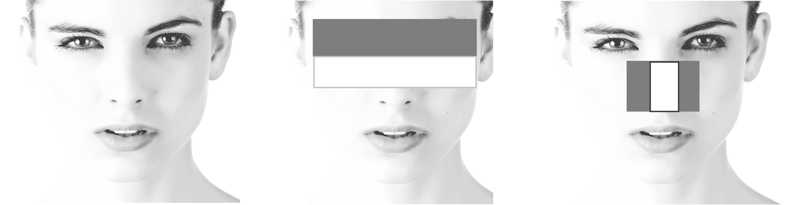

Viola-Jones 算法和 Haar-like 特征检测人脸

这些 Haar-like 特征然后被用在级联分类器中以加速检测问题而不损失检测的鲁棒性。

因此，Haar 特征和级联分类器产生了一些非常健壮、有效和快速的上一代个体对象检测器。但是，为一个新的物体训练这些级联是非常耗时的，而且它们有很多限制，如前所述。这就是基于 CNN 的新一代物体探测器的作用。

在这一章中，我们只讨论了哈尔级联或哈尔特征(在非 CNN 类别中)的基础，因为它们在很长一段时间内一直占主导地位，并且是许多新类型的基础。鼓励读者也探索一些后来更有效的基于 SIFT 和 HOG 的特征/级联(相关论文在*参考文献*部分给出)。


# r-CNN–具有 CNN 特色的地区

在“为什么物体检测比图像分类更具挑战性？”一节中，我们使用了一种非 CNN 方法来绘制区域建议，并使用 CNN 进行分类，我们意识到这种方法效果不好，因为生成并输入 CNN 的区域不是最佳的。R-CNN 或具有 CNN 特征的区域，顾名思义，完全颠倒了这个例子，并使用 CNN 生成特征，这些特征使用一种称为 **SVM** ( **支持向量机**)的(非 CNN)技术进行分类

R-CNN 使用滑动窗口方法(很像我们之前讨论的，使用一些 *L x W* 和 stride)来生成大约 2000 个感兴趣的区域，然后使用 CNN 将它们转换为用于分类的特征。请记住我们在“迁移学习”一章中讨论的内容—可以提取最后一个展平层(在分类或 softmax 层之前),以从基于一般化数据训练的模型中迁移学习，并进一步训练它们(与使用特定于域的数据从头开始训练的具有类似性能的模型相比，通常需要更少的数据)以对特定于域的模型建模。r-CNN 也使用类似的机制来提高其对特定对象检测的有效性:

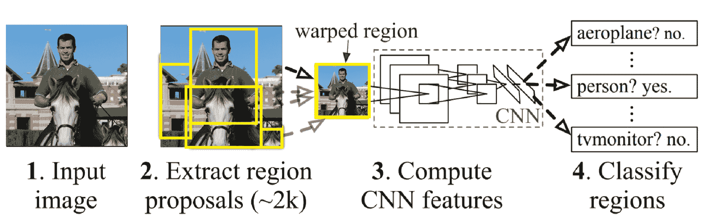

r-CNN–工作

R-CNN 的原始论文声称，在 PASCAL VOC 2012 数据集上，它将**平均精度** ( **mAP** )相对于该数据上以前的最佳结果提高了 30%以上，同时实现了 53.3%的 mAP。

我们在 ImageNet 数据上看到了图像分类练习(使用 CNN)的非常高精度的数字。不要将该图与这里给出的比较统计数据一起使用，因为不仅所使用的数据集不同(因此不具有可比性)，而且手头的任务(分类与目标检测)也非常不同，并且目标检测比图像分类更具挑战性。

PASCAL **VOC** ( **视觉对象挑战**):每个研究领域都需要某种标准化数据集和标准 KPI 来比较不同研究和算法的结果。我们用于图像分类的数据集 Imagenet 不能用作对象检测的标准化数据集，因为对象检测需要(训练、测试和验证集)不仅标记有对象类别，还标记有其位置的数据。ImageNet 不提供这种功能。因此，在大多数对象检测研究中，我们可能会看到使用标准化的对象检测数据集，如 PASCAL VOC。到目前为止，PASCAL VOC 数据集有 4 个变体，VOC2007、VOC2009、VOC2010 和 VOC2012。VOC2012 是其中最新的(也是最丰富的)。

我们遇到的另一个地方是感兴趣区域的不同尺度(和位置)，使用区域的*识别。这就是所谓的**本地化**挑战；在 R-CNN 中，通过使用不同范围的感受野来解决这个问题，从 195×195 像素和 32×32 步长的区域开始，到较小的区域。*

这种方法被称为使用区域的**识别。**

等一下！想起来了吗？我们说过将使用 CNN 从该区域生成要素，但是 CNN 使用恒定大小的输入来生成固定大小的展平图层。我们确实需要固定大小的特征(展平的向量大小)作为支持向量机的输入，但是这里输入区域的大小是变化的。那么这是怎么做到的呢？R-CNN 使用一种叫做**仿射图像扭曲**的流行技术来计算来自每个区域提议的固定大小的 CNN 输入，而不管该区域的形状。

在几何中，仿射变换是仿射空间之间保持点、直线和平面的变换函数的名称。仿射空间是这样的结构，其概括了欧几里得空间的性质，同时仅保留了与平行性和各自尺度相关的性质。

除了我们已经提到的挑战之外，还有一个挑战值得一提。我们在第一步中生成的候选区域(我们在第二步中对其执行分类)不是非常准确，或者它们在所识别的对象周围缺乏紧密的边界。因此，我们在该方法中包括第三阶段，通过运行回归函数(称为**边界框回归器**)来识别分离的边界，从而提高边界框的准确性。

与早期的端到端非 CNN 方法相比，R-CNN 被证明是非常成功的。但是它只使用 CNN 将区域转换成特征。正如我们所理解的，CNN 对于图像分类也非常强大，但是因为我们的 CNN 只对输入区域图像起作用，而不对展平区域特征起作用，所以我们不能在这里直接使用它。在下一节中，我们将看到如何克服这个障碍。

从理解 CNN 在对象检测中的背景使用的角度来看，R-CNN 是非常重要的，因为它是所有非基于 CNN 的方法的巨大飞跃。但是由于基于 CNN 的物体检测的进一步改进，正如我们接下来将讨论的，R-CNN 现在没有被积极地研究，并且代码不再被维护。


# 快速 R-CNN–基于区域的快速 CNN

快速 R-CNN，或快速基于区域的 CNN 方法，是对以前报道的 R-CNN 的改进。准确地说，与 R-CNN 相比，改进的统计数据是:

*   训练速度提高 9 倍
*   评分/服务/测试速度快 213 倍(每张图像处理 0.3 秒)，忽略了花在区域提案上的时间
*   在 PASCAL VOC 2012 数据集上具有 66%的较高 mAP

R-CNN 使用更小的(五层)CNN，而 Fast R-CNN 使用更深的 VGG16 网络，这是其准确性提高的原因。此外，R-CNN 很慢，因为它为每个对象提议执行一个 ConvNet 前向传递，而不共享计算:

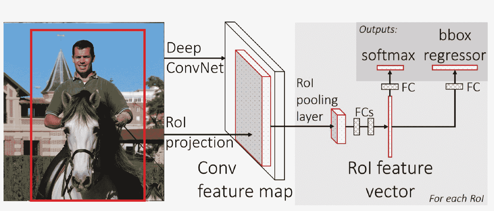

快速 R-CNN:工作

在快速 R-CNN 中，深度 VGG16 CNN 为所有阶段提供基本计算，即:

*   **感兴趣区域** ( **RoI** )计算
*   区域内容的分类对象(或背景)
*   用于增强边界框的回归

在这种情况下，CNN 的输入不是来自图像的原始(候选)区域，而是(完整的)实际图像本身；输出不是最后一个展平的图层，而是之前的卷积(贴图)图层。从如此生成的卷积图中，使用 RoI 汇集层(max-pooling 的变体)来生成对应于每个对象提议的展平的固定长度 RoI，然后使其通过一些**完全连接的** ( **FC** )层。

RoI pooling 是 max pooling(我们在本书最初章节中使用的)的变体，其中输出大小是固定的，输入矩形是一个参数。

RoI pooling 图层使用 max pooling 将任何有效感兴趣区域内的要素转换为具有固定空间范围的小型要素地图。

倒数第二个 FC 层的输出用于以下两个方面:

*   分类(SoftMax 层)具有与对象提议一样多的类，背景+1 个附加类(在该区域中找不到任何类)
*   产生四个数字(两个数字表示该对象框左上角的 x，y 坐标，接下来的两个数字对应于在该区域找到的该对象的高度和宽度)的回归变量集，这四个数字是使该特定对象的边界框精确所需的每个对象建议

快速 R-CNN 取得的结果非常好。更重要的是使用强大的 CNN 网络为我们需要克服的所有三个挑战提供非常有效的功能。但是仍然有一些缺点，还有进一步改进的空间，我们将在下一节更快的 R-CNN 中了解。


# 更快的 R-CNN-更快的地区提案基于网络的 CNN

我们在前面的章节中看到，快速 R-CNN 显著降低了图像评分(测试)所需的时间，但这种降低忽略了生成区域建议所需的时间，这使用了一种单独的机制(尽管从 CNN 的卷积图中提取),并继续证明是一个瓶颈。此外，我们观察到，虽然所有三个挑战都是使用快速 R-CNN 中卷积映射的共同特征解决的，但它们使用的是不同的机制/模型。

更快的 R-CNN 改进了这些缺点，并提出了**区域提议网络** ( **RPNs** )的概念，将每张图像的评分(测试)时间降至 0.2 秒，甚至包括区域提议的时间。

快速 R-CNN 在每张图片 0.3 秒内完成评分(测试)，这也不包括相当于地区提案的流程所需的时间。

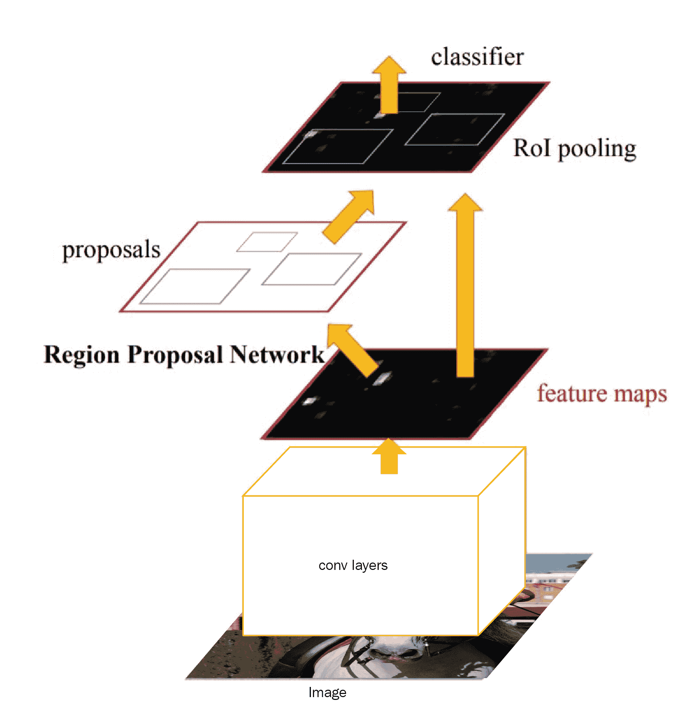

更快的 R-CNN:工作-作为关注机制的区域提议网络

如前图所示，VGG16(或另一种)CNN 直接作用于图像，产生卷积图(类似于 Fast R-CNN 中所做的)。这里的情况有所不同，现在有两个分支，一个馈入 RPN，另一个馈入检测网络。这又是同一个 CNN 预测的扩展，导致一个**完全卷积网络** ( **FCN** )。RPN 充当注意力机制，并且还与检测网络共享全图像卷积特征。此外，由于网络中的所有部分都可以使用高效的基于 GPU 的计算，因此减少了所需的总时间:

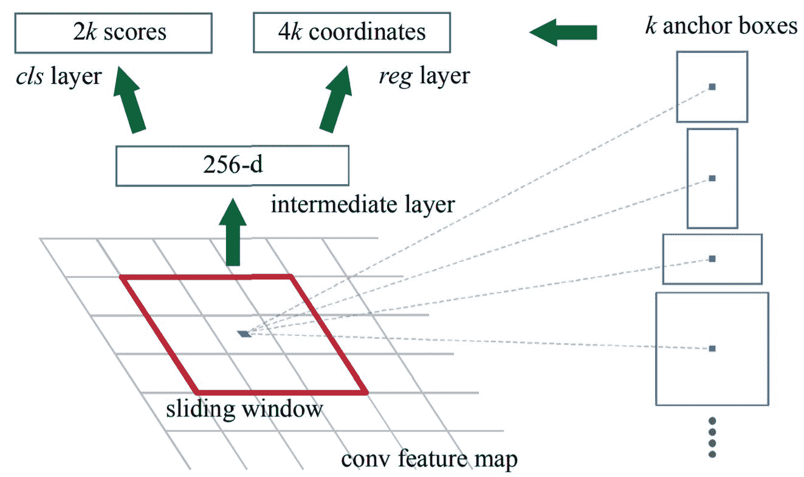

更快的 R-CNN:工作-作为关注机制的区域提议网络

为了更好地理解注意力机制，请参考本书中关于 CNN 注意力机制的章节。

RPN 以滑动窗口机制工作，其中窗口从共享卷积层滑过最后一个卷积图(很像 CNN 滤波器)。对于每一张幻灯片，滑动窗口都会产生*k(k = N[Scale]×N[Size])*数量的锚框(类似于候选框)，其中 *N [Scale]* 是从滑动窗口的中心提取的*N[Size]*Size(纵横比)的框的 *size* 的(金字塔状)数量，很像下图。

RPN 通向平坦的 FC 层。这进而导致两个网络，一个用于预测每个 *k* 盒子的四个数字(确定盒子的坐标、长度和宽度，如在 Fast R-CNN 中)，另一个进入二项式分类模型，确定在该盒子中找到任何给定物体的目标或概率。来自 RPN 的输出引入检测网络，该网络在给定盒子的位置及其对象的情况下，检测 k 个盒子中的每一个中的对象的特定类别。

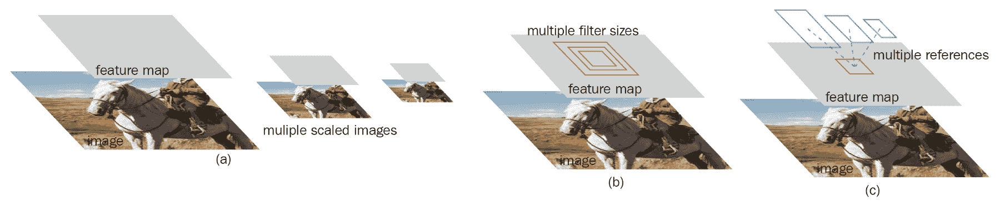

更快的 R-CNN:工作-提取不同的尺度和大小

这种架构中的一个问题是两个网络的训练，即区域提议和检测网络。我们了解到，CNN 是使用跨所有层的反向传播来训练的，同时随着每次迭代减少层的损失。但是由于分成了两个不同的网络，我们一次只能反向传播到一个网络。为了解决这个问题，在保持另一个网络的权重不变的同时，在每个网络中反复进行训练。这有助于快速融合两个网络。

RPN 架构的一个重要特征是，它对于两个函数都具有平移不变性，一个函数产生锚点，另一个函数产生锚点的属性(其坐标和对象)。由于平移不变性，在给定锚图的矢量图的情况下，逆向操作或产生图像的部分是可行的。

由于平移不变性，我们可以在 CNN 中的任一方向上移动，即从图像到(区域)建议，以及从建议到图像的相应部分。


# 屏蔽 R-CNN–CNN 实例分割

更快的 R-CNN 是当今物体探测领域最先进的东西。但是，在物体检测领域有一些问题是快速 R-CNN 无法有效解决的，这就是 Mask R-CNN(快速 R-CNN 的一种发展)可以提供帮助的地方。

本节介绍实例分割的概念，它是本章中描述的标准对象检测问题和语义分割挑战的结合。

在应用于图像的语义分割中，目标是将每个像素分类到一组固定的类别中，而不区分对象实例。

还记得我们在直觉部分计算图片中狗的数量的例子吗？我们能够很容易地数出狗的数量，因为它们相距很远，没有重叠，所以基本上只要数出物体的数量就可以了。现在，以下面的图像为例，使用对象检测来计算西红柿的数量。这将是一项艰巨的任务，因为边界框将有太多的重叠，以至于很难将番茄的实例与框区分开来。

因此，本质上，我们需要走得更远，超越边界框，进入像素，以获得水平分离和识别。就像我们在对象检测中使用对象名称对边界框进行分类一样，在实例分割中，我们不仅使用特定的对象名称，还使用对象实例对每个像素进行分割/分类。

对象检测和实例分割可以被视为两个不同的任务，一个在逻辑上导致另一个，很像我们在对象检测的情况下发现的寻找区域提议和分类的任务。但在对象检测的情况下，特别是使用快速/更快的 R-CNN 等技术，我们发现如果我们有一种机制来同时完成它们，同时利用大量的计算和网络来完成这些任务，使任务无缝，将会更加有效。

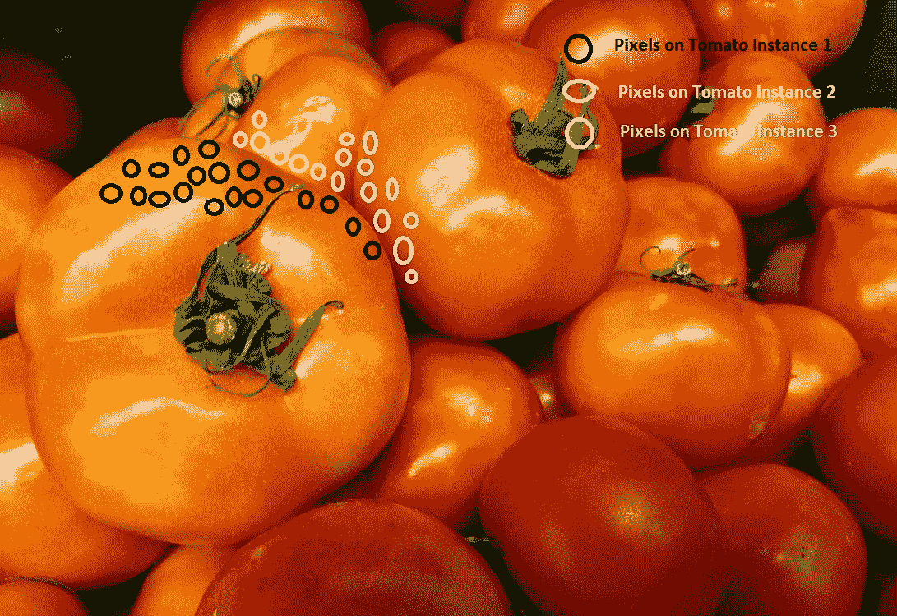

实例细分–直觉

Mask R-CNN 是早期网络中覆盖的更快 R-CNN 的扩展，使用了更快 R-CNN 中使用的所有技术，并增加了一项内容，即网络中的一条附加路径，以并行地为每个检测到的对象实例生成分段掩码(或对象掩码)。此外，由于这种使用大部分现有网络的方法，它仅给整个处理增加了最小的开销，并且具有几乎等同于更快的 R-CNN 的评分(测试)时间。在应用于 COCO2016 挑战赛(使用 COCO2015 数据集)的所有单模型解决方案中，它具有最佳精度之一。

像，PASCAL VOC，COCO 是另一个大规模标准(系列)数据集(来自微软)。除了对象检测，COCO 还用于分割和字幕。COCO 比许多其他数据集更广泛，最近许多关于对象检测的比较都是在此基础上进行的，以便进行比较。COCO 数据集有三种变体，即 COCO 2014、COCO 2015 和 COCO 2017。

在掩模 R-CNN 中，除了具有为每个锚框或 RoI 生成目标和定位的两个分支之外，还存在第三 FCN，其接收 RoI 并以像素到像素的方式为给定锚框预测分割掩模。

但是仍然存在一些挑战。虽然更快的 R-CNN 确实证明了变换不变性(也就是说，我们可以从 RPN 的卷积图追踪到实际图像的像素图)，但卷积图与实际图像像素的结构不同。因此，网络输入和输出之间不存在像素间对齐，这对于我们利用该网络提供像素间掩蔽非常重要。为了解决这一挑战，Mask R-CNN 使用了一个无量化层(在原始论文中称为 RoIAlign ),帮助对齐精确的空间位置。这一层不仅提供精确的对准，而且有助于在很大程度上提高精度，因此 Mask R-CNN 能够胜过许多其他网络:

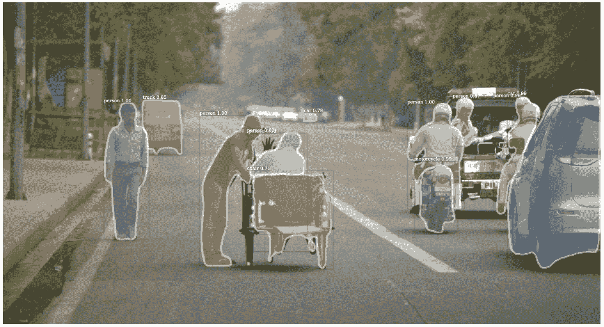

屏蔽 R-CNN–实例分段屏蔽(说明性输出)

实例分割的概念非常强大，可以实现许多非常有影响力的用例，而这些用例仅靠对象检测是不可能实现的。

我们甚至可以使用实例分割来估计同一框架中的人体姿态，并消除它们。


# 代码中的实例分段

现在是把我们学到的东西付诸实践的时候了。我们将使用 COCO 数据集及其数据 API，并使用脸书研究所的 Detectron 项目(参考资料中的链接)，该项目在 Apache 2.0 许可下提供了前面讨论的许多技术的 Python 实现。代码适用于 Python2 和 Caffe2，因此我们需要一个具有给定配置的虚拟环境。


# 创造环境

安装了 Caffe2 的虚拟环境可以根据*参考资料*部分中 Caffe2 存储库链接上的`caffe2`安装说明来创建。接下来，我们将安装依赖项。


# 安装 Python 依赖项(Python2 环境)

我们可以安装 Python 依赖项，如下面的代码块所示:

Python 2X 和 Python 3X 是两种不同风格的 Python(或者更准确地说是 CPython)，不是版本的传统升级，因此一种变体的库可能与另一种不兼容。本节使用 Python 2X。

*When we refer to the (interpreted) programming language Python, we need to refer to it with the specific interpreter (since it is an interpreted language as opposed to a compiled one like Java). The interpreter that we implicitly refer to as the Python interpreter (like the one you download from Python.org or the one that comes bundled with Anaconda) is technically called CPython, on which is the default byte-code interpreter of Python, which is written in C. But there are other Python interpreters also like Jython (build on Java), PyPy (written in Python itself - not so intuitive, right?), IronPython (.NET implementation of Python). *

```
pip install numpy>=1.13 pyyaml>=3.12 matplotlib opencv-python>=3.2 setuptools Cython mock scipy
```


# 下载并安装 COCO API 和 detectron 库(OS shell 命令)

然后，我们将下载并安装 Python 依赖项，如以下代码块所示:

```
# COCO API download and install
# COCOAPI=/path/to/clone/cocoapi
git clone https://github.com/cocodataset/cocoapi.git $COCOAPI
cd $COCOAPI/PythonAPI
make install

# Detectron library download and install
# DETECTRON=/path/to/clone/detectron
git clone https://github.com/facebookresearch/detectron $DETECTRON
cd $DETECTRON/lib && make
```

或者，我们可以下载并使用环境的 Docker 映像(需要 Nvidia GPU 支持):

```
# DOCKER image build
cd $DETECTRON/docker docker build -t detectron:c2-cuda9-cudnn7.
nvidia-docker run --rm -it detectron:c2-cuda9-cudnn7 python2 tests/test_batch_permutation_op.py
```


# 准备 COCO 数据集文件夹结构

现在，我们将看到准备 COCO 数据集文件夹结构的代码，如下所示:

```
# We need the following Folder structure: coco [coco_train2014, coco_val2014, annotations]
mkdir -p $DETECTRON/lib/datasets/data/coco
ln -s /path/to/coco_train2014 $DETECTRON/lib/datasets/data/coco/
ln -s /path/to/coco_val2014 $DETECTRON/lib/datasets/data/coco/
ln -s /path/to/json/annotations $DETECTRON/lib/datasets/data/coco/annotations
```


# 在 COCO 数据集上运行预训练模型

我们现在可以在 COCO 数据集上实现预训练模型，如以下代码片段所示:

```
python2 tools/test_net.py \
    --cfg configs/12_2017_baselines/e2e_mask_rcnn_R-101-FPN_2x.yaml \
    TEST.WEIGHTS https://s3-us-west-2.amazonaws.com/detectron/35861858/12_2017_baselines/e2e_mask_rcnn_R-101-             FPN_2x.yaml.02_32_51.SgT4y1cO/output/train/coco_2014_train:coco_2014_valminusminival/generalized_rcnn/model_final.pkl \
    NUM_GPUS 1
```


# 参考

1.  Paul Viola 和 Michael Jones，使用简单特征级联的快速目标检测，*计算机视觉和模式识别会议*，2001 年。

2.  Paul Viola 和 Michael Jones，鲁棒的实时目标检测，*国际计算机视觉杂志*，2001 年。

3.  Itseez2015opencv，opencv，*开源计算机视觉库*，Itseez，2015。

4.  Ross B. Girshick，Jeff Donahue，Trevor Darrell，Jitendra Malik，*用于精确对象检测和语义分割的丰富特征层次*，CoRR，arXiv:1311.2524，2013 年。

5.  Ross Girshick，Jeff Donahue，Trevor Darrell，Jitendra Malik，*用于精确对象检测和语义分割的丰富特征层次*，计算机视觉和模式识别，2014 年。

6.  米（meter 的缩写））Everingham，L. VanGool，C. K. I. Williams，J. Winn，A. Zisserman，*2012 年 PASCAL 视觉对象类挑战赛*，VOC2012，结果。

7.  D.洛。*尺度不变关键点的独特图像特征*，IJCV，2004。

8.  名词（noun 的缩写）达拉和 b .特里格斯。*用于人体检测的方向梯度直方图*。2005 年在 CVPR。

9.  Ross B. Girshick，快速 R-CNN，CoRR，arXiv:1504.08083，2015。

10.  Rbgirshick，fast-rcnn，GitHub，【https://github.com/rbgirshick/fast-rcnn】T2，2018 年 2 月。

11.  任，，何，罗斯·格希克，，快速 R-CNN: *用区域建议网络实现实时目标检测*，CoRR，arXiv:1506.01497，2015。

12.  任和，何和罗斯·吉斯克和，更快的 R-CNN: *用区域建议网络实现实时目标检测*，**神经信息处理系统进展** ( **NIPS** )，2015。

13.  Rbgirshick，py-faster-rcnn，GitHub，[https://github.com/rbgirshick/py-faster-rcnn](https://github.com/rbgirshick/py-faster-rcnn)，2018 年 2 月。

14.  罗斯·吉尔希克，伊利亚·拉多萨维奇，乔治娅·格基奥萨里，彼得·多尔，明凯·何，

    Detectron, GitHub, [https://github.com/facebookresearch/Detectron](https://github.com/facebookresearch/Detectron), Feb-2018.
15.  宗-林逸、迈克尔·梅尔、塞尔日·j·贝隆吉、卢博米尔·d·布尔德夫、罗斯·b·吉尔希克、詹姆斯·海斯、皮埃特罗·佩罗娜、德瓦·拉曼南、彼得·多勒、c·劳伦斯·兹尼克，*微软可可:背景中的共同对象*，CoRR，arXiv:1405.0312，2014 年。

16.  明凯·何，乔治娅·格基奥萨里，彼得·多尔，罗斯·b·吉尔希克，面具 R-CNN，CoRR，arXiv:1703.06870，2017。

17.  陈良杰，Alexander Hermans，George Papandreou，Florian Schroff，王鹏，Hartwig Adam，MaskLab: *利用语义和方向特征改进对象检测的实例分割*，CoRR，arXiv:1712.04837，2017。

18.  Anurag Arnab，Philip H. S. Torr，*使用动态实例化网络的逐像素实例分割*，CoRR，arXiv:1704.02386，2017。

19.  Matterport，Mask_RCNN，GitHub，[https://github.com/matterport/Mask_RCNN](https://github.com/matterport/Mask_RCNN)，2018 年 2 月。

20.  CharlesShang，FastMaskRCNN，GitHub，[https://github.com/CharlesShang/FastMaskRCNN](https://github.com/CharlesShang/FastMaskRCNN)，2018 年 2 月。

21.  卡菲 2，卡菲 2，GitHub，[https://github.com/caffe2/caffe2](https://github.com/caffe2/caffe2)，2018 年 2 月。


# 摘要

在这一章中，我们从对象检测任务背后的非常简单的直觉开始，然后进入非常高级的概念，例如实例分割，这是一个当代的研究领域。物体检测是零售、媒体、社交媒体、移动和安全领域许多创新的核心；使用这些技术为企业和社会消费创造非常有影响力和有利可图的功能有很大的潜力。

从算法的角度来看，本章从传奇的 Viola-Jones 算法及其底层机制开始，比如 Haar 特征和级联分类器。利用这种直觉，我们开始探索 CNN 世界中的物体检测算法，如 R-CNN、快速 R-CNN，直至最先进的快速 R-CNN。

在这一章中，我们还奠定了基础，并介绍了一个非常新的和有影响力的研究领域，称为**实例分割**。我们还介绍了一些先进的基于方法的深度 CNN，例如 Mask R-CNN，用于实例分割的简单和高性能的实现。