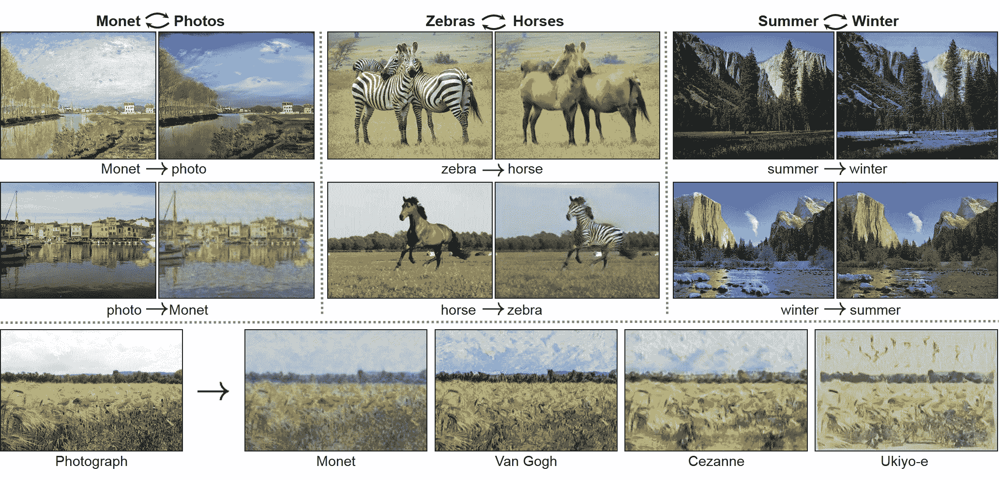
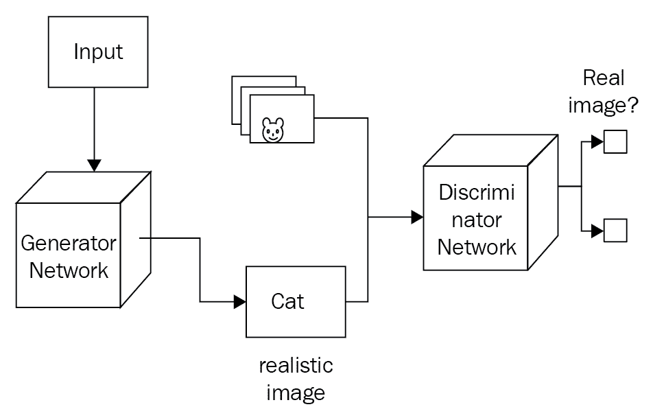
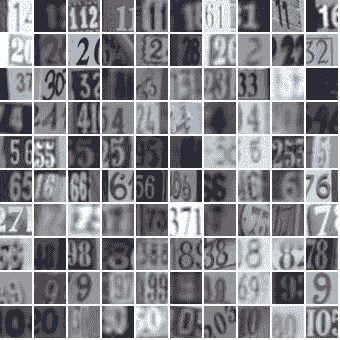

<title>GAN: Generating New Images with CNN</title>  

# 甘:用 CNN 创造新影像

通常，神经网络需要带标签的示例来有效地学习。从无标签数据中学习的无监督学习方法还没有很好地工作。一个**生成对抗网络**，或者简称为**甘**，是无监督学习方法的一部分，但是基于可微分的生成网络。gan 最早是由 Ian Goodfellow 等人在 2014 年发明的。从那以后，它们变得非常受欢迎。这是基于博弈论，有两个参与者或网络:一个发电机网络和 b)一个鉴别器网络，两者相互竞争。这种基于双重网络博弈论的方法极大地改善了从无标签数据中学习的过程。发电机网络产生假数据并将其传递给鉴别器。鉴别器网络也看到真实数据，并预测它接收的数据是假的还是真实的。因此，生成器经过训练，可以轻松生成非常接近真实数据的数据，以欺骗鉴别器网络。鉴别器网络被训练来分类哪些数据是真的，哪些数据是假的。所以，最终，一个生成器网络学会产生非常非常接近真实数据的数据。甘将会在音乐和艺术领域大受欢迎。

根据 Goodfellow 的说法，“*你可以认为生成模型赋予了人工智能一种想象的形式*

以下是 GANs 的几个例子:

*   Pix2pix
*   CycleGAN

<title>Pix2pix - Image-to-Image translation GAN</title>  

# Pix2pix 图像到图像转换 GAN

这个网络使用一个**条件生成对抗网络** ( **cGAN** )从图像的输入和输出中学习映射。可以从原始文件中提取的一些示例如下:


cGANs 的 Pix2pix 示例

在手提包的例子中，网络学习如何给黑白图像着色。这里，训练数据集的输入图像是黑白的，而目标图像是彩色的。

<title>CycleGAN </title>  

# CycleGAN

CycleGAN 也是一个图像到图像转换器，但没有输入/输出对。例如，要从绘画中生成照片，请将马图像转换为斑马图像:



在鉴别器网络中，使用压差非常重要。否则，可能会产生不良结果。

生成器网络将随机噪声作为输入，并产生逼真的图像作为输出。针对不同种类的随机噪声运行生成器网络会产生不同类型的真实图像。第二个网络被称为**鉴别器网络**，非常类似于常规的神经网络分类器。这个网络是在真实图像上训练的，尽管训练 GAN 与监督训练方法非常不同。在监督训练中，每个图像在显示给模型之前首先被标记。例如，如果输入是一只狗的图像，我们告诉模型这是一只狗。在生成模型的情况下，我们向模型显示大量图像，并要求它从相同的概率分布中制作更多类似的图像。实际上，第二个鉴别器网络有助于发电机网络实现这一点。

鉴别器从发生器网络输出图像是真的还是假的概率。换句话说，它试图为真实图像分配接近 1 的概率，为虚假图像分配接近 0 的概率。同时，发电机做相反的事情。它被训练成输出图像，该图像将具有由鉴别器接近 1 的概率。随着时间的推移，发生器会产生更真实的图像并欺骗鉴别器:



<title>Training a GAN model</title>  

# 训练 GAN 模型

在前面的章节中解释的大多数机器学习模型都是基于优化的，也就是说，我们在它的参数空间上最小化成本函数。gan 是不同的，因为有两个网络:发生器 G 和鉴别器 d。每个都有自己的成本。形象化 GAN 的一个简单方法是鉴别器的成本与发生器的成本成反比。在 GAN 中，我们可以定义一个值函数，生成器必须使其最小化，鉴别器必须使其最大化。生成模型的训练过程与监督训练方法非常不同。GAN 对初始权重很敏感。所以我们需要使用批处理规范化。批处理规范化除了提高性能之外，还使模型稳定。这里，我们同时训练两个模型，生成模型和判别模型。生成模型 G 捕获数据分布，判别模型 D 估计样本来自训练数据而不是 G 的概率。

<title>GAN – code example</title>  

# GAN–代码示例

在下面的例子中，我们使用 MNIST 数据集和 TensorFlow 建立和训练 GAN 模型。这里，我们将使用 ReLU 激活函数的一个特殊版本，称为**泄漏 ReLU** 。输出是一种新型的手写数字:

漏 ReLU 是 ReLU 激活函数的一个变体，由公式*f(x)= max(α÷x，x* *)* 给出。因此， *x* 的负值输出为 *alpha * x* ，正值 *x* 的输出为 *x* 。

```
#import all necessary libraries and load data set
%matplotlib inline

import pickle as pkl
import numpy as np
import tensorflow as tf
import matplotlib.pyplot as plt

from tensorflow.examples.tutorials.mnist import input_data
mnist = input_data.read_data_sets('MNIST_data')
```

为了建立这个网络，我们需要两个输入，一个用于发生器，一个用于鉴别器。在下面的代码中，我们为鉴别器的`real_input`和生成器的`z_input`创建占位符，输入大小分别为`dim_real`和`dim_z`:

```
#place holder for model inputs 
def model_inputs(dim_real, dim_z):
    real_input = tf.placeholder(tf.float32, name='dim_real')
    z_input = tf.placeholder(tf.float32, name='dim_z')

    return real_input, z_input
```

这里，输入`z`是一个随机向量，生成器将这个向量转换成图像。然后，我们添加一个隐藏层，这是一个泄漏的 ReLU 层，以允许梯度倒流。泄漏 ReLU 就像一个正常的 ReLU(负值发射零)，除了有一个小的非零输出为负输入值。使用`tanh` `sigmoid`功能时，发电机的性能会更好。发电机输出为`tanh`输出。因此，我们必须将 MNIST 图像重新缩放到-1 和 1 之间，而不是 0 和 1 之间。有了这些知识，我们可以构建发电机网络:

```
#Following code builds Generator Network
def generator(z, out_dim, n_units=128, reuse=False, alpha=0.01):
    ''' Build the generator network.

        Arguments
        ---------
        z : Input tensor for the generator
        out_dim : Shape of the generator output
        n_units : Number of units in hidden layer
        reuse : Reuse the variables with tf.variable_scope
        alpha : leak parameter for leaky ReLU

        Returns
        -------
        out: 
    '''
    with tf.variable_scope('generator', reuse=reuse) as generator_scope: # finish this
        # Hidden layer
        h1 = tf.layers.dense(z, n_units, activation=None )
        # Leaky ReLU
        h1 = tf.nn.leaky_relu(h1, alpha=alpha,name='leaky_generator')

        # Logits and tanh output
        logits = tf.layers.dense(h1, out_dim, activation=None)
        out = tf.tanh(logits)

        return out
```

鉴别器网络与发生器相同，除了输出层是一个`sigmoid`功能:

```

def discriminator(x, n_units=128, reuse=False, alpha=0.01):
    ''' Build the discriminator network.

        Arguments
        ---------
        x : Input tensor for the discriminator
        n_units: Number of units in hidden layer
        reuse : Reuse the variables with tf.variable_scope
        alpha : leak parameter for leaky ReLU

        Returns
        -------
        out, logits: 
    '''
    with tf.variable_scope('discriminator', reuse=reuse) as discriminator_scope:# finish this
        # Hidden layer
        h1 = tf.layers.dense(x, n_units, activation=None )
        # Leaky ReLU
        h1 = tf.nn.leaky_relu(h1, alpha=alpha,name='leaky_discriminator')

        logits = tf.layers.dense(h1, 1, activation=None)
        out = tf.sigmoid(logits)

        return out, logits
```

要构建网络，请使用以下代码:

```
#Hyperparameters
# Size of input image to discriminator
input_size = 784 # 28x28 MNIST images flattened
# Size of latent vector to generator
z_size = 100
# Sizes of hidden layers in generator and discriminator
g_hidden_size = 128
d_hidden_size = 128
# Leak factor for leaky ReLU
alpha = 0.01
# Label smoothing 
smooth = 0.1
```

我们希望在真实数据和虚假数据之间共享权重，因此我们需要重用变量:

```
#Build the network
tf.reset_default_graph()
# Create our input placeholders
input_real, input_z = model_inputs(input_size, z_size)

# Build the model
g_model = generator(input_z, input_size, n_units=g_hidden_size, alpha=alpha)
# g_model is the generator output

d_model_real, d_logits_real = discriminator(input_real, n_units=d_hidden_size, alpha=alpha)
d_model_fake, d_logits_fake = discriminator(g_model, reuse=True, n_units=d_hidden_size, alpha=alpha)
```

<title>Calculating loss </title>  

# 计算损失

对于鉴别器，总损失是真实和伪造图像的损失之和。损失将是 s 形交叉熵，我们可以使用张量流`tf.nn.sigmoid_cross_entropy_with_logits`得到。然后，我们计算该批中所有图像的平均值。所以损失会是这样的:

```
tf.reduce_mean(tf.nn.sigmoid_cross_entropy_with_logits(logits=logits, labels=labels))
```

为了帮助鉴别器更好地概括，可以将`labels`从 1.0 降低到 0.9，例如，使用参数`smooth` *。*这被称为**标签平滑**，通常与分类器一起使用以提高性能。伪数据的鉴别器损耗是相似的。`logits`是`d_logits_fake`，它是我们通过将发生器输出传递给鉴别器得到的。这些假的`logits`与全零的`labels`一起使用。请记住，我们希望鉴频器为真实图像输出 1，为虚假图像输出 0，因此我们需要设置损耗来反映这一点。

最后，发电机损耗是利用`d_logits_fake` *、*的假图像`logits`。但是现在的`labels`都是 1。生成器试图欺骗鉴别器，所以它希望鉴别器输出假图像:

```
# Calculate losses
d_loss_real = tf.reduce_mean(
                  tf.nn.sigmoid_cross_entropy_with_logits(logits=d_logits_real, 
                                                          labels=tf.ones_like(d_logits_real) * (1 - smooth)))
d_loss_fake = tf.reduce_mean(
                  tf.nn.sigmoid_cross_entropy_with_logits(logits=d_logits_fake, 
                                                          labels=tf.zeros_like(d_logits_real)))
d_loss = d_loss_real + d_loss_fake

g_loss = tf.reduce_mean(
             tf.nn.sigmoid_cross_entropy_with_logits(logits=d_logits_fake,
                                                     labels=tf.ones_like(d_logits_fake)))
```

<title>Adding the optimizer</title>  

# 添加优化器

我们需要分别更新生成器和鉴别器变量。因此，首先获取图中的所有变量，然后，正如我们前面解释的，我们只能从生成器作用域中获取生成器变量，类似地，从鉴别器作用域中获取鉴别器变量:

```
# Optimizers
learning_rate = 0.002

# Get the trainable_variables, split into G and D parts
t_vars = tf.trainable_variables()
g_vars = [var for var in t_vars if var.name.startswith('generator')]
d_vars = [var for var in t_vars if var.name.startswith('discriminator')]

d_train_opt = tf.train.AdamOptimizer(learning_rate).minimize(d_loss, var_list=d_vars)
g_train_opt = tf.train.AdamOptimizer(learning_rate).minimize(g_loss, var_list=g_vars)
```

要训练网络，请使用:

```
batch_size = 100
epochs = 100
samples = []
losses = []
# Only save generator variables
saver = tf.train.Saver(var_list=g_vars)
with tf.Session() as sess:
    sess.run(tf.global_variables_initializer())
    for e in range(epochs):
        for ii in range(mnist.train.num_examples//batch_size):
            batch = mnist.train.next_batch(batch_size)

            # Get images, reshape and rescale to pass to D
            batch_images = batch[0].reshape((batch_size, 784))
            batch_images = batch_images*2 - 1

            # Sample random noise for G
            batch_z = np.random.uniform(-1, 1, size=(batch_size, z_size))

            # Run optimizers
            _ = sess.run(d_train_opt, feed_dict={input_real: batch_images, input_z: batch_z})
            _ = sess.run(g_train_opt, feed_dict={input_z: batch_z})

        # At the end of each epoch, get the losses and print them out
        train_loss_d = sess.run(d_loss, {input_z: batch_z, input_real: batch_images})
        train_loss_g = g_loss.eval({input_z: batch_z})

        print("Epoch {}/{}...".format(e+1, epochs),
              "Discriminator Loss: {:.4f}...".format(train_loss_d),
              "Generator Loss: {:.4f}".format(train_loss_g)) 
        # Save losses to view after training
        losses.append((train_loss_d, train_loss_g))

        # Sample from generator as we're training for viewing afterwards
        sample_z = np.random.uniform(-1, 1, size=(16, z_size))
        gen_samples = sess.run(
                       generator(input_z, input_size, n_units=g_hidden_size, reuse=True, alpha=alpha),
                       feed_dict={input_z: sample_z})
        samples.append(gen_samples)
        saver.save(sess, './checkpoints/generator.ckpt')

# Save training generator samples
with open('train_samples.pkl', 'wb') as f:
    pkl.dump(samples, f)
```

一旦模型训练完成并保存，就可以可视化生成的数字(代码不在这里，但可以下载)。

<title>Semi-supervised learning and GAN</title>  

# 半监督学习和 GAN

因此，我们已经看到了 GAN 如何用于生成逼真的图像。在本节中，我们将了解 GAN 如何用于分类任务，在这些任务中，我们有较少的标记数据，但仍希望提高分类器的准确性。这里我们也将使用相同的**街景门牌号**或 **SVHN** 数据集对图像进行分类。和前面一样，这里我们也有两个网络，生成器 G 和鉴别器 d。在这种情况下，鉴别器被训练成分类器。另一个变化是鉴频器的输出转到 softmax 函数，而不是`sigmoid`函数，如前所述。softmax 函数返回标签的概率分布:


现在，我们将网络建模为:

*总成本=标记数据成本+未标记数据成本*

要获得标记数据的成本，我们可以使用`cross_entropy`函数:

```
cost of labeled data  = cross_entropy ( logits, labels)
cost of unlabeled data =   cross_entropy ( logits, real)
```

然后我们可以计算所有类的总和:

```
real prob = sum (softmax(real_classes))
```

普通分类器处理带标签的数据。然而，基于半监督 GAN 的分类器工作在标记数据、真实的未标记数据和虚假图像上。这非常有效，也就是说，即使我们在训练过程中有较少的标记数据，也有较少的分类错误。

<title>Feature matching</title>  

# 特征匹配

特征匹配的思想是给生成器的成本函数增加一个额外的变量，以便补偿测试数据和训练数据中的绝对误差之间的差异。

<title>Semi-supervised classification using a GAN example</title>  

# 使用 GAN 示例的半监督分类

在本节中，我们将解释如何使用 GAN 通过半监督学习方法来构建分类器。

在监督学习中，我们有一组训练输入`X`和类别标签`y`。我们训练一个以`X`为输入，以`y`为输出的模型。

在半监督学习中，我们的目标仍然是训练一个以`X`为输入，生成`y`为输出的模型。然而，并不是所有的训练例子都有标签`y`。

我们使用 SVHN 数据集。我们将把 GAN 鉴别器变成 11 类鉴别器(0 到 9 和一个假图像标签)。它将识别 10 种不同类别的真实 SVHN 数字，以及来自生成器的第 11 类虚假图像。鉴别器将在真实的标记图像、真实的未标记图像和虚假图像上进行训练。通过利用三个数据源而不是一个数据源，它将比只在一个数据源上训练的传统分类器更好地推广到测试集:

```
def model_inputs(real_dim, z_dim):
    inputs_real = tf.placeholder(tf.float32, (None, *real_dim), name='input_real')
    inputs_z = tf.placeholder(tf.float32, (None, z_dim), name='input_z')
    y = tf.placeholder(tf.int32, (None), name='y')
    label_mask = tf.placeholder(tf.int32, (None), name='label_mask')

    return inputs_real, inputs_z, y, label_mask
```

添加发电机:

```
def generator(z, output_dim, reuse=False, alpha=0.2, training=True, size_mult=128):
    with tf.variable_scope('generator', reuse=reuse):
        # First fully connected layer
        x1 = tf.layers.dense(z, 4 * 4 * size_mult * 4)
        # Reshape it to start the convolutional stack
        x1 = tf.reshape(x1, (-1, 4, 4, size_mult * 4))
        x1 = tf.layers.batch_normalization(x1, training=training)
        x1 = tf.maximum(alpha * x1, x1)

        x2 = tf.layers.conv2d_transpose(x1, size_mult * 2, 5, strides=2, padding='same')
        x2 = tf.layers.batch_normalization(x2, training=training)
        x2 = tf.maximum(alpha * x2, x2)

        x3 = tf.layers.conv2d_transpose(x2, size_mult, 5, strides=2, padding='same')
        x3 = tf.layers.batch_normalization(x3, training=training)
        x3 = tf.maximum(alpha * x3, x3)

        # Output layer
        logits = tf.layers.conv2d_transpose(x3, output_dim, 5, strides=2, padding='same')

        out = tf.tanh(logits)

        return out
```

添加鉴别器:

```
def discriminator(x, reuse=False, alpha=0.2, drop_rate=0., num_classes=10, size_mult=64):
    with tf.variable_scope('discriminator', reuse=reuse):
        x = tf.layers.dropout(x, rate=drop_rate/2.5)

        # Input layer is 32x32x3
        x1 = tf.layers.conv2d(x, size_mult, 3, strides=2, padding='same')
        relu1 = tf.maximum(alpha * x1, x1)
        relu1 = tf.layers.dropout(relu1, rate=drop_rate)

        x2 = tf.layers.conv2d(relu1, size_mult, 3, strides=2, padding='same')
        bn2 = tf.layers.batch_normalization(x2, training=True)
        relu2 = tf.maximum(alpha * x2, x2)

        x3 = tf.layers.conv2d(relu2, size_mult, 3, strides=2, padding='same')
        bn3 = tf.layers.batch_normalization(x3, training=True)
        relu3 = tf.maximum(alpha * bn3, bn3)
        relu3 = tf.layers.dropout(relu3, rate=drop_rate)

        x4 = tf.layers.conv2d(relu3, 2 * size_mult, 3, strides=1, padding='same')
        bn4 = tf.layers.batch_normalization(x4, training=True)
        relu4 = tf.maximum(alpha * bn4, bn4)

        x5 = tf.layers.conv2d(relu4, 2 * size_mult, 3, strides=1, padding='same')
        bn5 = tf.layers.batch_normalization(x5, training=True)
        relu5 = tf.maximum(alpha * bn5, bn5)

        x6 = tf.layers.conv2d(relu5, 2 * size_mult, 3, strides=2, padding='same')
        bn6 = tf.layers.batch_normalization(x6, training=True)
        relu6 = tf.maximum(alpha * bn6, bn6)
        relu6 = tf.layers.dropout(relu6, rate=drop_rate)

        x7 = tf.layers.conv2d(relu5, 2 * size_mult, 3, strides=1, padding='valid')
        # Don't use bn on this layer, because bn would set the mean of each feature
        # to the bn mu parameter.
        # This layer is used for the feature matching loss, which only works if
        # the means can be different when the discriminator is run on the data than
        # when the discriminator is run on the generator samples.
        relu7 = tf.maximum(alpha * x7, x7)

        # Flatten it by global average pooling
        features = raise NotImplementedError()

        # Set class_logits to be the inputs to a softmax distribution over the different classes
        raise NotImplementedError()

        # Set gan_logits such that P(input is real | input) = sigmoid(gan_logits).
        # Keep in mind that class_logits gives you the probability distribution over all the real
        # classes and the fake class. You need to work out how to transform this multiclass softmax
        # distribution into a binary real-vs-fake decision that can be described with a sigmoid.
        # Numerical stability is very important.
        # You'll probably need to use this numerical stability trick:
        # log sum_i exp a_i = m + log sum_i exp(a_i - m).
        # This is numerically stable when m = max_i a_i.
        # (It helps to think about what goes wrong when...
        # 1\. One value of a_i is very large
        # 2\. All the values of a_i are very negative
        # This trick and this value of m fix both those cases, but the naive implementation and
        # other values of m encounter various problems)
        raise NotImplementedError()

        return out, class_logits, gan_logits, features
```

计算损失:

```
def model_loss(input_real, input_z, output_dim, y, num_classes, label_mask, alpha=0.2, drop_rate=0.):
    """
    Get the loss for the discriminator and generator
    :param input_real: Images from the real dataset
    :param input_z: Z input
    :param output_dim: The number of channels in the output image
    :param y: Integer class labels
    :param num_classes: The number of classes
    :param alpha: The slope of the left half of leaky ReLU activation
    :param drop_rate: The probability of dropping a hidden unit
    :return: A tuple of (discriminator loss, generator loss)
    """

    # These numbers multiply the size of each layer of the generator and the discriminator,
    # respectively. You can reduce them to run your code faster for debugging purposes.
    g_size_mult = 32
    d_size_mult = 64

    # Here we run the generator and the discriminator
    g_model = generator(input_z, output_dim, alpha=alpha, size_mult=g_size_mult)
    d_on_data = discriminator(input_real, alpha=alpha, drop_rate=drop_rate, size_mult=d_size_mult)
    d_model_real, class_logits_on_data, gan_logits_on_data, data_features = d_on_data
    d_on_samples = discriminator(g_model, reuse=True, alpha=alpha, drop_rate=drop_rate, size_mult=d_size_mult)
    d_model_fake, class_logits_on_samples, gan_logits_on_samples, sample_features = d_on_samples

    # Here we compute `d_loss`, the loss for the discriminator.
    # This should combine two different losses:
    # 1\. The loss for the GAN problem, where we minimize the cross-entropy for the binary
    # real-vs-fake classification problem.
    # 2\. The loss for the SVHN digit classification problem, where we minimize the cross-entropy
    # for the multi-class softmax. For this one we use the labels. Don't forget to ignore
    # use `label_mask` to ignore the examples that we are pretending are unlabeled for the
    # semi-supervised learning problem.
    raise NotImplementedError()

    # Here we set `g_loss` to the "feature matching" loss invented by Tim Salimans at OpenAI.
    # This loss consists of minimizing the absolute difference between the expected features
    # on the data and the expected features on the generated samples.
    # This loss works better for semi-supervised learning than the tradition GAN losses.
    raise NotImplementedError()

    pred_class = tf.cast(tf.argmax(class_logits_on_data, 1), tf.int32)
    eq = tf.equal(tf.squeeze(y), pred_class)
    correct = tf.reduce_sum(tf.to_float(eq))
    masked_correct = tf.reduce_sum(label_mask * tf.to_float(eq))

    return d_loss, g_loss, correct, masked_correct, g_model
```

添加优化器:

```
def model_opt(d_loss, g_loss, learning_rate, beta1):
    """
    Get optimization operations
    :param d_loss: Discriminator loss Tensor
    :param g_loss: Generator loss Tensor
    :param learning_rate: Learning Rate Placeholder
    :param beta1: The exponential decay rate for the 1st moment in the optimizer
    :return: A tuple of (discriminator training operation, generator training operation)
    """
    # Get weights and biases to update. Get them separately for the discriminator and the generator
    raise NotImplementedError()

    # Minimize both players' costs simultaneously
    raise NotImplementedError()
    shrink_lr = tf.assign(learning_rate, learning_rate * 0.9)

    return d_train_opt, g_train_opt, shrink_lr
```

构建网络模型:

```
class GAN:
    """
    A GAN model.
    :param real_size: The shape of the real data.
    :param z_size: The number of entries in the z code vector.
    :param learnin_rate: The learning rate to use for Adam.
    :param num_classes: The number of classes to recognize.
    :param alpha: The slope of the left half of the leaky ReLU activation
    :param beta1: The beta1 parameter for Adam.
    """
    def __init__(self, real_size, z_size, learning_rate, num_classes=10, alpha=0.2, beta1=0.5):
        tf.reset_default_graph()

        self.learning_rate = tf.Variable(learning_rate, trainable=False)
        inputs = model_inputs(real_size, z_size)
        self.input_real, self.input_z, self.y, self.label_mask = inputs
        self.drop_rate = tf.placeholder_with_default(.5, (), "drop_rate")

        loss_results = model_loss(self.input_real, self.input_z,
                                  real_size[2], self.y, num_classes,
                                  label_mask=self.label_mask,
                                  alpha=0.2,
                                  drop_rate=self.drop_rate)
        self.d_loss, self.g_loss, self.correct, self.masked_correct, self.samples = loss_results

        self.d_opt, self.g_opt, self.shrink_lr = model_opt(self.d_loss, self.g_loss, self.learning_rate, beta1)
```

训练并保持模型:

```
def train(net, dataset, epochs, batch_size, figsize=(5,5)):

    saver = tf.train.Saver()
    sample_z = np.random.normal(0, 1, size=(50, z_size))

    samples, train_accuracies, test_accuracies = [], [], []
    steps = 0

    with tf.Session() as sess:
        sess.run(tf.global_variables_initializer())
        for e in range(epochs):
            print("Epoch",e)

            t1e = time.time()
            num_examples = 0
            num_correct = 0
            for x, y, label_mask in dataset.batches(batch_size):
                assert 'int' in str(y.dtype)
                steps += 1
                num_examples += label_mask.sum()

                # Sample random noise for G
                batch_z = np.random.normal(0, 1, size=(batch_size, z_size))

                # Run optimizers
                t1 = time.time()
                _, _, correct = sess.run([net.d_opt, net.g_opt, net.masked_correct],
                                         feed_dict={net.input_real: x, net.input_z: batch_z,
                                                    net.y : y, net.label_mask : label_mask})
                t2 = time.time()
                num_correct += correct

            sess.run([net.shrink_lr])

            train_accuracy = num_correct / float(num_examples)

            print("\t\tClassifier train accuracy: ", train_accuracy)

            num_examples = 0
            num_correct = 0
            for x, y in dataset.batches(batch_size, which_set="test"):
                assert 'int' in str(y.dtype)
                num_examples += x.shape[0]

                correct, = sess.run([net.correct], feed_dict={net.input_real: x,
                                                   net.y : y,
                                                   net.drop_rate: 0.})
                num_correct += correct

            test_accuracy = num_correct / float(num_examples)
            print("\t\tClassifier test accuracy", test_accuracy)
            print("\t\tStep time: ", t2 - t1)
            t2e = time.time()
            print("\t\tEpoch time: ", t2e - t1e)

            gen_samples = sess.run(
                                   net.samples,
                                   feed_dict={net.input_z: sample_z})
            samples.append(gen_samples)
            _ = view_samples(-1, samples, 5, 10, figsize=figsize)
            plt.show()

            # Save history of accuracies to view after training
            train_accuracies.append(train_accuracy)
            test_accuracies.append(test_accuracy)

        saver.save(sess, './checkpoints/generator.ckpt')

    with open('samples.pkl', 'wb') as f:
        pkl.dump(samples, f)

    return train_accuracies, test_accuracies, samples
```

<title>Deep convolutional GAN</title>  

# 深度卷积 GAN

**深度卷积 GAN** ，又称 **DCGAN** ，用于生成彩色图像。这里，我们在生成器和鉴别器中使用卷积层。我们还需要使用批量标准化来使 GAN 得到适当的训练。我们将在“深度神经网络的性能改进”一章中详细讨论批处理规范化。我们将在 SVHN 数据集上训练 GAN 下图显示了一个小例子。经过训练后，生成器将能够创建与这些图像几乎相同的图像。您可以下载该示例的代码:



谷歌街景门牌号视图

<title>Batch normalization</title>  

# 批量标准化

批处理规范化是一种提高神经网络性能和稳定性的技术。其目的是归一化图层输入，使其平均值为零，方差为 1。Sergey Ioffe 和 Christian Szegedy 在 2015 年的论文*中介绍了批处理规范化，批处理规范化是使 DCGANs 工作的必要条件*。我们的想法是，不只是将网络的输入标准化，而是将网络中各层的输入标准化。它被称为**批** **归一化**，因为在训练期间，我们通过使用当前小批中的值的平均值和方差来归一化每一层的输入。

<title>Summary</title>  

# 摘要

在这一章中，我们看到了 GAN 模型如何真实地展示了 CNN 的威力。我们学习了如何训练自己的生成模型，并看到了 GAN 的一个实际例子，它可以从绘画中生成照片，并将马变成斑马。

我们了解了 GAN 与其他判别模型的不同之处，并了解了为什么生成模型更受青睐。

下一章，我们将从零开始学习深度学习软件对比。