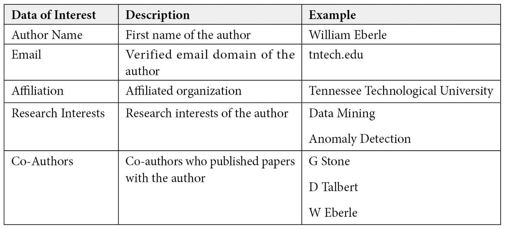
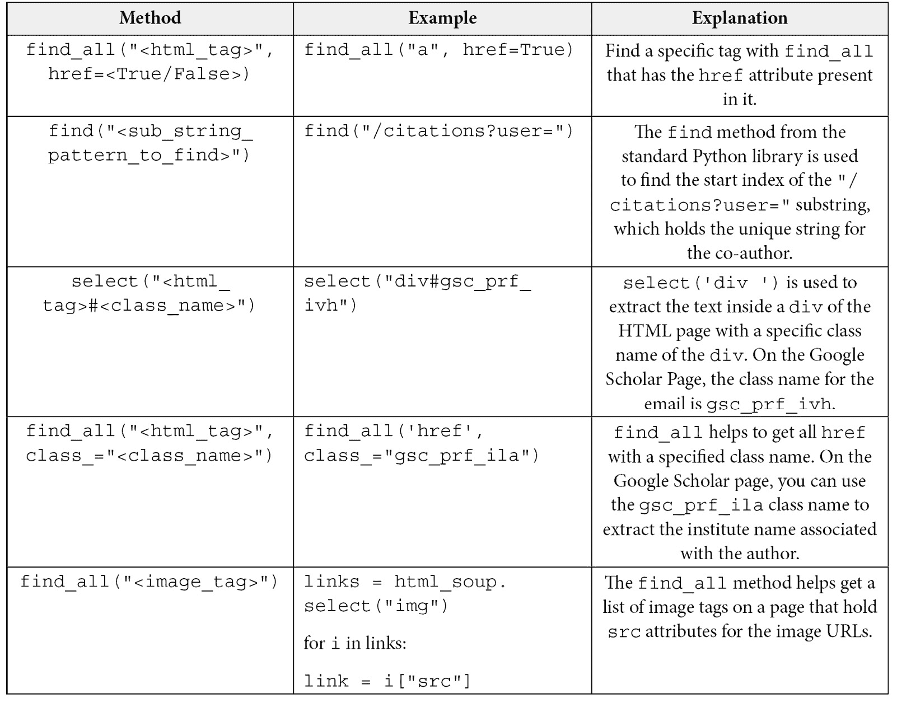
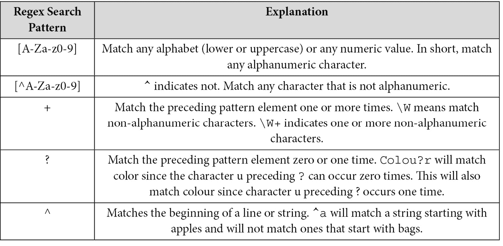

# 二、深度学习项目的数据准备

每个**机器学习** ( **ML** )项目的第一步都是由数据收集和数据准备组成的。作为 ML 的子集，**深度学习** ( **DL** )涉及相同的数据处理过程。本章一开始，我们将使用 Anaconda 建立一个标准的 DL Python 笔记本环境。然后，我们将提供以各种格式(JSON、CSV、HTML 和 XML)收集数据的具体例子。在许多情况下，收集的数据被清理和预处理，因为它包含不必要的信息或无效的格式。

本章将介绍这一领域的流行技术:填充缺失值、删除不必要的条目和规范化值。接下来，您将学习常见的特征提取技术:单词袋模型、术语频率-逆文档频率、一键编码和维度缩减。此外，我们将介绍`matplotlib`和`seaborn`，它们是最流行的数据可视化库。最后，我们将介绍 Docker 映像，它是工作环境的快照，通过将应用程序及其依赖项捆绑在一起，最大限度地减少了潜在的兼容性问题。

在本章中，我们将讨论以下主要话题:

*   设置笔记本电脑环境
*   数据收集、数据清理和数据预处理
*   从数据中提取特征
*   执行数据可视化
*   Docker 简介

# 技术要求

本章的补充资料可以从 GitHub 的[https://GitHub . com/packt publishing/Production-Ready-Applied-Deep-Learning/tree/main/Chapter _ 2](https://github.com/PacktPublishing/Production-Ready-Applied-Deep-Learning/tree/main/Chapter_2)下载。

# 设置笔记本电脑环境

Python 是最流行的编程语言之一，广泛用于数据分析。它的优势来自动态类型和免编译。凭借其灵活性，它已经成为数据科学家使用最多的语言。在本节中，我们将介绍如何使用 **Anaconda** 和**首选安装程序** ( **PIP** )为 DL 项目设置 Python 环境。这些工具允许您为每个项目创建一个独特的环境，同时简化包管理。Anaconda 为提供了一个桌面应用和一个叫做 Anaconda Navigator 的 GUI。我们将带您了解如何建立 Python 环境，并为 DL 项目安装流行的 Python 库，如:TensorFlow、PyTorch、T21、熊猫、scikit、Matplotlib、Seaborn 和。

## 设置 Python 环境

Python 可以从[www.python.org/downloads](http://www.python.org/downloads)安装。但是 Python 版本往往可以通过操作系统提供的包管理器获得，比如 Linux 上的**高级包工具** ( **APT** )和 macOS 上的**家酿**。设置Python 环境从使用 PIP 安装必要的包开始，PIP 是一个包管理系统，允许你安装和管理各种 Python 包。

## 安装 Anaconda

当在一台机器上建立了多个 Python 项目时，分离环境将是理想的，因为每个项目可能依赖于这些包的不同版本。Anaconda 可以帮助您进行环境管理，因为它是为 Python 包管理和环境管理而设计的。它允许您创建虚拟环境，其中已安装的软件包被绑定到当前活动的每个环境。此外，Anaconda 超越了 Python 的界限，允许用户安装非 Python 库依赖项。

首先，Anaconda 可以从它的官方网站安装:[www.anaconda.com](http://www.anaconda.com)。为了完整起见，我们用图片描述了安装过程，位于[https://github . com/packt publishing/Production-Ready-Applied-Deep-Learning/blob/main/Chapter _ 2/anaconda/anaconda _ graphical _ installer . MD](https://github.com/PacktPublishing/Production-Ready-Applied-Deep-Learning/blob/main/Chapter_2/anaconda/anaconda_graphical_installer.md)。

它也可以直接从终端安装。Anaconda 为每个操作系统提供安装脚本([repo.anaconda.com/archive](http://repo.anaconda.com/archive))。您可以简单地下载适合您的系统的脚本版本，并运行它在您的机器上安装 Anaconda。作为一个例子，我们将描述如何从 macOS 的这些脚本之一安装 Anaconda:[https://github . com/packt publishing/Production-Ready-Applied-Deep-Learning/blob/main/Chapter _ 2/Anaconda/Anaconda _ zsh . MD](https://github.com/PacktPublishing/Production-Ready-Applied-Deep-Learning/blob/main/Chapter_2/anaconda/anaconda_zsh.md)。

## 使用 Anaconda 建立一个 DL 项目

此时，您应该已经有了一个可以使用的 Anaconda 环境。现在，我们将创建我们的第一个虚拟环境并为 DL 项目安装必要的包:

```
conda create --name bookenv python=3.8
```

您可以使用以下命令列出可用的`conda`环境:

```
conda info --envs
```

您应该会看到我们之前创建的`bookenv`环境。要激活此环境，您可以使用以下命令:

```
conda activate bookenv
```

类似地，可以使用以下命令取消激活:

```
conda deactivate
```

安装 Python 包可以通过`pip install <package name>`或`conda install <package name>`完成。在下面的代码片段中，首先，我们通过`pip`命令下载科学计算的基础包 NumPy。然后，我们将通过`conda`命令安装 PyTorch。安装 PyTorch 时，必须提供 CUDA 的版本，这是一个并行计算平台和编程模型，用于 GPU 上的一般计算。CUDA 可以通过允许 GPU 并行处理计算来加速 DL 模型训练:

```
pip install numpy
conda install pytorch torchvision torchaudio \
cudatoolkit=<cuda version> -c pytorch -c nvidia
```

TensorFlow 是 DL 项目的另一个流行包。和 PyTorch 一样，TensorFlow 为每个版本的 CUDA 提供了不同的包。完整的名单可以在网上找到这里:[https://www.tensorflow.org/install/source#gpu](https://www.tensorflow.org/install/source#gpu)。为了让所有与 DL 相关的库无缝地协同工作，Python 版本、TensorFlow 版本、GCC 编译器版本、CUDA 版本和 Bazel 构建工具版本之间必须兼容，如下面的截图所示:


图 2.1–tensor flow、Python、GCC、Bazel、cuDNN 和 CUDA 版本的兼容性矩阵

回到`pip`命令，不用重复输入`install`命令，您可以生成一个包含必要软件包的文本文件，并在一个命令中安装所有软件包。为此，您可以为`pip install`命令提供带有`--requirement` ( `-r`)选项的文件名，如下所示:

```
pip install -r requirements.txt
```

所需的常用包在 CPU 专用环境中列出在示例`requirements.txt`文件中:[https://github . com/packt publishing/Production-Ready-Applied-Deep-Learning/blob/main/Chapter _ 2/anaconda/requirements . txt](https://github.com/PacktPublishing/Production-Ready-Applied-Deep-Learning/blob/main/Chapter_2/anaconda/requirements.txt)。列表中的主要包是 TensorFlow 和 PyTorch。

现在，让我们看看一些有用的 Anaconda 命令。正如`pip install`可以与`requirements.txt`文件一起使用一样，您也可以使用 YAML 文件创建一个包含一组包的环境。在下面的例子中，我们使用一个`env.yml`文件来保存现有环境中的库列表。稍后，`env.yml`可以用来创建一个具有相同包的新环境，如下面的代码片段所示:

```
conda create -n env_1
conda activate env_1
# save environment to a file
conda env export > env.yml
# clone existing environment 
conda create -n env_2 --clone env_1
# delete existing environment (env_1)
conda remove -n env_1 --all
# create environment (env_1) from the yaml file
conda env create -f env.yml
# using conda to install the libraries from requirements.txt
conda install --force-reinstall -y -q --name py37 -c conda-forge --file requirements.txt
```

下面的代码片段描述了从`conda env export`生成的一个样本 YAML 文件:

```

# env.yml

name: env_1

channels:

  - defaults

dependencies:

  - appnope=0.1.2=py39hecd8cb5_1001

  - ipykernel=6.4.1=py39hecd8cb5_1

  - ipython=7.29.0=py39h01d92e1_0

prefix: /Users/userA/opt/anaconda3/envs/new_env
```

这个 YAML 文件的主要组件是环境的名称(`name`)、库的源(`channels`)和库的列表(`dependencies`)。

要记住的事情

a.由于其简单的语法，Python 是数据分析的标准语言

b.Python 不需要显式编译

c.PIP 用于安装 Python 包

d.Anaconda 处理 Python 包管理和环境管理

在下一节中，我们将解释如何从各种来源收集数据。然后，我们将为后续流程清理和预处理收集的数据。

# 数据收集、数据清洗和数据预处理

在这个部分，我们将向您介绍数据收集过程中涉及的各种任务。我们将描述如何从多个来源收集数据，并将它们转换成数据科学家可以使用的通用形式，而不管底层任务是什么。这个过程可以分为几个部分:数据收集、数据清理和数据预处理。值得一提的是，特定于任务的转换被认为是特征提取，这将在下一节中讨论。

## 收集数据

首先，我们将介绍组成初始数据集的不同数据收集方法。不同的技术是必要的，这取决于原始数据是如何格式化的。大多数数据集要么以 HFML 文件的形式在线提供，要么以 JSON 对象的形式在线提供。一些数据以**逗号分隔值** ( **CSV** )格式存储，可以通过 pandas library(一个流行的数据分析和操作工具)轻松加载。因此，在本节中，我们将主要关注收集 HTML 和 JSON 数据并将其保存为 CSV 格式。此外，我们将介绍一些流行的数据集存储库。

### 抓取网页

被认为是网络的基本组成部分的，**超文本标记语言** ( **HTML** )数据很容易访问，并且由不同的信息组成。因此，抓取网页的能力可以帮助您收集大量有趣的数据。在这个部分，我们将使用 BeautifulSoup，一个基于 Python 的 web 爬行库([https://www.crummy.com/software/BeautifulSoup/](https://www.crummy.com/software/BeautifulSoup/))。例如，我们将演示如何抓取谷歌学术页面，以及如何将抓取的数据保存为 CSV 文件。

在这个例子中，BeautifulSoup 的几个函数将用于提取作者的名字、姓氏、电子邮件、研究兴趣、引用计数、h-index(高索引)、合著者和论文标题。下表显示了我们希望在此示例中收集的数据:



表 2.1-可以从谷歌学术页面收集的数据

抓取网页是一个两步的过程:

1.  利用请求库获取一个`response`对象中的 HTML 数据。
2.  构造一个`BeautifulSoup`对象，解析`response`对象中的 HTML 标签。

这两个步骤可以总结为下面的代码片段:

```

# url points to the target google scholar page 

response = requests.get(url) 

html_soup = BeautifulSoup(response.text, 'html.parser')
```

下一步是从`BeautifulSoup`对象中获取感兴趣的内容。*表 2.2* 总结了常见的`BeautifulSoup`函数，让您从解析的 HTML 数据中提取感兴趣的内容。由于我们在本例中的目标是将收集的数据存储为 CSV 文件，因此我们将简单地生成页面的逗号分隔字符串表示，并将其写入文件。完整的实现可以在[https://github . com/packt publishing/Production-Ready-Applied-Deep-Learning/blob/main/Chapter _ 2/Google _ scholar/Google _ scholar . py](https://github.com/PacktPublishing/Production-Ready-Applied-Deep-Learning/blob/main/Chapter_2/google_scholar/google_scholar.py)找到。

下表提供了处理谷歌学术页面中的原始数据所需的方法列表:



表 2.2–可能的特征提取技术

接下来，我们将学习 JSON，另一种流行的原始数据格式。

### 收集 JSON 数据

JSON 是一种独立于语言的格式，它将数据存储为键值和/或键数组字段。由于大多数编程语言支持键值数据结构(例如，Python 中的字典或 Java 中的 HashMap)，JSON 被认为是可互换的(独立于程序)。以下代码片段显示了一些示例 JSON 数据:

```

{

    "first_name": "Ryan",

    "last_name": "Smith",

    "phone": [{"type": "home",

               "number": "111 222-3456"}],

    "pets": ["ceasor", "rocky"],

    "job_location": null

}
```

看看令人敬畏的 JSON 数据集 GitHub 知识库(【https://github.com/jdorfman/awesome-json-datasets】T4)，它包含有用的 JSON 数据源列表。此外，Public API 的 GitHub 存储库([https://github.com/public-apis/public-apis](https://github.com/public-apis/public-apis))由一个 web 服务器端点列表组成，在这里可以检索各种 JSON 数据。此外，我们还提供了一个从端点收集 JSON 数据并将必要字段存储为 CSV 文件的脚本:[https://github . com/packt publishing/Production-Ready-Applied-Deep-Learning/blob/main/Chapter _ 2/rest/get _ rest _ API _ data . py](https://github.com/PacktPublishing/Production-Ready-Applied-Deep-Learning/blob/main/Chapter_2/rest/get_rest_api_data.py)。这个例子使用了 https://www.reddit.com/r/all.json[的 Reddit 数据集。](https://www.reddit.com/r/all.json)

接下来，我们将介绍数据科学领域中流行的公共数据集。

### 流行的数据集存储库

除了 web 页面和 JSON 数据，许多公共数据集可以用于各种目的。例如，你可以从流行的数据中心获取数据集，如*ka ggle*([https://www.kaggle.com/datasets](https://www.kaggle.com/datasets))或*麻省理工学院数据中心*([https://datahub.csail.mit.edu/browse/public](https://datahub.csail.mit.edu/browse/public))。这些公共数据集经常被许多研究机构和企业用于各种活动。来自不同领域的数据，如医疗保健、政府、生物学和计算机科学，在研究过程中被收集，并为了更大的利益捐赠给存储库。就像这些组织如何管理和提供多样化的数据集一样，社区也在努力管理各种公共数据集:[https://github.com/awesomedata/awesome-public-datasets](https://github.com/awesomedata/awesome-public-datasets#government)。

数据集的另一个流行的来源是数据分析库，如 *sklearn* 、 *Keras* 和 *TensorFlow* 。各图书馆提供的数据集列表可分别在[https://scikit-learn.org/stable/datasets](https://scikit-learn.org/stable/datasets)、[https://keras.io/api/datasets/](https://keras.io/api/datasets/)和[https://www.tensorflow.org/datasets](https://www.tensorflow.org/datasets)找到。

最后，政府组织也向公众提供许多数据集。例如，您可以在 AWS 托管的数据湖中找到与 COVID 相关的有趣的精选数据集:[https://dj2taa9i652rf.cloudfront.net](https://dj2taa9i652rf.cloudfront.net/)。从该数据集列表中，您可以导航至`cdc-moderna-vaccine-distribution`页面，轻松下载 CSV 格式的各州现代疫苗接种分布数据。

现在您已经收集了一个初始数据集，下一步是清理它。

## 清洗数据

数据清洗是打磨原始数据以保持条目一致的过程。常见的操作包括用默认值填充空字段，删除非字母数字的字符如`?`或`!`，删除停用词，删除 HTML 标签如`<p></p>`。数据清理还侧重于从收集的数据中保留相关信息。例如，用户个人资料页面可能包含广泛的信息，如传记、名字、电子邮件和从属关系。在数据收集过程中，按原样提取目标信息，以便可以将它保存在原始的 HTML 或 JSON 标记中。换句话说，已经收集的传记信息可能仍然有新行(`<br>`)或粗体(`<b></b>`)的 HTML 标签，这对下面的分析任务没有多大价值。在整个数据清理过程中，应该删除这些不必要的组件。

在我们讨论单独的数据清理操作之前，最好先了解一下熊猫图书馆([https://pandas.pydata.org/](https://pandas.pydata.org/))提供的类似表格的数据结构。它们有行和列，就像 SQL 表或 Excel 表一样。它们的基本功能之一是`pandas.read_csv`，它允许您将 CSV 文件加载到 DataFrame 中，如下面的代码片段所示。`tabulate`库是在终端上显示内容的好选择，因为 DataFrame 以表格格式构造数据。

下面的代码片段显示了如何使用`tabulate`库读取 CSV 文件并打印数据(在前面的示例中，`tabulate`将模仿 Postgres psql CLI 的格式，因为我们使用了`tablefmt="psql"`选项):

```

import pandas as pd

from tabulate import tabulate

in_file = "../csv_data/data/cdc-moderna-covid-19-vaccine-distribution-by-state.csv"

# read the CSV file and store the returned dataframe to a variable "df_vacc"

df_vacc = pd.read_csv(in_file)

print(tabulate(df_vacc.head(5), headers="keys", tablefmt="psql"))
```

下面的屏幕截图显示了前面代码片段中的 DataFrame 在使用`tabulate`库的终端上显示后的内容(您可以使用`df_vacc.head(5)`查看没有`tabulate`库的类似输出)。以下截图显示了每个辖区的疫苗剂量分配情况:


图 2.2–使用 pandas 加载 CSV 文件，并使用制表显示内容

我们将讨论的第一个数据清理操作是用默认值填充缺失的字段。

### 用默认值填充空字段

我们将使用本章前面爬取的谷歌学术数据来演示如何用默认值填充空字段。在数据检查后，您会发现一些作者因为未指定而将他们的联系方式留空:


图 2.3–从属关系列包含缺失值(nan)

每个字段的默认值因上下文和数据类型而异。例如，九点到六点是一个工作小时的典型默认值，对于缺少中间名的情况，空字符串是一个不错的选择。短语不适用(N/A)通常用于明确表示字段为空。在我们的示例中，我们将填写包含`na`的空字段，以表明这些值在原始 web 页面中丢失了，并且没有因为整个收集过程中的错误而丢失。我们将在这个例子中演示的技术涉及到`pandas`库；DataFrame 有一个`fillna`方法，用于填充指定值中的空值。`fillna`方法接受一个参数值`True`，用于在不创建对象副本的情况下就地更新对象。

以下代码片段解释了如何使用`fillna`方法填充数据帧中缺少的值:

```

df = pd.read_csv(in_file)

# Fill out the empty "affiliation" with "na"

df.affiliation.fillna(value="na", inplace=True)
```

在前面的代码片段中，我们将一个 CSV 文件加载到一个 DataFrame 中，并用`na`设置缺失的附属条目。此操作将就地执行，而不会创建额外的副本。

在下一节中，我们将描述如何删除停用词。

### 删除停用词

停用词是从信息检索的角度来看没有传达太多价值的词。常见的英文停用词有*其*、*和*、*其*、*其*、*其*。例如，在谷歌学术数据的研究兴趣字段条目中，我们看到*无线网络的安全和隐私保护*。当我们解释这段文字的意思时，像*和*以及*代表*这样的词是没有用的。因此，建议在**自然语言处理** ( **NLP** )任务中去掉这些词。最流行的停用词移除特性之一是由**自然语言工具包** ( **NLTK** )提供的，这是一套用于符号和统计 NLP 的库和程序。以下是 NLTK 库认为是停用词标记的几个词:

`['doesn', "doesn't", 'hadn', "hadn't", 'hasn', "hasn't", 'haven', "haven't", 'isn', "isn't", 'ma', …]`

单词标记化是将句子分解成单词标记(单词向量)的过程。一般来说，它在停用词移除之前被应用。以下代码片段演示了如何标记谷歌学术数据的`research_interest`字段并删除停用词:

```

import pandas as pd

import nltk

from nltk.stem import PorterStemmer

from nltk.tokenize import word_tokenize

import traceback

from nltk.corpus import stopwords

# download nltk corpuses

nltk.download('punkt')

nltk.download('stopwords')

# create a set of stop words

stop_words = set(stopwords.words('english'))

# read each line in dataframe (i.e., each line of input file)

for index, row in df.iterrows():

   curr_research_interest = str(row['research_interest'])\

       .replace("##", " ")\

       .replace("_", " ")

   # tokenize text data.

   curr_res_int_tok = tokenize(curr_research_interest)

   # remove stop words from the word tokens

   curr_filtered_research = [w for w in curr_res_int_tok\

                             if not w.lower() in stop_words]
```

正如您所看到的，我们首先使用`stopwords.words('english')`下载 NLTK 的停用词语料库，并删除语料库中没有的单词标记。完整版可在[https://github . com/packt publishing/Production-Ready-Applied-Deep-Learning/blob/main/Chapter _ 2/data _ pre pressing/bag _ of _ words _ TF _ IDF . py](https://github.com/PacktPublishing/Production-Ready-Applied-Deep-Learning/blob/main/Chapter_2/data_preproessing/bag_of_words_tf_idf.py)获得。

像停用词一样，非字母数字的文本也不会增加多少价值。因此，我们将在下一节解释如何删除它们。

### 移除非字母数字文本

字母数字字符既不是英文字母字符也不是数字。比如文中的“*嗨，你好吗？*"，有两个非字母数字字符:、和？。就像停用词一样，它们可以被丢弃，因为它们没有传达太多关于上下文的信息。一旦这些字符被删除，文本将显示为*你好*。

要去掉一组特定的字符，我们可以使用**正则表达式** ( **regex** )。Regex 是代表搜索模式的字符序列。下面的*表 2.3* 显示了一些重要的正则表达式搜索模式，并解释了每种模式的含义:



表 2.3-关键正则表达式搜索模式

你可以在 https://docs.python.org/3/library/re.html 找到其他有用的图案。

Python 提供了一个内置的`regex`库，支持查找和删除一组匹配给定正则表达式的文本。下面的代码片段显示了如何删除非字母数字字符。`\W`模式匹配任何不是单词字符的字符。`+`在模式之后表示我们想要一次或多次保留前面的元素。将它们放在一起，我们会在下面的代码片段中找到一个或多个字母数字字符:

```

def clean_text(in_str):

   clean_txt = re.sub(r'\W+', ' ', in_str)

   return clean_txt

# remove non alpha-numeric characters for feature "text"

text = clean_text(text)
```

作为最后的数据清理操作，我们将介绍如何高效地丢弃换行符。

### 删除换行符

最后，收集的文本数据可能有不必要的换行符。在许多情况下，不管下面的任务是什么，结尾的换行符都可以被删除而没有任何伤害。使用 Python 内置的`replace`功能，可以很容易地用空字符串替换这些字符。

以下代码片段显示了如何删除文本中的换行符:

```

# replace the new line in the given text with empty string. 

text = input_text.replace("\n", "")
```

在前面的代码片段中，`"abc\n"`将变成`"abc"`。

清理后的数据通常会被进一步处理，以便更好地代表底层数据。这个过程称为数据预处理。我们将在下一节更深入地研究这个过程。

## 数据预处理

数据预处理的目标是将清理后的数据转换成适用于各种数据分析任务的通用形式。数据清理和数据预处理之间没有明确的区别。因此，替换一组文本或填充缺失值等任务可以归类为数据清理和数据预处理。在这一节中，我们将重点关注在上一节中没有涉及的技术:规范化、将文本转换成小写、将文本转换成单词包，以及对单词应用词干。

以下示例的完整实现可以在[https://github . com/packt publishing/Production-Ready-Applied-Deep-Learning/tree/main/Chapter _ 2/data _ pre processing](https://github.com/PacktPublishing/Production-Ready-Applied-Deep-Learning/tree/main/Chapter_2/data_preproessing)找到。

### 正常化

有时，一个字段的值可能以不同的方式表示，即使它们表示相同的东西。在谷歌学术数据的情况下，研究兴趣中的条目可能用不同的词，即使它们指的是相似的领域。比如数据科学、ML、**人工智能** ( **AI** )在更大的语境下指的是 AI 的同域。在数据预处理阶段，我们通常通过将 ML 和数据科学转换为 AI 来规范化它们，这更好地表示了底层信息。这有助于数据科学算法利用目标任务的功能。

如示例存储库中的`normalize.py`脚本所示，通过保存一个将期望值映射到规范化值的字典，可以很容易地实现前一种情况的规范化。在下面的代码片段中，`artificial_intelligence`将是`research_interests`的`data_science`和`machine_learning`特征的规范化值:

```

# dictionary mapping the values are commonly used for normalization

dict_norm = {"data_science": "artificial_intelligence",

    "machine_learning": "artificial_intelligence"}

# normalize.py

if curr in dict_norm:

   return dict_norm[curr]

else:

   return curr
```

字段的数值也需要规范化。对于数值，规范化是将每个值重新调整到特定范围的过程。在下面的例子中，我们将每个州每周疫苗分发的平均计数在 0 和 1 之间进行缩放。首先，我们计算每个状态的平均计数。然后，我们通过将平均计数除以最大平均计数来计算归一化平均计数:

```

# Step 1: calculate state-wise mean number for weekly corora vaccine distribution

df = df_in.groupby("jurisdiction")["_1st_dose_allocations"]\

   .mean().to_frame("mean_vaccine_count").reset_index()

# Step 2: calculate normalized mean vaccine count

df["norm_vaccine_count"] = df["mean_vaccine_count"] / df["mean_vaccine_count"].max()
```

归一化的结果可以在下面的截图中看到。此屏幕截图中的表格由两列组成——标准化前和标准化后的平均疫苗计数:


图 2.4-每个州的标准化平均疫苗分布

我们将介绍的下一个数据预处理是文本数据的大小写转换。

### 案例转换

在许多情况下，文本数据被转换成小写或大写作为一种规范化的方式。这带来了某种程度的一致性，尤其是当下面的任务涉及到比较时。在停用词移除示例中，在 NLTK 库的标准英语停用词中搜索`curr_res_int_tok`变量中的单词标记。要使比较成功，大小写应该一致。在下面的代码片段中，在停用词搜索之前，标记被转换为小写:

```

# word tokenize

curr_resh_int_tok = word_tokenize(curr_research_interest)

# remove stop words from the word tokens

curr_filtered_research = [w for w in curr_res_int_tok\

                         if not w.lower() in stop_words]
```

另一个例子可以在`get_rest_api_data.py`中找到，这里我们有从 Reddit 收集和处理数据。在以下取自脚本的代码片段中，每个文本字段在收集时都被转换成小写形式:

```

def convert_lowercase(in_str):

   return str(in_str).lower()

# convert string to lowercase

text = convert_lowercase(text)
```

接下来，您将了解词干如何提高数据质量。

### 堵塞物

词干化是将一个单词转化为其词根单词的过程。词干提取的好处在于，如果单词的潜在含义相同，则可以保持单词的一致性。比如，“*信息*”、“*告知*”、“*告知*”有同一个词根——“*告知”*。下面的例子展示了如何利用 NLTK 库进行词干分析。NLTK 库提供了一个基于*波特词干算法(Porter，Martin F .“后缀剥离算法”)的词干特性程序(1980))* :

```

from nltk.stem import PorterStemmer

# porter stemmer for stemming word tokens

ps = PorterStemmer()

word = "information"

stemmed_word = ps.stem(word) // "inform"
```

在前面的代码片段中，我们从`nltk.stem`库实例化了`PosterStemmer`，并将文本传递给了`stem`函数。

要记住的事情

a.数据有不同的格式，比如 JSON、CSV、HTML 和 XML。有许多数据收集工具可用于每种类型的数据。

b.数据清洗是打磨原始数据以保持每个条目一致的过程。常见操作包括用默认值填充空要素、移除非字母数字字符、移除停用词以及移除不必要的标签。

c.数据预处理的目标是应用通用数据扩充将清理后的数据转换成任何数据分析任务通用的形式。

d.数据清理和数据预处理的领域是重叠的，这意味着某些操作可以用于这两个过程中的任何一个。

到目前为止，我们已经讨论了数据准备的一般过程。接下来，我们将讨论最后的过程:特征提取。与我们已经讨论过的其他过程不同，特征提取涉及特定于任务的操作。让我们仔细看看。

# 从数据中提取特征

**特征提取** ( **特征工程**)是针对目标任务，将数据转化为以特定方式表达底层信息的特征的过程。数据预处理应用大多数数据分析任务经常需要的通用技术。然而，特征提取需要您利用领域知识，因为它是特定于任务的。在本节中，我们将介绍流行的特征提取技术，包括文本数据的词袋、术语频率-逆文档频率、将彩色图像转换为灰度图像、序数编码、一键编码、维数减少和用于比较两个字符串的模糊匹配。

这些例子的完整实现可以在[https://github . com/packt publishing/Production-Ready-Applied-Deep-Learning/tree/main/Chapter _ 2/data _ pre processing](https://github.com/PacktPublishing/Production-Ready-Applied-Deep-Learning/tree/main/Chapter_2/data_preproessing)上在线找到。

首先，我们将从单词袋技术开始。

## 使用单词包转换文本

Sklearn 的类帮助从文本创建 BoW。以下代码演示了如何为 BoW 使用 Sklearn 功能:

```

import pandas as pd

from sklearn.feature_extraction.text import CountVectorizer

document_1 = "This is a great place to do holiday shopping"

document_2 = "This is a good place to eat food"

document_3 = "One of the best place to relax is home"

# 1-gram (i.e., single word token used for BoW creation)

count_vector = CountVectorizer(ngram_range=(1, 1), stop_words='english')

# transform the sentences

count_fit = count_vector.fit_transform([document_1, document_2, document_3])

# create dataframe

df = pd.DataFrame(count_fit.toarray(), columns=count_vector.get_feature_names_out())

print(tabulate(df, headers="keys", tablefmt="psql"))
```

下面的截图以表格的形式总结了 BoW 的输出:


图 2.5–三个样本文档的 BoW 输出

接下来我们将针对文本数据介绍**词频-逆文档频** ( **TF-IDF** )。

## 应用词频-逆文档频率(TF-IDF)变换

使用词频的问题是具有较高频率的文档将主导模型或分析。因此，最好根据一个单词在所有文档中出现的频率来重新调整频率。这样的缩放有助于以文本的数字表示更好地表达上下文的方式惩罚那些高频词(例如*、*和*有*)。

在介绍 TF-IDF 公式之前，我们必须定义一些符号。设 *n* 为文档总数， *t* 为单词(术语)。 *df(t)* 是指单词 *t* 的文档频率(单词 *t* 中有多少个文档 con)，而 *tf(t，d)* 是指单词 *t* 在文档 *d* 中的频率(文档 *d* 中出现的次数 *t* )。有了这些定义，我们可以将 *idf(t)* (逆文档频率)定义为 *log [ n / df(t) ] + 1* 。

总体来说，对于字 *t* 的 *tf-idf(t，d)* 、字 *tf-idf* 和文件 *d* 可以表示为 *tf(t，d) * idf(t)* 。

在示例代码脚本`bag_of_words_tf_idf.py`中，我们使用谷歌学术数据的研究兴趣字段来计算 TF-IDF。这里，我们利用 Sklearn 的`TfidfVectorizer`功能。`fit_transform`函数接收一组文档，并生成一个 TF-IDF 加权的文档术语矩阵。从这个矩阵中，我们可以打印出排名前 *N* 的研究兴趣:

```

tfidf_vectorizer = TfidfVectorizer(use_idf=True)

# use the tf-idf instance to fit list of research_interest 

tfidf = tfidf_vectorizer.fit_transform(research_interest_list)

# tfidf[0].T.todense() provides the tf-idf dense vector 

# calculated for the research_interest

df = pd.DataFrame(tfidf[0].T.todense(), index=tfidf_vectorizer.get_feature_names_out(), columns=["tf-idf"])

# sort the tf-idf calculated using 'sort_values' of dataframe.

df = df.sort_values('tf-idf', ascending=False)

# top 3 words with highest tf-idf

print(df.head(3))
```

在前面的示例中，我们创建了一个`TfidfVectorizer`实例，并使用研究兴趣文本列表(`research_interest_list`)触发了`fit_transform`函数。然后，我们对输出调用`todense`方法来获得结果矩阵的密集表示。矩阵被转换成数据帧并排序以显示顶部条目。下面的截图显示了`df.head(3)`的输出——研究兴趣领域中 TF-IDF 最高的三个词:


图 2.6-研究兴趣领域中 TF-IDF 最高的三个词

接下来，您将学习如何使用一键编码处理分类数据。

## 创建一个热点编码(一个一个的)

One-hot 编码(one-of-k)是将离散值转换为二进制值序列的过程。让我们从一个简单的例子开始，其中一个字段可以有`cat`或`dog`的分类值。独热编码将由两位表示，其中一位表示`cat`，另一位表示`dog`。编码中值为 1 的位意味着该字段具有相应的值。所以，1 0 代表一只猫，而 0 1 代表一只狗:

| **品种** | **宠物 _ 类型** | **狗** | **猫** |
| 寻回犬 | 狗 | 一 | 0 |
| 缅因库恩猫 | 猫 | 0 | 一 |
| 德国牧羊犬 | 狗 | 一 | 0 |

表 2.4–将 pet_type 中的分类值转换为一个热编码(狗和猫)

在`one_hot_encoding.py`中可以找到一键编码的演示。在下面的代码片段中，我们将重点放在核心操作上，这涉及到来自 Sklearn 的`OneHotEncoder`:

```

from sklearn.preprocessing import LabelEncoder

labelencoder = LabelEncoder()

encoded_data = labelencoder.fit_transform(df_research ['is_artifical_intelligent'])
```

前面代码片段中使用的`is_artificial_intelligence`列包含两个不同的值:`"yes"`和`"no"`。下面的屏幕截图总结了一键编码的结果:


图 2.7–is _ artificial _ intelligence 字段的一次性编码

在下一节中，我们将介绍另一种叫做顺序编码的编码类型。

## 创建序数编码

顺序编码是将类别值转换成数值的过程。在*表 2.5* 中，有两种类型的宠物，狗和猫。狗的值为 1，猫的值为 2:

| **品种** | **宠物 _ 类型** | **序数 _ 编码** |
| 寻回犬 | 狗 | 一 |
| 缅因库恩猫 | 猫 | 2 |
| 德国牧羊犬 | 狗 | 一 |

表 2.5–pet _ type 字段中的分类值在 ordinal_encoding 中编码为序数

在下面的代码片段中，我们使用 Sklearn 的`LabelEncoder`类将研究兴趣字段转换成数值。序号编码的完整示例可在`ordinal_encoding.py`中找到:

```

from sklearn.preprocessing import LabelEncoder

labelencoder = LabelEncoder()

encoded_data = labelencoder.fit_transform(df_research ['research_interest'])
```

前面的代码片段几乎是不言自明的——我们简单地构造了一个`LabelEncoder`实例，并将目标列传递给`fit_transform`方法。以下屏幕截图显示了生成的数据帧的前三行:


图 2.8-研究兴趣的顺序编码结果

接下来，我们将解释一种用于图像的技术:将彩色图像转换成灰度图像。

## 将彩色图像转换成灰度图像

计算机视觉任务中最常见的技术之一是将彩色图像转换成灰度图像。 *OpenCV* 是图像处理的标准库([https://opencv.org/](https://opencv.org/))。在下面的例子中，我们只是导入 OpenCV 库(`import cv2`)并使用`cvtColor`函数将加载的图像转换成灰度:

```

image = cv2.imread('./images/tiger.jpg')

# filter to convert color tiger image to gray one

gray_image = cv2.cvtColor(image, cv2.COLOR_BGR2GRAY)

# write the gray image to a file

cv2.imwrite('./images/tiger_gray.jpg', gray_image)
```

当分析具有多个字段的大量数据时，您通常会发现减少维度的数量是必要的。在下一节中，我们将研究这个过程的可用选项。

## 执行降维

在许多情况下，功能比任务需要的更多；并非所有功能都有有用的信息。在这种情况下，你可以使用**主成分分析**(**PCA**)**奇异值分解**(**SVD**)**线性判别分析**(**LDA**)**t-SNE**、 **UMAP** 、 **ISOMAP** 等降维技术来命名一个另一种选择是使用 DL。你可以为降维建立一个定制模型或者使用一个预定义的网络结构，比如**自编码器**。在本节中，我们将详细描述 PCA，因为它是我们提到的技术中最受欢迎的。

*给定一组特征，PCA 识别特征之间的关系，并生成一组新的变量，以最有效的方式捕捉样本中的差异*。这些新变量被称为主成分，并按重要性排序；在构造第一主成分的时候，它把不重要的变量挤出来，留给第二主成分。因此，第一主成分与其余变量不相关。重复这一过程来构造下列顺序的主成分。

如果我们更正式地描述 PCA 过程，我们可以说该过程有两个步骤:

1.  构建一个表示每对要素相关性的协方差矩阵。
2.  通过计算协方差矩阵的特征值，生成一组新的要素来获取不同数量的信息。

新的功能集是主要组件。通过将相应的特征值从最高到最低排序，您将在顶部获得最有用的新特征。

为了理解细节，我们来看看虹膜数据集([https://archive.ics.uci.edu/ml/datasets/iris](https://archive.ics.uci.edu/ml/datasets/iris))。该数据集由三类鸢尾属植物(setosa、versicolor 和 virginica)以及四个特征(萼片宽度、萼片长度、花瓣宽度和花瓣长度)组成。在下图中，我们使用从 PCA 构建的两个新特征来绘制每个条目。基于此图，我们可以很容易地得出结论，我们只需要顶部的两个主成分来区分三个类别:


图 2.9–Iris 数据集上的 PCA 结果

在下面的例子中，我们将使用 Kaggle 的人力资源数据来演示 PCA。初始数据集包含多个字段，如工资、过去五年内是否有晋升以及员工是否离开公司。一旦构建了主要组件，就可以使用 matplotlib 绘制它们:

```

import matplotlib.pyplot as plt

import numpy as np

import pandas as pd

from sklearn.decomposition import PCA

from sklearn.preprocessing import StandardScaler, 

# read the HR data in csv format

df_features = pd.read_csv("./HR.csv")

# Step 1: Standardize features by removing the mean and scaling to unit variance

scaler = StandardScaler()

# train = scaler.fit(X)

X_std = scaler.fit_transform(X)

# Step 2: Instantiate PCA & choose minimum number of 

# components such that it covers 95% variance

pca = PCA(0.95).fit(X_std)
```

在前面的代码片段中，首先，我们使用 pandas 库的`read_csv`函数加载数据，使用来自 Sklearn 的`StandardScaler`规范化条目，并使用 Sklearn 应用 PCA。完整的例子可以在`pca.py`找到。

作为特征提取的最后一项技术，我们将解释如何有效地计算两个序列之间的距离度量。

## 应用模糊匹配处理字符串之间的相似性

**模糊匹配**([https://pypi.org/project/fuzzywuzzy/](https://pypi.org/project/fuzzywuzzy/))使用一种距离度量来测量两个序列之间的差异，并且平等地对待它们，如果它们被认为是相似的话。在本节中，我们将使用 *Levenshtein 距离*演示如何应用模糊匹配(Levenshtein，Vladimir I .(1966 年 2 月))。能够纠正删除、插入和反转的二进制代码。苏联物理学多克拉迪。10 (8): 707–710.Bibcode: 1966SPhD...10..707L)。

最流行的模糊字符串匹配库是`fuzzywuzzy`。`ratio`函数将提供 Levenshtein 距离分数，我们可以用它来决定是否要在下面的过程中将两个字符串视为相同。下面的代码片段描述了`ratio`函数的用法:

```

from fuzzywuzzy import fuzz

# compare strings using ratio method

fuzz.ratio("this is a test", "this is a test!") // 91

fuzz.ratio("this is a test!", "this is a test!") // 100
```

如前面的例子所示，如果两个文本更相似，`ratio`函数将输出更高的分数。

要记住的事情

a.**特征提取**是将数据转换成特征的过程，这些特征更好地表达了目标任务的潜在信息。

b.BoW 是基于单词出现的文档的表示。TF-IDF 通过惩罚高频词可以更好地表达文档的上下文。

c.可以使用 OpenCV 库将彩色图像更新为灰度图像。

d.分类特征可以用顺序编码或一键编码来表示。

e.当数据集包含太多要素时，降维可以减少包含最多信息的要素的数量。PCA 在保留大部分信息的同时构造新的特征。

f.在评估两个文本之间的相似性时，可以应用模糊匹配 drop。

一旦数据被转换成合理的格式，您通常需要可视化数据以了解其特征。在下一节中，我们将介绍流行的数据可视化库。

# 执行数据可视化

当应用 ML 技术分析数据集时，第一步必须是理解可用数据，因为每种算法都有与底层数据密切相关的优势。数据科学家需要了解的数据的关键方面包括数据格式、分布和要素之间的关系。当数据量很小时，可以通过手动分析每个条目来收集必要的信息。然而，随着数据量的增长，可视化在理解数据方面起着至关重要的作用。

Python 中有许多用于数据可视化的工具。 **Matplotlib** 和 **Seaborn** 是最流行的统计数据可视化库。我们将在本节中逐一介绍这两个库。

## 使用 Matplotlib 执行基本可视化

在下面的例子中，我们将演示如何使用 Matplotlib 生成条形图和饼图。我们使用的数据代表 COVID 疫苗的周分布。要使用`matplot`功能，您必须首先导入包(`import matplotlib.pyplot as plt`)。`plt.bar`函数获取排名前 10 位的州名列表及其平均分布列表来生成一个条形图。类似地，`plt.pie`函数用于从字典生成饼图。`plt.figure`函数可以调整绘图区的大小，并允许用户在同一个画布上绘制多个图表。完整的实现可在`visualize_matplotlib.py`找到:

```

# PIE CHART PLOTTING

# colors for pie chart

colors = ['orange', 'green', 'cyan', 'skyblue', 'yellow', 'red', 'blue', 'white', 'black', 'pink']

# pie chart plot

plt.pie(list(dict_top10.values()), labels=dict_top10.keys(), colors=colors, autopct='%2.1f%%', shadow=True, startangle=90)

# show the actual plot

plt.show()

# BAR CHART PLOTTING

x_states = dict_top10.keys()

y_vaccine_dist_1 = dict_top10.values()

fig = plt.figure(figsize=(12, 6))  # figure chart with size

ax = fig.add_subplot(111)

# bar values filling with x-axis/y-axis values

ax.bar(np.arange(len(x_states)), y_vaccine_dist_1, log=1)

plt.show()
```

前面代码的结果如下:


图 2.10-使用 Matplotlib 生成的条形图和饼图

在下一节中，我们将介绍另一个流行的数据可视化库。

## 使用 Seaborn 绘制统计图

`Seaborn`是建立在`Matplotlib`之上的库，为绘制`Matplotlib`不支持的统计图形提供高级接口。在本节中，我们将学习如何使用`Seaborn`为同一数据集生成线图和直方图。首先，我们需要将`Seaborn`库和`Matplotlib` ( `import seaborn as sns`)一起导入。`sns.line_plot`函数用于接受数据帧和列名。因此，我们必须为 *X* 和 *Y* 轴提供`df_mean_sorted_top10`，它包含分发的疫苗最高平均值的前 10 个状态和两个列名`state_names`和`count_vaccine`。要绘制直方图，您可以使用`sns.dist_plot`函数，该函数接收一个 DataFrame，其中包含一个用于 *Y* 轴的列值。如果我们使用相同的平均值，它将是`sns.displot(df_mean_sorted_top10['count_vaccine'], kde=False)`:

```

import seaborn as sns 

# top 10 stats by largest mean

df_mean_sorted_top10 = ... # top 10 stats by largest mean

# LINE CHART PLOT

sns.lineplot(data=df_mean_sorted_top10, x="state_names", y="count_vaccine")

# show the actual plot

plt.show()

# HISTOGRAM CHART PLOTTING

# plot histogram bars with top 10 states mean distribution count of vaccine

sns.displot(df_mean_sorted_top10['count_vaccine'], kde=False)

plt.show()
```

结果图如下图所示:


图 2.11-使用 Seaborn 生成的折线图和直方图

完整的实现可以在本书的 GitHub 资源库(`visualize_seaborn.py`)中找到。

许多库可以用于增强的可视化:**pyrot**，一个来自 CERN 的数据分析框架，通常用于研究项目([https://root.cern/manual/python](https://root.cern/manual/python/))， **Streamlit** ，用于简单 web 应用创建( [https://streamlit.io](https://streamlit.io/) )， **Plotly** ，一个免费开源的图形

要记住的事情

a.可视化数据有助于分析和理解对选择正确的机器学习算法至关重要的数据。

b.Matplotlib 和 Seaborn 是最流行的数据可视化工具。其他工具包括 pyRoot、Streamlit、Plotly 和 Bokeh。

本章的最后一节将描述 Docker，它允许你为你的项目实现**操作系统** ( **OS** )级的虚拟化。

# Docker 简介

在上一节*设置笔记本环境*中，您学习了如何使用`conda`和`pip`命令为 DL 设置带有各种包的虚拟环境。此外，您还知道如何将环境保存到 YAML 文件中，并重新创建相同的环境。然而，当需要在多台机器上复制环境时，基于虚拟环境的项目可能是不够的，因为可能存在来自不明显的操作系统级依赖性的问题。在这种情况下，Docker 将是一个很好的解决方案。使用 Docker，您可以创建工作环境的快照，包括操作系统的底层版本。总之，Docker 允许您将应用程序从基础设施中分离出来，这样您就可以快速交付软件。按照[https://www.docker.com/get-started](https://www.docker.com/get-started)的指示安装对接器。在本书中，我们将使用 3.5.2 版本。

在本节中，我们将介绍 Docker 映像，它是 Docker 环境中虚拟环境的一种表示，并解释如何为目标 Docker 映像创建 Docker 文件。

## docker files 简介

Docker 图像是由所谓的 docker 文件创建的。每个 Docker 映像都有一个基础(或父)映像。对于 DL 环境，为 Linux Ubuntu OS 开发的映像是一个不错的选择——以下之一应该是一个不错的选择:*Ubuntu:18.04【https://releases.ubuntu.com/18.04】([T6)或*Ubuntu:20.04*(](https://releases.ubuntu.com/18.04)[https://releases.ubuntu.com/20.04](https://releases.ubuntu.com/20.04/))。除了底层操作系统的映像之外，还有已经安装了特定软件包的映像。例如，设置基于 TensorFlow 的环境的最简单方法是下载安装了 TensorFlow 的图像。TensorFlow 开发人员已经创建了一个基础映像，可以使用`docker pull tensorflow/serving`命令([https://hub.docker.com/r/tensorflow/serving](https://hub.docker.com/r/tensorflow/serving))轻松下载。也可以用 PyTorch 的环境:[https://github . com/py torch/serve/blob/master/docker/readme . MD](https://github.com/pytorch/serve/blob/master/docker/README.md)。*

接下来，您将学习如何使用自定义 Docker 映像进行构建。

## 构建自定义 Docker 图像

创建一个定制图像也很简单。但是，它涉及到许多命令，我们将把这些命令的详细信息放到[https://github . com/packt publishing/Production-Ready-Applied-Deep-Learning/tree/main/Chapter _ 2/docker files](https://github.com/PacktPublishing/Production-Ready-Applied-Deep-Learning/tree/main/Chapter_2/dockerfiles)中。一旦构建了 Docker 映像，就可以用 Docker 容器实例化它。Docker 容器是一个独立的可执行软件包，包含运行目标应用程序所需的一切。通过遵循`README.md`文件中的指令，您可以创建 Docker 映像，它将使用我们在本章中描述的标准库运行容器化的 Jupyter 笔记本服务。

要记住的事情

a.Docker 为您的工作环境创建一个快照，包括底层操作系统。创建的映像可用于在不同的机器上重新创建相同的环境。

b.Docker 帮助您将环境与基础设施分开。这使您可以毫不费力地将应用程序迁移到不同的云服务提供商(如 AWS 或 Google Cloud)。

此时，您应该能够为您的 DL 项目创建一个 Docker 映像了。通过实例化 Docker 映像，您应该能够收集您需要的数据，并根据需要在您的本地机器或各种云服务提供商上处理它。

# 总结

在本章中，我们描述了如何为数据分析任务准备数据集。第一个关键点是如何使用 Anaconda 和 Docker 实现环境虚拟化，以及使用`pip`实现 Python 包管理。

数据准备过程可以分为四个步骤:数据收集、数据清理、数据预处理和特征提取。首先，我们介绍了支持不同数据类型的各种数据收集工具。一旦收集了数据，就对其进行清理和预处理，以便将其转换成通用形式。根据目标任务的不同，我们经常应用各种特定于任务的特征提取技术。此外，我们还引入了许多数据可视化工具，可以帮助您理解准备好的数据的特征。

既然我们已经学会了如何为分析任务准备数据，在下一章，我们将解释 DL 模型开发。我们将介绍基本概念以及如何使用两个最流行的 DL 框架:TensorFlow 和 PyTorch。