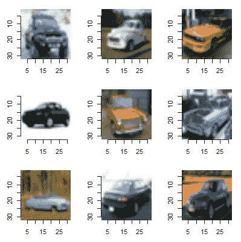
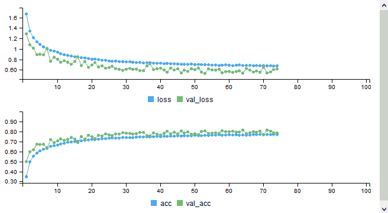
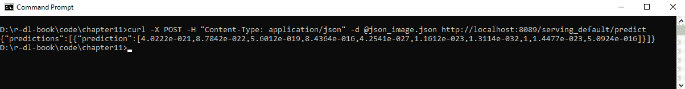

# 十一、深度学习的下一个层次

我们几乎已经走到了 r 的深度学习之旅的终点，这一章的主题有点大杂烩。本章开始时，我们将重温一项图像分类任务，并构建一个完整的图像分类解决方案图像文件而不是表格数据。然后，我们将继续解释迁移学习，您可以在新的数据集上使用现有的模型。接下来我们讨论任何机器学习项目中的一个重要考虑因素——你的模型将如何用于部署，即生产？我们将展示如何创建一个 REST API，允许任何编程语言调用 R 中的深度学习模型来预测新数据。然后，我们将继续简要讨论另外两个深度学习主题:生成对抗网络和强化学习。最后，我们将通过提供一些您可能感兴趣的其他资源来结束本章和本书。

在本章中，我们将讨论以下主题:

*   构建完整的图像分类解决方案
*   ImageNet 数据集
*   迁移学习
*   部署TensorFlow模型
*   生成对抗网络
*   强化学习
*   额外的深度学习资源


# 图像分类模型

我们在第 5 章*中讨论了图像分类，使用卷积神经网络*进行图像分类。在那一章中，我们描述了卷积层和池层，它们对于涉及图像的深度学习任务来说是必不可少的。我们还在一个简单的数据集——MNIST 数据集上建立了一些模型。在这里，我们将看看图像分类中的一些高级主题。首先，我们将使用图像文件作为输入建立一个完整的图像分类模型。我们将看看回调，这是建立复杂的深度学习模型的一个很大的帮助。回调函数将用于将模型持久化(保存)到文件中，该文件稍后将被加载回来。然后我们在下一个例子中使用这个模型，这就是迁移学习。这是在新数据上使用预训练模型中的一些层的地方。


# 构建完整的图像分类解决方案

我们已经构建了一些图像分类模型，但它们使用的是从 Keras 或 CSV 文件加载的 MNIST 数据集。数据总是以表格的形式出现。显然，在大多数情况下，图像不是这样存储的。本节着眼于如何使用一组图像文件建立一个图像分类模型。第一个任务是获取一组图像文件。我们将加载 Keras 中包含的`CIFAR10`数据，并将数据保存为图像文件。然后，我们将使用这些文件来建立深度学习模型。在这个练习之后，你将知道如何使用你自己的图像文件创建深度学习图像分类任务。

本章的深度学习模型并不是一个复杂的模型。重点是展示图像分类任务的数据管道是如何构建的。我们看看如何安排图像文件，如何使用数据扩充，以及如何在训练中使用回调。


# 创建图像数据

第一步是创建图像文件。这个部分的代码在`Chapter11/gen_cifar10_data.R`文件夹中。我们将加载`CIFAR10`数据并将图像文件保存在数据目录中。第一步是创建目录结构。在`CIFAR10`数据集中有 10 个类:我们将保存 8 个类用于建立模型，我们将在后面的部分使用 2 个类(*迁移学习*)。以下代码在`data`下创建以下目录:

*   `cifar_10_images`
*   `cifar_10_images/data1`
*   `cifar_10_images/data2`
*   `cifar_10_images/data1/train`
*   `cifar_10_images/data1/valid`
*   `cifar_10_images/data2/train`
*   `cifar_10_images/data2/valid`

这是 Keras 期望存储图像数据的结构。如果使用这种结构，那么这些图像可以用来在 Keras 中训练模型。在代码的第一部分，我们创建了这些目录:

```
library(keras)
library(imager)
# this script loads the cifar_10 data from Keras
# and saves the data as individual images

# create directories,
# we will save 8 classes in the data1 folder for model building
# and use 2 classes for transfer learning
data_dir <- "../data/cifar_10_images/"
if (!dir.exists(data_dir))
  dir.create(data_dir)
if (!dir.exists(paste(data_dir,"data1/",sep="")))
  dir.create(paste(data_dir,"data1/",sep=""))
if (!dir.exists(paste(data_dir,"data2/",sep="")))
  dir.create(paste(data_dir,"data2/",sep=""))
train_dir1 <- paste(data_dir,"data1/train/",sep="")
valid_dir1 <- paste(data_dir,"data1/valid/",sep="")
train_dir2 <- paste(data_dir,"data2/train/",sep="")
valid_dir2 <- paste(data_dir,"data2/valid/",sep="")

if (!dir.exists(train_dir1))
  dir.create(train_dir1)
if (!dir.exists(valid_dir1))
  dir.create(valid_dir1)
if (!dir.exists(train_dir2))
  dir.create(train_dir2)
if (!dir.exists(valid_dir2))
  dir.create(valid_dir2)
```

在每个训练和有效目录下，每个类别使用一个单独的目录。我们将 8 个级别的图像保存在`data1`文件夹下，将 2 个级别的图像保存在`data2`文件夹下:

```
# load CIFAR10 dataset
c(c(x_train,y_train),c(x_test,y_test)) %<-% dataset_cifar10()
# get the unique categories,
# note that unique does not mean ordered!
# save 8 classes in data1 folder
categories <- unique(y_train)
for (i in categories[1:8])
{
  label_dir <- paste(train_dir1,i,sep="")
  if (!dir.exists(label_dir))
    dir.create(label_dir)
  label_dir <- paste(valid_dir1,i,sep="")
  if (!dir.exists(label_dir))
    dir.create(label_dir)
}
# save 2 classes in data2 folder
for (i in categories[9:10])
{
  label_dir <- paste(train_dir2,i,sep="")
  if (!dir.exists(label_dir))
    dir.create(label_dir)
  label_dir <- paste(valid_dir2,i,sep="")
  if (!dir.exists(label_dir))
    dir.create(label_dir)
}
```

创建目录后，下一步是将图像保存在正确的目录中，我们将在以下代码中完成:

```
# loop through train images and save in the correct folder
for (i in 1:dim(x_train)[1])
{
  img <- x_train[i,,,]
  label <- y_train[i,1]
  if (label %in% categories[1:8])
    image_array_save(img,paste(train_dir1,label,"/",i,".png",sep=""))
  else
    image_array_save(img,paste(train_dir2,label,"/",i,".png",sep=""))
  if ((i %% 500)==0)
    print(i)
}

# loop through test images and save in the correct folder
for (i in 1:dim(x_test)[1])
{
  img <- x_test[i,,,]
  label <- y_test[i,1]
  if (label %in% categories[1:8])
    image_array_save(img,paste(valid_dir1,label,"/",i,".png",sep=""))
  else
    image_array_save(img,paste(valid_dir2,label,"/",i,".png",sep=""))
  if ((i %% 500)==0)
    print(i)
}
```

最后，正如我们之前所做的，我们将进行验证检查，以确保我们的图像是正确的。让我们从一个类别中载入 9 张图片。我们希望检查图像显示是否正确，以及它们是否来自同一个类:

```
# plot some images to verify process
image_dir <- list.dirs(valid_dir1, full.names=FALSE, recursive=FALSE)[1]
image_dir <- paste(valid_dir1,image_dir,sep="")
img_paths <- paste(image_dir,list.files(image_dir),sep="/")

par(mfrow = c(3, 3))
par(mar=c(2,2,2,2))
for (i in 1:9)
{
  im <- load.image(img_paths[i])
  plot(im)
}
```

这会产生以下情节:



图 11.1:cifa r10 图像示例

这个看起来不错！图像显示正确，我们可以看到这些图像似乎都属于同一个类别，即汽车。这些图像是模糊的，但那是因为它们只是尺寸为 32 x 32 的缩略图。


# 构建深度学习模型

一旦运行了上一节中的脚本，您应该在`cifar_10_images/data1/train`目录中有 40，000 个用于训练的图像，在`cifar_10_images/data1/valid`目录中有 8，000 个用于验证的图像。我们将用这些数据训练一个模型。这个部分的代码在`Chapter11/build_cifar10_model.R`文件夹里。第一部分创建模型定义，您应该很熟悉:

```
library(keras)

# train a model from a set of images
# note: you need to run gen_cifar10_data.R first to create the images!
model <- keras_model_sequential()
model %>%
  layer_conv_2d(name="conv1", input_shape=c(32, 32, 3),
    filter=32, kernel_size=c(3,3), padding="same"
  ) %>%
  layer_activation("relu") %>%
  layer_conv_2d(name="conv2",filter=32, kernel_size=c(3,3),
                padding="same") %>%
  layer_activation("relu") %>%
  layer_max_pooling_2d(pool_size=c(2,2)) %>%
  layer_dropout(0.25,name="drop1") %>%

  layer_conv_2d(name="conv3",filter=64, kernel_size=c(3,3),
                padding="same") %>%
  layer_activation("relu") %>%
  layer_conv_2d(name="conv4",filter=64, kernel_size=c(3,3),
                padding="same") %>%
  layer_activation("relu") %>%
  layer_max_pooling_2d(pool_size=c(2,2)) %>%
  layer_dropout(0.25,name="drop2") %>%

  layer_flatten() %>%
  layer_dense(256) %>%
  layer_activation("relu") %>%
  layer_dropout(0.5) %>%
  layer_dense(256) %>%
  layer_activation("relu") %>%
  layer_dropout(0.5) %>%

  layer_dense(8) %>%
  layer_activation("softmax")

model %>% compile(
  loss="categorical_crossentropy",
  optimizer="adam",
  metrics="accuracy"
)
```

模型定义改编自 VGG16 架构，我们将在后面看到。我使用了更少的块和更少的节点。注意最后的密集层必须有 8 个节点，因为在`data1`文件夹中只有 8 个，而不是 10 个类。

下一部分建立一个数据生成器；这样做的目的是在模型被训练时将图像文件批量加载到模型中。我们还可以在数据生成器中对训练数据集应用数据扩充。我们将选择通过随机水平翻转图像、水平/垂直移动图像以及最多旋转图像 15 度来创建人工数据。我们在第 6 章*调整和优化模型*中看到，数据增强可以显著改善现有模型:

```
# set up data generators to stream images to the train function
data_dir <- "../data/cifar_10_images/"
train_dir <- paste(data_dir,"data1/train/",sep="")
valid_dir <- paste(data_dir,"data1/valid/",sep="")

# in CIFAR10
# there are 50000 images in training set
# and 10000 images in test set
# but we are only using 8/10 classes,
# so its 40000 train and 8000 validation
num_train <- 40000
num_valid <- 8000
flow_batch_size <- 50
# data augmentation
train_gen <- image_data_generator(
  rotation_range=15,
  width_shift_range=0.2,
  height_shift_range=0.2,
  horizontal_flip=TRUE,
  rescale=1.0/255)
# get images from directory
train_flow <- flow_images_from_directory(
  train_dir,
  train_gen,
  target_size=c(32,32),
  batch_size=flow_batch_size,
  class_mode="categorical"
)

# no augmentation on validation data
valid_gen <- image_data_generator(rescale=1.0/255)
valid_flow <- flow_images_from_directory(
  valid_dir,
  valid_gen,
  target_size=c(32,32),
  batch_size=flow_batch_size,
  class_mode="categorical"
)
```

一旦设置好数据生成器，我们还将使用两个回调函数。回调函数允许您在执行特定数量的批处理/时期后运行自定义代码。您可以编写自己的回调函数或使用一些预定义的回调函数。之前，我们使用回调来记录指标，但这里回调将实现模型检查点和早期停止，这在构建复杂的深度学习模型时经常使用。

模型检查点用于将模型权重保存到磁盘。然后，您可以将模型从磁盘加载到内存中，并使用它来预测新数据，或者您可以从模型保存到磁盘时开始继续对其进行定型。你可以在每个历元之后保存权重，如果你使用云资源并且担心机器突然终止，这可能是有用的。在这里，我们用它来保持目前为止我们在训练中看到的最好的模型。在每个时期之后，它检查验证损失，如果它低于现有文件中的验证损失，它保存模型。

提前停止允许您在性能不再提高时停止训练模型。一些人将其称为一种正则化形式，因为早期停止可以防止模型过度拟合。虽然它可以避免过度拟合，但它的工作方式与正则化技术非常不同，如 L1、L2、权重衰减和辍学，我们在[第 3 章](6e6dd858-9f00-454a-8434-a95c59e85b25.xhtml) *、深度学习基础*中看到了这些技术。当使用早期停止时，即使性能不再提高，您通常也会允许模型继续几个时期，在停止训练之前允许的时期数在 Keras 中称为*耐心*。这里我们将它设置为 10，也就是说，如果我们有 10 个时期模型没有改进，我们就停止训练。下面是创建我们将在模型中使用的回调的代码:

```
# call-backs
callbacks <- list(
  callback_early_stopping(monitor="val_acc",patience=10,mode="auto"),
  callback_model_checkpoint(filepath="cifar_model.h5",mode="auto",
                            monitor="val_loss",save_best_only=TRUE)
)
```

下面是训练模型的代码:

```
# train the model using the data generators and call-backs defined above
history <- model %>% fit_generator(
  train_flow,
  steps_per_epoch=as.integer(num_train/flow_batch_size),
  epochs=100,
  callbacks=callbacks,
  validation_data=valid_flow,
  validation_steps=as.integer(num_valid/flow_batch_size)
)
```

这里需要注意的一点是，我们必须为训练和验证生成器管理每个时期的步骤。当你设置一个生成器时，你不知道实际上有多少数据，所以我们需要设置每个历元的步数。这就是记录数除以批量大小。

这个模型在 GPU 上训练应该不到一个小时，如果在 CPU 上训练，时间会明显更长。由于模型正在训练，最好的模型保存在`cifar_model.h5`中。我的机器上最好的结果是在 epoch 64 之后，当时验证精度大约是 0.80。在此之后，该模型继续训练另外 10 个时期，但未能改进。以下是培训指标的图表:



图 11.2:模型训练期间的输出指标


# 使用保存的深度学习模型

现在我们已经建立了我们的深度学习模型，我们可以重新启动 R 并从磁盘重新加载模型。这个部分的代码在`Chapter11/use_cifar10_model.R`文件夹中。我们将使用以下代码加载在上一节中创建的模型:

```
library(keras)

# load model trained in build_cifar10_model.R
model <- load_model_hdf5("cifar_model.h5")
```

我们将使用这个模型从验证集中生成一个图像文件的预测。我们将选择验证文件夹中的第一个目录，然后从该文件夹中选择第 7 个文件。我们加载图像，并对其应用与我们在训练期间预处理图像时相同的预处理，即通过将像素值除以 255.0 来归一化数据。以下是加载图像并生成预测的代码:

```
> valid_dir <-"../data/cifar_10_images/data1/valid/"
> first_dir <- list.dirs(valid_dir, full.names=FALSE, recursive=FALSE)[1]
> valid_dir <- paste(valid_dir,first_dir,sep="")
> img_path <- paste(valid_dir,list.files(valid_dir)[7],sep="/")

# load image and convert to shape we can use for prediction
> img <- image_load(img_path, target_size = c(32,32))
> x <- image_to_array(img)
> x <- array_reshape(x, c(1, dim(x)))
> x <- x / 255.0
> preds <- model %>% predict(x)
> preds <- round(preds,3)
> preds
      [,1] [,2] [,3] [,4] [,5] [,6] [,7]  [,8]
[1,] 0.997    0    0    0    0    0    0 0.003
```

该模型以 99.7%的可信度预测输入来自第一类。因为我们选择了验证集中的第一个目录，所以预测是正确的。

我们将对我们的模型做的最后一件事是在图像文件的目录上对它进行评估。我们还将展示如何为图像文件的整个目录生成预测。这段代码使用数据生成器从目录中加载图像，类似于我们训练模型的方式。下面是通过使用我们保存到磁盘的验证图像的模型来评估和预测类别的代码:

```
> valid_dir <-"../data/cifar_10_images/data1/valid/"
> flow_batch_size <- 50
> num_valid <- 8000
> 
> valid_gen <- image_data_generator(rescale=1.0/255)
> valid_flow <- flow_images_from_directory(
   valid_dir,
   valid_gen,
   target_size=c(32,32),
   batch_size=flow_batch_size,
   class_mode="categorical"
 )
> 
> evaluate_generator(model,valid_flow,
   steps=as.integer(num_valid/flow_batch_size))
$`loss`
[1] 0.5331386

$acc
[1] 0.808625
```

验证准确度为`80.86%`，与我们在模型训练期间观察到的相似，这证实了模型被正确保存到磁盘。下面是为所有 8，000 幅验证图像生成预测的代码:

```
> preds <- predict_generator(model,valid_flow,
    steps=as.integer(num_valid/flow_batch_size))
> dim(preds)
[1] 8000 8

> # view the predictions,
> preds <- round(preds,3)
> head(preds)
      [,1]  [,2]  [,3]  [,4]  [,5]  [,6]  [,7]  [,8]
[1,] 0.000 0.000 0.000 0.000 0.000 0.000 0.999 0.001
[2,] 0.000 0.007 0.001 0.002 0.990 0.000 0.000 0.000
[3,] 0.000 0.855 0.069 0.032 0.021 0.017 0.002 0.002
[4,] 0.134 0.001 0.000 0.000 0.000 0.000 0.001 0.864
[5,] 0.011 0.064 0.057 0.226 0.051 0.515 0.004 0.073
[6,] 0.108 0.277 0.135 0.066 0.094 0.091 0.052 0.179
```

我们可以看到，我们的预测输出有 8，000 行和 8 列，因此对于每个验证图像，每个类别都有一个概率。我们可以看到每一行的总和是 1.0，并且通常有一个类具有显著的概率。例如，模型预测第一幅图像以 99.9%的概率属于类别 7。

我们现在已经使用图像文件构建了一个完整的图像分类解决方案。一旦图像数据被存储在相同的目录结构中，该模板可以被重新用于其他任务。如果新任务具有不同数量的类别，那么您需要更改的只是最后一个密集层中的节点数量以及可能的 softmax 激活。然而，如果你有一个新的涉及现实生活图像的图像分类任务，那么你可能会通过使用现有的模型和使用迁移学习获得更好的结果。在我解释如何做到这一点之前，我将提供一些关于 ImageNet 数据集的背景知识，该数据集通常用于训练复杂的模型，然后用于迁移学习。


# ImageNet 数据集

从 2010 年开始，一年一度的图像分类比赛被称为 **ImageNet 大规模视觉识别挑战赛** ( **ILSVRC** )。图像集由超过 1400 万个图像组成，这些图像被标记了超过 1000 个类别。如果没有这个数据集，就不会有今天对深度学习的巨大兴趣。它通过竞赛为深度学习的研究提供了刺激。在 Imagenet 数据集上学习的模型和权重随后通过迁移学习被用于数以千计的其他深度学习模型。ImageNet 的实际历史是一个有趣的故事。下面的链接([https://qz . com/1034972/the-data-that-changed-the-direction-of-ai-research-and-possible-the-world/](https://qz.com/1034972/the-data-that-changed-the-direction-of-ai-research-and-possibly-the-world/))解释了该项目最初是如何受到很少关注的，但随着一系列相关事件的发生，情况发生了变化:

*   ILSVRC 成为研究人员进行图像分类的基准。
*   NVIDIA 发布了允许访问**图形处理器**(**GPU**)的库。GPU 旨在进行大规模并行矩阵运算，这正是创建深度神经网络所需要的。
*   来自多伦多大学的 Geoffrey Hinton、Ilya Sutskever 和 Alex Krizhevsky 创建了一个名为 **AlexNet** 的深度卷积神经网络架构，并在 2012 年的竞赛中获胜。虽然这不是卷积神经网络的第一次使用，但他们的提交以巨大的优势击败了下一种方法。
*   研究人员注意到，当他们使用 ImageNet 数据集训练模型时，他们可以将它们用于其他分类任务。通过使用 ImageNet 模型，然后使用迁移学习，他们几乎总能获得比在原始数据集上从头开始训练模型更好的性能。

图像分类的进步可以从 ILSVRC 竞赛中的一些著名参赛作品中看出:

| **团队** | **年份** | **错误率** |
| 2011 年 ILSVRC 获奖者(非深度学习) | 2011 | 25.8% |
| AlexNet (7 层) | 2012 | 15.3% |
| VGG 网(16 层) | 2014 | 7.32% |
| 谷歌网络/盗梦空间(19 层) | 2014 | 6.67% |
| ResNet (152 层) | 2015 | 3.57% |

VGGNet、Inception 和 Resnet 在 Keras 中都有。可用网络的完整列表可在[https://keras . r studio . com/reference/index . html # section-applications](https://keras.rstudio.com/reference/index.html#section-applications)中找到。

这些网络的模型可以加载到 Keras 中，并用于将新图像分类到 ImageNet 的 1000 个类别中的一个。我们接下来会看这个。如果你有一个新的分类任务，需要一组不同的图像，那么你也可以使用这些网络，然后使用迁移学习，我们将在本章稍后讨论。类别的数量可以不同；您的任务不需要 1000 个类别。

也许最简单的模型是 VGGNet，因为它与我们在[第 5 章](1c0b9897-b0cc-4a8f-9ce8-e6409c347f4f.xhtml)、*使用卷积神经网络的图像分类*中看到的没有太大不同。


# 加载现有模型

在本节中，我们将在 Keras 中加载一个现有的模型(VGGNet ),并使用它来对新图像进行分类。该部分的代码可在`Chapter11/vgg_model.R`中找到。我们将从加载模型并查看其架构开始:

```
> library(keras)
> model <- application_vgg16(weights = 'imagenet', include_top = TRUE)

> summary(model)
_________________________________________________________________________
Layer (type)                     Output Shape                 Param # 
=========================================================================
input_1 (InputLayer)             (None, 224, 224, 3)          0 
_________________________________________________________________________
block1_conv1 (Conv2D)            (None, 224, 224, 64)         1792 
_________________________________________________________________________
block1_conv2 (Conv2D)            (None, 224, 224, 64)         36928 
_________________________________________________________________________
block1_pool (MaxPooling2D)       (None, 112, 112, 64)         0 
_________________________________________________________________________
block2_conv1 (Conv2D)            (None, 112, 112, 128)        73856 
_________________________________________________________________________
block2_conv2 (Conv2D)            (None, 112, 112, 128)        147584 
_________________________________________________________________________
block2_pool (MaxPooling2D)       (None, 56, 56, 128)          0 
_________________________________________________________________________
block3_conv1 (Conv2D)            (None, 56, 56, 256)          295168 
_________________________________________________________________________
block3_conv2 (Conv2D)            (None, 56, 56, 256)          590080 
_________________________________________________________________________
block3_conv3 (Conv2D)            (None, 56, 56, 256)          590080 
_________________________________________________________________________
block3_pool (MaxPooling2D)       (None, 28, 28, 256)          0 
_________________________________________________________________________
block4_conv1 (Conv2D)            (None, 28, 28, 512)          1180160 
_________________________________________________________________________
block4_conv2 (Conv2D)            (None, 28, 28, 512)          2359808 
_________________________________________________________________________
block4_conv3 (Conv2D)            (None, 28, 28, 512)          2359808 
_________________________________________________________________________
block4_pool (MaxPooling2D)       (None, 14, 14, 512)          0 
_________________________________________________________________________
block5_conv1 (Conv2D)            (None, 14, 14, 512)          2359808 
_________________________________________________________________________
block5_conv2 (Conv2D)            (None, 14, 14, 512)          2359808 
_________________________________________________________________________
block5_conv3 (Conv2D)            (None, 14, 14, 512)          2359808 
_________________________________________________________________________
block5_pool (MaxPooling2D)       (None, 7, 7, 512)            0 
_________________________________________________________________________
flatten (Flatten)                (None, 25088)                0 
_________________________________________________________________________
fc1 (Dense)                      (None, 4096)                 102764544 
_________________________________________________________________________
fc2 (Dense)                      (None, 4096)                 16781312 
_________________________________________________________________________
predictions (Dense)              (None, 1000)                 4097000 
=========================================================================
Total params: 138,357,544
Trainable params: 138,357,544
Non-trainable params: 0
_________________________________________________________________________
```

这个模型看起来很复杂，但是当你仔细看的时候，没有什么是我们没见过的。有两个具有两个卷积层的块，然后是最大池层。接着是三个具有三个卷积层的块，然后是最大池层。最后，我们有一个扁平层和三个致密层。最后一个密集层有 1，000 个节点，这是 ImageNet 数据集中的类别数。

让我们用这个模型来预测一个新的图像。这张图片是一辆自行车，尽管很不寻常——这是一辆计时自行车:


图 11.3:分类的测试图像

下面的代码块将图像处理成适合在 VGG 模型中使用的格式。它加载图像并将其调整到用于训练模型`(224, 224)`的图像尺寸。然后，我们必须在调用`predict`函数之前预处理图像数据。最后，Keras 中有一个名为`imagenet_decode_predictions`的辅助函数，我们可以用它来获得预测类别和概率:

```
> img_path <- "image1.jpg"
> img <- image_load(img_path, target_size = c(224,224))
> x <- image_to_array(img)
> x <- array_reshape(x, c(1, dim(x)))
> x <- imagenet_preprocess_input(x)

> preds <- model %>% predict(x)
> imagenet_decode_predictions(preds, top = 5)
[[1]]
  class_name       class_description      score
1  n02835271   bicycle-built-for-two 0.31723219
2  n03792782   mountain_bike         0.16578741
3  n03891332   parking_meter         0.12548350
4  n04485082   tripod                0.06399463
5  n09193705   alp                   0.04852912
```

最高的预测是刚刚超过 30%的`bicycle-built-for-two`，第二好的预测是 16.5%的`mountain_bike`。ImageNet 有一个三轮车和独轮车的类别(甚至还有一辆`Model_T`汽车！)，但似乎没有自行车的类别，所以这个预测是一个不错的结果。然而，`mountain_bike`可能是这张图片更准确的类别，因为它绝对不是两个人的自行车！


# 迁移学习

深度学习相对于传统机器学习的少数缺点之一是它需要大量数据。迁移学习是克服这一点的一种方法，通过使用先前训练的模型(通常在 ImageNet 数据上训练)的权重，然后将它们应用于新的问题集。

ImageNet 数据集由 1，000 类中的 1，500 万幅图像组成。由于我们可以重复使用已经在如此大量的数据上训练过的模型的部分，因此可能只需要每个类别几百张图像就可以训练新的模型。这将取决于图像与原始模型中使用的数据多少有些关系。例如，试图对来自其他领域(例如，卫星或医疗扫描)的数据使用来自 ImageNet 模型(针对照片进行训练)的迁移学习会更加困难，并且需要更多的数据。我们在[第 6 章](13e9a742-84df-48e5-bbfd-ade33dcdd01a.xhtml)、*调优和优化模型*中提出的关于不同数据源的一些问题同样适用。如果数据来自不同类型的数据分布，例如移动图像、偏离中心的照片、不同的照明条件等等，这也很重要。这就是通过数据扩充创建更多合成数据可以带来巨大变化的地方。

我们现在将使用我们在*构建深度学习模型*一节中构建的模型来应用迁移学习。回想一下，在构建和评估这个模型时，我们只使用了 8/10 的类。我们现在将使用迁移学习建立一个新的模型来区分剩下的两个班级。该部分的代码可以在`Chapter11/cifar_txr.R`文件夹中找到:

1.  我们将使用我们在上一节中构建的模型，并使用以下代码加载它:

```
library(keras)

# load model trained in build_cifar10_model.R
model <- load_model_hdf5("cifar_model.h5")
```

2.  接下来，我们将在模型对象上调用`trainable_weights`来获得可训练层数。这将计算我们模型中所有的非激活层。

```
> length(model$trainable_weights)
[1] 14
```

3.  接下来，我们冻结模型中的早期图层。冻结模型中的层意味着权重在反向传播期间不会更新。我们冻结卷积块，但不冻结模型末端的密集层。我们使用在模型定义中设置的名称将第一层和最后一层设置为冻结。
4.  然后我们再次调用模型上的`trainable_weights`来确认数字从之前的值`14`变成了`6`。以下是冻结图层的代码:

```
freeze_weights(model,from="conv1", to="drop2")
length(model$trainable_weights)
[1] 6
```

5.  接下来，我们将通过在下面的代码中调用两次`pop_layer`函数来从我们的模型中移除最后一个密集层和最后一个激活层。我们需要这样做，因为我们的新任务有 2 个类，而不是 8 个:

```
# remove the softmax layer
pop_layer(model)
pop_layer(model)
```

6.  现在，我们可以使用以下代码添加一个包含 2 个节点的新层(因为在新任务中我们有 2 个类):

```
# add a new layer that has the correct number of nodes for the new task
model %>%
  layer_dense(name="new_dense",units=2, activation='softmax')
summary(model)
```

7.  下面的代码块再次编译模型，并设置生成器来加载数据。这与我们构建模型时看到的情况类似。一个不同之处是，我们在这里不使用数据扩充:

```
# compile the model again
model %>% compile(
  loss = "binary_crossentropy",
  optimizer="adam",
  metrics=c('accuracy')
)

# set up data generators to stream images to the train function
data_dir <- "../data/cifar_10_images/"
train_dir <- paste(data_dir,"data2/train/",sep="")
valid_dir <- paste(data_dir,"data2/valid/",sep="")

# in CIFAR10, # there are 50000 images in training set
# and 10000 images in test set
# but we are only using 2/10 classes,
# so its 10000 train and 2000 validation
num_train <- 10000
num_valid <- 2000
flow_batch_size <- 50
# no data augmentation
train_gen <- image_data_generator(rescale=1.0/255)
# get images from directory
train_flow <- flow_images_from_directory(
  train_dir,
  train_gen,
  target_size=c(32,32),
  batch_size=flow_batch_size,
  class_mode="categorical"
)

# no augmentation on validation data
valid_gen <- image_data_generator(rescale=1.0/255)
valid_flow <- flow_images_from_directory(
  valid_dir,
  valid_gen,
  target_size=c(32,32),
  batch_size=flow_batch_size,
  class_mode="categorical"
)
```

8.  最后，我们可以使用以下代码来训练模型:

```
> history <- model %>% fit_generator(
+ train_flow,
+ steps_per_epoch=as.integer(num_train/flow_batch_size),
+ epochs=10,
+ validation_data=valid_flow,
+ validation_steps=as.integer(num_valid/flow_batch_size)
+ )
Found 10000 images belonging to 2 classes.
Found 2000 images belonging to 2 classes.
Epoch 1/10
200/200 [==============================] - 5s 27ms/step - loss: 0.3115 - acc: 0.8811 - val_loss: 0.1529 - val_acc: 0.9425
Epoch 2/10
200/200 [==============================] - 4s 20ms/step - loss: 0.1971 - acc: 0.9293 - val_loss: 0.1316 - val_acc: 0.9550
Epoch 3/10
200/200 [==============================] - 4s 20ms/step - loss: 0.1637 - acc: 0.9382 - val_loss: 0.1248 - val_acc: 0.9540
Epoch 4/10
200/200 [==============================] - 4s 20ms/step - loss: 0.1367 - acc: 0.9497 - val_loss: 0.1200 - val_acc: 0.9575
Epoch 5/10
200/200 [==============================] - 4s 20ms/step - loss: 0.1227 - acc: 0.9543 - val_loss: 0.1148 - val_acc: 0.9605
Epoch 6/10
200/200 [==============================] - 4s 20ms/step - loss: 0.1161 - acc: 0.9559 - val_loss: 0.1110 - val_acc: 0.9625
Epoch 7/10
200/200 [==============================] - 4s 20ms/step - loss: 0.1022 - acc: 0.9622 - val_loss: 0.1118 - val_acc: 0.9620
Epoch 8/10
200/200 [==============================] - 4s 20ms/step - loss: 0.0996 - acc: 0.9655 - val_loss: 0.1068 - val_acc: 0.9645
Epoch 9/10
200/200 [==============================] - 4s 20ms/step - loss: 0.0861 - acc: 0.9687 - val_loss: 0.1095 - val_acc: 0.9655
Epoch 10/10
200/200 [==============================] - 4s 20ms/step - loss: 0.0849 - acc: 0.9696 - val_loss: 0.1189 - val_acc: 0.9620
```

最好的精度是在第 9 纪元时，我们得到了`96.55%`精度。这明显好于我们在多分类模型上得到的结果(大约 81%)，但是二分类任务比多分类任务容易得多。我们还可以看到，该模型的训练速度非常快，因为它只需更新最后几层的权重。


# 部署TensorFlow模型

历史上，使用 R 进行数据科学项目的一个明显缺点是难以部署 R 中内置的机器学习模型。这通常意味着公司主要使用 R 作为原型工具来构建模型，然后用另一种语言重写，如 Java 和. NET。这也是公司转向 Python 进行数据科学的主要原因之一，因为 Python 有更多的*粘合代码*，这允许它与其他编程语言接口。

谢天谢地，这种情况正在改变。RStudio 的一个有趣的新产品叫做 RStudio Connect，它允许公司创建一个平台来共享 R-Shiny 应用程序、R Markdown 中的报告、仪表板和模型。这使得公司可以使用 REST 接口来服务机器学习模型。

我们在本书中创建的 TensorFlow(和 Keras)模型可以在不依赖于 R 或 Python 的情况下部署。一种方法是 TensorFlow Serving，这是一个用于服务 TensorFlow 模型的开源软件库。另一个选择是使用我们在[第十章](2ea4d422-70f7-47af-a330-f0901f6f5fd3.xhtml)中看到的 Google CloudML 接口，在云端运行深度学习模型。这允许您创建一个公共可用的 REST API，可以从您的应用程序中调用它。TensorFlow 模型也可以部署到 iPhones 和 Android 手机上。

对生产中的模型评分有两个基本选项:

*   **批处理模式**:在批处理模式下，一组数据被离线评分，预测结果被存储并在其他地方使用
*   **实时模式**:在实时模式下，数据是即时评分的，一般是一次一条记录，成绩即时使用。

对于许多应用程序，批处理模式已经足够了。你应该仔细考虑你是否真的需要一个实时预测系统，因为它需要更多的资源和持续的监控。成批记录比单独记录更有效。批处理模式的另一个优点是，您可以预先知道对应用程序的需求，并可以相应地计划资源。对于实时系统，需求高峰或拒绝服务攻击会导致预测模型出现问题。

我们已经在本章的*中使用保存的深度学习模型*部分看到了保存的模型的批处理模式。因此，让我们看看如何构建一个 REST 接口，以实时从深度学习模型中获得对新数据的预测。这将使用`tfdeploy`包。该部分的代码可在`Chapter11/deploy_model.R`中找到。我们将基于 MNIST 数据集构建一个简单的模型，然后创建一个 web 界面，我们可以在其中提交新的图像进行分类。下面是构建模型并打印出测试集中前 5 行预测的代码的第一部分:

```
library(keras)
#devtools::install_github("rstudio/tfdeploy")
library(tfdeploy)

# load data
c(c(x_train, y_train), c(x_test, y_test)) %<-% dataset_mnist()

# reshape and rescale
x_train <- array_reshape(x_train, dim=c(nrow(x_train), 784)) / 255
x_test <- array_reshape(x_test, dim=c(nrow(x_test), 784)) / 255

# one-hot encode response
y_train <- to_categorical(y_train, 10)
y_test <- to_categorical(y_test, 10)

# define and compile model
model <- keras_model_sequential()
model %>%
  layer_dense(units=256, activation='relu', input_shape=c(784),name="image") %>%
  layer_dense(units=128, activation='relu') %>%
  layer_dense(units=10, activation='softmax',name="prediction") %>%
  compile(
    loss='categorical_crossentropy',
    optimizer=optimizer_rmsprop(),
    metrics=c('accuracy')
  )

# train model
history <- model %>% fit(
  x_train, y_train,
  epochs=10, batch_size=128,
  validation_split=0.2
)
preds <- round(predict(model, x_test[1:5,]),0)
head(preds)
     [,1] [,2] [,3] [,4] [,5] [,6] [,7] [,8] [,9] [,10]
[1,]    0    0    0    0    0    0    0    1    0     0
[2,]    0    0    1    0    0    0    0    0    0     0
[3,]    0    1    0    0    0    0    0    0    0     0
[4,]    1    0    0    0    0    0    0    0    0     0
[5,]    0    0    0    0    1    0    0    0    0     0
```

这段代码没有什么新内容。接下来，我们将为测试集中的一个图像文件创建一个 JSON 文件。JSON 代表 JavaScript 对象符号，是通过网络连接序列化和发送数据的公认标准。如果说 HTML 是计算机与人之间网络交流的语言，那么 JSON 就是计算机与计算机之间网络交流的语言。它在微服务架构中被大量使用，微服务架构是一个从许多小型 web 服务构建复杂 web 生态系统的框架。JSON 文件中的数据必须应用与训练期间相同的预处理——因为我们规范化了训练数据，所以我们也必须规范化测试数据。下面的代码用测试集中第一个实例的值创建一个 JSON 文件，并将文件保存到`json_image.json`:

```

# create a json file for an image from the test set
json <- "{\"instances\": [{\"image_input\": ["
json <- paste(json,paste(x_test[1,],collapse=","),sep="")
json <- paste(json,"]}]}",sep="")
write.table(json,"json_image.json",row.names=FALSE,col.names=FALSE,quote=FALSE)
```

现在我们有了一个 JSON 文件，让我们为我们的模型创建一个 REST web 接口:

```
export_savedmodel(model, "savedmodel")
serve_savedmodel('savedmodel', browse=TRUE)
```

完成此操作后，将弹出一个新的网页，如下所示:


图 11.4:tensor flow 模型 REST web 服务的 Swagger UI

这是一个展示 TensorFlow 模型的 RESTful web 服务的 Swagger UI 页面。这允许我们测试我们的 API。虽然我们可以尝试使用这个接口，但是使用我们刚刚创建的 JSON 文件更容易。在您的机器上打开命令提示符，浏览到`Chapter11`代码目录，并运行以下命令:

```
curl -X POST -H "Content-Type: application/json" -d @json_image.json http://localhost:8089/serving_default/predict
```

您应该会得到以下响应:



REST web 接口返回带有这些结果的另一个 JSON 字符串。我们可以看到列表中的第 8 个条目是 1.0，所有其他数字都非常小。这与我们在本节开头的代码中看到的第一行的预测相匹配。

我可以想象，一半的人读到这篇文章时对此感到非常兴奋，而另一半人却毫不在乎！真正喜欢这一点的一半人可以看到 R 如何被用来服务于与 web 应用程序接口的模型预测。这为使用 R 提供了巨大的可能性，以前人们认为要么必须使用 Python，要么必须用其他语言重新开发模型。不在乎的那一半人可能从来没有处理过 R 的这些问题，但最终他们也会明白这有多重要！


# 其他深度学习主题

深度学习中备受关注的两个主题是**生成对抗网络(GANs)** 和强化学习。我们只简要介绍这两个主题，由于几个原因，本节没有代码。首先，这两个主题都非常高级，试图创建一个不平凡的用例将需要每个主题的几个章节。其次，强化学习在 R 中没有得到很好的支持，所以创建一个例子会很困难。尽管如此，我还是在书中包含了这两个主题，因为我相信它们是深度学习中重要的新兴领域，你绝对应该知道。


# 生成对抗网络

自深度学习领域最杰出的人物之一 Yann LeCunn 提出切片面包以来，生成竞争网络一直被称为*最酷的东西。如果他相信这一点，那么我们都应该注意！*

本书中的大多数模型都是区分模型，也就是说，我们试图将一个阶级与另一个阶级区分开来。然而，在[第 9 章](e0045e3c-8afd-4e59-be9f-29e652a9a8b1.xhtml)、*异常检测和推荐系统*中，我们在异常检测用例中创建了一个生成模型。这个模型可以创建新的数据，尽管是输入数据的不同表示。创建复杂的生成模型是深度学习中一个非常热门的研究课题。许多人认为，生成模型可以解决深度学习中的许多问题，包括一个最大的问题，即缺乏正确标记的数据。然而在 GANs 之前，很难判断一个生成模型实际上有多好。由伊恩·古德费勒领导的一组研究人员提出了生成对抗网络(GANs)(古德费勒，伊恩等*)生成对抗网络。*神经信息处理系统的进展。2014)可用于创建逼真的人工数据。

在 GANs 中，两个模型被一起训练，第一个是生成模型 G，它创建新数据。第二个模型是判别模型 D，它试图预测一个示例是来自真实数据集，还是由生成模型 g 创建的。GAN 的基本思想是，生成模型试图欺骗判别模型，而判别模型必须试图区分伪数据和真实数据。生成器不断创建新数据并改进其流程，直到判别模型不再能够区分生成的数据和真实训练数据之间的差异。

在论文中，这个过程被比作一个制造假币的团队(生成模型)和试图检测假币的警察(鉴别模型)。这两种模型都在不断改进，直到无法区分假币和真币。

众所周知，甘人很难训练。一篇论文记录了一种在图像数据上训练 GANs 的工作方法，称为他们的方法深度卷积生成对抗网络(拉德福德、亚历克、卢克·梅茨和苏史密斯·钦塔拉。*深度卷积生成对抗网络的无监督表示学习*。arXiv 预印本 arXiv:1511.06434 (2015))。在这篇论文中，他们推荐了一些训练稳定的深度卷积生成对抗网络(DCGANs)的准则:

*   用步长卷积(鉴别器)和分数步长卷积(生成器)替换任何池层。
*   对两种模型都使用 batchnorm。
*   移除深层架构的全连接隐藏层。
*   对于生成器，在输出层使用 tanh 激活，在其他地方使用 ReLU。
*   对于鉴别器，对所有层使用 LeakyReLU 激活。

训练 DCGANs 是一个迭代过程，重复以下步骤:

*   首先，生成器创建一些新的示例。
*   使用真实数据和生成的数据来训练鉴别器。
*   在鉴别器被训练之后，两个模型被一起训练。鉴别器的权重被冻结，但其梯度用于生成器模型中，以便生成器可以更新其权重。

在这个循环中，重要的是一个模型不能支配另一个模型，它们应该一起改进。如果鉴别器太聪明，并且非常确信来自生成器的实例是假的，那么就没有信号传递回生成器，它就不能再改进了。类似地，如果生成器找到一个巧妙的技巧来欺骗鉴别器，它可能会生成过于相似的图像，或者只有一个输入类别的图像，GAN 再次无法改善。这显示了训练任何 GAN 的困难，你必须找到一组为数据工作并保持两个模型同步的参数。DCGAN 论文的作者之一 https://github.com/soumith/ganhacks 提供了一个很好的参考，他建议让 GANs 发挥作用。

GANs 有许多潜在的用例，包括能够用更少的数据进行训练。它们还可以用于预测缺失的数据，例如为模糊的图像/视频增加清晰度。他们在强化学习，我们将在下一节讨论。


# 强化学习

强化学习有一个看似简单的定义:一个主体与其环境交互，并根据其行为的结果改变其行为。这实际上是人类和动物在现实世界中的行为方式，也是为什么许多人认为强化学习是实现人工智能的关键(AGI)。

如果计算机能够像人一样执行复杂的任务，人工通用智能(AGI)将会实现。这也要求计算机能够像人类一样，根据新问题调整现有知识。专家们对 AGI 是否可能存在意见不一。如果我们从[第一章](00c01383-1886-46d0-9435-29dfb3e08055.xhtml) *的第一张图片，开始深度学习*，我们可以看到人工智能的定义(*...由人来执行需要智能的功能*)非常类似于强化学习的定义:


图 11.5:人工智能、机器学习和深度学习之间的关系

大卫·西尔弗(David Silver)是强化学习领域最杰出的人物之一，也是 AlphaGo 的主要参与者之一，他创造了以下公式:

*人工智能=强化学习+深度学习*

强化学习的一个众所周知的例子是一种算法，通过使用图像像素作为算法的输入，它可以比大多数人更好地玩许多 Atari 2600 视频游戏。强化学习算法通过玩游戏数千次，也许数百万次来学习，并学习需要采取什么行动来实现奖励，这可能是收集点数或尽可能长时间地保持其化身活着。也许强化学习中最著名的例子是 AlphaGo，它打败了世界上最好的围棋选手之一。AlphaGo 是一个混合人工系统，由神经网络、强化学习和启发式搜索算法组成。编程让计算机在围棋比赛中获胜要比在国际象棋等其他比赛中获胜困难得多，因为蛮力方法不可行。围棋的另一个问题是评估当前位置的难度。

强化学习的正式定义是代理在时间步 *t* 观察状态*s[t]。当处于状态 *s [t]* 时，代理通过采取行动与其环境进行交互，这意味着代理转换到新状态 *s [t+1]* 。进入一个新状态的运动与一个奖励联系在一起，代理人的目标是学习一个使预期奖励最大化的策略。奖励可以是累积的和/或打折的；例如，近期回报比远期回报更有价值。价值函数是对未来报酬的预测。如果新的状态 *s [t+1]* 只依赖于前一个状态 *s [t]* 和动作 *a [t]* ，那么就变成了马尔可夫过程。然而，强化学习的一个主要问题是奖励可能很少，并且在行动和获得奖励之间可能有很长的延迟。还有一个问题，即时的奖励可能会导致代理人走上一条最终可能具有破坏性的道路。例如，在一个电脑游戏中，代理人可以立即尝试最大化分数，但这最终意味着角色*会更早死去*。在更真实的场景中，例如，一辆自动驾驶汽车，如果目标是快速到达某个位置，那么代理可能会决定危险地驾驶，将乘客和其他道路使用者置于危险之中。*

强化学习的核心要素包括:

*   奖励是代理在短期内可以获得的收益。
*   价值函数是一个代理从当前状态中期望获得的期望回报。价值功能着眼于长期回报/目标，因此这可能意味着采取不会在短期内最大化回报的行动。
*   策略指导代理可以采取的动作，它将状态映射到来自该状态的可能动作。
*   模型是代理与之交互的环境的封装。因此，它是物理世界的不完整表示，但只要它能够准确地模拟给定动作的下一步，并计算奖励，那么它就是可用于强化学习的适当表示。

强化学习中的其他重要机制包括多标签分类、记忆、无监督学习、知识转移(使用从一个问题学到的知识来解决相关问题)、搜索(通过查看所有可能的排列 *x* 移动来选择下一个最佳行动)、多代理 RL 和学会学习。我们不会详细讨论这些任务，有些任务您可能已经很熟悉了。然而，这个列表强调了强化学习的复杂性。

深度学习可以作为强化学习中的一个组件来处理子任务，如对象检测、语音识别、NLP 等。当深度学习用于强化学习的关键组件时，深度学习也可以是强化学习的组成部分，这些组件是价值函数、策略和环境模型。这就是所谓的深度强化学习(deep RL)。例如，通过使用隐藏单元之间的递归连接，Hausknecht 和 Stone 建立了一个深度递归 Q 网络(DRQN)，可以预测计算机游戏 **Pong** 中的球的速度。将深度学习与 RL 联系起来的另一个研究领域是模仿学习。在模仿学习中，一个代理通过观察一个*专家*来学习。这在有延迟回报和很难评估当前职位的情况下特别有用。但是模仿学习可能代价高昂，因此一种方法是使用 GANs 来产生用于强化学习的人工数据。

即使 AlphaGo 成功击败了围棋世界冠军，它也远远没有解决人工通用智能的问题。DeepMind 是一家专注的人工智能公司，他们结合了强化学习、监督学习和树搜索功能方面的专家以及庞大的硬件资源来解决单一问题。AlphaGo 在 3000 万个游戏状态的数据集上进行训练，模拟了数百万场游戏。在围棋上打败世界上最好的棋手之一的版本，用了差不多 2000 个 CPU，300 个 GPU。在它能打败世界冠军之前，它的教练是欧洲冠军，尽管早期版本确实先打败了他。然而，AlphaGo 只解决了一个问题，它甚至不能推广到其他棋盘游戏。因此，它根本无法解决人工智能的问题。

对 AlphaGo 更诚实的评估之一来自安德烈·卡帕西(Andrej Karpathy)，他是深度学习领域的杰出研究人员，目前是特斯拉的人工智能总监。他在 2017 年 AlphaGo 击败排名第一的选手后，在上下文([https://medium . com/@ karpathy/alpha go-in-context-c 47718 CB 95 a 5](https://medium.com/@karpathy/alphago-in-context-c47718cb95a5))中发布了一篇名为 **AlphaGo 的博客。Karpathy 列出了与其他人工智能任务相比，Go 的以下局限性:**

*   这个游戏是完全确定的，也就是说，规则是固定的，事先完全知道。相比之下，大多数现实世界的问题都不是这样
*   博弈是完全可观测的，即所有参与方都知道完整的信息，不存在隐藏变量或状态。
*   游戏有一个离散的行动空间，也就是说，有固定数量的可允许的行动
*   完美的模拟器是存在的，也就是说，你可以在一个安全的空间里，对上百万个例子进行建模。现实生活中的人工智能没有这个。
*   游戏比较短。
*   有以前游戏的历史数据集

如果我们将自动驾驶汽车视为一项人工智能任务，它很可能与这些属性中的任何一项都不匹配。

在与世界冠军的 AlphaGo 游戏中，一个不寻常的怪癖是，它有时会传递本来会占据棋盘空间的移动。作为人类，当我们玩游戏时，我们有时会渴望即时反馈，因此会采取行动来实现短期回报。AlphaGo 被设定为赢得比赛，不管比分差距有多大，所以它非常满足于在比赛期间传递这样的移动。有趣的是，一些围棋专家认为，他们可以通过研究 AlphaGo 的策略来提高自己。我们又回到了起点——人类试图模仿计算机的行为，而计算机又模仿人类的行为。


# 额外的深度学习资源

如果你希望在深度学习方面继续发展，这一部分包括一些建议。我的第一个建议是，确保您已经运行了本书中的所有代码示例。如果你只是阅读这本书而不运行代码，你得到的好处不到 50%。浏览示例，更改代码以尝试并击败我得到的结果，将 MXNet 代码重写为 Keras 代码，等等。

我强烈推荐吴恩达()Coursera 上的*深度学习专精*。不幸的是，它是用 Python 写的，但它仍然是一个很好的资源。同样使用 Python 的还有来自杰瑞米·霍华德的两个关于 fast . ai(【http://www.fast.ai/】)的优秀课程。这两种选择采取了相反的方法:Coursera 上的*深度学习*专业化采取了从理论到实践的自下而上的方法，fast.ai 课程从一开始就向你展示实际例子，只有在之后才向你展示理论。

另一个优秀的资源是 ka ggle([https://www.kaggle.com/competitions](https://www.kaggle.com/competitions))。Kaggle 举办比赛，数据科学家们在机器学习比赛中争夺最佳分数。这些任务中有许多是计算机视觉任务。我不是竞赛的狂热爱好者，因为我认为他们忽略了准备和获取数据集的大量工作，也忽略了模型是如何部署的。然而，Kaggle 的两个显著特点是它的内核和论坛/博客。内核是别人的 Python 或者 R 脚本。这些脚本通常有非常有趣的方法来完成机器学习任务。关注一场比赛并观察其他竞争者如何解决这些问题是非常值得的。第二个显著的特点是 Kaggle 上的论坛/博客。同样，一些有趣的方法会在比赛论坛上讨论，每次比赛后，通常会有一个获胜比赛的博客帖子讨论他们赢得比赛的方法。

回到 R，另一个很棒的资源是 RStudio 网站。这些人在保持 R 与数据科学和机器学习相关方面做了出色的工作。RStudio 将大量输出放回 R 生态系统；比如他们的首席科学家哈德利·韦翰的出色工作。RStudio 的创始人(J.J. Allaire)是 R API 的 to TensorFlow 和 Keras 的作者。我们在本书中使用了他们的一些优秀工具，包括 RStudio IDE、RShiny、RMarkdown、the tidy universe of packages 等等。这里有一些你应该看看的例子链接:

*   [https://keras.rstudio.com/](https://keras.rstudio.com/)
*   https://keras.rstudio.com/articles/examples/index.html
*   【https://tensorflow.rstudio.com/ 
*   [https://tensorflow.rstudio.com/tfestimators/](https://tensorflow.rstudio.com/tfestimators/)
*   [https://tensorflow.rstudio.com/tensorflow/](https://tensorflow.rstudio.com/tensorflow/)
*   [https://tensorflow.rstudio.com/tools/](https://tensorflow.rstudio.com/tools/)
*   [https://tensorflow.rstudio.com/learn/resources.html](https://tensorflow.rstudio.com/learn/resources.html)

我最后的建议是看研究论文。以下是一些好的论文:

*   克里日夫斯基、亚历克斯、伊利亚·苏茨基弗和杰弗里·e·辛顿。*深度卷积神经网络的 ImageNet 分类*。神经信息处理系统进展。2012.
*   Szegedy，Christian 等人*用卷积进行深入研究*。Cvpr，2015。
*   LeCun，Yann 等*分类的学习算法:手写数字识别的比较*。神经网络:统计力学观点 261 (1995): 276。
*   泽勒，马修 d 和罗布弗格斯。可视化和理解卷积网络。欧洲计算机视觉会议。施普林格，查姆，2014 年。
*   Srivastava，Nitish 等人*辍学:防止神经网络过拟合的简单方法*。《机器学习研究杂志》15.1 (2014): 1929-1958。
*   西蒙扬，凯伦和安德鲁·齐泽曼。*用于大规模图像识别的极深度卷积网络*。arXiv 预印本 arXiv:1409.1556 (2014)。
*   Szegedy，Christian，等人*用卷积深入研究*。IEEE 计算机视觉和模式识别会议录。2015.
*   何，，等*用于图像识别的深度残差学习*。IEEE 计算机视觉和模式识别会议录。2016.
*   Goodfellow，Ian，et al. *生成对抗网*。神经信息处理系统进展。2014.
*   勒昆、扬恩、约舒阿·本吉奥和杰弗里·辛顿。深度学习。性质 521.7553 (2015): 436。
*   戈德堡，你好。*自然语言处理神经网络模型入门*。人工智能研究杂志 57 (2016): 345-420。


# 摘要

在这一章中，读者已经看到了一些先进的深度学习技术。首先，我们看了一些图像分类模型和一些历史模型。接下来，我们将带有预训练权重的现有模型加载到 R 中，并使用它对新图像进行分类。我们研究了迁移学习，它允许我们重用现有模型作为基础，为新数据建立深度学习模型。我们建立了一个图像分类器模型，可以对图像文件进行训练。这个模型还向我们展示了如何使用数据增强和回调，这在许多深度学习模型中使用。最后，我们演示了如何在 R 中构建一个模型，并为预测 API 创建一个 REST 端点，该 API 可以在其他应用程序中使用，也可以跨 web 使用。

我们已经看完了这本书，我真的希望它对你有用。对于数据科学来说，r 是一种很棒的语言，我相信它比主要的替代语言 Python 更容易使用，并且允许你更快地开发机器学习原型。现在它已经支持 MXNet，Keras 和 TensorFlow 中一些优秀的深度学习框架，我相信 R 将继续成为数据科学家和机器学习实践者的优秀选择。