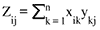
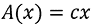
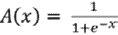
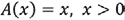
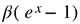
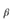
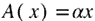
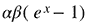
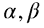
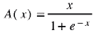

# 1。TensorFlow 机器学习简介

概观

在本章中，您将学习如何使用 TensorFlow: tensors 创建、利用和应用线性变换到编程的基本构件。然后你将利用张量来理解与神经网络相关的复杂概念，包括张量整形、转置和乘法。

# 简介

**机器学习** ( **ML** )已经渗透到很多人不知道的日常生活的各个方面。从你日常社交媒体的推荐到你在线搜索的结果，它们都是由机器学习算法驱动的。这些算法开始于解决利基问题的研究环境，但随着它们的可访问性扩大，它们的应用也扩大到了更广泛的用例。所有类型的研究人员和企业都认识到使用模型来优化各自运营的各个方面的价值。医生可以使用机器学习来决定诊断和治疗方案，零售商可以使用 ML 在正确的时间将正确的产品送到他们的商店，娱乐公司可以使用 ML 向他们的客户提供个性化的推荐。

在数据时代，机器学习模型已被证明是任何数据驱动型公司的宝贵资产。大量可用的数据允许创建强大而精确的模型来完成各种任务，从回归到分类、推荐到时间序列分析，甚至生成艺术，其中许多将在本次研讨会中讨论。所有这些都可以用 TensorFlow 来构建、训练和部署。

TensorFlow API 具有大量的功能，这使得它在所有构建机器学习模型或使用张量(多维数值数组)的机器学习从业者中很受欢迎。对于研究人员来说，TensorFlow 由于其高级定制和灵活性，是创建新的机器学习应用程序的合适选择。对于开发人员来说，TensorFlow 是机器学习库的绝佳选择，因为它可以轻松地将模型从开发环境部署到生产环境。结合起来，TensorFlow 的灵活性和易于部署性使该库成为许多寻求使用各种不同数据源构建高性能机器学习模型并在生产环境中复制学习结果的从业者的明智选择。

本章提供了 tensor flow API 的实用介绍。您将学习如何执行与机器学习相关的数学运算，这将为您使用 TensorFlow 构建高性能 ML 模型打下坚实的基础。您将首先学习基本操作，例如如何使用 API 创建变量。接下来，您将学习如何执行线性变换，如加法，然后再继续更高级的任务，包括张量乘法。

# 在 TensorFlow 中实现人工神经网络

TensorFlow 提供的高级灵活性非常适合创建**人工神经网络**(**ann**)。人工神经网络是受大脑中神经元连通性启发的算法，旨在复制人类学习的过程。它们由层组成，信息通过这些层从输入传播到输出。

*图 1.1* 显示了人工神经网络的可视化表示。输入层位于左侧，在本例中，它有两个特征(`X` 1 和`X` 2)。输入层连接到第一个隐藏层，它有三个单元。来自前一层的所有数据被传递到第一个隐藏层中的每个单元。然后，数据被传递到第二个隐藏层，它也有三个单元。同样，来自前一层的每个单元的信息被传递到第二隐藏层的每个单元。最后，来自第二个隐藏层的所有信息被传递到输出层，该层有一个单元，代表每组输入要素的一个数字。


图 1.1:具有两个隐藏层的人工神经网络的可视化表示

人工神经网络已被证明在学习大型非结构化数据集(如音频、图像和文本数据)的复杂和非线性关系方面是成功的。虽然结果可能令人印象深刻，但人工神经网络的配置有很大的可变性。例如，层数、每层的大小以及应该使用哪个非线性函数是决定 ann 配置的一些因素。TensorFlow 提供的类和函数不仅非常适合构建和训练 ann，而且该库还提供了一套工具来帮助在训练过程中可视化和调试 ann。

与传统的机器学习算法(如线性和逻辑回归)相比，当提供大量数据时，人工神经网络可以胜过它们。人工神经网络是有利的，因为它们可以输入非结构化数据，并且不一定需要特征工程。数据预处理可能是一个耗时的过程。因此，如果有大量的数据，许多从业者更喜欢人工神经网络。

各行各业的许多公司都利用 TensorFlow 为其应用构建人工神经网络。由于 TensorFlow 得到了谷歌的支持，该公司将该库用于其大部分机器学习应用程序的研究、开发和生产。然而，还有许多其他公司也使用该库。Airbnb、可口可乐、优步和通用电气医疗保健等公司都利用该图书馆完成各种任务。人工神经网络的使用特别有吸引力，因为如果有足够的数据和适当的训练，它们可以达到非常高的精度。例如，GE Healthcare 使用 TensorFlow 构建人工神经网络来识别特定的解剖结构，而不管磁共振图像的方向如何，以提高速度和准确性。通过使用人工神经网络，他们可以在几秒钟内达到 99%以上的识别解剖结构的准确性，而不管头部旋转，否则将需要一名训练有素的专业人员花费更多的时间。

虽然使用人工神经网络的公司数量巨大，但人工神经网络可能不是解决所有商业问题的最合适的选择。在这种环境下，您必须回答以下问题，以确定人工神经网络是否是最合适的选择:

*   这个问题有数值解吗？包括 ann 在内的机器学习算法，根据输入数据生成预测的数值结果。例如，机器学习算法可以预测给定数量，例如给定位置和先前天气条件的城市的温度，或者给定先前股票价格的股票价格，或者将图像标记到给定数量的类别中。在每一个例子中，都会根据提供的数据生成一个数字输出，如果有足够多的标记数据，模型可以运行得很好。然而，当期望的结果更抽象，或者需要创造性时，例如创作一首新歌，那么机器学习算法可能不是最合适的选择，因为可能没有明确定义的数值解。
*   **有足够的适当标记的数据来训练一个模型吗？**对于有监督的学习任务，你必须至少有一些带标签的数据来训练一个模型。例如，如果要建立一个模型来预测给定公司的金融股票数据，首先需要历史培训数据。如果问题公司上市时间不长，可能没有足够的培训数据。人工神经网络通常需要大量数据。当处理图像时，人工神经网络通常需要数百万个训练样本来开发精确、鲁棒的模型。当决定哪种算法适合于给定的任务时，这可能是要考虑的决定性因素。

现在你已经知道 TensorFlow 是什么了，考虑 TensorFlow 的以下优点和缺点。

## 张量流的优势

以下是使用 TensorFlow 的一些主要优势，许多从业者在决定是否将该库用于机器学习目的时会考虑这些优势:

*   **库管理**:有一个庞大的从业者社区维护 TensorFlow 库，通过频繁的新发布来保持库的更新，以帮助修复错误，添加新的函数和类来反映该领域的最新进展，并添加对多种编程语言的支持。
*   **流水线** : TensorFlow 支持端到端的模型生产，从支持 GPU 处理的高度并行化环境中的模型开发到一套模型部署工具。还有，TensorFlow 中有轻量级的库，用于在移动和嵌入式设备上部署训练好的 TensorFlow 模型，比如**物联网** ( **IoT** )设备。
*   **社区支持**:使用和支持该库的从业者社区是巨大的，他们相互支持，正因为如此，那些刚接触该库的从业者很容易获得他们想要的结果。
*   **开源** : TensorFlow 是一个开源库，它的代码库可供任何人使用，并针对自己的应用进行修改。
*   **支持多种语言**:虽然这个库原本是为 Python 设计的，但是现在可以用 JavaScript 来训练和部署模型。

## 张量流的缺点

以下是使用 TensorFlow 的一些缺点:

*   **计算速度**:由于 TensorFlow 的主要编程语言是 Python，所以这个库的计算速度不如其他语言(如 C++)的速度快。
*   **陡峭的学习曲线**:与其他机器学习库(如 Keras)相比，学习曲线更加陡峭，这使得新手在给定示例代码之外创建自己的模型具有挑战性。

现在您已经理解了什么是 TensorFlow，下一节将演示如何使用 Python 来使用 TensorFlow 库。

# Python 中的 TensorFlow 库

通过导入某些库，可以在 Python 中使用 TensorFlow。您可以使用`import`语句导入 Python 中的库:

```
import tensorflow as tf
```

在前面的命令中，您已经导入了 TensorFlow 库，并使用了简写方式`tf`。

在下一个练习中，您将学习如何导入 TensorFlow 库并检查其版本，以便您可以利用该库提供的类和函数，这是使用该库时重要且必要的第一步。

## 练习 1.01:验证您的 TensorFlow 版本

在本练习中，您将加载 TensorFlow 并检查您的系统上安装了哪个版本。

执行以下步骤:

1.  打开一个 Jupyter 笔记本，通过在终端中键入`jupyter notebook`来实现这个练习。
2.  通过在 Jupyter 单元格中输入以下代码来导入 TensorFlow 库:

    ```
    import tensorflow as tf
    ```

3.  Verify the version of TensorFlow using the following command:

    ```
    tf.__version__
    ```

    这将导致以下输出:

    ```
    '2.6.0'
    ```

    从前面的输出可以看出，TensorFlow 的版本是`2.6.0`。

    注意

    如果您没有使用*前言*中提供的步骤设置环境，系统上的版本可能会有所不同。

在本练习中，您成功导入了 TensorFlow。您还检查了系统上安装了哪个版本的 TensorFlow。

这项任务可以在 Python 中的任何导入库上完成，对于调试和引用文档非常有用。

使用 TensorFlow 的潜在应用有很多，它已经取得了令人印象深刻的成果，例如 Airbnb 和 GE Healthcare 等公司的成果，Airbnb 使用 TensorFlow 对其平台上的图像进行分类，GE health care 使用 TensorFlow 在磁共振成像上识别大脑的解剖结构。要学习如何为自己的应用创建强大的模型，首先必须学习基本的数学原理和运算，这些原理和运算构成了可以在 TensorFlow 中实现的机器学习模型。数学运算可能会让新用户望而生畏，但是全面理解它们是如何操作的是制作高性能模型的关键。

# 张量简介

张量可以被认为是人工神经网络的核心组件，在整个训练过程中学习的输入数据、输出预测和权重都是张量。信息通过一系列线性和非线性变换传播，将输入数据转化为预测。本节演示了如何对张量应用线性变换，如加法、转置和乘法。还存在其他线性变换，如旋转、反射和剪切。然而，它们在人工神经网络中的应用并不常见。

## 标量、向量、矩阵和张量

张量可以表示为多维数组。张量跨越的维数称为张量的秩。秩为`0`、`1`和`2`的张量经常被使用，并且有它们自己的名字，分别是**标量**、**向量**和**矩阵**，尽管术语*张量*可以用来描述它们中的每一个。*图 1.2* 显示了各种秩的张量的一些例子。从左到右是标量、向量、矩阵和三维张量，其中每个元素代表一个不同的数，下标代表元素在张量中的位置:


图 1.2:标量、向量、矩阵和张量的可视化表示

标量、向量、矩阵和张量的正式定义如下:

*   **标量**:标量由单个数字组成，使其成为零维数组。它是零阶张量的一个例子。标量没有任何轴。例如，一个对象的宽度是一个标量。
*   **向量**:向量是一维数组，是一阶张量的一个例子。它们可以被认为是值的列表。向量有一个轴。由宽度、高度和深度表示的给定对象的大小是向量场的一个例子。
*   **矩阵**:矩阵是有两个轴的二维数组。它们是二阶张量的一个例子。矩阵可以用来存储几个物体的大小。矩阵的每个维度包括每个对象的大小(宽度、高度、深度),另一个矩阵维度用于区分对象。
*   `3`以上。张量可以用来存储许多物体的大小和它们随时间的位置。矩阵的第一维包括每个对象的大小(宽度、高度、深度)，第二维用于区分对象，第三维描述这些对象随时间的位置。

可以使用 TensorFlow 库中的`Variable`类创建张量，并传递一个表示张量的值。标量可以传递浮点或整数，向量可以传递浮点或整数列表，矩阵可以传递浮点或整数嵌套列表，等等。以下命令演示了`Variable`类的使用，其中传递了张量的预期值列表以及需要明确定义的任何其他属性:

```
tensor1 = tf.Variable([1,2,3], dtype=tf.int32, \
                      name='my_tensor', trainable=True)
```

得到的`Variable`对象有几个可能被经常调用的属性，如下所示:

*   `dtype`:对象的数据类型`Variable`(对于上面定义的张量，数据类型为`tf.int32`)。该属性的默认值由传递的值决定。
*   `shape`:物体的`Variable`的维数和各维的长度(对于上面定义的张量，形状为`[3]`)。该属性的默认值也由传递的值决定。
*   `name`:物体的名称`Variable`(对于上面定义的张量，张量的名称定义为`'my_tensor'`)。该属性的默认值为`Variable`。
*   `trainable`: This attribute indicates whether the `Variable` object can be updated during model training (for the tensor defined above, the `trainable` parameter is set to `true`). The default for this attribute is `true`.

    注意

    你可以在这里阅读更多关于`Variable`物体的属性:[https://www.tensorflow.org/api_docs/python/tf/Variable](https://www.tensorflow.org/api_docs/python/tf/Variable)。

`Variable`对象的`shape`属性可以如下调用:

```
tensor1.shape
```

`shape`属性给出了张量的形状，即它是标量、矢量、矩阵等等。前面命令的输出将是`[3]`,因为张量有一个一维，沿该维有三个值。

张量的秩可以在 TensorFlow 中使用`rank`函数来确定。可以通过将张量作为单个参数传递给函数来使用它，结果将是一个整数值:

```
tf.rank(tensor1)
```

以下命令的输出将是一个表示输入秩的零维整数张量。在这种情况下，`tensor1`的秩将是`1`，因为张量只有一维。

在下面的练习中，您将学习如何使用 TensorFlow 的`Variable`类创建各种等级的张量。

## 练习 1.02:在 TensorFlow 中创建标量、向量、矩阵和张量

A 区和 B 区三个不同政党的不同候选人的投票情况如下:


图 1.3:A 区和 B 区三个不同政党的不同候选人的投票情况

您需要执行以下操作:

*   创建一个标量来存储`A`区`X`政党`Candidate 1`的选票，即`4113`，并检查其形状和排名。
*   创建一个向量来表示地区`A`中政党`X`的三个不同候选人的投票比例，并检查其形状和等级。
*   创建一个矩阵来代表政党`X`和`Y`的三个不同候选人的投票，并检查其形状和等级。
*   创建一个张量来代表三个政党在两个不同地区的三个不同候选人的投票，并检查其形状和等级。

执行以下步骤来完成本练习:

1.  导入张量流库:

    ```
    import tensorflow as tf
    ```

2.  Create an integer variable using TensorFlow's `Variable` class and pass `4113` to represent the number of votes cast for a particular candidate. Also, pass `tf.int16` as a second argument to ensure that the input number is an integer datatype. Print the result:

    ```
    int_variable = tf.Variable(4113, tf.int16)
    int_variable
    ```

    这将导致以下输出:

    ```
    <tf.Variable 'Variable:0' shape=() dtype=int32, numpy=4113>
    ```

    在这里，您可以看到所创建变量的属性，包括名称、`Variable:0`、形状、数据类型和张量的 NumPy 表示。

3.  Use TensorFlow's `rank` function to print the rank of the variable created:

    ```
    tf.rank(int_variable)
    ```

    这将导致以下输出:

    ```
    <tf.Tensor: shape=(), dtype=int32, numpy=0>
    ```

    从张量的 NumPy 表示中可以看出，所创建的整数变量的秩是`0`。

4.  Access the integer variable of the rank by calling the `numpy` attribute:

    ```
    tf.rank(int_variable).numpy()
    ```

    这将导致以下输出:

    ```
    0
    ```

    标量的秩是`0`。

    注意

    可以调用`rank`函数结果的所有属性，包括`shape`和`dtype`属性。

5.  Call the `shape` attribute of the integer to find the shape of the tensor:

    ```
    int_variable.shape
    ```

    这将导致以下输出:

    ```
    TensorShape([])
    ```

    前面的输出表明张量的形状没有大小，它代表一个标量。

6.  Print the `shape` of the scalar variable as a Python list:

    ```
    int_variable.shape.as_list()
    ```

    这将导致以下输出:

    ```
    []
    ```

7.  Create a `vector` variable using TensorFlow's `Variable` class. Pass a list for the vector to represent the proportion of votes cast for three different candidates, and pass in a second argument for the datatype as `tf.float32` to ensure that it is a `float` datatype. Print the result:

    ```
    vector_variable = tf.Variable([0.23, 0.42, 0.35], \
                                  tf.float32)
    vector_variable
    ```

    这将导致以下输出:

    ```
    <tf.Variable 'Variable:0' shape(3,) dtype=float32, 
    numpy=array([0.23, 0.42, 0.35], dtype=float32)>
    ```

    您可以看到 shape 和 NumPy 属性不同于前面创建的标量变量。形状现在是`(3,)`，表示张量是一维的，沿着那个维度有三个元素。

8.  Print the rank of the `vector` variable using TensorFlow's `rank` function as a NumPy variable:

    ```
    tf.rank(vector_variable).numpy()
    ```

    这将导致以下输出:

    ```
    1
    ```

    这里可以看到向量变量的秩是`1`，确认这个变量是一维的。

9.  Print the shape of the `vector` variable as a Python list:

    ```
    vector_variable.shape.as_list()
    ```

    这将导致以下输出:

    ```
    [3]
    ```

10.  Create a matrix variable using TensorFlow's `Variable` class. Pass a list of lists of integers for the matrix to represent the votes cast for three different candidates in two different districts. This matrix will have three columns representing the candidates, and two rows representing the districts. Pass in a second argument for the datatype as `tf.int32` to ensure that it is an integer datatype. Print the result:

    ```
    matrix_variable = tf.Variable([[4113, 7511, 6259], \
                                   [3870, 6725, 6962]], \
                                  tf.int32)
    matrix_variable
    ```

    这将导致以下输出:

    

    图 1.4:张量流变量的输出

11.  Print the rank of the matrix variable as a NumPy variable:

    ```
    tf.rank(matrix_variable).numpy()
    ```

    这将导致以下输出:

    ```
    2
    ```

    这里可以看到矩阵变量的秩是`2`，证实了这个变量是二维的。

12.  Print the shape of the matrix variable as a Python list:

    ```
    matrix_variable.shape.as_list()
    ```

    这将导致以下输出:

    ```
    [2, 3]
    ```

13.  Create a tensor variable using TensorFlow's `Variable` class. Pass in a triple nested list of integers for the tensor to represent the votes cast for three different candidates in two different districts, for three political parties. Print the result:

    ```
    tensor_variable = tf.Variable([[[4113, 7511, 6259], \
                                    [3870, 6725, 6962]], \
                                   [[5102, 7038, 6591], \
                                    [3661, 5901, 6235]], \
                                   [[951, 1208, 1098], \
                                    [870, 645, 948]]])
    tensor_variable
    ```

    这将导致以下输出:

    

    图 1.5:张量流变量的输出

14.  Print the rank of the tensor variable as a NumPy variable:

    ```
    tf.rank(tensor_variable).numpy()
    ```

    这将导致以下输出:

    ```
    3
    ```

    这里可以看到张量变量的秩是`3`，证实了这个变量是三维的。

15.  Print the shape of the tensor variable as a Python list:

    ```
    tensor_variable.shape.as_list()
    ```

    这将导致以下输出:

    ```
    [3, 2, 3]
    ```

    结果表明，所得张量的形状是一个列表对象。

在本练习中，您已经使用 TensorFlow 的`Variable`类从政治投票数据中成功创建了各种等级的张量。首先，您创建了标量，它是秩为`0`的张量。接下来，您创建了向量，这是一个秩为`1`的张量。然后矩阵被创建，它是秩为`2`的张量。最后，创建了等级为`3`或更高的张量。您确认了使用 TensorFlow 的`rank`函数创建的张量的等级，并通过调用张量的`shape`属性验证了它们的形状。

在下一节中，您将使用张量加法合并张量以创建新的张量。

# 张量加法

张量可以加在一起创建新的张量。你将在本章中使用矩阵的例子，但是这个概念可以扩展到任何秩的张量。在称为广播的过程中，矩阵可以在一定条件下添加到标量、向量和其他矩阵中。播是指对不同形状的张量进行数组运算的过程。

如果两个矩阵具有相同的形状，它们可以相加(或相减)。对于这种矩阵-矩阵相加，结果矩阵由输入矩阵的元素相加来确定。因此，合成矩阵将具有与两个输入矩阵相同的形状。可以将矩阵`Z = [Z` ij `]`定义为矩阵和`Z = X + Y`，其中`z`ij =`x`ij`+`ij`y`ij 和`Z`中的每个元素都是`X`和`Y`中相同元素的和。

矩阵加法是可交换的，也就是说`X`和`Y`的顺序并不重要，也就是`X + Y = Y + X`。矩阵加法也是关联的，这意味着即使加法的顺序不同，或者即使运算应用多次，也能获得相同的结果，即`X + (Y + Z) = (X + Y) + Z`。

同样的矩阵加法原理也适用于标量、向量和张量。下图显示了一个示例:


图 1.6:矩阵-矩阵相加的可视化示例

标量也可以添加到矩阵中。这里，矩阵的每个元素被单独添加到标量中，如图*图 1.7* 所示:


图 1.7:矩阵标量加法的可视化例子

加法是一种重要的变换，可以应用于张量，因为这种变换经常发生。例如，开发人工神经网络的一个常见转换是向层添加一个偏差。这是当一个相同大小的神经网络层的常数张量阵列被添加到该层。因此，了解如何以及何时将这个看似简单的变换应用于张量是很重要的。

张量加法可以在 TensorFlow 中执行，方法是使用`add`函数并将张量作为参数传入，或者简单地使用如下的`+`运算符:

```
tensor1 = tf.Variable([1,2,3])
tensor2 = tf.Variable([4,5,6])
tensor_add1 = tf.add(tensor1, tensor2)
tensor_add2 = tensor1 + tensor2
```

在下面的练习中，您将在 TensorFlow 中对标量、向量和矩阵执行张量加法。

## 练习 1.03:在 TensorFlow 中执行张量加法

A 区和 B 区三个不同政党的不同候选人的投票情况如下:


图 1.8:A 区和 B 区三个不同政党的不同候选人的投票情况

你的必要任务如下:

*   存储 a 区政党 X 的总投票数。
*   存储 a 区每个政党的总投票数。
*   存储两个地区中每个政党的投票总数。

执行以下步骤来完成练习:

1.  导入张量流库:

    ```
    import tensorflow as tf
    ```

2.  使用 TensorFlow 的`Variable`类创建三个标量变量，以表示投给 A 区政党 X 的三名候选人的选票:

    ```
    int1 = tf.Variable(4113, tf.int32) int2 = tf.Variable(7511, tf.int32) int3 = tf.Variable(6529, tf.int32)
    ```

3.  创建一个新变量来存储 A 区政党 X 的总投票数:

    ```
    int_sum = int1+int2+int3
    ```

4.  Print the result of the sum of the two variables as a NumPy variable:

    ```
    int_sum.numpy()
    ```

    这将导致以下输出:

    ```
    18153
    ```

5.  创建三个向量来表示 A 区不同政党的投票数，每个向量有一行三列:

    ```
    vec1 = tf.Variable([4113, 3870, 5102], tf.int32) vec2 = tf.Variable([7511, 6725, 7038], tf.int32) vec3 = tf.Variable([6529, 6962, 6591], tf.int32)
    ```

6.  创建一个新变量来存储 A 区每个政党的总票数:

    ```
    vec_sum = vec1 + vec2 + vec3
    ```

7.  Print the result of the sum of the two variables as a NumPy array:

    ```
    vec_sum.numpy()
    ```

    这将导致以下输出:

    ```
    array([18153, 17557, 18731])
    ```

8.  Verify that the vector addition is as expected by performing the addition of each element of the vector:

    ```
    print((vec1[0] + vec2[0] + vec3[0]).numpy())
    print((vec1[1] + vec2[1] + vec3[1]).numpy())
    print((vec1[2] + vec2[2] + vec3[2]).numpy())
    ```

    这将导致以下输出:

    ```
    18153
    17557
    18731
    ```

    您可以看到，对三个向量的`+`操作只是向量的元素相加。

9.  创建三个矩阵来存储每个地区每个政党候选人的选票:

    ```
    matrix1 = tf.Variable([[4113, 3870, 5102], \                        [3611, 951, 870]], tf.int32) matrix2 = tf.Variable([[7511, 6725, 7038], \                        [5901, 1208, 645]], tf.int32) matrix3 = tf.Variable([[6529, 6962, 6591], \                        [6235, 1098, 948]], tf.int32)
    ```

10.  Verify that the three tensors have the same shape:

    ```
    matrix1.shape == matrix2.shape == matrix3.shape
    ```

    这将导致以下输出:

    ```
    True
    ```

11.  创建一个新变量来存储两个地区中每个政党的投票总数:

    ```
    matrix_sum = matrix1 + matrix2 + matrix3
    ```

12.  Print the result of the sum of the two variables as a NumPy array:

    ```
    matrix_sum.numpy()
    ```

    这将产生以下输出，代表各地区每个候选人和每个政党的总票数:

    

    图 1.9:矩阵求和作为一个 NumPy 变量的输出

13.  Verify that the tensor addition is as expected by performing the addition of each element of the vector:

    ```
    print((matrix1[0][0] + matrix2[0][0] + matrix3[0][0]).numpy())
    print((matrix1[0][1] + matrix2[0][1] + matrix3[0][1]).numpy())
    print((matrix1[0][2] + matrix2[0][2] + matrix3[0][2]).numpy())
    print((matrix1[1][0] + matrix2[1][0] + matrix3[1][0]).numpy())
    print((matrix1[1][1] + matrix2[1][1] + matrix3[1][1]).numpy())
    print((matrix1[1][2] + matrix2[1][2] + matrix3[1][2]).numpy())
    ```

    这将导致以下输出:

    ```
    18153
    17557
    18731
    15747
    3257
    2463
    ```

    你可以看到,`+`操作相当于三个矩阵的元素相加。

在本练习中，您成功地对代表政治候选人投票的数据执行了张量加法。可通过使用`+`操作来应用转换。您还验证了加法是逐元素执行的，并且确保变换有效的一种方法是张量具有相同的秩和形状。

在下面的活动中，您将在 TensorFlow 中进一步练习张量加法。

## 活动 1.01:在 TensorFlow 中执行张量加法

您所在的公司有三个分支机构，每个分支机构有两名销售人员，每个分支机构销售三种产品。您需要对张量求和，以表示各地区每种产品的总收入。


图 1.10:每个销售人员在不同地点销售的不同产品的数量

您将采取的步骤如下:

1.  导入 TensorFlow 库。
2.  使用 TensorFlow 的`Variable`类创建两个标量来表示所有销售人员在`Location X`的`Product A`总收入。第一个变量的值为`2706`，第二个变量的值为`2386`。
3.  Create a new variable as the sum of the scalars and print the result.

    您应该得到以下输出:

    ```
    5092
    ```

4.  使用 TensorFlow 的`Variable`类创建一个值为`[2706, 2799, 5102]`的向量和一个值为`95`的标量。
5.  Create a new variable as the sum of the scalar with the vector to represent the sales goal for `Salesperson 1` at `Location X` and print the result.

    您应该得到以下输出:

    

    图 1.11:整数向量求和作为 NumPy 变量的输出

6.  使用 TensorFlow 的`Variable`类创建三个等级为 2 的张量，代表每个销售人员、产品和地点的收入。第一个张量的值为`[[2706, 2799, 5102], [2386, 4089, 5932]]`，第二个张量的值为`[[5901, 1208, 645], [6235, 1098, 948]]`，第三个张量的值为`[[3908, 2339, 5520], [4544, 1978, 4729]]`。
7.  创建一个新变量作为矩阵的和，并打印结果:

图 1.12:矩阵求和作为一个 NumPy 变量的输出

注意

此活动的解决方案可通过[此链接](B16341_Solution_ePub.xhtml#_idTextAnchor250)找到。

在下一节中，你将学习如何改变张量的形状和秩。

# 整形

有些运算，比如加法，只有满足一定条件才能应用于张量。整形是修改张量形状的一种方法，这样就可以进行这样的操作。整形将张量的元素重新排列成不同大小的张量。只要元素总数不变，任何大小的张量都可以改变形状。

例如，一个`(4x3)`矩阵可以被改造成一个`(6x2)`矩阵，因为它们总共有`12`个元素。尺寸的等级或数量也可以在整形过程中改变。例如，秩等于`2`的`(4x3)`矩阵可以被整形为秩等于`3`的`(3x2x2)`张量。也可以将`(4x3)`矩阵整形为`(12x1)`向量，其中秩从`2`变为`1`。

*图 1.13* 展示了张量整形。左边是一个形状为`(3x2)`的张量，它可以被整形为形状等于`(2x3)`、`(6)`或`(6x1)`的张量。这里，元素的数量，即六个，保持不变，尽管张量的形状和秩已经改变:


图 1.13:将一个(3x2)张量整形为不同形状的张量的可视化表示

张量整形可在 TensorFlow 中进行，方法是使用`reshape`函数，并将张量和新张量的所需形状作为参数传入:

```
tensor1 = tf.Variable([1,2,3,4,5,6])
tensor_reshape = tf.reshape(tensor1, shape=[3,2])
```

这里，创建了一个新的张量，它具有与原始张量相同的元素；但是，形状是`[3,2]`而不是`[6]`。

下一节介绍张量变换，这是另一种改变张量形状的方法。

## 张量换位

当张量被转置时，张量中的元素以特定的顺序重新排列。转置操作通常表示为张量上的一个`T`上标。张量中每个元素的新位置可以由`(x` 12…k `)` T = `x` k…21 确定。对于秩等于`2`的矩阵或张量，行变成列，反之亦然。矩阵转置的示例如图*图 1.14* 所示。任何秩的张量都可以被转置，通常形状会因此而改变:


图 1.14 :( 3 x2)矩阵上张量变换的可视化表示

下图显示了矩阵`A`和`B`的矩阵转置属性:


图 1.15:张量转置属性，其中 X 和 Y 是张量

如果一个张量的转置等价于原张量，则称这个张量是对称的。

张量转置可以在 TensorFlow 中执行，方法是使用其`transpose`函数，并将张量作为唯一参数传入:

```
tensor1 = tf.Variable([1,2,3,4,5,6])
tensor_transpose = tf.transpose(tensor1)
```

当转置一个张量时，只有一种可能的结果；然而，根据输出的期望形状，对张量进行整形具有多种可能的结果。

在下面的练习中，使用 TensorFlow 在张量上演示了整形和变换。

## 练习 1.04:在 TensorFlow 中执行张量整形和变换

在本练习中，您将学习如何使用 TensorFlow 库执行张量整形和变换。

执行以下步骤:

1.  导入 TensorFlow 库，并使用 TensorFlow 的`Variable`类:

    ```
    import tensorflow as tf matrix1 = tf.Variable([[1,2,3,4], [5,6,7,8]])
    ```

    创建一个两行四列的矩阵
2.  Verify the shape of the matrix by calling the `shape` attribute of the matrix as a Python list:

    ```
    matrix1.shape.as_list()
    ```

    这将导致以下输出:

    ```
    [2, 4]
    ```

    你看到矩阵的形状是`[2,4]`。

3.  Use TensorFlow's `reshape` function to change the matrix to a matrix with four rows and two columns by passing in the matrix and the desired new shape:

    ```
    reshape1 = tf.reshape(matrix1, shape=[4, 2])
    reshape1
    ```

    您应该得到以下输出:

    

    图 1.16:重塑的矩阵

4.  Verify the shape of the reshaped matrix by calling the `shape` attribute as a Python list:

    ```
    reshape1.shape.as_list()
    ```

    这将导致以下输出:

    ```
    [4, 2]
    ```

    在这里，你可以看到矩阵的形状已经变成了你想要的形状，`[4,2]`。

5.  Use TensorFlow's `reshape` function to convert the matrix into a matrix with one row and eight columns. Pass the matrix and the desired new shape as parameters to the `reshape` function:

    ```
    reshape2 = tf.reshape(matrix1, shape=[1, 8])
    reshape2
    ```

    您应该得到以下输出:

    ```
    <tf.Tensor: shape=(1, 8), dtype=int32, numpy=array([[1, 2, 3, 4, 5, 6, 7, 8]])>
    ```

6.  Verify the shape of the reshaped matrix by calling the `shape` attribute as a Python list:

    ```
    reshape2.shape.as_list()
    ```

    这将导致以下输出:

    ```
    [1, 8]
    ```

    前面的输出确认了整形后矩阵的形状为`[1, 8]`。

7.  Use TensorFlow's `reshape` function to convert the matrix into a matrix with eight rows and one column, passing the matrix and the desired new shape as parameters to the `reshape` function:

    ```
    reshape3 = tf.reshape(matrix1, shape=[8, 1])
    reshape3
    ```

    您应该得到以下输出:

    

    图 1.17:形状(8，1)的重塑矩阵

8.  Verify the shape of the reshaped matrix by calling the `shape` attribute as a Python list:

    ```
    reshape3.shape.as_list()
    ```

    这将导致以下输出:

    ```
    [8, 1]
    ```

    前面的输出确认了整形后矩阵的形状为`[8, 1]`。

9.  Use TensorFlow's `reshape` function to convert the matrix to a tensor of size `2x2x2`. Pass the matrix and the desired new shape as parameters to the reshape function:

    ```
    reshape4 = tf.reshape(matrix1, shape=[2, 2, 2])
    reshape4
    ```

    您应该得到以下输出:

    

    图 1.18:形状(2，2，2)的重塑矩阵

10.  Verify the shape of the reshaped matrix by calling the `shape` attribute as a Python list:

    ```
    reshape4.shape.as_list()
    ```

    这将导致以下输出:

    ```
    [2, 2, 2]
    ```

    前面的输出确认了整形后矩阵的形状为`[2, 2, 2]`。

11.  Verify that the rank has changed using TensorFlow's `rank` function and print the result as a NumPy variable:

    ```
    tf.rank(reshape4).numpy()
    ```

    这将导致以下输出:

    ```
    3
    ```

12.  Use TensorFlow's `transpose` function to convert the matrix of size `2X4` to a matrix of size `4x2`:

    ```
    transpose1 = tf.transpose(matrix1)
    transpose1
    ```

    您应该得到以下输出:

    

    图 1.19:转置矩阵

13.  Verify that the `reshape` function and the `transpose` function create different resulting matrices when applied to the given matrix:

    ```
    transpose1 == reshape1
    ```

    

    图 1.20:证实变换和整形产生不同的结果

14.  Use TensorFlow's `transpose` function to transpose the reshaped matrix in *step 9*:

    ```
    transpose2 = tf.transpose(reshape4)
    transpose2
    ```

    这将导致以下输出:

    

图 1.21:整形张量的转置输出

这个结果显示了在对张量进行整形和转置后，得到的张量是如何出现的。

在这个练习中，你已经通过整形或换位成功地修改了张量的形状。你学习了在整形和转置操作之后张量的形状和秩是如何变化的。

在下面的活动中，您将测试如何使用 TensorFlow 重塑和转置张量。

## 活动 1.02:在 TensorFlow 中执行张量整形和变换

在本练习中，你需要模拟 24 名学生的分组，以完成班级项目。每个结果整形或转置张量的维数将代表每个组的大小。

执行以下步骤:

1.  导入 TensorFlow 库。
2.  Create a one-dimensional tensor with 24 monotonically increasing elements using the `Variable` class to represent the IDs of the school children. Verify the shape of the matrix.

    您应该得到以下输出:

    ```
    [24]
    ```

3.  Reshape the matrix so that it has 12 rows and 2 columns using TensorFlow's `reshape` function representing 12 pairs of school children. Verify the shape of the new matrix.

    您应该得到以下输出:

    ```
    [12, 2]
    ```

4.  Reshape the original matrix so that it has a shape of `3x4x2` using TensorFlow's `reshape` function representing 3 groups of 4 sets of pairs of school children. Verify the shape of the new tensor.

    您应该得到以下输出:

    ```
    [3, 4, 2]
    ```

5.  验证这个新张量的秩是`3`。
6.  Transpose the tensor created in *step 3* to represent 2 groups of 12 students using TensorFlow's `transpose` function. Verify the shape of the new tensor.

    您应该得到以下输出:

    ```
    [2, 12]
    ```

    注意

    这个活动的解决方案可以通过[这个链接](B16341_Solution_ePub.xhtml#_idTextAnchor252)找到。

在本节中，您将了解到人工神经网络的一些基本组成部分——张量。您还学习了张量的一些基本操作，如加法、换位和整形。您通过使用 TensorFlow 库中的函数实现了这些概念。

在下一个主题中，您将通过讲述与人工神经网络相关的另一个重要变换(张量乘法)来扩展您对线性变换的理解。

# 张量乘法

张量乘法是在构建和训练 ann 的过程中经常使用的另一种基本运算，因为信息通过一系列加法和乘法从输入到结果在网络中传播。加法的规则简单直观，而张量的规则更复杂。张量乘法不仅仅是简单的逐元素乘法。相反，执行更复杂的过程，包括每个张量的整个行/列之间的点积，以计算结果张量的每个元素。这一节将解释乘法如何适用于二维张量或矩阵。但是，更高阶的张量也可以相乘。

给定一个矩阵，`X = [x`ij`]`m×n，和另一个矩阵，`Y = [y`ij`]`n×p，两个矩阵的乘积是`Z = XY = [z`ij`]`m×p，每个元素，`z` ij 按元素定义为。所得矩阵的形状与矩阵乘积的外部尺寸相同，或者与第一矩阵的行数和第二矩阵的列数相同。为了使乘法有效，矩阵乘积的内部维数必须匹配，或者第一个矩阵中的列数和第二个矩阵中的列数必须对应。

矩阵乘法的内外维概念如下图所示，其中`X`代表第一个矩阵，`Y`代表第二个矩阵:


图 1.22:矩阵乘法中内部和外部维度的可视化表示

与矩阵加法不同，矩阵乘法是不可交换的，这意味着乘积中矩阵的顺序很重要:


图 1.23:矩阵乘法是不可交换的

例如，假设您有以下两个矩阵:


图 1.24:两个矩阵，X 和 Y

构造乘积的一种方法是首先用矩阵`X`乘以`Y`:


图 1.25:矩阵 X 乘以 Y，X Y 的直观表示

这产生了一个`2x2`矩阵。构建产品的另一种方法是先有`Y`，再乘以`X`:


图 1.26:矩阵 Y 乘以 X，y X 的直观表示

在这里，您可以看到由产品`YX`形成的矩阵是一个`3x3`矩阵，并且与由产品`XY`形成的矩阵非常不同。

张量乘法可在 TensorFlow 中执行，方法是使用`matmul`函数，并按照张量相乘的顺序将张量作为自变量传入:

```
tensor1 = tf.Variable([[1,2,3]])
tensor2 = tf.Variable([[1],[2],[3]])
tensor_mult = tf.matmul(tensor1, tensor2)
```

张量乘法也可以通过使用`@`操作符实现，如下所示:

```
tensor_mult = tensor1 @ tensor2
```

标量-张量乘法要简单得多，它只是张量中每个元素乘以标量的乘积，因此`λX = [λx` ij…k `]`，其中`λ`是标量，`X`是张量。

标量乘法可通过使用`matmul`函数或使用`*`运算符在 TensorFlow 中实现:

```
tensor1 = tf.Variable([[1,2,3]])
scalar_mult = 5 * tensor1
```

在以下练习中，您将使用 TensorFlow 库执行张量乘法。

## 练习 1.05:在 TensorFlow 中执行张量乘法

在本练习中，您将使用 TensorFlow 的`matmul`函数和`@`运算符在 TensorFlow 中执行张量乘法。在本练习中，您将使用三明治零售商的数据示例，这些数据代表各种三明治的配料以及不同配料的成本。您将使用矩阵乘法来确定每个三明治的成本。

**三明治食谱**:


图 1.27:三明治食谱

**配料详情**:


图 1.28:成分细节

**销售预测**:


图 1.29:销售预测

执行以下步骤:

1.  导入 TensorFlow 库:

    ```
    import tensorflow as tf
    ```

2.  Create a matrix representing the different sandwich recipes, with the rows representing the three different sandwich offerings and the columns representing the combination and number of the five different ingredients using the `Variable` class:

    ```
    matrix1 = tf.Variable([[1.0,0.0,3.0,1.0,2.0], \
                           [0.0,1.0,1.0,1.0,1.0], \
                           [2.0,1.0,0.0,2.0,0.0]], \
                          tf.float32)
    matrix1
    ```

    您应该得到以下输出:

    

    图 1.30:代表制作三明治所需配料数量的矩阵

3.  Verify the shape of the matrix by calling the `shape` attribute of the matrix as a Python list:

    ```
    matrix1.shape.as_list()
    ```

    这将导致以下输出:

    ```
    [3, 5]
    ```

4.  Create a second matrix representing the cost and weight of each individual ingredient in which the rows represent the five ingredients, and the columns represent the cost and weight of the ingredients in grams:

    ```
    matrix2 = tf.Variable([[0.49, 103], \
                           [0.18, 38], \
                           [0.24, 69], \
                           [1.02, 75], \
                           [0.68, 78]])
    matrix2
    ```

    您应该会得到以下结果:

    

    图 1.31:代表每种成分的成本和重量的矩阵

5.  Use TensorFlow's `matmul` function to perform the matrix multiplication of `matrix1` and `matrix2`:

    ```
    matmul1 = tf.matmul(matrix1, matrix2)
    matmul1
    ```

    这将导致以下输出:

    

    图 1.32:矩阵乘法的输出

6.  创建一个矩阵，代表五家不同商店对三种三明治的销售预测:

    ```
    matrix3 = tf.Variable([[120.0, 100.0, 90.0], \                        [30.0, 15.0, 20.0], \                        [220.0, 240.0, 185.0], \                        [145.0, 160.0, 155.0], \                        [330.0, 295.0, 290.0]])
    ```

7.  Multiply `matrix3` by the result of the matrix multiplication of `matrix1` and `matrix2` to give the expected cost and weight for each of the five stores:

    ```
    matmul3 = matrix3 @ matmul1
    matmul3
    ```

    这将导致以下输出:

    

图 1.33:矩阵乘法的输出

乘法得到的张量显示了每个商店三明治的预期成本和所有配料的预期重量。

在本练习中，您已经成功学习了如何使用几个运算符在 TensorFlow 中执行矩阵乘法。您使用了 TensorFlow 的`matmul`函数，以及简写的`@`运算符。每个将执行乘法；然而，`matmul`函数有几个不同的参数可以传递给函数，这使它更加灵活。

注意

你可以在这里阅读更多关于`matmul`功能的内容:[https://www.tensorflow.org/api_docs/python/tf/linalg/matmul](https://www.tensorflow.org/api_docs/python/tf/linalg/matmul)。

在下一节中，您将探索一些与人工神经网络相关的其他数学概念。您将探索正向和反向传播，以及激活函数。

# 优化

在本节中，您将了解一些对训练机器学习模型至关重要的优化方法。优化是更新人工神经网络各层权重的过程，以便最小化人工神经网络预测值和训练数据真实值之间的误差。

## 正向传播

正向传播是信息通过人工神经网络传播的过程。诸如一系列张量乘法和加法的运算发生在网络的每一层，直到最终输出。前向传播在*图 1.37* 中解释，显示了一个单隐层人工神经网络。输入数据有两个要素，而输出图层的每个输入记录只有一个值。

隐藏层和输出的权重和偏差显示为具有适当索引的矩阵和向量。对于隐藏层，权重矩阵中的行数等于输入的特征数，列数等于隐藏层中的单元数。因此，`W1`有两行和三列，因为输入`X`有两个特征。同样，`W2`有三行一列，隐藏层有三个单元，输出大小为一。然而，偏差始终是一个向量，其大小等于该层中节点的数量，并被添加到输入和权重矩阵的乘积中。


图 1.34:单层人工神经网络

执行正向传播的步骤如下:

1.  `X` is the input to the network and the input to the hidden layer. First, the input matrix, `X`, is multiplied by the weight matrix for the hidden layer, `W1`, and then the bias, `b1`, is added:

    `z1 = X*W1 + b1`

    这里有一个例子，说明运算后得到的张量的形状。如果输入的大小是`nX2`，其中`n`是输入示例的数量，`W1`的大小是`2X3`，而`b1`的大小是`1X3`，则得到的矩阵`z1`的大小将是`nX3`。

2.  `z1` is the output of the hidden layer, which is the `W2`, and the bias, `b2`, is added:

    `Y = z1 * W2 + b2`

    为了理解结果张量的形状，考虑下面的例子。如果输出层的输入`z1`的大小为`nX3`，`W2`的大小为`3X1`，而`b1`的大小为`1X1`，则得到的矩阵`Y`的大小将为`nX1`，表示每个训练示例的一个结果。

该模型中的参数总数等于`W1`、`W2`、`b1`、`b2`中的元素数之和。因此，可以通过对权重矩阵和偏差中的每个参数中的元素求和来计算参数的数量，等于`6 + 3 + 3 + 1 = 13`。这些是在训练 ANN 的过程中需要学习的参数。

在向前传播步骤之后，您必须评估您的模型，并将其与真实的目标值进行比较。这是使用损失函数来实现的。均方差，即真实值和预测值之间的平方差的平均值，是回归任务的损失函数的示例之一。一旦计算出损失，必须更新权重以减少损失，并且使用反向传播找到权重应该更新的量和方向。

## 反向传播

`loss`对预测输出的作用如下:

`loss = L(y_predicted)`

损失相对于模型参数的导数将告知您增加或减少模型参数是否会导致损失增加或减少。反向传播过程通过将微积分的链式法则从神经网络的输出层应用到输入层来实现，在每一层计算`loss`函数相对于模型参数的导数。

微积分的链式法则是一种通过中间函数计算复合函数导数的技术。该函数的一般形式可以写成如下形式:

`dz/dx = dz/dy * dy/dx`

这里，`dz/dx`是复合函数，`y`是中间函数。在人工神经网络的情况下，复合函数是作为模型参数函数的损失，中间函数代表隐藏层。因此，损失相对于模型参数的导数可以通过将损失相对于预测输出的导数乘以预测输出相对于模型参数的导数来计算。

在下一节中，您将了解如何在给定损失函数对每个权重的导数的情况下更新权重参数，以使损失最小化。

## 学习最佳参数

在本节中，您将看到如何迭代选择最佳权重。您知道，前向传播通过一系列张量加法和乘法在网络中传输信息，后向传播是了解损耗相对于每个模型权重的变化的过程。下一步是使用反向传播的结果来更新权重，以便它们根据损失函数来减少误差。这个过程被称为学习参数，并使用优化算法来实现。一种常用的优化算法叫做**梯度下降**。

在学习最佳参数时，应用优化算法，直到损失函数达到最小值。你通常在给定的步数后或者当损失函数有一个可以忽略的变化时停止。如果将损失绘制为每个模型参数的函数，则损失函数的形状类似于凸形，只有一个最小值，并且优化函数的目标是找到该最小值。

下图显示了特定特征的损失函数:


图 1.35:梯度下降算法寻找最佳参数以最小化损失的可视化表示

首先，通过随机设置每个重量的参数来实现，如图中的`p` 1 所示。然后计算该模型参数`l` 1 的损失。反向传播步骤确定损失相对于模型参数的导数，并将确定模型应该在哪个方向上更新。下一个模型参数`p` 2 等于当前模型参数减去学习率(`α`)乘以导数值。学习率是在模型训练过程之前设置的超参数。通过乘以导数值，当参数远离导数绝对值较大的最小值时，将采取较大的步长。然后计算损耗`l` 2，并且该过程继续，直到达到最小损耗`l` m，具有最佳参数`p` m

总之，这些是优化算法为找到最佳参数而执行的迭代步骤:

1.  使用正向传播和当前参数来预测整个数据集的输出。
2.  应用损失函数根据预测输出计算所有示例的损失。
3.  使用反向传播计算每层的权重和偏差的损失导数。
4.  使用导数值和学习率更新权重和偏差。

## tensor flow 中的优化器

TensorFlow 中有几种不同的优化器。每一种都基于不同的优化算法，旨在达到损失函数的全局最小值。它们都基于梯度下降算法，尽管在实现上略有不同。TensorFlow 中可用的优化器包括:

*   **随机梯度下降**(**SGD**):SGD 算法将梯度下降应用于小批量的训练数据。在 TensorFlow 中使用优化器时，动量参数也是可用的，该优化器对计算的梯度应用指数平滑以加速训练。
*   **Adam** :这种优化是一种 SGD 方法，基于一阶和二阶矩的连续自适应估计。
*   **均方根传播** ( **RMSProp** ):这是一个未发布的自适应学习率优化器。RMSprop 在每步后寻找损失最小值时，将学习率除以梯度平方的平均值，这导致学习率呈指数衰减。
*   **Adagrad** :该优化器具有特定于参数的学习率，该学习率根据训练过程中参数更新的频率而更新。随着参数接收到更多更新，每个后续更新的值都会变小。

优化器的选择将影响训练时间和模型性能。每个优化器也有超参数，如初始学习率，这些参数必须在训练前选择，这些超参数的调整也会影响训练时间和模型性能。虽然 TensorFlow 中可用的其他优化器在这里没有明确说明(可以在这里找到:[https://www . tensor flow . org/API _ docs/python/TF/keras/optimizer](https://www.tensorflow.org/api_docs/python/tf/keras/optimizers))，但上述那些在训练时间和模型性能方面都表现良好，是为您的模型选择优化器时的安全首选。TensorFlow 中可用的优化器位于`tf.optimizers`模块中；例如，学习率等于`0.001`的 Adam 优化器可以初始化如下:

```
optimizer = tf.optimizer.adam(learning_rate=0.001)
```

在本主题中，您已经了解了实现梯度下降以计算模型训练的最佳参数的步骤。在梯度下降法中，每一个训练样本都用来学习参数。但是，当处理大量数据集时，例如图像和音频，您通常会分批处理，并在从每批中学习后进行更新。对批量数据使用梯度下降时，该算法称为 SGD。SGD 优化器以及一套其他高性能优化器在 TensorFlow 中很容易获得，包括 Adam、RMSProp 和 Adagrad 优化器等等。

在下一节中，您将探索不同的激活函数，这些函数通常应用于每一层的输出。

# 激活功能

激活函数是数学函数，通常应用于 ANN 层的输出，以限制或限定层的值。值可能需要有界的原因是，如果没有激活函数，值和相应的梯度可能会爆炸或消失，从而使结果不可用。这是因为最终值是每个后续层的值的累积积。随着图层数量的增加，值和梯度爆炸到无穷大或消失为零的可能性也会增加。这个概念被称为**爆炸和消失梯度问题**。决定一个层中的节点是否应该被激活是激活函数的另一种用法，因此得名。常见的激活功能及其在*图 1.36* 中的可视化表示如下:

*   **步骤**功能:高于某个阈值，该值为非零，否则为零。如图 1.36a 中的*所示。*
*   **线性**函数:，是输入值的标量乘法。如图 1.36 b*所示。*
*   **Sigmoid** 函数:，像平滑渐变的平滑阶梯函数。该激活函数对于分类是有用的，因为值从 0 到 1 被绑定。如图 1.36c 所示。
*   `x=0`。如图*图 1.36d* 所示。
*   `0`。如图*图 1.36e* 所示。
*   **ELU** ( **指数线性单位**)函数:，否则，其中为常数。
*   **SELU** ( **标度指数线性单位**)函数:，否则，其中为常数。这在*图 1.36f* 中显示。
*   **唰**功能:。如图*图 1.36g* 所示:


图 1.36:常见激活功能的可视化表示

通过利用`tf.keras.activations`模块中的激活函数，激活函数可应用于任何张量。例如，sigmoid 激活函数可以如下应用于张量:

```
y=tf.keras.activations.sigmoid(x)
```

现在，让我们测试一下你在下面的活动中已经学到的知识。

## 活动 1.03:应用激活功能

在本练习中，您将回忆起本章中使用的许多概念，并将激活函数应用于张量。您将使用汽车经销商销售的示例数据，应用这些概念，显示各种销售人员的销售记录，并突出显示净销售额为正的销售人员。

**销售记录**:


图 1.37:销售记录

**车辆 MSRP**:


图 1.38:车辆 MSRPs

**固定成本**:


图 1.39:固定成本

执行以下步骤:

1.  导入 TensorFlow 库。
2.  用值`[[-0.013, 0.024, 0.06, 0.022], [0.001, -0.047, 0.039, 0.016], [0.018, 0.030, -0.021, -0.028]]`创建一个`3x4`张量作为输入。该张量中的行表示各销售代表的销售额，列表示经销商处现有的各种车辆，值表示与 MSRP 的平均百分比差异。该值为正值或负值，取决于销售人员的销售价格是高于还是低于建议零售价。
3.  创建一个形状为`4x1`的`4x1`权重张量，其值`[[19995.95], [24995.50], [36745.50], [29995.95]]`代表汽车的 MSRP。
4.  创建一个大小为`3x1`的偏差张量，其值`[[-2500.0], [-2500.0], [-2500.0]]`代表与每个销售人员相关的固定成本。
5.  Matrix multiply the input by the weight to show the average deviation from the MSRP on all cars and add the bias to subtract the fixed costs of the salesperson. Print the result.

    您应该会得到以下结果:

    

    图 1.40:矩阵乘法的输出

6.  Apply a ReLU activation function to highlight the net-positive salespeople and print the result.

    您应该会得到以下结果:

    

图 1.41:应用激活功能后的输出

注意

这个活动的解决方案可以通过[这个链接](B16341_Solution_ePub.xhtml#_idTextAnchor253)找到。

在随后的章节中，你将会看到如何在你的人工神经网络中添加激活函数，或者在层之间添加，或者在定义层后直接应用。您将学习如何选择最合适的激活函数，这通常是通过超参数优化技术。激活函数是超参数的一个示例，超参数是在学习过程开始之前设置的参数，可以对其进行调整以找到模型性能的最佳值。

# 总结

在本章中，向您介绍了 TensorFlow 库。您学习了如何在 Python 编程语言中使用它。您创建了具有各种等级和形状的 ann(张量)的构建块，使用 TensorFlow 对张量执行了线性变换，并对张量实现了加法、整形、转置和乘法，所有这些都是理解 ann 底层数学的基础。

在下一章中，您将加深对 tensors 的理解，并学习如何加载各种类型的数据并对其进行预处理，以便适合在 TensorFlow 中训练 ann。您将使用表格、可视和文本数据，所有这些数据都必须进行不同的预处理。通过使用视觉数据(即图像)，您还将学习如何使用内存无法容纳的训练数据。