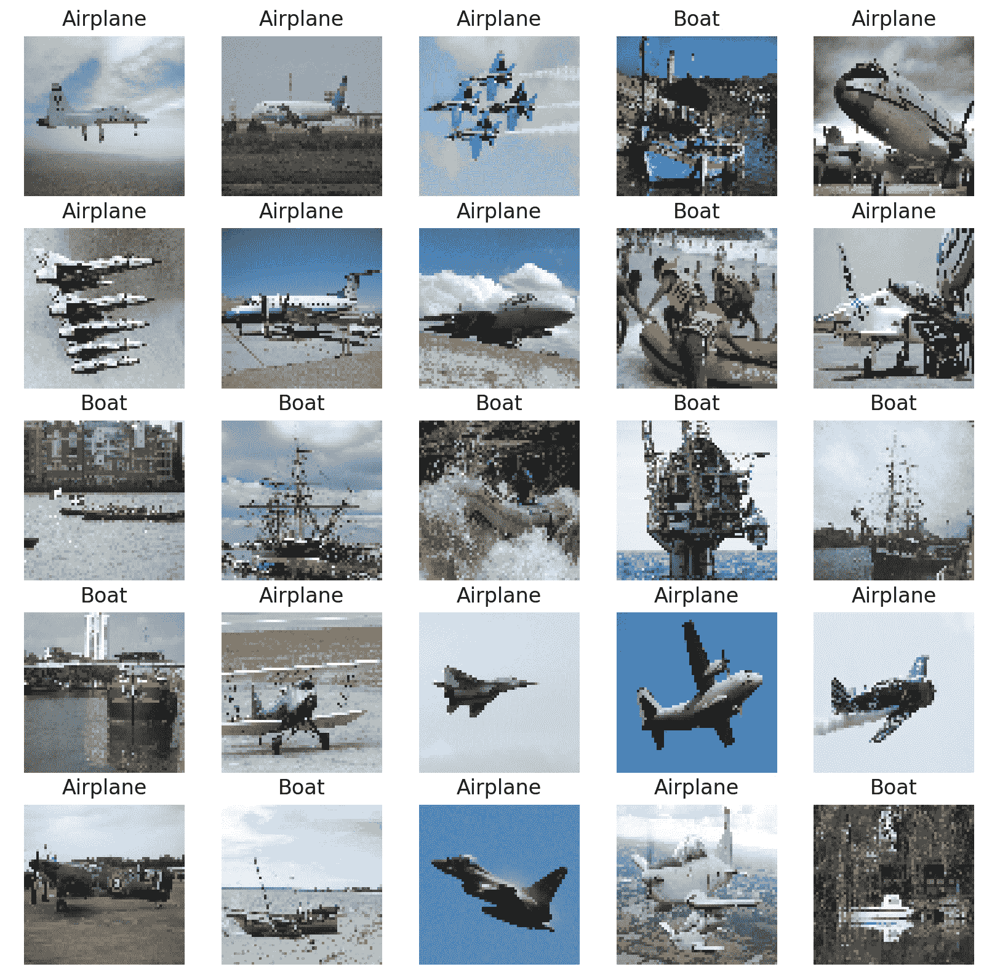

# 二、加载和处理数据

概观

在本章中，您将学习如何在 TensorFlow 中加载和处理用于建模的各种数据类型。您将实现将数据输入 TensorFlow 模型的方法，以便优化模型定型。

到本章结束时，你将知道如何输入表格数据、图像、文本和音频数据，并对它们进行预处理，以便它们适用于训练 TensorFlow 模型。

# 简介

在前一章中，您学习了如何使用 TensorFlow 创建、利用和应用线性变换到张量。本章从张量的定义以及如何使用 TensorFlow 库中的`Variable`类创建它们开始。然后，您创建了各种等级的张量，并学习了如何使用该库应用张量加法、整形、转置和乘法。这些都是线性变换的例子。您通过介绍优化方法和激活函数以及如何在 TensorFlow 库中访问它们来总结了这一章。

在 TensorFlow 中训练机器学习模型时，必须为模型提供训练数据。可用的原始数据可能有多种格式，例如，表格 CSV 文件、图像、音频或文本文件。不同的数据源以不同的方式加载和预处理，以便为 TensorFlow 模型提供数值张量。例如，虚拟助理使用语音查询作为输入交互，然后应用机器学习模型来破译输入语音并执行特定动作作为输出。为了创建该任务的模型，必须将语音输入的音频数据加载到内存中。还需要包括将音频输入转换成文本的预处理步骤。接下来，文本被转换成用于模型训练的数值张量。这个例子展示了从非表格、非数字数据(如音频数据)中创建模型的复杂性。

本章将探讨一些用于构建机器学习模型的常见数据类型。您将以高效的方式将原始数据加载到内存中，然后执行一些预处理步骤，将原始数据转换为适合训练机器学习模型的数值张量。幸运的是，机器学习库已经取得了显著的进步，这意味着具有图像、文本和音频等数据类型的训练模型对于从业者来说是非常容易获得的。

# 探索数据类型

根据来源的不同，原始数据可以有不同的形式。常见的数据形式包括表格数据、图像、视频、音频和文本。例如，温度记录器(用于记录一段时间内给定位置的温度)的输出是表格。表格数据由行和列构成，在温度记录器的例子中，每一列可以表示每条记录的特征，例如时间、位置和温度，而每一行可以表示每条记录的值。下表显示了数字表格数据的示例:


图 2.1:由数值组成的 10 行表格数据的例子

图像数据代表原始数据的另一种常见形式，这种形式在构建机器学习模型时很流行。这些模型很受欢迎，因为有大量的可用数据。随着智能手机和安全摄像头记录下生活中的所有瞬间，他们产生了大量可用于训练模型的数据。

用于训练的图像数据的维度不同于用于表格数据的维度。每个图像都有一个高度和宽度维度，还有一个颜色通道增加了第三个维度，图像数量增加了第四个维度。这样，图像数据模型的输入张量是四维张量，而表格数据的输入张量是二维的。下图显示了取自`Open Images`数据集([https://storage.googleapis.com/openimages/web/index.html](https://storage.googleapis.com/openimages/web/index.html))的船只和飞机的标记训练示例示例；这些图像已经过预处理，因此它们都具有相同的高度和宽度。例如，该数据可用于训练二进制分类模型，以将图像分类为船只或飞机:



图 2.2:可用于训练机器学习模型的图像数据样本

可用于构建机器学习模型的其他类型的原始数据包括文本和音频。像图像一样，它们在机器学习社区中的受欢迎程度源于大量可用的数据。音频和文本都面临着大小不确定的挑战。在本章的后面，您将探索如何克服这一挑战。下图显示了一个采样速率为 44.1 kHz 的音频样本，这意味着音频数据每秒采样 44，100 次。这是输入到虚拟助理的原始数据类型的一个示例，虚拟助理从中解读请求并采取相应的行动:


图 2.3:音频数据的可视化表示

现在，您已经了解了在构建机器学习模型时可能会遇到的一些数据类型，在下一节中，您将发现预处理不同类型数据的方法。

# 数据预处理

数据预处理是指将原始数据转换为适合机器学习模型用作输入的形式的过程。每种不同的数据类型都需要不同的预处理步骤，最低要求是得到的张量只由数字元素组成，如整数或小数。需要数值张量，因为模型依赖于线性变换，如加法和乘法，这些只能在数值张量上执行。

虽然许多数据集只有数值字段，但也有许多数据集没有。它们可能包含字符串、布尔、分类或日期数据类型的字段，这些数据类型都必须转换为数字字段。有些可能微不足道；布尔字段可以被映射，使得`true`值等于`1`并且`false`值等于`0`。因此，将布尔型字段映射到数值型字段是很简单的，所有必要的信息都会保留下来。但是，在转换其他数据类型(如日期字段)时，您可能会在转换为数值字段时丢失信息，除非另有明确说明。

使用 Unix 时间将日期字段转换为数字字段时，可能会发生信息丢失的一个例子。Unix time 表示自 Unix 纪元以来经过的秒数；即 1970 年 1 月 1 日 00:00:00 UTC，闰秒被忽略。使用 Unix 时间删除了月份、星期几、一天中的小时等的显式指示，这些在训练模型时可能是重要的特征。

将字段转换为数值数据类型时，尽可能多地保留信息上下文非常重要，因为这将有助于任何经过训练的模型理解要素和目标之间的关系。下图演示了如何将日期字段转换为一系列数值字段:


图 2.4:日期列的数字编码

如上图所示，在左侧，日期字段表示给定的日期，而在右侧，有一个提供数字信息的方法:

*   年份是从日期中提取的，日期是一个整数。
*   月份是一次性编码的。一年中的每个月都有一列，如果日期的月份与列的名称对应，则月份是二进制编码的。
*   创建一个列，指示日期是否发生在周末。

这只是对这里的`date`列进行编码的一种方法；并非所有上述方法都是必要的，还有许多方法可以使用。将所有字段适当地编码成数字字段对于创建能够学习特征和目标之间的关系的高性能机器学习模型是重要的。

数据规范化是另一种用于加速训练过程的预处理技术。归一化过程会重新调整字段的比例，使它们都具有相同的比例。这也将有助于确保模型的重量具有相同的比例。

在上图中，`year`列的数量级为`10` 3，其他列的数量级为`10` 0。这意味着两列之间有三个数量级。数值比例相差很大的字段将导致模型不太精确，因为可能无法找到最小化误差函数的最佳权重。这可能是由于在训练之前被定义为超参数的容限或学习率在权重被更新时对于两种尺度都不是最优的。在前面的示例中，重新调整`year`列的大小，使其与其他列具有相同的数量级可能是有益的。

在本章中，您将探索各种可用于预处理表格数据、图像数据、文本数据和音频数据的方法，以便将其用于训练机器学习模型。

# 处理表格数据

在本节中，您将学习如何将表格数据加载到 Python 开发环境中，以便将其用于 TensorFlow 建模。您将使用 pandas 和 scikit——学习利用对处理数据有用的类和函数。您还将探索可用于预处理这些数据的方法。

通过使用熊猫`read_csv`函数并将路径传递给数据集，可以将表格数据加载到内存中。该函数非常适用于加载表格数据，并且易于使用，可以按如下方式使用:

```py
df = pd.read_csv('path/to/dataset')
```

为了标准化数据，您可以使用 scikit-learn 中提供的缩放器。有多个可应用的定标器；`StandardScaler`将对数据进行标准化，以便数据集的字段具有平均值`0`和标准偏差`1`。另一个常用的缩放器是`MinMaxScaler`，它将重新缩放数据集，使字段具有最小值`0`和最大值`1`。

要使用缩放器，必须将其初始化并适合数据集。通过这样做，数据集可以由缩放器进行变换。事实上，拟合和转换过程可以通过使用`fit_transform`方法在一个步骤中完成，如下所示:

```py
scaler = StandardScaler()
transformed_df = scaler.fit_transform(df)
```

在第一个练习中，您将学习如何使用 pandas 和 scikit——学习加载数据集并对其进行预处理，以便它适合建模。

## 练习 2.01:加载表格数据和重新调整数值字段

数据集`Bias_correction_ucl.csv`包含韩国首尔第二天最高和最低气温预报的偏差校正信息。这些字段表示给定日期的温度测量值、测量指标的气象站、与天气相关的指标(如湿度)的模型预测以及第二天的温度预测。您需要对数据进行预处理，使所有列的平均值为`0`，标准差为`1`，呈正态分布。您将使用`Present_Tmax`列来演示效果，该列代表给定气象站给定日期的最高温度。

注意

数据集可以在这里找到:[https://packt.link/l83pR](https://packt.link/l83pR)。

执行以下步骤来完成本练习:

1.  打开一个新的 Jupyter 笔记本来实现这个练习。将文件另存为`Exercise2-01.ipnyb`。
2.  In a new Jupyter Notebook cell, import the pandas library, as follows:

    ```py
    import pandas as pd
    ```

    注意

    你可以在下面的链接找到关于熊猫的文档:[https://pandas.pydata.org/docs/](https://pandas.pydata.org/docs/)。

3.  Create a new pandas DataFrame named `df` and read the `Bias_correction_ucl.csv` file into it. Examine whether your data is properly loaded by printing the resultant DataFrame:

    ```py
    df = pd.read_csv('Bias_correction_ucl.csv')
    df
    ```

    注意

    确保根据 CSV 文件在系统上的位置更改其路径(突出显示)。如果您从存储 CSV 文件的同一个目录运行 Jupyter 笔记本，那么您可以不做任何修改就运行前面的代码。

    输出如下所示:

    

    图 2.5:打印数据帧的输出

4.  使用 DataFrame 的`drop`方法删除`date`列，并传入该列的名称。`date`列将被删除，因为它是一个非数值字段，当非数值字段存在时，将无法重新调整。因为您要删除一列，所以应该传递`axis=1`参数和`inplace=True`参数:

    ```py
    df.drop('Date', inplace=True, axis=1)
    ```

5.  Plot a histogram of the `Present_Tmax` column that represents the maximum temperature across dates and weather stations within the dataset:

    ```py
    ax = df['Present_Tmax'].hist(color='gray')
    ax.set_xlabel("Temperature")
    ax.set_ylabel("Frequency")
    ```

    输出如下所示:

    

    图 2.6:Present _ Tmax 列的温度与频率直方图

    生成的直方图显示了`Present_Tmax`列的值的分布。你可以看到温度值从 20 摄氏度到 38 摄氏度不等。绘制特征值的直方图是查看值的分布以了解是否需要将缩放作为预处理步骤的好方法。

6.  Import the `StandardScaler` class from scikit-learn's preprocessing package. Initialize the scaler, fit the scaler, and transform the DataFrame using the scaler's `fit_transform` method. Create a new DataFrame, `df2`, using the transformed DataFrame since the result of the `fit_transform` method is a NumPy array. The standard scaler will transform the numerical fields so that the mean of the field is `0` and the standard deviation is `1`:

    ```py
    from sklearn.preprocessing import StandardScaler
    scaler = StandardScaler()
    df2 = scaler.fit_transform(df)
    df2 = pd.DataFrame(df2, columns=df.columns)
    ```

    注意

    得到的变换数据的平均值和标准偏差值可以输入到定标器中。

7.  Plot a histogram of the transformed `Present_Tmax` column:

    ```py
    ax = df2['Present_Tmax'].hist(color='gray')
    ax.set_xlabel("Normalized Temperature")
    ax.set_ylabel("Frequency")
    ```

    输出如下所示:

    

图 2.7:重新调整后的 Present_Tmax 列的直方图

产生的直方图显示温度值的范围从大约`-3`到`3`摄氏度，如直方图的 *x* 轴上的范围所示。通过使用标准定标器，这些值将始终具有平均值`0`和标准偏差`1`。使特征标准化可以加速模型训练过程。

在本练习中，您成功地使用 pandas 库导入了表格数据，并使用 scikit-learn 库执行了一些预处理。数据的预处理包括删除`date`列并缩放数值字段，使其具有平均值`0`和标准偏差`1`。

在下面的活动中，您将使用 pandas 库加载表格数据，并使用 scikit-learn 中的`MinMax` scaler 缩放该数据。您将在先前练习中使用的相同数据集上执行此操作，该练习描述了韩国首尔气温预报的偏差校正。

## 活动 2.01:加载表格数据并使用最小最大缩放器重新缩放数值字段

在本练习中，您需要加载表格数据，并使用`MinMax`缩放器缩放数据。数据集`Bias_correction_ucl.csv`包含韩国首尔第二天最高和最低气温预报的偏差校正信息。这些字段表示给定日期的温度测量值、测量指标的气象站、与天气相关的指标(如湿度)的模型预测以及第二天的温度预测。您需要缩放列，使每列的最小值为`0`，最大值为`1`。

执行以下步骤来完成本练习:

1.  打开一个新的 Jupyter 笔记本来执行此活动。
2.  导入熊猫和`Bias_correction_ucl.csv`数据集。
3.  使用 pandas `read_csv`函数读取数据集。
4.  删除数据框中的`date`列。
5.  绘制`Present_Tmax`列的直方图。
6.  导入`MinMaxScaler`并使其适合并转换特征数据框。
7.  Plot a histogram of the transformed `Present_Tmax` column.

    您应该会得到类似如下的输出:

    

图 2.8:活动 2.01 的预期产出

注意

此活动的解决方案可通过[此链接](B16341_Solution_ePub.xhtml#_idTextAnchor255)找到。

转换非数值字段(如分类或日期字段)的一种方法是对它们进行一次性编码。`0`除了对应正确列的那个。新创建的虚拟列的列标题对应于唯一值。通过使用 pandas 库的`get_dummies`函数并传入要编码的列，可以实现一键编码。一个可选参数是提供一个前缀特性，该特性为列标题添加一个前缀。这对于引用列很有用:

```py
dummies = pd.get_dummies(df['feature1'], prefix='feature1')
```

注意

使用`get_dummies`功能时，`NaN`值被转换为全零。

在下面的练习中，您将学习如何预处理非数值字段。您将使用在之前的练习和活动中使用的相同数据集，该数据集描述了韩国首尔气温预测的偏差校正。

## 练习 2.02:预处理非数字数据

在本练习中，您将通过使用`get_dummies`函数对来自`date`列的年份和月份进行一次性编码来预处理`date`列。您将把一次性编码的列与原始数据帧连接起来，并确保结果数据帧中的所有字段都是数值型的。

执行以下步骤来完成本练习:

1.  打开一个新的 Jupyter 笔记本来实现这个练习。将文件另存为`Exercise2-02.ipnyb`。
2.  在一个新的 Jupyter 笔记本单元格中，导入熊猫库，如下:

    ```py
    import pandas as pd
    ```

3.  Create a new pandas DataFrame named `df` and read the `Bias_correction_ucl.csv` file into it. Examine whether your data is properly loaded by printing the resultant DataFrame:

    ```py
    df = pd.read_csv('Bias_correction_ucl.csv')
    ```

    注意

    确保根据 CSV 文件在系统上的位置更改其路径(突出显示)。如果您从存储 CSV 文件的同一个目录运行 Jupyter 笔记本，那么您可以不做任何修改就运行前面的代码。

4.  使用 pandas `to_datetime`函数:

    ```py
    df['Date'] = pd.to_datetime(df['Date'])
    ```

    将`date`列的数据类型更改为`Date`
5.  Create dummy columns for `year` using the pandas `get_dummies` function. Pass in the year of the `date` column as the first argument and add a prefix to the columns of the resultant DataFrame. Print out the resultant DataFrame:

    ```py
    year_dummies = pd.get_dummies(df['Date'].dt.year, \
                                  prefix='year')
    year_dummies
    ```

    输出如下所示:

    

    图 2.9:应用于日期年列的 get_dummies 函数的输出

    得到的数据帧只包含 0 和 1。`1`对应于原始`date`列中的值。对于新创建的数据帧中的所有列，空值将为 0。

6.  Repeat this for the month by creating dummy columns from the month of the `date` column. Print out the resulting DataFrame:

    ```py
    month_dummies = pd.get_dummies(df['Date'].dt.month, \
                                   prefix='month')
    month_dummies
    ```

    输出如下所示:

    

    图 2.10:get _ dummies 函数的输出应用于日期列的月份

    结果数据帧现在在`date`列中只包含该月的 0 和 1。

7.  连接原始数据帧和您在*步骤 5* 和*步骤 6* :

    ```py
    df = pd.concat([df, month_dummies, year_dummies], \                axis=1)
    ```

    中创建的虚拟数据帧
8.  删除原来的`date`列，因为它现在是多余的:

    ```py
    df.drop('Date', axis=1, inplace=True)
    ```

9.  Verify that all the columns are now of the numerical data type:

    ```py
    df.dtypes
    ```

    输出如下所示:

    

图 2.11:结果数据帧的 dtypes 属性的输出

在这里，您可以看到结果数据帧的所有数据类型都是数字。这意味着它们现在可以被传递到人工神经网络中进行建模。

在本练习中，您成功地导入了表格数据，并使用 pandas 和 scikit-learn 库预处理了`date`列。您利用了`get_dummies`函数将分类数据转换成数字数据类型。

注意

从日期数据类型获得数字数据类型的另一种方法是使用`pandas.Series.dt`访问器对象。关于可用选项的更多信息可以在这里找到:[https://pandas.pydata.org/docs/reference/api/pandas.Series.dt.html](https://pandas.pydata.org/docs/reference/api/pandas.Series.dt.html)。

处理非数字数据是创建性能模型的重要步骤。如果可能，应该将任何领域知识传授给训练数据特征。例如，当使用日期预测温度时，就像本章前面的练习和活动中使用的数据集一样，对月份进行编码会很有帮助，因为温度很可能与一年中的月份高度相关。然而，对星期几进行编码可能没有用，因为星期几和温度之间可能没有相关性。使用该领域知识可以帮助模型学习特征和目标之间的潜在关系。

在下一节中，您将学习如何处理图像数据，以便将其输入到机器学习模型中。

# 处理图像数据

各种组织每天都在生成大量图像，这些图像可用于为诸如对象检测、图像分类和对象分割等任务创建预测模型。当处理图像数据和一些其他原始数据类型时，通常需要对数据进行预处理。用最少的预处理从原始数据创建模型是使用人工神经网络建模的最大好处之一，因为特征工程步骤是最少的。特征工程通常涉及使用领域知识从原始数据中创建特征，这非常耗时，并且不能保证模型性能的提高。利用没有特征工程的人工神经网络简化了训练过程，并且不需要领域知识。

例如，在医学图像中定位肿瘤需要来自那些经过多年训练的专家的专业知识，但是对于 ann 来说，所需要的只是用于训练的足够的标记数据。通常需要对这些图像进行少量的预处理。这些步骤是可选的，但是有助于标准化培训过程和创建性能模型。

一个预处理步骤是重新缩放。由于图像的颜色值是介于`0`和`255`之间的整数，因此它们被缩放到介于`0`和`1`之间的值，类似于*活动 2.01* 、*加载表格数据并用最小最大缩放器*重新缩放数值字段。您将在本节稍后探索的另一个常见预处理步骤是图像增强，它本质上是增强图像以添加更多训练示例并构建更健壮的模型的行为。

本节还将介绍批处理。批处理一次加载一批训练数据。与一次加载数据相比，这会导致训练时间变慢；但是，这确实允许您在非常大的数据集上训练模型。对图像或音频的训练就是这样的例子，通常需要大音量来实现高性能的结果。

例如，典型的图像大小可能是 100 KB。对于包含 100 万幅图像的训练数据集，您将需要 100 GB 的内存，这对于大多数人来说可能是无法实现的。如果以 32 幅图像为一批来训练该模型，则存储器需求要少几个数量级。批量训练允许您增加训练数据，您将在后面的部分中探索这一点。

可以使用名为`ImageDataGenerator`的类将图像加载到内存中，该类可以从 Keras 的预处理包中导入。这是一个最初来自 Keras 的类，现在可以在 TensorFlow 中使用。载入图像时，您可以重新缩放图像。通常的做法是用 1/255 像素的值来重新缩放图像。这意味着值从 0 到 255 的图像现在将具有从 0 到 1 的值。

`ImageDataGenerator`可通过重新缩放进行初始化，如下所示:

```py
datagenerator = ImageDataGenerator(rescale = 1./255)
```

一旦初始化了`ImageDataGenerator`类，就可以使用`flow_from_directory`方法并传入图像所在的目录。该目录应该包括标有类标签的子目录，并且它们应该包含相应类的图像。要传入的另一个参数是图像的期望大小、批处理大小和类模式。类别模式决定了生成的标签数组的类型。使用`flow_from_directory`方法进行二进制分类，批量大小为 25，图像大小为 64x64，如下所示:

```py
dataset = datagenerator.flow_from_directory\
          ('path/to/data',\
           target_size = (64, 64),\
           batch_size = 25,\
           class_mode = 'binary')
```

在下面的练习中，您将利用`ImageDataGenerator`类将图像加载到内存中。

注意

所提供的图像数据来自开放图像数据集，其完整描述可在此处找到:[https://storage.googleapis.com/openimages/web/index.html](https://storage.googleapis.com/openimages/web/index.html)。

可以通过使用 Matplotlib 绘制图像来查看图像。这是验证图像与其各自标签匹配的有用练习。

## 练习 2.03:加载图像数据进行批处理

在本练习中，您将学习如何加载图像数据进行批处理。`image_data`文件夹包含一组船只和飞机的图片。您将加载船只和飞机的图像进行批处理，并重新缩放它们，使图像值的范围在`0`和`1`之间。然后，您的任务是从数据生成器中打印一批带标签的图像。

注意

你可以在这里找到`image_data`:https://packt.link/jZ2oc。

执行以下步骤来完成本练习:

1.  打开一个新的 Jupyter 笔记本来实现这个练习。将文件另存为`Exercise2-03.ipnyb`。
2.  在一个新的 Jupyter 笔记本单元格中，从`tensorflow.keras.preprocessing.image` :

    ```py
    from tensorflow.keras.preprocessing.image \      import ImageDataGenerator
    ```

    导入`ImageDataGenerator`类
3.  实例化`ImageDataGenerator`类并传递带有值`1./255`的`rescale`参数来转换图像值，使它们在`0`和`1`之间:

    ```py
    train_datagen = ImageDataGenerator(rescale =  1./255)
    ```

4.  使用数据生成器的`flow_from_directory`方法将数据生成器指向图像数据。传入目标大小、批量大小和分类模式的参数:

    ```py
    training_set = train_datagen.flow_from_directory\                ('image_data',\                 target_size = (64, 64),\                 batch_size = 25,\                 class_mode = 'binary')
    ```

5.  创建一个函数来显示批处理中的图像。该函数将绘制 5x5 阵列中的前 25 幅图像及其相关标签:

    ```py
    import matplotlib.pyplot as plt def show_batch(image_batch, label_batch):\     lookup = {v: k for k, v in \               training_set.class_indices.items()}     label_batch = [lookup[label] for label in \                    label_batch]     plt.figure(figsize=(10,10))     for n in range(25):         ax = plt.subplot(5,5,n+1)         plt.imshow(image_batch[n])         plt.title(label_batch[n].title())         plt.axis('off')
    ```

6.  Take a batch from the data generator and pass it to the function to display the images and their labels:

    ```py
    image_batch, label_batch = next(training_set)
    show_batch(image_batch, label_batch)
    ```

    输出如下所示:

    

图 2.12:一批图像

在这里，您可以看到一批船只和飞机图像的输出，这些图像可以输入到一个模型中。请注意，所有图像的大小都相同，这是通过修改图像的纵横比实现的。这确保了图像在传入人工神经网络时的一致性。

在本练习中，您学习了如何成批导入图像，以便它们可用于训练神经网络。一次加载一批图像，通过限制每批的训练图像数量，可以确保不超过机器的 RAM。

在下一节中，您将看到如何在加载图像时对其进行放大。

# 图像增强

图像增强是修改图像以增加可用训练样本数量的过程。这个过程可以包括放大图像、旋转图像或者垂直或水平翻转图像。如果增强过程不改变图像的上下文，这可以被执行。例如，一个香蕉的图像，当水平翻转时，仍然可以被识别为一个香蕉，并且新的香蕉图像可能是任一方向的。在这种情况下，在训练过程中为两个方向提供一个模型将有助于建立一个健壮的模型。

然而，如果你有一张船的图像，垂直翻转它可能不合适，因为这并不代表船在图像中通常是如何颠倒的。图像增强的最终目标是增加训练图像的数量，这些训练图像与日常出现的对象相似，并保留上下文。这将有助于训练好的模型在新的、看不见的图像上表现良好。下图是一个图像放大的例子，其中一个香蕉的图像被放大了三倍；左边的图像是原始图像，右边的是增强图像。

右上图是水平翻转的原图，右中图是放大 15%的原图，右下图是旋转 10 度的原图。在这个增强过程之后，你有一个香蕉的四个图像，每个图像都有香蕉在不同的位置和方向:


图 2.13:图像增强的一个例子

当每批图像加载时，可以使用 TensorFlow 的`ImageDataGenerator`类来实现图像放大。类似于图像缩放，可以应用各种图像放大过程。常见增强过程的论据包括以下几点:

*   `horizontal_flip`:水平翻转图像。
*   `vertical_flip`:垂直翻转图像。
*   `rotation_range`:将图像旋转给定的角度。
*   `width_shift_range`:将图像沿其宽度轴移动到给定的分数或像素数。
*   `height_shift_range`:将图像沿其高度轴移动至给定的分数或像素量。
*   `brightness_range`:将图像的亮度修改到给定量。
*   `shear_range`:将图像剪切到给定的量。
*   `zoom_range`:将图像放大到给定的量。

当实例化`ImageDataGenerator`类时，可以应用图像增强，如下所示:

```py
datagenerator = ImageDataGenerator(rescale = 1./255,\
                                   shear_range = 0.2,\
                                   rotation_range= 180,\
                                   zoom_range = 0.2,\
                                   horizontal_flip = True)
```

在以下活动中，您将使用 TensorFlow 的`ImageDataGenerator`类执行图像增强。这个过程就像传入参数一样简单。您将使用在*练习 2.03* 、*加载图像数据进行批处理*中使用的相同数据集，其中包含船只和飞机的图像。

## 活动 2.02:加载图像数据进行批处理

在本活动中，您将加载图像数据进行批处理，并在处理过程中扩充图像。`image_data`文件夹包含一组船只和飞机的图像。您需要加载图像数据进行批处理，并通过随机扰动(如旋转、水平翻转图像和对图像添加剪切)来调整输入数据。这将从现有的图像数据中创建额外的训练数据，并且通过增加不同训练示例的数量，即使只有少数可用，也将导致更准确和更鲁棒的机器学习模型。然后，您的任务是从数据生成器中打印一批带标签的图像。

此活动的步骤如下:

1.  打开一个新的 Jupyter 笔记本来执行此活动。
2.  从`tensorflow.keras.preprocessing.image`导入`ImageDataGenerator`类。
3.  实例化`ImageDataGenerator`并设置`rescale=1./255`、`shear_range=0.2`、`rotation_range=180`、`zoom_range=0.2`和`horizontal_flip=True`参数。
4.  使用`flow_from_directory`方法将数据生成器指向图像，同时传入目标尺寸为`64x64`，批次尺寸为`25`，类别模式为`binary`。
5.  创建一个函数来显示 5x5 数组中的前 25 个图像及其相关标签。
6.  Take a batch from the data generator and pass it to the function to display the images and their labels.

    注意

    此活动的解决方案可通过[此链接](B16341_Solution_ePub.xhtml#_idTextAnchor256)找到。

在本练习中，您批量扩充了图像，以便它们可以用于训练人工神经网络。您已经看到，当图像被用作输入时，它们可以被扩充以生成大量有效的训练示例。

您学习了如何批量加载图像，这使您能够对大量数据进行训练，而这些数据可能一次放不进您的机器的内存。您还了解了如何使用`ImageDataGenerator`类来扩充图像，这实际上是从训练集中的图像生成新的训练示例。

在下一节中，您将学习如何加载和预处理文本数据。

# 文本处理

文本数据代表一大类容易获得的原始数据。例如，文本数据可以来自维基百科等网页、转录的语音或社交媒体对话——所有这些数据都在大规模增加，必须经过处理才能用于训练机器学习模型。

由于以下几个不同的原因，处理文本数据可能会很困难:

*   存在成千上万个不同的单词。
*   不同的语言带来了挑战。
*   文本数据通常大小不一。

有许多方法可以将文本数据转换成数字表示。一种方法是对单词进行一次性编码，就像你在*练习 2.02* 、*预处理非数字数据*中对日期字段所做的那样。然而，这在训练模型时出现了问题，因为具有许多唯一单词的大型数据集将导致稀疏的数据集，并可能导致训练速度缓慢和潜在的不准确模型。此外，如果遇到不在训练数据中的新单词，则模型不能使用该单词。

用来表示文本数据的一种流行方法是将整段文本转换成嵌入向量。存在预训练的模型来将原始文本转换成向量。这些模型通常是在大量文本上训练的。使用来自预训练模型的词嵌入向量具有一些明显的优点:

*   产生的向量具有固定的大小。
*   向量保持上下文信息，因此它们受益于迁移学习。
*   不需要对数据做进一步的预处理，嵌入的结果可以直接输入到人工神经网络中。

虽然 TensorFlow Hub 将在下一章中更深入地讨论，但以下是如何使用预训练模型作为预处理步骤的示例。要加载预训练的模型，您需要导入`tensorflow_hub`库。通过这样做，可以加载模型的 URL。然后，可以通过调用`KerasLayer`类将模型加载到环境中，该类包装了模型，以便可以像使用任何其他 TensorFlow 模型一样使用它。它可以按如下方式创建:

```py
import tensorflow_hub as hub
model_url = "url_of_model"
hub_layer = hub.KerasLayer(model_url, \
                           input_shape=[], dtype=tf.string, \
                           trainable=True)
```

由`dtype`参数指示的输入数据的数据类型应该被用作`KerasLayer`类的输入，以及指示权重是否可训练的布尔自变量。一旦使用`tensorflow_hub`库加载了模型，就可以在文本数据上调用它，如下所示:

```py
hub_layer(data)
```

这将通过预训练模型运行数据。输出将基于预训练模型的架构和权重。

在以下练习中，您将探索如何加载包含文本字段的数据、批处理数据集，以及将预训练模型应用于文本字段以将字段转换为嵌入向量。

注意

预训练的模型可以在这里找到:[https://tfhub.dev/google/tf2-preview/gnews-swivel-20dim/1](https://tfhub.dev/google/tf2-preview/gnews-swivel-20dim/1)。

数据集可以在这里找到:[https://archive . ics . UCI . edu/ml/datasets/Drug+Review+Dataset+% 28 drugs . com % 29](https://archive.ics.uci.edu/ml/datasets/Drug+Review+Dataset+%28Drugs.com%29)。

## 练习 2.04:加载 TensorFlow 模型的文本数据

数据集`drugsComTrain_raw.tsv`包含与患者对特定药物的评论相关的信息，以及其相关状况和表明患者对药物满意度的评级。在本练习中，您将加载文本数据进行批处理。您将应用 TensorFlow Hub 的预训练模型对患者评论执行词嵌入。您只需要在包含文本数据的`review`字段上工作。

执行以下步骤:

1.  打开一个新的 Jupyter 笔记本来实现这个练习。将文件另存为`Exercise2-04.ipnyb`。
2.  在新的 Jupyter 笔记本单元格中，导入 TensorFlow 库:

    ```py
    import tensorflow as tf
    ```

3.  使用库的`make_csv_dataset`函数创建一个 TensorFlow 数据集对象。将`batch_size`参数设置为等于`1`，将`field_delim`参数设置为`'\t'`，因为数据集是用制表符分隔的:

    ```py
    df = tf.data.experimental.make_csv_dataset\      ('../Datasets/drugsComTest_raw.tsv', \       batch_size=1, field_delim='\t')
    ```

4.  创建一个函数，将数据集对象作为输入，并对数据集进行混洗、重复和批处理:

    ```py
    def prep_ds(ds, shuffle_buffer_size=1024, \             batch_size=32):     # Shuffle the dataset     ds = ds.shuffle(buffer_size=shuffle_buffer_size)     # Repeat the dataset     ds = ds.repeat()     # Batch the dataset     ds = ds.batch(batch_size)     return ds
    ```

5.  将函数应用于您在*步骤 3* 中创建的数据集对象，设置`batch_size`等于`5` :

    ```py
    ds = prep_ds(df, batch_size=5)
    ```

6.  Take the first batch and print it out:

    ```py
    for x in ds.take(1):\
        print(x)
    ```

    您应该会得到类似如下的输出:

    

    图 2.14:来自数据集对象的批处理

    输出以张量格式表示输入数据。

7.  从 TensorFlow Hub 导入预训练的词嵌入模型，创建一个 Keras 层:

    ```py
    import tensorflow_hub as hub embedding = "https://tfhub.dev/google/tf2-preview"\             "/gnews-swivel-20dim/1" hub_layer = hub.KerasLayer(embedding, input_shape=[], \                            dtype=tf.string, \                            trainable=True)
    ```

8.  Take one batch from the dataset, flatten the tensor corresponding to the `review` field, apply the pretrained layer, and print it out:

    ```py
    for x in ds.take(1):\
        print(hub_layer(tf.reshape(x['review'],[-1])))
    ```

    这将显示以下输出:

    

图 2.15:预训练模型应用于文本后的一批评论列

前面的输出表示第一批药物综述的嵌入向量。乍一看，特定值可能没有多大意义，但是嵌入中编码的是基于数据集的上下文信息，嵌入模型是在该数据集上训练的。批次大小等于`5`，嵌入向量大小为`20`，这意味着在应用预拉伸层后，结果大小为`5x20`。

在本练习中，您学习了如何导入可能包含各种数据类型的表格数据。您获取了`review`字段，并应用了一个预训练的词嵌入模型来将文本转换成数字张量。最后，您对文本数据进行了预处理和批处理，使其适合大规模训练。这是表示文本的一种方式，以便可以将其输入 TensorFlow 中的机器学习模型。事实上，可以使用其他预训练的词嵌入模型，并且在 TensorFlow Hub 上可以获得。在下一章中，您将了解更多关于如何利用 TensorFlow Hub 的信息。

在本节中，您了解了一种用于机器学习模型的预处理文本数据的方法。有很多不同的方法可以用来从文本中生成一个数值张量。例如，你可以对单词进行一次性编码，删除停用词，对单词进行词干分析和词条分类，或者甚至做一些简单的事情，比如计算每篇评论中的单词数。本节中演示的方法很有优势，因为它实现起来很简单。此外，词嵌入将难以用其他方法编码的上下文信息合并到文本中，例如一键编码。

最终，将任何领域知识应用于预处理步骤以尽可能多地保留上下文信息，这取决于从业者。这将允许任何后续模型学习特征和目标变量之间的基本函数。

在下一节中，您将学习如何加载和处理音频数据，以便这些数据可以用于 TensorFlow 模型。

# 音频处理

本节将演示如何批量加载音频数据，以及如何对其进行处理，以便将其用于训练机器学习模型。有一些先进的信号处理发生预处理音频文件。其中一些步骤是可选的，但它们提供了一种处理音频数据的综合方法。因为每个音频文件可能有数百 KB，所以您将利用批处理，就像处理图像数据一样。批处理可以通过创建数据集对象来实现。从原始数据创建数据集对象的一般方法是使用 TensorFlow 的`from_tensor_slice`函数。该函数通过沿张量的第一维对其进行切片来生成数据集对象。它可以按如下方式使用:

```py
dataset = tf.data.Dataset\
            .from_tensor_slices([1, 2, 3, 4, 5])
```

使用 TensorFlow 可以将音频数据加载到 Python 环境中，方法是使用`read_file`函数将文件读入内存，然后使用`decode_wav`函数对文件进行解码。当使用`decode_wav`函数时，采样率(代表一秒钟内有多少数据点)以及想要使用的通道必须作为参数传入。例如，如果为所需通道传递了值`-1`，那么所有音频通道都将被解码。导入音频文件可以通过以下方式实现:

```py
sample_rate = 44100
audio_data = tf.io.read_file('path/to/file')
audio, sample_rate = tf.audio.decode_wav\
                     (audio_data,\
                      desired_channels=-1,\
                      desired_samples=sample_rate)
```

与文本数据一样，您必须对数据进行预处理，以便生成的数值张量与数据大小相同。这是通过在将数据转换到频域后对音频文件进行采样来实现的。对音频进行采样可以被认为是将音频文件分割成大小始终相同的块。例如，30 秒的音频文件可以分成 30 个 1 秒不重叠的音频样本，同样，15 秒的音频文件可以分成 15 个 1 秒不重叠的样本。因此，您的结果是 45 个大小相等的音频样本。

可以对音频数据执行的另一个常见预处理步骤是将音频样本从时域转换到频域。解释时域中的数据有助于理解音频的强度或音量，而频域可以帮助您发现存在哪些频率。这对于分类声音是有用的，因为不同的对象具有不同的特征声音，这些特征声音将出现在频域中。使用`stft`功能可以将音频数据从时域转换到频域。

该函数对输入数据进行短时傅立叶变换。该函数的参数包括帧长度，它是一个整数值，表示样本中的窗口长度；帧步长，它是描述要步进的样本数的整数值；以及**快速傅立叶变换** ( **FFT** )长度，其是指示要应用的 FFT 的长度的整数值。频谱图是短时傅立叶变换的绝对值，因为它对于视觉解释是有用的。短时傅立叶变换和频谱图可以如下创建:

```py
stfts = tf.signal.stft(audio, frame_length=1024,\
                       frame_step=256,\
                       fft_length=1024)
spectrograms = tf.abs(stfts)
```

另一个可选的预处理步骤是生成**梅尔频率倒谱系数**(**MFCC**)。顾名思义，MFCCs 是梅尔频率倒谱的系数。倒谱是音频信号的短期功率谱的表示。MFCCs 通常用于语音识别和音乐信息检索的应用中。因此，理解如何生成 MFCCs 的每个步骤可能并不重要，但是理解它们可以作为预处理步骤来应用以增加音频数据管道的信息密度是有益的。

MFCCs 是通过创建矩阵将线性比例扭曲到 mel 比例来生成的。可使用`linear_to_mel_weight_matrix`并通过输入最终 mel 光谱中的波段数、源光谱图中的频段数、采样率以及 mel 光谱中包含的较低和较高频率来创建该矩阵。一旦创建了线性-mel 权重矩阵，使用`tensordot`函数沿第一轴应用光谱图的张量收缩。

在此之后，应用数值的对数来生成对数 mel 光谱图。最后，可以应用`mfccs_from_log_mel_spectrograms`函数来生成在对数 mel 光谱图中传递的 MFCCs。这些步骤可以应用如下:

```py
lower_edge_hertz, upper_edge_hertz, num_mel_bins \
    = 80.0, 7600.0, 80
linear_to_mel_weight_matrix \
    = tf.signal.linear_to_mel_weight_matrix\
      (num_mel_bins, num_spectrogram_bins, sample_rate, \
       lower_edge_hertz, upper_edge_hertz)
mel_spectrograms = tf.tensordot\
                   (spectrograms, \
                    linear_to_mel_weight_matrix, 1)
mel_spectrograms.set_shape\
    (spectrograms.shape[:-1].concatenate\
    (linear_to_mel_weight_matrix.shape[-1:]))
log_mel_spectrograms = tf.math.log(mel_spectrograms + 1e-6)
mfccs = tf.signal.mfccs_from_log_mel_spectrograms\
        (log_mel_spectrograms)[..., :num_mfccs]
```

在下面的练习中，您将了解如何处理音频数据。与您在*练习 2.03* 、*加载图像数据进行批处理*和*练习* *2.04* 、*加载 TensorFlow 模型的文本数据*中所做的类似，您将批量加载数据以进行高效和可扩展的训练。您将使用 TensorFlow 的通用`read_file`函数加载音频文件，然后使用 TensorFlow 的`decode_wav`函数解码音频数据。然后，您将创建一个从每个音频样本生成 MFCCs 的函数。最后，将生成一个数据集对象，该对象可以传递到 TensorFlow 模型中进行训练。您将利用的数据集是谷歌的语音命令数据集，它由一秒钟长的话语组成。

注意

数据集可以在这里找到:[https://packt.link/Byurf](https://packt.link/Byurf)。

## 练习 2.05:为 TensorFlow 模型加载音频数据

在本练习中，您将学习如何载入音频数据进行批处理。数据集`data_speech_commands_v0.02`包含了人们以 44.1 kHz 的采样率说出单词`zero`一秒钟的语音样本，这意味着每秒钟有 44100 个数据点。您将应用一些常见的音频预处理技术，包括将数据转换到傅立叶域，对数据进行采样以确保数据与模型具有相同的大小，以及为每个音频样本生成 MFCCs。这将生成预处理的数据集对象，该对象可以输入到 TensorFlow 模型中进行训练。

执行以下步骤:

1.  打开一个新的 Jupyter 笔记本来实现这个练习。将文件另存为`Exercise2-05.ipnyb`。
2.  在一个新的 Jupyter 笔记本单元格中，导入`tensorflow`和`os`库:

    ```py
    import tensorflow as tf import os
    ```

3.  分别使用 TensorFlow 的`read_file`函数和`decode_wav`函数创建一个加载音频文件的函数。返回合成张量的转置:

    ```py
    def load_audio(file_path, sample_rate=44100):     # Load audio at 44.1kHz sample-rate     audio = tf.io.read_file(file_path)     audio, sample_rate = tf.audio.decode_wav\                          (audio,\                           desired_channels=-1,\                           desired_samples=sample_rate)     return tf.transpose(audio)
    ```

4.  使用`os.list_dir` :

    ```py
    prefix = " ../Datasets/data_speech_commands_v0.02"\         "/zero/" paths = [os.path.join(prefix, path) for path in \          os.listdir(prefix)]
    ```

    将音频数据的路径作为列表载入
5.  Test the function by loading in the first audio file from the list and plotting it:

    ```py
    import matplotlib.pyplot as plt
    audio = load_audio(paths[0])
    plt.plot(audio.numpy().T)
    plt.xlabel('Sample')
    plt.ylabel('Value')
    ```

    输出如下所示:

    

    图 2.16:音频文件的可视化表示

    该图示出了语音样本的波形。给定时间的振幅对应于声音的音量；高振幅与高音量相关。

6.  创建一个从音频数据生成 MFCCs 的函数。首先，将传入音频信号的短时傅立叶变换作为第一个参数，将设置为`1024`的帧长度作为第二个参数，将设置为`256`的帧步长作为第三个参数，将 FFT 长度作为第四个参数。然后，取结果的绝对值来计算光谱图。频谱图面元的数量由沿短时傅立叶变换的最后一个轴的长度给出。接下来，将梅尔权重矩阵的上界和下界分别定义为`80`和`7600`，并将梅尔箱的数量定义为`80`。然后，使用 TensorFlow 的信号包中的`linear_to_mel_weight_matrix`计算 mel 权重矩阵。接下来，使用 TensorFlow 的`tensordot`函数通过张量收缩沿着光谱图的轴 1 计算 mel 光谱图，该光谱图具有 mel 权重矩阵。然后，在使用 TensorFlow 的`mfccs_from_log_mel_spectrograms`函数最终计算 MFCCs 之前，取 mel 光谱图的对数。然后，从函数

    ```py
    def apply_mfccs(audio, sample_rate=44100, num_mfccs=13):     stfts = tf.signal.stft(audio, frame_length=1024, \                            frame_step=256, \                            fft_length=1024)     spectrograms = tf.abs(stfts)     num_spectrogram_bins = stfts.shape[-1]#.value     lower_edge_hertz, upper_edge_hertz, \     num_mel_bins = 80.0, 7600.0, 80     linear_to_mel_weight_matrix = \       tf.signal.linear_to_mel_weight_matrix\       (num_mel_bins, num_spectrogram_bins, \        sample_rate, lower_edge_hertz, upper_edge_hertz)     mel_spectrograms = tf.tensordot\                        (spectrograms, \                         linear_to_mel_weight_matrix, 1)     mel_spectrograms.set_shape\     (spectrograms.shape[:-1].concatenate\     (linear_to_mel_weight_matrix.shape[-1:]))     log_mel_spectrograms = tf.math.log\                            (mel_spectrograms + 1e-6)     #Compute MFCCs from log_mel_spectrograms     mfccs = tf.signal.mfccs_from_log_mel_spectrograms\             (log_mel_spectrograms)[..., :num_mfccs]     return mfccs
    ```

    返回 MFCCs
7.  Apply the function to generate the MFCCs for the audio data you loaded in *Step 5*:

    ```py
    mfcc = apply_mfccs(audio)
    plt.pcolor(mfcc.numpy()[0])
    plt.xlabel('MFCC log coefficient')
    plt.ylabel('Sample Value')
    ```

    输出如下所示:

    

    图 2.17:音频文件的 MFCCs 的可视化表示

    前面的图显示了在 *x* 轴上的 MFCC 值和在 *y* 轴上的音频样本的各个点。MFCCs 是在*步骤 5* 中显示的原始音频信号的不同表示，已被证明在与语音识别相关的应用中是有用的。

8.  加载`AUTOTUNE`以便可以使用 CPU 的所有可用线程。创建一个接受数据集对象的函数，混洗它，使用您在*步骤 3* 中创建的函数加载音频，使用您在*步骤 6* 中创建的函数生成 MFCCs，重复数据集对象，批处理它，并预取它。使用`AUTOTUNE`根据您的可用 CPU:

    ```py
    AUTOTUNE = tf.data.experimental.AUTOTUNE def prep_ds(ds, shuffle_buffer_size=1024, \             batch_size=64):     # Randomly shuffle (file_path, label) dataset     ds = ds.shuffle(buffer_size=shuffle_buffer_size)     # Load and decode audio from file paths     ds = ds.map(load_audio, num_parallel_calls=AUTOTUNE)     # generate MFCCs from the audio data     ds = ds.map(apply_mfccs)     # Repeat dataset forever     ds = ds.repeat()     # Prepare batches     ds = ds.batch(batch_size)     # Prefetch     ds = ds.prefetch(buffer_size=AUTOTUNE)     return ds
    ```

    的缓冲区大小进行预取
9.  使用您在*步骤 8* 中创建的函数生成训练数据集。为此，使用 TensorFlow 的`from_tensor_slices`函数创建一个数据集对象，并传递音频文件的路径。之后，您可以使用您在*步骤 8* 中创建的函数:

    ```py
    ds = tf.data.Dataset.from_tensor_slices(paths) train_ds = prep_ds(ds)
    ```

10.  Take the first batch of the dataset and print it out:

    ```py
    for x in train_ds.take(1):\
        print(x)
    ```

    输出如下所示:

    

图 2.18:生成 MFCCs 后的一批音频数据

输出以张量形式显示第一批 MFCC 频谱值。

在本练习中，您导入了音频数据。您处理了数据集并对数据集进行了批处理，使其适用于大规模训练。该方法是一种综合方法，其中数据被加载并转换到频域，产生频谱图，然后最终产生 MFCCs。

在下一个活动中，您将加载音频数据并获取输入的绝对值，然后对这些值进行对数缩放。这将确保数据集中没有负值。您将使用在*练习 2.05* 、*加载 TensorFlow 模型的音频数据*中使用的相同音频数据集，即 Google 的语音命令数据集。这个数据集由 1 秒长的话语组成。

## 活动 2.03:加载音频数据进行批处理

在本活动中，您将加载音频数据进行批处理。将要执行的音频预处理技术包括取绝对值和使用 1 加上该值的对数。这将确保结果值是非负的和对数标度的。结果将是预处理的数据集对象，该对象可以输入到 TensorFlow 模型中进行训练。

此活动的步骤如下:

1.  打开一个新的 Jupyter 笔记本来执行此活动。
2.  导入 TensorFlow 和`os`库。
3.  分别使用 TensorFlow 的`read_file`函数和`decode_wav`函数创建一个函数来加载和解码音频文件。从函数中返回结果张量的转置。
4.  使用`os.list_dir`将文件路径作为列表加载到音频数据中。
5.  创建一个函数，该函数接受一个数据集对象，对其进行混洗，使用您在*步骤 2* 中创建的函数加载音频，并将绝对值和`log1p`函数应用于数据集。该函数将`1`与数据集中的每个值相加，然后对结果应用对数。接下来，重复 dataset 对象，对其进行批处理，并使用与批处理大小相等的缓冲区大小预取它。
6.  使用 TensorFlow 的`from_tensor_slices`函数创建一个数据集对象，并传入音频文件的路径。然后，将您在*步骤 4* 中创建的函数应用于在*步骤 5* 中创建的数据集。
7.  取出第一批数据集并打印出来。
8.  Plot the first audio file from the batch.

    输出将如下所示:

    

图 2.19:活动 2.03 的预期产出

注意

此活动的解决方案可通过[此链接](B16341_Solution_ePub.xhtml#_idTextAnchor257)找到。

在本练习中，您学习了如何批量载入和预处理音频数据。您使用了在*练习 2.05* 、*加载 TensorFlow 模型的音频数据*中使用的大多数函数，来加载数据并解码原始数据。*练习 2.05* 、*加载 TensorFlow 模型音频数据*与*活动 2.03* 、*加载音频数据批量处理*的区别在于预处理步骤；*练习 2.05* 、*加载 TensorFlow 模型的音频数据*，涉及生成音频数据的 MFCCs，而*活动 2.03* 、*加载音频数据进行批处理*，涉及对数缩放数据。两者都展示了通用的预处理技术，可用于所有涉及音频数据建模的应用。

在本节中，您已经探索了如何为 TensorFlow 建模批量加载音频数据。该综合方法展示了许多先进的信号处理技术，为希望将音频数据用于自己应用的从业者提供了一个良好的起点。

# 总结

在本章中，您学习了如何加载不同形式的数据，并对各种数据类型执行一些预处理步骤。您从 CSV 文件形式的表格数据开始。因为数据集由一个 CSV 文件组成，所以您利用 pandas 库将文件加载到内存中。

然后，通过缩放字段并将所有字段转换为数字数据类型来对数据进行预处理。这一点很重要，因为 TensorFlow 模型只能根据数字数据进行训练，如果所有场的规模相同，训练过程在速度和精度方面都会得到提高。

接下来，您探索了如何加载图像数据。您对数据进行了批处理，因此不必一次加载整个数据集，这允许您扩充图像。图像增强是有用的，因为它增加了训练样本的有效数量，并且可以帮助使模型更加健壮。

然后，您学习了如何加载文本数据并利用预先训练的模型。这有助于您将文本嵌入到保留文本上下文信息的向量中。这允许文本数据输入到 TensorFlow 模型中，因为它们需要数字张量作为输入。

最后，最后一节介绍了如何加载和处理音频数据，并展示了一些先进的信号处理技术，包括生成 MFCCss，MFCC 可用于生成信息密集的数值张量，以便输入到 TensorFlow 模型中。

加载和预处理数据以便可以将其输入到机器学习模型中是训练任何机器学习模型的重要且必要的第一步。在下一章中，您将探索 TensorFlow 提供的许多资源，以帮助开发模型构建。