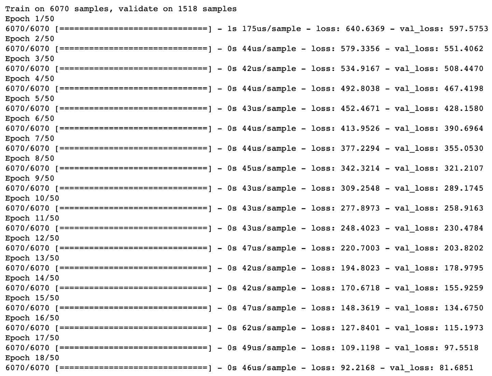

<title>B16341_04_ePub</title>

# 4。回归和分类模型

概观

在本章中，您将学习如何使用 TensorFlow 构建回归和分类模型。您将使用 TensorFlow 利用 Keras 层构建模型，Keras 层是一种简单的模型构建方法，提供了用于构建和训练模型的高级 API。您将创建模型来解决回归和分类任务，包括各种分子结合属性的分类。您还将使用 TensorBoard 来可视化 TensorFlow 模型的架构并查看培训过程。

# 简介

在前一章中，您学习了如何使用一些 TensorFlow 资源来帮助开发。其中包括 TensorBoard(用于可视化计算图形)、TensorFlow Hub(机器学习模块的在线存储库)和 Google Colab(用于在 Google 服务器上运行代码的在线 Python 开发环境)。所有这些资源都有助于机器学习实践者高效地开发模型。

在本章中，您将探索如何使用 TensorFlow 创建人工神经网络。您将构建具有不同架构的人工神经网络来解决回归和分类任务。回归任务旨在从输入训练数据中预测连续变量，而分类任务旨在将输入数据分类为两个或更多个类别。例如，预测某一天是否会下雨的模型是一项分类任务，因为模型的结果将分为两类——下雨或不下雨。但是，预测某一天降雨量的模型就是回归任务的一个例子，因为模型的输出是一个连续变量，即降雨量。

用于处理这些任务的模型代表了一大类机器学习模型，大量的机器学习问题属于这两类。本章将演示如何在 TensorFlow 中创建、训练和评估回归和分类模型。您将使用前面章节中的大部分知识(包括使用 TensorBoard 监控模型训练过程)来理解如何构建高性能模型。

本章介绍了用于构建人工神经网络的各种参数(称为**超参数**，包括激活函数、损失函数和优化器。在模型拟合过程中选择的其他超参数包括历元数和批量大小，它们分别改变使用整个数据集来更新权重的次数和每次更新的数据点数。您还将学习如何在模型拟合过程中记录变量，以便它们可以在 TensorBoard 中可视化。这使您可以确定模型是欠拟合还是过拟合训练数据。最后，在构建模型后，您将学习如何在数据集上对其进行评估，以了解其表现如何。

# 顺序模型

序列模型用于建立回归和分类模型。在顺序模型中，信息通过网络从开始的输入层传播到最后的输出层。模型中的层按顺序堆叠，每层都有一个输入和一个输出。

还存在其他类型的人工神经网络模型，如递归神经网络(其中输出反馈到输入)，这将在后面的章节中介绍。顺序神经网络和递归神经网络的区别如图*图 4.01* 所示。在这两个模型中，信息从输入层通过隐藏层流向输出层，如箭头方向所示。然而，在递归架构中，隐藏层的输出反馈到隐藏层的输入中:


图 4.1:顺序和循环人工神经网络的架构

在下一节中，您将学习如何在 TensorFlow 中创建序列模型，这些模型构成了回归和分类模型的基础。您将利用 Keras API，它现在作为 TensorFlow 库的一部分包含在序列模型中，因为高级 API 为创建这些模型提供了一个简单的接口。使用这个 API，你会发现向一个模型中添加更多的层是非常容易的，并且对于学习这个领域的新手来说是非常好的。

顺序模型可以初始化如下:

```
model = tf.keras.Sequential()
```

一旦模型被初始化，层可以被添加到模型中。在本节中，您还将探索如何将 Keras 层添加到模型中。

## 喀拉斯层

Keras 图层包含在 TensorFlow 包中。Keras 层是常用层的集合，可以很容易地添加到顺序模型中。

注意

你可以在这里查看 Keras 图层的所有可能选项:[https://www.tensorflow.org/api_docs/python/tf/keras/layers](https://www.tensorflow.org/api_docs/python/tf/keras/layers)。

要向`Sequential`类的模型添加层，您可以使用模型的`add`方法。可以添加到顺序模型开始的一个可选层是作为网络入口点的**输入层**。输入图层可以采用以下常见输入参数:

*   `input_shape`(必选):输入张量的形状，不包括批处理轴
*   `batch_size`:可选参数，表示输入批量
*   `name`:输入层的可选名称

可以按如下方式将输入图层添加到模型中。以下代码片段用于添加图层，预期输入具有八个特征:

```
model.add(tf.keras.layers.InputLayer(input_shape=(8,), \
                                     name='Input_layer'))
```

通过提供一个`name`参数，您可以标记层，这在 TensorBoard 中可视化模型时会很有用。构建回归和分类模型时通常使用的另一种类型的层是作为参数提供的`input_shape`。以下是`Dense`类各层的常见输入参数:

*   `units`(必选):这是一个正整数，表示层中的单元数。
*   `input_shape`:这是输入张量的形状，但不是必需的，除非它是模型的第一层。
*   `activation`:可选参数，表示将哪个激活函数应用于层的输出。
*   `use_bias`:这是一个布尔参数，指示是否在层中使用偏置。默认设置为`True`。
*   `name`:这是指层的名称。如果不提供此参数，将会生成一个。
*   这是内核权重的初始化器。默认使用 **Glorot 统一初始化器**，其正态分布以零为中心，标准偏差取决于层中的单元数量。
*   `bias_initializer`:这是偏向的初始化器。该参数的默认值用于将偏置值设置为零。
*   `kernel_regularizer`:这是用于内核权重的正则化器。默认情况下没有应用。
*   `bias_regularizer`:这是用于偏差的正则化子。默认情况下没有应用。

下面是一个例子，将一个密集层添加到一个具有`12`单元的模型，在层的输出处添加一个`sigmoid`激活函数，并将层命名为`Dense_layer_1`:

```
model.add(tf.keras.layers.Dense(units=12, name='Dense_layer_1', \
                                activation='sigmoid'))
```

现在您已经了解了如何初始化顺序模型并向其添加层，您将在第一个练习中使用 TensorFlow 创建一个 Keras 顺序模型。您将初始化模型，向模型添加层，向模型的输出添加激活函数，并通过模型传递数据来模拟创建预测。

## 练习 4.01:使用张量流创建人工神经网络

在本练习中，您将在 TensorFlow 中创建第一个顺序 ANN。你将有一个输入层，一个有四个单元和一个 ReLU 激活函数的隐藏层，和一个有一个单元的输出层。然后，您将通过生成随机数并将其传递给模型来创建一些模拟数据，使用模型的`predict`方法来模拟每个数据示例的预测。

执行以下步骤来完成练习:

1.  打开 Jupyter 笔记本，导入 TensorFlow 库:

    ```
    import tensorflow as tf
    ```

2.  初始化顺序类的 Keras 模型:

    ```
    model = tf.keras.Sequential()
    ```

3.  使用模型的`add`方法向模型添加一个输入图层，并添加大小为`(8,)`的`input_shape`参数，以八个特征表示输入数据:

    ```
    model.add(tf.keras.layers.InputLayer(input_shape=(8,), \                                      name='Input_layer'))
    ```

4.  向模型中添加两层`Dense`类。第一个用四个单元和一个 ReLU 激活函数表示你的隐藏层，第二个用一个单元表示你的输出层:

    ```
    model.add(tf.keras.layers.Dense(4, activation='relu', \                                 name='First_hidden_layer')) model.add(tf.keras.layers.Dense(1, name='Output_layer'))
    ```

5.  View the weights by calling the `variables` attribute of the model:

    ```
    model.variables
    ```

    您应该得到以下输出:

    

    图 4.2:人工神经网络的变量

    此输出显示了组成模型的所有变量；它们包括每个图层中所有权重和偏差的值。

6.  创建一个大小为`32x8`的张量，它代表一个有 32 条记录和 8 个特征的张量:

    ```
    data = tf.random.normal((32,8))
    ```

7.  Call the `predict` method of the model and pass in the sample data:

    ```
    model.predict(data)
    prediction
    ```

    您应该会得到以下结果:

    

图 4.3:应用随机输入后人工神经网络的输出

对样本数据调用`predict()`方法将通过网络传播数据。在每一层中，将存在数据与权重的矩阵乘法，并且将在数据作为输入数据被传递到下一层之前添加偏差。这个过程一直持续到最后的输出层。

在本练习中，您创建了一个具有多个层的连续模型。您初始化了一个模型，添加了一个输入图层来接受具有八个要素的数据，添加了一个具有四个单位的隐藏图层，并添加了一个具有一个单位的输出图层。在将模型拟合到训练数据之前，必须首先使用优化器编译模型，并选择一个损失函数，通过在训练过程中更新权重来最小化它计算的值。

在下一节中，您将探索如何编译模型，然后使它们适合训练数据。

# 模型拟合

一旦模型被初始化并且层被添加到 ANN 中，模型必须通过编译过程配置有优化器、损耗和任何评估度量。可以使用模型的`compile`方法编译模型，如下所示:

```
model.compile(optimizer='adam', loss='binary_crossentropy', \
              metrics=['accuracy'])
```

可以通过简单地将优化器命名为参数来选择优化器。以下优化器是 Keras 模型的默认选项:

*   **随机梯度下降** ( **SGD** ):更新数据集中每个例子的权重。你可以在这里找到更多关于 SGD 的信息:[https://keras.io/api/optimizers/sgd/](https://keras.io/api/optimizers/sgd/)。
*   RMSprop :这是一个自适应优化器，它在每次更新时通过使用梯度的衰减平均值来改变训练期间的权重。你可以在这里找到更多关于 RMSprop 的信息:【https://keras.io/api/optimizers/rmsprop/[。](https://keras.io/api/optimizers/rmsprop/)
*   **Adam** :这也是一个实现 Adam 算法的自适应优化器，根据一阶和二阶梯度更新学习率。你可以在这里找到更多关于亚当的信息:[https://keras.io/api/optimizers/adam/](https://keras.io/api/optimizers/adam/)。
*   **Adagrad** :这种自适应梯度优化器在每次权重更新时调整学习率。使用先验梯度和观测值来调整每个特征的学习速率。你可以在这里找到更多关于阿达格勒的信息:[https://keras.io/api/optimizers/adagrad/](https://keras.io/api/optimizers/adagrad/)。
*   **Adadelta** :这是 Adagrad 的一个更健壮的版本，它使用梯度更新的滑动窗口来适应学习速率。你可以在这里找到更多关于阿达德尔塔的信息:[https://keras.io/api/optimizers/adadelta/](https://keras.io/api/optimizers/adadelta/)。
*   **Adamax** :这是一个自适应优化器，是 Adam 优化器的变体。你可以在这里找到更多关于 Adamax 的信息:[https://keras.io/api/optimizers/adamax/](https://keras.io/api/optimizers/adamax/)。
*   Nadam :这是另一个自适应优化器，是带有内斯特罗夫动量的 adam 优化器的变体。你可以在这里找到更多关于那达慕的信息:[https://keras.io/api/optimizers/Nadam/](https://keras.io/api/optimizers/Nadam/)。
*   这是一个实现 Ftrl 算法的优化器。你可以在这里找到更多关于 Ftrl 的信息:[https://keras.io/api/optimizers/ftrl/](https://keras.io/api/optimizers/ftrl/)。

如果提供的优化器不相关，也可以将自定义优化器添加到 Keras 模型中。选择最合适的优化器通常需要尝试每一种优化器，并确定哪一种优化器产生的错误最小。这个过程被称为**超参数调整**，将在后面的章节中介绍。在下一节中，您将发现编译模型时的另一个选项:损失函数。训练模型的目标是最小化由损失函数计算的值。

## 损失函数

损失函数是预测结果和真实结果之间的误差的度量。您可以在训练过程中使用损失函数来确定改变任何权重和偏差是否会通过优化过程最小化损失函数的值来创建更好的模型。

有许多不同类型的损失函数可以使用，具体的损失函数将取决于问题和目标。一般来说，回归和分类任务会有不同的损失函数。由于回归模型预测连续变量，回归模型的损失函数通常旨在总结预测值与真实值的平均差距。对于分类模型，损失函数旨在确定预测类的真阳性、真阴性、假阳性和假阴性分类的数量与真实类相比如何变化。

**真阳性**被定义为被分类器标记为阳性的正确预测；类似地，**真否定**是标记为否定的正确预测。**假阳性**是在真值为负的情况下标记为阳性的预测，而**假阴性**是标记为阴性但实际为阳性的预测。可直接用于 Keras 序列回归模型的损失函数包括:

*   `(true value – predicted value)^2`，并返回整个数据集的平均值。该损失函数主要用于回归问题，两个值之差的平方确保损失函数的结果为正数。
*   `|true value – predicted value|`，并返回整个数据集的平均值。该方法还确保结果为正值。
*   `|(true value– predicted value) / true value|`，并以百分比形式返回整个数据集的平均值。

对于分类，可用的损失函数包括:

*   `0`和`1`，越接近`1`的值代表越多的真实肯定分类。
*   `0`和`1`。

在编译模型时，其他指标也可以作为参数传递给方法。它们将在每个历元后计算，并在训练过程中保存。可用于计算 Keras 模型的指标包括:

*   **准确率**:正确结果占总结果的比例。
*   **Precision** :这是预测的总阳性中真正阳性的比例。
*   **回忆**:这是实际阳性中真阳性的比例。
*   **AUC** :该指标代表 ROC 曲线下的面积。

这些指标对于理解模型在训练过程中的表现非常有价值。所有指标的值都在`0`和`1`之间，值越高代表性能越好。一旦模型被编译，它就可以适合训练数据。这可以通过调用`fit`方法并传入以下参数来实现:

*   `x`:这是作为 TensorFlow 张量或 NumPy 数组的特征数据。
*   `y`:这是作为 TensorFlow 张量或 NumPy 数组的目标数据。
*   `epochs`:指运行模型的时期数。一个历元是对整个训练数据集的迭代。
*   `batch_size`:这是每次梯度更新使用的训练数据样本的数量。
*   `validation_split`:这是在每个时期后评估的用于验证的训练数据的比例。权重更新流程中不使用这部分数据。
*   `shuffle`:表示是否在每个历元之前混洗训练数据。

为了使模型符合训练数据，可通过以下方式将`fit`方法应用于模型:

```
model.fit(x=features, y=target, epochs=10, batch_size=32, \
         validation_split=0.2, shuffle=False)
```

一旦调用了`fit`方法，模型将开始拟合训练数据。在每个时期之后，损失被返回用于训练。如果定义了验证分割，则损失也在验证分割中进行评估。

## 模型评估

一旦模型被训练，就可以利用模型的`evaluate`方法对它们进行评估。`evaluate`方法根据用于训练模型的损失函数和传递给模型的任何指标来评估模型的性能。当通过传入尚未在训练过程中使用的要素和目标数据集或样本外数据集来确定模型将如何对新的、看不见的数据执行时，最好使用该方法。该方法可以按如下方式调用:

```
eval_metrics = model.evaluate(features, target)
```

该方法的结果首先是根据输入数据计算的损失，然后，如果在模型编译过程中传递了任何指标，则在执行`evaluate`方法时也会计算这些指标。模型评估是决定模型性能的重要步骤。由于存在大量的超参数(例如隐藏层的数量、每层中单元的数量以及激活函数的选择，等等)，模型评估对于确定超参数的哪个组合是最优的是必要的。有效的模型评估有助于提供一个公正的观点，即哪种模型架构整体性能最好。

在下面的练习中，您将执行创建 ANN、编译模型、将模型拟合到定型数据，以及最后根据定型数据评估模型的过程。您将使用 ANN 重新创建线性回归算法，ANN 可以解释为只有一个层和一个单元的 ANN。此外，您将在 TensorBoard 中查看模型的架构和模型培训流程。

## 练习 4.02:使用 TensorFlow 创建一个线性回归模型作为 ANN

在本练习中，您将使用 TensorFlow 创建一个线性回归模型作为 ANN。数据集`Bias_correction_ucl.csv`描述了韩国首尔气温预报的偏差修正。这些字段表示给定日期的温度测量值、测量指标的气象站、与天气相关的指标(如湿度)的模型预测以及第二天的温度预测。您需要根据气象站先前时间点和属性的测量值来预测下一个最高和最低温度。

注意

`Bias_correction_ucl.csv`文件可以在这里找到:[https://packt.link/khfeF](https://packt.link/khfeF)。

执行以下步骤来完成本练习:

1.  打开一个新的 Jupyter 笔记本来实现这个练习。
2.  在一个新的 Jupyter 笔记本单元格中，导入 TensorFlow 和 pandas 库:

    ```
    import tensorflow as tf import pandas as pd
    ```

3.  Load in the dataset using the pandas `read_csv` function:

    ```
    df = pd.read_csv('Bias_correction_ucl.csv')
    ```

    注意

    确保根据 CSV 文件在系统上的位置更改其路径(突出显示)。如果您从存储 CSV 文件的同一个目录运行 Jupyter 笔记本，那么您可以不做任何修改就运行前面的代码。

4.  删除`date`列，并删除所有具有空值的行，因为您的模型只需要数值:

    ```
    df.drop('Date', inplace=True, axis=1) df.dropna(inplace=True)
    ```

5.  创建目标和要素数据集。目标数据集将包含名为`Next_Tmax`和`Next_Tmin`的列，而特征数据集将包含除了名为`Next_Tmax`和`Next_Tmin` :

    ```
    target = df[['Next_Tmax', 'Next_Tmin']] features = df.drop(['Next_Tmax', 'Next_Tmin'], axis=1)
    ```

    的列之外的所有列
6.  重新缩放要素数据集:

    ```
    from sklearn.preprocessing import MinMaxScaler scaler = MinMaxScaler() feature_array = scaler.fit_transform(features) features = pd.DataFrame(feature_array, columns=features.columns)
    ```

7.  初始化`Sequential`类的 Keras 模型:

    ```
    model = tf.keras.Sequential()
    ```

8.  使用模型的`add`方法向模型添加输入图层，并将`input_shape`设置为要素数据集中的列数:

    ```
    model.add(tf.keras.layers.InputLayer\          (input_shape=(features.shape[1],), \                        name='Input_layer'))
    ```

9.  将`Dense`类的输出层添加到模型中，大小为`2`，代表两个目标变量:

    ```
    model.add(tf.keras.layers.Dense(2, name='Output_layer'))
    ```

10.  用 RMSprop 优化器和均方误差损失编译模型:

    ```
    model.compile(tf.optimizers.RMSprop(0.001), loss='mse')
    ```

11.  为 TensorBoard 添加回调:

    ```
    tensorboard_callback = tf.keras.callbacks\                          .TensorBoard(log_dir="./logs")
    ```

12.  Fit the model to the training data:

    ```
    model.fit(x=features.to_numpy(), y=target.to_numpy(),\
              epochs=50, callbacks=[tensorboard_callback])
    ```

    您应该得到以下输出:

    

    图 4.4:拟合过程的输出，显示了时期、每个样本的训练时间以及每个时期后的损失

13.  Evaluate the model on the training data:

    ```
    loss = model.evaluate(features.to_numpy(), target.to_numpy())
    print('loss:', loss)
    ```

    这会产生以下输出:

    ```
    loss: 3.5468221449764012
    ```

14.  View the model architecture and model-fitting process on TensorBoard by calling the following on the command line:

    ```
    tensorboard –-logdir=logs/
    ```

    通过访问启动 TensorBoard 后提供的 URL，您可以在 web 浏览器中看到它的执行。提供的默认网址是`http://localhost:6006/`:

    

图 4.5:tensor board 中模型架构的可视化表示

损失函数可以如下图所示进行可视化:


图 4.6:损失作为 TensorBoard 中一个历元的函数的直观表示

您可以在`GRAPHS`选项卡中看到模型的架构。该架构显示了模型中的输入层和输出层，以及计算的损耗。在模型拟合过程中，损耗在每个时期后计算，并显示在`SCALARS`选项卡的张量板上。损失是在编译过程中定义的；因此，在这种情况下，损失是均方误差。从 TensorBoard 中，您可以看到，在每个历元之后，均方误差都在减少，这表明模型正在从训练数据中学习，更新权重以减少总损失。

在本练习中，您学习了如何通过使用 Keras 层创建、训练和评估具有 TensorFlow 的 ANN。您通过创建一个具有输入层和输出层(每个输出层有一个单元)的 ANN，重新创建了线性回归算法。这里，有两个输出代表温度的最大值和最小值；因此，输出层有两个单元。

在*练习 4.01* 、*使用 TensorFlow* 创建人工神经网络中，您创建的人工神经网络只有一个包含权重和输出层的层。这是一个**浅层神经网络**的例子。具有许多包含权重的隐藏层的神经网络被称为**深度神经网络**，训练它们的过程被称为**深度学习**。通过增加层数和加深人工神经网络，模型变得更加灵活，能够模拟更复杂的函数。但是，为了增加灵活性，您需要更多的训练数据和更多的计算能力来训练模型。

在下一个练习中，您将创建和训练具有多个隐藏层的 ann。

## 练习 4.03:使用 TensorFlow 创建多层人工神经网络

在本练习中，您将使用 TensorFlow 创建一个多层 ANN。这个模型将有四个隐藏层。您将向模型添加多个层，并向层的输出添加激活函数。第一个隐藏层将有`16`个单位，第二个将有`8`个单位，第三个将有`4`个单位。输出层将有`2`个单位。您将使用与*练习 4.02* 、*中相同的数据集，使用 TensorFlow* 创建一个线性回归模型作为 ANN，该模型描述了韩国首尔气温预测的偏差校正。该练习旨在根据气象站先前时间点和属性的测量值预测下一个最高和最低温度。

执行以下步骤来完成本练习:

1.  打开一个新的 Jupyter 笔记本来实现这个练习。
2.  在一个新的 Jupyter 笔记本单元格中，导入 TensorFlow 和 pandas 库:

    ```
    import tensorflow as tf import pandas as pd
    ```

3.  Load in the dataset using the pandas `read_csv` function:

    ```
    df = pd.read_csv('Bias_correction_ucl.csv')
    ```

    注意

    确保根据 CSV 文件在系统上的位置更改其路径(突出显示)。如果您从存储 CSV 文件的同一个目录运行 Jupyter 笔记本，那么您可以不做任何修改就运行前面的代码。

4.  删除`Date`列，并删除所有包含空值的行:

    ```
    df.drop('Date', inplace=True, axis=1) df.dropna(inplace=True)
    ```

5.  创建目标和特征数据集:

    ```
    target = df[['Next_Tmax', 'Next_Tmin']] features = df.drop(['Next_Tmax', 'Next_Tmin'], axis=1)
    ```

6.  重新缩放要素数据集:

    ```
    from sklearn.preprocessing import MinMaxScaler scaler = MinMaxScaler() feature_array = scaler.fit_transform(features) features = pd.DataFrame(feature_array, columns=features.columns)
    ```

7.  初始化`Sequential`类的 Keras 模型:

    ```
    model = tf.keras.Sequential()
    ```

8.  使用模型的`add`方法向模型添加输入图层，并将`input_shape`设置为要素数据集中的列数:

    ```
    model.add(tf.keras.layers.InputLayer\                          (input_shape=(features.shape[1],), \                           name='Input_layer'))
    ```

9.  向模型添加三个隐藏层和一个`Dense`类的输出层。第一个隐藏层将有`16`个单位，第二个将有`8`个单位，第三个将有`4`个单位。适当地标记这些层。输出层将有两个单元来匹配有两列的目标变量:

    ```
    model.add(tf.keras.layers.Dense(16, name='Dense_layer_1')) model.add(tf.keras.layers.Dense(8, name='Dense_layer_2')) model.add(tf.keras.layers.Dense(4, name='Dense_layer_3')) model.add(tf.keras.layers.Dense(2, name='Output_layer'))
    ```

10.  用 RMSprop 优化器和均方误差损失编译模型:

    ```
    model.compile(tf.optimizers.RMSprop(0.001), loss='mse')
    ```

11.  为 TensorBoard 添加回调:

    ```
    tensorboard_callback = tf.keras.callbacks\                          .TensorBoard(log_dir="./logs")
    ```

12.  Fit the model to the training data for `50` epochs and add a validation split equal to 20%:

    ```
    model.fit(x=features.to_numpy(), y=target.to_numpy(),\
              epochs=50, callbacks=[tensorboard_callback] , \
              validation_split=0.2)
    ```

    您应该得到以下输出:

    

    图 4.7:拟合过程的输出，显示了时期、每个样本的训练时间以及每个时期后的损失

13.  Evaluate the model on the training data:

    ```
    loss = model.evaluate(features.to_numpy(), target.to_numpy())
    print('loss:', loss)
    ```

    这将显示以下结果:

    ```
    loss: 1.664448248190068
    ```

14.  View the model architecture and model-fitting process in TensorBoard:

    ```
    tensorboard --logdir=logs/
    ```

    您应该会得到如下所示的内容:

    

图 4.8:tensor board 中模型架构的可视化表示

您可以将损失函数可视化，如下图所示:


图 4.9:作为 TensorBoard 中的历元函数的损失在训练和验证分割中的直观表示

网络结构显示了模型的输入层和四个隐藏层，以及最后计算的损耗。在模型拟合过程中，损耗在每个时期后计算，并显示在`SCALARS`选项卡的 TensorBoard 中。这里，损失是均方误差。从 TensorBoard 中，您可以看到，在每个时期之后，训练集(橙色线)和验证集(蓝色线)上的均方误差减小，这表明模型正在有效地从训练数据中学习。

在本练习中，您创建了一个具有多个隐藏层的 ANN。你得到的损失低于使用线性回归得到的损失，这证明了人工神经网络的力量。通过对超参数进行一些调整(例如改变层数、每层中的单元数、添加激活函数以及改变损耗和优化器)，损耗甚至可以更低。在下一个活动中，您将在新的数据集上运用您的建模技能。

## 活动 4.01:使用 TensorFlow 创建多层人工神经网络

特征数据集`superconductivity.csv`包含超导体的属性，包括材料的原子质量及其密度。重要的是，数据集还包含材料的临界温度，即材料表现出超导特性的温度。在这项活动中，你的任务是找到材料的临界温度或材料获得超导性能的温度。

注意

`superconductivity.csv`文件可以在这里找到:[https://packt.link/sOCPh](https://packt.link/sOCPh)。

执行以下步骤来完成本练习:

1.  打开一个新的 Jupyter 笔记本来执行此活动。
2.  导入 TensorFlow 和 pandas 库。
3.  加载到`superconductivity.csv`数据集中。
4.  删除所有包含空值的行。
5.  将目标设置为`critical_temp`列，将特征数据集设置为其余列。
6.  使用标准缩放器重新缩放要素数据集。
7.  初始化 Keras `Sequential`类的模型。
8.  向模型添加一个输入层，四个大小为`64`、`32`、`16`和`8`的隐藏层，以及一个大小为`1`的输出层。给第一个隐藏层添加一个 ReLU 激活函数。
9.  用 RMSprop 优化器编译模型，学习率等于`0.001`，损失的均方误差。
10.  添加回调以将日志写入 TensorBoard。
11.  将模型拟合到`100`时期的训练数据，批量等于`32`，验证分割等于 20%。
12.  根据训练数据评估模型。
13.  View the model architecture in TensorBoard.

    您应该得到如下所示的输出:

    

    图 4.10:tensor board 中模型架构的可视化表示

14.  在 TensorBoard 中可视化模型拟合过程。您应该得到以下输出:

图 4.11:在 TensorBoard 中，作为训练和验证分割的历元函数的损失的可视化表示

注意

此活动的解决方案可通过[此链接](B16341_Solution_ePub.xhtml#_idTextAnchor262)找到。

在下一节中，您将探索分类模型，它试图将数据分类到不同的类中。您将从二元分类模型开始，该模型将数据分为两类。这是分类模型的最简单形式。一旦掌握了二元分类器，就可以处理更复杂的模型，例如多标签和多类分类。

# 分类模型

分类模型的目标是将数据分为不同的类别。例如，垃圾邮件过滤器是一种分类模型，旨在将电子邮件分类为“垃圾邮件”(指未经请求和不受欢迎的电子邮件)或“垃圾邮件”(合法电子邮件)。垃圾邮件过滤器是二元分类器的一个例子，因为有两个类别。过滤器的输入可以包括电子邮件的内容、发件人的电子邮件地址和主题行，以及其他特征，输出将是预测的类、`spam`或`ham`。分类模型可以将数据分为两个以上不同的类别(称为**多类别分类**)或者对具有多个正标签的数据进行分类(称为**多标签分类**)。

有几种不同的算法可用于分类任务。一些流行的方法包括逻辑回归、决策树和人工神经网络。人工神经网络是分类模型的一个很好的选择，因为它们可以学习特征和目标之间的复杂关系，并且可以在人工神经网络的输出层上使用适当的激活函数来获得结果。

用于分类模型的常见激活函数是 sigmoid 函数，它与逻辑回归中使用的函数相同。事实上，逻辑回归模型可以通过建立具有一个单元和 sigmoid 激活函数的单层 ANN 来创建。sigmoid 函数是一种变换，其中输入是任何实数值，输出是严格介于`0`和`1`之间的数字。下图显示了一个直观的表示。

sigmoid 变换的输出可以被解释为值在正类中的概率；与`1`的值越接近的值表示在正类中的概率越高:


图 4.12:sigmoid 函数的可视化表示

在应用 sigmoid 函数之后，应用阈值，高于该阈值的数据被分类为正类，低于该阈值的数据被分类为负类。sigmoid 函数的默认阈值是`0.5`，这意味着任何等于或大于`0.5`的值都被归类为正值。

在下一个练习中，您将使用 TensorFlow 创建一个逻辑回归模型。您将通过创建单层 ANN 来实现这一点，其过程类似于*练习 4.02* 、*使用 TensorFlow* 创建线性回归模型作为 ANN 中的线性回归模型。不同之处在于，您将向人工神经网络的输出添加一个 sigmoid 激活函数。区分这两个练习的另一个区别是您将用来计算损失的损失函数。

## 练习 4.04:使用 TensorFlow 创建逻辑回归模型作为人工神经网络

在本练习中，您将使用 TensorFlow 创建一个逻辑回归模型作为 ANN。数据集`qsar_androgen_receptor.csv`用于开发分类模型，用于在给定分子各种属性的情况下区分结合剂/非结合剂分子。这里，分子属性表示数据集的要素，其绑定属性表示目标变量，其中正值表示绑定分子，负值表示非绑定分子。给定数据集中提供的分子属性，您将创建一个逻辑回归模型来预测分子的结合属性。

注意

`qsar_androgen_receptor.csv`文件可以在这里找到:[https://packt.link/hWvjc](https://packt.link/hWvjc)。

执行以下步骤来完成本练习:

1.  打开一个新的 Jupyter 笔记本来实现这个练习。
2.  导入 TensorFlow 和 pandas 库:

    ```
    import tensorflow as tf import pandas as pd
    ```

3.  Load in the dataset using the pandas `read_csv` function:

    ```
    df = pd.read_csv('qsar_androgen_receptor.csv', \
                     sep=';')
    ```

    注意

    确保根据 CSV 文件在系统上的位置更改其路径(突出显示)。如果您从存储 CSV 文件的同一个目录运行 Jupyter 笔记本，那么您可以不做任何修改就运行前面的代码。

4.  删除任何具有空值的行:

    ```
    df.dropna(inplace=True)
    ```

5.  创建目标和要素数据集:

    ```
    target = df['positive'].apply(lambda x: 1 if x=='positive' else 0) features = df.drop('positive', axis=1)
    ```

6.  初始化`Sequential`类的 Keras 模型:

    ```
    model = tf.keras.Sequential()
    ```

7.  使用模型的`add`方法向模型添加一个输入图层，并将`input_shape`设置为要素数据集中的列数:

    ```
    model.add(tf.keras.layers.InputLayer\          (input_shape=(features.shape[1],), \                        name='Input_layer'))
    ```

8.  将`Dense`类的输出层添加到尺寸为`1`的模型中，表示目标变量:

    ```
    model.add(tf.keras.layers.Dense(1, name='Output_layer', \                                 activation='sigmoid'))
    ```

9.  用 RMSprop 优化器和二进制交叉熵为损失编译模型，并计算准确度:

    ```
    model.compile(tf.optimizers.RMSprop(0.0001), \               loss='binary_crossentropy', metrics=['accuracy'])
    ```

10.  创建张量板回调:

    ```
    tensorboard_callback = tf.keras.callbacks.TensorBoard\                        (log_dir="./logs")
    ```

11.  Fit the model to the training data for `50` epochs, adding the TensorBoard callback with a validation split of 20%:

    ```
    model.fit(x=features.to_numpy(), y=target.to_numpy(), \
             epochs=50, callbacks=[tensorboard_callback] , \
             validation_split=0.2)
    ```

    您的输出应该类似于下图:

    

    图 4.13:拟合过程的输出，显示了时期、每个样本的训练时间以及每个时期后的损失

12.  Evaluate the model on the training data:

    ```
    loss, accuracy = model.evaluate(features.to_numpy(), \
                                    target.to_numpy())
    print(f'loss: {loss}, accuracy: {accuracy}')
    ```

    您应该得到如下所示的输出:

    ```
    loss: 0.2781583094794838, accuracy: 0.9110320210456848
    ```

13.  Visualize the model-fitting process in TensorBoard by calling the following command on the command line:

    ```
    tensorboard --logdir=logs/
    ```

    您应该会在浏览器中看到类似如下的屏幕:

    

图 4.14:tensor board 中模型架构的可视化表示

损失函数可以表示如下:

图 4.15:在 TensorBoard 的训练和验证分割上评估的作为历元函数的损失和精度的直观表示


您可以从 TensorBoard 中看到，随着模型编译过程中添加的`metrics`参数的增加，架构中有了一个额外的节点来计算准确性指标。在`SCALARS`选项卡中还有一个附加图表，显示了作为训练和验证分割时期的函数的精度指标。

您可以从图表中看到，对于训练集来说，随着时间的推移，准确性会增加，而损失会减少，这是模型正在学习的积极迹象。但是，在验证拆分时，准确性开始降低，损失开始增加，这是模型可能过度拟合定型数据的迹象。

在本练习中，您学习了如何构建分类模型，以根据不同分子的其他分子属性来区分不同分子的结合属性。分类模型相当于逻辑回归模型，因为它只有一层，前面是 sigmoid 激活函数。只有一个图层时，每个输入要素都有一个权重，偏差只有一个值。sigmoid 激活函数将图层的输出转换为一个介于`0`和`1`之间的值，然后对该值进行舍入以表示您的两个类。`0.5`及以上代表一类，具有结合特性的分子，而`0.5`以下代表另一类，具有非结合特性的分子。

下一个活动将结合您在*练习 4.03* 、*用 TensorFlow* 创建多层 ANN、*练习 4.01* 、*用 TensorFlow* 创建多层 ANN 中所学的知识，以及您在*练习 4.04* 、*中创建分类模型的知识，总结您在本章中的学习您将使用与上一活动中相同的数据集，但会更改目标变量，使其更适合分类任务。*

活动 4.02:使用 TensorFlow 创建多层分类人工神经网络

## 特征数据集`superconductivity.csv`包含超导体的属性，包括材料的原子质量及其密度。重要的是，数据集还包含材料的临界温度，即材料表现出超导特性的温度。你需要确定哪些超导体将在氮的沸点(77.36 K)以上表现出超导特性，从而允许使用液氮实现超导，而液氮是很容易获得的。当临界温度高于 77.36 K 且低于`false`时，您的目标变量将具有`true`值，指示材料在氮的沸点以上是否表现出超导性质。

注意

`superconductivity.csv`文件可以在这里找到:[http://packt.link/sOCPh](http://packt.link/sOCPh)。

执行以下步骤来完成本练习:

打开 Jupyter 笔记本，完成活动。

1.  导入 TensorFlow 和 pandas 库。
2.  加载到`superconductivity.csv`数据集中。
3.  删除所有包含空值的行。
4.  当`critical_temp`栏的值高于`77.36`时，将目标值设置为`true`，低于`77.36`时，将目标值设置为`false`。要素数据集是数据集中剩余的列。
5.  使用标准缩放器重新缩放要素数据集。
6.  初始化 Keras `Sequential`类的模型。
7.  向模型中添加一个输入层，三个大小为`32`、`16`和`8`的隐藏层，以及一个具有大小为`1`的`sigmoid`激活函数的输出层。
8.  使用 RMSprop 优化器编译模型，学习率等于`0.0001`和损失的二进制交叉熵，并计算准确性指标。
9.  添加回调以将日志写入 TensorBoard。
10.  将模型拟合到`50`时期的训练数据，验证分割等于 0%。
11.  根据训练数据评估模型。
12.  注意
13.  View the model architecture and model-fitting process in TensorBoard.

    此活动的解决方案可通过[此链接](B16341_Solution_ePub.xhtml#_idTextAnchor263)找到。

    在本节中，您已经开始尝试使用 TensorFlow 构建、训练和评估分类模型。您已经看到，它们的构建方式与回归任务的人工神经网络非常相似，主要区别在于输出层的激活函数。

总结

# 在本章中，您开始了在 TensorFlow 中创建人工神经网络的旅程。您看到了利用 Keras 层创建回归和分类模型是多么简单。Keras 层是不同的类，存在于后端使用 TensorFlow 的独立库中。由于它们的流行性和易用性，它们现在包含在 TensorFlow 中，可以像任何其他 TensorFlow 类一样调用。

您创建了具有完全连接层、不同层的人工神经网络，从类似线性回归算法的人工神经网络开始，这相当于单层人工神经网络。然后，您向 ANN 添加了层，并向层的输出添加了激活函数。激活函数可以用来确定一个单元是否被触发，或者可以用来绑定给定单元的输出值。回归模型旨在从提供的数据中预测连续变量。在本章的练习和活动中，你试图根据气象站的数据预测首尔的温度，并根据各种材料特性预测超导材料的临界温度。

最后，您探索了分类模型，该模型旨在将数据分类到不同的类中。这些模型在建立方式上类似于回归模型；但是，在最终输出中使用激活来绑定两个数字之间的输出值，这两个数字表示数据点是否被分类到该类中。您从二进制分类模型开始，该模型旨在将数据分为两类，并通过一个练习演示了二进制分类的概念，在这个练习中，您将分子分类为基于分子属性的其他属性来表示其结合属性的类别。

在下一章，你将更深入地探索分类模型。您将了解分类模型的一些复杂性和功能，包括如何对具有两个以上不同类的数据进行分类(称为多类分类)，以及数据点是否可以有多个正标签(称为多标签分类)。您将讨论如何构建体系结构以创建这些模型，训练时使用的适当损失函数，以及计算相关指标以了解模型是否表现良好。

In the next chapter, you will explore classification models in more depth. You will learn some of the intricacies and capabilities of classification models, including how to classify data that has more than two distinct classes (known as multi-class classification), and whether data points can have more than one positive label (known as multi-label classification). You will address how to structure the architecture to create these models, the appropriate loss functions to use when training, and the relevant metrics to calculate to understand whether models are performing well.