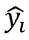
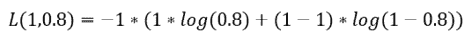
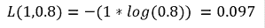
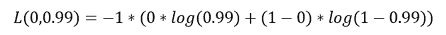
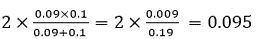
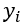
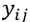
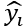
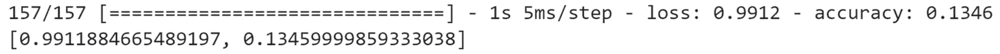

# 5。分类模型

概述

在这一章中，你将探索不同类型的分类模型。您将获得使用 TensorFlow 构建二元、多类和多标签分类器的实践经验。最后，您将学习模型评估的概念，以及如何使用不同的度量来评估模型的性能。

到本章结束时，你将很好地理解什么是分类模型，以及如何用 TensorFlow 编程。

# 简介

在前一章中，你学习了目标变量连续的回归问题。连续变量可以取最小值和最大值之间的任何值。您学习了如何使用 TensorFlow 训练此类模型。

在这一章中，你将看到另一种被称为分类的监督学习问题，其中目标变量是离散的，这意味着它只能取有限数量的值。在行业中，您很可能会遇到这样的项目，其中变量被聚合到组中，例如产品层、用户类别、客户或工资范围。分类器的目标是从数据中学习模式，并预测要观察的正确类别。

例如，在贷款提供商的情况下，分类模型将试图根据客户的概况和财务状况来预测客户在未来一年中是否最有可能违约。这个结果只能取两个可能的值(`yes`或`no`)，这是一个二元分类。另一个分类器模型可以在给定用户先前的评级和关于新电影的信息的情况下，为用户预测新电影的评级 1 到 5。当结果可能有两个以上的可能值时，您正在处理多类分类。最后，还有第三种类型的分类器，称为多标签，其中模型将预测多个类别。例如，模型将分析输入图像并预测图像中是否有猫、狗或老鼠。在这种情况下，模型将预测三种不同的二进制输出(或标签)。

你将在本章中浏览每一种分类器，详述它们的特性，并探索如何测量这些模型的性能。

# 二元分类

如前所述，二元分类是指一种监督学习，其中目标变量只能取两个可能的值(或类)，如真/假或是/否。例如，在医疗行业，您可能希望根据患者的个人信息(如年龄、身高、体重和/或医学测量值)来预测患者是否更有可能患有疾病。同样，在市场营销中，广告商可能会利用类似的信息来优化电子邮件活动。

诸如随机森林分类器、支持向量分类器或逻辑回归等机器学习算法对于分类很有效。神经网络对于二分类也能取得很好的效果。将前一章中的回归模型转换成二元分类器是非常容易的。只需要两个关键变化:最后一层的激活函数和损失函数。

## 逻辑回归

`0`和`1`。值`0`通常对应于`false`(或`no`)，而值`1`是指`true`(或`yes`)。

换句话说，逻辑回归的输出将是它为真的概率。例如，如果输出是`0.3`，你可以说有 30%的概率结果应该是真的(或者是)。但是，由于只有两个可能的值，这也意味着有 70%(100%–30%)的可能性得到错误(或否)的结果:


图 5.1:逻辑回归的输出

现在您已经知道了逻辑回归的输出是什么，您只需要找到一个函数，它可以将一个连续的输入值转换为一个在`0`和`1`之间的值。幸运的是，这样的数学函数确实存在，它被称为 **sigmoid 函数**。该函数的公式如下:


图 5.2:sigmoid 函数的公式

对应于应用于`x`的指数函数。指数函数的范围从 0 到正无穷大。所以，如果`x`有一个接近正无穷大的值，那么 sigmoid 的值就会趋向于`1`。另一方面，如果`x`非常接近负无穷大，那么 sigmoid 的值将趋向于`0`:


图 5.3:sigmoid 函数曲线

因此，对线性回归模型的输出应用 sigmoid 函数会将其转换为逻辑回归。同样的逻辑也适用于神经网络:如果你将 sigmoid 函数应用于感知器模型(线性回归)，你将得到一个二元分类器。为此，您只需将 sigmoid 指定为感知器模型的最后一个全连接层的激活函数。在 TensorFlow 中，将`activation`参数指定为:

```
from tensorflow.keras.layers import Dense
Dense(1, activation='sigmoid')
```

前面的代码片段显示了如何用一个可以输出任何值的单元定义一个完全连接的层，并对其应用 sigmoid 激活函数。结果将在`0`和`1`内。现在，您已经知道如何修改神经网络的回归模型以将其转换为二元分类器，您需要指定相关的损失函数。

## 二元交叉熵

在上一节中，您学习了如何将线性回归模型转换为二元分类器。对于神经网络，只需添加 sigmoid 作为最后一个完全连接层的激活函数。但是还有另一个因素会影响这个模型的训练:损失函数的选择。

对于线性回归，最常用的损失函数是**均方误差**和**平均绝对误差**，参见*第 4 章*、*回归和分类模型*。这些函数将计算预测值和实际值之间的差异，神经网络模型将在反向传播期间相应地更新其所有权重。对于二进制分类，典型的损失函数是**二进制交叉熵**(也称为**对数损失**)。该函数的公式如下:


图 5.4:二元交叉熵公式

代表观察值`i`的实际值。

代表观察值`i`的预测概率。

`N`代表观察总数。

这个公式看起来相当复杂，但逻辑却相当简单。考虑以下单次观察的例子:实际值是`1`，预测概率是`0.8`。如果应用前面的公式，结果将如下:



请注意，等式的右边大约为零:



因此，由于预测值非常接近实际值，损失值将非常小。

现在考虑另一个例子，其中实际值是`0`，预测概率是`0.99`。结果将如下所示:




这种情况下损失会很大，因为预测值与实际值相差很大。

计算这个损失的`BinaryCrossentropy`:

```
from tensorflow.keras.losses import BinaryCrossentropy
bce = BinaryCrossentropy()
```

## 二进制分类体系结构

二元分类器的架构与线性回归的架构极为相似，参见*第 4 章*、*回归和分类模型*。它由读取输入数据集的每个观察值的输入层、负责预测响应变量的输出层以及学习导致正确预测的模式的一些隐藏层组成。下图显示了这种架构的一个示例:


图 5.5:二元分类器的架构

与线性回归相比，唯一的区别是输出，即`0`和`1`之间的概率值。这个概率表示两个可能值之一出现的可能性。如前所述，这是通过使用 sigmoid 激活函数和反向传播的二进制交叉熵实现的。

既然您已经看到了构建二元分类器的所有元素，那么您可以通过一个练习将它付诸实践。

## 练习 5.0 1:建立逻辑回归模型

在本练习中，您将在 TensorFlow 中构建和训练一个逻辑回归模型，该模型将使用有关 Dota 2 游戏的一些信息(如使用的模式和类型)来预测该游戏中的获胜队。

你将在 Dota 2 数据集上工作。Dota 2 是一款流行的电脑游戏。数据集包含与游戏相关的信息，目标变量指示哪个队赢了。

注意

训练数据集可以在这里访问:【https://packt.link/Tdvdj 。

测试数据集可以在这里访问:[https://packt.link/4PsPN](https://packt.link/4PsPN)。

原始数据集可以在这里找到:[https://archive.ics.uci.edu/ml/datasets/Dota2+Games+Results](https://archive.ics.uci.edu/ml/datasets/Dota2+Games+Results)。

1.  打开新的 Jupyter 笔记本。
2.  导入熊猫库，使用`pd`作为别名:

    ```
    import pandas as pd
    ```

3.  创建一个名为`train_url`的变量，其中包含训练集的 URL:

    ```
    train_url = 'https://raw.githubusercontent.com/PacktWorkshops'\             '/The-TensorFlow-Workshop/master/Chapter05'\             '/dataset/dota2Train.csv'
    ```

4.  Load the training dataset into a `DataFrame()` function called `X_train` using `read_csv()` method, provide the URL to the CSV file, and set `header=None` as the dataset doesn't provide column names. Print the first five rows of the DataFrame using `head()`method:

    ```
    X_train = pd.read_csv(train_url, header=None)
    X_train.head()
    ```

    预期产出如下:

    

    图 5.6:Dota 2 训练集的前五行

    您可以看到数据集包含 117 列，它们都是数字。还要注意，目标变量(列`0`)包含两个不同的值:`-1`和`1`。由于您将训练一个逻辑回归模型，可能的值应该是`0`和`1`。您需要用`0`替换`-1`值。

5.  使用`pop()`方法提取目标变量(第 0 列)并保存在名为`y_train` :

    ```
    y_train = X_train.pop(0)
    ```

    的变量中
6.  Replace all values with `-1` with `0` from the target variable using `replace()`, and print the first five rows using `head()` method:

    ```
    y_train = y_train.replace(-1,0)
    y_train.head()
    ```

    预期产出如下:

    

    图 5.7:训练集中 Dota 2 目标变量的前五行

    现在，来自训练集的目标变量的所有值不是`0`就是`1`。

7.  创建一个名为`test_url`的变量，它包含测试集的 URL:

    ```
    test_url = 'https://raw.githubusercontent.com/PacktWorkshops'\            '/The-TensorFlow-Workshop/master/Chapter05/dataset'\            '/dota2Test.csv'
    ```

8.  Load the test dataset into a `DataFrame()` function called `X_test` using `read_csv()` method, provide the URL to the CSV file, and set `header=None` as the dataset doesn't provide column names. Print the first five rows using `head()` method:

    ```
    X_test = pd.read_csv(test_url, header=None)
    X_test.head()
    ```

    预期产出如下:

    

    图 5.8:Dota 2 测试集的前五行

    测试集与训练集非常相似，您需要对它执行相同的转换。

9.  使用`pop()`方法提取目标变量(第 0 列),并将其保存在名为`y_test` :

    ```
    y_test = X_test.pop(0)
    ```

    的变量中
10.  Replace all values with `-1` with `0` from the target variable using `replace()` method and print the first five rows using `head()` method:

    ```
    y_test = y_test.replace(-1,0)
    y_test.head()
    ```

    预期产出如下:

    

    图 5.9:测试集中 Dota 2 目标变量的前五行

11.  导入 TensorFlow 库，使用`tf`作为别名:

    ```
    import tensorflow as tf
    ```

12.  将 TensorFlow 的种子设置为`8`，使用`tf.random.set_seed()`获得可重复的结果:

    ```
    tf.random.set_seed(8)
    ```

13.  使用`tf.keras.Sequential()`实例化一个顺序模型，并将其存储在一个名为`model` :

    ```
    model = tf.keras.Sequential()
    ```

    的变量中
14.  从`tensorflow.keras.layers` :

    ```
    from tensorflow.keras.layers import Dense
    ```

    导入`Dense()`类
15.  使用`Dense()`创建一个由`512`个单元组成的全连接图层，并将 ReLu 指定为激活函数，将输入形状指定为`(116,)`，这对应于数据集中的要素数量。将其保存在一个名为`fc1` :

    ```
    fc1 = Dense(512, input_shape=(116,), activation='relu')
    ```

    的变量中
16.  用`Dense()`创建一个全连接的`512`单元层，并将 ReLu 指定为激活函数。将它保存在一个名为`fc2` :

    ```
    fc2 = Dense(512, activation='relu')
    ```

    的变量中
17.  用`Dense()`创建一个全连接的`128`单元层，并将 ReLu 指定为激活函数。保存在一个名为`fc3` :

    ```
    fc3 = Dense(128, activation='relu')
    ```

    的变量中
18.  用`Dense()`创建一个全连接的`128`单元层，并将 ReLu 指定为激活函数。保存在一个名为`fc4` :

    ```
    fc4 = Dense(128, activation='relu')
    ```

    的变量中
19.  用`Dense()`创建一个完全连接的`128`单元层，并将 sigmoid 指定为激活函数。保存在一个名为`fc5` :

    ```
    fc5 = Dense(1, activation='sigmoid')
    ```

    的变量中
20.  使用`add()`方法:

    ```
    model.add(fc1) model.add(fc2) model.add(fc3) model.add(fc4) model.add(fc5)
    ```

    将所有五个完全连接的层依次添加到模型中
21.  Print the summary of the model using `summary()` method:

    ```
    model.summary()
    ```

    预期产出如下:

    

    图 5.10:模型架构概要

    前面的输出显示了您的模型中有五个层(如预期的那样),并显示了每个层的参数数量。例如，第一层包含 59，904 个参数，该模型的参数总数为 404，855。所有这些参数将在拟合模型时被训练。

22.  从`tf.keras.losses`实例化一个`BinaryCrossentropy()`函数，并保存在一个名为`loss` :

    ```
    loss = tf.keras.losses.BinaryCrossentropy()
    ```

    的变量中
23.  将`tf.keras.optimizers`中的`Adam()`实例化为`0.001`作为学习率，并保存在一个名为`optimizer` :

    ```
    optimizer = tf.keras.optimizers.Adam(0.001)
    ```

    的变量中
24.  使用`compile()`函数编译模型，并指定您在前面的步骤中刚刚创建的优化器和损失:

    ```
    model.compile(optimizer=optimizer, loss=loss)
    ```

25.  Start the model training process using `fit()` method on the training set for five epochs:

    ```
    model.fit(X_train, y_train, epochs=5)
    ```

    预期产出如下:

    

    图 5.11:培训过程的日志

    前面的输出显示了模型训练期间每个时期的日志。注意，处理单个时段花费了大约 15 秒，并且损失值从`0.6923`(第一时段)减少到`0.6650`(第五时段)，因此该模型正在通过减少二进制交叉熵损失来慢慢提高其性能。

26.  Predict the results of the test set using `predict()` method. Save it in a variable called `preds` and display its first five values:

    ```
    preds = model.predict(X_test)
    preds[:5]
    ```

    预期产出如下:

    

    图 5.12:测试集前五行的预测

    前面的输出显示了每个预测的概率。低于`0.5`的每个值将被归类为`0`(该输出中的第一个和最后一个观察值)，所有大于或等于`0.5`的值将被归类为`1`(第二至第四个观察值)。

27.  Display the first five true labels of the test set:

    ```
    y_test[:5]
    ```

    预期产出如下:

    

图 5.13:测试集前五行的真实标签

将此输出与测试集前五行的模型预测进行比较，会发现一些不正确的值:第三个预测(索引`2`)的值应该是`0`，最后一个预测的值应该是`0`。所以，在这五个观察中，你的二元分类器犯了两个错误。

在前面的小节中，您将看到如何使用不同的度量标准正确地评估模型的性能。

# 分类标准

在上一节中，您学习了如何训练一个二元分类器来预测正确的输出:不是`0`就是`1`。在*练习 5.01* 、*构建逻辑回归模型*中，您查看了一些样本来评估所构建模型的性能。通常，您不只是在一个小的子集上评估模型，而是在整个数据集上使用一个性能度量标准(如准确性或 F1 分数)来评估模型。

## 准确度和零交流准确度

分类问题最广泛使用的度量之一是准确性。它的公式很简单:


图 5.14:准确性度量的公式

精确度的最大值是`1`，这意味着模型正确预测 100%的情况。其最小值为`0`，模型无法正确预测任何情况。

对于二元分类器，正确预测的数量是将值`0`或`1`作为正确预测值的观察值的数量:


图 5.15:二元分类器的准确度公式

假设您正在评估两个不同的二元分类器在测试集上预测 10，000 次观察结果的性能。第一个模型正确预测了值`0`的 5000 个实例和值`1`的 3000 个实例。其准确度得分如下:


图 5.16:模型 1 的精确度公式

第二个模型正确预测了 500 个案例的值`0`和 1500 个观察的值`1`。其准确度得分如下:


图 5.17:模型 2 精度的公式

第一个模型预测准确率为 80%,而第二个模型只有 20%。在这种情况下，你可以说模型 1 比模型 2 好。

尽管`0.8`通常是一个相对较好的分数，但这并不一定意味着你的模型表现良好。例如，假设您的数据集包含 9000 个值为`0`的案例和 1000 个值为`1`的案例。一个总是预测值`0`的非常简单的模型将获得 0.9 的准确度分数。在这种情况下，第一个模型的表现甚至不如这个极其简单的模型。这种总是预测数据集的最频繁值的模型的特征被称为`0.9`，因为简单模型预测`0`，这在 90%的情况下是正确的。

注意

精度和零精度度量并不特定于二进制分类，但也可以应用于其他类型的分类。

TensorFlow 提供了一个类`tf.keras.metrics.Accuracy`，它可以根据张量计算准确度分数。这个类有一个名为`update_state()`的方法，它将两个张量作为输入参数，并将计算它们之间的准确度分数。您可以通过调用`result()`方法来访问这个分数。输出结果将是一个张量。您可以使用`numpy()`方法将其转换为 NumPy 数组。以下是如何计算准确度分数的示例:

```
from tensorflow.keras.metrics import Accuracy
preds = [1, 1, 1, 1, 0, 0]
target = [1, 0, 1, 0, 1, 0]
acc = Accuracy()
acc.update_state(preds, target)
acc.result().numpy()
```

这将导致以下准确度分数:

```
0.5
```

注意

TensorFlow 没有提供空精度度量的类，但是您可以使用`Accuracy()`轻松计算它，并提供一个仅使用`1`(或`0`)作为预测的张量。

## 精度、召回和测试他的 F1 分数

在上一节中，您学习了如何使用准确性度量来评估模型的性能，并将其与称为零准确性的基线进行比较。准确性分数被广泛使用，因为它为非技术受众所熟知，但它确实有一些限制。考虑下面的例子。


图 5.18:模型预测与实际值的对比示例

该模型达到了 0.981 的准确度分数，这是相当高的。但如果用这个模型来预测一个人是否有疾病，只会在单一情况下预测正确。在九个案例中，它错误地预测这些人没有生病，而他们实际上患有特定的疾病。同时，它错误地预测了 10 个实际上健康的人患病。因此，这种模式的表现显然不能令人满意。不幸的是，准确性分数仅仅是一个总体分数，它不会告诉你模型在哪里表现不好。

幸运的是，其他指标提供了对模型的更好的评估，如精确度、召回率或 F1 分数。所有这三个度量具有与准确度分数相同的值范围:`1`是完美的分数，其中所有的观察都被正确地预测，而`0`是最差的，其中根本没有正确的预测。

但是在查看它们之前，您需要熟悉以下定义:

*   **真阳性(TP)** :实际值和对应的预测值都为真的所有观测值
*   **真阴性(TN)** :实际值和对应的预测值都为假的所有观察值
*   **假阳性(FP)** :预测为真，但值实际为假的所有观察值
*   **假阴性(FN)** :预测为假，但实际值为真的所有观察值

以*图 5.18* 为例，你会得到以下结果:

*   TP = 1
*   TN = 980
*   FP = 10
*   FN = 9

这在下表中可以看到:


图 5.19:TP、TN、FP 和 FN 的例子

精度分数是评估模型是否预测了大量 FPs 的度量。其公式如下:


图 5.20:精度公式

在前面的例子中，精度分数将是。你可以看到这个模型犯了很多错误，并且与实际的 TP 相比预测了很多 FPs。

召回用于评估 fn 相对于 TP 的数量。其公式如下:


图 5.21:召回公式

在前面的例子中，召回分数将是。使用此指标，您可以看到模型表现不佳，并且预测了大量 fn。

最后，F1 分数是一个结合了精确度和召回率的指标(它是精确度和召回率的调和平均值)。其公式如下:


图 5.22:F1 分数的公式

以与前述相同的例子为例，F1 分数将为

该模型取得了 F1 分数`0.095`，与其准确度分数`0.981`相差甚远。因此，当您想要强调不正确的预测时，F1 分数是一个很好的性能指标，该分数考虑了分数中 fn 和 FPs 的数量，以及 TPs 和 TN 的数量。

注意

与准确度、精确度和召回性能度量一样，F1 分数也可以应用于其他类型的分类。

通过使用`Precision()`和`Recall()`各自的类，您可以使用 TensorFlow 轻松计算精度和召回率:

```
from tensorflow.keras.metrics import Precision, Recall
preds = [1, 1, 1, 1, 0, 0]
target = [1, 0, 1, 0, 1, 0]
prec = Precision()
prec.update_state(preds, target)
print(f"Precision: {prec.result().numpy()}")
rec = Recall()
rec.update_state(preds, target)
print(f"Recall: {rec.result().numpy()}")
```

这会产生以下输出:


图 5.23:所提供示例的精确度和召回分数

注意

TensorFlow 没有提供计算 F1 分数的类，但这可以通过创建自定义指标来轻松完成。这将在*练习 5.02* 、*分类评估指标*中涉及。

## 混淆矩阵

混淆矩阵本身并不是一个性能指标，而是一个图形化工具，用来将模型的预测与实际值进行对比。实际上，您已经在前面的*图 5.18* 中看到了一个例子。

混淆矩阵将在一个轴(例如，水平轴)上显示所有可能的预测值，在另一个轴(垂直轴)上显示实际值。在预测值和实际值的每个组合的交叉点，您将记录属于这种情况的观察值的数量。

对于二元分类，混淆矩阵将如下所示:


图 5.24:二元分类的混淆矩阵

理想的情况是所有的值都位于这个矩阵的对角线上。这将意味着您的模型正确地预测了所有可能的值。这条对角线之外的所有值都是模型出错的地方。

注意

混淆矩阵也可以用于多类分类，而不仅仅局限于二元分类。

运行下面的代码来查看混淆矩阵:

```
from tensorflow.math import confusion_matrix
preds = [1, 1, 1, 1, 0, 0]
target = [1, 0, 1, 0, 1, 0]
print(confusion_matrix(target, preds))
```

这将显示以下输出:


图 5.25:TensorFlow混淆矩阵

前面的输出显示了混淆矩阵。从中可以看出，模型已经预测了以下结果:两个 TPs，一个 TN，两个 FPs，一个 FN。

在下一个练习中，您将把这些绩效指标应用于您在*练习 5.01* 、*构建逻辑回归模型*中创建的相同逻辑回归模型。

## 练习 5.02:分类评估指标

在本练习中，您将重复使用与*练习 5.01* 、*构建逻辑回归模型*中相同的逻辑回归模型，并通过查看不同的性能指标来评估其性能:准确度、精确度、召回率和 F1 分数。

悉尼大学的 Stephen Tridgell 分享了原始数据集。

注意

训练数据集可以在这里访问:[https://packt.link/QJGpA](https://packt.link/QJGpA)。

测试数据集可以在这里访问:[https://packt.link/ix5rW](https://packt.link/ix5rW)。

*练习 5.01* 、*建立逻辑回归模型*中的模型，可以在这里找到:[https://packt.link/sSRQL](https://packt.link/sSRQL)。

现在，运行以下指令:

1.  打开新的 Jupyter 笔记本。
2.  导入熊猫库并使用`pd`作为别名:

    ```
    import pandas as pd
    ```

3.  创建一个名为`train_url`的变量，其中包含训练集的 URL:

    ```
    train_url = 'https://raw.githubusercontent.com/PacktWorkshops'\             '/The-TensorFlow-Workshop/master/Chapter05/dataset'\             '/dota2PreparedTrain.csv'
    ```

4.  使用`read_csv()`方法将训练数据集加载到名为`X_train`的`DataFrame()`函数中，提供 CSV 文件的 URL，并设置`header=None`为数据集不提供列名:

    ```
    X_train = pd.read_csv(train_url, header=None)
    ```

5.  使用`pop()`方法提取目标变量(列`0`)并保存在名为`y_train` :

    ```
    y_train = X_train.pop(0)
    ```

    的变量中
6.  创建一个名为`test_url`的变量，它包含测试集的 URL:

    ```
    test_url = 'https://raw.githubusercontent.com/PacktWorkshops'\            '/The-TensorFlow-Workshop/master/Chapter05/dataset'\            '/dota2PreparedTest.csv'
    ```

7.  使用`read_csv()`方法将测试数据集加载到名为`X_test`的`DataFrame()`函数中，提供 CSV 文件的 URL，并设置`header=None`为数据集不提供列名:

    ```
    X_test = pd.read_csv(test_url, header=None)
    ```

8.  使用`pop()`方法提取目标变量(列`0`)并保存在名为`y_test` :

    ```
    y_test = X_test.pop(0)
    ```

    的变量中
9.  使用`tf`作为别名导入`tensorflow`库，并从`tensorflow.keras.utils` :

    ```
    import tensorflow as tf from tensorflow.keras.utils import get_file
    ```

    导入`get_file()`方法
10.  创建一个名为`model_url`的变量，包含模型的 URL:

    ```
    model_url = 'https://github.com/PacktWorkshops'\             '/The-TensorFlow-Workshop/blob/master/Chapter05'\             'model/exercise5_01_model.h5?raw=true'
    ```

11.  通过提供文件名(`exercise5_01_model.h5`)及其 URL，使用`get_file()`方法在本地下载模型。将输出保存到名为`model_path` :

    ```
    model_path = get_file('exercise5_01_model.h5', model_url)
    ```

    的变量
12.  用`tf.keras.models.load_model()`加载模型，并指定模型的本地路径:

    ```
    model = tf.keras.models.load_model(model_path)
    ```

13.  Print the model summary using the `summary()` method:

    ```
    model.summary()
    ```

    预期产出如下:

    

    图 5.26:模型总结

    前面的输出显示了与*练习 5.01* 、*构建逻辑回归模型*中的模型相同的架构。

14.  Predict the results of the test set using `predict()` method. Save it in a variable called `preds_proba` and display its first five values:

    ```
    preds_proba = model.predict(X_test)
    preds_proba[:5]
    ```

    预期产出如下:

    

    图 5.27:测试集的预测概率

    输出是对每个观察的`1`(或真实)的预测概率。你只需要将这些概率转换成`0`和`1`。为此，您需要考虑所有概率大于或等于`0.5`的情况为`1`(或真)，概率小于`0.5`的记录为`0`(或假)。

15.  Convert the predicted probabilities into `1` when the probability is greater than or equal to `0.5`, and `0` when below `0.5`. Save the results in a variable called `preds` and print its first five rows:

    ```
    preds = preds_proba >= 0.5
    preds[:5]
    ```

    预期产出如下:

    

    图 5.28:测试集的预测

    现在预测已经被转换成二进制值:true(等于`1`)和 false(等于`0`)。

16.  从`tensorflow.keras.metrics` :

    ```
    from tensorflow.keras.metrics import Accuracy, Precision, Recall
    ```

    导入`Accuracy`、`Precision`和`Recall`
17.  实例化`Accuracy`、`Precision`和`Recall`对象，并分别保存在名为`acc`、`pres`和`rec`的变量中:

    ```
    acc = Accuracy() prec = Precision() rec = Recall()
    ```

18.  Calculate the accuracy score on the test set with the `update_state()`, `result()`, and `numpy()` methods. Save the results in a variable called `acc_results` and print its content:

    ```
    acc.update_state(preds, y_test)
    acc_results = acc.result().numpy()
    acc_results
    ```

    预期产出如下:

    ```
    0.59650314
    ```

    该模型获得了`0.597`的准确度分数。

19.  Calculate the precision score on the test set with the `update_state()`, `result()`, and `numpy()` methods. Save the results in a variable called `prec_results` and print its content:

    ```
    prec.update_state(preds, y_test)
    prec_results = prec.result().numpy()
    prec_results
    ```

    预期产出如下:

    ```
    0.59578335
    ```

    这个模型取得了`0.596`的精度分数。

20.  Calculate the recall score on the test set with the `update_state()`, `result()`, and `numpy()` methods. Save the results in a variable called `rec_results` and print its content:

    ```
    rec.update_state(preds, y_test)
    rec_results = rec.result().numpy()
    rec_results
    ```

    预期产出如下:

    ```
    0.6294163
    ```

    这个模型取得了`0.629`的召回分数。

21.  Calculate the F1 score by applying the formula shown in the previous section. Save the result in a variable called `f1` and print its content:

    ```
    f1 = 2*(prec_results * rec_results) / (prec_results + rec_results)
    f1
    ```

    预期产出如下:

    ```
    0.6121381493171637
    ```

    总的来说，该模型在所有四个不同的指标上取得了接近`0.6`的很低的分数:准确度、精确度、召回率和 F1 分数。所以，这个模型做出的正确预测几乎和错误预测一样多。你可以自己尝试建立另一个模型，看看是否能提高它的性能。

在前面的部分中，您将看到使用多类分类将分类扩展到两个以上的可能值。

# 多类分类

使用二进制分类，您只能处理只能取两个可能值的目标变量:`0`和`1`(假或真)。多类分类可以看作是这种分类的扩展，允许目标变量有两个以上的值(或者你可以说二元分类只是多类分类的一个子集)。例如，预测患者不同疾病严重程度的模型，或者根据用户过去的购物行为将用户分为不同组的模型，将是多类分类器。

在下一节中，您将深入了解 softmax 函数，该函数用于多类分类。

## soft max 功能

二元分类器需要一个特定的激活函数用于神经网络的最后一个全连接层，即 sigmoid。针对多类分类器的激活函数是不同的。是 softmax。其公式如下:


图 5.29:soft max 函数的公式

对应于`i`等级的预测值。

对应于类别`j`的预测值。

该公式将应用于目标变量的每个可能值。如果您有 10 个可能的值，那么这个激活函数将计算 10 个不同的 softmax 值。

请注意，softmax 对分子和分母的预测值进行幂运算。这背后的原因是指数函数放大了预测值之间的微小变化，并使概率更接近于`0`或`1`，以便解释最终输出。比如`exp(2) = 7.39`而`exp(2.2) = 9.03`。因此，如果两个类的预测值彼此接近，则它们的指数值之间的差异会大得多，因此选择较高的值会更容易。

softmax 函数的结果介于`0`和`1`之间，因为该方法将一个类的值除以所有类的总和。因此，softmax 函数的实际输出是相关类成为最终预测的概率:


图 5.30:soft max 变换示例

在前面的示例中，目标变量有五个不同的值，softmax 函数将它们转换成概率。第一类(`0`)是概率最高的一类，这将是最终的预测。

## 分类交叉熵

多类分类还需要特定的损失函数，该损失函数不同于二元分类器的二元交叉熵。对于多类分类，损失函数是类别交叉熵。其公式如下:


图 5.31:分类交叉熵公式

代表观察值`i`的实际值属于`j`类的概率。

代表观察值`i`属于`j`类的预测概率。

TensorFlow 为此损失函数提供了两个不同的类别:`CategoricalCrossentropy()`和`SparseCategoricalCrossentropy()`:

```
from tensorflow.keras.losses import CategoricalCrossentropy, 
                                    SparseCategoricalCrossentropy
cce = CategoricalCrossentropy()
scce = SparseCategoricalCrossentropy()
```

两者的区别在于目标变量的格式。如果实际值被存储为代表实际类的一键编码，那么您将需要使用`CategoricalCrossentropy()`。另一方面，如果响应变量存储为整数来表示实际的类，您将不得不使用`SparseCategoricalCrossentropy()`:


图 5.32:根据目标变量的格式使用的损失函数

多类模型的输出将是一个向量，包含目标变量的每一类的概率，如下所示:

```
import numpy as np
preds_proba = np.array([0.54, 0.16, 0.09, 0.15, 0.06])
```

第一个值(`0.54`)对应于索引为 0 的类的概率，`0.016`是索引为 1 的类的概率，而`0.09`对应于索引为 2 的类的概率，依此类推。

为了得到最终的预测(即概率最高的类)，您需要使用`argmax()`函数，该函数将查看来自一个向量的所有值，找到最大值，并返回与之关联的索引:

```
preds_proba.argmax()
```

这将显示以下输出:

```
0
```

在前面的例子中，最终预测是`class 0`，它对应于具有最高概率的向量索引(`0.54`)。

## 多类分类架构

多类分类器的 arc 体系结构非常类似于逻辑回归，除了最后一层将包含更多的单元。它们中的每一个都对应于目标变量的一个类。例如，如果您正在构建一个模型，该模型将大小为 6 的向量作为输入，并使用单个隐藏层预测具有三个不同值的响应，其体系结构将如下所示:


图 5.33:多类分类器的架构

最后一层的 softmax 激活函数提供了每个可能类别的发生概率:`A`、`B`和`C`。这些概率是相互依赖的，因为最终应该只有一个类别被预测。如果类别`A`更有可能是预测值(如前一示例所示)，则其余类别(`B`和`C`)的概率应该较低。注意，所有类别概率的总和等于`1`。因此，他们确实是相互依赖的。

现在您已经知道了所有的构建模块，您可以在下面的练习中构建一个多类分类器。

## 练习 5.03:建立一个多班级模型

在本练习中，您将在 TensorFlow 中构建和训练一个多类分类器，该分类器将使用该数据集中提供的九个不同的数字特征，根据八个不同的值来预测航天飞机的辐射器位置。

目标变量(最后一列)包含七个不同的级别:`Rad.Flow`、`Fpv.Close`、`Fpv.Open`、`High`、`Bypass`、`Bpv.Close`和`Bpv.Open`。您的目标是使用数据集中的九个要素准确预测这七个级别之一。

注意

训练数据集可以在这里访问:[https://packt.link/46iMY](https://packt.link/46iMY)。

测试数据集可以在这里访问:[https://packt.link/dcNPt](https://packt.link/dcNPt)。

原始数据集可以在这里找到:[http://archive . ics . UCI . edu/ml/datasets/Statlog+% 28 shuttle % 29](http://archive.ics.uci.edu/ml/datasets/Statlog+%28Shuttle%29)。

执行以下步骤来完成练习:

1.  打开新的 Jupyter 笔记本。
2.  导入熊猫库并使用`pd`作为别名:

    ```
    import pandas as pd
    ```

3.  创建一个名为`train_url`的变量，其中包含训练集的 URL:

    ```
    train_url = 'https://raw.githubusercontent.com/PacktWorkshops'\             '/The-TensorFlow-Workshop/master/Chapter05'\             '/dataset/shuttle.trn'
    ```

4.  Load the training dataset into a DataFrame called `X_train` using the `read_table()` method, provide the URL to the CSV file, use `header=None` as the dataset doesn't provide column names, and use `sep=' '` as each column is separated by spaces in this dataset. Print the first five rows using `head()` method:

    ```
    X_train = pd.read_table(train_url, header=None, sep=' ')
    X_train.head()
    ```

    预期产出如下:

    

    图 5.34:训练集的前五行

    您可以看到数据集包含 10 列，它们都是数字。另外，注意目标变量(列`9`)包含不同的类值。

5.  使用`pop()`方法提取目标变量(列`9`)并保存在名为`y_train` :

    ```
    y_train = X_train.pop(9)
    ```

    的变量中
6.  创建一个名为`test_url`的变量，它包含测试集的 URL:

    ```
    test_url = 'https://raw.githubusercontent.com/PacktWorkshops'\            '/The-TensorFlow-Workshop/master/Chapter05/dataset'\            '/shuttle.tst'
    ```

7.  Load the test dataset into a DataFrame called `X_test` using `read_table()`, provide the URL to the CSV file, set `header=None` as the dataset doesn't provide column names, and use `sep=' '` as each column is separated by a space in this dataset. Print the first five rows using `head()` method.

    ```
    X_test = pd.read_table(test_url, header=None, sep=' ')
    X_test.head()
    ```

    预期产出如下:

    

    图 5.35:测试集的前五行

    您可以看到测试集与训练集非常相似。

8.  使用`pop()`方法提取目标变量(列`9`)并保存在名为`y_test` :

    ```
    y_test = X_test.pop(9)
    ```

    的变量中
9.  导入 TensorFlow 库并使用`tf`作为别名:

    ```
    import tensorflow as tf
    ```

10.  使用`tf.random.set_seed()`将TensorFlow的种子设置为`8`以获得可重复的结果:

    ```
    tf.random.set_seed(8)
    ```

11.  使用`tf.keras.Sequential()`实例化一个序列模型，并将其存储在一个名为`model` :

    ```
    model = tf.keras.Sequential()
    ```

    的变量中
12.  从`tensorflow.keras.layers` :

    ```
    from tensorflow.keras.layers import Dense
    ```

    导入`Dense()`级
13.  使用`Dense()`创建一个由`512`个单元组成的全连接图层，并将 ReLu 指定为激活函数，将输入形状指定为`(9,)`，这对应于数据集中的要素数量。将其保存在一个名为`fc1` :

    ```
    fc1 = Dense(512, input_shape=(9,), activation='relu')
    ```

    的变量中
14.  用`Dense()`创建一个全连接的`512`单元层，并将 ReLu 指定为激活函数。将其保存在一个名为`fc2` :

    ```
    fc2 = Dense(512, activation='relu')
    ```

    的变量中
15.  用`Dense()`创建一个全连接的`128`单元层，并指定 ReLu 为激活函数。将其保存在一个名为`fc3` :

    ```
    fc3 = Dense(128, activation='relu')
    ```

    的变量中
16.  同样，用`Dense()`创建一个完全连接的`128`单元层，并将 ReLu 指定为激活函数。将它保存在一个名为`fc4` :

    ```
    fc4 = Dense(128, activation='relu')
    ```

    的变量中
17.  用`Dense()`创建一个 128 个单位的全连接层，并将 softmax 指定为激活函数。保存在一个名为`fc5` :

    ```
    fc5 = Dense(8, activation='softmax')
    ```

    的变量中
18.  使用`add()`方法将所有五个完全连接的层依次添加到模型中。

    ```
    model.add(fc1) model.add(fc2) model.add(fc3) model.add(fc4) model.add(fc5)
    ```

19.  Print the summary of the model using `summary()` method:

    ```
    model.summary()
    ```

    预期产出如下:

    

    图 5.36:模型架构概要

    前面的输出显示您的模型中有五个层(如预期的那样),并告诉您每个层的参数数量。例如，第一层包含`5,120`个参数，该模型的参数总数为`350,984`。所有这些参数将在拟合模型时被训练。

20.  从`tf.keras.losses`实例化`SparseCategoricalCrossentropy()`并保存在一个名为`loss` :

    ```
    loss = tf.keras.losses.SparseCategoricalCrossentropy()
    ```

    的变量中
21.  用`0.001`作为学习率实例化`tf.keras.optimizers`中的`Adam()`，并保存在一个名为`optimizer` :

    ```
    optimizer = tf.keras.optimizers.Adam(0.001)
    ```

    的变量中
22.  使用`compile()`方法编译模型，并指定优化器和损耗参数，精确度作为要报告的度量:

    ```
    model.compile(optimizer=optimizer, loss=loss, \               metrics=['accuracy'])
    ```

23.  Start the model training process using `fit()` method on the training set for five epochs:

    ```
    model.fit(X_train, y_train, epochs=5)
    ```

    预期产出如下:

    

    图 5.37:培训过程的日志

    前面的输出显示了模型训练期间每个时期的日志。注意，处理单个时期花费了大约 7 秒，并且损失值从`0.5859`(第一时期)减少到`0.0351`(第五时期)。

24.  Evaluate the performance of the model on the test set using the `evaluate()` method:

    ```
    model.evaluate(X_test, y_test)
    ```

    预期产出如下:

    

图 5.38:模型在测试集上的表现

在本练习中，您学习了如何构建和训练一个多类分类器来预测由八个不同类组成的结果。你的模型在训练集和测试集上都达到了接近`0.997`的准确率，这是非常了不起的。这意味着您的模型在大多数情况下都能正确预测正确的类别。

现在，让我们在下面的活动中巩固您的学习。

## 活动 5.01:用 TensorFlow 建立字符识别模型

在本活动中，您的任务是构建和训练一个多类分类器，该分类器将从图像中识别字母表中的 26 个字母。在该数据集中，图像已被转换为 16 种不同的统计度量，这些度量将构成我们的特征。这个模型的目标是确定每个观察值属于 26 个字符中的哪一个。

原始数据集由 Odesta 公司的 David J. Slate 分享，可以在这里找到:[http://archive.ics.uci.edu/ml/datasets/Letter+Recognition](http://archive.ics.uci.edu/ml/datasets/Letter+Recognition)。

可以从这里访问数据集:[https://packt.link/j8m3L](https://packt.link/j8m3L)。

以下步骤将帮助您完成活动:

1.  用熊猫的`read_csv()`加载数据。
2.  用`pop()`方法从熊猫中提取目标变量。
3.  将数据分为定型集(前 15，000 行)和测试集(后 5，000 行)。
4.  分别用`512`、`512`、`128`、`128`和`26`单元的五个全连接层构建多类分类器。
5.  在训练集上训练此模型。
6.  使用 TensorFlow 的`evaluate()`方法在测试集上评估其性能。
7.  Print the confusion matrix with `confusion_matrix()` from TensorFlow.

    预期产出如下:

    

图 5.39:测试集的混淆矩阵

注意

此活动的解决方案可通过[此链接](B16341_Solution_ePub.xhtml#_idTextAnchor265)找到。

# 多标签分类

多标签分类是另一种类型的分类，在这种分类中，您不仅可以预测一个目标变量(如二元或多类分类),还可以同时预测多个响应变量。例如，您可以预测图像中出现的不同对象的多个输出(例如，一个模型将预测给定图片中是否有一只猫、一个人和一辆汽车)，或者您可以预测一篇文章的多个主题(例如，这篇文章是否是关于经济、国际新闻和制造业的)。

用神经网络实现多标签分类极其容易，并且您已经了解了构建多标签分类所需的一切。在 TensorFlow 中，多标签分类器的架构看起来与多类的架构相同，最终输出层具有与您想要预测的目标变量数量相对应的多个单元。但是，您将分别使用 sigmoid 和二进制交叉熵作为激活函数和损失函数，而不是使用 softmax 作为激活函数和分类交叉熵作为损失函数。

sigmoid 函数将预测每个目标变量的发生概率:


图 5.40:多标签分类器的架构

在前面的例子中，您有三个目标变量，每个变量都有独立于其他变量的发生概率(它们的和不等于 1)。该模型预测目标`2`和`3`很可能是该观察的输出。

从概念上讲，多标签分类结合了几个逻辑回归模型。它们将共享相同的参数(权重和偏差)，但具有独立的二进制输出。TensorFlow 中多类分类器示例的最后一层如下所示:

```
from tensorflow.keras.layers import Dense
Dense(3, activation='sigmoid')
```

要使用的损失函数将是二元交叉熵:

```
from tensorflow.keras.losses import BinaryCrossentropy
bce = BinaryCrossentropy()
```

现在，在接下来的活动中把你学到的东西付诸行动。

## 活动 5.02:用 TensorFlow 建立一个电影类型标签模型

在本活动中，您的任务是构建和训练一个多标签分类器，该分类器将从 28 个可能值中预测电影的类型。每部电影可以一次分配到多个类型。这些特征是从它的概要中提取的顶级关键词。用于此活动的数据集是原始数据集的子集，仅包含 20，000 行。

原始数据集由 http://www.uco.es/kdis/mllresources/#ImdbDesc 分享，可以在这里找到:。

可以从这里访问数据集的特征:[https://packt.link/yW5ru](https://packt.link/yW5ru)。

数据集的目标可以从这里访问:[https://packt.link/8f1mb](https://packt.link/8f1mb)。

以下步骤将帮助您完成活动:

1.  用熊猫的`read_csv()`加载特征和目标。
2.  将数据分为定型集(前 15，000 行)和测试集(后 5，000 行)。
3.  分别用`512`、`512`、`128`、`128`和`28`单元的五个全连接层构建多类分类器。
4.  在训练集上训练此模型。
5.  Evaluate its performance on the test set with `evaluate()` method from TensorFlow.

    预期产出如下:

    

图 5.41:活动 5.02 的预期产出

注意

此活动的解决方案可通过[此链接](B16341_Solution_ePub.xhtml#_idTextAnchor267)找到。

# 总结

在这一章中，你以对分类模型及其与回归模型的差异的介绍开始了你的旅程。您了解了分类器的目标变量只能包含有限数量的可能值。

然后，您探索了二进制分类，其中响应变量只能来自两个可能的值:`0`或`1`。您发现了使用 sigmoid 激活函数和二进制交叉熵作为损失函数使用 TensorFlow 构建逻辑回归模型的特殊性，并且您构建了自己的二进制分类器来预测视频游戏 Dota 2 的获胜团队。

在此之后，您了解了可用于评估分类器模型性能的不同性能指标。您练习了使用 TensorFlow 计算准确度、精确度、召回率和 F1 分数，还绘制了混淆矩阵，这是一种可视化工具，可以查看模型在哪些地方做出了正确和错误的预测。

然后你就进入了多类分类的话题。这种模型和二元分类器之间的区别在于，它们的响应变量可以取两个以上的可能值。您查看了 softmax 激活函数和分类交叉熵损失函数，它们用于在 TensorFlow 中训练此类模型。

最后，在上一节中，您学习了多标签分类，其中输出可以同时是多个类。在 TensorFlow 中，通过构建类似于多类分类的架构，但分别使用 sigmoid 和二进制交叉熵作为激活和损失函数，可以很容易地构建这样的模型。

在下一章中，您将学习如何通过应用一些正则化技术来防止模型过度拟合，这将有助于模型更好地概括看不见的数据。