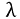
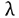

# 六、正则化和超参数调整

概述

本章将向您介绍超参数调优。您将获得使用 TensorFlow 对深度学习模型执行正则化以减少过拟合的实践经验。您将探索诸如 L1、L2 和辍学正则化等概念。最后，您将看到用于执行自动超参数调优的 Keras 调优器包。

本章结束时，您将能够应用正则化和调整超参数，以降低模型过度拟合的风险并提高其性能。

# 简介

在前一章中，你学习了当响应变量是离散的时，分类模型如何解决问题。您还看到了用于评估此类分类器性能的不同指标。您获得了使用 TensorFlow 构建和训练二元、多类和多标签分类器的实践经验。

在评估一个模型时，你会面临三种不同的情况:模型过拟合、模型欠拟合和模型执行。最后一种是理想场景，在这种场景中，模型准确地预测正确的结果，并很好地推广到看不见的数据。

如果模型拟合不足，这意味着它既没有达到令人满意的性能，也没有准确预测目标变量。在这种情况下，数据科学家可以尝试调整不同的超参数，并找到提高模型准确性的最佳组合。另一种可能性是通过处理诸如数据清洁度或要素工程等问题来改善输入数据集。

当一个模型只能在训练集上达到高性能而在测试集上表现很差时，它就是过度拟合。在这种情况下，模型仅从与用于训练的数据相关的数据中学习模式。正则化有助于降低过度拟合的风险。

# 正则化技术

数据科学家的主要目标是训练一个模型，该模型实现高性能并很好地推广到看不见的数据。该模型应该能够预测训练过程中使用的数据和新数据的正确结果。这就是为什么模型总是在测试集上被评估的原因。这组数据作为一个代理来评估模型在生产中输出正确结果的能力。


图 6.1:模型没有过拟合或欠拟合

在*图 6.1* 中，线性模型(直线)似乎预测了训练(圆形)和测试(三角形)集的相对准确的结果。

但有时模型不能很好地概括，并且会过度适应训练集。在这种情况下，模型的性能在训练集和测试集之间会有很大的不同。


图 6.2:模型过度拟合

*图 6.2* 显示模型(线)只学会了对训练集(圆形)进行准确预测，而在测试集(三角形)上表现不佳。这个模型显然是过度拟合了。

幸运的是，数据科学家可以使用**正则化技术**来减少和防止过度拟合，这将在以下章节中定义。

## L1 正则化

对于深度学习模型，当一些特征的权重高于其应有的权重时，就会发生过度拟合。该模型过于强调这些特征，因为它认为这些特征对于预测训练集极其重要。不幸的是，这些特性与测试集或任何新的未知数据不太相关。正则化技术试图惩罚这些权重，并降低它们对模型预测的重要性。

有多种方法来执行正则化。其中之一是向成本函数添加正则化分量:


图 6.3:向成本函数中添加正则化成分

该正则化分量的添加将导致模型的权重更小，因为神经网络在执行前向和后向传播时试图降低成本函数。

一个非常受欢迎的正则化的组成部分是 L1。其公式如下:


图 6.4: L1 正则化

是一个超参数，定义 L1 正则化的惩罚水平。`W`是模型的重量。使用 L1 正则化，将权重的绝对值之和添加到模型损失中。

L1 正则化有时被称为`0`。因此，只有相关特征用于进行预测。

在 TensorFlow 中，可以使用以下代码片段定义 L1 正则化:

```
from tensorflow.keras.regularizers import l1
l1_reg = l1(l=0.01)
```

`l`参数对应于超参数。然后，实例化的 L1 正则化可以添加到 TensorFlow Keras 中的任何图层:

```
from tensorflow.keras.layers import Dense
Dense(10, kernel_regularizer=l1_reg)
```

在前面的示例中，您将之前定义的 L1 正则化子添加到了一个由`10`个单元组成的全连接层。

## L2 区域化

*L2* 正则化与 *L1* 相似，在代价函数中增加了正则化成分，但其公式不同:


图 6.5: L2 正则化

L2 正则化倾向于降低不相关特征的权重。他们将接近`0`，但不完全是`0`。因此，它减少了这些功能的影响，但不会像 L1 那样禁用它们。

在 TensorFlow 中，可以按如下方式定义 L2 正则化:

```
from tensorflow.keras.regularizers import l2
from tensorflow.keras.layers import Dense
l2_reg = l2(l=0.01)
Dense(20, kernel_regularizer=l2_reg)
```

在前面的示例中，您定义了一个 L2 正则化子，并将其添加到一个由`20`个单元组成的全连接层中。

TensorFlow 提供了另一个结合了 L1 和 L2 正则化子的正则化子类。您可以用下面的代码片段实例化它:

```
from tensorflow.keras.regularizers 
import l1_l2
l1_l2_reg = l1_l2(l1=0.01, l2=0.001)
```

在前面的示例中，您实例化了 L1 和 L2 正则项，并将 L1 和 L2 的因子分别指定为`0.01`和`0.001`。你可以看到，与 L2 相比，L1 正则化的权重更大。这些值是超参数，可以根据数据集进行微调。

在下一个练习中，您将在对模型应用 L2 正则化时将其付诸实践。

## 练习 e 6.01:使用 L2 正则化预测 Connect-4 游戏结果

在本练习中，您将在 TensorFlow 中构建和训练两个多职业模型，用于预测游戏 Connect-4 中玩家 1 的职业结果。

这个数据集的每一次观察都包含了不同位置的博弈的不同情况。对于每一种情况，模型都试图预测第一个玩家的结果:赢、输或平。第一个模型将不具有任何正则化，而第二个将具有 L2 正则化:

注意

数据集可以在这里访问:[https://packt.link/xysRc](https://packt.link/xysRc)。

原始数据集可以在这里找到:[http://archive.ics.uci.edu/ml/datasets/Connect-4](http://archive.ics.uci.edu/ml/datasets/Connect-4)。

1.  打开新的 Jupyter 笔记本。
2.  导入熊猫库，使用`pd`作为别名:

    ```
    import pandas as pd
    ```

3.  创建一个名为`file_url`的变量，包含数据集的 URL:

    ```
    file_url = 'https://raw.githubusercontent.com/PacktWorkshops'\           '/The-TensorFlow-Workshop/master/Chapter06/dataset'\           '/connect-4.csv'
    ```

4.  Load the dataset into a DataFrame called `data` using the `read_csv()` function and provide the URL to the CSV file. Print the first five rows using the `head()` function:

    ```
    data = pd.read_csv(file_url)
    data.head()
    ```

    预期产出如下:

    

    图 6.6:数据集的前五行

    上图显示了数据集的前五行。

5.  使用`pop()`方法提取目标变量(`class`列),并将其保存在名为`target` :

    ```
    target = data.pop('class')
    ```

    的变量中
6.  导入 TensorFlow 库，使用`tf`作为别名。然后，从`tensorflow.keras.layers` :

    ```
    import tensorflow as tf from tensorflow.keras.layers import Dense
    ```

    导入`Dense`类
7.  将种子设置为`8`以获得可重复的结果:

    ```
    tf.random.set_seed(8)
    ```

8.  使用`tf.keras.Sequential()`实例化一个顺序模型，并将其存储在一个名为`model` :

    ```
    model = tf.keras.Sequential()
    ```

    的变量中
9.  使用`Dense()`创建一个由`512`个单元组成的全连接层，并将 ReLu 指定为激活函数，将输入形状指定为`(42,)`，这对应于数据集中的要素数量。保存在一个名为`fc1` :

    ```
    fc1 = Dense(512, input_shape=(42,), activation='relu')
    ```

    的变量中
10.  用`Dense()`创建三个完全连接的`512`、`128`和`128`单元层，并指定 ReLu 为激活函数。保存在三个变量中，分别叫做`fc2`、`fc3`和`fc4`:

    ```
    fc2 = Dense(512, activation='relu') fc3 = Dense(128, activation='relu') fc4 = Dense(128, activation='relu')
    ```

11.  用`Dense()`创建三个单元(对应于类的数量)的全连接层，并指定 softmax 为激活函数。将其保存在一个名为`fc5` :

    ```
    fc5 = Dense(3, activation='softmax')
    ```

    的变量中
12.  使用`add()`方法:

    ```
    model.add(fc1) model.add(fc2) model.add(fc3) model.add(fc4) model.add(fc5)
    ```

    将所有五个完全连接的层依次添加到模型中
13.  Print the summary of the model using the `summary()` method:

    ```
    model.summary()
    ```

    预期产出如下:

    

    图 6.7:模型架构概要

14.  从`tf.keras.losses`实例化一个`SparseCategoricalCrossentropy()`函数，并保存在一个名为`loss` :

    ```
    loss = tf.keras.losses.SparseCategoricalCrossentropy()
    ```

    的变量中
15.  用`0.001`作为学习率实例化`tf.keras.optimizers`中的`Adam()`，并保存在一个名为`optimizer` :

    ```
    optimizer = tf.keras.optimizers.Adam(0.001)
    ```

    的变量中
16.  使用`compile()`方法编译模型，并将您在*步骤 14* 和 *15* 和`accuracy`中创建的优化器和损失指定为要显示的指标:

    ```
    model.compile(optimizer=optimizer, loss=loss, \               metrics=['accuracy'])
    ```

17.  Start the model training process using the `fit()` method for five epochs and split the data into a validation set with 20% of the data:

    ```
    model.fit(data, target, epochs=5, validation_split=0.2)
    ```

    预期产出如下:

    

    图 6.8:培训过程的日志

    前面的输出显示模型过度拟合。它在训练集上取得了`0.85`的准确率，而在验证集上仅取得了`0.58`的准确率。现在，用 L2 正则化训练另一个模型。

18.  创建五个完全连接的层，与之前的模型相似，并为`kernel_regularizer`参数指定 L2 正则化。使用值`0.001`作为正则因子。将图层保存在五个变量中，分别称为`reg_fc1`、`reg_fc2`、`reg_fc3`、`reg_fc4`和`reg_fc5` :

    ```
    reg_fc1 = Dense(512, input_shape=(42,), activation='relu', \                 kernel_regularizer=tf.keras.regularizers\                                      .l2(l=0.1)) reg_fc2 = Dense(512, activation='relu', \                 kernel_regularizer=tf.keras.regularizers\                                      .l2(l=0.1)) reg_fc3 = Dense(128, activation='relu', \                 kernel_regularizer=tf.keras.regularizers\                                      .l2(l=0.1)) reg_fc4 = Dense(128, activation='relu', \                 kernel_regularizer=tf.keras.regularizers\                                      .l2(l=0.1)) reg_fc5 = Dense(3, activation='softmax')
    ```

19.  使用`tf.keras.Sequential()`实例化一个顺序模型，将其存储在一个名为`model2`的变量中，并使用`add()`方法将所有五个完全连接的层顺序添加到模型中:

    ```
    model2 = tf.keras.Sequential() model2.add(reg_fc1) model2.add(reg_fc2) model2.add(reg_fc3) model2.add(reg_fc4) model2.add(reg_fc5)
    ```

20.  Print the summary of the model:

    ```
    model2.summary()
    ```

    预期产出如下:

    

    图 6.9:模型架构总结

21.  使用`compile()`方法编译模型，并将您在*步骤 14* 和*步骤 15* 和`accuracy`中创建的优化器和损失指定为要显示的指标:

    ```
    model2.compile(optimizer=optimizer, loss=loss, \                metrics=['accuracy'])
    ```

22.  Start the model training process using the `fit()` method for five epochs and split the data into a validation set with 20% of the data:

    ```
    model2.fit(data, target, epochs=5, validation_split=0.2)
    ```

    预期产出如下:

    

图 6.10:培训过程的日志

随着 L2 正则化的加入，该模型现在在训练(`0.68`)和测试(`0.58`)集合之间具有相似的准确度分数。模型没有之前那么过拟合，但是性能也不是很大。

现在你已经知道如何将 L1 和 L2 正则化应用于神经网络，下一节将介绍另一种正则化技术，称为 **dropout** 。

## 辍学规则极化

与 L1 和 L2 正则化不同，丢弃是一种专用于神经网络的正则化技术。其背后的逻辑非常简单:网络将随机改变某些特征的权重为`0`。这将迫使模型依赖于其他可能被忽略的特征，从而增加它们的权重。


图 6.11:神经网络的脱落

前面的示例显示了一个压差为 50%的架构。这意味着模型的 50%的单元在每次迭代中被关闭。以下代码片段显示了如何在 TensorFlow 中创建 50%的下降层:

```
from tensorflow.keras.layers import Dropout
do = Dropout(0.5)
```

在下一个练习中，您将通过应用 dropout 来扩展前面的模型。

## 练习 6.02:使用辍学预测 Connect-4 游戏结果

在本练习中，您将使用与*练习 6.01* 、*相同的数据集，使用 L2 正则化器*预测 Connect-4 游戏结果。您将在 TensorFlow 中构建并训练一个多职业模型，该模型将使用辍学技术作为正则项来预测游戏 Connect-4 中玩家 1 的职业结果:

注意

数据集可以在这里访问:[https://packt.link/0Bo1B](https://packt.link/0Bo1B)。

原始数据集可以在这里找到:[http://archive.ics.uci.edu/ml/datasets/Connect-4](http://archive.ics.uci.edu/ml/datasets/Connect-4)。

1.  打开新的 Jupyter 笔记本。
2.  导入熊猫库并使用`pd`作为别名:

    ```
    import pandas as pd
    ```

3.  创建一个变量`file_url`，用于存储数据集的 URL:

    ```
    file_url = 'https://raw.githubusercontent.com/PacktWorkshops'\            '/The-TensorFlow-Workshop/master/Chapter06/dataset'\            '/connect-4.csv'
    ```

4.  Load the dataset into a DataFrame, `data`, using the `read_csv()` function and provide the URL of the CSV file. Print the first five rows using the `head()` function:

    ```
    data = pd.read_csv(file_url)
    data.head()
    ```

    预期产出如下:

    

    图 6.12:数据集的前五行

5.  使用`pop()`方法提取目标变量(名为`class`的列)，并将其保存在名为`target` :

    ```
    target = data.pop('class')
    ```

    的变量中
6.  导入 TensorFlow 库，使用`tf`作为别名。然后，从`tensorflow.keras.layers` :

    ```
    import tensorflow as tf from tensorflow.keras.layers import Dense
    ```

    导入`Dense`类
7.  将种子设置为`8`以获得可重复的结果:

    ```
    tf.random.set_seed(8)
    ```

8.  使用`tf.keras.Sequential()`实例化一个顺序模型，并将其存储在一个名为`model` :

    ```
    model = tf.keras.Sequential()
    ```

    的变量中
9.  使用`Dense()`创建一个由`512`个单元组成的全连接层，并将 ReLu 指定为激活函数，将输入形状指定为`(42,)`，这对应于数据集中的要素数量。将它保存在一个名为`fc1` :

    ```
    fc1 = Dense(512, input_shape=(42,), activation='relu')
    ```

    的变量中
10.  用`Dense()`创建`512`、`128`和`128`单元的三个全连接层，并指定 ReLu 为激活函数。保存在三个变量中，分别叫做`fc2`、`fc3`、`fc4`:

    ```
    fc2 = Dense(512, activation='relu') fc3 = Dense(128, activation='relu') fc4 = Dense(128, activation='relu')
    ```

11.  用`Dense()`创建一个由三个单元(对应于类的数量)组成的全连接层，并将 softmax 指定为激活函数。保存在一个名为`fc5` :

    ```
    fc5 = Dense(3, activation='softmax')
    ```

    的变量中
12.  使用`add()`方法:

    ```
    model.add(fc1) model.add(Dropout(0.75)) model.add(fc2) model.add(Dropout(0.75)) model.add(fc3) model.add(Dropout(0.75)) model.add(fc4) model.add(Dropout(0.75)) model.add(fc5)
    ```

    将所有五个完全连接的层依次添加到模型中，在它们之间有一个`0.75`的脱落层
13.  Print the summary of the model:

    ```
    model.summary()
    ```

    预期产出如下:

    

    图 6.13:模型架构概要

14.  从`tf.keras.losses`中实例化一个`SparseCategoricalCrossentropy()`函数，并保存在一个名为`loss` :

    ```
    loss = tf.keras.losses.SparseCategoricalCrossentropy()
    ```

    的变量中
15.  将`tf.keras.optimizers`中的`Adam()`实例化为`0.001`作为学习率，并保存在一个名为`optimizer` :

    ```
    optimizer = tf.keras.optimizers.Adam(0.001)
    ```

    的变量中
16.  使用`compile()`方法编译模型，指定优化器和损失，并将`accuracy`设置为要显示的度量:

    ```
    model.compile(optimizer=optimizer, loss=loss, \               metrics=['accuracy'])
    ```

17.  Start the model training process using the `fit()` method for five epochs and split the data into a validation set with 20% of the data:

    ```
    model.fit(data, target, epochs=5, validation_split=0.2)
    ```

    输出如下所示:

    

图 6.14:培训过程的日志

由于增加了退出，模型现在在训练(`0.69`)和测试(`0.59`)集之间具有相似的准确度分数。该模型不像以前那样过度拟合，但其性能仍然不太理想。

您现在已经看到了如何将 L1、L2 或辍学生作为正则项应用于模型。在深度学习中，还有另一种非常简单的技术可以用来避免过度拟合——那就是早期停止。

## 提前停止

神经网络过度拟合的另一个原因是由于训练过程。你对模型训练得越多，它就越会试图提高它的性能。通过对模型进行更长时间(更多时期)的训练，它将在某个时候开始寻找只与训练集相关的模式。在这种情况下，训练和测试(或验证)集的分数之间的差异将在一定数量的时期后开始增加。

为了防止这种情况，当两组之间的差异开始增加时，您可以停止模型训练。这种技术叫做**早停**。


图 6.15:提前停止以防止过度拟合

上图显示了模型在训练集和测试(或验证)集上的损失值(根据时期数)。在早期时代，这两个集合之间的损失值是相当不同的。随着训练的进行，模型开始学习做出预测的相关模式，两种损失趋于一致。但是过了一会儿，他们开始分开。训练集的损失不断减少，而测试(或验证)集的损失不断增加。您可以观察到模型过度拟合，并且仅针对定型集进行优化。在两个损失之间的差异开始增加时停止训练，防止模型过度拟合。

在 TensorFlow 中，您可以通过设置回调来实现这一点，这些回调分析模型在每个时期的性能，并比较其在训练集和测试集之间的得分。要定义提前停止回调，您需要执行以下操作:

```
from tensorflow.keras.callbacks import EarlyStopping
EarlyStopping(monitor='val_accuracy', patience=5)
```

前面的代码向您展示了如何实例化一个`EarlyStopping`类，该类将监视验证集的准确性分数，并在停止训练过程之前等待连续五个时期没有改进。

在下一个活动中，您将练习对模型应用 L1 正则化和 L2 正则化。

## 活动 6.01: Pr 预测 L1 和 L2 正式员工的收入

`census-income-train.csv`数据集包含从美国人口普查局进行的 1994 年和 1995 年当前人口调查中提取的加权人口普查数据。该数据集是美国人口普查局共享的原始数据集的子集。在本活动中，您的任务是构建和训练一个回归变量，根据人口普查数据预测一个人的收入。数据集可以在这里访问:[https://packt.link/G8xFd](https://packt.link/G8xFd)。

以下步骤将帮助您完成活动:

1.  打开新的 Jupyter 笔记本。
2.  导入所需的库。
3.  创建一个名为`usecols`的列表，其中包含列名`AAGE`、`ADTIND`、`ADTOCC`、`SEOTR`、`WKSWORK`和`PTOTVAL`。
4.  使用`read_csv()`方法加载数据。
5.  将数据分为定型集(前 15，000 行)和测试集(后 5，000 行)。
6.  构建五层全连接的多类分类器，分别为`512`、`512`、`128`、`128`和`26`单元。
7.  Train the model on the training set.

    预期产出如下:

    

图 6.16:培训过程的日志

注意

此活动的解决方案可通过[此链接](B16341_Solution_ePub.xhtml#_idTextAnchor269)找到。

在 ahe ad 部分，您将看到如何调整超参数以获得更好的结果。

# 超参数调优

之前，您看到了如何通过使用不同的正则化技术来处理过度拟合的模型。这些技术有助于模型更好地概括看不见的数据，但是，正如您所看到的，它们也会导致较差的性能，使模型不适合。

通过神经网络，数据科学家可以访问不同的超参数，他们可以调整这些参数来提高模型的性能。例如，您可以尝试不同的学习速率，看看其中一个是否会导致更好的结果，您可以为网络的每个隐藏层尝试不同数量的单元，或者您可以进行测试，看看不同的辍学率是否可以在过拟合和欠拟合之间实现更好的平衡。

然而，一个超参数的选择会影响另一个超参数的效果。因此，随着想要优化的超参数和值的数量增加，要测试的组合数量将呈指数增长。为所有这些组合训练模型也将花费大量时间——尤其是如果您必须手动完成的话。有一些软件包可以自动扫描您定义的超参数搜索空间，并为您找到最佳组合。在前面的小节中，您将看到如何使用其中的一个:Keras Tuner。

## Keras 调优器

不幸的是，这个包不包含在 TensorFlow 中。您需要通过运行以下命令来手动安装它:

```
pip install keras-tuner
```

这个软件包使用起来非常简单。有两个概念需要理解:**超参数**和**调优器**。

超参数是用于定义将由调优器评估的参数的类。您可以使用不同类型的超参数。主要有以下几种:

*   `hp.Boolean`:在`True`和`False`之间的选择
*   `hp.Int`:整数范围的选择
*   `hp.Float`:有小数范围的选择
*   `hp.Choice`:可能值列表中的选择

下面的代码片段向您展示了如何定义一个名为`learning_rate`的超参数，它只能取四个值中的一个，这四个值是`0.1`、`0.01`、`0.001`或`0.0001`:

```
hp.Choice('learning_rate', values = [0.1, 0.01, 0.001, 0.0001])
```

Keras 调优器包中的调优器是一种算法，它将查看超参数搜索空间，测试一些组合，并找到给出最佳结果的组合。Keras 调优器包提供了不同的调优器，在前面的部分中，您将看到其中的三个:**随机搜索**、**超波段**和**贝叶斯优化**。

一旦定义了您选择的算法，您就可以调用`search()`方法来启动训练集和测试集的超参数调整过程，如下所示:

```
tuner.search(X_train, y_train, validation_data=(X_test, y_test))
```

搜索完成后，您可以使用`get_best_hyperparameters()`访问最佳组合，然后专门查看您定义的一个超参数:

```
best_hps = tuner.get_best_hyperparameters()[0]
best_hps.get('learning_rate')
```

最后，`hypermodel.build()`方法将使用找到的最佳超参数实例化 TensorFlow Keras 模型:

```
model = tuner.hypermodel.build(best_hps)
```

就这么简单。现在，让我们来看看随机搜索调优器。

## 随机搜索

Rand om search 是这个包中可用的算法之一。顾名思义，它通过在搜索空间中采样来随机定义要测试的组合。尽管这种算法不会测试每一个可能的组合，但随机搜索提供了非常好的结果。

注意

测试搜索空间的每一个组合的算法称为网格搜索。


图 6.17:网格搜索和随机搜索的比较

上图显示了网格搜索和随机搜索之间的区别。你可以看到，网格搜索将搜索空间分割成一个网格，并测试每个组合，但有些可能会导致相同的损失值，这使得它的效率较低。另一方面，随机搜索更有效地覆盖了搜索空间，有助于找到最优解。

在 Keras Tuner 中，在实例化一个调优器之前，您需要定义一个模型构建函数，该函数将定义 TensorFlow Keras 模型的体系结构，该模型将使用您想要测试的超参数进行训练。以下是此类函数的一个示例:

```
def model_builder(hp):
    model = tf.keras.Sequential()
    hp_lr = hp.Choice('learning_rate', \
                      values = [0.1, 0.01, 0.001, 0.0001])
    model.add(Dense(512, input_shape=(100,), activation='relu'))
    model.add(Dense(128, activation='relu'))
    model.add(Dense(10, activation='softmax'))
    loss = tf.keras.losses.SparseCategoricalCrossentropy()
    optimizer = tf.keras.optimizers.Adam(hp_lr)
    model.compile(optimizer=optimizer, loss=loss, \
                  metrics=['accuracy'])
    return model
```

在前面的代码片段中，您创建了一个由三个完全连接的层组成的模型，这三个层分别是`512`、`128`和`10`单元，它们将使用分类交叉熵损失函数和 Adam 优化器进行训练。您定义了将由 Keras Tuner 评估的`learning_rate`超参数。

一旦定义了模型构建函数，就可以实例化一个随机搜索调优器，如下所示:

```
import kerastuner as kt
tuner = kt.RandomSearch(model_builder, objective='val_accuracy', \
                        max_trials=10)
```

在前面的代码中，您实例化了一个`RandomSearch`调优器，该调优器将查看在`model_builder`函数中定义的模型和超参数，使用验证准确性作为`objective`度量，并且最多运行`10`次试验。

在下一个练习中，您将使用随机搜索来查找模型的最佳超参数集。

## 练习 6.03: Pred 使用来自 Keras Tuner 的随机搜索来控制 Connect-4 游戏结果

在本练习中，您将使用与*练习 6.01* 、*相同的数据集，使用 L2 正则化器*预测 Connect-4 游戏结果。您将在 TensorFlow 中构建和训练一个多类别模型，该模型将使用 Keras Tuner 包预测游戏 Connect-4 中玩家 1 的类别结果，以通过随机搜索找到 L2 正则化的最佳正则化因子:

注意

数据集可以在这里访问:[https://packt.link/aTSbC](https://packt.link/aTSbC)。

原始数据集可以在这里找到:[http://archive.ics.uci.edu/ml/datasets/Connect-4](http://archive.ics.uci.edu/ml/datasets/Connect-4)。

1.  打开新的 Jupyter 笔记本。
2.  导入熊猫库并使用`pd`作为别名:

    ```
    import pandas as pd
    ```

3.  创建一个名为`file_url`的变量，包含数据集的 URL:

    ```
    file_url = 'https://raw.githubusercontent.com/PacktWorkshops'\           '/The-TensorFlow-Workshop/master/Chapter06/dataset'\           '/connect-4.csv'
    ```

4.  Load the dataset into a DataFrame called `data` using the `read_csv()` method and provide the URL to the CSV file. Print the first five rows using the `head()` method:

    ```
    data = pd.read_csv(file_url)
    data.head()
    ```

    输出如下所示:

    

    图 6.18:数据集的前五行

5.  使用`pop()`方法提取目标变量(名为`class`的列)，并将其保存在名为`target` :

    ```
    target = data.pop('class')
    ```

    的变量中
6.  从`sklearn.model_selection` :

    ```
    from sklearn.model_selection import train_test_split
    ```

    导入`train_test_split`
7.  使用`train_test_split()`将数据分成训练集和测试集，20%的数据用于测试，`42`用于`random_state` :

    ```
    X_train, X_test, y_train, y_test = train_test_split\                                    (data, target, \                                     test_size=0.2, \                                     random_state=42)
    ```

8.  安装`kerastuner`包，然后导入并给它分配`kt`别名:

    ```
    !pip install keras-tuner import kerastuner as kt
    ```

9.  导入 TensorFlow 库并使用`tf`作为别名。然后，从`tensorflow.keras.layers` :

    ```
    import tensorflow as tf from tensorflow.keras.layers import Dense
    ```

    中导入`Dense`类
10.  使用`tf.random.set_seed()`将种子设置为`8`以获得可重复的结果:

    ```
    tf.random.set_seed(8)
    ```

11.  定义一个名为`model_builder`的函数，该函数将创建一个与*练习 6.02* 、*预测 Connect-4 游戏结果的*具有相同架构的序列模型，使用 L2 正则化，但这一次，为正则化因子

    ```
    def model_builder(hp):     model = tf.keras.Sequential()     p_l2 = hp.Choice('l2', values = [0.1, 0.01, 0.001, 0.0001])     reg_fc1 = Dense(512, input_shape=(42,), activation='relu', \                     kernel_regularizer=tf.keras.regularizers\                                          .l2(l=hp_l2))     reg_fc2 = Dense(512, activation='relu', \                     kernel_regularizer=tf.keras.regularizers\                                          .l2(l=hp_l2))     reg_fc3 = Dense(128, activation='relu', \                     kernel_regularizer=tf.keras.regularizers\                                          .l2(l=hp_l2))     reg_fc4 = Dense(128, activation='relu', \                     kernel_regularizer=tf.keras.regularizers\                                          .l2(l=hp_l2))     reg_fc5 = Dense(3, activation='softmax')        model.add(reg_fc1)     model.add(reg_fc2)     model.add(reg_fc3)     model.add(reg_fc4)     model.add(reg_fc5)     loss = tf.keras.losses.SparseCategoricalCrossentropy()     optimizer = tf.keras.optimizers.Adam(0.001)     model.compile(optimizer = optimizer, loss = loss, \                   metrics = ['accuracy'])     return model
    ```

    提供一个`hp.Choice`超参数
12.  实例化一个`RandomSearch`调优器，并将`val_accuracy`分配给`objective`，将`10`分配给`max_trials` :

    ```
    tuner = kt.RandomSearch(model_builder, objective='val_accuracy', \                         max_trials=10)
    ```

13.  在训练集和测试集上使用`search()`方法启动超参数搜索:

    ```
    tuner.search(X_train, y_train, validation_data=(X_test, y_test))
    ```

14.  用`get_best_hyperparameters()`提取最佳超参数组合(索引`0`)并保存在一个名为`best_hps` :

    ```
    best_hps = tuner.get_best_hyperparameters()[0]
    ```

    的变量中
15.  Extract the best value for the `l2` regularization hyperparameter, save it in a variable called `best_l2`, and print its value:

    ```
    best_l2 = best_hps.get('l2')
    best_l2
    ```

    您应该会得到以下结果:

    ```
    0.0001
    ```

    通过随机搜索找到的`l2`超参数的最佳值是`0.0001`。

16.  Start the model training process using the `fit()` method for five epochs and use the test set for `validation_data`:

    ```
    model = tuner.hypermodel.build(best_hps)
    model.fit(X_train, y_train, epochs=5, \
              validation_data=(X_test, y_test))
    ```

    您将获得以下输出:

    

图 6.19:培训过程的日志

使用随机搜索调优器，您找到了 L2 正则化的最佳值(`0.0001`)，这有助于模型在训练集上达到`0.83`的精度，在测试集上达到`0.81`的精度。这些分数比来自*练习 6.01* 、*使用 L2 正则化器*预测 Connect-4 游戏结果的分数有了很大的提高(训练集使用`0.69`，测试集使用`0.59`)。

在下一节中，您将使用另一个称为 Hyperband 的 Keras 调优器。

## 超波段

Hyperband 是 Keras 调优器套装中的另一款调优器。像随机搜索一样，它从搜索空间中随机挑选候选对象，但效率更高。其背后的想法是仅用一两次迭代来测试一组组合，只保留最好的表现者，并训练他们更长时间。因此，该算法不会像随机搜索那样浪费时间来训练不良组合。相反，它只是在下次运行时丢弃它们。只有那些表现更好的人才会被保留下来接受更长时间的培训。要实例化 Hyperband 调优器，请执行以下命令:

```
tuner = kt.Hyperband(model_builder, objective='val_accuracy', \
                     max_epochs=5)
```

这个调优器采用一个模型构建函数和一个客观度量作为输入参数，就像随机搜索一样。但是它需要一个额外的值`max_epochs`，对应于在超参数搜索期间允许模型训练的最大时期数。

## 练习 6.04:使用 Keras Tuner 的 Hyperband 预测 Connect-4 游戏结果

在本练习中，您将使用与*练习 6.01* 、*相同的数据集，使用 L2 正则化器*预测 Connect-4 游戏结果。您将在 TensorFlow 中构建和训练一个多类别模型，该模型将使用 Keras Tuner 包预测游戏 Connect-4 中玩家 1 的类别结果，以通过 Hyperband 找到输入层的最佳学习率和单元数:

注意

数据集可以在这里访问:[https://packt.link/WLgen](https://packt.link/WLgen)。

原始数据集可以在这里找到:[http://archive.ics.uci.edu/ml/datasets/Connect-4](http://archive.ics.uci.edu/ml/datasets/Connect-4)。

1.  打开新的 Jupyter 笔记本。
2.  导入熊猫库并使用`pd`作为别名:

    ```
    import pandas as pd
    ```

3.  创建一个名为`file_url`的变量，包含数据集的 URL:

    ```
    file_url = 'https://raw.githubusercontent.com/PacktWorkshops'\            '/The-TensorFlow-Workshop/master/Chapter06/dataset'\            '/connect-4.csv'
    ```

4.  Load the dataset into a DataFrame called `data` using the `read_csv()` method and provide the URL to the CSV file. Print the first five rows using the `head()` method:

    ```
    data = pd.read_csv(file_url)
    data.head()
    ```

    输出如下所示:

    

    图 6.20:数据集的前五行

5.  使用`pop()`方法提取目标变量(`class`，并保存在一个名为`target` :

    ```
    target = data.pop('class')
    ```

    的变量中
6.  从`sklearn.model_selection`导入`train_test_split`:

    ```
    from sklearn.model_selection import train_test_split
    ```

7.  使用`train_test_split()`将数据分成训练集和测试集，20%的数据用于测试，`42`用于`random_state` :

    ```
    X_train, X_test, y_train, y_test = train_test_split\                                    (data, target, \                                     test_size=0.2, \                                     random_state=42)
    ```

8.  安装`keras-tuner`包，然后导入并给它分配`kt`别名:

    ```
    !pip install keras-tuner import kerastuner as kt
    ```

9.  导入 TensorFlow 库并使用`tf`作为别名，然后从`tensorflow.keras.layers` :

    ```
    import tensorflow as tf from tensorflow.keras.layers import Dense
    ```

    导入`Dense`类
10.  使用`tf.random.set_seed()`将种子设置为`8`以获得可重复的结果:

    ```
    tf.random.set_seed(8)
    ```

11.  定义一个名为`model_builder`的函数，使用与*练习 6.02* 、*相同的架构创建一个序列模型，使用 Dropout* 预测 Connect-4 游戏结果，使用 L2 正则化和`0.0001`正则化因子。但是，这一次，为学习率(`0.01`、`0.001`或`0.0001`)提供一个超参数`hp.Choice`，为输入全连接层:

    ```
    def model_builder(hp):     model = tf.keras.Sequential()     hp_units = hp.Int('units', min_value=128, max_value=512, \                       step=64)     reg_fc1 = Dense(hp_units, input_shape=(42,), \                     activation='relu', \                     kernel_regularizer=tf.keras.regularizers\                                          .l2(l=0.0001))     reg_fc2 = Dense(512, activation='relu', \                     kernel_regularizer=tf.keras.regularizers\                                          .l2(l=0.0001))     reg_fc3 = Dense(128, activation='relu', \                     kernel_regularizer=tf.keras.regularizers\                                          .l2(l=0.0001))     reg_fc4 = Dense(128, activation='relu', \                     kernel_regularizer=tf.keras.regularizers\                                          .l2(l=0.0001))     reg_fc5 = Dense(3, activation='softmax')     model.add(reg_fc1)     model.add(reg_fc2)     model.add(reg_fc3)     model.add(reg_fc4)     model.add(reg_fc5)     loss = tf.keras.losses.SparseCategoricalCrossentropy()     hp_learning_rate = hp.Choice('learning_rate', \                                  values = [0.01, 0.001, 0.0001])     optimizer = tf.keras.optimizers.Adam(hp_learning_rate)     model.compile(optimizer = optimizer, loss = loss, \                   metrics = ['accuracy'])     return model
    ```

    提供一个单元数函数`hp.Int`(在`128`和`512`之间，步长为`64`
12.  实例化一个 Hyperband 调优器，并将`val_accuracy`分配给`objective`度量，将`5`分配给`max_epochs` :

    ```
    tuner = kt.Hyperband(model_builder, objective='val_accuracy', \                      max_epochs=5)
    ```

13.  在训练和测试集上使用`search()`启动超参数搜索:

    ```
    tuner.search(X_train, y_train, validation_data=(X_test, y_test))
    ```

14.  用`get_best_hyperparameters()`提取最佳超参数组合(索引`0`)并保存在一个名为`best_hps` :

    ```
    best_hps = tuner.get_best_hyperparameters()[0]
    ```

    的变量中
15.  Extract the best value for the number of units for the input layer, save it in a variable called `best_units`, and print its value:

    ```
    best_units = best_hps.get('units')
    best_units
    ```

    您将获得以下输出:

    ```
    192
    ```

    Hyperband 找到的输入层单元数的最佳值是`192`。

16.  提取学习率的最佳值，保存在名为`best_lr`的变量中，并打印其值:

    ```
    best_lr = best_hps.get('learning_rate') best_lr
    ```

17.  The output will be the following:

    ```
    0.001
    ```

    Hyperband 找到的学习率超参数的最佳值是`0.001`。

18.  Start the model training process using the `fit()` method for five epochs and use the test set for `validation_data`:

    ```
    model.fit(X_train, y_train, epochs=5, \
              validation_data=(X_test, y_test))
    ```

    您将获得以下输出:

    

图 6.21:培训过程的日志

使用 Hyperband 作为调优器，您找到了输入层(`192`)和学习速率(`0.001`)的最佳单位数。有了这些超参数，最终的模型在训练集和测试集上都达到了`0.81`的精度。它没有过度拟合，并取得了令人满意的精度分数。

另一个非常流行的调优器是贝叶斯优化，您将在下一节中了解它。

## 贝叶斯优化

贝叶斯优化是另一种非常流行的算法，用于自动超参数调整。它使用概率来确定超参数的最佳组合。目标是从一组超参数中迭代地建立优化目标函数的概率模型。在每次迭代中，概率模型根据获得的结果进行更新。因此，与随机搜索和超带不同，贝叶斯优化将过去的结果纳入考虑，以改进新的结果。以下代码片段将向您展示如何在 Keras Tuner 中实例化贝叶斯优化器:

```
tuner = kt.BayesianOptimization(model_builder, \
                                objective='val_accuracy', \
                                max_trials=10)
```

预期参数类似于随机搜索，包括建模函数、`objective`度量和最大试验次数。

在下面的活动中，您将使用贝叶斯优化来预测一个人的收入。

## 活动 6.02:使用 Keras Tuner 的贝叶斯优化预测 ng 收入

在本活动中，您将使用与在*活动 6.01* 、*中使用的相同数据集，通过 L1 和 L2 正则化因子*预测收入。您的任务是构建和训练一个回归变量，根据人口普查数据预测一个人的收入。您将使用 Keras Tuner 执行自动超参数调整，并针对学习率、输入图层的单元数以及使用贝叶斯优化的 L2 正则化找到超参数的最佳组合。

以下步骤将帮助您完成活动:

1.  用熊猫的`read_csv()`加载数据。
2.  用`pop()`方法提取目标变量。
3.  将数据分为定型集(前 15，000 行)和测试集(后 5，000 行)。
4.  创建建模函数多类分类器，具有五个完全连接的层`512`、`512`、`128`、`128`和`26`单元，以及三个不同的要调整的超参数:学习率(在`0.01`和`0.001`之间)、输入层的单元数(在`128`和`512`之间和一个步骤`64`)以及 L2 正则化(在`0.1`、`0.01`和`0.001`之间)。
5.  用贝叶斯优化找到超参数的最佳组合。
6.  Train the model on the training set with the best hyperparameters found.

    预期产出如下:

    

图 6.22:培训过程的日志

注意

此活动的解决方案可通过[此链接](B16341_Solution_ePub.xhtml#_idTextAnchor270)找到。

# 总结

在本章中，你开始了你的之旅，首先介绍了训练一个模型的不同场景。当模型在训练集上的表现比测试集好得多时，它就是过度拟合。不适合模型是指只有经过训练才能取得好结果的模型。最后，一个好的模型在训练集和测试集上都取得了好的性能。

然后，您遇到了几种可以帮助防止模型过度拟合的正则化技术。您首先查看了 L1 和 L2 正则化，它们在成本函数中添加了惩罚成分。这种额外的损失有助于通过减少某些特征的权重来简化模型。然后，你经历了神经网络特有的两种不同的技术:退出和提前停止。Dropout 随机丢弃模型架构中的一些单元，并强制它考虑其他特性来进行预测。早期停止是一种机制，一旦测试集的性能开始恶化，它就会自动停止模型的训练。

之后，您学习了如何使用 Keras Tuner 包进行自动超参数调优。您考虑了三种特定类型的调优器:随机搜索、超波段和贝叶斯优化。您看到了如何实例化它们，执行超参数搜索，以及提取最佳值和模型。这一过程有助于您在为练习和活动而训练的模型上取得更好的表现。

下一章，你会学到更多关于**卷积神经网络**(**CNN**)。在过去的几年里，这种架构已经在计算机视觉领域取得了突破性的成果。下一章将向你展示如何使用这个架构来识别图像中的物体。