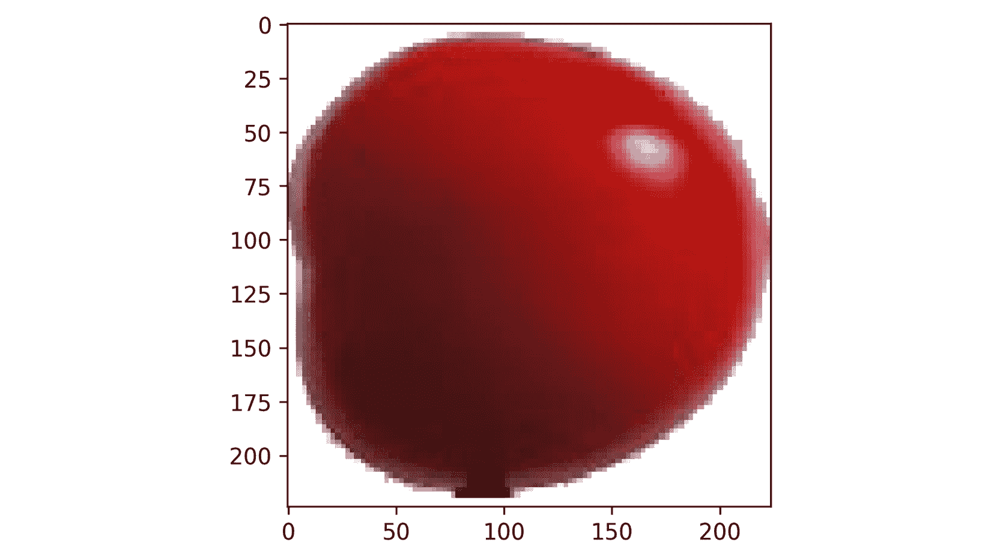
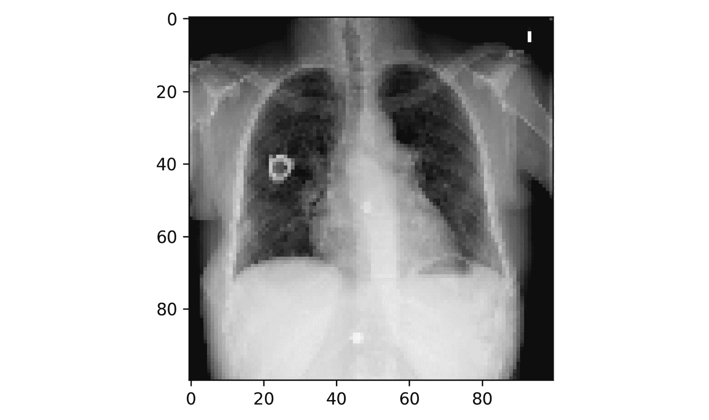
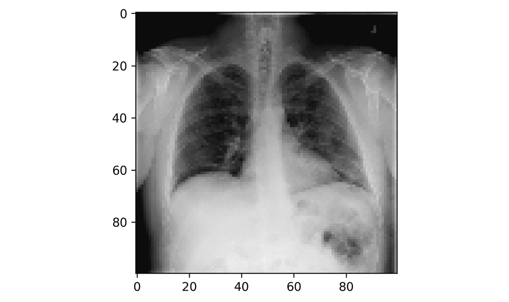

# 10。自定义 TensorFlow 组件

概观

在本章中，您将深入 TensorFlow 框架并构建自定义模块。结束时，您将知道如何创建自定义TensorFlow组件以在模型中使用，如损失函数和层。

# 简介

在前面的章节中，您学习了如何从预定义的TensorFlow模块构建 CNN 或 RNN 模型。您一直在使用 TensorFlow 提供的 API 之一，称为顺序 API。这个 API 是用几行代码开始构建“简单”深度学习架构的好方法。但是，如果您想获得更高的性能，您可能需要构建自己的定制架构。在这种情况下，您将需要使用另一个名为 functional API 的 API。研究人员在定义他们的模型架构时使用功能 API。通过学习如何使用它，您将能够创建自定义的损失函数或模块，例如 ResNet 体系结构中的剩余块。

# tensor flow API

使用 TensorFlow 时，您可以从顺序 API、函数 API 或子类 API 中进行选择来定义您的模型。对于大多数人来说，顺序 API 将是首选。然而，随着时间的推移，你接触到更多的复杂性，你的需求也会扩大。

**顺序 API** 是用于创建TensorFlow模型的最简单的 API。它的工作原理是将不同的层一层层堆叠起来。例如，您将创建一个顺序模型，其中第一个图层是卷积图层，接下来是分离图层，然后是完全连接图层。该模型是顺序的，因为输入数据将按顺序传递到每个定义的层。

**功能 API** 提供了更多的灵活性。您可以使用不同的层来定义模型，这些层之间的交互不是按顺序进行的。例如，您可以创建两个不同的层，这两个层都将馈入第三个层。这可以通过函数式 API 轻松实现。

`Layer`或`Model`。您可以定义自己的自定义层或模型，但这意味着您需要遵守继承的 TensorFlow 类的所有要求，例如编码强制方法。

下图简要概述了 TensorFlow 提供的三种不同的 API:


图 10.1:显示所有三个 API 比较的图表

在前面的小节中，您将学习如何定义一个定制的损失函数。

# 实现自定义损耗功能

有几种类型的损失函数通常用于机器学习。在*第五章*、*分类*中，你学习了不同类型的损失函数，并将其用于不同的分类模型。TensorFlow 有相当多的内置损失函数可供选择。以下是一些更常见的损失函数:

*   平均绝对误差
*   均方误差
*   二元交叉熵
*   范畴交叉熵
*   关键
*   休伯
*   均方对数误差(MSLE)

快速提醒一下，你可以把损失函数想象成一种指南针，让你清楚地看到什么在算法中起作用，什么不起作用。损失越高，模型越不精确，等等。

虽然 TensorFlow 有几个可用的损失函数，但在某些时候，您很可能需要根据自己的特定需求创建自己的损失函数。例如，如果您正在构建一个预测股票价格的模型，您希望定义一个损失函数来惩罚实质上不正确的值。

下一节将向您展示如何构建自定义损失函数。

## 用函数式 API 构建自定义损失函数

在前面的章节中，您已经了解了如何使用 TensorFlow 中的预定义损失函数。但是如果你想构建你自己的定制函数，你可以使用函数 API 或者模型子类化。假设您想要构建一个损失函数，将预测值和实际值之间的差值提高到 4 的幂:


图 10.2:客户损失公式

创建自定义损失函数时，您将始终需要两个参数:`y_true`(实际值)和`y_pred`(预测值)。损失函数将计算这两个值之间的差值，并返回一个表示模型预测值与实际值相差多少的误差值。在 MAE 的情况下，这个损失函数将返回这个误差的绝对值。另一方面，MSE 将对实际值和预测值之间的差进行平方。但是在前面的例子中，误差应该被提升到`4`的幂。

让我们看看如何使用函数式 API 来实现这一点。首先，您需要使用以下命令导入 TensorFlow 库:

```
import tensorflow as tf
```

然后，您必须创建一个名为`custom_loss`的函数，它将`y_true`和`y_pred`参数作为输入。然后，您将使用`pow`函数将计算出的误差提升到`4`的幂。最后，您将返回计算出的误差:

```
def custom_loss(y_true, y_pred):
    custom_loss=tf.math.pow(y_true - y_pred, 4)
    return custom_loss
```

您已经使用函数式 API 创建了自己的定制损失函数。现在，在训练模型之前，您可以将它传递给`compile`方法，而不是预定义的损失函数:

```
model.compile(loss=custom_loss,optimizer=optimizer)
```

在这之后，你可以用和前几章完全一样的方法训练你的模型。TensorFlow 将使用您的自定义损失函数来优化您的模型的学习过程。

## 用子类化 API 构建自定义损失函数

还有另一种定义自定义损失函数的方法:使用子类化 API。在这种情况下，您将为它定义一个自定义类，而不是构建一个函数。如果您想用额外的自定义属性或方法来扩展它，这是非常有用的。通过子类化，您可以创建一个自定义类，它将从`keras.losses`模块的`Loss`类继承属性和方法。然后你需要定义`__init__()`和`call()`方法，这在`Loss`类中是必需的。在`__init__`方法中，您将定义自定义类的所有属性，在`call()`方法中，您将指定计算损失的逻辑。

下面是一个简单的例子，说明如何使用子类化 API 来实现定制的 loss，其中错误应该被提升到`4`的幂:

```
class MyCustomLoss(keras.losses.Loss):
    def __init__(self, threshold=1.0, **kwargs):
        super().__init__(**kwargs)
    def call(self, y_true, y_pred):
        return tf.math.pow(y_true - y_pred, 4)
```

在前面的例子中，您已经重新实现了与前面相同的损失函数(4 的幂)，但是使用了来自`keras.losses.Loss`的子类。首先，在`__init__()`方法中使用`self`参数初始化您的类的属性，该参数引用对象本身。

然后，在`call()`方法中，您定义了损失函数的逻辑，它计算了误差并将其提升到 4 的幂。

现在您已经熟悉了损失函数，是时候在下一个练习中构建一个了。

## 练习 10.01:构建自定义损失函数

在本练习中，您将创建自己的自定义损失函数来训练 CNN 模型，以区分苹果和西红柿的图像。

在本练习中，您将使用`Apple-or-Tomato`数据集。该数据集是 GitHub 上`Fruits 360`数据集的子集。`Fruits 360`数据集由 1948 幅尺寸为 100×100 像素的彩色图像组成。`Apple-or-Tomato`数据集有 992 个苹果图像，其中 662 个在训练集中，330 个在测试数据集中。总共有 956 幅番茄图像，其中 638 幅在训练数据集中，318 幅在测试数据集中。

**注**

您可以在以下链接获得`Apple-or-Tomato`数据集:【https://packt.link/28kZY 。

可以在这里找到`Fruits 360`数据集:[https://github . com/horea 94/Fruit-Images-Dataset/archive/master . zip](https://github.com/Horea94/Fruit-Images-Dataset/archive/master.zip)。

首先，打开一个新的 Colab 或 Jupyter 笔记本。如果您正在使用 Google Colab，您需要首先将数据集下载到您的 Google Drive 中:

1.  打开新的 Jupyter 笔记本或 Google Colab 笔记本。
2.  如果您使用 Google Colab，使用以下代码在本地上传您的数据集。否则，转到*步骤 4* 。点击`Choose Files`导航至 CSV 文件，然后点击`Open`。将文件另存为`uploaded`。然后，转到保存数据集的文件夹:

    ```
    from google.colab import files uploaded = files.upload()
    ```

3.  将数据集解压到当前文件夹:

    ```
    !unzip \*.zip
    ```

4.  创建一个变量`directory`，它包含数据集的路径:

    ```
    directory = "/content/gdrive/My Drive/Datasets/apple-or-tomato/"
    ```

5.  导入`pathlib`库:

    ```
    import pathlib
    ```

6.  使用`pathlib.Path` :

    ```
    path = pathlib.Path(directory)
    ```

    创建一个包含数据集完整路径的变量`path`
7.  创建两个变量`train_dir`和`validation_dir`，它们分别采用训练和验证文件夹的完整路径:

    ```
    train_dir = path / 'training_set' validation_dir = path / 'test_set'
    ```

8.  创建四个变量，`train_apple_dir`、`train_tomato_dir`、`validation_apple_dir`和`validation_tomato_dir`，它们分别采用训练集和验证集的`apple`和`tomato`文件夹的完整路径:

    ```
    train_apple_dir = train_dir / 'apple' train_tomato_dir = train_dir /'tomato' validation_apple_dir = validation_dir / 'apple' validation_tomato_dir = validation_dir / 'tomato'
    ```

9.  导入`os`包:

    ```
    import os
    ```

10.  创建两个名为`total_train`和`total_val`的变量，这两个变量将分别获得训练集和验证集的图像数量:

    ```
    total_train = len(os.listdir(train_apple_dir)) + \               len(os.listdir(train_tomato_dir)) total_val = len(os.listdir(validation_apple_dir)) + \             len(os.listdir(validation_tomato_dir))
    ```

11.  从`tensorflow.keras.preprocessing`模块导入`ImageDataGenerator`:

    ```
    from tensorflow.keras.preprocessing.image import ImageDataGenerator
    ```

12.  实例化两个`ImageDataGenerator`类，`train_image_generator`和`validation_image_generator`，这将通过除以 255 来重新缩放图像:

    ```
    train_image_generator = ImageDataGenerator(rescale=1./255) validation_image_generator = ImageDataGenerator(rescale=1./255)
    ```

13.  创建三个名为`batch_size`、`img_height`和`img_width`的变量，分别取值为`32`、`224`和`224`:

    ```
    batch_size = 32 img_height = 224 img_width = 224
    ```

14.  使用`
flow_from_directory()`创建一个名为`train_data_gen`的数据生成器，并指定批处理大小、训练文件夹的路径、`shuffle`参数的值、目标的大小和上课模式:

    ```
    train_data_gen = train_image_generator.flow_from_directory\                  (batch_size=batch_size, directory=train_dir, \                   shuffle=True, \                   target_size=(img_height, img_width), \                   class_mode='binary')
    ```

15.  使用`
flow_from_directory()`创建一个名为`val_data_gen`的数据生成器，并指定批处理大小、验证文件夹的路径、目标的大小和类模式:

    ```
    val_data_gen = validation_image_generator.flow_from_directory\                (batch_size=batch_size, directory=validation_dir, \                 target_size=(img_height, img_width), \                 class_mode='binary')
    ```

16.  Import `matplotlib` and create a `for` loop that will iterate through five images from `train_data_gen` and plot them:

    ```
    import matplotlib.pyplot as plt
    for _ in range(5):
        img, label = train_data_gen.next()
        plt.imshow(img[0])
        plt.show()
    ```

    您应该得到以下输出:

    

    图 10.3:数据集中的图像样本

    上述结果显示了此数据集中包含的一些图像示例。

17.  导入TensorFlow库:

    ```
    import tensorflow as tf
    ```

18.  创建您的自定义损失函数，该函数将计算误差的平方:

    ```
    def custom_loss_function(y_true, y_pred):     print("y_pred ",y_pred)     print("y_true ", y_true)     squared_difference = tf.square(float(y_true)-float(y_pred))     return tf.reduce_mean(squared_difference, axis=-1)
    ```

19.  从`tensorflow.keras.applications`模块导入`NASNetMobile`模型:

    ```
    from tensorflow.keras.applications import NASNetMobile
    ```

20.  使用 ImageNet 权重实例化该模型，移除顶层，并指定正确的输入维度:

    ```
    base_model = NASNetMobile(include_top=False,\                           input_shape=(100, 100, 3), \                           weights='imagenet')
    ```

21.  冻结该模型的所有层，这样就不会更新`NASNetMobile` :

    ```
    base_model.trainable = False
    ```

    的模型权重
22.  从`tensorflow.keras.layers`模块

    ```
    from tensorflow.keras.layers import Flatten, Dense
    ```

    导入`Flatten`和`Dense`图层
23.  创建一个新的模型，将`NASNetMobile`模型与两个新的顶层(分别为 500 和 1 个单位)以及 ReLu 和 sigmoid 组合起来作为激活函数:

    ```
    model = tf.keras.Sequential([     base_model,     layers.Flatten(),     layers.Dense(500, activation='relu'),     layers.Dense(1, activation='sigmoid') ])
    ```

24.  Print the summary of your model:

    ```
    model.summary()
    ```

    您将获得以下输出:

    

    图 10.4:模型总结

    在这里，你可以看到左手边的层。你已经展示了`Output Shape`，例如`(None, 224, 224, 3)`。然后，参数的数量显示在`Param #`下。在底部，您会发现摘要，包括可训练和不可训练的参数。

25.  通过提供您的自定义损失函数来编译此模型，Adam 作为优化器，准确性作为要显示的度量:

    ```
    model.compile(         optimizer='adam',         loss=custom_loss_function,         metrics=['accuracy'])
    ```

26.  Fit the model and provide the train and validation data generators, the number of steps per epoch, and the number of validation steps:

    ```
    history = model.fit(
        Train_data_gen,
        steps_per_epoch=total_train // batch_size,
        epochs=5,
        validation_data=val_data_gen,
        validation_steps=total_val // batch_size)
    ```

    您应该得到以下输出:

    

图 10.5:培训进度截图

前面的屏幕截图显示了 TensorFlow 在模型训练期间显示的信息。您可以看到每个时期的训练集和验证集所达到的精确度。在第五个时期，模型在训练集和验证集上都是`96%`准确的。

在本练习中，您已经成功构建了自己的损失函数，并用它训练了一个二元分类器来识别苹果或西红柿的图像。在下一节中，您将更进一步，构建您自己的自定义层。

# 实现自定义图层

之前，您研究了用 TensorFlow 函数式 API 或子类化方法实现您自己的定制损失函数。这些概念也可以应用于为深度学习模型创建自定义层。在本节中，您将从头开始构建一个 ResNet 模块。

## ResNet 块简介

**残差神经网络**，或 **ResNet** ，由*何*于 2015 年在其论文*图像识别的深度残差学习*中首次提出。他引入了一个称为残差块的新概念，以解决梯度消失的问题，这限制了训练非常深的网络(有很多层)的能力。

残差块由多层组成。但是残差块包含两个不同的路径，而不是具有每层被堆叠并顺序执行的单个路径。第一条路径有两个不同的卷积层。第二条路径称为**跳过连接**，它接收输入并将其转发到第一条路径的最后一层。因此，残差块的输入将通过具有卷积层序列的第一路径，其结果将与来自第二路径的原始输入合并(跳过连接)，如图*图 10.6* 所示。无需过多考虑数学细节，这条额外的路径允许架构通过更深层次的梯度，而不会影响整体性能。


图 10.6:跳过连接

如您所见，如果您想为前面的剩余块构建一个架构，使用 TensorFlow 顺序 API 会非常困难。在这里，你需要建立一个非常定制的层。这就是为什么你需要使用函数 API 或者模型子类化的原因。

## 使用功能 API 构建定制层

在本节中，您将看到如何使用 TensorFlow functional API 来构建自定义层。

首先，您将构建一个函数，该函数将您的输入作为张量，并向其添加 ReLU 和批量规范化。例如，在下面的代码片段中，`relu_batchnorm_layer`函数接受输入，然后返回一个张量。这就形成了一个连续进行 ReLU 激活和批量标准化的复合层:

```
def relu_batchnorm_layer(input):
    return BatchNormalization()(ReLU()(input))
```

现在，为你的剩余块创建一个函数。您需要将一个张量作为输入，并将其传递给两个 Conv2D 层。然后，将第二个 Conv2D 层的输出添加到原始输入，表示跳过连接。这个加法的输出将被传递给您在前面的代码片段中定义的`relu_batchnorm_layer()`函数。输出将提供给另一个 Conv2D 层:

```
def simple_residual_block(input, filters: int, kernel_size: int = 3):
    int_output = Conv2D(filters=filters, kernel_size=kernel_size, 
                        padding="same")(input)
    int_output = Conv2D(filters=filters, kernel_size=1, strides=2,
                        padding="same")(int_output)
    output = Add()([int_output,input]) 
    output = relu_batchnorm_layer(output)
    return output
```

现在，您可以在您的模型中使用这个自定义层。在下面的代码片段中，您将定义一个简单的模型，该模型带有一个 Conv2D 层，后跟一个残差块:

```
inputs = Input(shape=(100, 100, 3))
num_filters = 32

t = BatchNormalization()(inputs)
t = Conv2D(kernel_size=3,
           strides=1,
           filters=32,
           padding="same")(t)
t = relu_batchnorm_layer(t)
t = residual_block(t, filters=num_filters)

t = AveragePooling2D(4)(t)
t = Flatten()(t)
outputs = Dense(1, activation='sigmoid')(t)

model = Model(inputs, outputs)
```

现在让我们在下一节中使用子类化来构建自定义层。

## 使用子类化构建自定义层

之前，您已经了解了如何使用函数式 API 创建残差块的简化版本。现在，您将看到如何使用模型子类化来创建自定义层。

首先，您需要将`Model`类和几个层一起导入:

```
from tensorflow.keras.models import Model 
from tensorflow.keras.layers import Dense, Dropout, Softmax, concatenate
```

然后，使用模型子类化创建一个具有两个密集层的模型。首先，定义一个表示为`MyModel`的模型子类。您将从此类生成的对象是具有两个密集层的模型。

在`init`方法中定义两个密集层。例如，第一个可以有`64`单元和 ReLU 激活功能，而第二个可以有`10`单元而没有激活功能(在这种情况下，使用的默认激活功能是线性的)。在这之后，在`call`方法中，您通过调用先前定义的密集层来设置向前传递。首先，您可以放置`dense_1`层来获取输入，然后放置`dense_2`层来返回该层的输出:

```
class MyModel(Model): 
  def __init__(self): 
    super(MyModel, self).__init__()
    self.dense_1 = Dense(64, activation='relu')
    self.dense_2 = Dense(10)

  def call(self, inputs):, 
    X = self.dense_1(inputs)
    return self.dense_2(X)
```

下一步是实例化模型。为此，只需调用括号内没有参数的类。接下来，调用随机输入的模型来创建权重。对于输入，这个例子使用一个带有`10`元素的一维向量，但是可以随意使用不同的输入。然后，您可以打印模型的摘要，从中可以看到您之前定义的密集层。

考虑以下模型摘要:

```
model = MyModel()
model(tf.random.uniform([1,10]))
model.summary()
```

结果输出应该如下所示:


图 10.7:模型总结

现在，您可以通过包含一个名为`training`的关键字参数来修改`call`方法。如果你想在训练和推理中有不同的行为，这是很有用的。例如，您可以创建一个仅当`training`为`true`时才会被激活的脱离层。首先，给定你的学习速率`0.4`，你需要在`init`方法中定义一个辍学层。然后，在`call`方法中，编写一个`if`子句，默认情况下`training`关键字设置为`true`。在它里面，只需要调用 dropout 层:

```
class MyModel(Model):
  def __init__(self):
    super(MyModel, self).__init__()
    self.dense_1 = Dense(64, activation='relu')
    self.dense_2 = Dense(10)
    self.dropout = Dropout(0.4)  
  def call(self, inputs, training=True):
    X = self.dense_1(inputs)
    if training:                             
      X = self.dropout(X)                    
    return self.dense_2(X)
```

现在，考虑模型摘要:

```
model = MyModel()
model(tf.random.uniform([1,10]))
model.summary()
```

运行前面的命令后，摘要显示如下:


图 10.8:模型总结

在以下练习中，您将构建一个自定义图层。

## 练习 10.02:构建自定义图层

`Healthy-Pneumonia`数据集是`National Institute for Health NIH`数据集的子集。该数据集由 9，930 幅尺寸为 100×100 像素的彩色图像组成。`pneumonia-or-healthy`数据集总共有 1965 幅健康图像，其中 1375 幅图像在训练数据集中，590 幅图像在测试数据集中。

您将创建一个自定义 ResNet 块，它由一个 Conv2D 层、一个批处理规范化层和一个 ReLU 激活函数组成。您将对图像执行二元分类，以区分健康图像和肺炎图像。

注意

你可以在这里得到`pneumonia-or-healthy`数据集:[https://packt.link/IOpUX](https://packt.link/IOpUX)。

首先，打开一个新的 Colab 或 Jupyter 笔记本。如果您正在使用 Google Colab，您需要首先将数据集下载到您的 Google Drive 中:

1.  打开新的 Jupyter 笔记本或 Google Colab。
2.  如果您正在使用 Google Colab，您可以使用以下代码在本地上传您的数据集。否则，转到*步骤 4* 。点击`Choose Files`导航至 CSV 文件，然后点击`Open`。将文件另存为`uploaded`。然后，转到保存数据集的文件夹:

    ```
    from google.colab import files uploaded = files.upload()
    ```

3.  将数据集解压到当前文件夹:

    ```
    !unzip \*.zip
    ```

4.  创建一个变量`directory`，它包含数据集的路径:

    ```
    directory = "/content/gdrive/My Drive/Datasets/pneumonia-or-healthy/"
    ```

5.  导入`pathlib`库:

    ```
    import pathlib     
    ```

6.  使用`pathlib.Path` :

    ```
    path = pathlib.Path(directory)
    ```

    创建一个包含数据完整路径的变量`path`
7.  创建两个名为`train_dir`和`validation_dir`的变量，它们分别采用 train 和 validation 文件夹的完整路径:

    ```
    train_dir = path / 'training_set' validation_dir = path / 'test_set'
    ```

8.  创建四个名为`train_healthy_dir`、`train_pneumonia_dir`、`validation_healthy_dir`和`validation_pneumonia_dir`的变量，它们分别采用训练集和验证集的健康和肺炎文件夹的完整路径:

    ```
    train_healthy_dir = train_dir / 'healthy' train_pneumonia_dir = train_dir /'pneumonia' validation_healthy_dir = validation_dir / 'healthy' validation_pneumonia_dir = validation_dir / 'pneumonia'
    ```

9.  导入`os`包:

    ```
    import os     
    ```

10.  创建两个变量`total_train`和`total_val`，分别获取训练集和验证集的图像数量:

    ```
    total_train = len(os.listdir(train_healthy_dir)) + \               len(os.listdir(train_pneumonia_dir)) total_val = len(os.listdir(validation_healthy_dir)) + \             len(os.listdir(validation_pneumonia_dir))
    ```

11.  从`tensorflow.keras.preprocessing` :

    ```
    from tensorflow.keras.preprocessing.image import ImageDataGenerator
    ```

    导入`ImageDataGenerator`
12.  实例化两个`ImageDataGenerator`类，并将其命名为`train_image_generator`和`validation_image_generator`，这将通过除以 255 来重新缩放图像:

    ```
    train_image_generator = ImageDataGenerator(rescale=1./255) validation_image_generator = ImageDataGenerator(rescale=1./255)
    ```

13.  创建三个名为`batch_size`、`img_height`和`img_width`的变量，分别取值为`32`、`100`和`100`:

    ```
    batch_size = 32 img_height = 100 img_width = 100     
    ```

14.  使用`
flow_from_directory()`创建一个名为`train_data_gen`的数据生成器，并指定批处理大小、训练文件夹的路径、`shuffle`参数的值、目标的大小和课程模式:

    ```
    train_data_gen = train_image_generator.flow_from_directory\                  (batch_size=batch_size, directory=train_dir, \                   shuffle=True, \                   target_size=(img_height, img_width), \                   class_mode='binary')
    ```

15.  使用`
flow_from_directory()`创建一个名为`val_data_gen`的数据生成器，并指定批处理大小、验证文件夹的路径、目标的大小和类模式:

    ```
    val_data_gen = validation_image_generator.flow_from_directory\                (batch_size=batch_size, directory=validation_dir, \                 target_size=(img_height, img_width), \                 class_mode='binary')
    ```

16.  Import `matplotlib` and create a `for` loop that will iterate through five images from `train_data_gen` and plot them:

    ```
    import matplotlib.pyplot as plt
    for _ in range(5):
        img, label = train_data_gen.next()
        plt.imshow(img[0])
        plt.show()
    ```

    您应该会看到以下输出:

    

    图 10.9:数据集中的图像样本

    上述结果显示了此数据集中包含的一些图像示例。

17.  导入TensorFlow库:

    ```
    import tensorflow as tf
    ```

18.  导入`Input`、`Conv2D`、`ReLU`、`BatchNormalization`、`Add`、`AveragePooling2D`、`Flatten`、`Dense` :

    ```
    from tensorflow.keras.layers import Input, Conv2D, ReLU, \                                     BatchNormalization, Add, \                                     AveragePooling2D, Flatten, Dense
    ```

19.  构建一个函数，将您的输入作为张量，并添加 ReLU 和批量标准化:

    ```
    def relu_batchnorm_layer(input):     return BatchNormalization()(ReLU()(input))
    ```

20.  创建一个函数来构建您的剩余块。您需要将一个张量(`input`)作为您的输入，并以`2`的步幅将其传递给两个 Conv2D 层。接下来，将输入与输出相加，然后进行 ReLU 和批量归一化，返回一个张量。用`kernel_size=1`再添加一个 Conv2D 层。将其结果添加到前一个 Conv2D 层的输出中。最后，应用`relu_batchnorm_layer()`并返回其值。您将对所有 Conv2D 层应用完全相同的过滤器(数量和尺寸由构造函数的两个输入参数定义):

    ```
    def residual_block(input, filters: int, kernel_size: int = 3):     int_output = Conv2D(filters=filters, kernel_size=kernel_size,                          strides=(2),                          padding="same")(input)     int_output = relu_batchnorm_layer(int_output)     int_output = Conv2D(filters=filters, kernel_size=kernel_size,                          padding="same")(int_output)     int_output2 = Conv2D(filters=filters, kernel_size=1, strides=2,                         padding="same")(input)     output = Add()([int_output2, int_output])      output = relu_batchnorm_layer(output)     return output
    ```

21.  导入`Model`模块:

    ```
    from tensorflow.keras.models import Model
    ```

22.  使用`keras.layers.Input()`定义模型的输入层。这里，你的形状是 100 像素乘 100 像素，有三种颜色(RGB):

    ```
    inputs = Input(shape=(100, 100, 3))
    ```

23.  对输入应用批处理归一化，然后是一个 Conv2D 层，具有大小为`3*3`的`32`滤镜、步幅`1`和`same`填充。最后，将`relu_batchnorm_layer()`函数应用到它的输出:

    ```
    t = BatchNormalization()(inputs) t = Conv2D(kernel_size=3,            strides=1,            filters=32,            padding="same")(t) t = relu_batchnorm_layer(t)
    ```

24.  用`32`滤波器将前一层的输出提供给`residual_block()`功能。然后，将它的输出传递给一个有四个单元的平均池层，然后在将它馈送给一个以 sigmoid 为激活函数的`1`单元的全连接层之前，展平它的结果:

    ```
    t = residual_block(t, filters=32)      t = AveragePooling2D(4)(t) t = Flatten()(t) outputs = Dense(1, activation='sigmoid')(t)
    ```

25.  用原始输入和全连接层的输出实例化一个`Model()`类:

    ```
    model = Model(inputs, outputs)
    ```

26.  Get the summary of your model:

    ```
    model.summary()
    ```

    您将看到一个摘要，包括可训练和不可训练的参数，如下所示:

    

    图 10.10:模型总结

27.  通过提供二进制交叉熵作为损失函数、Adam 作为优化器、准确性作为要显示的度量来编译模型:

    ```
    model.compile(         optimizer='adam',         loss=binary_crossentropy,         metrics=['accuracy'])
    ```

28.  Fit the model and provide the train and validation data generators, the number of epochs, the steps per epoch, and the validation steps:

    ```
    history = model.fit(
        Train_data_gen,
        steps_per_epoch=total_train // batch_size,
        epochs=5,
        validation_data=val_data_gen,
        validation_steps=total_val // batch_size
    )
    ```

    您应该得到如下输出:

    

图 10.11:培训进度截图

前面的屏幕截图显示了 TensorFlow 在模型训练期间显示的信息。您可以看到每个时期的训练集和验证集所达到的精确度。

在本练习中，您为网络创建了自己的自定义图层。现在，让我们在下面的活动中测试一下到目前为止你已经掌握的知识。

## 活动 10.01:使用自定义图层和自定义损失函数构建模型

`table-or-glass`数据集是取自`Open Images V6`数据集的图像子集。`Open Images V6`数据集大约有 900 万张图片。`table-or-glass`数据集由 7，484 幅尺寸为 100×100 像素的彩色图像组成。`table-or-glass`数据集总共有 3741 幅玻璃图像，其中 2618 幅在训练数据集中，1123 幅在测试数据集中。总共有 3，743 个表图像，其中 2，618 个在训练数据集中，1，125 个在测试数据集中。您需要训练一个更复杂的模型，该模型可以使用自定义 ResNet 块和自定义损失函数来区分眼镜和桌子的图像。

注意

你可以在这里找到数据集:[https://packt.link/bE5F6](https://packt.link/bE5F6)。

以下步骤将帮助您完成此活动:

1.  导入数据集并将文件解压缩到本地文件夹中。
2.  为训练集和测试集创建图像列表。
3.  分析目标变量的分布。
4.  对图像进行预处理(标准化和整形)。
5.  创建一个自定义损失函数来计算均方差。
6.  创建自定义剩余块构造函数。
7.  训练你的模型。
8.  Print the learning curves for accuracy and loss.

    注意

    此活动的解决方案可通过[此链接](B16341_Solution_ePub.xhtml#_idTextAnchor283)找到。

# 总结

本章演示了如何构建和利用自定义 TensorFlow 组件。您学习了如何设计和实现自定义损失函数、层和残差块。使用 TensorFlow 函数式 API 或模型子类化允许您构建更复杂的深度学习模型，这些模型可能更适合您的项目。

在下一章也是最后一章，您将探索和构建生成模型，这些模型可以学习数据中的模式和关系，并使用这些关系生成新的、唯一的数据。