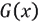
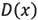

# 11。生成模型

概观

本章向您介绍了创成式模型——它们的组件、它们的功能以及它们能做什么。你将从生成性**长短期记忆** ( **LSTM** )网络以及如何利用它们生成新文本开始。然后，在继续学习**深度卷积生成对抗网络** ( **DCGANs** )并创建您自己的图像之前，您将了解**生成对抗网络** ( **GANs** )以及如何创建新数据。

到本章结束时，你将知道如何有效地使用不同类型的 gan 并生成各种类型的新数据。

# 简介

在本章中，您将探索生成模型，这是一种无监督学习算法，可以生成全新的人工数据。生成模型与预测模型的不同之处在于，它们旨在从相同的训练数据分布中生成新样本。虽然这些模型的目的可能与其他章节中涉及的非常不同，但是您可以并且将会使用在前面章节中学习的许多概念，包括加载和预处理各种数据文件、超参数调整以及构建卷积和**循环神经网络** ( **RNNs** )。在本章中，您将了解从训练数据集中生成新样本的一种方法，即使用 LSTM 模型来完成基于初始种子数据的数据序列。

您将了解的另一种方式是两个神经网络以对立的方式相互竞争的概念，也就是说，一个生成器生成样本，一个鉴别器试图区分生成的样本和真实的样本。由于两个模型同时训练，生成器生成更真实的样本，因为鉴别器可以随着时间的推移更准确地区分“真实”和“虚假”数据。这些一起工作的网络被称为 GANs。生成模型可用于生成新的文本数据、音频样本和图像。

在这一章中，你将主要关注生成模型的三个领域——文本生成或语言建模、GANs 和 DCGANs。

# 文本生成

在*第 9 章*、*循环神经网络*中，您将了解到**自然语言处理** ( **NLP** )和文本生成(也称为语言建模)，因为您处理了一些序列数据问题。在本节中，您将使用相同的数据集来扩展文本生成的序列模型，以生成扩展的标题。

在本书前面，您已经看到，顺序数据是数据集中的每个点都依赖于前一个点的数据，数据的顺序非常重要。回想一下*第九章*、*循环神经网络*中单词袋的例子。使用*单词袋*方法，您只需使用一组单词计数来从它们的使用中获得意义。正如您在*图 11.1* 中看到的，这两个句子具有完全相反的语义，但在单词包格式中是相同的。虽然这对于某些问题可能是一种有效的策略，但对于预测下一个单词来说，这并不是一种理想的方法。


图 11.1:语义不同的相同单词的例子

考虑下面这个语言模型的例子。给你一个句子或短语`yesterday I took my car out for a`，并要求你预测序列中的下一个单词。在这里，完成该序列的一个合适的词是`drive`。


图 11.2:句子示例

要成功处理序列数据，您需要一个能够存储序列值的神经网络。为此，您可以使用 RNNs 和 LSTMs。用于生成新序列的 lstm，例如文本生成或语言建模，被称为生成 lstm。

让我们简单回顾一下 rnn 和 LSTMs。

从本质上讲，rnn 循环往复，存储信息并不断重复这一过程。信息首先被转换成向量，这样它就可以被机器处理。然后，RNN 一次处理一个向量序列。当 RNN 处理每个向量时，向量会通过先前的隐藏状态。通过这种方式，隐藏状态保留了上一步的信息，起到了一种记忆的作用。它通过用压缩`-1`和`1`之间的值的双曲正切函数组合输入和先前的隐藏状态来实现这一点。

本质上，这就是 RNN 的功能。rnn 不需要大量的计算，并且对于短序列工作得很好。简单地说，rnn 是具有环路的网络，允许信息随着时间的推移而持续存在。


图 11.3: RNN 数据流

rnn 确实带来了一些挑战——最显著的是爆炸和消失梯度问题。

**爆炸梯度问题**是当梯度变得太大而无法优化时发生的问题。相反的问题可能发生在你的梯度太小的地方。这就是所谓的**消失梯度问题**。当您重复乘法时，梯度变得越来越小，就会出现这种情况。因为梯度的大小决定了权重更新的大小，所以爆炸或消失的梯度意味着网络不能再被训练。当涉及到训练 RNNs 时，这是一个非常现实的问题，因为网络的输出反馈到输入。消失和爆炸梯度问题在*第 9 章*、*循环神经网络*中有所涉及，关于如何解决这些问题的更多细节可以在那里找到。

LSTM 可以选择性地控制每个 LSTM 节点内的信息流。通过增加控制，您可以更容易地调整模型，以防止渐变的潜在问题。


图 11.4: LSTM 建筑

那么，是什么使 LSTMs 能够在多个时间步骤中跟踪和存储信息呢？你会想起第九章、*循环神经网络*中的*，LSTM 背后的关键构建模块是一个被称为*门*的结构，它允许 LSTM 选择性地添加或删除其细胞状态的信息。*

门由一个边界函数组成，如 sigmoid 或 tanh。例如，如果函数是 sigmoid，它会强制其输入介于 0 和 1 之间。直观地说，你可以认为这是在捕捉应该保留多少通过大门的信息。这应该在零和一之间，有效地控制信息的流动。

LSTMs 通过四个简单的步骤处理信息。

他们首先忘记了他们不相干的历史。第二，它们执行计算来存储新信息的相关部分，第三，它们一起使用这两个步骤来选择性地更新它们的内部状态。最后，它们生成一个输出。


图 11.5: LSTM 处理步骤

这是对 LSTMs 以及它们如何有选择地控制和调节信息流的一点回顾。既然您已经回顾了 LSTM 及其架构，那么您可以通过回顾您的代码和 LSTM 模型来应用其中的一些概念。

您可以使用顺序模型以下列方式创建 LSTM 模型。这个 LSTM 包含四个隐藏层，每个层有`50`、`60`、`80`和`120`个单元和一个 ReLU 激活功能。对于除了最后一层之外的所有层，将`return_sequences`参数设置为`True`，因为它们不是网络中的最终 LSTM 层:

```
regressor = Sequential()
regressor.add(LSTM(units= 50, activation = 'relu', \
                   return_sequences = True, \
                   input_shape = (X_train.shape[1], 5)))
regressor.add(Dropout(0.2))
regressor.add(LSTM(units= 60, activation = 'relu', \
                   return_sequences = True))
regressor.add(Dropout(0.3))
regressor.add(LSTM(units= 80, activation = 'relu', \
              return_sequences = True))
regressor.add(Dropout(0.4))
regressor.add(LSTM(units= 120, activation = 'relu'))
regressor.add(Dropout(0.5))
regressor.add(Dense(units = 1))
```

现在，您已经回忆了如何使用 LSTM 图层创建 rnn，接下来您将学习如何将它们应用于自然语言文本并按顺序生成新文本。

## 扩展 NLP 序列模型生成文本

**NLP** 以传统上机器很难理解的自然语言形式获取数据，并将其转化为对机器学习应用有用的数据。这些数据可以采用字符、单词、句子或段落的形式。在这一部分，您将重点关注文本生成。

快速回顾一下，*预处理*通常包含训练模型所需的所有步骤。一些常见的步骤包括*数据清理*、*转换*和*数据归约*。更具体地说，对于 NLP，步骤可以是以下全部或部分:

*   **数据集清理**包括将大小写转换为小写，删除标点符号。
*   **记号化**是将一个字符序列分解成称为记号的特定单元。
*   **填充**是通过填充使不同大小的输入句子相同的方法。
*   **填充序列**是指确保序列具有统一的长度。
*   `rainy`和`raining`都有茎`rain`。

让我们仔细看看这个过程是什么样子的。

## 数据集清洗

在这里，您创建了一个函数`clean_text`，它在清理后返回一个单词列表。现在，用`lower()`方法将所有文本保存为小写，用`utf8`编码以实现字符标准化。最后，从你的语料库中输出 10 个标题:

```
def clean_text(txt):
    txt = "".join(v for v in txt \
                  if v not in string.punctuation).lower()
    txt = txt.encode("utf8").decode("ascii",'ignore')
    return txt 
corpus = [clean_text(x) for x in all_headlines]
corpus[:10]
```

以这种方式清理文本是标准化输入到模型中的文本的好方法。以相同的编码方式将所有单词转换为小写可以确保文本的一致性。它还确保相同单词的大写或不同编码不会被创建的任何模型视为不同的单词。

## 生成序列和标记化

神经网络期望输入数据采用一致的数字格式。与图像分类模型处理图像的方式非常相似，在图像分类模型中，每个图像都表示为一个三维数组，并且通常会调整大小以满足模型的期望，文本也必须进行类似的处理。幸运的是，Keras 有许多实用程序类和函数来帮助神经网络处理文本数据。一个这样的类是`Tokenizer`，它通过将文本语料库转换成整数序列来对其进行矢量化。下面的代码从 Keras 导入了`Tokenizer`类:

```
from keras.preprocessing.text import Tokenizer
```

## 生成 n 元文法记号的序列

在这里，您创建了一个名为`get_seq_of_tokens`的函数。使用`tokenizer.fit_on_texts`，您可以从语料库中提取标记。每个整数输出对应一个特定的字。`input_seq`参数被初始化为空列表`[]`。使用`token_list =` `tokenizer.texts_to_sequences`，你可以将文本转换成符号化的等价文本。使用`n_gram_sequence` `= token_list`，可以生成 n 元序列。使用`input_seq.append(n_gram_sequence)`，将每个序列添加到特征列表中:

```
tokenizer = Tokenizer()
def get_seq_of_tokens(corpus):
    tokenizer.fit_on_texts(corpus)
    all_words = len(tokenizer.word_index) + 1

    input_seq = []
    for line in corpus:
        token_list = tokenizer.texts_to_sequences([line])[0]
        for i in range(1, len(token_list)):
            n_gram_sequence = token_list[:i+1]
            input_seq.append(n_gram_sequence)
    return input_seq, all_words
your_sequences, all_words = get_seq_of_tokens(corpus)
your_sequences[:10]
```

`get_seq_of_tokens`确保语料库被分解成长度相等的序列。如果一个语料库对于网络的预期输入来说太短，那么得到的序列将不得不被填充。

## 填充序列

这里，您创建了一个将`input_seq`作为输入的`generate_padded_sequences`函数。`pad_sequences`功能用于填充序列，使其长度相等。在函数中，首先，通过计算每个输入序列的长度来确定最大序列长度。一旦确定了最大序列长度，所有其他序列都会被填充以进行匹配。接下来，创建`predictors`和`label`参数。`label`参数是序列的最后一个字，`predictors`参数是所有前面的字。最后，`label`参数被转换成一个分类数组:

```
def generate_padded_sequences(input_seq):
    max_sequence_len = max([len(x) for x in input_seq])
    input_seq = np.array(pad_sequences\
                         (input_seq, maxlen=max_sequence_len, \
                          padding='pre'))

    predictors, label = input_seq[:,:-1],input_seq[:,-1]
    label = keras.utils.to_categorical(label, num_classes=all_words)
    return predictors, label, max_sequence_len
predictors, label, max_sequence_len = generate_padded_sequences\
                                      (your_sequences)
```

现在，您已经学习了使用自然语言的一些预处理和清理步骤，包括清理、生成 n-gram 序列和长度一致的填充序列，您已经为本章的第一个练习，即文本生成做好了准备。

## 练习 11.01:生成文本

在本练习中，您将使用来自*练习 9.02* 、*使用 LSTM 层 Nvidia 股票预测*构建 RNN 的 LSTM 模型，来扩展您的预测序列并生成新文本。在本练习中，您创建了一个 LSTM 模型，通过将历史股票价格输入该模型来预测 Nvidia 的股票价格。该模型能够使用 LSTM 层来了解历史股票价格的模式，以便进行未来预测。

在本练习中，您将使用应用于文本的相同原则，将历史标题输入到模型中。在本练习中，您将使用`articles.csv`数据集。该数据集包含来自纽约时报的 831 个 CSV 格式的新闻标题。除了标题，数据集还包含关于新闻文章的几个属性，包括出版日期、打印页面和关键字。您需要使用给定的数据集生成新的新闻标题。

注意

你可以在这里找到`articles.csv`:http://packt.link/RQVoB。

执行以下步骤来完成本练习:

1.  打开新的 Jupyter 或 Colab 笔记本。
2.  Import the following libraries:

    ```
    from keras.preprocessing.sequence import pad_sequences
    from keras.models import Sequential
    from keras.layers import Embedding, LSTM, Dense, Dropout
    import tensorflow.keras.utils as ku 
    from keras.preprocessing.text import Tokenizer
    import pandas as pd
    import numpy as np
    from keras.callbacks import EarlyStopping
    import string, os 
    import warnings
    warnings.filterwarnings("ignore")
    warnings.simplefilter(action='ignore', category=FutureWarning)
    ```

    您应该得到以下输出:

    ```
    Using TensorFlow backend.
    ```

3.  Load the dataset locally by setting `your_dir` to `content/`. Create a `your_headlines` parameter as an empty list and use a `for` loop to iterate over:

    ```
    your_dir = 'content/'
    your_headlines = []
    for filename in os.listdir(your_dir):
        if 'Articles' in filename:
            article_df = pd.read_csv(your_dir + filename)
            your_headlines.extend(list(article_df.headline.values))
            break
    your_headlines = [h for h in your_headlines if h != "Unknown"]
    len(our_headlines)
    ```

    输出将表示数据集中标题的数量:

    ```
    831
    ```

4.  Now, create a `clean_text` function to return a list of cleaned words. Convert the text to lowercase with `lower()` method and encode it with `utf8` for character standardization. Finally, output 20 headlines from your corpus:

    ```
    def clean_text(txt):
        txt = "".join(v for v in txt \
                      if v not in string.punctuation).lower()
        txt = txt.encode("utf8").decode("ascii",'ignore')
        return txt 
    corpus = [clean_text(x) for x in all_headlines]
    corpus[60:80]
    ```

    您应该得到以下输出:

    

    图 11.6:语料库

5.  With `tokenizer.fit`, extract tokens from the corpus. Each integer output corresponds to a specific word. The `input_seq` parameter is initialized as an empty list, `[]`. With `token_list =` `tokenizer.texts_to_sequences`, you convert each sentence into its tokenized equivalent. With `n_gram_sequence = token_list`, you generate the n-gram sequences. Using `input_seq.append(n_gram_sequence)`, you append each sequence to a list of features:

    ```
    tokenizer = Tokenizer()
    def get_seq_of_tokens(corpus):
        tokenizer.fit_on_texts(corpus)
        all_words = len(tokenizer.word_index) + 1

        input_seq = []
        for line in corpus:
            token_list = tokenizer.texts_to_sequences([line])[0]
            for i in range(1, len(token_list)):
                n_gram_sequence = token_list[:i+1]
                input_seq.append(n_gram_sequence)
        return input_seq, all_words
    your_sequences, all_words = get_seq_of_tokens(corpus)
    your_sequences[:20]
    ```

    您应该得到以下输出:

    

    图 11.7: n 元语法标记

    输出显示了标题的 n-gram 标记。对于每个标题，n-grams 的数量由标题的长度决定。

6.  填充序列并获得变量，`predictors`和`target` :

    ```
    def generate_padded_sequences(input_seq):     max_sequence_len = max([len(x) for x in input_seq])     input_seq = np.array(pad_sequences\                          (input_seq, maxlen=max_sequence_len, \                           padding='pre'))     predictors, label = input_seq[:,:-1],input_seq[:,-1]     label = ku.to_categorical(label, num_classes=all_words)     return predictors, label, max_sequence_len predictors, label, \ max_sequence_len = generate_padded_sequences(inp_seq)
    ```

7.  Prepare your model for training. Add an input embedding layer with `model.add(Embedding)`, a hidden LSTM layer with `model.add(LSTM(100))`, and a dropout of 10%. Then, add the output layer with `model.add(Dense)` using the softmax activation function. With `compile()` method, configure your model for training, setting your loss function to `categorical_crossentropy`. Use the Adam optimizer:

    ```
    def create_model(max_sequence_len, all_words):
        input_len = max_sequence_len - 1
        model = Sequential()

        model.add(Embedding(all_words, 10, input_length=input_len))

        model.add(LSTM(100))
        model.add(Dropout(0.1))

        model.add(Dense(all_words, activation='softmax'))
        model.compile(loss='categorical_crossentropy', \
                      optimizer='adam')

        return model
    model = create_model(max_sequence_len, all_words)
    model.summary()
    ```

    您应该得到以下输出:

    

    图 11.8:模型总结

8.  Fit the model and set `epochs` to `200` and `verbose` to `5`:

    ```
    model.fit(predictors, label, epochs=200, verbose=5)
    ```

    您应该得到以下输出:

    

    图 11.9:训练模型

9.  创建一个函数，该函数将在给定起始种子文本、要生成的字数、模型和最大序列长度的情况下生成标题。该函数将包含一个`for`循环来迭代要生成的单词数。在每次迭代中，标记器将标记文本，然后在预测序列中的下一个单词之前填充序列。接下来，迭代将把令牌转换回单词，并将其添加到句子中。一旦`for`循环完成，生成的标题将被返回:

    ```
    def generate_text(seed_text, next_words, model, max_sequence_len):     for _ in range(next_words):         token_list = tokenizer.texts_to_sequences([seed_text])[0]         token_list = pad_sequences([token_list], \                                     maxlen = max_sequence_len-1, \                                     padding='pre')         predicted = model.predict\                     (token_list, verbose=0)         output_word = ""         for word,index in tokenizer.word_index.items():             if index == predicted.any():                 output_word = word                 break         seed_text += " "+output_word     return seed_text.title()
    ```

10.  Finally, output some of your generated text with the `print` function by printing the output of the function you created in *Step 9*. Use the `10 ways`, `europe looks to`, `best way`, `homeless in`, `unexpected results`, and `critics warn` seed words with the corresponding number of words to generate; that is, `11`, `8`, `10`, `10`, `10`, and `10`, respectively:

    ```
    print (generate_text("10 ways", 11, model, max_sequence_len))
    print (generate_text("europe looks to", 8, model, \
                         max_sequence_len))
    print (generate_text("best way", 10, model, max_sequence_len))
    print (generate_text("homeless in", 10, model, max_sequence_len))
    print (generate_text("unexpected results", 10, model,\
                         max_sequence_len))
    print (generate_text("critics warn", 10, model, \
                         max_sequence_len))
    ```

    您应该得到以下输出:

    

图 11.10:生成的文本

输出显示了生成的标题和提供的种子文本。生成的单词仅限于训练数据集中包含的内容，而训练数据本身的大小就相当有限，这导致了一些无意义的结果。

既然您已经在第一个练习中使用 LSTM 生成了文本，那么让我们继续使用图像，使用 GANs 基于给定的数据集生成新的图像。

# 生成性对抗网络

gan 是通过从训练数据集学习模式和底层表示来生成新的合成数据的网络。GAN 通过使用两个以敌对方式相互竞争的网络来实现这一点。这些网络被称为**发生器**和**鉴别器**。

要了解这些网络如何相互竞争，请考虑以下示例。该示例将跳过一些细节，这些细节在本章后面的内容中会更有意义。

想象两个实体:一个伪钞制造者和一个企业主。伪造者试图制造看起来真实的货币来欺骗企业主，使其认为该货币是合法的。相比之下，企业主试图识别任何假钞，这样他们就不会最终得到一张毫无价值的纸，而不是真正的货币。

这基本上就是 GANs 所做的。这个例子中的造假者是生产者，企业主是鉴别者。生成器创建图像并将其传递给鉴别器。鉴别器检查图像是否真实，两个网络相互竞争，推动彼此的改进。

生成器的任务是创建一个可以欺骗鉴别器的合成数据样本。生成器将试图欺骗鉴别器，使其认为样本是真实的。鉴别器的任务是能够正确地对发生器产生的合成样品进行分类。


图 11.11: GAN 生成的图像

在*对抗网络*部分考虑两者的结合之前，接下来的部分将更深入地研究发生器和鉴别器，以及它们各自是如何工作的。

## 发电机网络

正如所讨论的，在机器学习中，gan 被用于无监督的学习任务。GANs 由两个模型(生成器和鉴别器)组成，可以自动发现和学习输入数据中的模式。这两个模型在分析、捕获和创建数据变化方面相互竞争。GANs 可以用来生成看起来像是来自原始数据的新数据。

首先是发电机模型。生成器如何创建合成数据？

发电机接收输入作为一个固定长度的随机向量，称为潜在向量，进入发电机网络。这有时被称为**随机噪声种子**。从中生成新的样本。然后，生成的实例被发送到鉴别器进行分类。通过随机噪声，生成器了解哪些输出更有说服力，并继续朝着这个方向改进。


图 11.12:发电机网络中的输入和输出模型

在下图中，您可以看到鉴别器从真实数据和生成器中获取输入。生成器神经网络试图生成对鉴别器来说看起来真实的数据。

生成器看不到真正的数据是什么。生成器的主要目标是说服鉴别器将其输出分类为实数。


图 11.13:鉴别器模型的两个数据源

GAN 包括以下组件:

*   噪声输入向量
*   鉴别器网络
*   发电机损耗

反向传播用于通过计算权重对输出的影响，在最佳方向上调整权重。反向传播方法用于获得梯度，并且这些梯度可以帮助改变生成器权重。


图 11.14:GAN 中的反向传播

单个生成器迭代的基本过程如下所示:

1.  基于来自数据集的真实数据，使用*样本随机噪声*。
2.  *发生器*从噪声中产生*输出*。
3.  *鉴别器*将输出分类为“*真*或“*假*”
4.  计算来自该分类的*损失*，然后通过发生器和*鉴别器*进行*反向传播，以获得*梯度*。*
5.  *坡度*用于调整发电机*重量*。

现在，要对生成器进行编码，第一步是定义您的生成器模型。首先用`define_your_gen`创建您的生成器函数。您的生成器的输出数量应该与您试图合成的数据大小相匹配。因此，生成器的最终图层应该是一个密集图层，其单元数等于输出的预期大小:

```
model.add(Dense(n_outputs, activation='linear'))
```

该模型不会编译，因为它不直接适合生成器模型。

该代码块将类似于以下内容:

```
def define_your_gen(latent_dim, n_outputs=2):
    model = Sequential()
    model.add(Dense(5, activation='relu', \
                    kernel_initializer='he_uniform', \
                    input_dim=latent_dim))
    model.add(Dense(n_outputs, activation='linear'))
    return model
```

发电机构成 GAN 的一半；另一半是鉴别器。

## 鉴别器网络

**鉴别器**是一个神经网络模型，它学习从生成器作为输入发送的虚假数据中识别真实数据。训练数据的两个来源是真实的数据样本和伪造的生成器样本:

*   在训练期间，鉴别器使用真实数据实例作为正样本。
*   由生成器创建的合成数据实例在训练过程中被用作假样本。


图 11.15:鉴频器网络的输入

在鉴别器训练过程中，鉴别器连接到发生器和鉴别器损耗。它需要来自生成器的真实数据和合成数据，但仅使用鉴别器损失进行权重更新。


图 11.16:带鉴频器损耗的反向传播

现在让我们看看鉴别器是如何与一些代码一起工作的。

您的第一步是用`define_disc()`定义您的鉴别器模型。

该模型从您的生成器中提取一个向量，并预测样本是真是假。因此，您使用二元分类。

您正在创建一个简单的 GAN，所以您将只需要一个隐藏层。使用`model.add(Dense(25)`创建隐藏层。

同样，您的激活功能将用`activation='relu'`重新启动，用`kernel_initializer='he_uniform'`初始化`he_uniform`重量。

对于二进制分类，您的输出图层将只需要一个节点。为了确保您的输出为零或一，您将使用 sigmoid 激活函数:

```
model.add(Dense(1, activation='sigmoid'))
```

该模型将试图最小化您的损失函数。使用 Adam 进行随机梯度下降:

```
model.compile(loss='binary_crossentropy', \
              optimizer='adam', metrics=['accuracy'])
```

下面是您的鉴别器模型代码:

```
def define_disc(n_inputs=2):
    model = Sequential()
    model.add(Dense(25, activation='relu', \
                    kernel_initializer='he_uniform', \
                    input_dim=n_inputs))
    model.add(Dense(1, activation='sigmoid'))
    model.compile(loss='binary_crossentropy', \
                  optimizer='adam', metrics=['accuracy'])
    return model
```

既然您已经知道了如何创建组成 GAN 的两个模型，那么您可以在下一节中学习如何将它们组合起来创建您的 GAN。

## 敌对网络

GANs 由两个网络组成，一个发电机，表示为，一个鉴别器，表示为。两个网络都在玩一场对抗游戏。生成器网络试图学习训练数据的底层分布并生成相似的样本，而鉴别器网络试图捕捉生成器生成的假样本。

生成器网络获取样本并生成数据的假样本。生成器被训练以增加鉴别器网络出错的概率。鉴别器网络在 sigmoid 函数的帮助下使用二进制分类来决定数据是从真实样本中产生的还是从真实样本中获取的。sigmoid 函数确保输出为零或一。

下表概述了工作中的典型 GAN:

1.  首先，一个*噪声向量*或*输入向量*被馈送到发电机网络。
2.  生成器创建合成数据样本。
3.  真实数据与合成数据一起被传递给鉴别器。
4.  鉴别器然后识别数据并将其分类为真或假。
5.  模型被训练，损耗反向传播到鉴别器和发电机网络中。


图 11.17:带输入和输出的 GAN 模型

要对敌对网络进行编码，以下步骤是必要的。以下各节将详细介绍其中的每一项:

1.  将发生器和鉴别器模型结合到您的 GAN 中。
2.  生成带有类别标签的真实样本。
3.  在潜在空间中创建点以用作生成器的输入。
4.  使用生成器创建假样本。
5.  评估鉴别器性能。
6.  训练发电机和鉴别器。
7.  创建潜在空间、生成器、鉴别器和 GAN，并根据训练数据训练 GAN。

现在，您已经探索了生成器和鉴别器的内部工作方式，接下来看看如何将这些模型结合起来相互竞争。

### 结合生成模型和判别模型

`define_your_gan()`函数创建您的组合模型。

创建组合 GAN 模型时，通过指定`discriminator.trainable = False`冻结鉴别器模型的权重。这可以防止在您更新生成器权重时更新鉴别器权重。

现在，您可以添加带有`model.add(generator)`和`model.add(discriminator)`的两种型号。

然后，在编译模型时，指定`binary_crossentropy`为损失函数，亚当为优化器:

```
def define_your_gan(generator, discriminator):
    discriminator.trainable = False
    model = Sequential()
    model.add(generator)
    model.add(discriminator)
    model.compile(loss='binary_crossentropy', optimizer='adam')
    return model
```

### 生成带有类别标签的真实样本

现在，从数据集中提取真实样本，对照它们检查虚假样本。您可以使用之前定义的`generate_real()`功能。在函数的第一行`rand(n) – 0.5`，在`n`上创建`-0.5`到`0.5`范围内的随机数。使用`hstack`来堆叠你的数组。现在您可以使用`y = ones((n, 1))`生成分类标签:

```
def generate_real(n):
    X1 = rand(n) - 0.5
    X2 = X1 * X1
    X1 = X1.reshape(n, 1)
    X2 = X2.reshape(n, 1)
    X = hstack((X1, X2))
    y = ones((n, 1))
    return X, y
```

### 为生成器创建潜在点

接下来，使用生成器模型创建假样本。您需要使用`gen_latent_points()`功能在潜在空间中生成相同数量的点。这些潜在点将被传递给生成器以创建样本。该函数从 NumPy 的`randn`函数生成均匀随机样本。该数字将对应于潜在维度乘以要生成的样本数。然后，这个随机数数组将被重新整形，以匹配生成器的预期输入:

```
def gen_latent_points(latent_dim, n):
    x_input = randn(latent_dim * n)
    x_input = x_input.reshape(n, latent_dim)
    return x_input
```

### 使用生成器生成假样本和类别标签

`gen_fake()`函数生成类别标签为零的假样本。该函数使用上一步创建的函数生成潜在点。然后，生成器将基于潜在点生成样本。最后，生成类标签`y`，作为表示这是合成数据的事实的零数组:

```
def gen_fake(generator, latent_dim, n):
    x_input = gen_latent_points(latent_dim, n)
    X = generator.predict(x_input)
    y = zeros((n, 1))
    return X, y
```

### 评估鉴别器模型

以下`performance_summary()`函数用于绘制真实和虚假数据点。该函数生成真实值和合成数据，并通过识别合成图像的准确度来评估鉴别器的性能。然后，它最终绘制出真实图像和合成图像以供视觉检查:

```
def performance_summary(epoch, generator, \
                        discriminator, latent_dim, n=100):
    x_real, y_real = generate_real(n)
    _, acc_real = discriminator.evaluate\
                  (x_real, y_real, verbose=0)
    x_fake, y_fake = gen_fake\
                     (generator, latent_dim, n)
    _, acc_fake = discriminator.evaluate\
                  (x_fake, y_fake, verbose=0)
    print(epoch, acc_real, acc_fake)
    plt.scatter(x_real[:, 0], x_real[:, 1], color='green')
    plt.scatter(x_fake[:, 0], x_fake[:, 1], color='red')
    plt.show()
```

### 训练发生器和鉴别器

现在，用`train()`函数训练你的模型。这个函数包含一个`for`循环来遍历各个时期。在每个时期，以等于批的一半的大小对真实数据进行采样，然后生成合成数据。然后，鉴别器训练真实数据，接着是合成数据。然后，对 GAN 模型进行训练。当纪元编号是输入参数`n_eval`的倍数时，将生成性能摘要:

```
def train(g_model, d_model, your_gan_model, \
          latent_dim, n_epochs=1000, n_batch=128, n_eval=100):
    half_batch = int(n_batch / 2)
    for i in range(n_epochs):
        x_real, y_real = generate_real(half_batch)
        x_fake, y_fake = gen_fake\
                         (g_model, latent_dim, half_batch)
        d_model.train_on_batch(x_real, y_real)
        d_model.train_on_batch(x_fake, y_fake)
        x_gan = gen_latent_points(latent_dim, n_batch)
        y_gan = ones((n_batch, 1))
        your_gan_model.train_on_batch(x_gan, y_gan)
        if (i+1) % n_eval == 0:
            performance_summary(i, g_model, d_model, latent_dim)
```

### 创建潜在空间、生成器、鉴别器、GAN 和训练数据

您可以组合所有步骤来构建和训练模型。这里，`latent_dim`设置为`5`，代表五个潜在维度:

```
latent_dim = 5
generator = define_gen(latent_dim)
discriminator = define_discrim()
your_gan_model = define_your_gan(generator, discriminator)
train(generator, discriminator, your_gan_model, latent_dim)
```

在本节中，您了解了 GANs、不同的组件、生成器和鉴别器，以及如何将它们结合起来创建一个敌对网络。现在，您将使用这些概念来生成您自己的 GAN 序列。

## 练习 11.02:用 gan 生成序列

在本练习中，您将使用 GAN 创建一个模型，该模型为`-0.5`和`0.5`之间的`x`值生成一个二次函数(`y=x` 2)。您将创建一个模拟正态分布的生成器，然后对值求平方以模拟二次函数。您还将创建一个鉴别器，用于区分真正的二次函数和生成器的输出。接下来，您将组合它们来创建 GAN 模型。最后，您将训练您的 GAN 模型并评估您的模型，将生成器的结果与真正的二次函数进行比较。

执行以下步骤来完成本练习:

1.  打开一个新的 Jupyter 或 Colab 笔记本并导入以下库:

    ```
    from keras.models import Sequential from numpy import hstack, zeros, ones from numpy.random import rand, randn from keras.layers import Dense import matplotlib.pyplot as plt 
    ```

2.  Define the generator model. Begin by creating your generator function with `define_gen`.

    对发电机网络的最后一层使用 Keras' `linear`激活函数，因为输出向量应像正态分布一样由连续的实数值组成。输出向量的第一个元素的范围为`[-0.5,0.5]`。因为您将只考虑这两个值之间的值`x`，所以第二个元素的范围为`[0.0,0.25]`:

    ```
    def define_gen(latent_dim, n_outputs=2):
        model = Sequential()
        model.add(Dense(15, activation='relu', \
                  kernel_initializer='he_uniform', \
                  input_dim=latent_dim))
        model.add(Dense(n_outputs, activation='linear'))
        return model
    ```

3.  Now, with `define_disc()`, define your discriminator. The discriminator network has a binary output that identifies whether the input is real or fake. For this reason, use sigmoid as the activation function and binary cross-entropy as your loss.

    您正在创建一个简单的 GAN，所以使用一个带有`25`节点的隐藏层。使用 ReLU 激活和`he_uniform`重量初始化。对于二进制分类，您的输出图层将只需要一个节点。使用亚当作为你的优化。该模型将尝试最小化您的损失函数:

    ```
    def define_disc(n_inputs=2):
        model = Sequential()
        model.add(Dense(25, activation='relu', \
                        kernel_initializer='he_uniform', \
                        input_dim=n_inputs))
        model.add(Dense(1, activation='sigmoid'))
        model.compile(loss='binary_crossentropy', \
                      optimizer='adam', metrics=['accuracy'])
        return model
    ```

4.  现在，添加带有`model.add(generator)`和`model.add(discriminator)`的两个模型。然后，指定二元交叉熵作为你的损失函数，亚当作为你的优化器，同时编译你的模型:

    ```
    def define_your_gan(generator, discriminator):     discriminator.trainable = False     model = Sequential()     model.add(generator)     model.add(discriminator)     model.compile(loss='binary_crossentropy', optimizer='adam')     return model
    ```

5.  从数据集中提取真实样本，并对照它们检查虚假样本。使用之前定义的`generate_real()`功能。`rand(n) – 0.5`在`n`上生成`-0.5`到`0.5`范围内的随机数。使用`hstack`堆叠您的阵列。现在，用 `y = ones((n, 1))` :

    ```
    def generate_real(n):     X1 = rand(n) - 0.5     X2 = X1 * X1     X1 = X1.reshape(n, 1)     X2 = X2.reshape(n, 1)     X = hstack((X1, X2))     y = ones((n, 1))     return X, y
    ```

    生成类标签
6.  接下来，设置生成器模型来创建假样本。使用`gen_latent_points()`功能在潜在空间中生成相同数量的点。然后，将它们传递给生成器，并使用它们来创建样本:

    ```
    def gen_latent_points(latent_dim, n):     x_input = randn(latent_dim * n)     x_input = x_input.reshape(n, latent_dim)     return x_input
    ```

7.  使用生成器生成带有类别标签的假样本:

    ```
    def gen_fake(generator, latent_dim, n):     x_input = gen_latent_points(latent_dim, n)     X = generator.predict(x_input)     y = zeros((n, 1))     return X, y
    ```

8.  评估鉴别器模型。`performance_summary()`功能将绘制真实和虚假数据点:

    ```
    def performance_summary(epoch, generator, \                         discriminator, latent_dim, n=100):     x_real, y_real = generate_real(n)     _, acc_real = discriminator.evaluate\                   (x_real, y_real, verbose=0)     x_fake, y_fake = gen_fake\                      (generator, latent_dim, n)     _, acc_fake = discriminator.evaluate\                   (x_fake, y_fake, verbose=0)     print(epoch, acc_real, acc_fake)     plt.scatter(x_real[:, 0], x_real[:, 1], color='green')     plt.scatter(x_fake[:, 0], x_fake[:, 1], color='red')     plt.show()
    ```

9.  现在，用`train()`函数训练你的模型:

    ```
    def train(g_model, d_model, your_gan_model, \           latent_dim, n_epochs=1000, \           n_batch=128, n_eval=100):     half_batch = int(n_batch / 2)     for i in range(n_epochs):         x_real, y_real = generate_real(half_batch)         x_fake, y_fake = gen_fake\                          (g_model, latent_dim, half_batch)         d_model.train_on_batch(x_real, y_real)         d_model.train_on_batch(x_fake, y_fake)         x_gan = gen_latent_points(latent_dim, n_batch)         y_gan = ones((n_batch, 1))         your_gan_model.train_on_batch(x_gan, y_gan)         if (i+1) % n_eval == 0:             performance_summary(i, g_model, d_model, latent_dim)
    ```

10.  Create a parameter for the latent dimension and set it equal to `5`. Then, create a generator, discriminator, and GAN using the respective functions. Train the generator, discriminator, and GAN models using the `train` function:

    ```
    latent_dim = 5
    generator = define_gen(latent_dim)
    discriminator = define_disc()
    your_gan_model = define_your_gan(generator, discriminator)
    train(generator, discriminator, your_gan_model, latent_dim)
    ```

    您将获得以下输出:

    

图 11.18:真实和虚假数据的分布

输出显示生成器通过生成更类似于二次函数的点而逐步改进。在早期时代，由生成器生成的点(由蓝点表示)与真正的二次函数(由红点表示)几乎没有相似之处。然而，到最后一个时期，生成器生成的点几乎位于真实点之上，这表明生成器几乎已经捕捉到了真实的底层函数——二次函数。

在本练习中，您利用创成式模型的不同组件来创建符合二次函数的数据。在*图 11.18* 中可以看到，到最后一个历元时，假数据与真数据相似，表明生成器能够很好地捕捉二次函数。

现在是本书的最后一部分了，在 DCGANs 上，你将创建自己的图像。

# 深度卷积生成对抗网络

DCGANs 使用卷积神经网络而不是简单的神经网络作为鉴别器和发生器。它们可以生成更高质量的图像，通常用于此目的。

生成器是一组具有分数步距卷积的卷积层，也称为转置卷积。具有转置卷积的层在每个卷积层对输入图像进行上采样，这增加了每层之后图像的空间维度。

鉴别器是一组具有步长卷积的卷积层，因此它在每个卷积层对输入图像进行下采样，从而降低每层之后图像的空间维度。

考虑下面两个图像。你能辨别哪个是假的哪个是真的吗？花点时间仔细看看它们。


图 11.19:面部示例

你可能会惊讶地发现，这两张照片都不是真人。这些图像是使用真实人物的图像创建的，但它们不是真实的人。它们是由两个相互竞争的神经网络创建的。

如您所知，GAN 由两个不同的神经网络组成:鉴别器和生成器。立刻看起来不同的是，这些网络中的每一个都有不同的输入和输出。这是理解 GANs 如何做他们所做的事情的关键。

对于鉴别器，输入是一幅图像——一个 3D 张量(高度、宽度、颜色)。输出是用于进行分类的单个数字。在*图 11.20* 中，可以看到`[0.95]`。这意味着番茄图像有 95%的可能性是真实的。

对于生成器，输入是生成的随机数字种子向量。输出是一幅图像。

生成器网络学习生成与数据集中的图像相似的图像，而鉴别器学习从生成的图像中鉴别原始图像。在这种竞争的方式下，他们学习生成类似于训练数据集中的真实图像。


图 11.20:鉴别器和发生器网络

我们来看看发电机是怎么训练的。从图 11.20 的*中得出的一个关键点是，发生器网络具有静态*权重*，而鉴别器网络显示已训练*的*权重。这很重要，因为这使您能够区分 GAN 损失函数如何独立地从发生器和鉴别器上的权重更新变化。*

注意`X`(随机种子)被输入到模型中以产生`y`。你的模型输出你所预测的。


图 11.21:如何训练发电机

需要记住的另一个要点是，发电机在训练时从未看到任何真实数据。生成器的唯一目标是欺骗鉴别器。

现在，考虑鉴别器网络的训练过程。在由相同数量的真实和伪造(生成)图像组成的训练数据集上训练鉴别器。真实图像是从原始数据集中随机采样的，并且被标记为一个。使用生成器网络生成相同数量的伪图像，并标记为零。


图 11.22:如何训练鉴别器

原始“普通”GAN 和 DCGAN 之间的核心差异对应于架构上的差异。普通 GAN 的池层由发生器中的转置卷积和 DCGAN 鉴别器中的步幅卷积代替。除了生成器输出层和鉴别器输入层之外，DCGANs 的生成器和鉴别器都使用批处理规范化层。此外，完全连接的隐藏层的 DCGANs 被删除。最后，DCGANs 中的激活函数通常不同，以反映卷积层的使用。在发生器中，ReLU 用于除输出层之外的所有层，输出层使用 tanh，对于鉴别器，泄漏 ReLU 用于所有层。

## 训练 DCGAN

首先，您要设置定义 DCGAN 的所有常量。

您想要生成的图像的分辨率由`gen_res`参数指定。图像的高度和宽度的最终分辨率将是`32*gen_res`。您将使用`gen_res = 3`，这将导致图像分辨率为`96x96`。

图像通道，`img_chan`，就是图像每个像素有多少个数字。对于颜色，您需要三个颜色通道中每一个的像素值:`3`。

您的预览图像行和列(`img_rows`和`img_cols`)将是您想要在一行和一列中显示多少图像。例如，如果您选择预览图像行`4`，预览列值`4`，您将总共显示 16 幅图像。

`data_path`是您的数据在电脑上的存储位置。这提供了代码访问和存储数据所需的路径。

`epoch`是训练数据时的遍数。

批量大小`num_batch`，是每次迭代的训练样本数。

缓冲区大小`num_buffer`是所使用的随机洗牌。您只需将其设置为您的数据集大小。

种子矢量，`seed_vector`，是将用于生成图像的种子矢量的大小。

考虑以下示例，了解如何初始化定义 DCGAN 的所有常数:

```
gen_res = 3
gen_square = 32 * gen_res
img_chan = 3
img_rows = 5
img_cols = 5
img_margin = 16
seed_vector = 200
data_path = '/content/drive/MyDrive/Datasets\
            '/apple-or-tomato/training_set/'
epochs = 1000
num_batch = 32
num_buffer = 1000
```

现在您可以构建生成器和鉴别器了。首先用`def create_generator`定义您的生成器函数，使用`seed_size`和`channels`作为参数:

```
def create_generator(seed_size, channels):
    model = Sequential()
```

现在，您将创建来自*输入种子*的生成图像；不同的种子数量将生成不同的图像，您的种子大小将决定生成多少不同的图像。

接下来，添加一个带有`4*4*256`的密集层作为你的输出空间的维度，并使用 ReLU 激活函数。`input_dim`是一个输入形状，它等于`seed_size`。

使用下面的代码添加一个层，该层重塑您的输入以匹配您的`4*4*256`的输出空间:

```
model.add(Reshape((4,4,256)))
```

你的`UpSampling2D`层是一个简单的层，它将输入的维度加倍。其后必须是卷积层(`Conv2D`):

```
model.add(UpSampling2D())
```

用`256`作为你的输入添加你的`Conv2D`层。您可以选择`kernel_size=3`作为您的`3x3`卷积滤波器。使用`padding="same"`，您可以确保图层的输出与其输入具有相同的空间维度:

```
model.add(Conv2D(256,kernel_size=3,padding="same"))
```

使用批量归一化来归一化单个图层，有助于防止渐变问题。动量可以是`0.0`到`0.99`范围内的任何值。在这里，使用`momentum=0.8`:

```
model.add(BatchNormalization(momentum=0.8))
```

在最终的 CNN 图层上，您将使用 tanh 激活功能来确保您的输出图像在`-1`到`1`的范围内:

```
model.add(Conv2D(channels,kernel_size=3,padding="same"))
model.add(Activation("tanh"))
```

完整的代码块应该如下所示:

```
def create_generator(seed_size, channels):
    model = Sequential()
    model.add(Dense(4*4*256,activation="relu", \
                    input_dim=seed_size))
    model.add(Reshape((4,4,256)))
    model.add(UpSampling2D())
    model.add(Conv2D(256,kernel_size=3,padding="same"))
    model.add(BatchNormalization(momentum=0.8))
    model.add(Activation("relu"))
    model.add(UpSampling2D())
    model.add(Conv2D(256,kernel_size=3,padding="same"))
    model.add(BatchNormalization(momentum=0.8))
    model.add(Activation("relu"))

    model.add(UpSampling2D())
    model.add(Conv2D(128,kernel_size=3,padding="same"))
    model.add(BatchNormalization(momentum=0.8))
    model.add(Activation("relu"))
    if gen_res>1:
      model.add(UpSampling2D(size=(gen_res,gen_res)))
      model.add(Conv2D(128,kernel_size=3,padding="same"))
      model.add(BatchNormalization(momentum=0.8))
      model.add(Activation("relu"))
    model.add(Conv2D(channels,kernel_size=3,padding="same"))
    model.add(Activation("tanh"))
    return model
```

现在您可以定义您的鉴别器:

```
def create_discriminator(image_shape):
    model = Sequential()
```

这里，使用一个`Conv2D`层。您可以选择`kernel_size=3`作为您的`3x3`卷积滤波器。使用`strides=2`，您可以指定“滑动窗口”的步幅。设置`input_shape=image_shape`以确保它们匹配，同样，使用`padding="same"`，您确保层的输出将具有与其输入相同的空间维度。在所有鉴别器层的`Conv2D`层后增加一个 LeakyReLU 激活函数:

```
model.add(Conv2D(32, kernel_size=3, \
                 strides=2, input_shape=image_shape, \
                 padding="same"))
model.add(LeakyReLU(alpha=0.2))
```

`Flatten`层将您的数据转换为单一特征向量，以输入到您的最后一层:

```
model.add(Flatten())
```

对于您的激活函数，使用 sigmoid 进行二进制分类输出:

```
model.add(Dense(1, activation='sigmoid'))
```

完整的代码块应该如下所示:

```
def create_discriminator(image_shape):
    model = Sequential()
    model.add(Conv2D(32, kernel_size=3, strides=2, \
                     input_shape=image_shape, 
                     padding="same"))
    model.add(LeakyReLU(alpha=0.2))
    model.add(Dropout(0.25))
    model.add(Conv2D(64, kernel_size=3, strides=2, \
                     padding="same"))
    model.add(ZeroPadding2D(padding=((0,1),(0,1))))
    model.add(BatchNormalization(momentum=0.8))
    model.add(LeakyReLU(alpha=0.2))
    model.add(Dropout(0.25))
    model.add(Conv2D(128, kernel_size=3, strides=2, \
                     padding="same"))
    model.add(BatchNormalization(momentum=0.8))
    model.add(LeakyReLU(alpha=0.2))
    model.add(Dropout(0.25))
    model.add(Conv2D(256, kernel_size=3, strides=1, \
                     padding="same"))
    model.add(BatchNormalization(momentum=0.8))
    model.add(LeakyReLU(alpha=0.2))
    model.add(Dropout(0.25))
    model.add(Conv2D(512, kernel_size=3, \
                     strides=1, padding="same"))
    model.add(BatchNormalization(momentum=0.8))
    model.add(LeakyReLU(alpha=0.2))
    model.add(Dropout(0.25))
    model.add(Flatten())
    model.add(Dense(1, activation='sigmoid'))
    return model
```

接下来，创建你的损失函数。由于鉴频器和发生器网络的输出不同，因此需要为它们定义两个独立的损失函数。此外，他们需要通过网络在独立通道中单独接受培训。

可以用`tf.keras.losses.BinaryCrossentropy`换`cross_entropy`。这将计算真实标签和预测标签之间的损失。然后，根据您的`real_output`和`fake_output`参数定义`discrim_loss`函数，使用`tf.ones`和`tf.zeros`计算`total_loss`:

```
cross_entropy = tf.keras.losses.BinaryCrossentropy()
def discrim_loss(real_output, fake_output):
    real_loss = cross_entropy(tf.ones_like(real_output), \
                              real_output)
    fake_loss = cross_entropy(tf.zeros_like(fake_output), \
                              fake_output)
    total_loss = real_loss + fake_loss
    return total_loss
def gen_loss(fake_output):
    return cross_entropy(tf.ones_like(fake_output), \
                         fake_output)
```

Adam 优化器用于生成器和鉴别器，具有相同的学习速率和动量:

```
gen_optimizer = tf.keras.optimizers.Adam(1.5e-4,0.5)
disc_optimizer = tf.keras.optimizers.Adam(1.5e-4,0.5)
```

在这里，你有你的个人训练步骤。一次只能修改一个网络的权重，这一点非常重要。使用`tf.GradientTape()`，您可以同时训练鉴别器和发生器，但彼此分开。TensorFlow 就是这么做自动微分的。它计算导数。您会看到它创建了两个“磁带”—`gen_tape`和`disc_tape`。

然后，为鉴别器创建`real_output`和`fake_output`。将此用于发电机损耗(`g_loss`)。现在，你可以计算鉴频器损耗(`d_loss`)，用`gradients_of_generator`和`gradients_of_discriminator`计算发生器和鉴频器的梯度，并应用它们:

```
@tf.function
def train_step(images):
    seed = tf.random.normal([num_batch, seed_vector])
    with tf.GradientTape() as gen_tape, \
              tf.GradientTape() as disc_tape:
    gen_imgs = generator(seed, training=True)
    real_output = discriminator(images, training=True)
    fake_output = discriminator(gen_imgs, training=True)
    g_loss = gen_loss(fake_output)
    d_loss = discrim_loss(real_output, fake_output)

    gradients_of_generator = gen_tape.gradient(\
        g_loss, generator.trainable_variables)
    gradients_of_discriminator = disc_tape.gradient(\
        d_loss, discriminator.trainable_variables)
    gen_optimizer.apply_gradients(zip(
        gradients_of_generator, generator.trainable_variables))
    disc_optimizer.apply_gradients(zip(
        gradients_of_discriminator, 
        discriminator.trainable_variables))
    return g_loss,d_loss
```

接下来，使用`fixed_seeds`创建多个固定种子，每个显示的图像和每个种子向量一个种子。这样做是为了跟踪相同的图像，观察随时间的变化。有了`for epoch in range`，你就在追踪自己的时间。用`for image_batch in dataset`循环每个批次。现在，继续用`generator_loss`和`discriminator_loss`跟踪你的发电机和鉴别器的损耗。现在，在训练过程中，您可以很好地显示所有这些信息:

```
def train(dataset, epochs):
    fixed_seed = np.random.normal\
                (0, 1, (img_rows * img_cols, seed_vector))
    start = time.time()
    for epoch in range(epochs):
        epoch_start = time.time()
        g_loss_list = []
        d_loss_list = []
        for image_batch in dataset:
            t = train_step(image_batch)
            g_loss_list.append(t[0])
            d_loss_list.append(t[1])
        generator_loss = sum(g_loss_list) / len(g_loss_list)
        discriminator_loss = sum(d_loss_list) / len(d_loss_list)
        epoch_elapsed = time.time()-epoch_start
        print (f'Epoch {epoch+1}, gen loss={generator_loss}', \
               f'disc loss={discriminator_loss},'\
               f' {time_string(epoch_elapsed)}')
        save_images(epoch,fixed_seed)
    elapsed = time.time()-start
    print (f'Training time: {time_string(elapsed)}')
```

在最后一节中，您在使用创成式网络时采取了额外的步骤。您学习了如何训练 DCGAN，以及如何一起使用生成器和鉴别器来创建您自己的图像。

在下一个练习中，您将运用到目前为止在本节中学到的内容。

## 练习 11.03:使用 DCGAN 生成图像

在本练习中，您将使用 DCGAN 从头开始生成自己的映像。您将使用具有卷积层的生成器和鉴别器来构建 DCGAN。然后，您将在一个番茄的图像上训练您的 DCGAN，在整个训练过程中，您将从生成器输出生成的图像来跟踪生成器的性能。

注意

你可以在这里找到`tomato-or-apple`数据集:[https://packt.link/6Z8vW](https://packt.link/6Z8vW)。

对于本练习，建议您使用 Google Colab:

1.  Load Google Colab and Google Drive:

    ```
    try:
        from google.colab import drive
        drive.mount('/content/drive', force_remount=True)
        COLAB = True
        print("Note: using Google CoLab")
        %tensorflow_version 2.x
    except:
        print("Note: not using Google CoLab")
        COLAB = False
    ```

    您的输出应该如下所示:

    ```
    Mounted at /content/drive
    Note: using Google Colab
    ```

2.  导入相关库:

    ```
    import tensorflow as tf from tensorflow.keras.layers import Input, Reshape, Dropout, Dense  from tensorflow.keras.layers import Flatten, BatchNormalization from tensorflow.keras.layers import Activation, ZeroPadding2D from tensorflow.keras.layers import LeakyReLU from tensorflow.keras.layers import UpSampling2D, Conv2D from tensorflow.keras.models import Sequential, Model, load_model from tensorflow.keras.optimizers import Adam import zipfile import numpy as np from PIL import Image from tqdm import tqdm import os  import time import matplotlib.pyplot as plt from skimage.io import imread
    ```

3.  格式化一个时间字符串来跟踪你的时间使用:

    ```
    def time_string(sec_elapsed):     hour = int(sec_elapsed / (60 * 60))     minute = int((sec_elapsed % (60 * 60)) / 60)     second = sec_elapsed % 60     return "{}:{:>02}:{:>05.2f}".format(hour, minute, second)
    ```

4.  Set the generation resolution to `3`. Also, set `img_rows` and `img_cols` to `5` and `img_margin` to `16` so that your preview images will be a `5x5` array (25 images) with a 16-pixel margin.

    设置`seed_vector`等于`200`。将`data_path`设置为您存储图像数据集的位置。如你所见，你在这里使用谷歌驱动。如果您不知道您的数据路径，您可以简单地定位您的文件所在的位置，右键单击，并选择`Copy Path`。将您的纪元设置为`1000`。

    最后，打印参数:

    ```
    gen_res = 3 
    gen_square = 32 * gen_res
    img_chan = 3
    img_rows = 5
    img_cols = 5
    img_margin = 16
    seed_vector = 200
    data_path = '/content/drive/MyDrive/Datasets'\
                '/apple-or-tomato/training_set/'
    epochs = 5000
    num_batch = 32
    num_buffer = 60000
    print(f"Will generate a resolution of {gen_res}.")
    print(f"Will generate {gen_square}px square images.")
    print(f"Will generate {img_chan} image channels.")
    print(f"Will generate {img_rows} preview rows.")
    print(f"Will generate {img_cols} preview columns.")
    print(f"Our preview margin equals {img_margin}.")
    print(f"Our data path is: {data_path}.")
    print(f"Our number of epochs are: {epochs}.")
    print(f"Will generate a batch size of {num_batch}.")
    print(f"Will generate a buffer size of {num_buffer}.")
    ```

    您的输出应该如下所示:

    

    图 11.23:显示参数的输出

5.  加载并预处理图像。在这里，您将保存一个 NumPy 预处理文件。加载以前的训练编号文件。图像的二进制文件的名称具有编码在其中的图像的尺寸:

    ```
    training_binary_path = os.path.join(data_path,\         f'training_data_{gen_square}_{gen_square}.npy') print(f"Looking for file: {training_binary_path}") if not os.path.isfile(training_binary_path):     start = time.time()     print("Loading training images...")     train_data = []     images_path = os.path.join(data_path,'tomato')     for filename in tqdm(os.listdir(images_path)):         path = os.path.join(images_path,filename)         images = Image.open(path).resize((gen_square,             gen_square),Image.ANTIALIAS)         train_data.append(np.asarray(images))     train_data = np.reshape(train_data,(-1,gen_square,             gen_square,img_chan))     train_data = train_data.astype(np.float32)     train_data = train_data / 127.5 - 1\.     print("Saving training images...")     np.save(training_binary_path,train_data)     elapsed = time.time()-start     print (f'Image preprocessing time: {time_string(elapsed)}') else:     print("Loading the training data...")     train_data = np.load(training_binary_path)
    ```

6.  对数据进行批处理和洗牌。使用`tensorflow.data.Dataset`对象库，使用其函数混洗数据集并创建批处理:

    ```
    train_dataset = tf.data.Dataset.from_tensor_slices(train_data) \                   .shuffle(num_buffer).batch(num_batch)
    ```

7.  建造发电机:

    ```
    def create_generator(seed_size, channels):     model = Sequential()     model.add(Dense(4*4*256,activation="relu", \                     input_dim=seed_size))     model.add(Reshape((4,4,256)))     model.add(UpSampling2D())     model.add(Conv2D(256,kernel_size=3,padding="same"))     model.add(BatchNormalization(momentum=0.8))     model.add(Activation("relu"))     model.add(UpSampling2D())     model.add(Conv2D(256,kernel_size=3,padding="same"))     model.add(BatchNormalization(momentum=0.8))     model.add(Activation("relu"))         model.add(UpSampling2D())     model.add(Conv2D(128,kernel_size=3,padding="same"))     model.add(BatchNormalization(momentum=0.8))     model.add(Activation("relu"))     if gen_res>1:         model.add(UpSampling2D(size=(gen_res,gen_res)))         model.add(Conv2D(128,kernel_size=3,padding="same"))         model.add(BatchNormalization(momentum=0.8))         model.add(Activation("relu"))     model.add(Conv2D(channels,kernel_size=3,padding="same"))     model.add(Activation("tanh"))     return model
    ```

8.  建立鉴别器:

    ```
    def create_discriminator(image_shape):     model = Sequential()     model.add(Conv2D(32, kernel_size=3, strides=2, \                      input_shape=image_shape,                       padding="same"))     model.add(LeakyReLU(alpha=0.2))     model.add(Dropout(0.25))     model.add(Conv2D(64, kernel_size=3, \                      strides=2, padding="same"))     model.add(ZeroPadding2D(padding=((0,1),(0,1))))     model.add(BatchNormalization(momentum=0.8))     model.add(LeakyReLU(alpha=0.2))     model.add(Dropout(0.25))     model.add(Conv2D(128, kernel_size=3, strides=2, \                      padding="same"))     model.add(BatchNormalization(momentum=0.8))     model.add(LeakyReLU(alpha=0.2))     model.add(Dropout(0.25))     model.add(Conv2D(256, kernel_size=3, strides=1, \                      padding="same"))     model.add(BatchNormalization(momentum=0.8))     model.add(LeakyReLU(alpha=0.2))     model.add(Dropout(0.25))     model.add(Conv2D(512, kernel_size=3, strides=1, \                      padding="same"))     model.add(BatchNormalization(momentum=0.8))     model.add(LeakyReLU(alpha=0.2))     model.add(Dropout(0.25))     model.add(Flatten())     model.add(Dense(1, activation='sigmoid'))     return model
    ```

9.  在培训过程中，显示生成的图像，以深入了解已经取得的进展。保存图像。每隔 100 个时期，保存一个图像网格以评估进度:

    ```
    def save_images(cnt,noise):     img_array = np.full((        img_margin + (img_rows * (gen_square+img_margin)),        img_margin + (img_cols * (gen_square+img_margin)), 3),        255, dtype=np.uint8)     gen_imgs = generator.predict(noise)     gen_imgs = 0.5 * gen_imgs + 0.5     img_count = 0     for row in range(img_rows):     for col in range(img_cols):         r = row * (gen_square+16) + img_margin         c = col * (gen_square+16) + img_margin         img_array[r:r+gen_square,c:c+gen_square] \             = gen_imgs[img_count] * 255         img_count += 1     output_path = os.path.join(data_path,'output')     if not os.path.exists(output_path):     os.makedirs(output_path)     filename = os.path.join(output_path,f"train-{cnt}.png")     im = Image.fromarray(img_array)     im.save(filename)
    ```

10.  Now, create a generator that generates noise:

    ```
    generator = create_generator(seed_vector, img_chan)
    noise = tf.random.normal([1, seed_vector])
    gen_img = generator(noise, training=False)
    plt.imshow(gen_img[0, :, :, 0])
    ```

    您的输出应该如下所示:

    

    图 11.24:显示噪声的输出

11.  View one of the images generated by typing in the following commands:

    ```
    img_shape = (gen_square,gen_square,img_chan)
    discriminator = create_discriminator(img_shape)
    decision = discriminator(gen_img)
    print (decision)
    ```

    您的输出应该如下所示:

    ```
    tf.Tensor([[0.4994658]], shape=(1,1), dtype=float32)
    ```

12.  创建你的损失函数。由于鉴频器和发生器网络的输出不同，因此需要为它们定义两个独立的损失函数。此外，他们需要通过网络在独立通道中单独接受培训。用`tf.keras.losses.BinaryCrossentropy`代替`cross_entropy`。这将计算真实标签和预测标签之间的损失。然后，使用`tf.ones`和`tf.zeros`从`real_output`和`fake_output`定义`discrim_loss`函数来计算`total_loss` :

    ```
    cross_entropy = tf.keras.losses.BinaryCrossentropy() def discrim_loss(real_output, fake_output):     real_loss = cross_entropy(tf.ones_like(real_output), \                               real_output)     fake_loss = cross_entropy(tf.zeros_like(fake_output), \                               fake_output)     total_loss = real_loss + fake_loss     return total_loss def gen_loss(fake_output):     return cross_entropy(tf.ones_like(fake_output), \                          fake_output)
    ```

13.  创建两个 Adam 优化器(一个用于生成器，一个用于鉴别器)，每个优化器使用相同的学习速率和动量:

    ```
    gen_optimizer = tf.keras.optimizers.Adam(1.5e-4,0.5) disc_optimizer = tf.keras.optimizers.Adam(1.5e-4,0.5)
    ```

14.  Create a function to implement an individual training step. With `tf.GradientTape()`, train the discriminator and generator at the same time, but separately from one another.

    然后，为鉴别器创建`real_output`和`fake_output`。将此用于发电机损耗(`g_loss`)。然后，计算鉴频器损耗(`d_loss`)并用`gradients_of_generator`和`gradients_of_discriminator`计算发生器和鉴频器的梯度，并应用:

    ```
    @tf.function
    def train_step(images):
        seed = tf.random.normal([num_batch, seed_vector])
        with tf.GradientTape() as gen_tape, \
            tf.GradientTape() as disc_tape:
        gen_imgs = generator(seed, training=True)
        real_output = discriminator(images, training=True)
        fake_output = discriminator(gen_imgs, training=True)
        g_loss = gen_loss(fake_output)
        d_loss = discrim_loss(real_output, fake_output)

        gradients_of_generator = gen_tape.gradient(\
            g_loss, generator.trainable_variables)
        gradients_of_discriminator = disc_tape.gradient(\
            d_loss, discriminator.trainable_variables)
        gen_optimizer.apply_gradients(zip(
            gradients_of_generator, generator.trainable_variables))
        disc_optimizer.apply_gradients(zip(
            gradients_of_discriminator, 
            discriminator.trainable_variables))
        return g_loss,d_loss
    ```

15.  创建一个固定种子的数组，其中`fixed_seeds`等于一个维度上显示的图像数，另一个维度上是种子向量，这样您就可以跟踪相同的图像。这可以让你看到单个种子是如何随着时间的推移而进化的。用`for image_batch in dataset`循环每个批次。用`generator_loss`和`discriminator_loss`继续跟踪发电机和鉴频器的损耗。当它训练时，你会得到所有这些信息的一个很好的显示:

    ```
    def train(dataset, epochs):     fixed_seed = np.random.normal(0, 1, (img_rows * img_cols,                                          seed_vector))     start = time.time()     for epoch in range(epochs):     epoch_start = time.time()     g_loss_list = []     d_loss_list = []     for image_batch in dataset:         t = train_step(image_batch)         g_loss_list.append(t[0])         d_loss_list.append(t[1])     generator_loss = sum(g_loss_list) / len(g_loss_list)     discriminator_loss = sum(d_loss_list) / len(d_loss_list)     epoch_elapsed = time.time()-epoch_start     print (f'Epoch {epoch+1}, gen loss={generator_loss}', \            f'disc loss={discriminator_loss},'\            f' {time_string(epoch_elapsed)}')     save_images(epoch,fixed_seed)     elapsed = time.time()-start     print (f'Training time: {time_string(elapsed)}')
    ```

16.  Train on your training dataset:

    ```
    train(train_dataset, epochs)
    ```

    您的输出应该如下所示:

    

    图 11.25:培训输出

17.  Take a closer look at the generated images, `train-0`, `train-100`, `train-250`, `train-500`, and `train-999`. These images were automatically saved during the training process, as specified in the `train` function:

    ```
    a = imread('/content/drive/MyDrive/Datasets'\
               '/apple-or-tomato/training_set/output/train-0.png')
    plt.imshow(a)
    ```

    您将得到如下输出:

    

图 11.26:第一个时期完成后的输出图像

现在，运行以下命令:

```
a = imread('/content/drive/MyDrive/Datasets'\
           '/apple-or-tomato/training_set/output/train-100.png')
plt.imshow(a)
```

您将得到如下输出:


图 11.27:完成第 101 个历元后的输出图像

此外，运行以下命令:

```
a = imread('/content/drive/MyDrive/Datasets'\
           '/apple-or-tomato/training_set/output/train-500.png')
plt.imshow(a)
```

您将得到如下输出:


图 11.28:第 501 个历元完成后的输出图像

现在，运行以下命令:

```
a = imread('/content/drive/MyDrive/Datasets'\
           '/apple-or-tomato/training_set/output/train-999.png')
plt.imshow(a)
```

您将得到如下输出:


图 11.29:第 1000 个历元完成后的输出图像

输出显示，在 1000 个时期之后，由生成器生成的合成番茄的图像看起来与真实的番茄非常相似，并且图像在训练过程中得到改善。

在本练习中，您使用 DCGAN 创建了自己的映像。从*图 11.29* 可以看出，结果令人印象深刻。虽然一些图像很容易确定是假的，但其他图像看起来非常真实。

在下一节中，您将完成最后一项活动，将您在本章中学到的所有知识应用到工作中，并使用 GAN 生成您自己的图像。

## 活动 11.01:使用 GANs 生成图像

在本练习中，您将构建一个 GAN 来生成新图像。然后，您将通过创建一个 DCGAN 和一个普通 GAN，并在相同的数据集上对它们进行相同的 500 个时期的训练，来比较 DCGAN 和普通 GAN 的结果。此活动将展示模型架构对输出的影响，并说明为什么拥有合适的模型如此重要。您将使用`banana-or-orange`数据集。您将仅使用 banana 训练集图像来训练和生成新图像。

注意

你可以在这里找到`banana-or-orange`数据集:[https://packt.link/z6TCy](https://packt.link/z6TCy)。

执行以下步骤来完成活动:

1.  Load Google Colab and Google Drive.

    导入相关库，包括`tensorflow`、`numpy`、`zipfile`、`tqdm`、`zipfile`、`skimage`、`time`、`os`。

2.  创建一个函数来格式化时间字符串，以跟踪您的时间使用情况。
3.  将生成分辨率设置为`3`。此外，将`img_rows`和`img_cols`设置为`5`并将`img_margin`设置为`16`，这样您的预览图像将是一个具有 16 像素边距的`5x5`数组(25 个图像)。将`seed_vector`设置为等于`200`，`data_path`设置为存储图像数据集的位置，`epochs`设置为`500`。最后，打印参数。
4.  如果 NumPy 预处理文件存在于之前的执行中，则将它加载到内存中；否则，预处理数据并保存图像二进制文件。
5.  对数据进行批处理和洗牌。使用`tensorflow.data.Dataset`对象库使用其函数来混洗数据集并创建批次。
6.  为 DCGAN 制造发电机。
7.  为 DCGAN 构建鉴别器。
8.  为香草甘建造发电机。
9.  为香草甘建造鉴别器。
10.  创建一个函数来生成和保存图像，这些图像可用于在模型训练期间查看进度。
11.  接下来，初始化 DCGAN 的发生器并查看输出。
12.  初始化 vanilla GAN 的发生器并查看输出。
13.  打印在种子图像上评估的 DCGAN 鉴别器的决定。
14.  打印在种子图像上评估的 vanilla GAN 鉴别器的决定。
15.  创建你的损失函数。由于鉴频器和发生器网络的输出是不同的，因此可以为它们定义两个独立的损失函数。此外，他们需要通过网络在独立通道中单独接受培训。两个 gan 可以利用相同的损失函数作为它们的鉴别器和发生器。`cross_entropy`可以用`tf.keras.losses.BinaryCrossentropy`。这将计算真实标签和预测标签之间的损失。然后，使用`tf.ones`和`tf.zeros`从`real_output`和`fake_output`定义`discrim_loss`函数来计算`total_loss`。
16.  创建两个 Adam 优化器，一个用于生成器，一个用于鉴别器。使用相同的学习速度和动力。
17.  为鉴别器创建`real_output`和`fake_output`。将此用于发电机损耗(`g_loss`)。然后，用`gradients_of_generator`和`gradients_of_discriminator`计算鉴频器损耗(`d_loss`)以及发生器和鉴频器的梯度，并应用它们。将这些步骤封装在一个函数中，传入发生器、鉴别器和图像，并返回发生器损耗(`g_loss`)和鉴别器损耗(`d_loss`)。
18.  接下来，使用与要显示的图像数量相等的`fixed_seeds`创建多个固定种子，以便您可以跟踪相同的图像。这可以让你看到单个种子如何随着时间的推移而进化，用`for epoch in range`追踪你的时间。现在，用`for image_batch in dataset`循环每个批次。用`generator_loss`和`discriminator_loss`继续跟踪发电机和鉴频器的损耗。现在，在训练过程中，您可以很好地显示所有这些信息。
19.  在您的训练数据集上训练 DCGAN 模型。
20.  在您的训练数据集上训练 vanilla 模型。
21.  查看第 100 个纪元后由 DCGAN 模型生成的图像。
22.  查看第 500 个纪元后由 DCGAN 模型生成的图像。
23.  查看您的图像生成的香草甘模型后，第 100 个纪元。
24.  View your images generated by the vanilla GAN model after the 500th epoch.

    注意

    此活动的解决方案可通过[此链接](B16341_Solution_ePub.xhtml#_idTextAnchor285)找到。

# 总结

在这一章中，你学习了一类非常令人兴奋的机器学习模型，叫做生成模型。通过在语言建模挑战中使用生成 LSTM 来生成文本输出，您发现了机器学习中这一新兴且不断发展的领域的惊人潜力。

然后，你学习了生成对抗模型。您实现了一个 GAN 来为点的正态分布生成数据。您还深入研究了深度卷积神经网络(DCGANS ),发现了如何使用 GANS 最强大的应用程序之一，同时创建西红柿和香蕉的新图像，这些图像展示了人类可识别的水果特征。

我们希望你喜欢*TensorFlow研讨会*的最后一章和整本书。

让我们来回顾一下你已经完成的令人惊叹的旅程。首先，您开始学习 TensorFlow 的基础知识，以及如何在人工神经网络的构建模块(张量)上执行操作。然后，您学习了如何在 TensorFlow 中加载和预处理各种数据类型，包括表格数据、图像、音频文件和文本。

接下来，您了解了可与 TensorFlow 结合使用以帮助您开发的各种资源，包括用于可视化模型重要组件的 TensorBoard、用于访问预训练模型的 TensorFlow Hub 以及用于在托管环境中构建和训练模型的 Google Colab。然后，您开始构建序列模型来解决回归和分类问题。

为了提高模型性能，您还学习了正则化和超参数调整，这两种方法用于确保您的模型不仅在接受训练的数据上表现良好，而且在新的、看不见的数据上也表现良好。从那里，您探索了卷积神经网络，当处理图像数据时，它是一个极好的选择。之后，您深入学习了如何利用预先训练的网络来解决您自己的问题，并根据您自己的数据对它们进行微调。然后，您学习了如何构建和训练 rnn，它最适合用于处理序列数据，如股票价格甚至自然语言。在本书的后半部分，您探索了使用函数式 API 的更高级的 TensorFlow 功能，以及如何在 TensorFlow 中开发您可能需要的任何东西，最后学习了如何通过生成模型使用 TensorFlow 进行更具创造性的工作。

通过这本书，您不仅在 TensorFlow 中迈出了第一步，而且现在还学习了如何创建模型和提供复杂问题的解决方案。这是一个从头到尾令人兴奋的旅程，我们祝你好运，继续前进。